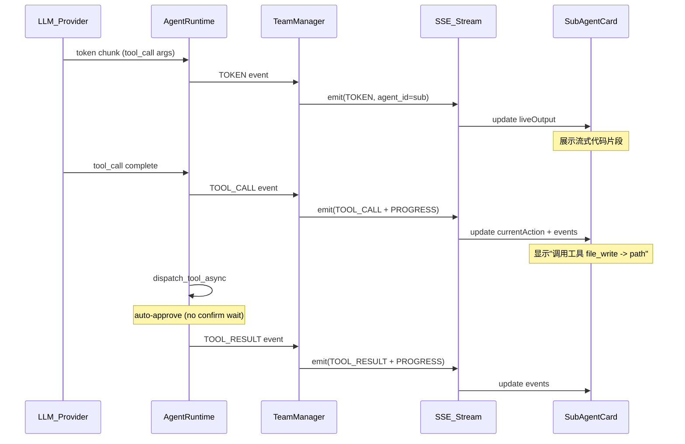

---

name: Sub-agent speed and streaming
overview: 解决子智能体执行慢、无流式代码可见性、畸形 tool_call 导致 loop-critical 失败的三大核心问题。
todos:

- id: p0-max-tokens
content: "P0: agent_runtime.py 全局 max_tokens 从 1200 提升到 8192"
  status: pending
  - id: p1-auto-approve
  content: "P1: 新增 AutoApproveConfirmGate，子智能体跳过 confirm 弹窗"
  status: pending
  - id: p2-malformed-repair
  content: "P2: dispatch_tool_async 中对 file_write 畸形参数做修复合并"
  status: pending
  - id: p3-progress-signal
  content: "P3: LoopDetector 将 file_write OK 成功返回也计为 progress"
  status: pending
  - id: p4-token-streaming
  content: "P4: 后端转发 TOKEN 事件 + 前端 SubAgentCard 展示实时输出"
  status: pending
  isProject: false

---

# 子智能体执行体验全链路优化

## 问题根因分析（从日志中确认）

### 根因 1：模型推理用的是同步 invoke，非流式 -- 这就是"看不到代码生成过程"的原因

[agent_runtime.py](agenticx/runtime/agent_runtime.py) 第 482-490 行：

```python
invoke_task = asyncio.create_task(
    asyncio.to_thread(
        self.llm.invoke,          # <-- 非流式调用
        messages,
        tools=active_tools,
        tool_choice="auto",
        temperature=0.2,
        max_tokens=1200,          # <-- 每次最多 1200 token
    )
)
```

模型在生成一个 200 行 Python 文件的 tool_call 时，全程阻塞无输出。前端只能看到 `⏳` 占位符，直到整个 invoke 完成才一次性返回。

### 根因 2：max_tokens=1200 严重限制了单次文件产出

一个 100 行 Python 文件约需 800-1500 token。`max_tokens=1200` 意味着模型经常写到一半被截断，然后下一轮重新写同一个文件。这就是日志中看到 `report_generator.py` 被反复重写 3-4 次的原因。

### 根因 3：zhipu/glm-5 生成畸形 tool_call -- 日志中的铁证

日志显示模型生成了这种 JSON：

```json
{"path":"...", "content":"...", "WebScraperTool":"class定义...", "ResearchTopic":"class定义..."}
```

即：把 Python class 定义当做 JSON key 塞进了 arguments。`file_write` 只读 `path` 和 `content`，其余内容被丢弃。然后模型发现写出的文件不完整，又重写，又被截断/畸形...循环浪费轮次。

### 根因 4：每次 file_write 都要等 confirm 审批

子智能体写一个文件需要等 confirm 弹窗（虽然有 8s 自动通过，但排队+网络延迟实际开销更大）。写 8 个文件 = 至少 60s+ 纯等审批。

### 根因 5：LoopDetector 的 "no_progress" 判定只看 artifacts/scratchpad hash

畸形 `file_write({})` 失败不改变 artifacts -> 被计为"无进展" -> 连续 8 次触发 critical 终止。但这 8 次中有些调用实际已成功写入文件。

---

## 修复计划（按优先级排序）

### P0: 全局 max_tokens 提升到 8192

- 文件：[agent_runtime.py](agenticx/runtime/agent_runtime.py) 第 489 行和第 580 行
- 改动：将 `max_tokens` 从 1200 统一提高到 8192（Meta-Agent 和子智能体都适用）
- 理由：1200 太小，任何模型生成稍长内容都会被截断；8192 是当前主流模型的安全下限
- 效果：一次 invoke 可以写完完整文件，Meta-Agent 也能生成更详细的回复

### P1: 子智能体 confirm 自动通过（不弹窗）

- 文件：[team_manager.py](agenticx/runtime/team_manager.py) 中创建 runtime 时传入的 confirm_gate
- 文件：[confirm.py](agenticx/runtime/confirm.py) 新增 `AutoApproveConfirmGate`
- 改动：子智能体的 confirm_gate 使用 auto-approve 模式（所有操作直接通过，不等 UI 确认）
- 效果：写 8 个文件省掉 60s+ 等待时间

### P2: 畸形 tool_call 参数修复层

- 文件：[agent_tools.py](agenticx/cli/agent_tools.py) 的 `dispatch_tool_async`
- 改动：对 `file_write` 和 `file_edit`，如果 arguments 包含多余 key（非 schema 定义的），尝试将多余内容合并到 `content` 字段
- 逻辑：
  - 提取 `path` 和 `content`
  - 将其余 value（类似 class 定义的字符串）拼接到 `content` 末尾
  - 记录 warning 日志
- 效果：zhipu 等弱模型的畸形调用也能正确写出完整文件

### P3: 改进 LoopDetector 进展信号

- 文件：[agent_runtime.py](agenticx/runtime/agent_runtime.py) 的 `_build_progress_signature`
- 改动：除了 artifacts/scratchpad hash，还将"最近一次 file_write 成功返回 `OK: wrote`" 计为 progress
- 具体：在 dispatch 后检查 result 是否包含 `OK: wrote` 或 `OK: edited`，如果是则标记 `has_progress=True`（即使 artifacts hash 未变，因为 file_write 直接写磁盘不一定立即反映在 session.artifacts）

### P4: Sub-agent TOKEN 事件转发到前端（类 Cursor 流式代码效果）

这是"像 Cursor 一样看到代码生成过程"的核心改动。

**后端**：

- 文件：[team_manager.py](agenticx/runtime/team_manager.py) 的 `_run_subagent` 循环
- 改动：当 `event.type == EventType.TOKEN.value` 时，也通过 `_emit` 转发给前端
- 注意：需要增加节流（每 200ms 批量发一次），避免高频 token 淹没 SSE

**前端**：

- 文件：[SubAgentCard.tsx](desktop/src/components/SubAgentCard.tsx)
- 改动：在展开详情区域底部增加一个"实时输出"区域，显示子智能体的最新文本 token（类似终端输出）
- 文件：[ChatPane.tsx](desktop/src/components/ChatPane.tsx)
- 改动：处理 `payload.type === "token"` 且 `eventAgentId !== "meta"` 时，更新子智能体的 `liveOutput` 字段
- 文件：[store.ts](desktop/src/store.ts)
- 改动：SubAgent 类型增加 `liveOutput?: string` 字段

---

## 事件流改进示意




---

## 预期效果对比

- **修前**：子智能体写 8 个文件，总耗时 ~300s，中途无可见进展，最终 loop-critical 失败
- **修后**：
  - 单文件 invoke 不再截断（4096 tokens），减少重写
  - 确认弹窗自动通过，省掉 ~60s
  - 畸形参数被修复，减少无效轮次
  - 前端可以看到实时代码生成过程
  - 预估总耗时降至 60-90s，且全程可见进展

