# 子智能体用户体验全面优化

## 根因分析

通过代码审查，已确认问题的四个独立根因：

### 根因 1：子智能体不知道自己是谁、在哪里工作

`[agenticx/runtime/team_manager.py](agenticx/runtime/team_manager.py)` 的 `_run_subagent` 调用 `runtime.run_turn()` 时 **没有传入 system_prompt**，因此子智能体使用 `[agenticx/runtime/agent_runtime.py](agenticx/runtime/agent_runtime.py)` 的通用 `_build_agent_system_prompt(session)`。这个 prompt：

- 不包含子智能体的 `name`、`role`、`task`
- 不包含工作目录 / 项目路径
- 不包含任何 workspace 信息

所以子智能体完全不知道自己该在哪个目录下工作，开始"盲人摸象"式探索，从 `/Users/damon/` 开始列目录，消耗大量工具轮次。

### 根因 2：max_tool_rounds 太低，且达到上限后直接死亡

`MAX_TOOL_ROUNDS = 10` 定义在 `[agenticx/runtime/agent_runtime.py](agenticx/runtime/agent_runtime.py)` 第 28 行。子智能体达到 10 轮后直接 yield error 并结束，没有：

- 中间汇报机制（每 N 轮 yield 进度）
- 续跑能力（用户确认后继续执行）
- 根据任务复杂度动态调整上限

对于一个需要"读 README + 分析架构 + 生成多个文件"的研究型任务，10 轮远远不够。

### 根因 3：用户无法与子智能体对话

后端只有 `POST /api/chat`（发给 meta），没有子智能体级别的聊天 API。前端 `ChatRequest` 不含 `agent_id` 字段。`SubAgentCard` 的 `onSelect` 只做高亮，不改变输入目标。

### 根因 4：子智能体失败后没有有效恢复路径

子智能体失败后，meta-agent 收到的 tool_result 只是一段错误文本，没有足够上下文来重试或恢复。用户只能看到 error，无法指导子智能体继续。

---

## 修改方案

### Phase 1：注入工作目录和角色 prompt（解决路径偏航 + 答非所问）

**改动文件**：

- `[agenticx/runtime/team_manager.py](agenticx/runtime/team_manager.py)`
- `[agenticx/runtime/agent_runtime.py](agenticx/runtime/agent_runtime.py)` (新增 helper)
- `[agenticx/cli/studio.py](agenticx/cli/studio.py)` (StudioSession 加 workspace_dir)

**具体做法**：

1. `StudioSession` 增加 `workspace_dir: Optional[str] = None` 字段
2. 新增 `_build_subagent_system_prompt(context, session)` 函数，包含：
  - 子智能体的 name、role、task 明确注入
  - 工作目录约束：`"你的工作目录是 {workspace_dir}，所有文件操作必须限定在此目录下"`
  - 从 base_session 继承的 context_files 摘要
  - 禁止在系统级目录（如 `~`、`/Users/xxx`）随意探索的规则
3. `_run_subagent` 传入 `system_prompt=_build_subagent_system_prompt(context, session)`
4. `server.py` session 创建时设置 `workspace_dir`（读 `AGX_WORKSPACE_ROOT` 或 `os.getcwd()`）

### Phase 2：提升轮次上限 + 中间汇报机制（解决"达到上限即死"）

**改动文件**：

- `[agenticx/runtime/agent_runtime.py](agenticx/runtime/agent_runtime.py)`
- `[agenticx/runtime/team_manager.py](agenticx/runtime/team_manager.py)`

**具体做法**：

1. 将子智能体的 `max_tool_rounds` 提升到 **25**（meta 保持 10）
  在 `_run_subagent` 中构造 `AgentRuntime(llm, context.confirm_gate, max_tool_rounds=25)`
2. 新增"中间检查点"机制：每 8 轮 yield 一个 `subagent_checkpoint` 事件，包含已执行工具列表和中间产物摘要
3. 达到 max_tool_rounds 时，不是直接 error，而是 yield `subagent_paused` 事件，让 meta-agent 可以决定是否 resume（后期 Phase 4 扩展）

### Phase 3：子智能体对话通道（解决"无法与子智能体对话"）

**改动文件**：

- `[agenticx/studio/protocols.py](agenticx/studio/protocols.py)`
- `[agenticx/studio/server.py](agenticx/studio/server.py)`
- `[agenticx/runtime/team_manager.py](agenticx/runtime/team_manager.py)`
- `[desktop/src/components/ChatView.tsx](desktop/src/components/ChatView.tsx)`
- `[desktop/src/components/SubAgentCard.tsx](desktop/src/components/SubAgentCard.tsx)`

**具体做法**：

1. `ChatRequest` 新增 `agent_id: Optional[str] = None`
2. `POST /api/chat` 路由扩展：当 `agent_id` 非空且不是 `"meta"` 时，走子智能体对话路径
3. `AgentTeamManager` 新增 `send_message_to_subagent(agent_id, message)` 方法：将用户消息注入对应子智能体的 `session.agent_messages`，让下一轮 LLM 能看到
4. 前端：当 `selectedSubAgent` 非空时，输入框切换为"对 {子智能体名} 说话"模式，发送时带上 `agent_id`
5. `SubAgentCard` 增加「对话」按钮，点击后激活该子智能体的对话模式

### Phase 4：失败恢复 + 重试机制

**改动文件**：

- `[agenticx/runtime/team_manager.py](agenticx/runtime/team_manager.py)`
- `[agenticx/runtime/meta_tools.py](agenticx/runtime/meta_tools.py)`
- `[desktop/src/components/SubAgentCard.tsx](desktop/src/components/SubAgentCard.tsx)`

**具体做法**：

1. `SubAgentCard` 增加「重试」按钮（状态为 failed/completed 时可见）
2. `META_AGENT_TOOLS` 新增 `retry_subagent` 工具
3. `AgentTeamManager` 新增 `retry_subagent(agent_id, refined_task=None)`：
  - 保留原有 context_files 和 artifacts
  - 用新/原 task 重新 spawn
  - 将上一轮 error_text 注入新 session 的 context 避免重蹈覆辙
4. 后端新增 `POST /api/subagent/retry` endpoint

---

## 实施优先级

Phase 1 和 Phase 2 是必须先做的（直接解决用户截图中的路径偏航和轮次超限问题），Phase 3 和 Phase 4 是体验增强。

```mermaid
gantt
    title 实施顺序
    dateFormat X
    axisFormat %s
    section Phase1
    StudioSession加workspace_dir     :p1a, 0, 1
    新增subagent_system_prompt        :p1b, 1, 3
    server初始化workspace_dir         :p1c, 3, 4
    section Phase2
    子智能体max_tool_rounds提到25     :p2a, 4, 5
    中间检查点事件                     :p2b, 5, 7
    section Phase3
    ChatRequest加agent_id             :p3a, 7, 8
    后端子智能体对话路由              :p3b, 8, 10
    前端对话模式切换                  :p3c, 10, 13
    section Phase4
    重试机制后端                      :p4a, 13, 15
    重试按钮前端                      :p4b, 15, 16
```

## 预期效果

- 子智能体在启动瞬间就知道"我是 researcher-core，我应该在 `/Users/damon/myWork/AgenticX/examples/test_desktop_app/` 里工作"
- 复杂任务有 25 轮空间，中间有检查点汇报
- 用户可以直接点击子智能体卡片与其对话，纠偏或补充指令
- 失败的子智能体可以一键重试，携带上一轮经验

