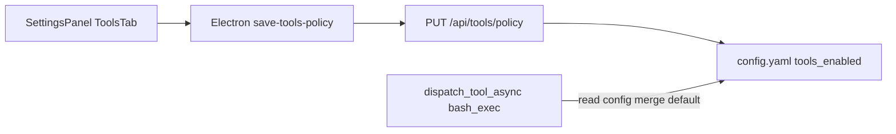

# 预置工具高级配置：放哪、配什么、如何生效

## 现状（代码事实）

- 设置页「预授权工具」由 [`desktop/src/components/SettingsPanel.tsx`](desktop/src/components/SettingsPanel.tsx) 中 `ToolsTab`（约 1363–1410 行）渲染：每行 **开关 + 文案**，`toggleTool` 调用 `saveToolsPolicy({ tools_enabled })`。
- Desktop IPC [`desktop/electron/main.ts`](desktop/electron/main.ts) `save-tools-policy` → `PUT /api/tools/policy`，body 仅含 `tools_enabled`。
- 后端 [`agenticx/studio/server.py`](agenticx/studio/server.py) `_sanitize_tools_enabled` / `_save_global_tools_policy` 将 `tools_enabled` 限制为 **`dict[str, bool]`**，写入 `ConfigManager.set_value("tools_enabled", ...)`（[`~/.agenticx/config.yaml`](agenticx/cli/config_manager.py)）。
- `bash_exec` 超时在 [`agenticx/cli/agent_tools.py`](agenticx/cli/agent_tools.py) `_tool_bash_exec`：`timeout_sec = int(arguments.get("timeout_sec", 30) or 30)`，**与设置页无连接**。

## 46 个工具是否都要有配置？

**不需要。** 建议：

- **默认**：仍只有 **启用/禁用**（与现有一致），避免列表变成 46 个「空折叠面板」。
- **按需白名单**：仅对 **确有用户可改运行时参数** 的工具展示「高级设置」折叠区。首期唯一高价值项：**`bash_exec` 默认超时（秒）**（解决 `claude -p` 等长任务 180s 杀进程问题）。
- **后续候选**（同一机制扩展，不必一次做完）：例如 `cc_bridge_send` 的默认 `wait_seconds`（若希望与 Bridge 对齐）、或 LSP 已有独立 `startup_timeout` 路径，不必重复塞进 Tools 列表。

这与你在 AGENTS.md 中对 **Cherry 式信息密度、内置工具分组可折叠** 的偏好一致：高级项 **默认收起**。

## UI 怎么加（对应你图里箭头位置）

- 在每条工具卡片 **描述下方**、与右侧开关同一卡片内，增加一行 **「高级设置」**（chevron + `defaultCollapsed`），**仅当** `t.name` 属于 `ADVANCED_TOOL_CONFIG` 白名单时渲染。
- 折叠内首版只放：**数字输入「默认超时（秒）」**，附简短说明：*模型仍可在单次调用中传 `timeout_sec` 覆盖；未传时使用此处默认值*。建议合理范围 **30–3600**，与后端 clamp 一致。
- 全局策略仍用 **一个** PUT 保存（见下），避免用户改一个工具要点 46 次保存。

## 配置怎么持久化（避免破坏现有 `tools_enabled`）

**不要**把 `tools_enabled` 的值从 `bool` 改成 object（会破坏 `_sanitize_tools_enabled` 及大量「是否启用」逻辑）。

推荐 **并列命名空间**，例如：

- `tools_options`：`dict[str, Any]`，仅包含有选项的工具，例如  
  `tools_options.bash_exec.default_timeout_sec: 600`  
  或扁平 `runtime.bash_exec_default_timeout_sec`（更简单，但扩展多工具时不如嵌套清晰）。

**API**：扩展 `GET/PUT /api/tools/policy`（[`server.py`](agenticx/studio/server.py) 约 2040–2050 行附近）：

- Response / PUT body 在保留 `tools_enabled` 的同时增加 `tools_options`（或选定键名）。
- 新增 `_sanitize_tools_options`：仅允许白名单 key + 类型校验（防止 YAML 注入怪异结构）。

**Desktop**：扩展 `saveToolsPolicy` / `getToolsPolicy` 的 TypeScript 类型（[`desktop/electron/preload.ts`](desktop/electron/preload.ts)、[`desktop/src/global.d.ts`](desktop/src/global.d.ts)、[`main.ts`](desktop/electron/main.ts) handler body），与后端字段一致。

## 配置如何「直接生效」

- **无需重启 Machi / agx**：在 `_tool_bash_exec` 内 **每次调用**用 `ConfigManager.get_value("tools_options.bash_exec.default_timeout_sec")`（或等价路径）读取默认值；若 `arguments` 已含 `timeout_sec` 则 **仍以模型传入为准**（用户/模型显式覆盖设置页默认）。
- **已发起中的** `bash_exec` 不受影响；**下一笔**工具调用起使用新默认。
- 若希望 UI 保存后立即让当前会话「感知」，现有流程已是：保存成功 → `config.yaml` 已更新 → 下一轮 chat 即新默认值（与 `tools_enabled` 开关生效方式一致）。

## 实现顺序建议（若你后续批准开发）

1. 后端：`tools_options` 读写 + sanitization + `GET/PUT /api/tools/policy` 扩展。  
2. `agent_tools._tool_bash_exec`：合并默认 `timeout_sec`。  
3. Desktop：IPC 类型 + `SettingsPanel` 白名单工具折叠 UI + 与 `policy` 同步加载/保存。  
4. 可选：在 Tools Tab 顶部加一句说明 *「仅部分工具提供高级选项」*，降低「为什么别的没有」的困惑。

## 小结回答你的三个问题

| 问题 | 结论 |
|------|------|
| 怎么加配置？ | 在 Bash 卡片描述下加 **默认收起的「高级设置」**；持久化用 **与 `tools_enabled` 并列的 `tools_options`**（或 `runtime.*` 单键 MVP）。 |
| 配置后怎么生效？ | 写入 `config.yaml` 后，**下一次** `bash_exec` 从配置读默认超时；模型传的 `timeout_sec` 仍可覆盖。无需单独重启（与当前 policy 一致）。 |
| 46 个都要配置吗？ | **否**；仅对 **有真实可调参数** 的工具展示折叠区，其余保持开关即可。 |
