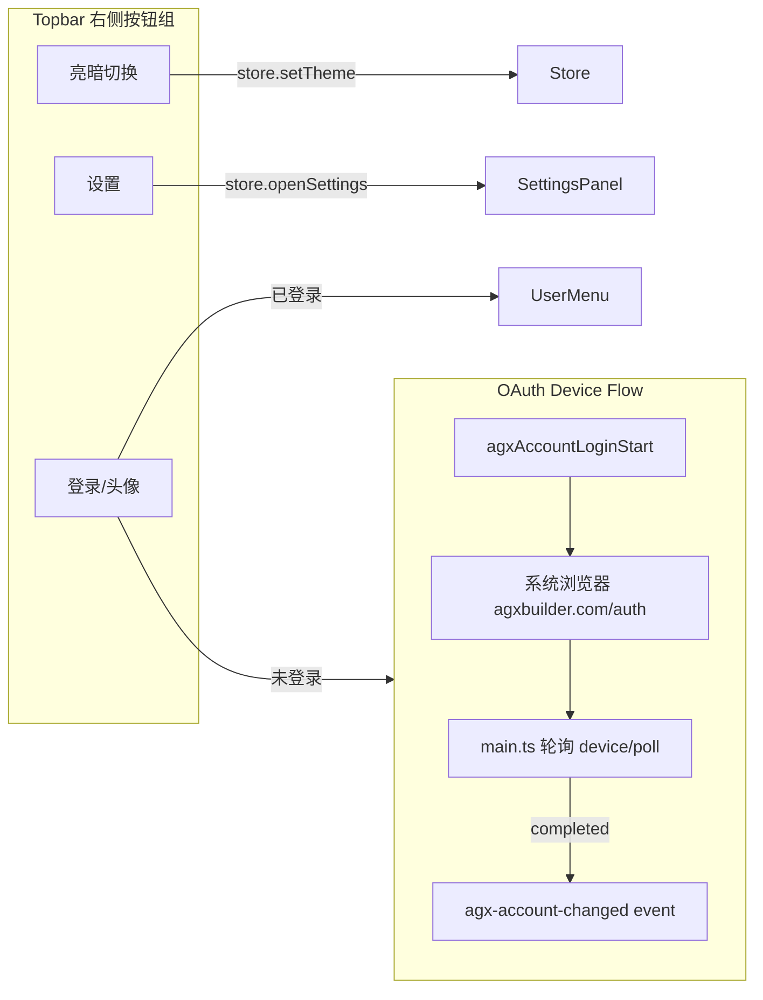

# Topbar 右侧三按钮：主题切换 / 设置 / 登录

## 现状

- **Topbar** (`desktop/src/components/Topbar.tsx`)：仅有左侧折叠侧栏按钮，右侧为空
- **设置入口**：在 `AvatarSidebar.tsx:822-831` 底部，Lite 模式在 `ChatView.tsx:1360`
- **OAuth 登录**：已完整实现 device-flow（`AccountTab.tsx` + `main.ts:2118-2220`），IPC/类型齐全
- **主题切换**：store 有 `theme` + `setTheme`，仅 SettingsPanel 内可操作

## 架构



## 改动文件和步骤

### 1. Store: 新增账号状态 (`desktop/src/store.ts`)

在 store 中新增全局登录状态，供 Topbar 和 Settings 同时消费：

```typescript
// 新增字段
agxAccount: { loggedIn: boolean; email: string; displayName: string };
setAgxAccount: (acct: { loggedIn: boolean; email: string; displayName: string }) => void;
```

### 2. Topbar 改造 (`desktop/src/components/Topbar.tsx`)

将 Topbar 从纯布局组件改为功能区：

- **左侧**：保留侧栏折叠按钮（不变）
- **右侧新增三个按钮**（从左到右）：
  - **主题切换**：Sun/Moon 图标，点击在 dark <-> light 之间切换（简化为两态即可，不走 dim）
  - **设置**：Settings 齿轮图标，调用 `openSettings()`
  - **登录/用户**：
    - 未登录时：显示 `LogIn` 图标 + "登录" 文字，点击触发 OAuth flow
    - 已登录时：显示用户首字母圆形头像 + displayName，点击弹出小菜单（查看账号 / 退出）

新增 props：`theme`, `onThemeToggle`, `onOpenSettings`；内部读 store 的 `agxAccount` 状态。

### 3. AvatarSidebar: 移除底部设置按钮 (`desktop/src/components/AvatarSidebar.tsx`)

删除第 821-831 行的 `{/* Settings entry */}` 区块。设置入口已迁移到 Topbar。

### 4. ChatView (Lite 模式): 替换齿轮按钮 (`desktop/src/components/ChatView.tsx`)

将第 1360 行的齿轮按钮替换为与 Topbar 一致的三按钮组（主题/设置/登录），或直接在 Lite 模式也渲染一个精简版 Topbar。

### 5. App.tsx: 接线 (`desktop/src/App.tsx`)

- 启动时调用 `loadAgxAccount()` 初始化 store 中的账号状态
- 监听 `onAgxAccountChanged` 事件，同步到 store
- 监听 `onAgxAccountLoginTimeout` 事件，弹提示
- 给 Topbar 传入 `theme` / `onThemeToggle` / `onOpenSettings` props

### 6. AccountTab: 可复用（无需大改）

`AccountTab.tsx` 在 SettingsPanel 内继续使用，但同步改为也读 store 中的 `agxAccount` 状态，保持 Topbar 和 Settings 内状态一致。

## 设计决策

- **主题切换简化为 dark/light 两态**：Topbar 按钮空间有限，点击一次切换；dim 模式保留在 Settings "偏好" Tab 中可选
- **登录 OAuth 复用现有 device-flow**：不引入新认证方式，Topbar 登录按钮和 AccountTab 共享同一套 IPC
- **不加登录拦截**：与 TRAE 不同，Machi 的 Settings 全部功能不需要登录即可使用（你的截图是 TRAE 的行为，但 Machi 的模型配置、MCP 等功能本地就能用）。如果你想加"某些 Tab 需要登录"的拦截，请确认
- **Topbar 样式**：参照 TRAE 截图，按钮紧凑排列在右侧，使用 lucide-react 图标
