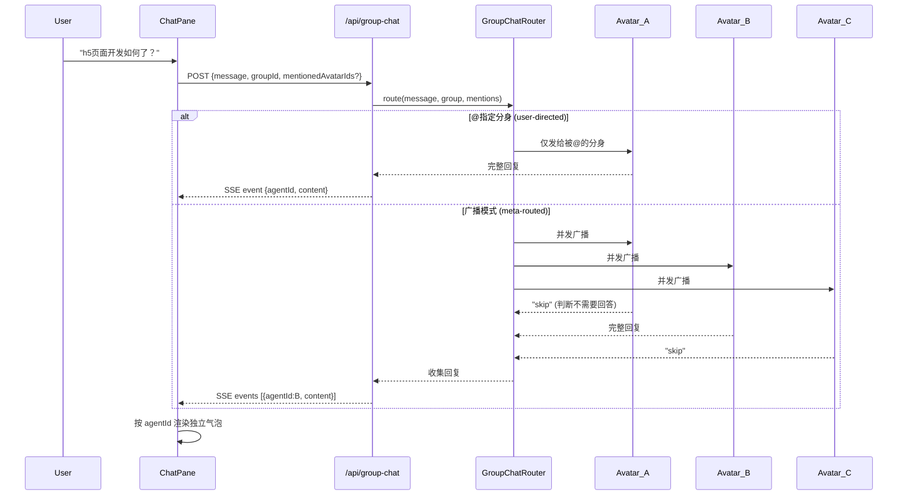

# 微信风格群聊模式重构

## 现状分析

当前群聊实现存在以下差距：

- **单一 Meta-Agent 调度**：用户消息只发给 Meta-Agent，由它决定是否 `delegate_to_avatar`。没有广播机制，没有多 agent 自主决策。
- **@ 只能引用文件**：`AtCandidate` 类型只有 `file` / `taskspace`，不支持 `@avatar`。
- **消息无操作菜单**：ChatPane (Pro) 没有任何消息操作按钮（复制/引用/转发/多选均缺失）。
- **消息不区分 agent**：所有 assistant 消息共用窗格的 `avatarName`/`avatarUrl`，`message.agentId` 仅用于过滤，不用于显示。
- **流式输出**：当前所有回复都是流式 token-by-token 输出。
- `**routing` 策略未实际接入**：`user-directed` / `meta-routed` / `round-robin` 只存在于配置。

## 架构设计

## 实施分 5 个功能块

### 功能块 1：后端群聊路由引擎

**文件**: [agenticx/studio/server.py](agenticx/studio/server.py), 新增 `agenticx/runtime/group_router.py`

- 新增 `/api/group-chat` 端点（或改造现有 `/api/chat` 的群聊分支），接收 `mentioned_avatar_ids: list[str] | None`
- 新增 `GroupChatRouter` 类，根据 `routing` 策略执行不同路由：
  - **user-directed**（用户 @ 了某人）：只调用被 @ 的 avatar(s)
  - **meta-routed**（无 @）：并发调用所有群成员 avatar，每个 avatar 独立判断是否回复（通过系统提示注入"判断自己是否应该回答"的机制，返回 `__SKIP__` 表示跳过）
  - **round-robin**：维护轮次状态，发给下一个 avatar
- 每个 avatar 独立调用 `agent_runtime.run_turn`（非流式模式），回复完整后再发 SSE 事件
- **广播上下文**：用户消息 + 最近 N 条群聊历史（含其他 agent 回复）注入每个 avatar 的 prompt，使其能看到其他 agent 说了什么
- SSE 事件格式扩展：`{type: "group_reply", data: {agent_id, avatar_name, avatar_url, content, skipped}}`

### 功能块 2：@ 提及分身（前端）

**文件**: [desktop/src/components/ChatPane.tsx](desktop/src/components/ChatPane.tsx), [desktop/src/store.ts](desktop/src/store.ts)

- `AtCandidate` 类型新增 `kind: "avatar"` 变体：`{kind: "avatar", avatarId: string, name: string, avatarUrl: string}`
- 群聊窗格中输入 `@` 时，候选列表**优先**显示群成员 avatar（头像 + 名字 + 角色），文件候选放在分割线下方
- 选择 avatar 后，输入框插入 `@name`  文本，并在消息 payload 中附带 `mentioned_avatar_ids`
- 发送时解析输入中的 `@xxx` 提取对应 avatar_ids，传给后端

### 功能块 3：消息右键操作菜单

**文件**: [desktop/src/components/messages/ImBubble.tsx](desktop/src/components/messages/ImBubble.tsx), [desktop/src/store.ts](desktop/src/store.ts), [desktop/src/components/ChatPane.tsx](desktop/src/components/ChatPane.tsx)

- `Message` 类型扩展：
  - `avatarName?: string` — 发送者名称（群聊中每条消息独立）
  - `avatarUrl?: string` — 发送者头像
  - `quotedMessageId?: string` — 引用的消息 ID
  - `quotedContent?: string` — 引用内容预览
- `ImBubble` 添加 hover 操作栏和右键菜单：
  - **复制**：`navigator.clipboard.writeText(content)`
  - **引用**：设置 `ChatPane` 的 `quotingMessage` 状态，输入框上方显示引用条（显示被引用消息的发送者 + 内容预览），发送时附带 `quotedMessageId`
  - **收藏**：调用新增的 `/api/memory/save` 端点，将消息内容存入 agent memory
  - **多选**：进入多选模式，消息左侧出现 checkbox，底部出现操作栏（转发/删除/复制）
  - **转发**：弹出对话框选择目标（其他群聊或单体 avatar session），调用后端将消息插入目标 session
- 群聊中每条 assistant 消息根据 `message.avatarName` / `message.avatarUrl` 渲染**独立的**头像和名字，而不是统一使用窗格的 avatar

### 功能块 4：非流式群聊输出

**文件**: [agenticx/runtime/agent_runtime.py](agenticx/runtime/agent_runtime.py), [desktop/src/components/ChatPane.tsx](desktop/src/components/ChatPane.tsx)

- 后端：群聊路由引擎中每个 avatar 使用 `llm.invoke`（非流式）获取完整回复，回复完成后一次性发送 SSE 事件
- 前端：群聊模式下不使用 `streamedAssistantText` 逐 token 渲染，而是收到完整 `group_reply` 事件后直接 `addPaneMessage` 插入一条完整消息
- 谁先回复完就先展示（先到先显示），正在等待的 avatar 显示类似微信的"正在输入..."指示器
- 回复间不阻塞，多个 agent 的回复可能交错到达

### 功能块 5：群聊上下文管理

**文件**: 新增 `agenticx/runtime/group_context.py`, [agenticx/runtime/prompts/meta_agent.py](agenticx/runtime/prompts/meta_agent.py)

- `GroupChatContext` 管理群聊的统一对话历史（区分每条消息的 sender_id）
- 每个 avatar 被调用时，注入：
  - 系统提示（avatar 自己的角色 + "你在群聊中"的说明）
  - 最近 N 条群聊消息（标注每条消息是谁说的）
  - 被引用的消息（如果用户引用了某条消息）
  - "判断是否应由你回答"的指令（meta-routed 模式下）
- avatar 的回复也写入统一群聊历史，使后续 avatar 调用能看到前序回复

## 实施优先级

1. **功能块 1 + 4**（后端路由 + 非流式）— 核心机制
2. **功能块 2**（@ 提及）— 用户交互基础
3. **功能块 5**（上下文管理）— 群聊质量保证
4. **功能块 3**（消息操作菜单）— UX 增强

## 关键设计决策

- **不再经过 Meta-Agent 中转**：群聊模式下用户消息直接路由到目标 avatar，去掉 Meta-Agent 这一层（meta-routed 模式下由服务端路由器决定发给谁，而非 Meta-Agent 用 tool call 委派）
- **每个 avatar 独立 system prompt**：不再共用 Meta-Agent prompt，而是使用 avatar 自己的角色定义 + 群聊上下文
- **非流式仅限群聊**：单体 avatar 对话仍保持流式输出，只有群聊模式改为非流式
- **消息操作菜单在 ImBubble 层实现**：因为群聊固定使用 IM 风格，不需要在 TerminalLine/CleanBlock 中实现

