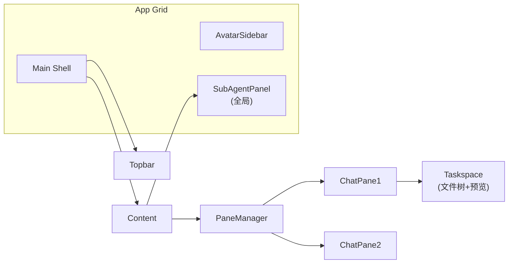
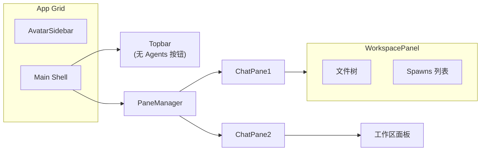

# 工作区面板重构：SubAgent 内嵌到每个窗格

## 当前架构



SubAgent 是全局右侧面板，与具体窗格无关 -- 多窗格时看不出哪个 spawn 属于谁。

## 目标架构



每个 ChatPane 打开"工作区"时，右侧面板上半部分是文件树，下半部分是该窗格的 Spawns 列表（可拖拽调节分栏比例）。

## 关键变更

### 1. 重命名 "目录" 为 "工作区"

- [ChatPane.tsx](desktop/src/components/ChatPane.tsx) L1093: 按钮文案 `目录` -> `工作区`
- 仅文案变更，不改变量名

### 2. 将 SubAgent 数据绑定到 Pane

当前 `subAgents` 在 Zustand store 中是全局数组。不重构数据模型，而是在渲染时按 `sessionId` 过滤：

- 每个 `SubAgent` 已有 `sessionId` 字段
- 每个 `ChatPane` 已有 `pane.sessionId`
- 在 WorkspacePanel 中：`subAgents.filter(s => s.sessionId === pane.sessionId)` 即可过滤出该窗格的 spawn

无需改 store 结构。

### 3. 新建 WorkspacePanel 组件

新建 [desktop/src/components/WorkspacePanel.tsx](desktop/src/components/WorkspacePanel.tsx)，替代当前 `TaskspacePanel` 在 ChatPane 中的位置。

布局：上下分栏（可拖拽 divider）

```
+---------------------------+
|  [文件树 Tab] [刷新] [+]  |  <-- 顶部工具栏
|  /src                     |
|    agent.py               |  <-- 文件树区域（flex: 1）
|    chat.py                |
|---------------------------|  <-- 可拖拽分隔条
|  Spawns (2)               |  <-- Spawns 标题 + 计数
|  [SubAgentCard]           |  <-- SubAgent 卡片列表
|  [SubAgentCard]           |
+---------------------------+
```

- 上半部分：复用现有 `TaskspacePanel` 的文件树逻辑（去掉底部的文件预览区域）
- 下半部分：复用现有 `SubAgentCard` 组件渲染 spawns 列表
- 文件预览：点击文件时弹出浮层（popover/modal），而不是常驻占位

### 4. 从 TaskspacePanel 中拆出文件预览

当前 `TaskspacePanel` 底部有常驻的 `文件预览` 区域。改为：

- 默认不显示预览区域
- 点击文件时，在 WorkspacePanel 上方弹出一个浮层覆盖式的预览面板（absolute 定位），带关闭按钮
- 预览面板的代码高亮逻辑（Prism）保持不变

### 5. 删除全局 SubAgentPanel 和右侧面板

- [App.tsx](desktop/src/App.tsx): 删除 `<SubAgentPanel>` 和 `agx-right-panel-slot` 的渲染
- [App.tsx](desktop/src/App.tsx): 删除 `subPanelOpen` state 和 `--right-panel-width` CSS 变量控制
- [Topbar.tsx](desktop/src/components/Topbar.tsx): 删除 Agents 按钮及相关 props（`rightPanelOpen`, `onToggleRightPanel`）
- [base.css](desktop/src/styles/base.css): 删除 `.agx-right-panel-slot` 和 `.agx-subagent-panel` 样式
- **不删除** `SubAgentPanel.tsx` 文件本身（保留备用），但不再在 App 中渲染

### 6. ChatPane 中接入 WorkspacePanel

在 [ChatPane.tsx](desktop/src/components/ChatPane.tsx) 中：

- 将当前的 `{pane.taskspacePanelOpen ? <TaskspacePanel .../> : null}` 替换为 `{pane.taskspacePanelOpen ? <WorkspacePanel .../> : null}`
- 传入 props: `sessionId`, `activeTaskspaceId`, `subAgents`（已按 sessionId 过滤）, `onCancel`, `onRetry`, `onChat`, `onSelect`, `onConfirmResolve`
- 按钮文案 `目录` -> `工作区`

### 7. SubAgent 操作回调传递

当前 `cancelSubAgent` / `retrySubAgent` / `resolveSubAgentConfirm` 等函数定义在 App.tsx。需要：

- 通过 `onOpenConfirm` 类似的 props 链传到 ChatPane
- 或者直接在 ChatPane 中读 store + 调 API（ChatPane 已有 `apiBase` / `apiToken`）

推荐后者：ChatPane 已有直接调 API 的模式（SSE streaming），SubAgent 操作逻辑可以直接内联，避免多层 props 传递。

## 不做的事情

- 不改 Zustand store 的 `subAgents` 数据结构（保持全局数组，渲染时 filter）
- 不改后端 SubAgent 生命周期逻辑
- 不改 SubAgentCard 组件本身
- 不重构 TaskspacePanel 内部的文件树/刷新/添加逻辑（只拆出预览部分）
