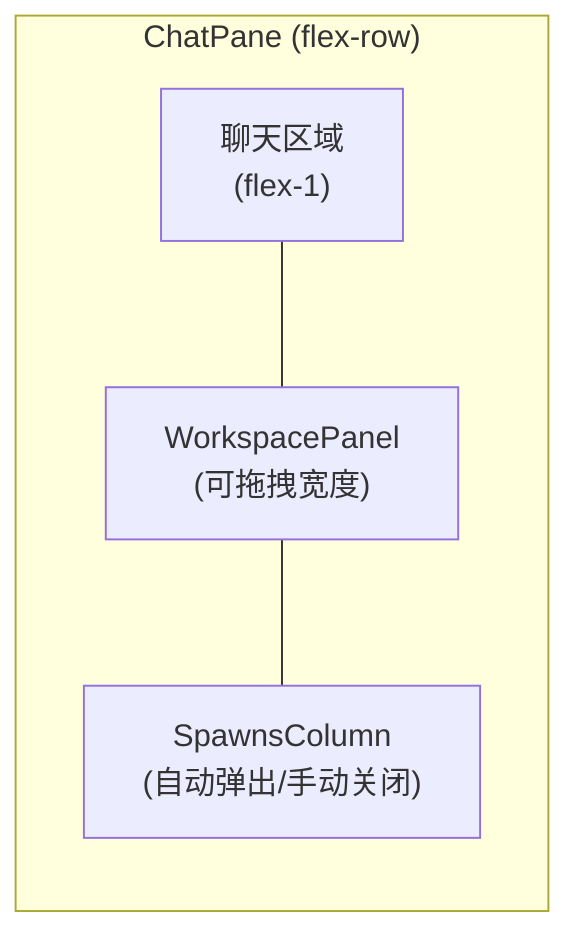
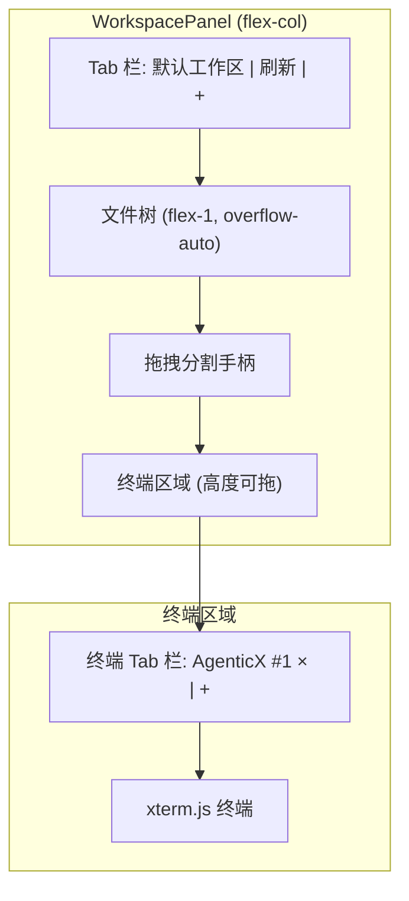

# Workspace / Spawns / Terminal 布局重构

## 现状分析

当前 `ChatPane.tsx` 的右侧面板结构：

```
ChatPane (flex-row)
├── 聊天区域 (flex-1)
└── workspacePanelOpen ? WorkspacePanel (一列，含底部 Spawns)
```

`[WorkspacePanel.tsx](desktop/src/components/WorkspacePanel.tsx)` 内部布局（上下分割）：

- 上半部分：工作区 tab 栏 + 文件树
- 分割手柄
- 下半部分：Spawns 区域（`SubAgentCard` 列表）
- 文件预览覆盖层（absolute）

工作区 tab 右键目前直接调用 `window.confirm("确认移除该工作区吗？")` 并执行删除，没有自定义上下文菜单。

目前 **没有** 任何终端组件或 `node-pty` / `xterm.js` 依赖。

## 改动方案

### 1. Spawns 独立为右侧第三列

**改动文件**: `[ChatPane.tsx](desktop/src/components/ChatPane.tsx)` (L3072-3149), `[base.css](desktop/src/styles/base.css)`

将 `ChatPane` 的 JSX 从现在的"聊天区 + WorkspacePanel"两列改为三列：

```
ChatPane (flex-row)
├── 聊天区域 (flex-1)
├── workspacePanelOpen ? WorkspacePanel (不含 Spawns)
└── spawnsColumnOpen ? SpawnsColumn (新独立列)
```

- 从 `WorkspacePanel` 中 **移除** 所有 subAgents 相关 props 和底部 Spawns 区域
- 新建 `SpawnsColumn.tsx`，独立渲染 Spawns 列表（复用 `SubAgentCard`）
- 触发逻辑：当 `paneSubAgents.length > 0` 时自动展开 Spawns 列；同时提供手动关闭按钮（在列顶部），关闭后不再自动弹出直到用户手动重开或下次有新 spawn
- 在 pane state 中新增 `spawnsColumnOpen: boolean` 字段（store.ts），持久化到 workspace state

### 2. 工作区 tab 右键改为自定义上下文菜单

**改动文件**: `[WorkspacePanel.tsx](desktop/src/components/WorkspacePanel.tsx)` (L392 `onContextMenu`)

当前：`onContextMenu` 直接调用 `removeTaskspace(item.id)`

改为：弹出类似图三的自定义菜单组件，菜单项：

- **删除工作区** -- 调用现有 `removeTaskspace`
- **在此目录下打开终端** -- 用工作区的 `item.path` 打开一个内嵌终端

菜单样式参考图三：深色背景圆角弹出框，每项带 hover 高亮，点击后自动关闭，外部点击关闭。

新建一个轻量的 `ContextMenu.tsx` 通用组件（position absolute，根据鼠标坐标定位）。

### 3. 终端嵌入 WorkspacePanel 底部（原 Spawns 位置）

**改动文件**: `[WorkspacePanel.tsx](desktop/src/components/WorkspacePanel.tsx)`

原来底部放 Spawns 的区域，改为放内嵌终端：

```
WorkspacePanel (flex-col)
├── 工作区 tab 栏 + 文件树 (flex-1)
├── 分割手柄（保留，改 title）
└── 终端区域 (高度可拖拽)
    ├── 终端 tab 栏（每个 tab 显示目录名，可关闭，可新增同级终端）
    └── 终端输出区域
```

**终端实现方案**（无 `node-pty`/`xterm.js` 依赖的轻量方案）：

由于当前 Desktop 没有 pty 依赖，采用 Electron IPC + `child_process.spawn` 的方案：

- **Electron 主进程** (`[main.ts](desktop/electron/main.ts)`)：新增 IPC handler `terminal:spawn(cwd)` / `terminal:write(id, data)` / `terminal:kill(id)` / `terminal:resize(id, cols, rows)`，使用 `node-pty`（需新增依赖）创建伪终端
- **Preload** (`[preload.ts](desktop/electron/preload.ts)`)：暴露 `agenticxDesktop.terminalSpawn` / `.terminalWrite` / `.terminalKill` 等方法
- **前端**: 新增 `TerminalEmbed.tsx` 组件，使用 `@xterm/xterm`（需新增依赖）渲染终端

### 4. 同级目录新增终端的交互

在终端 tab 栏右侧放一个 **「+」** 按钮：

- 点击 **「+」** → 在当前活跃工作区的同级目录下新开一个终端（即 `cwd` 与当前活跃工作区 `path` 相同）
- 每个终端 tab 显示 `目录名 (#序号)`，如 `AgenticX (#2)`
- 终端 tab 支持点击关闭（×）

Store 中在 pane 级别维护 `terminals: Array<{ id: string; cwd: string; label: string }>` 和 `activeTerminalId: string | null`。

### 5. 依赖新增

```
npm install --save node-pty @xterm/xterm @xterm/addon-fit
```

- `node-pty`: Electron 主进程中创建伪终端
- `@xterm/xterm` + `@xterm/addon-fit`: 渲染器进程中渲染终端 UI

## 文件变更清单


| 文件                                          | 变更类型   | 说明                                                                |
| ------------------------------------------- | ------ | ----------------------------------------------------------------- |
| `desktop/package.json`                      | 修改     | 新增 `node-pty`, `@xterm/xterm`, `@xterm/addon-fit`                 |
| `desktop/src/store.ts`                      | 修改     | pane state 新增 `spawnsColumnOpen`, `terminals`, `activeTerminalId` |
| `desktop/src/components/WorkspacePanel.tsx` | **大改** | 移除 subAgents 相关 props 和底部 Spawns；底部改为终端区域；右键改为自定义菜单               |
| `desktop/src/components/SpawnsColumn.tsx`   | **新建** | 独立的 Spawns 列组件                                                    |
| `desktop/src/components/ContextMenu.tsx`    | **新建** | 通用右键菜单组件                                                          |
| `desktop/src/components/TerminalEmbed.tsx`  | **新建** | xterm.js 终端渲染组件                                                   |
| `desktop/src/components/ChatPane.tsx`       | 修改     | 三列布局（聊天 + 工作区 + Spawns）；Spawns 自动弹出逻辑                             |
| `desktop/electron/main.ts`                  | 修改     | 新增终端 IPC handlers                                                 |
| `desktop/electron/preload.ts`               | 修改     | 暴露终端相关 API                                                        |
| `desktop/src/global.d.ts`                   | 修改     | 类型声明                                                              |
| `desktop/src/styles/base.css`               | 可能修改   | Spawns 列样式                                                        |
| `desktop/src/App.tsx`                       | 修改     | `PersistedPaneState` 新增 `spawnsColumnOpen` 持久化                    |


## 布局示意







