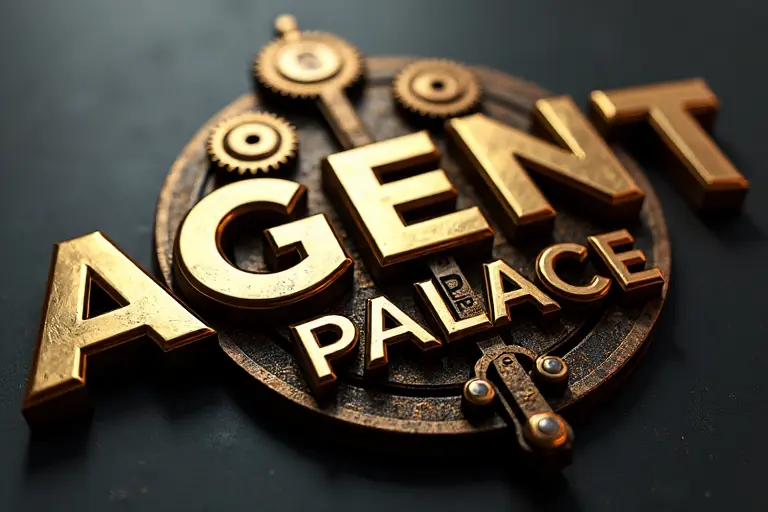

# AgentPalace 🏰



AgentPalace is a premier platform for crafting sophisticated AI and LLM agents. By incorporating the LLMOps development philosophy, it enables coordinated management of multiple LLM agents, empowering users to create and refine agents that seamlessly blend human-like interaction with advanced data capabilities, unlocking new possibilities across various domains.

## 🌟 Key Features

- **智能代理编排**: 可视化界面轻松创建和管理多个 LLM 代理
- **灵活的代理模板**: 内置多种预设模板，快速构建特定场景的 AI 代理
- **多模型支持**: 支持 GPT-4、Claude、LLaMA 等主流大语言模型
- **代理协作系统**: 实现多个代理之间的智能协作和任务分发
- **性能监控**: 实时监控代理性能指标和资源使用情况
- **版本控制**: 完整的代理版本管理，支持回滚和 A/B 测试

## 🚀 快速开始

### 安装

```bash
pip install agentpalace
```

### 基础使用

```python
from agentpalace import AgentBuilder

# 创建一个基础代理
agent = AgentBuilder.create("my_first_agent")
    .with_model("gpt-4")
    .with_template("customer_service")
    .build()

# 启动代理
agent.start()
```

## 📚 使用场景

- **客户服务**: 智能客服代理，提供 24/7 支持
- **数据分析**: 数据处理和分析代理
- **内容创作**: 多语言内容生成和编辑
- **知识管理**: 智能知识库管理和问答系统
- **流程自动化**: 业务流程自动化代理

## 🛠 系统要求

- Python 3.10+
- 8GB+ RAM
- 支持主流操作系统 (Windows/Linux/MacOS)

## 📖 文档

详细文档请访问 [docs.agentpalace.ai](https://docs.agentpalace.ai)

## 🤝 贡献指南

我们欢迎社区贡献！请查看 [CONTRIBUTING.md](CONTRIBUTING.md) 了解如何参与项目开发。

## 📄 许可证

本项目采用 MIT 许可证 - 详见 [LICENSE](LICENSE) 文件

## 🔗 相关链接

- [官方网站](https://agentpalace.ai)
- [技术博客](https://blog.agentpalace.ai)
- [社区论坛](https://community.agentpalace.ai)

## 📮 联系我们

- Email: support@agentpalace.ai
- Twitter: [@AgentPalace](https://twitter.com/AgentPalace)
- Discord: [AgentPalace Community](https://discord.gg/agentpalace)

## ⭐ Star History

[](https://star-history.com/#agentpalace/agentpalace&Date)