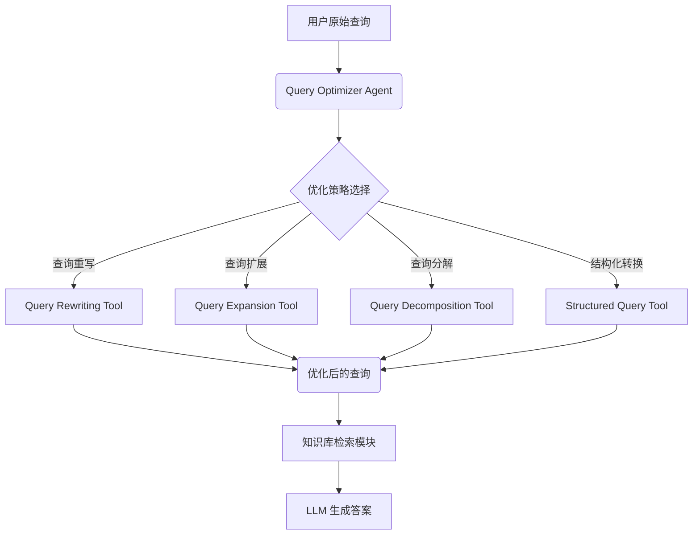

# Query Optimizer Agent 建设规划

## 1. 简介

Query Optimizer Agent 是一个专门用于在 RAG (Retrieval-Augmented Generation) 流程中优化用户查询的智能体。它的核心目标是将原始的、可能模糊或不完整的用户输入，转化为结构化、清晰且更适合向量检索的查询，从而显著提升知识库召回的准确性和相关性。

## 2. Agent 目标与职责

*   **提升检索准确性**: 通过查询重写、扩展和分解，生成高质量的检索指令。
*   **增强语义理解**: 理解用户真实意图，处理复杂的、多跳的或隐含的查询。
*   **动态适应**: 根据查询的不确定性和上下文，决定是否以及如何触发检索。
*   **结构化转换**: 在需要时将自然语言查询转换为结构化查询语言（如 SQL, Cypher）。
*   **反馈优化**: 利用初步检索结果迭代式地优化查询。

## 3. 架构设计

Query Optimizer Agent 将作为 AgenticX 框架中的一个核心组件，嵌入在用户查询和知识库检索之间。

## 4. 核心能力与工具 (Tools)

为了实现上述目标，Query Optimizer Agent 将配备一系列专用工具，这些工具将作为 `agenticx.tools` 的一部分被实现。

### 4.1. `query_rewriting_tool`

*   **功能**: 修正和重构查询。
*   **子功能**:
    *   `contextual_rewrite`: 结合对话历史，将 "它怎么样了？" 这样的模糊问题重写为 "XX产品2024年的定价方案"。
    *   `hyde_generate`: (Hypothetical Document Embeddings) - 根据原始查询生成一个假设性的答案文档，并使用该文档的向量进行检索。
    *   `fix_spelling_grammar`: 自动进行拼写和语法纠正。

### 4.2. `query_expansion_tool`

*   **功能**: 扩展查询的语义边界，提高召回率。
*   **子功能**:
    *   `expand_with_synonyms`: 利用词向量或同义词词典（如 WordNet）为查询增加同义词或近义词。
    *   `generate_multiple_queries`: 使用 LLM 从单一问题生成多个不同角度的相关问题，进行多路检索。
    *   `add_term_weights`: 识别并增加查询中关键术语的权重。

### 4.3. `query_decomposition_tool`

*   **功能**: 将复杂问题分解为多个可独立检索的原子查询。
*   **子功能**:
    *   `decompose_multi_hop_question`: 将 "为什么健康饮食后仍感觉疲劳？是否应尝试生酮饮食？" 分解为多个子问题。
    *   `route_sub_queries`: (未来规划) 将不同的子查询路由到最合适的数据源（例如，一个子查询发往向量数据库，另一个发往 SQL 数据库）。

### 4.4. `adaptive_retrieval_tool`

*   **功能**: 智能判断何时需要触发外部知识检索。
*   **子功能**:
    *   `check_uncertainty`: 当 Agent 对内部知识的回答置信度较低时，触发此工具进行外部检索。
    *   `analyze_semantic_importance`: 识别查询中需要通过检索来补充信息的关键部分。

### 4.5. `structured_query_tool`

*   **功能**: 将自然语言转换为结构化查询语言。
*   **子功能**:
    *   `text_to_sql`: 将 "上个季度销售额最高的产品是什么？" 转换为 SQL 查询。
    *   `text_to_cypher`: 将 "马斯克拥有哪些公司？" 转换为图数据库的 Cypher 查询。

## 5. 集成与工作流

1.  **定义 `QueryOptimizerAgent`**: 在 `agenticx/agents/` 目录下创建一个新的 Agent，继承自 `core.Agent`。
2.  **实现 `QueryTools`**: 在 `agenticx/tools/` 目录下创建 `query_tools.py`，并使用 `@tool` 装饰器实现上述所有工具函数。
3.  **创建工作流 (Workflow)**:
    *   设计一个工作流，其中第一个节点是 `QueryOptimizerAgent`。
    *   `QueryOptimizerAgent` 接收原始用户查询，并调用其内部的 `QueryTools`。
    *   该 Agent 的输出（一个或多个优化后的查询）将被传递给下一个节点，通常是一个 `RetrievalAgent` 或直接的知识库检索工具。
4.  **执行与评估**: 通过端到端的示例来运行和评估整个 RAG 流程，对比优化前后的检索效果和最终答案质量。

## 6. 实施路线图

*   **阶段一 (MVP)**:
    *   实现 `QueryOptimizerAgent` 的基本结构。
    *   实现核心的 `query_rewriting_tool` 和 `query_expansion_tool`。
    *   构建一个简单的端到端工作流进行验证。
*   **阶段二 (功能完善)**:
    *   实现 `query_decomposition_tool` 和 `structured_query_tool`。
    *   引入对多跳问题和结构化数据的支持。
*   **阶段三 (高级优化)**:
    *   实现 `adaptive_retrieval_tool`，让检索更加智能。
    *   探索基于检索反馈的迭代式查询优化 (`IRCoT`)。
    *   针对特定领域进行嵌入模型微调和术语库注入。