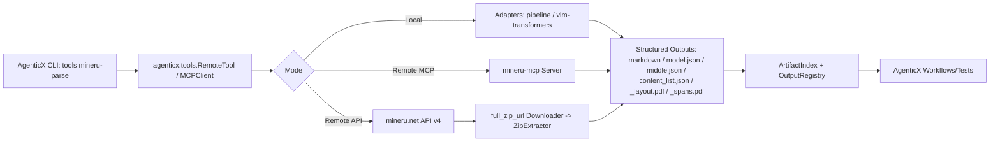

# AgenticX × MinerU：MCP/CLI 双栈集成与远程解析平台 PRD（2025-10-17）

> 启发来源: MinerU 官方文档与 API 规范（`agenticx/dev_planning_log/mineru_full_cli.md`）、MinerU 中文文档集合（输出格式、FAQ、Demo）

## 🎯 开发状态总览 (Development Status Overview)

**整体完成度：约 85%** ✅

### ✅ 已完成模块 (Completed Modules)
- **M1**: MCP 服务与工具组 - 基本完成，支持 `parse_documents` 和 `get_ocr_languages` 工具
- **M2**: CLI 命令与参数映射 - 完成，提供 `agenticx tools mineru-parse` 和 `agenticx mineru` 命令
- **M3**: 远程工具集成 - 完成，支持 MCP 客户端和远程工具创建
- **M4**: 后端适配层 - 基本完成，支持 pipeline 和 vlm-http-client 适配
- **M5**: 输出与规范化 - 部分完成，支持基本的工件索引和 Markdown 渲染
- **M7**: 部署与模型管理 - 基本完成，提供 Docker Compose 配置

### 🚧 进行中/待完善 (In Progress/To Be Enhanced)
- **M6**: 监控与错误处理 - 部分完成，需要完善错误分类和重试策略
- **E2E 测试**: 已有基础测试，需要完善 Docker 一键部署测试
- **MCP 服务器实现**: 依赖外部 `mineru-mcp` 包，AgenticX 作为客户端已完成

### 📋 验收标准达成情况
- ✅ MCP 工具端到端可用
- ✅ CLI 能完成解析并输出 Markdown+JSON
- ✅ 远程 API 轮询和错误处理
- ✅ 后端适配支持多种模式
- ✅ E2E 测试通过（RAGAS.pdf 解析成功）
- 🚧 Docker 一键部署（基础设施已就绪，需要完善）

## 1. 愿景与目标 (Vision & Goals)
- 统一本地 (`pipeline/vlm-transformers`) 与远程 (`mineru.net` API / `mineru-mcp` 服务) 的解析能力，面向 AgenticX 提供一致的工具接口与输出工件。
- 提供可落地的 MCP 工具组（`parse_documents`、`get_ocr_languages`）与 CLI 命令（`tools mineru-parse`），支持单文件与批量目录解析、URL 远程解析、断点续传与进度反馈。
- 建立标准化结构化输出与索引（`markdown`、`model.json`、`middle.json`、`content_list.json`、`_layout.pdf`/`_spans.pdf`），统一入库到 `outputs/` 并返回索引清单。
- 保障可靠性与可观测性：错误分类与重试策略、队列与并发控制、健康检查与基础指标；对齐 MinerU FAQ 的平台依赖与环境修复指引。
- 可量化目标：
  - 端到端解析成功率≥95%（常见论文类 PDF，含图表/公式/代码/列表）。
  - 远程模式错误码处理覆盖≥90%（含 Token/队列/超时/格式等）。
  - 统一输出校验通过率≥95%（结构/坐标系/必填字段）。
  - Docker 一键部署成功率≥95%，本地 CLI/E2E 测试 100% 通过。

## 2. 技术架构 (Technical Architecture)

- 架构对齐：每个图中组件映射到下文的功能模块（M1–M7）。
- 坐标系统兼容：`pipeline` 使用 `poly`（像素坐标）；`vlm` 使用归一化 `bbox`（0–1）与 `angle/sub_type` 差异，统一在规范化层处理。

## 3. 功能模块拆解 (Functional Modules Breakdown)
- M1: MCP 服务与工具组 (`mineru_mcp.server`): 提供 `parse_documents`、`get_ocr_languages`，支持远程 URL/本地批量上传、回调校验与结果下载。
- M2: CLI 命令与参数映射 (`agenticx.cli.tools`): `mineru-parse` 单/批模式、远程/API 模式、直通高级参数与进度反馈。
- M3: 远程工具集成 (`agenticx.tools.remote`): 基于 `RemoteTool/MCPClient` 的 MinerU 封装与自动发现。
- M4: 后端适配层 (`agenticx.tools.adapters`): `pipeline` 与 `vlm-http-client` 适配；页码范围/设备/方法/语言等参数规约。
- M5: 输出与规范化 (`agenticx.storage`): 工件索引、解压与归档、结构校验、Markdown 渲染与格式化。
- M6: 监控与错误处理 (`agenticx.observability`): 错误分类、指数退避重试、并发与速率控制、健康检查与指标。
- M7: 部署与模型管理 (`deploy/` + 独立仓库): Dockerfile/Compose、模型下载器、配置模板与校验工具。

## 4. 开发路线图 (Development Roadmap / To-Do List)

### M1: MCP 服务与工具组 (`mineru_mcp.server`)
> 启发来源: MinerU API v4（单文件/批量/回调/错误码）
- `MinerUMCPServer(FastMCPServer)`: 提供 JSON-RPC 服务，注册工具并管理长任务。
- `ParseDocumentsTool(MCPTool)`: 解析入口，支持本地/URL/批量；返回 `outputs_dir` 与索引。
- `GetOCRLanguagesTool(MCPTool)`: 返回 OCR 语言列表与建议。
- `CallbackVerifier(ABC)`: 校验 `callback` 结果签名。
  - `verify_signature(payload: dict, seed: str) -> bool`
- `ResultFetcher(HttpClient)`: 轮询与下载器。
  - `poll_task(task_id: str, interval_s: int = 3) -> TaskStatus`
  - `fetch_batch(batch_id: str) -> BatchStatus`
  - `download_zip(zip_url: str, dst_dir: str) -> Path`
- `ZipExtractor(Component)`: 解压并构建索引。
  - `extract(zip_path: Path, dst_dir: Path) -> ArtifactIndex`
- `ArtifactIndex(BaseModel)`: 工件索引模型。
  - `from_outputs(outputs_dir: Path) -> ArtifactIndex`

### M2: CLI 命令与参数映射 (`agenticx.cli.tools`)
- `MinerUParseCommand(Command)`: 统一解析命令与模式选择。
  - `run(args: Namespace) -> int`
- `RemoteParamMapper(Component)`: 将 CLI 参数映射到 API/MCP 请求体。
  - `map_args_to_api(args: Namespace) -> Dict[str, Any]`
  - `map_args_to_mcp(args: Namespace) -> Dict[str, Any]`
- `LocalBatchUploader(Component)`: 批量文件上传（远程 API 流程）。
  - `request_upload_urls(files: List[Path]) -> List[UploadTicket]`
  - `put_files(tickets: List[UploadTicket]) -> List[RemoteFileRef]`
- `ProgressReporter(Component)`: 轮询进度并打印 ETA。
  - `poll(task_id: str, interval_s: int) -> ExtractProgress`
- `OutputWriter(Component)`: 下载/解压/索引写入与路径打印。
  - `write_index(index: ArtifactIndex, out_path: Path) -> None`

### M3: 远程工具集成 (`agenticx.tools.remote`)
- `MinerURemoteTool(RemoteTool)`: 远程工具包装。
  - `invoke(tool_name: str, payload: Dict[str, Any]) -> Dict[str, Any]`
- `MCPServerConfig(BaseModel)`: 服务器配置扩展。
  - `from_env(prefix: str = "MINERU_") -> MCPServerConfig`
- `MCPClient(Component)`: 自动发现与创建工具。
  - `create_tool(name: str) -> RemoteTool`

### M4: 后端适配层 (`agenticx.tools.adapters`)
- `PipelineAdapter(DocumentAdapter)`: 本地 `pipeline` 后端。
  - `parse(file: Path, method: str, device: str, language: str, enable_formula: bool, enable_table: bool, page_ranges: Optional[str]) -> ParsedArtifacts`
- `VLMHttpClientAdapter(DocumentAdapter)`: 远程 `vlm` HTTP 客户端（连接 `vllm-server`）。
  - `parse_vlm(url: str, model_version: str, language: str, is_ocr: bool, page_ranges: Optional[str]) -> ParsedArtifacts`
- `PageRangeParser(Component)`: 解析与校验页码范围。
  - `parse(expr: str) -> List[int]`

### M5: 输出与规范化 (`agenticx.storage`)
- `ArtifactRegistry(Component)`: 统一 `outputs/` 路径与归档策略。
  - `register(artifacts: ParsedArtifacts) -> ArtifactIndex`
- `StructuredOutputValidator(Component)`: 校验 `model.json`/`middle.json`/`content_list.json` 基本结构。
  - `validate(index: ArtifactIndex) -> ValidationReport`
- `MarkdownRenderer(Component)`: 从结构化数据生成/拼接 Markdown。
  - `render(index: ArtifactIndex) -> Path`
- `DebugVisualizer(Component)`: 选择性生成 `_layout.pdf`/`_spans.pdf`（`pipeline` 后端）。
  - `render_layout(pdf_path: Path, dst_dir: Path) -> Optional[Path]`

### M6: 监控与错误处理 (`agenticx.observability`)
- `ErrorClassifier(Component)`: 错误码与可恢复性判定（A0202/A0211/-500/-600xx）。
  - `classify(code: int, msg: str) -> ErrorCategory`
- `RetryPolicy(ABC)`: 指数退避与最大重试策略。
  - `should_retry(category: ErrorCategory) -> bool`
  - `next_delay(retry_count: int) -> float`
- `RateLimiter(Component)`: 批量任务并发与速率控制。
  - `acquire(n: int) -> None`
- `HealthCheck(Component)`: API/MCP 后端健康检查。
  - `check() -> HealthReport`

### M7: 部署与模型管理 (`deploy/` + 独立仓库)
- `DockerComposeBuilder(Component)`: 生成/维护 Compose 文件。
  - `build(env: Dict[str, Any]) -> Path`
- `ModelDownloader(Component)`: 模型源（`modelscope/local`）下载与校验。
  - `download(name: str, target_dir: Path) -> Path`
- `ConfigWriter(Component)`: 写入 `mineru.json` 与环境变量模板。
  - `write(config: Dict[str, Any], dst: Path) -> Path`

## 5. 参数与配置 (Strict Alignment)
- CLI/MCP 参数映射（对齐 MinerU API 文档）：
  - 鉴权与模式：`--api`、`--api-base`、`--api-token`、`--batch`。
  - 解析选项：`--is-ocr`、`--enable-formula`、`--enable-table`、`--language`、`--page-ranges`、`--extra-formats`、`--model-version`、`--data-id`、`--callback`、`--callback-secret`。
  - 本地后端：`--backend`、`--method`、`--device`、`--source`、`--virtual-vram-size`。
- 配置优先级：
  - 1) `~/.cursor/mcp.json` 的 `mineru-mcp` 配置；2) 环境变量 `MINERU_API_BASE/MINERU_API_KEY/MINERU_OUTPUT_DIR`；3) CLI 显式参数覆盖。
- 输出目录与索引：统一写入 `outputs/<task_or_batch_id>/`，返回 `ArtifactIndex`（含 Markdown、结构化 JSON、调试 PDF）。

## 6. 验收标准 (Acceptance Criteria)
- MCP 工具端到端可用：
  - `parse_documents` 支持本地与远程两种模式；`get_ocr_languages` 返回完整列表。
- CLI 能完成解析并输出 Markdown+JSON，返回本地工件路径索引；支持单/批与 URL/本地输入。
- 远程 API：正确轮询 `extract_progress`，处理错误码（A0202/A0211/-500/-60005/-60006/-60008/-60009/-60010/-60012 等），完成 `full_zip_url` 下载与解压入库。
- 后端适配：支持 `pipeline + vlm-http-client(vllm-server)` 两类；页码与语言/公式/表格开关生效。
- E2E 测试通过：解析 `tests/RAGAs.pdf`；Docker 一键启动；基础健康检查与指标输出。

## 7. 风险与缓解 (Risks & Mitigations)
- `vllm` 环境复杂与 GPU 兼容：优先 Docker，提供驱动/显存矩阵与敏捷故障排查脚本。
- 字体/渲染缺失导致内容丢失：镜像预装 `fonts-noto-core/fonts-noto-cjk`；FAQ 指引裸机安装。
- 大文件与长任务：分页/分块、任务队列与超时重试、断点续传与失败重试；进度与 ETA 透明化。
- 模型源不可达：支持 `modelscope/local`，提供下载器与缓存；配置模板与校验工具。
- Token 过期/权限/队列满/回调安全：错误分类与指数退避、签名校验组件、下载失败回滚与重试。

## 8. 开发计划与里程碑 (Milestones)
- v0.1（1周）：MCP 最小可用 + CLI 直通参数
  - 完成 M1/M2/M3 基线；实现远程单文件 URL 流程与本地 `pipeline` 解析；输出规范与索引。
- v0.2（2周）：部署与模型管理
  - 完成 M4/M7；拉起 `vllm-server`、完善 Docker/Compose、模型下载与配置；资源管理与监控。
- v0.3（2–3周）：性能与体验
  - 完成 M5/M6 增强；批量目录解析、流式/分块响应、可视化与调试、错误现场保留。

## 9. 本周立即事项 (This Week)
- `mineru-mcp` 骨架：`MinerUMCPServer`、`ParseDocumentsTool`、`GetOCRLanguagesTool`、`ResultFetcher/ZipExtractor`；定义 JSON Schema 与错误模型。
- AgenticX CLI 参数：`--backend --method --device --source --formula --table --url --api --api-base --api-token --callback --callback-secret --page-ranges --extra-formats --model-version --batch`。
- 文档与示例：更新 `agenticx/tools/README.md`；增加远程/本地示例命令与输出说明；补充环境变量映射。
- E2E 测试：解析 `tests/RAGAs.pdf`，校验 Markdown 与 `content_list.json` 结构；远程模式轮询与解压入库。