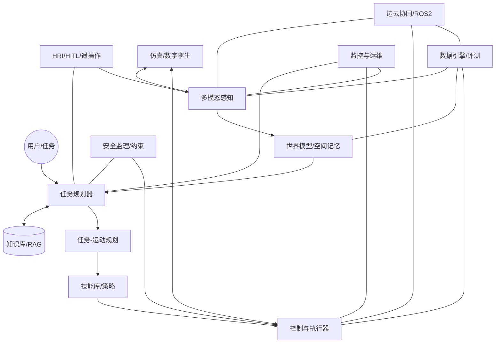

# AgenticX Embodiment 从GUI到完整具身智能：缺口盘点与建设规划

摘要
- 现状：M16 Embodiment 聚焦 GUI Agent（工具、工作流、学习、人机协作）已形成闭环，但尚未覆盖“具身智能”的关键能力域：多模态感知、物理控制、世界模型、TAMP（任务-运动规划一体化）、仿真与Sim2Real、安全与实时、Edge/ROS2 生态、技能库与RL/IL、HRI 等。
- 目标：将 M16 扩展为“从虚拟到物理”的统一具身智能栈，支持虚拟指针键鼠、机器人手臂/移动底盘/移动端/AR-VR 等，实现任务理解-世界建模-规划-控制-学习-评测-运维的全链路。
- 方法：提出12大缺口域与对应模块蓝图，给出分阶段（MVP→Beta→GA）建设路线、核心API与与现有M16对齐改造方案。

一、缺口总览（相对当前 GUI 聚焦的 M16）
1) 多模态感知与设备抽象
- 缺：摄像头/深度/IMU/力矩/触觉/音频/眼动等传感器接入与时间同步，统一驱动/时间轴API。
- 影响：无法构建实体世界状态，限制从GUI到物理场景迁移。

2) 世界模型与空间记忆
- 缺：3D/拓扑地图、对象/可供性（affordance）库、时序场景图、对象持久性与不确定性建模。
- 影响：仅凭屏幕快照难以做稳健决策，复杂长程任务规划受限。

3) 运动控制与TAMP（Task and Motion Planning）
- 缺：逆运动学/轨迹生成/避障/顺应控制，任务规划与运动规划耦合（约束求解）。
- 影响：从高层意图到可执行控制的落地缺通路。

4) 技能库与策略学习（IL/RL/HRL）
- 缺：可复用技能（primitive→options→macro）、模仿学习与强化学习闭环、技能编译与验证。
- 影响：难以跨任务迁移、持续自我改进能力弱。

5) 仿真、数字孪生与Sim2Real
- 缺：统一仿真接口（PyBullet/Isaac/Unity/ROS2 Gazebo）、域随机化、离线数据生成、孪生同步。
- 影响：数据与安全验证成本高，实体部署风险大。

6) 安全、伦理与约束执行
- 缺：硬/软安全栅栏、风险评估、约束求解器、故障诊断与紧急刹车（E-Stop）闭环。
- 影响：生产级部署风险不可控。

7) 实时系统与调度
- 缺：实时执行器、优先级与抢占、端到端时延预算、时钟/时间同步与日志对齐。
- 影响：复杂闭环控制与多传感多执行器并发失稳。

8) HRI（人机交互）与远程操控
- 缺：语音/手势/指示/AR标注、远程遥操作/示教、操作权限与审核。
- 影响：高不确定场景缺少高效的人在环纠错与示教路径。

9) 数据引擎与评测基准
- 缺：统一数据Schema、采集-标注-版本化、任务基准与KPI、A/B与回放复现、漂移监控。
- 影响：难以量化改进、难定位回归问题。

10) 云边协同与模型运维
- 缺：边缘推理/云训练、模型仓库/灰度/OTA、资源/能耗感知调度、隐私合规。
- 影响：规模化与低时延部署受限。

11) 语义知识与可供性对齐
- 缺：语言-视觉-动作语义桥接、对象可供性库、操作先决条件/效果建模与验证。
- 影响：难以做稳健的工具/物体使用与泛化。

12) 多体/多代理协作
- 缺：多机器人/多Agent任务分解、通信/共享世界模型、冲突与资源协调。
- 影响：难以覆盖真实复杂业务场景。

*目标体系结构：从任务到控制的闭环，并联入安全、仿真、数据与边云*

二、模块蓝图与建设建议（按域）
A. 多模态感知与设备抽象（Module: embodiment.perception）
- 目标：统一接入相机(RGB/Depth)、麦克风、IMU、力/触觉、眼动、系统窗口树等；提供时间同步与校准。
- 核心能力：SensorHub、时间同步(TimeSync)、标定(Calibration)、时序缓存(RingBuffer)、多传感融合(Fusion)。
- 关键API：
  - register_sensor(name, type, fps, calibration)
  - get_frame(name, t=None, sync_by="closest"|"exact")
  - subscribe(topic, callback), publish(topic, msg)
- 与现有对齐：扩展 tools.adapters 为 PlatformAdapterFamily（Web/Desktop/Robot/AR/Audio）。
- MVP(4周)：RGB摄像头+麦克风+系统窗口树统一时间戳；GUI ScreenState→General SensorState。

B. 世界模型与空间记忆（Module: embodiment.world_model）
- 目标：从多模态构建语义场景图、对象库、拓扑/度量地图，维护对象持久性与不确定性。
- 核心能力：SceneGraph(节点/关系/时序)、3D地图(SLAM接口)、语义分割/检测、可供性库。
- API：
  - update(observation)
  - query(selector: object/type/region/time)
  - get_map(layer: metric|topo|semantic)
- 对齐：将 core.models.ScreenState 泛化为 WorldState；learning.knowledge_evolution 维护对象与操作知识。
- MVP(6周)：2D语义场景图+对象轨迹+基础可供性（可点击/可抓取/可旋转）。

C. 运动控制与TAMP（Module: embodiment.control + embodiment.planning.tamp）
- 目标：将任务目标转为受约束的可执行轨迹；支持逆解、轨迹规划、避障、顺应控制。
- 核心能力：IK/FK、轨迹生成（RRT*/CHOMP）、约束求解、低层控制接口（ROS2/ActuatorHub）。
- API：
  - plan_task(goal, world_state) → task_plan
  - plan_motion(task_step, kinematics, constraints) → trajectory
  - execute(trajectory, controller='impedance|velocity')
- 对齐：workflow.engine 节点类型扩展为 MotionNode；tools.adapters 新增 RobotPlatformAdapter。
- MVP(8周)：仿真手臂Pick&Place（无碰）+ 速度控制闭环。

D. 技能库与策略学习（Module: embodiment.skills, embodiment.learning.rl_il）
- 目标：沉淀可复用技能，从示教/回放/仿真自博弈中持续学习；支持HRL。
- 核心能力：Skill Registry（前置条件/效果/代价）、IL(BC/DAgger)、RL(SAC/PPO)、技能编译与验证。
- API：
  - register_skill(name, precond, effect, impl)
  - invoke_skill(name, params) → outcome
  - train(policy, dataset|env)
- 对齐：learning.task_synthesizer 产出技能图；human_in_the_loop 支持示教与纠偏。
- MVP(6周)：GUI与仿真共享的“点击/抓取/拖拽/输入/对齐”五类通用技能。

E. 仿真与Sim2Real（Module: embodiment.simulation）
- 目标：统一接入 PyBullet/Isaac/Gazebo/Unity，域随机化，数据合成与回放。
- 核心能力：Env Abstraction、Domain Randomization、Dataset Generator、Digital Twin Sync。
- API：
  - make_env(name, assets, physics)
  - reset(seed), step(action), get_observation()
  - randomize(domain_cfg)
- 对齐：workflow/tests 引入仿真回放；researches 扩展到 Sim2Real 研究。
- MVP(4周)：PyBullet 手臂/抓取场景+数据录制。

F. 安全与约束（Module: embodiment.safety）
- 目标：策略屏蔽/约束优化、风险评估、E-Stop、权限管理与审计。
- 能力：Shielding、Constraint Solver、Risk Model、Safety Monitor。
- API：check(action|trajectory), enforce(policy), audit(event)
- MVP(3周)：动作白/黑名单+轨迹速度/力阈值+E-Stop。

G. 实时系统与调度（Module: embodiment.runtime）
- 目标：实时执行与时延预算，优先级/抢占式调度，时钟对齐。
- 能力：RT Scheduler、TimeSync、Tracing、Backpressure。
- 对齐：workflow.engine 增强“实时节点/超时/优先级”。
- MVP(4周)：端到端延迟指标与超时恢复。

H. HRI 与遥操作（Module: embodiment.hri）
- 目标：语音/指示/AR批注、人在环示教与远程操控，权限与审核。
- API：start_session(), request_assist(type), stream_feedback(), teleop(stream)
- 对齐：human_in_the_loop 扩展到语音/视频/AR 通道。
- MVP(4周)：WebRTC 远程视频+鼠标指引+示教录制。

I. 数据与评测（Module: embodiment.data & embodiment.eval）
- 目标：统一Schema、数据管道、可重放回归、任务KPI基准。
- 能力：Dataset/Feature Store、Labeling、Benchmark Harness、A/B 测试。
- MVP(3周)：回放驱动的回归测试+成功率/时长/安全事件三大KPI。

J. 云边协同与运维（Module: embodiment.ops）
- 目标：边缘推理、云训练、模型仓库、灰度与OTA、隐私合规。
- 能力：Model Registry、Deployer、Feature/Log Pipeline、Policy Center。
- MVP(4周)：模型版本化+灰度部署最小闭环。

K. 语义与可供性对齐（Module: embodiment.semantic）
- 目标：语言-视觉-动作对齐，对象可供性库与先决/效果检查。
- MVP(4周)：对象→可供性映射（抓取/按压/旋转）+语言模板到技能参数映射。

L. 多体/多代理（Module: embodiment.multi_agent）
- 目标：多机器人协作、共享世界模型、任务分解与资源协调。
- MVP(6周)：双臂协作/两Agent共享任务队列与锁。

| 接口族 | 关键API/数据模型 | 说明 |
| --- | --- | --- |
| SensorHub | register_sensor(), get_frame(), time_sync() | 统一传感器接口，支持时间同步/校准 |
| ActuatorHub | register_actuator(), send_command(), get_state() | 执行器抽象，覆盖电机/夹爪/输入设备 |
| WorldModel | update(), query(), get_map(), pose_graph | 时空场景/对象/不确定性查询 |
| Planner/TAMP | plan_task(), plan_motion(), bind_constraints() | 任务-运动一体化规划 |
| Skill Registry | register_skill(), invoke_skill(), validate() | 技能可复用与编排 |
| Safety | check(), shield(), audit(), estop() | 策略屏蔽、约束与审计 |
| Simulation | make_env(), reset(), step(), randomize() | 统一仿真与域随机化 |
| HRI/HITL | start_session(), request_intervention(), teleop() | 人在环纠偏/示教/遥操作 |
| Runtime | set_priority(), set_deadline(), trace_span() | 实时与可观测性 |
| Data/Eval | log_episode(), replay(), run_benchmark() | 数据闭环与评测基准 |
| Ops | register_model(), rollout(), canary(), rollback() | 云边模型与灰度治理 |

三、阶段性路线图（示例 2~3 个迭代周期）
Phase 0（2周）：抽象统一与最小打通
- 将 core.models.ScreenState→General SensorState/WorldState；tools.adapters→PlatformAdapterFamily。
- WorkflowEngine 增加“实时节点/优先级/超时”；Human-in-the-Loop 抽象扩到 HRI 通道。

Phase 1（6~8周）：虚拟到仿真的具身闭环（MVP）
- Perception: RGB/Depth 接入与时间同步；
- Simulation: PyBullet 手臂/抓取；
- Skills: 点击/抓取/拖拽/输入/对齐 五技能；
- TAMP: 简化Pick&Place 规划→轨迹→执行；
- Safety: 速度/力阈+E-Stop；
- Data/Eval: 回放回归+三KPI；
- 交付：在仿真里完成“从自然语言到抓取”的端到端Demo。

Phase 2（8~10周）：Sim2Real 与HRI增强（Beta）
- 加入真实相机/夹爪/底盘驱动（ROS2）；域随机化与参数标定；
- HRI：远程示教与语音指引；
- RL/IL：基于示教回放做BC+DAgger；
- 交付：受限工位的真实抓取/放置任务，支持人在环失败恢复。

Phase 3（8周+）：生产化与规模化（GA）
- Ops：模型仓库、灰度、监控看板、隐私合规；
- Multi-agent：多设备资源编排；
- Eval：任务集基准化与自动报告；
- 安全：约束求解器与风险模型；
- 交付：可复制部署的产品化栈。

四、与现有 M16 组件的改造与复用
- core/ models/context/task
  - ScreenState→WorldState；GUITask→EmbodiedTask（支持实体/虚拟双栈目标）。
- tools/
  - adapters：新增 RobotPlatformAdapter、AudioAdapter、ARAdapter；
  - core_tools：原子操作扩展为“设备动作原语”（抓取/移动/旋转/力控）。
- workflow/
  - engine：支持实时优先级、deadline、抢占与回滚；
  - builder：增加运动节点/感知节点DSL；
  - tests：引入仿真回放与端到端时序测试。
- learning/
  - 扩展 IL/RL、技能发现、可供性学习；
  - knowledge_evolution 维护对象与技能知识图谱；
  - gui_explorer→env_explorer，兼容GUI与物理环境。
- human_in_the_loop/
  - 扩为 hri：语音/视频/WebRTC/AR 标注；权限与审核策略。

五、最小可行路径（MVP落地建议）
- 选定场景：桌面拾取-放置（仿真）+ GUI 辅助（任务发起与监控）。
- 技术栈：PyBullet + ROS2（接口预留）+ OpenCV + 简易语义分割 + PPO/BC。
- 关键步骤：
  1. 感知/仿真/技能/安全/评测五件套打通；
  2. 以 workflow 将“语言→规划→技能→控制→反馈”连成闭环；
  3. 人在环示教录制→BC 初始化→在线修正（DAgger）。
- 验收标准：
  - 成功率≥80%，平均时长≤阈值，安全事件=0；
  - 回放复现一致性≥95%。

六、风险与对策
- 硬件与实时性：优先仿真验证，部署RT调度与端到端时延预算；
- 数据规模：仿真合成+遥操作示教，统一Schema与版本化；
- 安全合规：最小权限、黑白名单、审计日志、E-Stop 实体化；
- Sim2Real 差距：域随机化+自动校准+在线参数估计。

七、指标与评测基准（建议）
- 基础KPI：成功率、完成时长、路径效率、能耗、安全事件数/严重度。
- 学习KPI：样本效率（成功率-样本数曲线）、迁移性能（Sim→Real）。
- 可靠性：回放一致性、漂移报警率、MTTR。
- 评测套件：
  - GUI：表单填报/文件管理/跨页操作；
  - 物理：拾取-放置/插拔/按钮旋转/门把开合；
  - 组合：GUI下发→实体执行→GUI确认闭环。

八、落地工单清单（Phase 0-1 可执行项）
Phase 0（2周）
1. 抽象统一：定义 WorldState、SensorState、ActuatorHub 核心数据类与接口（含PRD、Proto、单测草案）。
2. PlatformAdapterFamily：抽象 Web/Desktop/Robot/Audio/AR 适配器骨架与 Mock 实现（保证接口齐备）。
3. Workflow 实时增强：节点优先级、deadline、超时与抢占机制实现与测试（builder/engine 对齐）。
4. HRI 通道拓展：HITL 事件模型扩到语音/视频/AR 占位；WebRTC PoC（信令+低延时通道）。
5. 数据Schema与回放：log_episode()/replay() 原型与三KPI（成功率/时长/安全事件）报表脚手架。
6. 安全最小栈：E-Stop 接口、动作白/黑名单与速度/力阈校验器，接入审计日志。

Phase 1（6~8周）
7. 感知接入：RGB/Depth 采集与时间同步，基础内外参标定脚本与缓存。
8. 仿真环境：PyBullet 抓取场景、域随机化配置、数据录制与回放工具。
9. 通用技能：点击/抓取/拖拽/输入/对齐 五技能API与执行器适配（GUI/Robot双栈）。
10. TAMP MVP：简化 Pick&Place 任务规划器→轨迹生成→速度/阻抗控制执行。
11. 安全强化：轨迹速度/力阈在线监测与违规屏蔽，风险事件分类与告警。
12. 评测看板：回放驱动回归、KPI可视化（成功率/时长/安全），A/B 对比与报告导出。
13. 文档与样例：端到端 Demo（语言→规划→技能→控制→反馈）与开发指南示例工程。

验收标准（DoD）
- 单元测试覆盖≥70%，关键路径 E2E Demo 可复现；
- MVP 任务成功率≥80%，平均时长≤预设阈值，安全事件=0；
- 回放复现一致性≥95%，关键接口均有监控与审计日志。