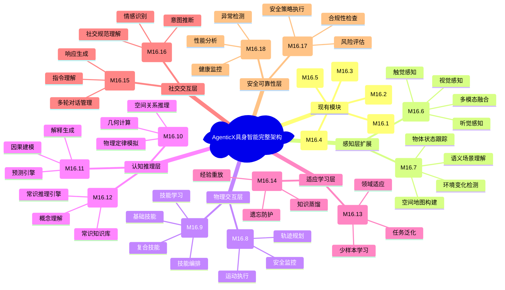

# AgenticX具身智能完整建设规划建议


基于您提供的AgenticX Embodiment模块分析，我从具身智能的完整建设角度为您提出系统性的建设规划建议。您当前的模块主要聚焦GUI Agent，但完整的具身智能还需要扩展到多模态感知、物理交互、认知推理等更广泛的领域。

## 现有模块优势分析

您当前的AgenticX Embodiment模块在以下方面已经具备良好的基础：

✅ **核心抽象层**：提供了完整的Agent基础架构  
✅ **学习引擎**：实现了人类对齐学习机制  
✅ **工具系统**：提供了GUI操作的标准化工具集  
✅ **工作流编排**：支持复杂任务的自动化编排  
✅ **人机协作**：建立了Human-in-the-loop机制

这些模块为GUI Agent提供了扎实的基础，但从完整具身智能的角度看，还需要补充以下关键模块。

## 一、感知层扩展模块（Perception Layer）

### 1.1 多模态感知融合模块 (M16.6)

**建设目标**：扩展beyond GUI的多模态感知能力

**核心组件**：
- **视觉感知引擎** (`vision_perception.py`)
  - 物体检测与识别
  - 场景理解与空间定位
  - 视频流实时分析
  - 3D空间感知（深度估计）

- **听觉感知引擎** (`audio_perception.py`)
  - 语音识别与理解
  - 环境音频分析
  - 音源定位
  - 情感语调识别

- **触觉感知引擎** (`tactile_perception.py`)
  - 压力感知
  - 材质识别
  - 温度检测
  - 振动分析

- **多模态融合器** (`multimodal_fusion.py`)
  - 跨模态信息整合
  - 感知数据时序对齐
  - 冲突检测与解决
  - 置信度评估

**技术架构**：
```python
class MultiModalPerceptionEngine(Component):
    def __init__(self):
        self.vision_engine = VisionPerceptionEngine()
        self.audio_engine = AudioPerceptionEngine() 
        self.tactile_engine = TactilePerceptionEngine()
        self.fusion_processor = MultiModalFusionProcessor()
    
    async def perceive(self, sensor_data: Dict) -> PerceptionResult:
        # 多模态感知融合逻辑
        pass
```

### 1.2 环境建模模块 (M16.7)

**建设目标**：构建动态的环境认知模型

**核心组件**：
- **空间地图构建器** (`spatial_mapper.py`)
- **物体状态跟踪器** (`object_tracker.py`)
- **环境变化检测器** (`change_detector.py`)
- **语义场景理解器** (`scene_understanding.py`)

## 二、物理交互层模块（Physical Interaction Layer）

### 2.1 运动控制模块 (M16.8)

**建设目标**：实现精确的物理世界交互能力

**核心组件**：
- **轨迹规划器** (`trajectory_planner.py`)
  - 路径优化算法
  - 避障策略
  - 动态重规划
  - 多约束优化

- **运动执行器** (`motion_executor.py`)
  - 关节控制
  - 力控制
  - 速度控制
  - 实时调整

- **安全监控器** (`safety_monitor.py`)
  - 碰撞检测
  - 紧急停止
  - 安全边界
  - 故障恢复

**技术实现**：
```python
class MotionControlModule(Component):
    def __init__(self):
        self.trajectory_planner = TrajectoryPlanner()
        self.motion_executor = MotionExecutor()
        self.safety_monitor = SafetyMonitor()
    
    async def execute_motion(self, target: MotionTarget) -> MotionResult:
        # 运动控制执行逻辑
        pass
```

### 2.2 操作技能库模块 (M16.9)

**建设目标**：构建可复用的操作技能集合

**核心组件**：
- **基础操作技能** (`basic_skills.py`)
  - 抓取、放置、推拉
  - 旋转、翻转、滑动
  - 按压、拖拽、搬运

- **复合操作技能** (`composite_skills.py`)
  - 开门、关窗
  - 使用工具
  - 物品组装

- **技能学习器** (`skill_learner.py`)
  - 模仿学习
  - 强化学习
  - 技能迁移

- **技能编排器** (`skill_orchestrator.py`)
  - 技能序列规划
  - 技能参数调优
  - 执行监控

## 三、认知推理层模块（Cognitive Reasoning Layer）

### 3.1 空间推理模块 (M16.10)

**建设目标**：实现复杂的空间认知和推理能力

**核心组件**：
- **空间关系推理器** (`spatial_reasoning.py`)
  - 位置关系判断
  - 空间拓扑分析
  - 相对位置计算

- **物理定律模拟器** (`physics_simulator.py`)
  - 重力模拟
  - 碰撞预测
  - 物体行为预测

- **几何计算引擎** (`geometry_engine.py`)
  - 3D几何分析
  - 体积计算
  - 形状匹配

### 3.2 因果推理模块 (M16.11)

**建设目标**：理解动作与结果的因果关系

**核心组件**：
- **因果关系建模器** (`causal_modeler.py`)
  - 因果图构建
  - 因果链分析
  - 反事实推理

- **预测引擎** (`prediction_engine.py`)
  - 行为结果预测
  - 环境状态预测
  - 不确定性量化

- **解释生成器** (`explanation_generator.py`)
  - 行为解释
  - 决策推理
  - 可解释AI

### 3.3 常识推理模块 (M16.12)

**建设目标**：整合常识知识进行推理

**核心组件**：
- **常识知识库** (`commonsense_kb.py`)
- **常识推理引擎** (`commonsense_reasoning.py`)
- **概念理解器** (`concept_understanding.py`)

## 四、适应学习层模块（Adaptive Learning Layer）

### 4.1 元学习模块 (M16.13)

**建设目标**：实现快速适应新环境和任务的能力

**核心组件**：
- **少样本学习器** (`few_shot_learner.py`)
  - 模型无关元学习(MAML)
  - 原型网络
  - 度量学习

- **领域适应器** (`domain_adapter.py`)
  - 跨域知识迁移
  - 分布对齐
  - 特征适应

- **任务泛化器** (`task_generalizer.py`)
  - 任务表示学习
  - 技能组合
  - 抽象能力

**技术实现**：
```python
class MetaLearningModule(Component):
    def __init__(self):
        self.few_shot_learner = FewShotLearner()
        self.domain_adapter = DomainAdapter()
        self.task_generalizer = TaskGeneralizer()
    
    async def adapt_to_new_task(self, task: Task, few_examples: List) -> AdaptationResult:
        # 元学习适应逻辑
        pass
```

### 4.2 终身学习模块 (M16.14)

**建设目标**：支持持续学习而不遗忘

**核心组件**：
- **知识蒸馏器** (`knowledge_distiller.py`)
- **经验重放器** (`experience_replay.py`)
- **灾难性遗忘防护器** (`catastrophic_forgetting_protector.py`)
- **知识整合器** (`knowledge_consolidator.py`)

## 五、社交交互层模块（Social Interaction Layer）

### 5.1 自然语言交互模块 (M16.15)

**建设目标**：实现流畅的人机自然语言交互

**核心组件**：
- **多轮对话管理器** (`dialogue_manager.py`)
  - 对话状态跟踪
  - 上下文理解
  - 意图识别
  - 槽位填充

- **指令理解器** (`instruction_understanding.py`)
  - 自然语言指令解析
  - 模糊指令处理
  - 多义消解
  - 指令验证

- **响应生成器** (`response_generator.py`)
  - 自然语言生成
  - 情感表达
  - 个性化回复
  - 多模态响应

**技术架构**：
```python
class NaturalLanguageInteractionModule(Component):
    def __init__(self):
        self.dialogue_manager = DialogueManager()
        self.instruction_understanding = InstructionUnderstanding()
        self.response_generator = ResponseGenerator()
    
    async def process_natural_language(self, input_text: str) -> InteractionResult:
        # 自然语言交互处理逻辑
        pass
```

### 5.2 社交认知模块 (M16.16)

**建设目标**：理解和预测人类行为与意图

**核心组件**：
- **情感识别器** (`emotion_recognizer.py`)
- **意图推断器** (`intention_inferrer.py`)
- **社交规范理解器** (`social_norm_understanding.py`)
- **协作策略规划器** (`collaboration_planner.py`)

## 六、安全可靠性模块（Safety & Reliability Layer）

### 6.1 行为安全模块 (M16.17)

**建设目标**：确保具身智能系统的行为安全

**核心组件**：
- **安全策略执行器** (`safety_policy_enforcer.py`)
  - 行为边界检查
  - 禁止动作过滤
  - 安全等级评估
  - 紧急制动机制

- **风险评估器** (`risk_assessor.py`)
  - 行为风险预测
  - 环境危险识别
  - 概率风险计算
  - 风险缓解策略

- **合规性检查器** (`compliance_checker.py`)
  - 法律法规遵循
  - 伦理规范检查
  - 隐私保护
  - 审计日志

**技术实现**：
```python
class BehavioralSafetyModule(Component):
    def __init__(self):
        self.safety_policy_enforcer = SafetyPolicyEnforcer()
        self.risk_assessor = RiskAssessor()
        self.compliance_checker = ComplianceChecker()
    
    async def validate_action(self, action: Action) -> SafetyValidationResult:
        # 行为安全验证逻辑
        pass
```

### 6.2 系统监控模块 (M16.18)

**建设目标**：实时监控系统状态和性能

**核心组件**：
- **健康监控器** (`health_monitor.py`)
- **性能分析器** (`performance_analyzer.py`)
- **异常检测器** (`anomaly_detector.py`)
- **故障恢复器** (`failure_recovery.py`)



*AgenticX具身智能完整架构模块分布图*

## 七、分阶段建设路线图

### 第一阶段（3-6个月）：感知能力增强

**优先级**: 🔥🔥🔥 **高优先级**

**目标**: 扩展beyond GUI的多模态感知能力

**建设内容**:
1. **多模态感知融合模块 (M16.6)** - 为现有GUI Agent增加视觉、听觉感知
2. **环境建模模块 (M16.7)** - 构建动态环境认知

**预期产出**:
- 支持图像识别的GUI Agent
- 语音交互能力
- 基础环境感知

**技术难点**:
- 多模态数据融合算法
- 实时感知处理性能

### 第二阶段（6-9个月）：物理交互能力

**优先级**: 🔥🔥 **中高优先级**

**目标**: 从虚拟GUI扩展到物理世界交互

**建设内容**:
1. **运动控制模块 (M16.8)** - 物理运动能力
2. **操作技能库模块 (M16.9)** - 标准化操作技能

**预期产出**:
- 机器人运动控制
- 基础操作技能集
- 物理安全机制

**技术难点**:
- 运动轨迹优化
- 实时安全监控
- 硬件适配抽象

### 第三阶段（9-12个月）：认知推理能力

**优先级**: 🔥🔥 **中高优先级**

**目标**: 增强智能决策和推理能力

**建设内容**:
1. **空间推理模块 (M16.10)** - 3D空间理解
2. **因果推理模块 (M16.11)** - 因果关系理解
3. **常识推理模块 (M16.12)** - 常识知识整合

**预期产出**:
- 3D空间规划能力
- 因果预测能力
- 常识推理引擎

**技术难点**:
- 因果关系建模
- 常识知识表示
- 推理效率优化

### 第四阶段（12-15个月）：学习适应能力

**优先级**: 🔥 **中等优先级**

**目标**: 实现快速学习和持续适应

**建设内容**:
1. **元学习模块 (M16.13)** - 快速适应新任务
2. **终身学习模块 (M16.14)** - 持续学习能力

**预期产出**:
- 少样本学习能力
- 知识迁移机制
- 终身学习框架

**技术难点**:
- 元学习算法实现
- 灾难性遗忘问题
- 知识整合机制

### 第五阶段（15-18个月）：社交交互能力

**优先级**: 🔥 **中等优先级**

**目标**: 实现自然的人机社交交互

**建设内容**:
1. **自然语言交互模块 (M16.15)** - 深度对话能力
2. **社交认知模块 (M16.16)** - 社交理解能力

**预期产出**:
- 多轮对话系统
- 情感理解能力
- 社交规范遵循

**技术难点**:
- 上下文理解
- 情感计算
- 社交常识建模

### 第六阶段（18-24个月）：安全可靠性完善

**优先级**: 🔥🔥🔥 **高优先级**（贯穿所有阶段）

**目标**: 确保系统安全可靠运行

**建设内容**:
1. **行为安全模块 (M16.17)** - 全方位安全保障
2. **系统监控模块 (M16.18)** - 运行状态监控

**预期产出**:
- 完整安全框架
- 实时监控系统
- 故障恢复机制

**技术难点**:
- 安全策略设计
- 实时风险评估
- 系统可靠性保证

| 建设阶段 | 时间周期 | 优先级 | 核心模块 | 技术难度 | 商业价值 | 资源需求 |
| --- | --- | --- | --- | --- | --- | --- |
| 第一阶段 | 0-6个月 | 高 | 感知融合+环境建模 | 中等 | 高 | 5-8人 |
| 第二阶段 | 6-9个月 | 中高 | 运动控制+操作技能 | 高 | 高 | 6-10人 |
| 第三阶段 | 9-12个月 | 中高 | 空间+因果+常识推理 | 高 | 中 | 4-6人 |
| 第四阶段 | 12-15个月 | 中等 | 元学习+终身学习 | 高 | 中 | 3-5人 |
| 第五阶段 | 15-18个月 | 中等 | 自然语言+社交认知 | 中 | 高 | 4-6人 |
| 第六阶段 | 全程 | 高 | 行为安全+系统监控 | 中 | 高 | 3-4人 |

## 八、技术栈选择建议

### 8.1 感知层技术栈

**视觉感知**:
- OpenCV + PyTorch Vision
- YOLO系列用于目标检测
- Segment Anything用于图像分割
- Open3D用于3D点云处理

**听觉感知**:
- Whisper用于语音识别
- PyAudio用于音频处理
- librosa用于音频特征提取

**多模态融合**:
- Transformers架构
- CLIP等多模态预训练模型
- 自定义融合网络

### 8.2 物理交互技术栈

**运动控制**:
- ROS 2作为机器人操作系统
- MoveIt用于运动规划
- Gazebo用于仿真
- PyBullet用于物理仿真

**安全控制**:
- Real-time Linux保证实时性
- 安全PLC集成
- 冗余传感器系统

### 8.3 认知推理技术栈

**符号推理**:
- Neo4j用于知识图谱
- Prolog用于逻辑推理
- SPARQL用于知识查询

**神经推理**:
- Graph Neural Networks
- Neural Module Networks
- Transformer-based推理模型

### 8.4 学习优化技术栈

**元学习**:
- PyTorch Meta-Learning库
- 自定义MAML实现
- Few-shot Learning框架

**强化学习**:
- Stable Baselines3
- Ray RLlib
- OpenAI Gym

### 8.5 部署运维技术栈

**容器化部署**:
- Docker + Kubernetes
- NVIDIA Docker用于GPU
- Helm用于包管理

**监控运维**:
- Prometheus + Grafana
- ELK Stack用于日志
- Jaeger用于分布式追踪

## 九、资源配置建议

### 9.1 团队规模建议

**核心团队（15-20人）**:
- **技术负责人** 1人：统筹架构设计
- **感知算法工程师** 3-4人：多模态感知开发
- **运动控制工程师** 2-3人：物理交互能力
- **机器学习工程师** 3-4人：学习算法开发
- **系统工程师** 2-3人：平台架构和部署
- **安全工程师** 1-2人：系统安全保障
- **测试工程师** 2-3人：质量保证
- **产品经理** 1人：需求管理和协调

### 9.2 硬件资源配置

**开发环境**:
- 高性能GPU服务器：NVIDIA A100/H100 ✕ 4-8张
- 边缘计算设备：Jetson AGX Orin ✕ 10台
- 测试机器人平台：多种型号机器人用于测试
- 传感器设备：摄像头、麦克风、触觉传感器等

**云端资源**:
- 模型训练：云端GPU集群
- 数据存储：分布式存储系统
- 服务部署：Kubernetes集群

### 9.3 预算估算

**第一年预算（万元）**:
- 人力成本：1200-1500万
- 硬件采购：300-500万
- 云端资源：100-200万
- 软件许可：50-100万
- **总计**：1650-2300万

**后续年度预算**:
- 年度运维：总预算的30-40%
- 硬件更新：总预算的15-20%
- 人员扩充：根据发展需要调整

### 9.4 风险控制策略

**技术风险**:
- 关键技术预研和原型验证
- 多方案并行开发
- 外部技术合作和咨询

**进度风险**:
- 敏捷开发模式
- 里程碑节点检查
- 缓冲时间预留

**质量风险**:
- 持续集成/持续部署
- 自动化测试覆盖
- 代码审查机制

## 十、成功指标与评估体系

### 10.1 技术指标

**感知能力**:
- 多模态感知准确率 > 95%
- 实时处理延迟 < 100ms
- 环境建模精度 > 90%

**交互能力**:
- 运动控制精度 < 1mm误差
- 操作成功率 > 98%
- 安全响应时间 < 10ms

**认知能力**:
- 推理准确率 > 85%
- 学习收敛速度提升50%
- 知识迁移成功率 > 80%

### 10.2 业务指标

**应用效果**:
- 任务自动化率提升 > 80%
- 人工干预频率降低 > 70%
- 用户满意度 > 4.5/5.0

**商业价值**:
- 降低人力成本 > 60%
- 提升工作效率 > 3倍
- ROI > 300%（3年内）

### 10.3 里程碑检查点

**每季度评估**:
- 技术指标达成情况
- 项目进度完成度
- 资源使用效率
- 风险控制状况

**年度全面评估**:
- 整体架构完善度
- 市场竞争力分析
- 技术先进性评价
- 商业化可行性

## 总结与建议

您当前的AgenticX Embodiment模块在GUI Agent领域已经构建了扎实的基础架构，具备了良好的可扩展性。从具身智能的完整建设角度，建议按照以下优先级推进：

### 核心建议

1. **优先扩展感知能力**：多模态感知是具身智能的基础，建议第一阶段重点投入
2. **渐进式物理交互**：从仿真环境开始，逐步过渡到真实物理世界
3. **安全优先原则**：安全模块应该贯穿整个开发过程，不是最后添加的功能
4. **持续学习机制**：元学习和终身学习是具身智能的核心竞争力
5. **标准化接口设计**：确保各模块间的良好集成和未来扩展性

### 🚀 实施路径

- **短期（6个月内）**：多模态感知融合，为现有GUI Agent增加视觉和听觉能力
- **中期（12个月内）**：物理交互能力，运动控制和操作技能库
- **长期（24个月内）**：认知推理、学习适应和社交交互的全面能力

### 💡 关键成功因素

- 强有力的技术团队和充足的资源投入
- 与现有AgenticX架构的深度集成
- 持续的技术创新和算法优化
- 完善的测试验证和安全保障机制

通过系统性的规划和分阶段实施，AgenticX将从目前优秀的GUI Agent平台发展为具备完整具身智能能力的综合性AI系统。