# AgenticX M16: 具身智能基础框架

> **定位声明**: 本模块为AgenticX框架的M16模块，实现通用具身智能能力，支持多种环境交互智能体的开发与部署。本项目定位为**基础框架 (Foundation Framework)**，提供具身智能体在物理世界、数字环境、虚拟空间中交互的统一抽象和核心能力。

## 1. 愿景与目标 (Vision & Goals)

### 愿景声明

AgenticX M16 Embodiment 旨在构建业界领先的通用具身智能基础框架，基于人类学习对齐理念，为智能体提供与多种环境交互的核心能力。通过统一的感知-行动-学习循环，让AI智能体能够像人类一样适应和掌握不同类型的环境交互任务，包括但不限于GUI操作、机器人控制、虚拟环境探索等场景。

### 核心目标

1.  **通用具身智能抽象**: 提供统一的环境感知、动作执行、状态管理接口，支持物理机器人、GUI自动化、虚拟环境等多种具身场景
2.  **人类学习对齐**: 构建五阶段学习方法论（先验知识检索 → 引导探索 → 复杂任务合成 → 深度使用优化 → 边缘情况处理），适用于不同环境的学习过程
3.  **环境适配器架构**: 通过可插拔的环境适配器，快速支持新的交互环境和平台，降低具身智能应用的开发门槛
4.  **多模态感知融合**: 集成视觉、听觉、触觉等多种感知模态，提供丰富的环境理解能力
5.  **自适应学习引擎**: 构建数据驱动的持续学习机制，智能体能够从交互经验中不断优化策略
6.  **企业级可扩展性**: 提供分布式部署、云端推理、边缘计算等多种部署模式，满足不同规模的应用需求

## 2. 技术架构 (Technical Architecture)

```mermaid
graph TB
    subgraph "M16: Embodiment Foundation Layer"
        subgraph "M16.1: Core Abstractions"
            EmbodiedAgent[EmbodiedAgent]
            EnvironmentAdapter[EnvironmentAdapter]
            PerceptionModule[PerceptionModule]
            ActionModule[ActionModule]
        end

        subgraph "M16.2: Learning Components"
            KnowledgeRetriever[KnowledgeRetriever]
            EnvironmentExplorer[EnvironmentExplorer]
            TaskSynthesizer[TaskSynthesizer]
            UsageOptimizer[UsageOptimizer]
            EdgeCaseHandler[EdgeCaseHandler]
            KnowledgeEvolution[KnowledgeEvolution]
        end

        subgraph "M16.3: Environment Adapters"
            GUIAdapter[GUI Adapter]
            RoboticsAdapter[Robotics Adapter]
            VirtualAdapter[Virtual Environment Adapter]
            GameAdapter[Game Environment Adapter]
        end

        subgraph "M16.4: Perception & Action Tools"
            VisionTool[Vision Tool]
            AudioTool[Audio Tool]
            TouchTool[Touch Tool]
            MotionTool[Motion Tool]
            CommunicationTool[Communication Tool]
        end

        subgraph "M16.5: Workflow Engine"
            EmbodiedWorkflow[EmbodiedWorkflow]
            TaskOrchestrator[TaskOrchestrator]
        end

        subgraph "M16.6: Human-in-the-Loop"
            HumanInTheLoopComponent[HumanInTheLoopComponent]
            FeedbackCollector[FeedbackCollector]
        end
    end

    subgraph "AgenticX Core Infrastructure"
        Agent["agenticx.core.agent.Agent"]
        Component["agenticx.core.component.Component"]
        BaseTool["agenticx.core.tool.BaseTool"]
        Workflow["agenticx.core.workflow.Workflow"]
        Event["agenticx.core.event.Event"]
        Memory["agenticx.memory.component.Memory"]
    end

    EmbodiedAgent -- inherits from --> Agent
    EnvironmentAdapter -- inherits from --> Component
    PerceptionModule -- inherits from --> Component
    ActionModule -- inherits from --> Component
    KnowledgeRetriever -- inherits from --> Component
    EnvironmentExplorer -- inherits from --> Component
    TaskSynthesizer -- inherits from --> Component
    UsageOptimizer -- inherits from --> Component
    EdgeCaseHandler -- inherits from --> Component
    KnowledgeEvolution -- inherits from --> Component
    VisionTool -- inherits from --> BaseTool
    AudioTool -- inherits from --> BaseTool
    TouchTool -- inherits from --> BaseTool
    MotionTool -- inherits from --> BaseTool
    CommunicationTool -- inherits from --> BaseTool
    EmbodiedWorkflow -- inherits from --> Workflow
    HumanInTheLoopComponent -- inherits from --> Component

    EmbodiedAgent -- uses --> EnvironmentAdapter
    EmbodiedAgent -- uses --> PerceptionModule
    EmbodiedAgent -- uses --> ActionModule
    EmbodiedAgent -- uses --> EmbodiedWorkflow
    EmbodiedAgent -- uses --> KnowledgeRetriever
    EmbodiedAgent -- uses --> EnvironmentExplorer
    EmbodiedAgent -- uses --> HumanInTheLoopComponent
    EmbodiedAgent -- uses --> Memory
    EmbodiedAgent -- dispatches --> Event
    
    EnvironmentAdapter -- implements --> GUIAdapter
    EnvironmentAdapter -- implements --> RoboticsAdapter
    EnvironmentAdapter -- implements --> VirtualAdapter
    EnvironmentAdapter -- implements --> GameAdapter
```

## 3. 功能模块拆解 (Functional Modules Breakdown)

*   **M16.1: 核心抽象层 (`agenticx.embodiment.core`)**: ✅ **已完成** - [具身智能体核心抽象，基于`agenticx.core.agent`进行扩展](./prds/m16_1_core_abstractions.md)
    - 实现了 `EmbodiedAgent`、`EnvironmentAdapter`、`PerceptionModule`、`ActionModule`、`EmbodiedTask`、`EnvironmentState` 等核心类
    - 提供通用的感知-行动-学习循环抽象
*   **M16.2: 人类对齐学习引擎 (`agenticx.embodiment.learning`)**: ✅ **已完成** - [基于`agenticx.core.component`实现五阶段学习方法论](./prds/m16_2_human_aligned_learning_engine.md)
    - 实现了 `KnowledgeRetriever`、`EnvironmentExplorer`、`TaskSynthesizer`、`UsageOptimizer`、`EdgeCaseHandler`、`KnowledgeEvolution` 等学习组件
    - 支持跨环境的知识迁移和自适应学习
*   **M16.3: 环境适配器 (`agenticx.embodiment.adapters`)**: [实现多种环境的统一适配接口](./prds/m16_3_environment_adapters.md)
    - GUI适配器：支持桌面、Web、移动端图形界面操作
    - 机器人适配器：支持物理机器人的感知和控制
    - 虚拟环境适配器：支持游戏、仿真等虚拟环境
*   **M16.4: 感知与行动工具 (`agenticx.embodiment.tools`)**: [将各种感知和行动能力封装为`agenticx.core.tool.BaseTool`](./prds/m16_4_perception_action_tools.md)
    - 视觉工具：图像识别、目标检测、场景理解
    - 音频工具：语音识别、声音分析、语音合成
    - 触觉工具：力反馈、触觉感知、材质识别
    - 运动工具：路径规划、动作执行、姿态控制
*   **M16.5: 工作流引擎 (`agenticx.embodiment.workflow`)**: [使用`agenticx.core.workflow.Workflow`定义和执行具身智能任务](./prds/m16_5_workflow_engine.md)
    - 支持复杂的多步骤任务编排
    - 提供任务状态管理和错误恢复机制
*   **M16.6: 人机协同 (`agenticx.embodiment.hitl`)**: [定义人机协同接口和反馈机制，实现持续学习](./prds/m16_6_human_in_the_loop.md)
    - 支持人类专家的实时指导和反馈
    - 提供多模态的交互界面

## 4. 开发路线图 (Development Roadmap / To-Do List)

### Phase 1: 核心基础框架
**目标**: 完成通用具身智能核心抽象和基础组件，建立统一的环境交互框架。

### Phase 2: 环境适配器扩展
**目标**: 实现多种环境适配器（GUI、机器人、虚拟环境），建立可插拔的环境接口。

### Phase 3: 多模态感知与行动
**目标**: 集成视觉、听觉、触觉等多模态感知能力，实现丰富的行动执行工具。

### Phase 4: 自适应学习与优化
**目标**: 完善五阶段学习方法论，实现跨环境的知识迁移和持续优化。

### Phase 5: 企业级部署与集成
**目标**: 实现分布式部署、云端推理、边缘计算等多种部署模式。

## 5. 与AgenticX框架的深度融合 (Deep Integration with AgenticX Framework)

M16 `embodiment` 模块不再是与AgenticX框架的简单集成，而是完全基于其核心概念构建，实现了深度融合：

*   **统一的具身智能体模型**: `EmbodiedAgent` 作为 `agenticx.core.agent.Agent` 的子类，复用其生命周期管理、事件处理和组件模型，同时扩展了环境交互能力。
*   **组件化学习能力**: `embodiment` 的所有学习组件（如 `KnowledgeRetriever`, `EnvironmentExplorer`）均继承自 `agenticx.core.component.Component`，实现了模块化、可插拔和可复用。
*   **统一的环境适配器架构**: 所有的环境适配器（GUI、机器人、虚拟环境）被建模为 `EnvironmentAdapter` 的子类，提供统一的环境交互接口。
*   **多模态工具体系**: 所有的感知和行动能力（视觉、听觉、触觉、运动等）被建模为 `agenticx.core.tool.BaseTool` 的子类，由 `ToolExecutor` 统一调度和执行。
*   **工作流驱动的任务执行**: 复杂的具身智能任务通过 `agenticx.core.workflow.Workflow` 进行编排，实现了任务的分解、状态管理和可靠执行。
*   **事件驱动的通信**: 组件之间、Agent与环境之间的交互通过 `agenticx.core.event.EventSystem` 进行解耦，提高了系统的灵活性和可扩展性。
*   **集成的记忆系统**: `EmbodiedAgent` 直接利用 `agenticx.memory` 组件来存储和检索知识，实现了长期记忆和持续学习。

## 6. 成功指标 (Success Metrics)

### 技术指标
*   **环境适配性**: 支持的环境类型数量达到5+（GUI、机器人、虚拟环境等）。
*   **任务成功率**: 在不同环境下的任务成功率达到80%+。
*   **学习效率**: 与传统方法相比，学习效率提升50%+。
*   **知识迁移效果**: 跨环境知识迁移成功率达到70%+。
*   **系统稳定性**: 错误恢复成功率达到90%+。

### 业务价值指标
*   **开发效率**: 具身智能应用开发时间减少70%+。
*   **部署成本**: 环境适配成本降低80%+。
*   **平台覆盖**: 支持5+主流平台和环境类型。
*   **用户满意度**: 在多种环境下的用户满意度达到85%+。

## 7. 风险评估与缓解策略 (Risk Assessment & Mitigation)

### 技术风险
*   **风险**: 多环境适配复杂度高，可能出现兼容性问题。
*   **缓解策略**: 分层设计、统一接口抽象、自动化测试。

*   **风险**: 学习算法收敛性和稳定性问题。
*   **缓解策略**: 多算法支持、渐进式学习、自适应参数调整。

### 资源风险
*   **风险**: 多模态感知计算资源需求大。
*   **缓解策略**: 模型压缩、分布式计算、边缘计算优化。

### 数据风险
*   **风险**: 不同环境的训练数据质量和多样性不足。
*   **缓解策略**: 多样化的数据采集策略、严格的数据质量控制、合成数据生成。

## 8. 结论 (Conclusion)

AgenticX M16: 具身智能基础框架代表了AI智能体与环境交互领域的重大技术突破。通过构建通用的具身智能抽象、多环境适配器架构、人类对齐学习方法论和自适应学习机制，M16将为AgenticX生态系统提供强大而灵活的环境交互能力，不仅限于GUI操作，而是涵盖机器人控制、虚拟环境探索等广泛的具身智能场景。

这个基础框架的设计理念是提供统一、可扩展、可复用的具身智能能力，让开发者能够轻松构建适用于不同环境和应用场景的智能体系统。
