# AgenticX M16: AI GUI Agent 具身智能框架

> **定位声明**: 本模块为AgenticX框架的M16模块，实现具身智能能力，支持GUI Agent的完整生命周期管理。本项目定位为**框架 (Framework)**，提供完整的GUI Agent开发、训练和部署基础设施。

## 1. 愿景与目标 (Vision & Goals)

### 愿景声明

AgenticX M16 Embodiment 旨在构建业界领先的 AI GUI Agent 具身智能框架，基于人类学习对齐理念，实现从数据工程、模型训练到智能体部署的全生命周期管理。通过AutoGUI-Framework和AGAF (Adaptive GUI Agent Framework)的核心技术，让AI智能体能够像人类一样学习、理解和操作各种图形用户界面，从初始探索到精通应用的完整学习过程。

### 核心目标

1.  **人类学习对齐**: 构建五阶段学习方法论（先验知识检索 → 引导探索 → 复杂任务合成 → 深度使用优化 → 边缘情况处理），模拟人类学习新应用的自然过程
2.  **半自动化数据工程**: 实现Explorer Agent驱动的数据收集、VLM自动标注和人工校验的完整流水线，数据质量达到95%+，人工标注成本降低80%+
3.  **GRPO强化学习训练**: 建立基于Group Relative Policy Optimization的GUI Agent训练系统，任务成功率达到80%+，样本效率比传统方法提升50%+
4.  **数据飞轮机制**: 构建模型生成数据、数据改进模型的自进化循环，实现持续性能提升和知识积累
5.  **跨平台统一**: 支持Android、iOS、Web、Desktop等多平台GUI自动化操作，提供统一的抽象接口
6.  **企业级部署**: 提供可扩展、高可用的生产环境部署能力，支持分布式训练和云端推理

## 2. 技术架构 (Technical Architecture)

```mermaid
graph TB
    subgraph "M16: Embodiment Layer"
        subgraph "M16.1: Core Abstractions"
            GUIAgent[GUIAgent]
            GUIEnvironment[GUIEnvironment]
            ActionSpace[ActionSpace]
            ScreenState[ScreenState]
        end
        
        subgraph "M16.2: Human-Aligned Learning Engine"
            KnowledgeRetriever[AppKnowledgeRetriever]
            GUIExplorer[GUIExplorer]
            TaskSynthesizer[TaskSynthesizer]
            DeepUsageOptimizer[DeepUsageOptimizer]
            EdgeCaseHandler[EdgeCaseHandler]
        end
        
        subgraph "M16.3: Data Engineering Pipeline"
            ExplorerAgent[ExplorerAgent]
            AutoAnnotator[AutoAnnotator]
            HumanValidator[HumanValidator]
            QualityAssessor[QualityAssessor]
            ValidationInterface[ValidationInterface]
        end
        
        subgraph "M16.4: GRPO Training System"
            GRPOTrainer[GRPOTrainer]
            PolicyNetwork[PolicyNetwork]
            ValueNetwork[ValueNetwork]
            RewardModel[RewardModel]
            GUIRLEnvironment[GUIRLEnvironment]
        end
        
        subgraph "M16.5: Execution Engine"
            TaskPlanner[TaskPlanner]
            ActionExecutor[ActionExecutor]
            VisionProcessor[VisionProcessor]
            ErrorRecovery[ErrorRecovery]
            ReflectionEngine[ReflectionEngine]
        end
        
        subgraph "M16.6: Data Flywheel System"
            DataGeneratorAgent[DataGeneratorAgent]
            QualityEvaluator[QualityEvaluator]
            ContinuousLearner[ContinuousLearner]
            ModelUpdater[ModelUpdater]
            FeedbackLoop[FeedbackLoop]
        end
        
        subgraph "M16.7: Platform Adapters"
            AndroidAdapter[AndroidAdapter]
            IOSAdapter[IOSAdapter]
            WebAdapter[WebAdapter]
            DesktopAdapter[DesktopAdapter]
        end
    end
    
    subgraph "AgenticX Core Infrastructure"
        M5["M5: Agent Core"]
        M6["M6: Task Validation"]
        M7["M7: Workflow Engine"]
        M9["M9: Observability"]
        M11["M11: Memory"]
        M12["M12: LLM"]
        M13["M13: Storage"]
    end
    
    GUIAgent --> M5
    ExplorerAgent --> M5
    TaskSynthesizer --> M7
    AutoAnnotator --> M12
    GRPOTrainer --> M9
    TaskPlanner --> M6
    DataGeneratorAgent --> M11
    KnowledgeRetriever --> M11
    QualityAssessor --> M9
    ContinuousLearner --> M7
    ValidationInterface --> M13
```

## 3. 功能模块拆解 (Functional Modules Breakdown)

*   **M16.1: 核心抽象层 (`agenticx.embodiment.core`)**: [GUI Agent基础抽象、环境定义、动作空间规范和状态表示](./prds/m16_1_core_abstractions.md)
*   **M16.2: 人类对齐学习引擎 (`agenticx.embodiment.learning`)**: [五阶段学习方法论实现，从知识检索到边缘情况处理](./prds/m16_2_human_aligned_learning_engine.md)
*   **M16.3: 数据工程管道 (`agenticx.embodiment.data_engineering`)**: [半自动化数据收集、VLM标注和人工校验系统](./prds/m16_3_grpo_engine.md)
*   **M16.4: GRPO训练系统 (`agenticx.embodiment.training`)**: [基于群体相对策略优化的强化学习训练框架](./prds/m16_4_training_system.md)
*   **M16.5: 执行引擎 (`agenticx.embodiment.execution`)**: [任务规划、动作执行、视觉处理和多层次错误恢复](./prds/m16_5_data_flywheel.md)
*   **M16.6: 数据飞轮系统 (`agenticx.embodiment.flywheel`)**: [模型生成数据、质量评估和持续学习的闭环系统](./prds/m16_6_platform_adapters.md)
*   **M16.7: 平台适配层 (`agenticx.embodiment.platforms`)**: [多平台GUI操作适配器和统一接口](./prds/m16_7_cross_platform_gui_abstraction_layer.md)

## 4. 开发路线图 (Development Roadmap / To-Do List)

### Phase 1: 基础设施
**目标**: 建立M16模块的核心基础设施和人类对齐学习引擎

### Phase 2: 数据工程管道
**目标**: 构建半自动化的数据收集和标注系统

### Phase 3: 先进RL训练系统
**目标**: 建立完整的强化学习训练和数学建模能力，集成最新算法演进路径

### Phase 4: 执行引擎和数据飞轮
**目标**: 实现智能执行和持续学习能力

### Phase 5: 平台适配和优化
**目标**: 实现跨平台支持和性能优化

## 5. 与AgenticX框架集成策略 (Integration with AgenticX Framework)

### 核心模块依赖关系

*   **与M5 Agent Core集成**: `GUIAgent`继承`Agent`基类。
*   **与M6 Task Validation集成**: `TaskPlanner`使用`TaskOutputParser`验证规划结果。
*   **与M7 Workflow Engine集成**: `ContinuousLearningWorkflow`和`DataFlywheel`基于`WorkflowEngine`实现复杂编排。
*   **与M9 Observability集成**: `GRPOTrainer`和`QualityAssessor`使用`MetricsCollector`进行性能监控。
*   **与M11 Memory集成**: `AppKnowledgeRetriever`和`KnowledgeEvolution`利用`MemoryComponent`实现知识持久化。
*   **与M12 LLM集成**: `AutoAnnotator`和`TaskInstructionGenerator`使用`BailianProvider`进行视觉理解和文本生成。
*   **与M13 Storage集成**: 轨迹数据、训练模型和知识图谱通过`StorageManager`进行统一存储管理。

## 6. 成功指标 (Success Metrics)

### 技术指标
*   **数据质量**: 自动标注准确率达到95%+。
*   **模型性能**: GUI任务成功率达到80%+。
*   **训练效率**: 样本效率比传统方法提升50%+。
*   **系统稳定性**: 错误恢复成功率达到90%+。

### 业务价值指标
*   **开发效率**: GUI自动化开发时间减少70%+。
*   **部署成本**: 人工标注成本降低80%+。
*   **平台覆盖**: 支持4+主流平台。

## 7. 风险评估与缓解策略 (Risk Assessment & Mitigation)

### 技术风险
*   **风险**: RL算法收敛性和稳定性问题。
*   **缓解策略**: 多算法支持、利用veRL框架、自适应算法选择。

*   **风险**: 跨平台兼容性复杂度高。
*   **缓解策略**: 分层设计、自动化测试。

### 资源风险
*   **风险**: 计算资源需求大。
*   **缓解策略**: 模型压缩、分布式训练。

### 数据风险
*   **风险**: 训练数据质量和多样性不足。
*   **缓解策略**: 多样化的数据采集策略、严格的数据质量控制。

## 8. 结论 (Conclusion)

AgenticX M16: AI GUI Agent Embodiment Framework代表了GUI自动化领域的重大技术突破。通过整合AutoGUI-Framework的核心技术、GRPO强化学习算法、人类对齐学习方法论和数据飞轮机制，M16将为AgenticX生态系统提供强大的GUI智能体能力。
