# AgenticX M16: AI GUI Agent 具身智能框架

> **定位声明**: 本模块为AgenticX框架的M16模块，实现具身智能能力，支持GUI Agent的完整生命周期管理。本项目定位为**框架 (Framework)**，提供完整的GUI Agent开发、训练和部署基础设施。

## 1. 愿景与目标 (Vision & Goals)

### 愿景声明

AgenticX M16 Embodiment 旨在构建业界领先的 AI GUI Agent 具身智能框架，基于人类学习对齐理念，实现从数据工程、模型训练到智能体部署的全生命周期管理。通过AutoGUI-Framework和AGAF (Adaptive GUI Agent Framework)的核心技术，让AI智能体能够像人类一样学习、理解和操作各种图形用户界面，从初始探索到精通应用的完整学习过程。

### 核心目标

1.  **人类学习对齐**: 构建五阶段学习方法论（先验知识检索 → 引导探索 → 复杂任务合成 → 深度使用优化 → 边缘情况处理），模拟人类学习新应用的自然过程
2.  **半自动化数据工程**: 实现Explorer Agent驱动的数据收集、VLM自动标注和人工校验的完整流水线，数据质量达到95%+，人工标注成本降低80%+
3.  **GRPO强化学习训练**: 建立基于Group Relative Policy Optimization的GUI Agent训练系统，任务成功率达到80%+，样本效率比传统方法提升50%+
4.  **数据飞轮机制**: 构建模型生成数据、数据改进模型的自进化循环，实现持续性能提升和知识积累
5.  **跨平台统一**: 支持Android、iOS、Web、Desktop等多平台GUI自动化操作，提供统一的抽象接口
6.  **企业级部署**: 提供可扩展、高可用的生产环境部署能力，支持分布式训练和云端推理

## 2. 技术架构 (Technical Architecture)

```mermaid
graph TB
    subgraph "M16: Embodiment Layer"
        subgraph "M16.1: Core Abstractions"
            GUIAgent[GUIAgent]
        end

        subgraph "M16.2: Learning Components"
            AppKnowledgeRetriever[AppKnowledgeRetriever]
            GUIExplorer[GUIExplorer]
            TaskSynthesizer[TaskSynthesizer]
            DeepUsageOptimizer[DeepUsageOptimizer]
            EdgeCaseHandler[EdgeCaseHandler]
            KnowledgeEvolution[KnowledgeEvolution]
        end

        subgraph "M16.3: GUI Tools"
            ClickTool[ClickTool]
            TypeTool[TypeTool]
            ScrollTool[ScrollTool]
            ScreenshotTool[ScreenshotTool]
            GetElementTreeTool[GetElementTreeTool]
        end

        subgraph "M16.4: Workflow"
            GUIAutomationWorkflow[GUIAutomationWorkflow]
        end

        subgraph "M16.5: Human-in-the-Loop"
            HumanInTheLoopComponent[HumanInTheLoopComponent]
            FeedbackCollector[FeedbackCollector]
        end
    end

    subgraph "AgenticX Core Infrastructure"
        Agent["agenticx.core.agent.Agent"]
        Component["agenticx.core.component.Component"]
        BaseTool["agenticx.core.tool.BaseTool"]
        Workflow["agenticx.core.workflow.Workflow"]
        Event["agenticx.core.event.Event"]
        Memory["agenticx.memory.component.Memory"]
    end

    GUIAgent -- inherits from --> Agent
    AppKnowledgeRetriever -- inherits from --> Component
    GUIExplorer -- inherits from --> Component
    TaskSynthesizer -- inherits from --> Component
    DeepUsageOptimizer -- inherits from --> Component
    EdgeCaseHandler -- inherits from --> Component
    KnowledgeEvolution -- inherits from --> Component
    ClickTool -- inherits from --> BaseTool
    TypeTool -- inherits from --> BaseTool
    ScrollTool -- inherits from --> BaseTool
    ScreenshotTool -- inherits from --> BaseTool
    GetElementTreeTool -- inherits from --> BaseTool
    GUIAutomationWorkflow -- inherits from --> Workflow
    HumanInTheLoopComponent -- inherits from --> Component

    GUIAgent -- uses --> GUIAutomationWorkflow
    GUIAutomationWorkflow -- uses --> ClickTool
    GUIAutomationWorkflow -- uses --> TypeTool
    GUIAutomationWorkflow -- uses --> ScrollTool
    GUIAgent -- uses --> AppKnowledgeRetriever
    GUIAgent -- uses --> GUIExplorer
    GUIAgent -- uses --> HumanInTheLoopComponent
    GUIAgent -- uses --> Memory
    GUIAgent -- dispatches --> Event
```

## 3. 功能模块拆解 (Functional Modules Breakdown)

*   **M16.1: 核心抽象层 (`agenticx.embodiment.core`)**: ✅ **已完成** - [GUI Agent核心抽象，基于`agenticx.core.agent`进行扩展](./prds/m16_1_core_abstractions.md)
    - 实现了 `GUIAgent`、`GUITask`、`GUIAgentContext`、`ScreenState`、`InteractionElement`、`GUIAgentResult` 等核心类
    - 所有测试用例通过，功能验证完成
*   **M16.2: 人类对齐学习引擎 (`agenticx.embodiment.learning`)**: ✅ **已完成** - [基于`agenticx.core.component`实现五阶段学习方法论](./prds/m16_2_human_aligned_learning_engine.md)
    - 实现了 `AppKnowledgeRetriever`、`GUIExplorer`、`TaskSynthesizer`、`DeepUsageOptimizer`、`EdgeCaseHandler`、`KnowledgeEvolution` 等学习组件
    - 所有14个测试用例通过，功能验证完成
*   **M16.3: GUI工具集 (`agenticx.embodiment.tools`)**: [将GUI操作封装为`agenticx.core.tool.BaseTool`，实现原子化和可组合性](./prds/m16_3_tools.md)
*   **M16.4: 工作流编排 (`agenticx.embodiment.workflow`)**: [使用`agenticx.core.workflow.Workflow`定义和执行GUI自动化任务](./prds/m16_4_workflow.md)
*   **M16.5: 人机协同 (`agenticx.embodiment.hitl`)**: [定义人机协同接口和反馈机制，实现持续学习](./prds/m16_5_human_in_the_loop.md)

## 4. 开发路线图 (Development Roadmap / To-Do List)

### Phase 1: 核心框架重构
**目标**: 完成`embodiment`模块与`agenticx.core`的深度集成，重构核心抽象、学习组件和工具。

### Phase 2: 工作流与人机协同
**目标**: 实现基于`Workflow`的复杂任务编排和`Human-in-the-Loop`的协同与反馈机制。

### Phase 3: 平台适配与测试
**目标**: 扩展GUI工具集以支持跨平台（Web, Android, iOS），并建立完善的测试体系。

### Phase 4: 持续学习与优化
**目标**: 完善数据飞轮，通过持续学习和优化，提升`GUIAgent`的自主性和任务成功率。

## 5. 与AgenticX框架的深度融合 (Deep Integration with AgenticX Framework)

M16 `embodiment` 模块不再是与AgenticX框架的简单集成，而是完全基于其核心概念构建，实现了深度融合：

*   **统一的Agent模型**: `GUIAgent` 作为 `agenticx.core.agent.Agent` 的子类，复用其生命周期管理、事件处理和组件模型。
*   **组件化学习能力**: `embodiment` 的所有学习组件（如 `AppKnowledgeRetriever`, `GUIExplorer`）均继承自 `agenticx.core.component.Component`，实现了模块化、可插拔和可复用。
*   **标准化的工具体系**: 所有的GUI操作（点击、输入等）被建模为 `agenticx.core.tool.BaseTool` 的子类，由 `ToolExecutor` 统一调度和执行。
*   **工作流驱动的任务执行**: 复杂的GUI任务通过 `agenticx.core.workflow.Workflow` 进行编排，实现了任务的分解、状态管理和可靠执行。
*   **事件驱动的通信**: 组件之间、Agent与环境之间的交互通过 `agenticx.core.event.EventSystem` 进行解耦，提高了系统的灵活性和可扩展性。
*   **集成的记忆系统**: `GUIAgent` 直接利用 `agenticx.memory` 组件来存储和检索知识，实现了长期记忆和持续学习。

## 6. 成功指标 (Success Metrics)

### 技术指标
*   **数据质量**: 自动标注准确率达到95%+。
*   **模型性能**: GUI任务成功率达到80%+。
*   **训练效率**: 样本效率比传统方法提升50%+。
*   **系统稳定性**: 错误恢复成功率达到90%+。

### 业务价值指标
*   **开发效率**: GUI自动化开发时间减少70%+。
*   **部署成本**: 人工标注成本降低80%+。
*   **平台覆盖**: 支持4+主流平台。

## 7. 风险评估与缓解策略 (Risk Assessment & Mitigation)

### 技术风险
*   **风险**: RL算法收敛性和稳定性问题。
*   **缓解策略**: 多算法支持、利用veRL框架、自适应算法选择。

*   **风险**: 跨平台兼容性复杂度高。
*   **缓解策略**: 分层设计、自动化测试。

### 资源风险
*   **风险**: 计算资源需求大。
*   **缓解策略**: 模型压缩、分布式训练。

### 数据风险
*   **风险**: 训练数据质量和多样性不足。
*   **缓解策略**: 多样化的数据采集策略、严格的数据质量控制。

## 8. 结论 (Conclusion)

AgenticX M16: AI GUI Agent Embodiment Framework代表了GUI自动化领域的重大技术突破。通过整合AutoGUI-Framework的核心技术、GRPO强化学习算法、人类对齐学习方法论和数据飞轮机制，M16将为AgenticX生态系统提供强大的GUI智能体能力。
