```mermaid
graph TB
    subgraph "M16: Embodiment Layer"
        subgraph "Core Abstractions"
            GUIAgent[GUIAgent]
            GUIEnvironment[GUIEnvironment]
            ActionSpace[ActionSpace]
        end
        
        subgraph "Exploration Engine"
            ExplorerAgent[ExplorerAgent]
            ExplorationStrategy[ExplorationStrategy]
            KnowledgeGraph[DynamicKnowledgeGraph]
        end
        
        subgraph "Data Engineering Pipeline"
            DataCollector[DataCollector]
            AutoAnnotator[AutoAnnotator]
            HumanValidator[HumanValidator]
            QualityAssessor[QualityAssessor]
        end
        
        subgraph "Training System"
            GRPOTrainer[GRPOTrainer]
            RewardModel[RewardModel]
            RLEnvironment[RLEnvironment]
        end
        
        subgraph "Execution Engine"
            TaskPlanner[TaskPlanner]
            ActionExecutor[ActionExecutor]
            ErrorRecovery[ErrorRecovery]
        end
        
        subgraph "Data Flywheel"
            DataGenerator[DataGenerator]
            QualityEvaluator[QualityEvaluator]
            ContinuousLearner[ContinuousLearner]
        end
        
        subgraph "Platform Adapters"
            AndroidAdapter[AndroidAdapter]
            IOSAdapter[IOSAdapter]
            WebAdapter[WebAdapter]
        end
    end
    
    subgraph "AgenticX Core Infrastructure"
        M5["M5: Agent Core"]
        M6["M6: Task Validation"]
        M7["M7: Workflow Engine"]
        M9["M9: Observability"]
        M11["M11: Memory"]
        M12["M12: LLM"]
        M13["M13: Storage"]
    end
    
    GUIAgent --> M5
    ExplorerAgent --> M5
    DataCollector --> M7
    AutoAnnotator --> M12
    GRPOTrainer --> M9
    TaskPlanner --> M6
    DataGenerator --> M11
    
    KnowledgeGraph --> M13
    QualityAssessor --> M9
    ContinuousLearner --> M7
```

# AgenticX M16: AI GUI Agent 具身智能框架

> **定位声明**: 本模块为AgenticX框架的M16模块，实现具身智能能力，支持GUI Agent的完整生命周期管理。

## 1. 愿景与目标 (Vision & Goals)

### 愿景声明
AgenticX Embodiment 旨在构建业界领先的 AI GUI Agent 具身智能框架，实现从数据工程、模型训练到智能体部署的全生命周期管理，让AI智能体能够像人类一样学习、理解和操作各种图形用户界面。

### 核心目标
1. **人类学习对齐**: 构建模拟人类学习新应用过程的AI训练方法论（先验知识 → 探索 → 任务定义 → 精通 → 长尾处理）
2. **自动化数据工程**: 实现半自动化的GUI交互数据收集、标注和质量控制流水线，数据质量达到95%+
3. **强化学习训练**: 建立基于GRPO算法的GUI Agent训练系统，任务成功率达到80%+
4. **数据飞轮机制**: 构建模型生成数据、数据改进模型的自进化循环，实现持续性能提升
5. **跨平台支持**: 支持Android、iOS、Web等多平台GUI自动化操作
6. **企业级部署**: 提供可扩展、高可用的生产环境部署能力

## 2. 技术架构 (Technical Architecture)



## 3. 功能模块拆解 (Functional Modules Breakdown)

* **M16.1: 核心抽象层 (`agenticx.embodiment.core`)**: GUI Agent基础抽象、环境定义和动作空间规范
* **M16.2: 智能探索引擎 (`agenticx.embodiment.exploration`)**: 知识增强的GUI探索、动态知识图谱构建
* **M16.3: 数据工程管道 (`agenticx.embodiment.data_engineering`)**: 半自动化数据收集、标注和人工校验系统
* **M16.4: 强化学习训练 (`agenticx.embodiment.training`)**: GRPO训练器、奖励模型和RL环境
* **M16.5: 执行引擎 (`agenticx.embodiment.execution`)**: 任务规划、动作执行和错误恢复机制
* **M16.6: 数据飞轮系统 (`agenticx.embodiment.flywheel`)**: 模型生成数据、质量评估和持续学习
* **M16.7: 平台适配层 (`agenticx.embodiment.platforms`)**: 多平台GUI操作适配器

## 4. 开发路线图 (Development Roadmap / To-Do List)

### M16.1: 核心抽象层 (`agenticx.embodiment.core`)
> 启发来源: 基于讨论文档中的人类学习对齐理念和AgenticX现有Agent架构

- `GUIAgent(Agent)`: 继承AgenticX Agent，扩展GUI操作能力，支持视觉理解和动作执行
- `GUIAgentContext(AgentContext)`: GUI Agent执行上下文，包含屏幕状态、动作历史和环境信息
- `GUIAgentResult(AgentResult)`: GUI Agent执行结果，包含动作序列、截图和性能指标
- `GUIEnvironment(ABC)`: GUI环境抽象基类，定义screenshot、execute_action、get_state等接口
- `ActionSpace(BaseModel)`: 统一动作空间定义，支持点击、滑动、输入、等待等操作类型
- `GUIAction(BaseModel)`: GUI动作数据模型，包含动作类型、参数和执行结果
- `ScreenState(BaseModel)`: 屏幕状态数据模型，包含截图、元素树和交互元素
- `InteractionElement(BaseModel)`: 交互元素数据模型，包含位置、类型和属性信息

### M16.2: 智能探索引擎 (`agenticx.embodiment.exploration`)
> 启发来源: OS-Genesis的探索驱动发现和GUI-Xplore的跨应用泛化

- `ExplorerAgent(GUIAgent)`: 智能探索智能体，实现知识增强的GUI发现和学习
- `ExplorationStrategy(ABC)`: 探索策略抽象基类，定义不同的探索算法接口
- `GuidedRandomStrategy(ExplorationStrategy)`: 引导式随机探索，基于先验知识优化探索路径
- `CoverageMaximizationStrategy(ExplorationStrategy)`: 覆盖度最大化探索，确保功能发现的完整性
- `DynamicKnowledgeGraph(BaseModel)`: 动态知识图谱，存储和更新应用功能、UI模式和操作序列
- `AppKnowledge(BaseModel)`: 应用知识数据模型，包含功能描述、UI模式和常见任务
- `UIPattern(BaseModel)`: UI模式数据模型，定义常见界面元素和交互模式
- `ExplorationMemory(MemoryComponent)`: 探索记忆组件，存储探索历史和发现的模式
- `@exploration_callback`: 探索过程回调装饰器，记录探索事件和状态变化

### M16.3: 数据工程管道 (`agenticx.embodiment.data_engineering`)
> 启发来源: 半自动化数据工程理念和人机协作校验机制

- `DataCollector(Component)`: 数据收集器，协调探索、标注和校验流程
- `TrajectoryData(BaseModel)`: 轨迹数据模型，包含截图序列、动作序列和标注信息
- `AnnotatedTrajectory(BaseModel)`: 标注轨迹模型，包含任务指令、奖励信号和置信度评分
- `AutoAnnotator(Component)`: 自动标注器，使用VLM生成任务指令和奖励信号
- `TaskInstructionGenerator(BaseTool)`: 任务指令生成工具，分析轨迹生成高层任务描述
- `RewardEstimator(BaseTool)`: 奖励估计器，基于VLM计算进度奖励和完成奖励
- `ElementGrounder(BaseTool)`: 元素定位工具，生成UI元素的边界框和语义标注
- `HumanValidator(Component)`: 人工校验器，提供Web界面进行轨迹审核和修正
- `ValidationInterface(FastAPI)`: 校验Web界面，支持轨迹预览、标注编辑和批量处理
- `QualityAssessor(Component)`: 质量评估器，计算标注置信度和数据质量分数
- `ValidationTask(BaseModel)`: 校验任务数据模型，包含轨迹、优先级和校验状态
- `ValidationResult(BaseModel)`: 校验结果模型，包含审核决定、修正建议和质量评分

### M16.4: 强化学习训练 (`agenticx.embodiment.training`)
> 启发来源: GUI-R1的GRPO算法和强化学习数学建模

- `GRPOTrainer(Component)`: GRPO训练器，实现群体相对策略优化算法
- `PolicyNetwork(nn.Module)`: 策略网络，基于VLM的GUI操作策略模型
- `ValueNetwork(nn.Module)`: 价值网络，估计状态-动作对的价值函数
- `RewardModel(Component)`: 奖励模型，计算任务完成、进度和探索奖励
- `ProgressRewardCalculator(BaseTool)`: 进度奖励计算器，基于LCS相似度计算进度得分
- `CompletionRewardCalculator(BaseTool)`: 完成奖励计算器，判断任务完成状态
- `ExplorationRewardCalculator(BaseTool)`: 探索奖励计算器，鼓励新状态发现
- `RLEnvironment(GUIEnvironment)`: RL训练环境，提供状态转移和奖励计算
- `TrajectoryBuffer(Component)`: 轨迹缓冲区，存储和管理训练轨迹数据
- `AdvantageCalculator(BaseTool)`: 优势函数计算器，实现GAE优势估计
- `GRPOLoss(nn.Module)`: GRPO损失函数，实现相对策略梯度优化
- `TrainingMetrics(BaseModel)`: 训练指标模型，跟踪损失、奖励和成功率

### M16.5: 执行引擎 (`agenticx.embodiment.execution`)
> 启发来源: MobileUse的分层反思和BacktrackAgent的错误恢复

- `TaskPlanner(Agent)`: 任务规划器，将高层任务分解为可执行的动作序列
- `HierarchicalPlanner(TaskPlanner)`: 分层规划器，支持多层次任务分解
- `ActionExecutor(Component)`: 动作执行器，执行原子GUI操作
- `VisionProcessor(Component)`: 视觉处理器，分析截图并识别UI元素
- `ElementDetector(BaseTool)`: 元素检测工具，定位可交互元素的位置和类型
- `ActionValidator(Component)`: 动作验证器，检查动作的可执行性和安全性
- `ErrorRecovery(Component)`: 错误恢复组件，实现多层次的错误检测和恢复
- `StepLevelRecovery(BaseTool)`: 步骤级恢复，处理单个动作的执行失败
- `TaskLevelRecovery(BaseTool)`: 任务级恢复，重新规划任务执行路径
- `GlobalRecovery(BaseTool)`: 全局恢复，处理系统级错误和异常状态
- `ReflectionEngine(Component)`: 反思引擎，分析执行过程并优化策略
- `ExecutionContext(BaseModel)`: 执行上下文模型，维护执行状态和历史信息

### M16.6: 数据飞轮系统 (`agenticx.embodiment.flywheel`)
> 启发来源: 数据飞轮机制和持续学习理念

- `DataGenerator(GUIAgent)`: 数据生成器，使用训练好的模型生成新的训练数据
- `TaskSampler(Component)`: 任务采样器，生成多样化的训练任务
- `QualityEvaluator(Component)`: 质量评估器，评估生成数据的质量和多样性
- `DiversityCalculator(BaseTool)`: 多样性计算器，确保生成数据的多样性
- `NoveltyDetector(BaseTool)`: 新颖性检测器，识别新的交互模式和边缘情况
- `ContinuousLearner(WorkflowEngine)`: 持续学习器，管理数据生成到模型更新的完整流程
- `ModelUpdater(Component)`: 模型更新器，根据新数据增量更新模型参数
- `PerformanceTracker(Component)`: 性能跟踪器，监控模型性能变化和改进效果
- `DataFlywheel(Workflow)`: 数据飞轮工作流，编排数据生成、评估、训练的循环过程
- `FeedbackLoop(Component)`: 反馈循环组件，根据模型表现调整数据生成策略
- `@flywheel_callback`: 飞轮过程回调装饰器，记录循环过程中的关键事件

### M16.7: 平台适配层 (`agenticx.embodiment.platforms`)
> 启发来源: 跨平台支持和多设备适配需求

- `PlatformAdapter(ABC)`: 平台适配器抽象基类，定义统一的平台操作接口
- `AndroidAdapter(PlatformAdapter)`: Android平台适配器，支持ADB和UI Automator
- `IOSAdapter(PlatformAdapter)`: iOS平台适配器，支持WebDriverAgent和XCUITest
- `WebAdapter(PlatformAdapter)`: Web平台适配器，支持Selenium和Playwright
- `DesktopAdapter(PlatformAdapter)`: 桌面平台适配器，支持Win32和macOS Accessibility
- `DeviceManager(Component)`: 设备管理器，管理多设备连接和会话
- `ScreenCapture(BaseTool)`: 屏幕截图工具，统一不同平台的截图接口
- `InputMethod(BaseTool)`: 输入方法工具，处理不同平台的输入操作
- `ElementInspector(BaseTool)`: 元素检查器，获取UI元素的层次结构和属性
- `PlatformConfig(BaseModel)`: 平台配置模型，定义不同平台的连接参数
- `DeviceCapabilities(BaseModel)`: 设备能力模型，描述设备的技术规格和限制
- `CrossPlatformAction(BaseModel)`: 跨平台动作模型，统一不同平台的动作表示

## 5. 与AgenticX框架集成策略 (Integration with AgenticX Framework)

### 5.1 核心模块依赖关系
- **与M5 Agent Core集成**: `GUIAgent`继承`Agent`基类，`ExplorerAgent`利用`AgentExecutor`执行能力
- **与M6 Task Validation集成**: `TaskPlanner`使用`TaskOutputParser`验证规划结果，确保任务输出符合规范
- **与M7 Workflow Engine集成**: `ContinuousLearningWorkflow`和`DataFlywheel`基于`WorkflowEngine`实现复杂编排
- **与M9 Observability集成**: `GRPOTrainer`和`QualityAssessor`使用`MetricsCollector`进行性能监控和轨迹分析
- **与M11 Memory集成**: `ExplorationMemory`和`DynamicKnowledgeGraph`利用`MemoryComponent`实现知识持久化
- **与M12 LLM集成**: `AutoAnnotator`和`TaskInstructionGenerator`使用`BailianProvider`进行视觉理解和文本生成
- **与M13 Storage集成**: 轨迹数据、训练模型和知识图谱通过`StorageManager`进行统一存储管理

### 5.2 数据流集成模式
```python
# 示例：GUI Agent执行流程中的模块协作
class GUIAgentExecutionFlow:
    def __init__(self):
        self.agent = GUIAgent()              # M16.1 - 核心抽象
        self.memory = MemoryComponent()       # M11 - 记忆系统
        self.llm = BailianProvider()         # M12 - LLM服务
        self.storage = StorageManager()      # M13 - 存储管理
        self.observability = MetricsCollector()  # M9 - 可观测性
        
    async def execute_task(self, task: Task):
        # 1. 从记忆中检索相关知识
        context = await self.memory.search(task.description)
        
        # 2. 使用LLM进行任务分析
        plan = await self.llm.generate_plan(task, context)
        
        # 3. 执行GUI操作并记录轨迹
        trajectory = await self.agent.execute(plan)
        
        # 4. 存储轨迹数据
        await self.storage.save_trajectory(trajectory)
        
        # 5. 记录执行指标
        self.observability.record_execution_metrics(trajectory)
```

## 6. 实施计划 (Implementation Roadmap)

### Phase 1: 基础设施建设 (Weeks 1-4)
**目标**: 建立M16模块的核心基础设施
- **Week 1-2**: 实现M16.1核心抽象层
  - `GUIAgent`、`GUIEnvironment`、`ActionSpace`等基础类
  - 与AgenticX M5模块的深度集成
- **Week 3-4**: 搭建M16.2智能探索引擎
  - `ExplorerAgent`和基础探索策略
  - `DynamicKnowledgeGraph`与M11 Memory集成

### Phase 2: 数据工程管道 (Weeks 5-8)
**目标**: 构建半自动化的数据收集和标注系统
- **Week 5-6**: 实现M16.3数据工程核心组件
  - `DataCollector`、`AutoAnnotator`核心功能
  - 与M12 LLM模块集成实现自动标注
- **Week 7-8**: 构建人工校验系统
  - `HumanValidator`和`ValidationInterface`Web界面
  - 与M8.5 Collaboration模块集成实现人机协作

### Phase 3: 强化学习训练系统 (Weeks 9-12)
**目标**: 建立完整的RL训练和数学建模能力
- **Week 9-10**: 实现M16.4训练核心算法
  - `GRPOTrainer`和`RewardModel`实现
  - 数学建模组件的完整实现
- **Week 11-12**: 集成训练监控和评估
  - 与M9 Observability深度集成
  - 训练过程的实时监控和指标收集

### Phase 4: 执行引擎和数据飞轮 (Weeks 13-16)
**目标**: 实现智能执行和持续学习能力
- **Week 13-14**: 构建M16.5执行引擎
  - `TaskPlanner`、`ActionExecutor`和`ErrorRecovery`
  - 分层反思和错误恢复机制
- **Week 15-16**: 实现M16.6数据飞轮系统
  - `DataGenerator`和`ContinuousLearner`
  - 完整的数据-模型改进循环

### Phase 5: 平台适配和优化 (Weeks 17-20)
**目标**: 实现跨平台支持和性能优化
- **Week 17-18**: 开发M16.7平台适配层
  - Android、iOS、Web等平台适配器
  - 统一的跨平台操作接口
- **Week 19-20**: 系统优化和企业级部署
  - 性能优化和可扩展性改进
  - 与M10 Security模块集成实现安全部署

## 7. 成功指标 (Success Metrics)

### 7.1 技术指标
- **数据质量**: 自动标注准确率达到95%+，人工校验效率提升80%+
- **模型性能**: GUI任务成功率达到80%+，跨应用泛化能力达到60%+
- **训练效率**: 样本效率比传统方法提升50%+，训练时间缩短30%+
- **系统稳定性**: 错误恢复成功率达到90%+，平均恢复时间<5秒

### 7.2 业务价值指标
- **开发效率**: GUI自动化开发时间减少70%+
- **部署成本**: 人工标注成本降低80%+
- **用户体验**: GUI操作成功率和自然度达到人类水平的85%+

### 7.3 创新价值指标
- **学术影响**: 发表顶级会议论文1-2篇，引用量达到100+
- **专利价值**: 申请发明专利3-5项，涵盖核心算法和系统架构
- **行业影响**: 成为GUI Agent领域的标杆框架，开源社区活跃度Top 3

### 7.4 集成质量指标
- **模块耦合度**: 与AgenticX其他模块的耦合度控制在合理范围
- **API一致性**: 遵循AgenticX统一的API设计规范，接口一致性达到95%+
- **文档完整性**: 提供完整的API文档、使用指南和最佳实践

## 8. 风险评估与缓解策略 (Risk Assessment & Mitigation)

### 8.1 技术风险
**风险**: GRPO算法收敛性和稳定性问题
**缓解策略**: 
- 实现多种备选算法（PPO、A3C等）
- 建立完善的超参数调优机制
- 与学术界保持密切合作

**风险**: 跨平台兼容性复杂度高
**缓解策略**:
- 采用分层设计，隔离平台特定代码
- 建立自动化测试流水线
- 逐步扩展平台支持范围

### 8.2 资源风险
**风险**: 计算资源需求大，训练成本高
**缓解策略**:
- 实现模型压缩和量化技术
- 支持分布式训练和云端部署
- 建立资源使用优化机制

### 8.3 数据风险
**风险**: 训练数据质量和多样性不足
**缓解策略**:
- 建立多样化的数据采集策略
- 实现严格的数据质量控制流程
- 与产业界合作获取高质量数据

**实现状态**: 🚧 **开发中** - M16具身智能框架正在按计划推进实施。基于人类学习对齐理念构建的AutoGUI-Framework将为AgenticX提供完整的具身智能能力，实现从GUI感知到智能操作的端到端解决方案。