# AgenticX M16: AI GUI Agent 具身智能框架

> **定位声明**: 本模块为AgenticX框架的M16模块，实现具身智能能力，支持GUI Agent的完整生命周期管理。本项目定位为**框架 (Framework)**，提供完整的GUI Agent开发、训练和部署基础设施。

## 1. 愿景与目标 (Vision & Goals)

### 愿景声明
AgenticX M16 Embodiment 旨在构建业界领先的 AI GUI Agent 具身智能框架，基于人类学习对齐理念，实现从数据工程、模型训练到智能体部署的全生命周期管理。通过AutoGUI-Framework和AGAF (Adaptive GUI Agent Framework)的核心技术，让AI智能体能够像人类一样学习、理解和操作各种图形用户界面，从初始探索到精通应用的完整学习过程。

### 核心目标
1. **人类学习对齐**: 构建五阶段学习方法论（先验知识检索 → 引导探索 → 复杂任务合成 → 深度使用优化 → 边缘情况处理），模拟人类学习新应用的自然过程
2. **半自动化数据工程**: 实现Explorer Agent驱动的数据收集、VLM自动标注和人工校验的完整流水线，数据质量达到95%+，人工标注成本降低80%+
3. **GRPO强化学习训练**: 建立基于Group Relative Policy Optimization的GUI Agent训练系统，任务成功率达到80%+，样本效率比传统方法提升50%+
4. **数据飞轮机制**: 构建模型生成数据、数据改进模型的自进化循环，实现持续性能提升和知识积累
5. **跨平台统一**: 支持Android、iOS、Web、Desktop等多平台GUI自动化操作，提供统一的抽象接口
6. **企业级部署**: 提供可扩展、高可用的生产环境部署能力，支持分布式训练和云端推理

## 2. 技术架构 (Technical Architecture)

```mermaid
graph TB
    subgraph "M16: Embodiment Layer"
        subgraph "M16.1: Core Abstractions"
            GUIAgent[GUIAgent]
            GUIEnvironment[GUIEnvironment]
            ActionSpace[ActionSpace]
            ScreenState[ScreenState]
        end
        
        subgraph "M16.2: Human-Aligned Learning Engine"
            KnowledgeRetriever[AppKnowledgeRetriever]
            GUIExplorer[GUIExplorer]
            TaskSynthesizer[TaskSynthesizer]
            DeepUsageOptimizer[DeepUsageOptimizer]
            EdgeCaseHandler[EdgeCaseHandler]
        end
        
        subgraph "M16.3: Data Engineering Pipeline"
            ExplorerAgent[ExplorerAgent]
            AutoAnnotator[AutoAnnotator]
            HumanValidator[HumanValidator]
            QualityAssessor[QualityAssessor]
            ValidationInterface[ValidationInterface]
        end
        
        subgraph "M16.4: GRPO Training System"
            GRPOTrainer[GRPOTrainer]
            PolicyNetwork[PolicyNetwork]
            ValueNetwork[ValueNetwork]
            RewardModel[RewardModel]
            GUIRLEnvironment[GUIRLEnvironment]
        end
        
        subgraph "M16.5: Execution Engine"
            TaskPlanner[TaskPlanner]
            ActionExecutor[ActionExecutor]
            VisionProcessor[VisionProcessor]
            ErrorRecovery[ErrorRecovery]
            ReflectionEngine[ReflectionEngine]
        end
        
        subgraph "M16.6: Data Flywheel System"
            DataGeneratorAgent[DataGeneratorAgent]
            QualityEvaluator[QualityEvaluator]
            ContinuousLearner[ContinuousLearner]
            ModelUpdater[ModelUpdater]
            FeedbackLoop[FeedbackLoop]
        end
        
        subgraph "M16.7: Platform Adapters"
            AndroidAdapter[AndroidAdapter]
            IOSAdapter[IOSAdapter]
            WebAdapter[WebAdapter]
            DesktopAdapter[DesktopAdapter]
        end
    end
    
    subgraph "AgenticX Core Infrastructure"
        M5["M5: Agent Core"]
        M6["M6: Task Validation"]
        M7["M7: Workflow Engine"]
        M9["M9: Observability"]
        M11["M11: Memory"]
        M12["M12: LLM"]
        M13["M13: Storage"]
    end
    
    GUIAgent --> M5
    ExplorerAgent --> M5
    TaskSynthesizer --> M7
    AutoAnnotator --> M12
    GRPOTrainer --> M9
    TaskPlanner --> M6
    DataGeneratorAgent --> M11
    KnowledgeRetriever --> M11
    QualityAssessor --> M9
    ContinuousLearner --> M7
    ValidationInterface --> M13
```



## 3. 功能模块拆解 (Functional Modules Breakdown)

* **M16.1: 核心抽象层 (`agenticx.embodiment.core`)**: GUI Agent基础抽象、环境定义、动作空间规范和状态表示
* **M16.2: 人类对齐学习引擎 (`agenticx.embodiment.learning`)**: 五阶段学习方法论实现，从知识检索到边缘情况处理
* **M16.3: 数据工程管道 (`agenticx.embodiment.data_engineering`)**: 半自动化数据收集、VLM标注和人工校验系统
* **M16.4: GRPO训练系统 (`agenticx.embodiment.training`)**: 基于群体相对策略优化的强化学习训练框架
* **M16.5: 执行引擎 (`agenticx.embodiment.execution`)**: 任务规划、动作执行、视觉处理和多层次错误恢复
* **M16.6: 数据飞轮系统 (`agenticx.embodiment.flywheel`)**: 模型生成数据、质量评估和持续学习的闭环系统
* **M16.7: 平台适配层 (`agenticx.embodiment.platforms`)**: 多平台GUI操作适配器和统一接口

## 4. 开发路线图 (Development Roadmap / To-Do List)

### M16.1: 核心抽象层 (`agenticx.embodiment.core`)
> 启发来源: AgenticX Agent架构和GUI操作抽象化需求

- `GUIAgent(Agent)`: 继承AgenticX Agent，扩展GUI操作能力
  - `async execute_gui_task(self, task: GUITask) -> GUIAgentResult`: 执行GUI任务的主入口
  - `take_screenshot(self) -> ScreenState`: 获取当前屏幕状态
  - `analyze_screen(self, screenshot: bytes) -> List[InteractionElement]`: 分析屏幕元素
  - `execute_action(self, action: GUIAction) -> ActionResult`: 执行GUI动作

- `GUIAgentContext(AgentContext)`: GUI Agent执行上下文
  - `screen_history: List[ScreenState]`: 屏幕状态历史
  - `action_history: List[GUIAction]`: 动作执行历史
  - `current_app: str`: 当前操作的应用
  - `task_progress: float`: 任务完成进度

- `GUIAgentResult(AgentResult)`: GUI Agent执行结果
  - `action_sequence: List[GUIAction]`: 执行的动作序列
  - `final_screenshot: bytes`: 最终屏幕截图
  - `success_rate: float`: 任务成功率
  - `execution_time: float`: 执行时间

- `GUIEnvironment(ABC)`: GUI环境抽象基类
  - `@abstractmethod reset(self) -> ScreenState`: 重置环境状态
  - `@abstractmethod step(self, action: GUIAction) -> Tuple[ScreenState, float, bool, dict]`: 执行动作并返回新状态
  - `@abstractmethod get_action_space(self) -> ActionSpace`: 获取可用动作空间
  - `@abstractmethod is_terminal(self) -> bool`: 判断是否到达终止状态

- `ActionSpace(BaseModel)`: 统一动作空间定义
  - `click_actions: List[ClickAction]`: 点击动作列表
  - `swipe_actions: List[SwipeAction]`: 滑动动作列表
  - `input_actions: List[InputAction]`: 输入动作列表
  - `wait_actions: List[WaitAction]`: 等待动作列表
  - `validate_action(self, action: GUIAction) -> bool`: 验证动作有效性

- `GUIAction(BaseModel)`: GUI动作数据模型
  - `action_type: ActionType`: 动作类型枚举
  - `target_element: Optional[InteractionElement]`: 目标元素
  - `parameters: Dict[str, Any]`: 动作参数
  - `timestamp: datetime`: 执行时间戳
  - `to_platform_action(self, platform: str) -> PlatformAction`: 转换为平台特定动作

- `ScreenState(BaseModel)`: 屏幕状态数据模型
  - `screenshot: bytes`: 屏幕截图数据
  - `element_tree: ElementTree`: UI元素层次结构
  - `interactive_elements: List[InteractionElement]`: 可交互元素列表
  - `ocr_text: str`: OCR识别的文本内容
  - `state_hash: str`: 状态唯一标识

- `InteractionElement(BaseModel)`: 交互元素数据模型
  - `element_id: str`: 元素唯一标识
  - `bounds: BoundingBox`: 元素边界框
  - `element_type: ElementType`: 元素类型
  - `text_content: Optional[str]`: 文本内容
  - `attributes: Dict[str, str]`: 元素属性
  - `is_clickable(self) -> bool`: 判断是否可点击
  - `is_editable(self) -> bool`: 判断是否可编辑

### M16.2: 人类对齐学习引擎 (`agenticx.embodiment.learning`)
> 启发来源: 人类学习新应用的自然过程和认知科学研究

- `AppKnowledgeRetriever(Component)`: 应用知识检索器
  - `get_app_context(self, app_name: str) -> AppContext`: 获取应用上下文信息
  - `find_similar_apps(self, app_name: str) -> List[str]`: 查找相似应用
  - `extract_ui_patterns(self, app_name: str) -> List[UIPattern]`: 提取UI模式
  - `get_common_tasks(self, app_name: str) -> List[str]`: 获取常见任务列表

- `GUIExplorer(Component)`: GUI智能探索器
  - `random_walk_with_guidance(self, app_context: AppContext) -> List[ActionTrace]`: 引导式随机游走
  - `simple_use_case_validation(self, common_tasks: List[str]) -> ValidationResult`: 简单用例验证
  - `prioritize_exploration_targets(self, elements: List[InteractionElement]) -> List[InteractionElement]`: 优先级排序
  - `record_exploration_trace(self, action: GUIAction, result: ActionResult) -> None`: 记录探索轨迹

- `TaskSynthesizer(Component)`: 任务合成器
  - `reverse_engineer_tasks(self, traces: List[ActionTrace]) -> List[ComplexTask]`: 逆向工程任务
  - `build_state_machine(self, traces: List[ActionTrace]) -> EFSM`: 构建扩展有限状态机
  - `generate_task_descriptions(self, action_sequences: List[List[GUIAction]]) -> List[str]`: 生成任务描述
  - `identify_task_patterns(self, tasks: List[ComplexTask]) -> List[TaskPattern]`: 识别任务模式

- `DeepUsageOptimizer(Component)`: 深度使用优化器
  - `optimize_workflows(self, task_history: List[Task]) -> Dict[str, Workflow]`: 优化工作流
  - `adaptive_planning(self, complex_task: Task) -> Workflow`: 自适应规划
  - `cache_optimal_sequences(self, task_type: str, sequence: List[GUIAction]) -> None`: 缓存最优序列
  - `learn_efficiency_patterns(self, execution_logs: List[ExecutionLog]) -> List[EfficiencyPattern]`: 学习效率模式

- `EdgeCaseHandler(Component)`: 边缘情况处理器
  - `detect_anomalies(self, execution_trace: ExecutionTrace) -> List[Anomaly]`: 检测异常情况
  - `hierarchical_reflection(self, failed_task: Task) -> ReflectionResult`: 分层反思
  - `expand_edge_cases(self, anomalies: List[Anomaly]) -> List[EdgeCase]`: 扩展边缘情况
  - `update_recovery_strategies(self, edge_case: EdgeCase, recovery: RecoveryStrategy) -> None`: 更新恢复策略

- `KnowledgeEvolution(Component)`: 知识演化管理器
  - `evolve_knowledge(self, new_experience: Experience) -> None`: 演化知识库
  - `merge_knowledge_patterns(self, old_pattern: Pattern, new_pattern: Pattern) -> Pattern`: 合并知识模式
  - `resolve_knowledge_conflicts(self, conflicts: List[KnowledgeConflict]) -> Resolution`: 解决知识冲突
  - `calculate_knowledge_confidence(self, knowledge_item: KnowledgeItem) -> float`: 计算知识置信度

### M16.3: 数据工程管道 (`agenticx.embodiment.data_engineering`)
> 启发来源: 半自动化数据工程理念和人机协作校验机制

- `ExplorerAgent(GUIAgent)`: 数据收集探索智能体
  - `random_walk_exploration(self, app_name: str, duration: int) -> TrajectoryData`: 随机游走探索
  - `guided_exploration(self, app_context: AppContext, targets: List[str]) -> TrajectoryData`: 引导式探索
  - `coverage_maximization_exploration(self, coverage_map: CoverageMap) -> TrajectoryData`: 覆盖度最大化探索
  - `_select_exploration_action(self, elements: List[InteractionElement]) -> GUIAction`: 选择探索动作

- `AutoAnnotator(Component)`: 自动标注器
  - `async annotate_trajectory(self, trajectory: TrajectoryData) -> AnnotatedTrajectory`: 标注轨迹
  - `async _generate_task_instruction(self, trajectory: TrajectoryData) -> str`: 生成任务指令
  - `async _generate_step_instructions(self, trajectory: TrajectoryData) -> List[str]`: 生成步骤指令
  - `async _estimate_rewards(self, trajectory: TrajectoryData, task: str) -> List[float]`: 估计奖励
  - `async _generate_element_grounding(self, trajectory: TrajectoryData) -> List[ElementAnnotation]`: 生成元素定位
  - `_calculate_confidence(self, trajectory: TrajectoryData) -> float`: 计算置信度

- `TaskInstructionGenerator(BaseTool)`: 任务指令生成工具
  - `generate_high_level_instruction(self, trajectory: TrajectoryData) -> str`: 生成高层指令
  - `generate_step_by_step_instructions(self, trajectory: TrajectoryData) -> List[str]`: 生成分步指令
  - `validate_instruction_quality(self, instruction: str, trajectory: TrajectoryData) -> float`: 验证指令质量

- `RewardEstimator(BaseTool)`: 奖励估计器
  - `calculate_progress_reward(self, step: TrajectoryStep, task: str) -> float`: 计算进度奖励
  - `calculate_exploration_reward(self, step: TrajectoryStep, visited_states: Set[str]) -> float`: 计算探索奖励
  - `calculate_completion_reward(self, trajectory: TrajectoryData, task: str) -> float`: 计算完成奖励
  - `_lcs_similarity(self, text1: str, text2: str) -> float`: LCS相似度计算

- `ElementGrounder(BaseTool)`: 元素定位工具
  - `generate_bounding_boxes(self, screenshot: bytes, elements: List[str]) -> List[BoundingBox]`: 生成边界框
  - `generate_semantic_annotations(self, elements: List[InteractionElement]) -> List[SemanticAnnotation]`: 生成语义标注
  - `validate_grounding_accuracy(self, annotations: List[ElementAnnotation]) -> float`: 验证定位准确性

- `HumanValidator(Component)`: 人工校验器
  - `submit_for_validation(self, annotated_trajectory: AnnotatedTrajectory) -> str`: 提交校验
  - `process_validation_result(self, task_id: str, validation_result: ValidationResult) -> None`: 处理校验结果
  - `should_trigger_retraining(self) -> bool`: 判断是否触发重训练
  - `get_validation_queue_status(self) -> QueueStatus`: 获取校验队列状态

- `ValidationInterface(FastAPI)`: 校验Web界面
  - `@app.get("/validation/tasks") async def get_validation_tasks() -> List[ValidationTask]`: 获取校验任务
  - `@app.post("/validation/submit") async def submit_validation(result: ValidationResult) -> dict`: 提交校验结果
  - `@app.get("/validation/preview/{task_id}") async def preview_trajectory(task_id: str) -> TrajectoryPreview`: 预览轨迹
  - `@app.websocket("/validation/ws") async def websocket_endpoint(websocket: WebSocket) -> None`: WebSocket连接

- `QualityAssessor(Component)`: 质量评估器
  - `calculate_annotation_confidence(self, annotation: AnnotatedTrajectory) -> float`: 计算标注置信度
  - `assess_data_quality(self, dataset: List[AnnotatedTrajectory]) -> QualityReport`: 评估数据质量
  - `identify_quality_issues(self, trajectory: AnnotatedTrajectory) -> List[QualityIssue]`: 识别质量问题
  - `recommend_improvements(self, quality_issues: List[QualityIssue]) -> List[Improvement]`: 推荐改进措施

### M16.4: GRPO训练系统 (`agenticx.embodiment.training`)
> 启发来源: GUI-R1的GRPO算法和强化学习数学建模

- `GRPOTrainer(Component)`: GRPO训练器
  - `train_epoch(self, num_episodes: int) -> TrainingMetrics`: 训练一个epoch
  - `_collect_trajectory(self) -> Trajectory`: 收集单条轨迹
  - `_group_trajectories(self, trajectories: List[Trajectory]) -> List[List[Trajectory]]`: 分组轨迹
  - `_compute_grpo_loss(self, trajectory_group: List[Trajectory]) -> torch.Tensor`: 计算GRPO损失
  - `_calculate_gae_advantage(self, trajectory: Trajectory) -> torch.Tensor`: 计算GAE优势
  - `save_checkpoint(self, epoch: int, metrics: TrainingMetrics) -> str`: 保存检查点

- `PolicyNetwork(nn.Module)`: 策略网络
  - `forward(self, state: torch.Tensor) -> torch.Tensor`: 前向传播
  - `get_action_distribution(self, state: torch.Tensor) -> torch.distributions.Distribution`: 获取动作分布
  - `compute_log_probs(self, states: torch.Tensor, actions: torch.Tensor) -> torch.Tensor`: 计算对数概率
  - `encode_screen_state(self, screenshot: bytes) -> torch.Tensor`: 编码屏幕状态

- `ValueNetwork(nn.Module)`: 价值网络
  - `forward(self, state: torch.Tensor) -> torch.Tensor`: 前向传播
  - `estimate_state_value(self, state: torch.Tensor) -> float`: 估计状态价值
  - `compute_value_targets(self, trajectory: Trajectory) -> torch.Tensor`: 计算价值目标

- `RewardModel(Component)`: 奖励模型
  - `calculate_reward(self, action_result: ActionResult) -> float`: 计算奖励
  - `_calculate_completion_reward(self, result: ActionResult) -> float`: 计算完成奖励
  - `_calculate_progress_reward(self, result: ActionResult) -> float`: 计算进度奖励
  - `_calculate_exploration_reward(self, result: ActionResult) -> float`: 计算探索奖励
  - `_calculate_efficiency_penalty(self, step_count: int) -> float`: 计算效率惩罚

- `GUIRLEnvironment(GUIEnvironment)`: RL训练环境
  - `reset(self) -> torch.Tensor`: 重置环境
  - `step(self, action: torch.Tensor) -> Tuple[torch.Tensor, float, bool, dict]`: 执行步骤
  - `_encode_state(self, screenshot: bytes) -> torch.Tensor`: 编码状态
  - `_decode_action(self, action: torch.Tensor) -> GUIAction`: 解码动作
  - `_is_episode_complete(self, result: ActionResult) -> bool`: 判断回合完成

- `TrajectoryBuffer(Component)`: 轨迹缓冲区
  - `add_trajectory(self, trajectory: Trajectory) -> None`: 添加轨迹
  - `sample_batch(self, batch_size: int) -> List[Trajectory]`: 采样批次
  - `clear_buffer(self) -> None`: 清空缓冲区
  - `get_buffer_statistics(self) -> BufferStats`: 获取缓冲区统计

- `AdvantageCalculator(BaseTool)`: 优势函数计算器
  - `calculate_gae(self, rewards: List[float], values: List[float], gamma: float, lambda_: float) -> List[float]`: 计算GAE
  - `calculate_returns(self, rewards: List[float], gamma: float) -> List[float]`: 计算回报
  - `normalize_advantages(self, advantages: List[float]) -> List[float]`: 标准化优势

- `GRPOLoss(nn.Module)`: GRPO损失函数
  - `forward(self, policy_ratios: torch.Tensor, advantages: torch.Tensor, clip_epsilon: float) -> torch.Tensor`: 前向传播
  - `compute_policy_loss(self, ratios: torch.Tensor, advantages: torch.Tensor) -> torch.Tensor`: 计算策略损失
  - `compute_value_loss(self, predicted_values: torch.Tensor, target_values: torch.Tensor) -> torch.Tensor`: 计算价值损失

### M16.5: 执行引擎 (`agenticx.embodiment.execution`)
> 启发来源: MobileUse的分层反思和BacktrackAgent的错误恢复

- `TaskPlanner(Agent)`: 任务规划器
  - `plan_task(self, task: GUITask) -> ExecutionPlan`: 规划任务
  - `decompose_complex_task(self, task: GUITask) -> List[SubTask]`: 分解复杂任务
  - `optimize_execution_order(self, subtasks: List[SubTask]) -> List[SubTask]`: 优化执行顺序
  - `estimate_execution_time(self, plan: ExecutionPlan) -> float`: 估计执行时间

- `HierarchicalPlanner(TaskPlanner)`: 分层规划器
  - `plan_hierarchical_task(self, task: GUITask, max_depth: int) -> HierarchicalPlan`: 分层规划
  - `build_task_hierarchy(self, task: GUITask) -> TaskHierarchy`: 构建任务层次
  - `resolve_dependencies(self, subtasks: List[SubTask]) -> DependencyGraph`: 解析依赖关系

- `ActionExecutor(Component)`: 动作执行器
  - `execute_action(self, action: GUIAction) -> ActionResult`: 执行动作
  - `batch_execute_actions(self, actions: List[GUIAction]) -> List[ActionResult]`: 批量执行动作
  - `validate_action_preconditions(self, action: GUIAction) -> bool`: 验证动作前置条件
  - `monitor_action_execution(self, action: GUIAction) -> ExecutionMonitor`: 监控动作执行

- `VisionProcessor(Component)`: 视觉处理器
  - `analyze_screenshot(self, screenshot: bytes) -> ScreenAnalysis`: 分析截图
  - `detect_ui_elements(self, screenshot: bytes) -> List[InteractionElement]`: 检测UI元素
  - `extract_text_content(self, screenshot: bytes) -> str`: 提取文本内容
  - `compare_screen_states(self, state1: ScreenState, state2: ScreenState) -> float`: 比较屏幕状态

- `ElementDetector(BaseTool)`: 元素检测工具
  - `detect_clickable_elements(self, screenshot: bytes) -> List[ClickableElement]`: 检测可点击元素
  - `detect_input_fields(self, screenshot: bytes) -> List[InputField]`: 检测输入字段
  - `detect_navigation_elements(self, screenshot: bytes) -> List[NavigationElement]`: 检测导航元素
  - `calculate_element_confidence(self, element: InteractionElement) -> float`: 计算元素置信度

- `ActionValidator(Component)`: 动作验证器
  - `validate_action_safety(self, action: GUIAction) -> bool`: 验证动作安全性
  - `check_action_feasibility(self, action: GUIAction, current_state: ScreenState) -> bool`: 检查动作可行性
  - `predict_action_outcome(self, action: GUIAction) -> ActionOutcome`: 预测动作结果

- `ErrorRecovery(Component)`: 错误恢复组件
  - `detect_execution_error(self, action_result: ActionResult) -> Optional[ExecutionError]`: 检测执行错误
  - `recover_from_error(self, error: ExecutionError) -> RecoveryAction`: 从错误中恢复
  - `rollback_to_checkpoint(self, checkpoint_id: str) -> bool`: 回滚到检查点
  - `create_recovery_checkpoint(self, state: ScreenState) -> str`: 创建恢复检查点

- `StepLevelRecovery(BaseTool)`: 步骤级恢复
  - `retry_failed_action(self, action: GUIAction, max_retries: int) -> ActionResult`: 重试失败动作
  - `adjust_action_parameters(self, action: GUIAction, error: ExecutionError) -> GUIAction`: 调整动作参数
  - `find_alternative_action(self, failed_action: GUIAction) -> Optional[GUIAction]`: 寻找替代动作

- `TaskLevelRecovery(BaseTool)`: 任务级恢复
  - `replan_task_execution(self, task: GUITask, failure_point: int) -> ExecutionPlan`: 重新规划任务
  - `skip_problematic_subtask(self, subtask: SubTask) -> bool`: 跳过问题子任务
  - `find_alternative_path(self, current_state: ScreenState, target_state: ScreenState) -> List[GUIAction]`: 寻找替代路径

- `GlobalRecovery(BaseTool)`: 全局恢复
  - `restart_application(self, app_name: str) -> bool`: 重启应用
  - `reset_environment_state(self) -> bool`: 重置环境状态
  - `escalate_to_human_intervention(self, error: ExecutionError) -> None`: 升级到人工干预

- `ReflectionEngine(Component)`: 反思引擎
  - `reflect_on_execution(self, execution_trace: ExecutionTrace) -> ReflectionResult`: 反思执行过程
  - `analyze_failure_patterns(self, failures: List[ExecutionError]) -> List[FailurePattern]`: 分析失败模式
  - `generate_improvement_suggestions(self, reflection: ReflectionResult) -> List[Improvement]`: 生成改进建议
  - `update_execution_strategy(self, improvements: List[Improvement]) -> None`: 更新执行策略

### M16.6: 数据飞轮系统 (`agenticx.embodiment.flywheel`)
> 启发来源: 数据飞轮机制和持续学习理念

- `DataGeneratorAgent(GUIAgent)`: 数据生成智能体
  - `generate_training_data(self, task_templates: List[TaskTemplate]) -> List[TrajectoryData]`: 生成训练数据
  - `synthesize_diverse_scenarios(self, base_scenario: Scenario) -> List[Scenario]`: 合成多样化场景
  - `simulate_user_behaviors(self, behavior_patterns: List[BehaviorPattern]) -> List[TrajectoryData]`: 模拟用户行为
  - `validate_generated_data(self, data: TrajectoryData) -> bool`: 验证生成数据

- `TaskSampler(Component)`: 任务采样器
  - `sample_training_tasks(self, difficulty_level: str, count: int) -> List[GUITask]`: 采样训练任务
  - `generate_task_variations(self, base_task: GUITask) -> List[GUITask]`: 生成任务变体
  - `balance_task_distribution(self, tasks: List[GUITask]) -> List[GUITask]`: 平衡任务分布
  - `prioritize_tasks_by_learning_value(self, tasks: List[GUITask]) -> List[GUITask]`: 按学习价值排序

- `QualityEvaluator(Component)`: 质量评估器
  - `evaluate_data_quality(self, data: List[TrajectoryData]) -> QualityScore`: 评估数据质量
  - `assess_data_diversity(self, data: List[TrajectoryData]) -> DiversityScore`: 评估数据多样性
  - `detect_data_anomalies(self, data: TrajectoryData) -> List[Anomaly]`: 检测数据异常
  - `recommend_data_improvements(self, quality_report: QualityReport) -> List[Improvement]`: 推荐数据改进

- `DiversityCalculator(BaseTool)`: 多样性计算器
  - `calculate_action_diversity(self, trajectories: List[TrajectoryData]) -> float`: 计算动作多样性
  - `calculate_state_coverage(self, trajectories: List[TrajectoryData]) -> float`: 计算状态覆盖度
  - `calculate_task_complexity_distribution(self, tasks: List[GUITask]) -> Dict[str, float]`: 计算任务复杂度分布
  - `measure_semantic_diversity(self, instructions: List[str]) -> float`: 测量语义多样性

- `NoveltyDetector(BaseTool)`: 新颖性检测器
  - `detect_novel_interactions(self, trajectory: TrajectoryData, knowledge_base: KnowledgeBase) -> List[NovelInteraction]`: 检测新颖交互
  - `identify_edge_cases(self, trajectories: List[TrajectoryData]) -> List[EdgeCase]`: 识别边缘情况
  - `calculate_novelty_score(self, trajectory: TrajectoryData) -> float`: 计算新颖性分数
  - `update_novelty_baseline(self, new_data: List[TrajectoryData]) -> None`: 更新新颖性基线

- `ContinuousLearner(WorkflowEngine)`: 持续学习器
  - `orchestrate_learning_cycle(self) -> LearningCycleResult`: 编排学习循环
  - `trigger_model_update(self, new_data: List[TrajectoryData]) -> bool`: 触发模型更新
  - `evaluate_model_improvement(self, old_model: Model, new_model: Model) -> ImprovementMetrics`: 评估模型改进
  - `manage_learning_schedule(self, schedule: LearningSchedule) -> None`: 管理学习计划

- `ModelUpdater(Component)`: 模型更新器
  - `incremental_update(self, model: Model, new_data: List[TrajectoryData]) -> Model`: 增量更新
  - `full_retrain(self, model: Model, all_data: List[TrajectoryData]) -> Model`: 完全重训练
  - `merge_model_weights(self, base_model: Model, updated_model: Model) -> Model`: 合并模型权重
  - `validate_model_performance(self, model: Model, test_data: List[TrajectoryData]) -> PerformanceMetrics`: 验证模型性能

- `PerformanceTracker(Component)`: 性能跟踪器
  - `track_model_metrics(self, model: Model, metrics: PerformanceMetrics) -> None`: 跟踪模型指标
  - `monitor_performance_trends(self, time_window: int) -> TrendAnalysis`: 监控性能趋势
  - `detect_performance_degradation(self, current_metrics: PerformanceMetrics) -> bool`: 检测性能退化
  - `generate_performance_report(self, period: str) -> PerformanceReport`: 生成性能报告

- `DataFlywheel(Workflow)`: 数据飞轮工作流
  - `execute_flywheel_cycle(self) -> FlywheelResult`: 执行飞轮循环
  - `coordinate_data_generation(self) -> List[TrajectoryData]`: 协调数据生成
  - `coordinate_quality_assessment(self, data: List[TrajectoryData]) -> QualityReport`: 协调质量评估
  - `coordinate_model_training(self, validated_data: List[TrajectoryData]) -> Model`: 协调模型训练

- `FeedbackLoop(Component)`: 反馈循环组件
  - `collect_performance_feedback(self, model: Model) -> PerformanceFeedback`: 收集性能反馈
  - `adjust_data_generation_strategy(self, feedback: PerformanceFeedback) -> GenerationStrategy`: 调整数据生成策略
  - `optimize_training_parameters(self, feedback: PerformanceFeedback) -> TrainingConfig`: 优化训练参数
  - `close_feedback_loop(self, improvements: List[Improvement]) -> None`: 闭合反馈循环

- `@flywheel_callback`: 飞轮过程回调装饰器
  - 用于记录飞轮循环过程中的关键事件和状态变化
  - 支持异步回调和事件驱动的流程控制

### M16.7: 平台适配层 (`agenticx.embodiment.platforms`)
> 启发来源: 跨平台支持和多设备适配需求

- `PlatformAdapter(ABC)`: 平台适配器抽象基类
  - `@abstractmethod connect(self, device_config: DeviceConfig) -> bool`: 连接设备
  - `@abstractmethod disconnect(self) -> bool`: 断开连接
  - `@abstractmethod take_screenshot(self) -> bytes`: 截取屏幕
  - `@abstractmethod execute_action(self, action: GUIAction) -> ActionResult`: 执行动作
  - `@abstractmethod get_element_tree(self) -> ElementTree`: 获取元素树
  - `@abstractmethod is_app_running(self, app_name: str) -> bool`: 检查应用运行状态

- `AndroidAdapter(PlatformAdapter)`: Android平台适配器
  - `connect_via_adb(self, device_id: str) -> bool`: 通过ADB连接
  - `install_uiautomator_server(self) -> bool`: 安装UIAutomator服务
  - `execute_adb_command(self, command: str) -> str`: 执行ADB命令
  - `get_app_package_info(self, app_name: str) -> PackageInfo`: 获取应用包信息
  - `handle_android_permissions(self, permissions: List[str]) -> bool`: 处理Android权限

- `IOSAdapter(PlatformAdapter)`: iOS平台适配器
  - `connect_via_webdriver_agent(self, device_udid: str) -> bool`: 通过WebDriverAgent连接
  - `setup_xcuitest_environment(self) -> bool`: 设置XCUITest环境
  - `handle_ios_alerts(self, alert_action: str) -> bool`: 处理iOS弹窗
  - `get_app_bundle_info(self, app_name: str) -> BundleInfo`: 获取应用Bundle信息

- `WebAdapter(PlatformAdapter)`: Web平台适配器
  - `launch_browser(self, browser_type: str, url: str) -> bool`: 启动浏览器
  - `execute_javascript(self, script: str) -> Any`: 执行JavaScript
  - `handle_web_alerts(self, alert_action: str) -> bool`: 处理Web弹窗
  - `manage_browser_cookies(self, cookies: List[Cookie]) -> bool`: 管理浏览器Cookie
  - `capture_network_traffic(self) -> List[NetworkRequest]`: 捕获网络流量

- `DesktopAdapter(PlatformAdapter)`: 桌面平台适配器
  - `connect_to_desktop(self, platform: str) -> bool`: 连接桌面
  - `use_accessibility_api(self, api_type: str) -> bool`: 使用无障碍API
  - `handle_native_dialogs(self, dialog_action: str) -> bool`: 处理原生对话框
  - `capture_window_hierarchy(self) -> WindowHierarchy`: 捕获窗口层次

- `DeviceManager(Component)`: 设备管理器
  - `register_device(self, device_config: DeviceConfig) -> str`: 注册设备
  - `get_available_devices(self, platform: str) -> List[DeviceInfo]`: 获取可用设备
  - `allocate_device(self, requirements: DeviceRequirements) -> Optional[str]`: 分配设备
  - `release_device(self, device_id: str) -> bool`: 释放设备
  - `monitor_device_health(self, device_id: str) -> DeviceHealth`: 监控设备健康状态

- `ScreenCapture(BaseTool)`: 屏幕截图工具
  - `capture_full_screen(self, device_id: str) -> bytes`: 捕获全屏
  - `capture_element_screenshot(self, element: InteractionElement) -> bytes`: 捕获元素截图
  - `compare_screenshots(self, img1: bytes, img2: bytes) -> float`: 比较截图
  - `optimize_screenshot_quality(self, screenshot: bytes) -> bytes`: 优化截图质量

- `InputMethod(BaseTool)`: 输入方法工具
  - `send_text_input(self, text: str, target: InteractionElement) -> bool`: 发送文本输入
  - `send_key_combination(self, keys: List[str]) -> bool`: 发送组合键
  - `simulate_touch_gesture(self, gesture: TouchGesture) -> bool`: 模拟触摸手势
  - `simulate_mouse_action(self, action: MouseAction) -> bool`: 模拟鼠标动作

- `ElementInspector(BaseTool)`: 元素检查器
  - `inspect_element_properties(self, element: InteractionElement) -> ElementProperties`: 检查元素属性
  - `get_element_hierarchy(self, root_element: InteractionElement) -> ElementHierarchy`: 获取元素层次
  - `find_elements_by_criteria(self, criteria: SearchCriteria) -> List[InteractionElement]`: 按条件查找元素
  - `validate_element_accessibility(self, element: InteractionElement) -> AccessibilityReport`: 验证元素可访问性

- `PlatformConfig(BaseModel)`: 平台配置模型
  - `platform_type: PlatformType`: 平台类型
  - `connection_params: Dict[str, Any]`: 连接参数
  - `capabilities: Dict[str, bool]`: 平台能力
  - `timeout_settings: TimeoutSettings`: 超时设置
  - `validate_config(self) -> bool`: 验证配置

- `DeviceCapabilities(BaseModel)`: 设备能力模型
  - `screen_resolution: Tuple[int, int]`: 屏幕分辨率
  - `supported_gestures: List[GestureType]`: 支持的手势
  - `input_methods: List[InputMethodType]`: 输入方法
  - `performance_metrics: PerformanceMetrics`: 性能指标
  - `assess_capability_compatibility(self, requirements: DeviceRequirements) -> bool`: 评估能力兼容性

- `CrossPlatformAction(BaseModel)`: 跨平台动作模型
  - `action_type: ActionType`: 动作类型
  - `platform_mappings: Dict[str, PlatformSpecificAction]`: 平台映射
  - `parameters: Dict[str, Any]`: 动作参数
  - `to_platform_action(self, platform: str) -> PlatformSpecificAction`: 转换为平台特定动作
  - `validate_cross_platform_compatibility(self) -> bool`: 验证跨平台兼容性

## 5. 数学模型与算法实现 (Mathematical Models & Algorithms)

### 5.1 GRPO算法数学建模

**状态空间定义**:
```
S = {s_t | s_t = (I_t, H_t, C_t)}
其中:
- I_t: 时刻t的屏幕图像
- H_t: 动作历史序列
- C_t: 任务上下文信息
```

**动作空间定义**:
```
A = {click(x,y), swipe(x1,y1,x2,y2), input(text), wait(duration), ...}
```

**奖励函数设计**:
```
R(s_t, a_t, s_{t+1}) = R_completion + R_progress + R_exploration + R_efficiency

其中:
- R_completion = 1.0 if task_completed else 0.0
- R_progress = LCS_similarity(current_state, goal_state) - LCS_similarity(previous_state, goal_state)
- R_exploration = 0.1 if new_state_discovered else 0.0
- R_efficiency = -0.01 (步骤惩罚)
```

**GRPO目标函数**:
```
L_GRPO = E_{τ_i,τ_j~π}[min(r_i(θ)A_ij, clip(r_i(θ), 1-ε, 1+ε)A_ij)]

其中:
- τ_i, τ_j: 轨迹对
- r_i(θ) = π_θ(a_t|s_t) / π_old(a_t|s_t): 重要性采样比率
- A_ij = A_i - A_j: 相对优势函数
- ε: 裁剪参数
```

### 5.2 知识图谱演化算法

**知识置信度更新**:
```
confidence_new = α * confidence_old + (1-α) * evidence_strength
其中α为衰减因子，evidence_strength为新证据强度
```

**知识冲突解决**:
```
resolution = argmax_{k∈conflicts} (confidence(k) * recency(k) * consistency(k))
```

## 6. 与AgenticX框架集成策略 (Integration with AgenticX Framework)

### 6.1 核心模块依赖关系
- **与M5 Agent Core集成**: `GUIAgent`继承`Agent`基类，`ExplorerAgent`利用`AgentExecutor`执行能力
- **与M6 Task Validation集成**: `TaskPlanner`使用`TaskOutputParser`验证规划结果，确保任务输出符合规范
- **与M7 Workflow Engine集成**: `ContinuousLearningWorkflow`和`DataFlywheel`基于`WorkflowEngine`实现复杂编排
- **与M9 Observability集成**: `GRPOTrainer`和`QualityAssessor`使用`MetricsCollector`进行性能监控和轨迹分析
- **与M11 Memory集成**: `AppKnowledgeRetriever`和`KnowledgeEvolution`利用`MemoryComponent`实现知识持久化
- **与M12 LLM集成**: `AutoAnnotator`和`TaskInstructionGenerator`使用`BailianProvider`进行视觉理解和文本生成
- **与M13 Storage集成**: 轨迹数据、训练模型和知识图谱通过`StorageManager`进行统一存储管理

### 6.2 数据流集成模式
```python
# 示例：GUI Agent执行流程中的模块协作
class GUIAgentExecutionFlow:
    def __init__(self):
        self.agent = GUIAgent()              # M16.1 - 核心抽象
        self.memory = MemoryComponent()       # M11 - 记忆系统
        self.llm = BailianProvider()         # M12 - LLM服务
        self.storage = StorageManager()      # M13 - 存储管理
        self.observability = MetricsCollector()  # M9 - 可观测性
        
    async def execute_task(self, task: GUITask):
        # 1. 从记忆中检索相关知识
        context = await self.memory.search(task.description)
        
        # 2. 使用LLM进行任务分析
        plan = await self.llm.generate_plan(task, context)
        
        # 3. 执行GUI操作并记录轨迹
        trajectory = await self.agent.execute(plan)
        
        # 4. 存储轨迹数据
        await self.storage.save_trajectory(trajectory)
        
        # 5. 记录执行指标
        self.observability.record_execution_metrics(trajectory)
```

### 6.3 事件驱动集成
```python
@agent_callback
def on_trajectory_completion(event: TrajectoryEvent):
    """自动处理完成的轨迹"""
    auto_annotator.annotate(event.trajectory)
    validation_queue.add(event.trajectory)
    
@agent_callback  
def on_validation_complete(event: ValidationEvent):
    """人工校验完成后更新知识库"""
    knowledge_base.store(event.validated_data)
    trigger_retraining_if_needed()
```

## 7. 实施计划 (Implementation Roadmap)

### Phase 1: 基础设施建设 (Weeks 1-4)
**目标**: 建立M16模块的核心基础设施和人类对齐学习引擎
- **Week 1-2**: 实现M16.1核心抽象层
  - `GUIAgent`、`GUIEnvironment`、`ActionSpace`等基础类
  - 与AgenticX M5模块的深度集成
  - 基础的屏幕状态和动作表示
- **Week 3-4**: 搭建M16.2人类对齐学习引擎
  - `AppKnowledgeRetriever`和`GUIExplorer`核心功能
  - 五阶段学习方法论的基础实现
  - 与M11 Memory集成实现知识持久化

### Phase 2: 数据工程管道 (Weeks 5-8)
**目标**: 构建半自动化的数据收集和标注系统
- **Week 5-6**: 实现M16.3数据工程核心组件
  - `ExplorerAgent`和`AutoAnnotator`核心功能
  - 与M12 LLM模块集成实现VLM自动标注
  - 基础的轨迹数据收集和处理
- **Week 7-8**: 构建人工校验系统
  - `HumanValidator`和`ValidationInterface`Web界面
  - 质量评估和置信度计算机制
  - 与M9 Observability集成实现校验流程监控

### Phase 3: GRPO训练系统 (Weeks 9-12)
**目标**: 建立完整的强化学习训练和数学建模能力
- **Week 9-10**: 实现M16.4训练核心算法
  - `GRPOTrainer`和`RewardModel`实现
  - 数学建模组件的完整实现
  - 策略网络和价值网络的设计
- **Week 11-12**: 集成训练监控和评估
  - 与M9 Observability深度集成
  - 训练过程的实时监控和指标收集
  - 模型性能评估和优化机制

### Phase 4: 执行引擎和数据飞轮 (Weeks 13-16)
**目标**: 实现智能执行和持续学习能力
- **Week 13-14**: 构建M16.5执行引擎
  - `TaskPlanner`、`ActionExecutor`和`ErrorRecovery`
  - 分层反思和多层次错误恢复机制
  - 视觉处理和元素检测能力
- **Week 15-16**: 实现M16.6数据飞轮系统
  - `DataGeneratorAgent`和`ContinuousLearner`
  - 完整的数据-模型改进循环
  - 质量评估和性能跟踪机制

### Phase 5: 平台适配和优化 (Weeks 17-20)
**目标**: 实现跨平台支持和性能优化
- **Week 17-18**: 开发M16.7平台适配层
  - Android、iOS、Web、Desktop等平台适配器
  - 统一的跨平台操作接口
  - 设备管理和连接机制
- **Week 19-20**: 系统优化和企业级部署
  - 性能优化和可扩展性改进
  - 分布式训练和云端部署支持
  - 完整的文档和测试覆盖

## 8. 成功指标 (Success Metrics)

### 8.1 技术指标
- **数据质量**: 自动标注准确率达到95%+，人工校验效率提升80%+
- **模型性能**: GUI任务成功率达到80%+，跨应用泛化能力达到60%+
- **训练效率**: 样本效率比传统方法提升50%+，训练时间缩短30%+
- **系统稳定性**: 错误恢复成功率达到90%+，平均恢复时间<5秒
- **知识演化**: 知识图谱覆盖度达到85%+，知识置信度准确率达到90%+

### 8.2 业务价值指标
- **开发效率**: GUI自动化开发时间减少70%+
- **部署成本**: 人工标注成本降低80%+，训练资源消耗减少40%+
- **用户体验**: GUI操作成功率和自然度达到人类水平的85%+
- **平台覆盖**: 支持4+主流平台，跨平台兼容性达到95%+

### 8.3 创新价值指标
- **学术影响**: 发表顶级会议论文2-3篇，引用量达到200+
- **专利价值**: 申请发明专利5-8项，涵盖核心算法和系统架构
- **行业影响**: 成为GUI Agent领域的标杆框架，开源社区活跃度Top 3
- **技术突破**: 在人类学习对齐、数据飞轮机制等方面实现技术突破

### 8.4 集成质量指标
- **模块耦合度**: 与AgenticX其他模块的耦合度控制在合理范围
- **API一致性**: 遵循AgenticX统一的API设计规范，接口一致性达到95%+
- **文档完整性**: 提供完整的API文档、使用指南和最佳实践
- **测试覆盖率**: 单元测试覆盖率达到90%+，集成测试覆盖率达到80%+

## 9. 风险评估与缓解策略 (Risk Assessment & Mitigation)

### 9.1 技术风险
**风险**: GRPO算法收敛性和稳定性问题
**缓解策略**: 
- 实现多种备选算法（PPO、A3C、SAC等）
- 建立完善的超参数调优和早停机制
- 与学术界保持密切合作，跟踪最新研究进展

**风险**: 跨平台兼容性复杂度高
**缓解策略**:
- 采用分层设计，隔离平台特定代码
- 建立自动化测试流水线，覆盖多平台场景
- 逐步扩展平台支持范围，优先支持主流平台

**风险**: 人类学习对齐方法论验证困难
**缓解策略**:
- 建立完善的A/B测试框架
- 与认知科学专家合作验证方法论有效性
- 设计可量化的学习效果评估指标

### 9.2 资源风险
**风险**: 计算资源需求大，训练成本高
**缓解策略**:
- 实现模型压缩和量化技术
- 支持分布式训练和云端部署
- 建立资源使用优化机制和成本控制

**风险**: 人工标注资源稀缺
**缓解策略**:
- 提高自动标注准确率，减少人工依赖
- 建立众包标注平台，扩大标注人员池
- 实现主动学习，优先标注高价值数据

### 9.3 数据风险
**风险**: 训练数据质量和多样性不足
**缓解策略**:
- 建立多样化的数据采集策略
- 实现严格的数据质量控制流程
- 与产业界合作获取高质量数据

**风