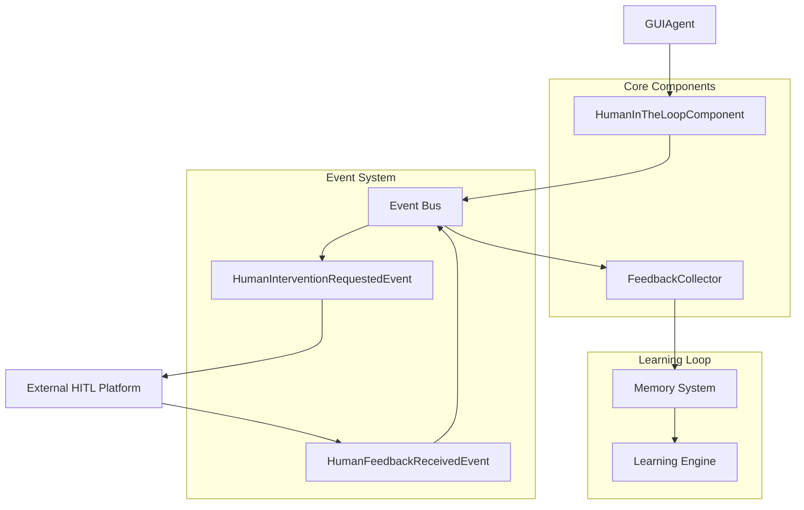
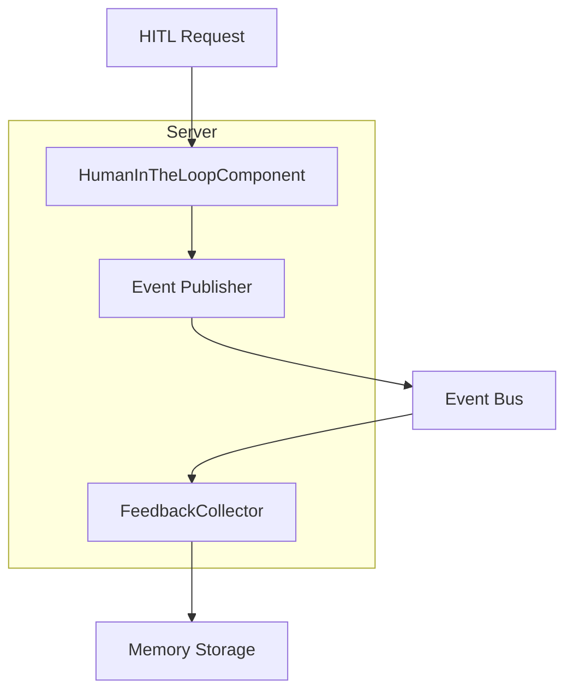
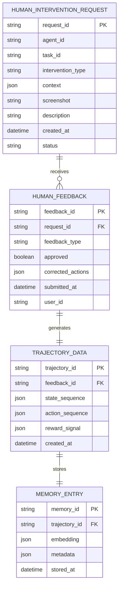

# M16.5 人机协作与持续学习技术架构文档

## 1. 架构设计



## 2. 技术描述

* Frontend: React\@18 + tailwindcss\@3 + vite

* Backend: agenticx.core.component.Component + agenticx.core.event.Event

* Database: agenticx.memory (内存系统)

* External Services: HITL Platform (Web UI)

## 3. 路由定义

| Route           | Purpose  |
| --------------- | -------- |
| /hitl/request   | 人工干预请求接口 |
| /hitl/feedback  | 人工反馈提交接口 |
| /hitl/dashboard | HITL管理面板 |
| /hitl/history   | 干预历史记录   |

## 4. API定义

### 4.1 核心API

人工干预请求

```
POST /api/hitl/request
```

Request:

| Param Name         | Param Type      | isRequired | Description                 |
| ------------------ | --------------- | ---------- | --------------------------- |
| context            | GUIAgentContext | true       | 当前智能体上下文                    |
| intervention\_type | string          | true       | 干预类型: validation/correction |
| screenshot         | string          | false      | 当前屏幕截图(base64)              |
| description        | string          | true       | 问题描述                        |

Response:

| Param Name  | Param Type | Description |
| ----------- | ---------- | ----------- |
| request\_id | string     | 干预请求ID      |
| status      | string     | 请求状态        |

Example

```json
{
  "context": {
    "agent_id": "gui_agent_001",
    "task_id": "login_task",
    "metadata": {
      "current_page": "login_page",
      "confidence": 0.3
    }
  },
  "intervention_type": "validation",
  "description": "无法确定正确的登录按钮"
}
```

人工反馈提交

```
POST /api/hitl/feedback
```

Request:

| Param Name         | Param Type | isRequired | Description |
| ------------------ | ---------- | ---------- | ----------- |
| request\_id        | string     | true       | 对应的请求ID     |
| feedback\_type     | string     | true       | 反馈类型        |
| approved           | boolean    | false      | 是否批准(验证类型)  |
| corrected\_actions | array      | false      | 修正的动作序列     |

Response:

| Param Name | Param Type | Description |
| ---------- | ---------- | ----------- |
| status     | boolean    | 提交状态        |
| message    | string     | 状态消息        |

## 5. 服务器架构图



## 6. 数据模型

### 6.1 数据模型定义



### 6.2 数据定义语言

人工干预请求表 (human\_intervention\_requests)

```sql
-- create table
CREATE TABLE human_intervention_requests (
    request_id UUID PRIMARY KEY DEFAULT gen_random_uuid(),
    agent_id VARCHAR(255) NOT NULL,
    task_id VARCHAR(255) NOT NULL,
    intervention_type VARCHAR(50) NOT NULL CHECK (intervention_type IN ('validation', 'correction', 'demonstration')),
    context JSONB NOT NULL,
    screenshot TEXT,
    description TEXT NOT NULL,
    status VARCHAR(50) DEFAULT 'pending' CHECK (status IN ('pending', 'completed', 'cancelled')),
    created_at TIMESTAMP WITH TIME ZONE DEFAULT NOW(),
    updated_at TIMESTAMP WITH TIME ZONE DEFAULT NOW()
);

-- create index
CREATE INDEX idx_intervention_requests_agent_id ON human_intervention_requests(agent_id);
CREATE INDEX idx_intervention_requests_status ON human_intervention_requests(status);
CREATE INDEX idx_intervention_requests_created_at ON human_intervention_requests(created_at DESC);
```

人工反馈表 (human\_feedback)

```sql
-- create table
CREATE TABLE human_feedback (
    feedback_id UUID PRIMARY KEY DEFAULT gen_random_uuid(),
    request_id UUID NOT NULL REFERENCES human_intervention_requests(request_id),
    feedback_type VARCHAR(50) NOT NULL CHECK (feedback_type IN ('validation', 'correction', 'demonstration')),
    approved BOOLEAN,
    corrected_actions JSONB,
    user_id VARCHAR(255),
    submitted_at TIMESTAMP WITH TIME ZONE DEFAULT NOW()
);

-- create index
CREATE INDEX idx_feedback_request_id ON human_feedback(request_id);
CREATE INDEX idx_feedback_submitted_at ON human_feedback(submitted_at DESC);
```

轨迹数据表 (trajectory\_data)

```sql
-- create table
CREATE TABLE trajectory_data (
    trajectory_id UUID PRIMARY KEY DEFAULT gen_random_uuid(),
    feedback_id UUID NOT NULL REFERENCES human_feedback(feedback_id),
    state_sequence JSONB NOT NULL,
    action_sequence JSONB NOT NULL,
    reward_signal JSONB,
    created_at TIMESTAMP WITH TIME ZONE DEFAULT NOW()
);

-- create index
CREATE INDEX idx_trajectory_feedback_id ON trajectory_data(feedback_id);
CREATE INDEX idx_trajectory_created_at ON trajectory_data(created_at DESC);

-- init data
INSERT INTO human_intervention_requests (agent_id, task_id, intervention_type, context, description)
VALUES 
('demo_agent', 'demo_task', 'validation', '{"current_page": "login"}', '演示用干预请求'),
```

