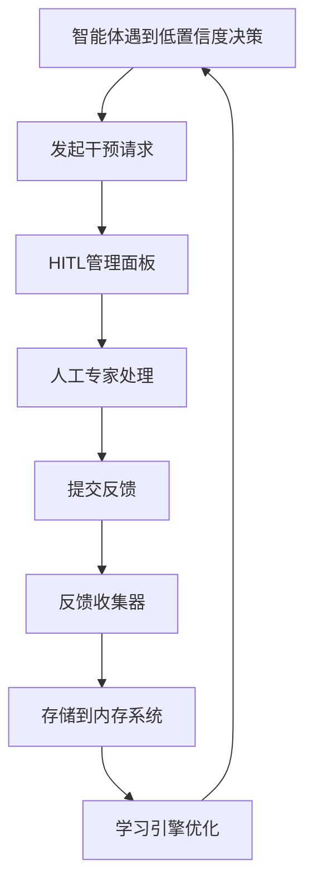

# M16.5 人机协作与持续学习产品需求文档

## 1. 产品概述

人机协作与持续学习模块(HITL)为AgenticX GUI智能体提供人工干预和反馈收集能力，当智能体遇到低置信度决策时可请求人工协助。

该模块通过事件驱动架构实现智能体与人工干预平台的解耦，收集结构化反馈数据用于持续学习和模型优化。

产品目标是提升GUI智能体的决策准确性和可靠性，建立人机协作的闭环学习机制。

## 2. 核心功能

### 2.1 用户角色

| 角色 | 注册方式 | 核心权限 |
|------|----------|----------|
| 系统管理员 | 系统预设账户 | 管理HITL平台、查看所有干预记录、配置系统参数 |
| 人工专家 | 邀请码注册 | 处理干预请求、提供反馈、查看历史记录 |
| GUI智能体 | 系统自动注册 | 发起干预请求、接收反馈结果 |

### 2.2 功能模块

本产品包含以下主要页面：

1. **HITL管理面板**: 干预请求列表、状态监控、统计分析
2. **干预处理页面**: 请求详情展示、反馈输入界面、操作演示工具
3. **历史记录页面**: 干预历史查询、反馈数据分析、学习效果评估
4. **系统配置页面**: 干预策略配置、通知设置、用户权限管理

### 2.3 页面详情

| 页面名称 | 模块名称 | 功能描述 |
|----------|----------|----------|
| HITL管理面板 | 请求列表 | 显示待处理和已处理的干预请求，支持筛选和排序 |
| HITL管理面板 | 状态监控 | 实时显示系统状态、处理队列长度、响应时间统计 |
| HITL管理面板 | 统计分析 | 展示干预频率、成功率、学习效果等关键指标 |
| 干预处理页面 | 请求详情 | 展示智能体上下文、屏幕截图、问题描述等详细信息 |
| 干预处理页面 | 反馈输入 | 提供验证确认、动作修正、操作演示等反馈方式 |
| 干预处理页面 | 操作演示 | 录制正确操作序列，生成标准化动作数据 |
| 历史记录页面 | 记录查询 | 按时间、类型、智能体等条件查询历史干预记录 |
| 历史记录页面 | 数据分析 | 分析反馈质量、学习趋势、改进建议 |
| 历史记录页面 | 效果评估 | 评估人工反馈对智能体性能提升的效果 |
| 系统配置页面 | 策略配置 | 设置干预触发条件、优先级规则、超时处理 |
| 系统配置页面 | 通知设置 | 配置邮件、消息推送等通知方式 |
| 系统配置页面 | 权限管理 | 管理用户角色、访问权限、操作日志 |

## 3. 核心流程

### 主要用户操作流程

**智能体干预请求流程**：
1. GUI智能体在执行任务时遇到低置信度决策
2. 智能体调用HumanInTheLoopComponent发起干预请求
3. 系统生成HumanInterventionRequestedEvent事件
4. 事件通过Event Bus传递到HITL平台
5. 平台通知人工专家处理请求

**人工专家处理流程**：
1. 专家登录HITL管理面板查看待处理请求
2. 点击请求进入干预处理页面
3. 查看智能体上下文和问题描述
4. 根据干预类型提供相应反馈
5. 提交反馈，系统生成HumanFeedbackReceivedEvent

**持续学习流程**：
1. FeedbackCollector接收人工反馈事件
2. 将反馈数据转换为TrajectoryData格式
3. 存储到Memory系统供学习引擎使用
4. 学习引擎基于反馈数据优化智能体策略

## 4. 用户界面设计

### 4.1 设计风格

- 主色调：#2563eb (蓝色)，辅助色：#f3f4f6 (浅灰)
- 按钮样式：圆角矩形，悬停效果，阴影设计
- 字体：系统默认字体，标题16px，正文14px，说明文字12px
- 布局风格：卡片式布局，左侧导航栏，响应式设计
- 图标风格：线性图标，统一风格，支持深色模式

### 4.2 页面设计概览

| 页面名称 | 模块名称 | UI元素 |
|----------|----------|--------|
| HITL管理面板 | 请求列表 | 表格组件，状态标签，操作按钮，分页器，搜索框 |
| HITL管理面板 | 状态监控 | 仪表盘卡片，实时数据图表，状态指示器，刷新按钮 |
| HITL管理面板 | 统计分析 | 折线图，柱状图，饼图，数据卡片，时间选择器 |
| 干预处理页面 | 请求详情 | 信息卡片，截图展示，JSON查看器，时间轴组件 |
| 干预处理页面 | 反馈输入 | 表单组件，单选框，多选框，文本域，提交按钮 |
| 干预处理页面 | 操作演示 | 录制控件，步骤列表，预览窗口，保存按钮 |
| 历史记录页面 | 记录查询 | 高级搜索，过滤器，结果列表，导出功能 |
| 历史记录页面 | 数据分析 | 趋势图表，对比分析，统计表格，下载报告 |
| 系统配置页面 | 策略配置 | 配置表单，规则编辑器，预览功能，保存确认 |

### 4.3 响应式设计

产品采用桌面优先的响应式设计，支持平板和移动设备访问。关键功能在移动端进行触控优化，确保人工专家可以随时随地处理干预请求。