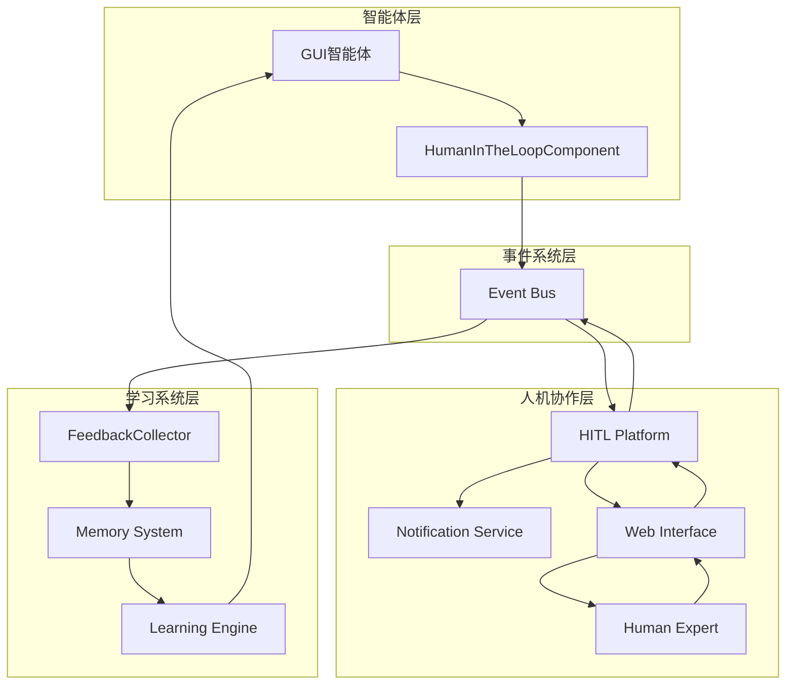
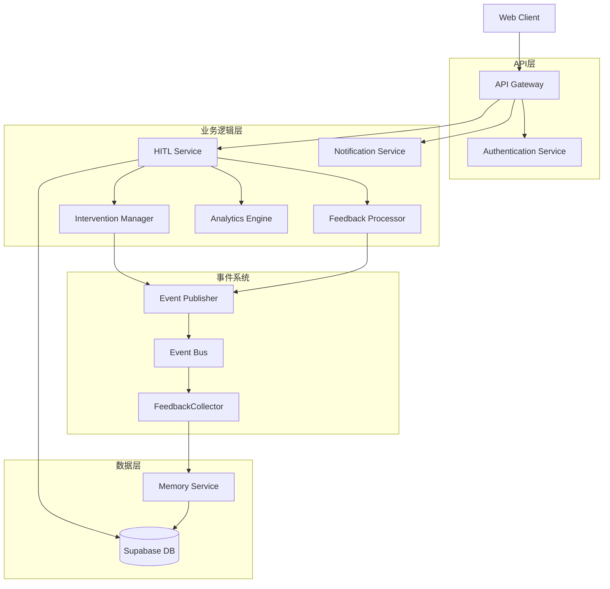
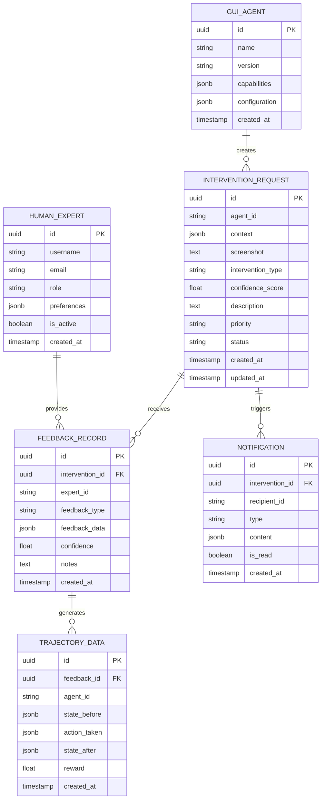

# M16.5 人机协作与持续学习技术架构文档

## 1. 架构设计



## 2. 技术描述

* 前端: React\@18 + TypeScript + Tailwind CSS + Vite

* 后端: FastAPI + Python 3.9+ + Pydantic

* 数据库: Supabase (PostgreSQL)

* 事件系统: 内置Event Bus (基于asyncio)

* 实时通信: WebSocket + Server-Sent Events

* 通知服务: 邮件 + WebSocket推送

## 3. 路由定义

| 路由                     | 用途         |
| ---------------------- | ---------- |
| /hitl                  | HITL管理面板主页 |
| /hitl/dashboard        | 干预请求仪表盘    |
| /hitl/intervention/:id | 干预处理页面     |
| /hitl/history          | 历史记录查询页面   |
| /hitl/analytics        | 数据分析页面     |
| /hitl/settings         | 系统配置页面     |
| /hitl/login            | 人工专家登录页面   |

## 4. API定义

### 4.1 核心API

**人工干预请求**

```
POST /api/hitl/intervention/request
```

请求参数:

| 参数名                | 参数类型   | 是否必需  | 描述                                        |
| ------------------ | ------ | ----- | ----------------------------------------- |
| agent\_id          | string | true  | 智能体唯一标识                                   |
| context            | object | true  | 智能体当前上下文                                  |
| screenshot         | string | false | 屏幕截图base64编码                              |
| intervention\_type | string | true  | 干预类型(validation/correction/demonstration) |
| confidence\_score  | float  | true  | 置信度分数(0-1)                                |
| description        | string | true  | 问题描述                                      |
| priority           | string | false | 优先级(low/medium/high)                      |

响应:

| 参数名                   | 参数类型    | 描述        |
| --------------------- | ------- | --------- |
| intervention\_id      | string  | 干预请求唯一标识  |
| status                | string  | 请求状态      |
| estimated\_wait\_time | integer | 预估等待时间(秒) |

示例:

```json
{
  "agent_id": "gui_agent_001",
  "context": {
    "current_task": "填写表单",
    "current_element": "input[name='email']",
    "action_history": [...]
  },
  "intervention_type": "validation",
  "confidence_score": 0.3,
  "description": "无法确定邮箱输入格式是否正确"
}
```

**人工反馈提交**

```
POST /api/hitl/feedback/submit
```

请求参数:

| 参数名              | 参数类型   | 是否必需  | 描述     |
| ---------------- | ------ | ----- | ------ |
| intervention\_id | string | true  | 干预请求ID |
| expert\_id       | string | true  | 专家用户ID |
| feedback\_type   | string | true  | 反馈类型   |
| feedback\_data   | object | true  | 反馈数据   |
| confidence       | float  | true  | 反馈置信度  |
| notes            | string | false | 备注说明   |

响应:

| 参数名          | 参数类型   | 描述     |
| ------------ | ------ | ------ |
| feedback\_id | string | 反馈记录ID |
| status       | string | 处理状态   |

**获取干预请求列表**

```
GET /api/hitl/interventions
```

查询参数:

| 参数名       | 参数类型    | 是否必需  | 描述    |
| --------- | ------- | ----- | ----- |
| status    | string  | false | 状态筛选  |
| priority  | string  | false | 优先级筛选 |
| agent\_id | string  | false | 智能体筛选 |
| page      | integer | false | 页码    |
| limit     | integer | false | 每页数量  |

## 5. 服务器架构图



## 6. 数据模型

### 6.1 数据模型定义



### 6.2 数据定义语言

**干预请求表 (intervention\_requests)**

```sql
-- 创建表
CREATE TABLE intervention_requests (
    id UUID PRIMARY KEY DEFAULT gen_random_uuid(),
    agent_id VARCHAR(255) NOT NULL,
    context JSONB NOT NULL,
    screenshot TEXT,
    intervention_type VARCHAR(50) NOT NULL CHECK (intervention_type IN ('validation', 'correction', 'demonstration')),
    confidence_score FLOAT NOT NULL CHECK (confidence_score >= 0 AND confidence_score <= 1),
    description TEXT NOT NULL,
    priority VARCHAR(20) DEFAULT 'medium' CHECK (priority IN ('low', 'medium', 'high')),
    status VARCHAR(20) DEFAULT 'pending' CHECK (status IN ('pending', 'processing', 'completed', 'cancelled')),
    created_at TIMESTAMP WITH TIME ZONE DEFAULT NOW(),
    updated_at TIMESTAMP WITH TIME ZONE DEFAULT NOW()
);

-- 创建索引
CREATE INDEX idx_intervention_requests_agent_id ON intervention_requests(agent_id);
CREATE INDEX idx_intervention_requests_status ON intervention_requests(status);
CREATE INDEX idx_intervention_requests_priority ON intervention_requests(priority);
CREATE INDEX idx_intervention_requests_created_at ON intervention_requests(created_at DESC);

-- 权限设置
GRANT SELECT ON intervention_requests TO anon;
GRANT ALL PRIVILEGES ON intervention_requests TO authenticated;
```

**反馈记录表 (feedback\_records)**

```sql
-- 创建表
CREATE TABLE feedback_records (
    id UUID PRIMARY KEY DEFAULT gen_random_uuid(),
    intervention_id UUID NOT NULL,
    expert_id VARCHAR(255) NOT NULL,
    feedback_type VARCHAR(50) NOT NULL CHECK (feedback_type IN ('validation', 'correction', 'demonstration')),
    feedback_data JSONB NOT NULL,
    confidence FLOAT NOT NULL CHECK (confidence >= 0 AND confidence <= 1),
    notes TEXT,
    created_at TIMESTAMP WITH TIME ZONE DEFAULT NOW()
);

-- 创建索引
CREATE INDEX idx_feedback_records_intervention_id ON feedback_records(intervention_id);
CREATE INDEX idx_feedback_records_expert_id ON feedback_records(expert_id);
CREATE INDEX idx_feedback_records_created_at ON feedback_records(created_at DESC);

-- 权限设置
GRANT SELECT ON feedback_records TO anon;
GRANT ALL PRIVILEGES ON feedback_records TO authenticated;
```

**轨迹数据表 (trajectory\_data)**

```sql
-- 创建表
CREATE TABLE trajectory_data (
    id UUID PRIMARY KEY DEFAULT gen_random_uuid(),
    feedback_id UUID NOT NULL,
    agent_id VARCHAR(255) NOT NULL,
    state_before JSONB NOT NULL,
    action_taken JSONB NOT NULL,
    state_after JSONB NOT NULL,
    reward FLOAT NOT NULL,
    created_at TIMESTAMP WITH TIME ZONE DEFAULT NOW()
);

-- 创建索引
CREATE INDEX idx_trajectory_data_feedback_id ON trajectory_data(feedback_id);
CREATE INDEX idx_trajectory_data_agent_id ON trajectory_data(agent_id);
CREATE INDEX idx_trajectory_data_created_at ON trajectory_data(created_at DESC);

-- 权限设置
GRANT SELECT ON trajectory_data TO anon;
GRANT ALL PRIVILEGES ON trajectory_data TO authenticated;
```

**人工专家表 (human\_experts)**

```sql
-- 创建表
CREATE TABLE human_experts (
    id UUID PRIMARY KEY DEFAULT gen_random_uuid(),
    username VARCHAR(100) UNIQUE NOT NULL,
    email VARCHAR(255) UNIQUE NOT NULL,
    role VARCHAR(50) DEFAULT 'expert' CHECK (role IN ('admin', 'expert')),
    preferences JSONB DEFAULT '{}',
    is_active BOOLEAN DEFAULT true,
    created_at TIMESTAMP WITH TIME ZONE DEFAULT NOW()
);

-- 创建索引
CREATE INDEX idx_human_experts_username ON human_experts(username);
CREATE INDEX idx_human_experts_email ON human_experts(email);
CREATE INDEX idx_human_experts_is_active ON human_experts(is_active);

-- 权限设置
GRANT SELECT ON human_experts TO anon;
GRANT ALL PRIVILEGES ON human_experts TO authenticated;
```

**GUI智能体表 (gui\_agents)**

```sql
-- 创建表
CREATE TABLE gui_agents (
    id UUID PRIMARY KEY DEFAULT gen_random_uuid(),
    name VARCHAR(255) NOT NULL,
    version VARCHAR(50) NOT NULL,
    capabilities JSONB DEFAULT '{}',
    configuration JSONB DEFAULT '{}',
    created_at TIMESTAMP WITH TIME ZONE DEFAULT NOW()
);

-- 创建索引
CREATE INDEX idx_gui_agents_name ON gui_agents(name);
CREATE INDEX idx_gui_agents_version ON gui_agents(version);

-- 权限设置
GRANT SELECT ON gui_agents TO anon;
GRANT ALL PRIVILEGES ON gui_agents TO authenticated;
```

**通知表 (notifications)**

```sql
-- 创建表
CREATE TABLE notifications (
    id UUID PRIMARY KEY DEFAULT gen_random_uuid(),
    intervention_id UUID NOT NULL,
    recipient_id VARCHAR(255) NOT NULL,
    type VARCHAR(50) NOT NULL CHECK (type IN ('email', 'websocket', 'sms')),
    content JSONB NOT NULL,
    is_read BOOLEAN DEFAULT false,
    created_at TIMESTAMP WITH TIME ZONE DEFAULT NOW()
);

-- 创建索引
CREATE INDEX idx_notifications_intervention_id ON notifications(intervention_id);
CREATE INDEX idx_notifications_recipient_id ON notifications(recipient_id);
CREATE INDEX idx_notifications_is_read ON notifications(is_read);
CREATE INDEX idx_notifications_created_at ON notifications(created_at DESC);

-- 权限设置
GRANT SELECT ON notifications TO anon;
GRANT ALL PRIVILEGES ON notifications TO authenticated;
```

**初始化数据**

```sql
-- 插入示例人工专家
INSERT INTO human_experts (username, email, role) VALUES
('admin', 'admin@agenticx.com', 'admin'),
('expert1', 'expert1@agenticx.com', 'expert'),
('expert2', 'expert2@agenticx.com', 'expert');

-- 插入示例GUI智能体
INSERT INTO gui_agents (name, version, capabilities) VALUES
('WebNavigator', '1.0.0', '{"web_browsing": true, "form_filling": true}'),
('DesktopAutomator', '1.0.0', '{"desktop_automation": true, "file_operations": true}');
```

