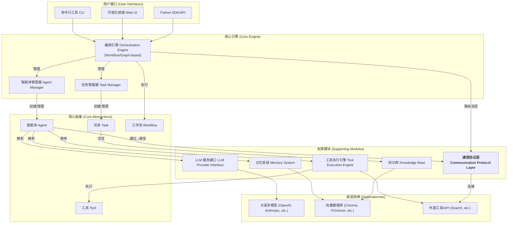

# AgenticX: 一个统一的多智能体框架

## 1. 愿景与目标 (Vision & Goals)

**愿景:** 打造一个集大成的、高度可扩展、对开发者友好的多智能体（Multi-Agent）开发框架。它将融合业界主流框架（如 CrewAI, AutoGen, LangGraph, MetaGPT 等）的优点，为开发者提供一套从快速原型到生产级应用的完整解决方案。

**核心目标:**
*   **统一与简化:** 提供统一的 Agent、Task、Tool 和 Workflow 定义，简化多智能体应用的开发复杂度。
*   **灵活性与可扩展性:** 采用基于图（Graph-based）的流程编排，支持任意复杂的协作模式。所有核心组件（LLM、Memory、Tools）均可插拔和自定义。
*   **强大功能:** 内置强大的记忆系统、丰富的工具集和精细的任务管理机制。
*   **可观测性:** 提供一流的可视化调试、日志和追踪能力，让 Agent 的"思考过程"不再是黑盒。
*   **开发者体验:** 提供清晰的文档、丰富的示例和直观的 SDK/API。

## 2. 技术架构 (Technical Architecture)

## 3. 功能模块拆解 (Functional Modules Breakdown)

基于该架构，我们可以定义以下功能模块:

*   **M1: 核心抽象层 (`agenticx.core`)**: 定义框架的基础数据结构。
*   **M2: LLM 服务提供层 (`agenticx.llms`)**: 对接不同的大语言模型。
*   **M3: 工具系统 (`agenticx.tools`)**: 定义和管理 Agent 可用的工具。
*   **M4: 记忆系统 (`agenticx.memory`)**: 为 Agent 提供短期和长期记忆。
*   **M5: 智能体核心 (`agenticx.agent`)**: 定义 Agent 的生命周期和执行逻辑。
*   **M6: 任务管理 (`agenticx.task`)**: 定义、分配和追踪任务。
*   **M7: 编排引擎 (`agenticx.orchestrator`)**: 负责驱动整个协作流程。
*   **M8: 通信协议层 (`agenticx.protocols`)**: 负责 Agent 间和跨平台的通信。
*   **M9: 可观测性 (`agenticx.callbacks`)**: 日志、追踪和可视化。
*   **M10: 用户接口 (`agenticx.interfaces`)**: CLI、SDK 和未来的 Web UI。

## 4. 开发路线图 (Development Roadmap / To-Do List)

针对每个模块，我们拆解出具体的开发任务，可以逐一完成并勾选。

### M1: 核心抽象层 (`agenticx.core`)
- [ ] `Agent` Class: 定义 Agent 的基本属性（role, goal, backstory, llm_config, memory, tools）。
- [ ] `Task` Class: 定义任务的属性（description, agent, expected_output, context, tools）。
- [ ] `Tool` Class/Decorator: 定义工具的接口规范，支持 Pydantic 模型作为输入。
- [ ] `Workflow` Class: 定义工作流的结构（例如，节点和边的图结构）。
- [ ] `Message` Class: 定义 Agent 之间通信的消息格式。

### M2: LLM 服务提供层 (`agenticx.llms`)
- [ ] 设计统一的 LLM Provider 接口 (`BaseLLMProvider`)。
- [ ] 实现 OpenAI Provider (GPT-3.5, GPT-4, etc.)。
- [ ] 实现 Anthropic Provider (Claude 3 family)。
- [ ] (可选) 实现本地模型 Provider (Ollama, LM Studio)。
- [ ] (可选) 实现 Azure OpenAI Provider。
- [ ] 实现 Token 使用计数和成本估算。

### M3: 工具系统 (`agenticx.tools`)
- [ ] 使用 `@tool` 装饰器轻松创建工具。
- [ ] 内置一组基础工具集 (e.g., `search`, `file_read`, `file_write`, `execute_python_code`)。
- [ ] 工具执行引擎，带错误处理和安全沙箱（针对代码执行）。
- [ ] 支持异步工具。
- [ ] (可选) 工具认证和权限管理。

### M4: 记忆系统 (`agenticx.memory`)
- [ ] `BaseMemory` 接口定义。
- [ ] `ShortTermMemory`: 实现简单的会话内记忆（如消息历史）。
- [ ] `LongTermMemory`: 对接向量数据库。
    - [ ] 实现 ChromaDB/LanceDB 的集成。
    - [ ] 实现 RAG (Retrieval-Augmented Generation) 逻辑。
- [ ] `KnowledgeBase`: 允许为任务或 Agent 挂载特定的知识库。

### M5: 智能体核心 (`agenticx.agent`)
- [ ] Agent 执行循环 (think-act loop)。
- [ ] 实现 ReAct (Reasoning and Acting) 风格的 Prompting 和逻辑。
- [ ] 支持 Plan-and-Execute 模式。
- [ ] Agent 间通信接口（`send`, `receive` a message）。
- [ ] 错误处理和重试机制。

### M6: 任务管理 (`agenticx.task`)
- [ ] Task 执行器，调用 Agent 完成任务。
- [ ] Task 上下文管理，将相关信息（如前置任务输出）传递给 Agent。
- [ ] (可选) 任务依赖管理和拓扑排序。
- [ ] (可选) 任务结果校验和格式化。

### M7: 编排引擎 (`agenticx.orchestrator`)
- [ ] 基于图的编排逻辑 (`graph-based`)。
    - [ ] 定义节点（Agent/Task）和边（条件/数据流）。
    - [ ] 实现图的遍历和执行。
- [ ] 支持顺序工作流 (`sequential`)。
- [ ] 支持层次化工作流（`hierarchical`, e.g., Manager-Worker）。
- [ ] 支持会话式工作流 (`conversational`, e.g., group chat)。
- [ ] 状态管理，追踪整个工作流的状态。

### M8: 通信协议层 (`agenticx.protocols`)
- [ ] 定义标准的 `ProtocolMessage` 或 `Envelope` 类，包含 header 和 body。
- [ ] 设计 `BaseProtocolHandler` 接口，用于协议的编解码和路由。
- [ ] 实现一个高效的内部 a2a (Agent-to-Agent) 协议处理器。
- [ ] (研究) 调研并实现一个兼容外部标准的 MCP (Multi-Agent Communication Protocol) 处理器。
- [ ] 将协议层集成到 `Agent` 的 `send/receive` 方法中。
- [ ] (可选) 支持消息的持久化和重传机制。

### M9: 可观测性 (`agenticx.callbacks`)
- [ ] 设计 Callback/Hook 系统 (`BaseCallbackHandler`)。
- [ ] 实现日志记录 Callback (`LoggingCallback`)。
- [ ] (可选) 集成 Langfuse/Langsmith 进行高级追踪。
- [ ] (可选) 为 Web UI 提供数据接口。

### M10: 用户接口 (`agenticx.interfaces`)
- [ ] 设计流畅的 Python SDK，用于定义和运行 Agent/Workflow。
- [ ] 实现命令行工具（CLI）。
    - [ ] `run` 命令来执行一个工作流文件。
    - [ ] `validate` 命令来检查配置。
- [ ] (未来) 规划并设计 Web UI，用于可视化监控和交互。
