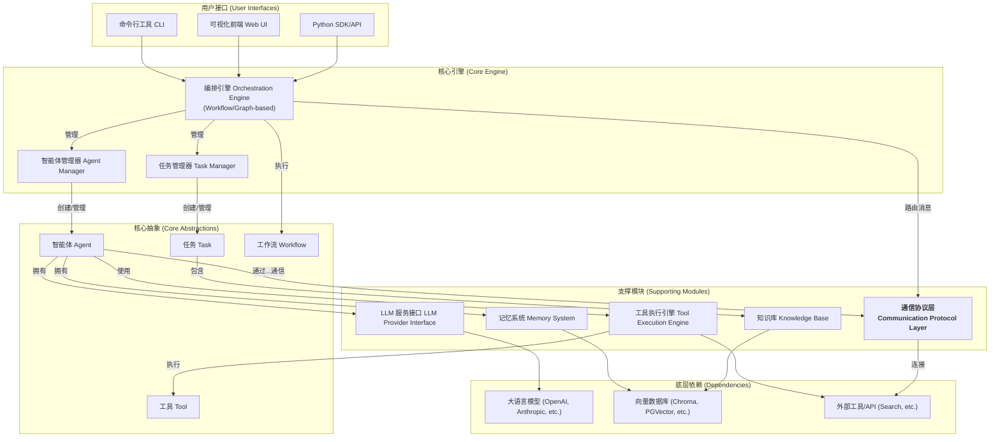

# AgenticX: 一个统一的多智能体框架

## 1. 愿景与目标 (Vision & Goals)

**愿景:** 打造一个集大成的、高度可扩展、对开发者友好的多智能体（Multi-Agent）开发框架。它将融合业界主流框架（如 CrewAI, AutoGen, LangGraph, MetaGPT 等）的优点，为开发者提供一套从快速原型到生产级应用的完整解决方案。

**核心目标:**
*   **统一与简化:** 提供统一的 Agent、Task、Tool 和 Workflow 定义，简化多智能体应用的开发复杂度。
*   **灵活性与可扩展性:** 采用基于图（Graph-based）的流程编排，支持任意复杂的协作模式。所有核心组件（LLM、Memory、Tools）均可插拔和自定义。
*   **强大功能:** 内置强大的记忆系统、丰富的工具集和精细的任务管理机制。
*   **可观测性:** 提供一流的可视化调试、日志和追踪能力，让 Agent 的"思考过程"不再是黑盒。
*   **开发者体验:** 提供清晰的文档、丰富的示例和直观的 SDK/API。

## 2. 技术架构 (Technical Architecture)

## 3. 功能模块拆解 (Functional Modules Breakdown)

基于该架构，我们可以定义以下功能模块:

*   **M1: 核心抽象层 (`agenticx.core`)**: 定义框架的基础数据结构。
*   **M2: LLM 服务提供层 (`agenticx.llms`)**: 对接不同的大语言模型。
*   **M3: 工具系统 (`agenticx.tools`)**: 定义和管理 Agent 可用的工具。
*   **M4: 记忆系统 (`agenticx.memory`)**: 为 Agent 提供短期和长期记忆。
*   **M5: 智能体核心 (`agenticx.agent`)**: 定义 Agent 的生命周期和执行逻辑。
*   **M6: 任务管理 (`agenticx.task`)**: 定义、分配和追踪任务。
*   **M7: 编排引擎 (`agenticx.orchestrator`)**: 负责驱动整个协作流程。
*   **M8: 通信协议层 (`agenticx.protocols`)**: 负责 Agent 间和跨平台的通信。
*   **M9: 可观测性 (`agenticx.callbacks`)**: 日志、追踪和可视化。
*   **M10: 用户接口 (`agenticx.interfaces`)**: CLI、SDK 和未来的 Web UI。
*   **M11: 平台服务层 (`agenticx.platform`)**: 覆盖多租户和安全。

## 4. 开发路线图 (Development Roadmap / To-Do List)

针对每个模块，我们拆解出具体的开发任务，可以逐一完成并勾选。

### M1: 核心抽象层 (`agenticx.core`)
- [ ] `Agent(BaseModel)`: 定义 Agent 的静态属性，如 `id`, `role`, `goal`, `backstory`, `llm_config`, `memory_config`, `tools`, `organization_id`。
- [ ] `Task(BaseModel)`: 定义任务的静态属性，如 `id`, `description`, `agent_id`, `expected_output`, `context`, `dependencies` (依赖的其他 Task ID), `output_schema`。
- [ ] `BaseTool(ABC)`: 工具的抽象基类，定义 `name`, `description`, `args_schema` (Pydantic Model), 以及 `execute(**kwargs)` 和 `aexecute(**kwargs)` 方法。
- [ ] `Workflow(BaseModel)`: 定义工作流的静态结构，包含 `id`, `name`, `nodes`, `edges`, `organization_id`。
- [ ] `Message(BaseModel)`: 定义 Agent 之间通信的消息格式，包含 `id`, `sender_id`, `recipient_id`, `content`, `metadata`。
- [ ] `User(BaseModel)` & `Organization(BaseModel)`: 定义用户和租户的基本数据结构，用于平台服务层。

### M2: LLM 服务提供层 (`agenticx.llms`)
- [ ] `BaseLLMProvider(ABC)`: 定义统一的 LLM Provider 接口，包含 `invoke(prompt)`, `ainvoke(prompt)`, `stream(prompt)` 等方法。
- [ ] `LLMResponse(BaseModel)`: 定义标准的 LLM 返回对象，包含 `content`, `token_usage`, `cost`, `model_name`。
- [ ] `OpenAIProvider(BaseLLMProvider)`: 实现 OpenAI 系列模型的服务对接。
- [ ] `AnthropicProvider(BaseLLMProvider)`: 实现 Anthropic Claude 系列模型的服务对接。
- [ ] (可选) `OllamaProvider(BaseLLMProvider)`: 实现对本地 Ollama 服务的对接。
- [ ] `TokenUsageTracker`: 一个工具类或 Callback，用于聚合和计算整个工作流的 Token 使用量和成本。

### M3: 工具系统 (`agenticx.tools`)
- [ ] `@tool` 装饰器: 一个工厂函数，能将任意 Python 函数快速包装成一个 `BaseTool` 的实例，并自动从函数签名和 docstring 推断 `name`, `description`, `args_schema`。
- [ ] `ToolExecutionEngine`: 工具执行引擎，负责安全地调用 `BaseTool` 的 `execute` 方法。
    - [ ] `SandboxEnvironment`: 为需要执行代码（如 Python）的工具提供一个隔离和安全的环境（例如，使用 Docker 容器或 WebAssembly）。
    - [ ] 内置错误处理和重试逻辑。
- [ ] `CredentialStore`: 一个安全的凭据管理器。
    - [ ] `get_credential(organization_id: str, tool_name: str)`: 根据组织和工具名获取凭据。
    - [ ] `set_credential(...)`: 设置凭据，并使用 M11 的 `EncryptionService` 进行加密存储。
- [ ] `BuiltInTools`: 提供一组开箱即用的基础工具集，如 `WebSearchTool`, `LocalFileTool`, `PythonCodeInterpreterTool`。

### M4: 记忆系统 (`agenticx.memory`)
> **启发来源**: `mem0.md` 的智能记忆层设计。
- [ ] `BaseMemory(ABC)`: 记忆接口，定义 `add`, `search`, `update`, `delete` 等核心方法，并强制要求实现租户隔离。
- [ ] `ShortTermMemory(BaseMemory)`: 实现基于会话的简单易失性记忆（如消息历史）。
- [ ] `LongTermMemory(BaseMemory)`: 对接向量数据库的长期语义记忆。
    - [ ] 内置 `RAGPipeline`: 实现标准的检索增强生成逻辑。
    - [ ] (可选) `MemoryUpdator` Component: 实现"提取-检索-推理-更新"的智能循环，在 `add` 方法中被调用，以实现记忆的自我演化。
- [ ] `GraphMemory(BaseMemory)`: (可选) 对接图数据库（如 Neo4j），用于存储和查询结构化的知识图谱。
- [ ] `MemoryHistory`: (可选) 记录对 `LongTermMemory` 和 `GraphMemory` 的所有变更操作，用于审计和调试。
- [ ] `KnowledgeBase`: 允许为任务或 Agent 挂载特定的、只读的知识集合（可基于向量存储）。

### M5: 智能体核心 (`agenticx.agent`)
- [ ] `AgentExecutor`: Agent 的执行器，包含 Agent 的核心 `think-act` 循环。
    - [ ] `run(task: Task)`: 接收一个任务并开始执行循环，直到任务完成或失败。
- [ ] `PromptManager`: 管理和格式化不同类型 Agent 所需的 Prompt 模板。
    - [ ] `ReActPromptTemplate`: 实现 ReAct 风格的 Prompting。
    - [ ] `PlanAndExecutePromptTemplate`: 实现 Plan-and-Execute 模式的 Prompting。
- [ ] `CommunicationInterface`: 实现 Agent 的通信能力。
    - [ ] `send(message: Message)`: 调用 M8 的协议层发送消息。
    - [ ] `receive() -> Message`: 从 M8 的协议层接收消息。
- [ ] `AgentRetryHandler`: 负责处理 Agent 执行过程中的错误，并根据配置进行重试。

### M6: 任务管理 (`agenticx.task`)
- [ ] `TaskExecutor`: 任务执行器，负责调用 `AgentExecutor` 来完成一个具体的 `Task`。
- [ ] `TaskContextManager`: 管理任务的上下文，将相关信息（如前置任务的输出 `task.context`）传递给 Agent。
- [ ] `TaskResultValidator`: (可选) 在任务完成后，根据 `task.output_schema` 校验 Agent 的最终输出结果是否符合预定义的格式。

### M7: 编排引擎 (`agenticx.orchestrator`)
> **启发来源**: `langgraph` 的图结构设计。
- [ ] `WorkflowManager`: 编排引擎的入口，负责执行一个 `Workflow`。
    - [ ] `run(workflow: Workflow, initial_state: dict)`: 启动并管理整个工作流的执行。
- [ ] `WorkflowGraph`: 一个有向无环图（DAG）的实现，用于执行 `Workflow` 定义。
    - [ ] `add_node(name: str, component: Union[AgentExecutor, BaseTool])`: 添加一个执行节点。
    - [ ] `add_edge(start_node: str, end_node: str, condition: Callable = None)`: 添加一条边，支持条件路由。
- [ ] `ExecutionState`: 一个在图中流转的状态对象，每个节点都可以读取和修改它。
- [ ] `WorkflowTemplates`: 提供工厂函数或类，用于快速构建常见的工作流模式。
    - [ ] `build_sequential_workflow(...)`: 构建顺序工作流。
    - [ ] `build_hierarchical_workflow(...)`: 构建经理-工人模式的层次化工作流。
- [ ] `WorkflowRun`: 一个持久化记录，用于审计和追踪。包含 `run_id`, `workflow_id`, `triggerer`, `organization_id`, `status`, `input`, `output`, `history` (所有中间步骤的日志)。

### M8: 通信协议层 (`agenticx.protocols`)
- [ ] `Envelope(BaseModel)`: 标准的消息信封，包含 `header` (元数据) 和 `body` (M1 的 `Message` 对象)。
- [ ] `BaseProtocolHandler(ABC)`: 协议处理器的接口，定义 `encode(envelope)` 和 `decode(raw_data)`。
- [ ] `InternalA2AHandler(BaseProtocolHandler)`: 一个高效的、用于进程内 Agent 间通信的协议处理器。
- [ ] (研究) `MCPHandler(BaseProtocolHandler)`: 兼容外部标准（如 FIPA）的 MCP 协议处理器，用于跨平台通信。
- [ ] `ProtocolRouter`: 根据消息的 `recipient_id` 或 `metadata`，选择合适的 `ProtocolHandler` 进行路由。

### M9: 可观测性 (`agenticx.callbacks`)
- [ ] `BaseCallbackHandler(ABC)`: 定义 Callback 系统的接口，包含 `on_workflow_start`, `on_workflow_end`, `on_agent_action`, `on_tool_start`, `on_tool_end`, `on_llm_stream` 等一系列事件钩子。
- [ ] `CallbackManager`: 管理所有注册的 `BaseCallbackHandler`，并在代码执行的关键节点触发相应的事件。
- [ ] `LoggingCallbackHandler(BaseCallbackHandler)`: 实现将所有事件以结构化日志格式输出。
- [ ] (可选) `LangfuseCallbackHandler(BaseCallbackHandler)`: 实现与 Langfuse 的集成，用于高级追踪和调试。
- [ ] (可选) `WebSocketCallbackHandler(BaseCallbackHandler)`: 将事件通过 WebSocket 发送到前端，支持实时可视化监控。

### M10: 用户接口 (`agenticx.interfaces`)
- [ ] `AgenticXClient`: 一个高层次的 Python SDK 客户端，封装了定义和运行工作流的常用操作，提供流畅的用户体验。
- [ ] `agenticx.cli`: 基于 `Typer` 或 `Click` 的命令行工具。
    - [ ] `run <workflow_file.py>`: 执行一个定义了工作流的 Python 文件。
    - [ ] `validate <config.yaml>`: 检查 Agent 或 Workflow 的配置文件是否合法。
- [ ] (未来) `agenticx.ui`: 一个基于 Web 的可视化界面，用于创建、管理、监控和调试 Agent 与工作流。

### M11: 平台服务层 (`agenticx.platform`)
> **启发来源**: `airweaves.md` 的整体多租户安全架构。
- [ ] **用户与组织管理**:
    - [ ] `User` & `Organization`: 定义数据库模型（如使用 SQLModel）。
    - [ ] `OrganizationService`: 实现用户邀请、加入/离开组织等业务逻辑。
- [ ] **认证与授权**:
    - [ ] `AuthContext`: 一个上下文变量 (`contextvars`)，在请求生命周期内持有当前的用户和组织信息。
    - [ ] `RBACService`: 实现基于角色的访问控制，提供如 `@require_role('admin')` 的装饰器。
    - [ ] `APIKeyAuthenticator`: 实现基于 API Key 的认证策略。
- [ ] **安全的资源访问**:
    - [ ] `BaseRepository`: 一个泛型基类，所有对数据库的 CRUD 操作都继承自它。它会自动使用 `AuthContext` 中的 `organization_id` 对查询进行过滤，确保数据隔离。
- [ ] **安全与加密**:
    - [ ] `EncryptionService`: 一个封装了加密库（如 Fernet）的服务，提供 `encrypt` 和 `decrypt` 方法，供 `CredentialStore` 等模块使用。
