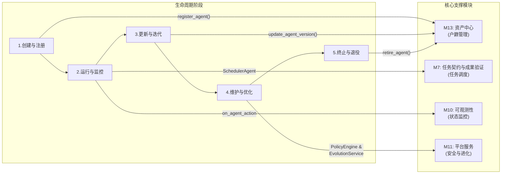

# AgenticX: 一个统一的多智能体框架

## 1. 愿景与目标 (Vision & Goals)

**愿景:** 打造一个统一、可扩展、生产就绪的多智能体应用开发框架，旨在赋予开发者构建从简单自动化助手到复杂协作式智能体系统的全部能力。

**核心目标:**
*   **统一的核心抽象 (Unified Core Abstractions):** 提供清晰、可复用的 `Agent`, `Task`, `Tool` 等核心构建块，作为所有应用的基础 (M1-M6)。
*   **智能检索系统 (Intelligent Retrieval System):** 构建统一、多策略的检索框架，支持向量检索、BM25检索、图检索等多种策略，并实现完全Agentic化的RAG流程 (M15)。
*   **灵活的编排引擎 (Flexible Orchestration Engine):** 内置强大的图式编排引擎，原生支持单智能体应用、顺序工作流、以及动态的多智能体协作，满足不同复杂度的需求 (M7)。
*   **企业级安全基座 (Enterprise-Ready Foundation):** 将多租户数据隔离、权限控制(RBAC)和安全护栏(Guardrails)作为框架的内置特性，确保开箱即用的安全合规 (M11)。
*   **可插拔的组件生态 (Pluggable Component Ecosystem):** 所有关键组件，包括 LLM、记忆系统、工具、检索系统、甚至企业数据源（通过连接器），都可轻松替换和扩展，避免厂商锁定 (M2, M3, M4, M8, M12, M15)。
*   **卓越的开发者体验 (Superior Developer Experience):** 提供一流的可观测性、简洁的 SDK/CLI，以及方便资产复用的中心库(Hub)，大幅提升开发和维护效率 (M9, M10, M13)。

## 2. 技术架构 (Technical Architecture)

```mermaid
graph TD
    subgraph "M10: 用户接口层 (User Interfaces)"
        SDK[Python SDK]
        CLI[CLI]
        UI[WebUI（未来）]
    end

    subgraph "核心框架层 (Core Framework)"
        subgraph "M8: 编排与路由引擎"
            Orchestrator["Orchestrator & Router"]
        end
        subgraph "M8.5: 多智能体协作框架"
            MasterSlave["Master-Slave Pattern"]
            Reflection["Reflection Pattern"]
            Debate["Debate Pattern"]
            GroupChat["Group Chat Pattern"]
            Parallel["Parallel Pattern"]
            Nested["Nested Pattern"]
            Dynamic["Dynamic Pattern"]
            Async["Async Pattern"]
        end
        subgraph "M5, M6: 执行器"
            AgentExecutor["Agent Executor"]
            TaskExecutor["Task Executor"]
        end
        subgraph "M1-M4: 核心抽象与组件"
            direction LR
            Agent["Agent"]
            Task["Task"]
            Tool["Tool"]
            LLM["LLM Provider"]
            
            subgraph "M4: 分层记忆系统"
                CoreMem["Core Memory"]
                EpisodicMem["Episodic Memory"]
                SemanticMem["Semantic Memory"]
                ProceduralMem["Procedural Memory"]
                ResourceMem["Resource Memory"]
                KnowledgeVault["Knowledge Vault"]
                HybridSearch["Hybrid Search Engine"]
            end
            
            subgraph "M15: 智能检索系统"
                VectorRetriever["Vector Retriever"]
                BM25Retriever["BM25 Retriever"]
                HybridRetriever["Hybrid Retriever"]
                RetrievalAgent["Retrieval Agent"]
                RerankingAgent["Reranking Agent"]
                RAGTools["RAG Tools"]
            end
        end
    end

    subgraph "平台服务层 (Platform Services)"
        subgraph "M13: 资产中心"
            Hub["Agent/Workflow/Tool Hub"]
        end
        subgraph "M12: 知识层"
            Knowledge["Connectors &<br>Unified Search"]
        end
        subgraph "M11: 安全与租户"
            Security["RBAC & Guardrails"]
        end
        subgraph "M10: 可观测性"
            Callbacks["Callback Manager"]
            MemoryMonitor["Memory Monitor"]
            CollabMonitor["Collaboration Monitor"]
            Dashboard["Real-time Dashboard"]
        end
        subgraph "M9: 通信协议"
            Protocols["Protocol Handlers"]
            MemorySync["Memory Sync"]
            RealTimeComm["Real-time Communication"]
        end
    end

    %% Connections
    SDK & CLI & UI -- "构建/运行" --> Orchestrator

    Orchestrator -- "调度" --> TaskExecutor
    Orchestrator -- "协作模式" --> MasterSlave & Reflection & Debate & GroupChat & Parallel & Nested & Dynamic & Async
    TaskExecutor -- "调用" --> AgentExecutor
    AgentExecutor -- "使用" --> Agent & Task & Tool & LLM

    %% Memory System Connections
    AgentExecutor -- "读写" --> CoreMem & EpisodicMem & SemanticMem
    AgentExecutor -- "检索" --> HybridSearch
    HybridSearch -- "搜索" --> ProceduralMem & ResourceMem & KnowledgeVault
    
    %% Retrieval System Connections
    AgentExecutor -- "智能检索" --> RetrievalAgent
    RetrievalAgent -- "多策略检索" --> VectorRetriever & BM25Retriever & HybridRetriever
    RetrievalAgent -- "结果重排" --> RerankingAgent
    AgentExecutor -- "RAG工具" --> RAGTools
    
    %% Platform Services Connections
    AgentExecutor -- "触发" --> Callbacks
    AgentExecutor -- "发送/接收" --> Protocols
    AgentExecutor -- "检查" --> Security
    Agent & Tool & Workflow -- "注册/发现" --> Hub
    Tool -- "访问" --> Knowledge
    
    %% Advanced Monitoring
    CoreMem & EpisodicMem & SemanticMem -- "监控" --> MemoryMonitor
    AgentExecutor -- "协作监控" --> CollabMonitor
    MasterSlave & Reflection & Debate & GroupChat & Parallel & Nested & Dynamic & Async -- "协作监控" --> CollabMonitor
    MemoryMonitor & CollabMonitor -- "可视化" --> Dashboard
    
    %% Memory Collaboration
    CoreMem & EpisodicMem & SemanticMem -- "同步" --> MemorySync
    MemorySync -- "实时通信" --> RealTimeComm
```

## 3. 功能模块拆解 (Functional Modules Breakdown)

基于该架构，我们可以定义以下功能模块:

*   **M1: 核心抽象层 (`agenticx.core`)**: 定义框架的基础数据结构。
*   **M2: LLM 服务提供层 (`agenticx.llms`)**: 对接不同的大语言模型。
*   **M3: 向量嵌入服务层 (`agenticx.embeddings`)**: 提供统一、可扩展的文本向量化能力，支持多种国内外 embedding 服务。
*   **M4: 工具系统 (`agenticx.tools`)**: 定义和管理 Agent 可用的工具。
*   **M5: 记忆系统 (`agenticx.memory`)**: 为 Agent 提供短期和长期记忆。
*   **M6: 智能体核心 (`agenticx.agent`)**: 定义 Agent 的生命周期和执行逻辑。
*   **M7: 任务契约与成果验证 (`agenticx.task`)**: 定义、分配和追踪任务，确保任务产出符合预定义的契约。
*   **M8: 编排与路由引擎 (`agenticx.orchestrator`)**: 负责驱动整个协作流程。
*   **M8.5: 多智能体协作框架 (`agenticx.collaboration`)**: 支持8种核心协作模式（主从层次、反思、辩论、群聊、并行化、嵌套、动态添加、异步协作），实现从简单任务分发到复杂团队协作的全场景覆盖。
*   **M9: 智能体通信协议 (`agenticx.protocols`)**: 负责 Agent 间和跨平台的通信。
*   **M10: 可观测性与分析 (`agenticx.observability`)**: 日志、追踪和可视化。
*   **M11: 用户接口 (`agenticx.interfaces`)**: CLI、SDK 和未来的 Web UI。
*   **M12: 平台服务层 (`agenticx.platform`)**: 覆盖多租户、安全与治理。
*   **M13: 知识与数据层 (`agenticx.knowledge`)**: 统一的数据连接、处理和权限化访问。
*   **M14: 资产中心 (`agenticx.hub`)**: 管理和复用 Agents, Workflows, 和 Models。
*   **M15: 智能检索系统 (`agenticx.retrieval`)**: 统一、多策略的检索框架，支持向量检索、BM25检索、图检索等多种策略，并实现完全Agentic化的RAG流程。

## 4. 智能体全生命周期管理 (Agent Lifecycle Management)

AgenticX 框架的设计贯穿了对智能体（Agent）从诞生到消亡的全生命周期管理。这并非一个独立的模块，而是将管理理念融入到平台服务、可观测性和资产中心等多个模块中的一套组合能力，确保了 Agent 的可控性、可维护性和可持续进化。

- **1. 创建阶段 (Creation)**: 新的 Agent 定义被提交到 `M13: AgentHub` 进行注册，获得唯一的身份和版本号。平台在部署时可利用 `M11` 的安全服务进行代码扫描和依赖校验。
- **2. 运行阶段 (Running)**: `M8: SchedulerAgent` 基于 `M10` 提供的实时监控数据（负载、性能）和 `M13` 中的静态元数据（技能、成本）进行智能调度。所有行为都被 `M10` 的回调函数捕获，并可在 `M11` 提供的沙箱环境中安全执行。
- **3. 更新阶段 (Updating)**: 开发者向 `M13: AgentHub` 提交新版本的 Agent。`M11` 的 RBAC 服务确保只有授权用户可以执行更新。`M8` 的调度器会逐渐将流量切换到新版本。
- **4. 维护与优化阶段 (Maintenance & Optimization)**: `M11` 的 `PolicyEngine` 持续对 Agent 行为进行合规性检查。未来的 `EvolutionService` 将分析 `M10` 收集的历史数据，对 Agent 的 Prompt 或策略进行自动优化建议。
- **5. 终止阶段 (Termination & Destruction)**: 当一个 Agent 或其特定版本不再需要时，可以通过 `M13: AgentHub` 将其标记为"已退役"，系统将不再向其调度任务，并最终清理相关资源。

## 5. 开发路线图 (Development Roadmap / To-Do List)

**总体进度概览**:
- ✅ **M1: 核心抽象层** - 已完成
- ✅ **M2: LLM 服务提供层** - 已完成  
- ✅ **M3: 向量嵌入服务层** - 已完成
- ✅ **M4: 工具系统** - **已完成**（包含智能化优化模块：工具智能选择引擎、使用历史学习、工具链自动组装已全部实现）
- ✅ **M5: 记忆系统** - **核心功能已完成**（分层记忆架构三层、混合搜索引擎已实现，智能管理服务规划中）
- ✅ **M6: 智能体核心** - 已完成
- ✅ **M7: 任务契约与成果验证** - 已完成
- ✅ **M8: 编排与路由引擎** - 已完成
- ✅ **M8.5: 多智能体协作框架** - 已完成基础实现（8种核心协作模式，主从和反思模式已完整实现）
- ✅ **M9: 智能体通信协议** - 基础完成，**高级功能规划中**（记忆协作、实时通信）
- ✅ **M10: 可观测性与分析** - 基础完成，**高级功能规划中**（记忆监控、协作分析、智能预测）
- ✅ **M15: 智能检索系统** - **核心功能已完成**（多策略检索引擎、智能检索Agent、RAG工具化已实现，企业级平台服务规划中）
- ⏳ **M11: 开发者体验** - 规划中
- ⏳ **M12: 企业安全与治理** - 规划中
- ⏳ **M13: 智能体进化平台** - 长期愿景
- ⏳ **M14: 企业知识中台** - 规划中
- ✅ **M16: 具身智能基础框架** - 已完成核心功能
- ⏳ **M17: 专门化Agent应用** - 规划中

**当前状态**: 框架核心功能已完成 (M1-M10, M15-M16)，具备完整的多智能体应用开发、监控、检索和具身智能能力。**分层记忆系统已实现核心三层（Core、Episodic、Semantic）和混合搜索引擎**。**智能检索系统已实现多策略检索引擎、智能检索Agent和RAG工具化**。**工具系统已实现完整的智能化优化模块，包含智能工具选择、使用历史学习和工具链自动组装**。**具身智能基础框架已实现核心抽象层和人类对齐学习引擎**。正在规划: 完整的六层记忆架构、智能记忆管理服务、记忆协作通信、实时监控分析、企业级检索平台服务、具身智能环境适配器、专门化Agent应用等高级功能。后续模块 (M11-M14, M17) 专注于企业级功能、开发者体验优化和专门化应用。

**设计理念融合**: 
- **借鉴 MIRIX 优势**: 六层仿生记忆架构、混合搜索引擎、智能记忆管理、实时通信、多智能体协作
- **借鉴 CAMEL 优势**: 多策略检索引擎、统一抽象接口、可插拔架构
- **借鉴 AutoAgent 优势**: RAG流程工具化、完整工作流支持、易用性设计
- **借鉴 ADK-Python 优势**: 工具化集成、标准化接口、企业级特性
- **保持 AgenticX 特色**: 企业级多租户、可插拔架构、标准化接口、云原生部署、完整的安全治理、智能Agent化
- **创新融合**: 将各框架的优势与 AgenticX 的企业级框架能力深度融合，实现既有先进技术又有工程实用性的统一平台

### M1: 核心抽象层 (`agenticx.core`) ✅
- [x] `Agent(BaseModel)`: 定义 Agent 的静态属性，如 `id`, `name`, `version`, `role`, `goal`, `backstory`, `llm_config_name` (指向M13), `memory_config`, `tool_names` (指向M13), `organization_id`。
- [x] `Task(BaseModel)`: 定义任务的静态属性，如 `id`, `description`, `agent_id`, `expected_output`, `context`, `dependencies` (依赖的其他 Task ID), `output_schema`。
- [x] `BaseTool(ABC)`: 工具的抽象基类，定义 `name`, `description`, `args_schema` (Pydantic Model), 以及 `execute(**kwargs)` 和 `aexecute(**kwargs)` 方法。
- [x] `Workflow(BaseModel)`: 定义工作流的静态结构，包含 `id`, `name`, `version`, `nodes`, `edges`, `organization_id`。
- [x] `Message(BaseModel)`: 定义 Agent 之间通信的消息格式，包含 `id`, `sender_id`, `recipient_id`, `content`, `metadata`。
- [x] `User(BaseModel)` & `Organization(BaseModel)`: 定义用户和租户的基本数据结构，用于平台服务层。

**实现状态**: ✅ **已完成** - 所有核心抽象类已完全实现，包含完整的字段定义、类型注解、多租户支持和版本管理。已通过全面测试验证。

### M2: LLM 服务提供层 (`agenticx.llms`) ✅
- [x] `BaseLLMProvider(ABC)`: 定义统一的 LLM Provider 接口，包含 `invoke(prompt)`, `ainvoke(prompt)`, `stream(prompt)` 等方法。
- [x] `LLMResponse(BaseModel)`: 定义标准的 LLM 返回对象，包含 `content`, `token_usage`, `cost`, `model_name`。
- [x] `OpenAIProvider(BaseLLMProvider)`: 实现 OpenAI 系列模型的服务对接。
- [x] `AnthropicProvider(BaseLLMProvider)`: 实现 Anthropic Claude 系列模型的服务对接。
- [x] `OllamaProvider(BaseLLMProvider)`: 实现对本地 Ollama 服务的对接。
- [x] `TokenUsageTracker`: 一个工具类或 Callback，用于聚合和计算整个工作流的 Token 使用量和成本。

**实现状态**: ✅ **已完成** - 已基于 `litellm` 库构建了统一的LLM服务层。通过 `LiteLLMProvider`，框架现在可以无缝支持 OpenAI, Anthropic, Ollama, Gemini 等上百种模型。提供了 `invoke`, `ainvoke`, `stream`, `astream` 等核心方法，并实现了标准化的 `LLMResponse` 对象，内置了 token 使用量和成本计算。通过便利类（如 `OpenAIProvider`, `AnthropicProvider`）简化了特定模型的调用。

### M3: 向量嵌入服务层 (`agenticx.embeddings`) ✅
> 启发来源: 参考 OpenAI、litellm、硅基流动、百炼等主流 embedding API，打造统一、可扩展的向量嵌入服务层。

- **定位**：为 AgenticX 框架内所有需要文本向量化的场景（如记忆、检索、RAG、知识库等）提供统一的 embedding API。
- **核心职责**：
    - 支持多种 embedding 服务（OpenAI、litellm、硅基流动、百炼等）。
    - 动态路由与自动 fallback。
    - 支持批量、异步、同步调用。
    - 支持自定义后端扩展。
    - 统一的异常处理与日志。
    - 兼容 memory、hybrid_search、工具等模块的调用需求。

#### 架构与模块关系
- 作为 LLM 层与 Memory/工具/检索等模块之间的桥梁，所有需要 embedding 的模块均通过本层调用。
- 支持配置优先级、负载均衡、健康检查。

#### 类级设计
- [x] `BaseEmbeddingProvider(ABC)`: 嵌入服务的抽象基类，定义 `embed(texts: List[str], **kwargs) -> List[List[float]]`。
- [x] `OpenAIEmbeddingProvider(BaseEmbeddingProvider)`: 对接 OpenAI embedding API。
- [x] `LiteLLMEmbeddingProvider(BaseEmbeddingProvider)`: 对接 litellm embedding API。
- [x] `SiliconFlowEmbeddingProvider(BaseEmbeddingProvider)`: 对接硅基流动 embedding API。
- [x] `BailianEmbeddingProvider(BaseEmbeddingProvider)`: 对接百炼 embedding API。
- [x] `EmbeddingRouter`: 动态路由器，根据配置选择最佳 embedding 服务。
- [x] `EmbeddingConfig`: 嵌入服务配置模型，支持多后端参数。
- [x] `EmbeddingError`: 统一的异常类型。

#### 典型调用链
- memory/hybrid_search/工具等 → EmbeddingRouter → 指定 Provider → 返回向量

#### 设计优势
- 统一接口，便于扩展和维护
- 支持国内外主流 embedding 服务，兼容性强
- 动态路由和健康检查，提升可用性
- 便于后续集成自定义/私有 embedding 服务

**实现状态**: ✅ **已完成** - 已完整实现 M3 向量嵌入服务层。包含统一的 `BaseEmbeddingProvider` 抽象基类，支持多种主流 embedding 服务（OpenAI、SiliconFlow、Bailian、LiteLLM）。`EmbeddingRouter` 提供动态路由和自动 fallback 功能，确保服务高可用性。所有 provider 都支持批量处理、异步调用和统一的错误处理。提供了完整的配置管理和环境变量支持，便于部署和运维。已创建 `examples/embeddings_demo.py` 示例脚本，展示不同模型的能力对比和余弦相似度计算。

### M3.5: 统一数据存储层 (`agenticx.storage`) ✅
> 启发来源: 参考camel的四层存储架构设计，构建企业级统一数据存储解决方案。

- **定位**：为 AgenticX 框架提供统一的数据存储抽象层，支持四种存储类型，满足 Agent 会话、记忆、知识库、文件等多样化存储需求。
- **核心职责**：
    - 支持键值存储（Redis、SQLite、PostgreSQL、MongoDB等）。
    - 支持向量存储（Milvus、Qdrant、FAISS、pgvector、Chroma、Weaviate等）。
    - 支持图存储（Neo4j、Nebula Graph等）。
    - 支持对象存储（S3、GCS、Azure Blob等）。
    - 统一的存储抽象接口，支持同步/异步操作。
    - 智能数据分片和负载均衡。
    - 数据迁移和版本管理。
    - 多租户数据隔离。
    - 企业级安全性和审计。

#### 架构与模块关系
- 作为底层基础设施，为 M4 工具系统、M5 记忆系统、M6 任务系统等提供数据持久化支持。
- 与 M3 embedding 层紧密集成，支持向量化数据的存储和检索。

#### 四层存储架构设计

##### 键值存储 (Key-Value Storage)
- [x] `BaseKeyValueStorage(ABC)`: 键值存储抽象基类，定义 `save`, `load`, `get`, `set`, `delete` 等核心方法。
- [x] `InMemoryStorage(BaseKeyValueStorage)`: 内存键值存储实现，用于测试和开发环境。
- [x] `PostgresStorage(BaseKeyValueStorage)`: PostgreSQL 键值存储实现，支持 JSONB 和复杂查询。
- [x] `SQLiteStorage(BaseKeyValueStorage)`: SQLite 键值存储实现，轻量级本地存储。
- [x] `RedisStorage(BaseKeyValueStorage)`: Redis 键值存储实现，高性能缓存和会话存储。
- [x] `MongoDBStorage(BaseKeyValueStorage)`: MongoDB 键值存储实现，文档型数据库支持。

##### 向量存储 (Vector Storage)
- [x] `BaseVectorStorage(ABC)`: 向量存储抽象基类，定义 `add`, `query`, `delete`, `status` 等核心方法。
- [x] `VectorRecord(BaseModel)`: 向量记录模型，包含vector、id、payload。
- [x] `VectorDBQuery(BaseModel)`: 向量查询模型，包含query_vector、top_k。
- [x] `VectorDBQueryResult(BaseModel)`: 向量查询结果模型，包含record、similarity。
- [x] `VectorDBStatus(BaseModel)`: 向量数据库状态模型，包含vector_dim、vector_count。
- [x] `FaissStorage(BaseVectorStorage)`: FAISS 向量存储实现，支持高效的向量相似性搜索。
- [x] `MilvusStorage(BaseVectorStorage)`: Milvus 向量数据库实现。
- [x] `QdrantStorage(BaseVectorStorage)`: Qdrant 向量数据库实现。
- [x] `ChromaStorage(BaseVectorStorage)`: Chroma 向量数据库实现。
- [x] `WeaviateStorage(BaseVectorStorage)`: Weaviate 向量数据库实现。
- [x] `PgVectorStorage(BaseVectorStorage)`: PostgreSQL + pgvector 实现。
- [x] `PineconeStorage(BaseVectorStorage)`: Pinecone 云向量数据库实现。

##### 图存储 (Graph Storage)
- [x] `BaseGraphStorage(ABC)`: 图存储抽象基类，定义 `add_node`, `add_edge`, `get_node`, `query`, `delete_node`, `delete_edge` 等核心方法。
- [x] `Neo4jStorage(BaseGraphStorage)`: Neo4j 图数据库实现。
- [x] `NebulaStorage(BaseGraphStorage)`: Nebula Graph 图数据库实现。

##### 对象存储 (Object Storage)
- [x] `BaseObjectStorage(ABC)`: 对象存储抽象基类，定义 `upload`, `download`, `delete`, `list_objects`, `get_url`, `exists`, `get_metadata` 等核心方法。
- [x] `S3Storage(BaseObjectStorage)`: AWS S3 对象存储实现。
- [x] `GCSStorage(BaseObjectStorage)`: Google Cloud Storage 对象存储实现。
- [x] `AzureStorage(BaseObjectStorage)`: Azure Blob 对象存储实现。

##### 统一存储管理器
- [x] `StorageManager`: 存储管理器，支持多后端配置和动态切换。
- [x] `StorageConfig`: 存储配置模型，支持连接池、超时、重试等参数。
- [x] `StorageRouter`: 智能存储路由器，根据数据类型和访问模式选择最佳存储后端。
- [x] `StorageType`: 存储类型枚举，支持四层存储架构的所有类型。
- [x] `StorageMigration`: 数据迁移工具，支持跨数据库的数据迁移和版本升级。

##### 错误处理
- [x] `StorageError`: 基础存储异常类。
- [x] `ConnectionError`: 连接相关异常。
- [x] `QueryError`: 查询相关异常。

#### 典型调用链
- Agent/Workflow → StorageManager → StorageRouter → 指定 Storage → 数据库

#### 设计优势
- **标准化数据模型**: 参考camel设计，实现标准化的数据模型（VectorRecord、VectorDBQuery、VectorDBQueryResult）
- **统一抽象接口**: 四种存储类型都有统一的抽象接口，易于扩展和维护
- **完整存储生态**: 支持主流数据库和云服务，覆盖所有存储需求
- **易于扩展和维护**: 模块化设计，支持上下文管理器
- **企业级特性**: 多租户、安全治理、数据迁移等企业级功能

**实现状态**: ✅ **已完成** - 已完整实现 M3.5 统一数据存储层，参考camel设计，支持四层存储架构。包含标准化的数据模型（VectorRecord、VectorDBQuery、VectorDBQueryResult、VectorDBStatus），统一的抽象接口（BaseKeyValueStorage、BaseVectorStorage、BaseGraphStorage、BaseObjectStorage），完整的存储生态（支持Redis、SQLite、PostgreSQL、MongoDB、InMemory、FAISS、Milvus、Qdrant、Chroma、Weaviate、pgvector、Pinecone、Neo4j、Nebula、S3、GCS、Azure等）。`StorageManager` 提供统一的存储管理接口，支持多后端配置和动态切换。`StorageRouter` 实现智能存储选择，`StorageType` 枚举支持所有存储类型。错误处理系统完善，支持连接错误、查询错误等。已创建 `examples/unified_storage_demo.py` 和 `examples/simple_storage_demo.py` 示例脚本，展示四层存储架构的设计和使用方法。所有存储实现都已完成基础架构，支持模拟操作，为后续具体数据库实现提供统一接口。

### M4: 工具系统 (`agenticx.tools`) ✅
> 启发来源: 融合了 CAMEL `FunctionTool` 的易用性和 CrewAI `BaseTool` 的结构化设计。

- [x] `BaseTool(ABC)`: 所有工具的抽象基类，定义工具的核心契约。
    - `name: str`, `description: str`, `args_schema: Type[BaseModel]`: 核心元数据。
    - `run(**kwargs)` / `arun(**kwargs)`: 统一的同步/异步执行入口，内置超时、回调、错误处理逻辑。
    - `to_openai_schema() -> Dict`: 原生支持将工具转换为 OpenAI 函数调用格式。
    - `add_callback(callback)`: 支持强大的回调机制，用于与 M9 可观测性模块集成。
    - `ToolError`, `ToolTimeoutError`, `ToolValidationError`: 定义了精细的错误类型。

- [x] `FunctionTool(BaseTool)`: 将普通 Python 函数（同步/异步）包装成工具的具体实现。
    - `__init__(func: Callable)`: 构造函数，自动从函数签名和 docstring 推断 `name`, `description`, 和 `args_schema`。

- [x] `@tool` 装饰器: 一个便捷的工厂装饰器，用于将任何 Python 函数快速转换为 `FunctionTool` 实例。
    - `@tool\ndef my_func(...)`

- [x] `ToolExecutor`: 工具执行引擎。
    - `execute(tool, **kwargs) -> ExecutionResult`: 安全地调用工具，封装执行结果。
    - `SandboxEnvironment`: 为 `CodeInterpreterTool` 提供安全的沙箱环境。
    - 内置错误处理、重试 (`max_retries`) 和超时 (`retry_delay`) 逻辑。

- [x] `RemoteTool(BaseTool)`: 用于连接 MCP (Model Context Protocol) 服务的通用远程工具。
    - `__init__(server_config, tool_name, ...)`: 初始化一个远程工具客户端，支持完整的 MCP 协议握手。
    - `_run` 和 `_arun` 方法通过标准 MCP 协议（JSON-RPC 2.0）调用远程服务。
    - 支持自动参数验证、错误处理、超时控制和资源管理。

- [x] `MCPClient`: 通用 MCP 客户端，提供自动发现和工具创建能力。
    - `discover_tools() -> List[MCPToolInfo]`: 自动发现 MCP 服务器提供的所有工具及其 schema。
    - `create_tool(tool_name: str) -> RemoteTool`: 为指定工具创建 RemoteTool 实例，自动解析参数 schema。
    - `create_all_tools() -> List[RemoteTool]`: 批量创建服务器提供的所有工具实例。
    - 支持动态 Pydantic 模型生成，无需手动编写参数类。

- [x] `MCPServerConfig`: MCP 服务器配置模型，支持命令、参数、环境变量和超时设置。

- [x] `load_mcp_config(config_path)`: 从配置文件加载 MCP 服务器配置。

- [x] `create_mcp_client(server_name, config_path) -> MCPClient`: 便捷函数，从配置文件创建 MCP 客户端。

- [ ] `MCPServer`: 通用 MCP 服务器基类，将本地工具暴露为 MCP 服务。
    - [ ] `register_tool(tool: BaseTool)`: 注册工具到 MCP 服务器。
    - [ ] `register_tools_from_module(module)`: 批量注册模块中的工具。
    - [ ] `handle_mcp_request(request: dict) -> dict`: 处理 MCP 协议请求。
    - [ ] `start_stdio_server()`: 启动标准输入输出 MCP 服务器。
    - [ ] `start_sse_server(host: str, port: int)`: 启动 SSE MCP 服务器。

- [ ] `ToolRegistry`: 工具注册和发现管理器。
    - [ ] `register(tool: BaseTool, category: str)`: 注册工具到指定分类。
    - [ ] `discover_tools(category: Optional[str]) -> List[BaseTool]`: 发现指定分类的工具。
    - [ ] `get_tool_schema(tool_name: str) -> Dict[str, Any]`: 获取工具的 MCP schema。

**设计优势:**
- **双向MCP支持**: 既可作为客户端调用远程服务，也可作为服务器暴露本地工具。
- **零适配代码**: 接入任何 MCP 服务器无需编写专门的适配代码。
- **自动发现**: 运行时自动发现服务器提供的工具和参数 schema。
- **动态类型**: 自动从 JSON Schema 生成 Pydantic 模型，提供完整的类型安全。
- **标准协议**: 完整实现 MCP 协议规范，兼容所有标准 MCP 服务器。
- **易于扩展**: 支持批量创建、多服务器集成和动态工具管理。

- [x] `CredentialStore`: 一个安全的凭据管理器 (与 M11 紧密集成)。
    - `get_credential(organization_id: str, tool_name: str) -> Dict`: 安全地获取凭据。
    - `set_credential(...)`: 使用 M11 的 `EncryptionService` 加密存储凭据。

- [x] `BuiltInTools`: 提供一组开箱即用的基础工具集。
    - `WebSearchTool`: 封装搜索引擎 API。
    - `FileTool`: 提供安全的本地文件读写能力。
    - `CodeInterpreterTool`: 在沙箱环境中执行 Python 代码。
    - `HttpRequestTool`: 提供发送 HTTP 请求的能力。
    - `JsonTool`: 提供对 JSON 数据的查询和操作能力。

- [ ] `RAGComponentTools`: RAG 组件工具化（支持 MCP 暴露）。
    - [ ] `DocumentIndexingTool(BaseTool)`: 文档索引工具，支持批量文档处理和智能索引策略。
    - [ ] `VectorRetrievalTool(BaseTool)`: 向量检索工具，支持语义相似度搜索。
    - [ ] `BM25RetrievalTool(BaseTool)`: BM25检索工具，支持关键词全文搜索。
    - [ ] `HybridRetrievalTool(BaseTool)`: 混合检索工具，融合多种检索策略。
    - [ ] `RerankingTool(BaseTool)`: 重排序工具，支持智能排序和多样性优化。
    - [ ] `QueryAnalysisTool(BaseTool)`: 查询分析工具，支持意图识别和实体提取。
    - [ ] `QueryOptimizationTool(BaseTool)`: 查询优化工具，支持查询扩展和改写。
    - [ ] `AnswerGenerationTool(BaseTool)`: 答案生成工具，支持基于检索结果的智能答案生成。
    - [ ] `KnowledgeGraphTool(BaseTool)`: 知识图谱工具，集成 GraphRAG 能力。
    - [ ] `ChunkingTool(BaseTool)`: 智能分块工具，支持多种分块策略。
- [x] `@human_in_the_loop` 装饰器: 一个用于高风险工具的安全装饰器。在工具执行前，它会检查 `M11: PolicyEngine`，如果策略要求，它会暂停工作流并请求人工批准。

**实现状态**: ✅ **已完成核心功能** - 已完整实现 M4 工具系统的核心功能，包含基础工具框架和智能化优化模块。基础框架包含统一的 `BaseTool` 抽象基类，支持同步/异步执行、参数验证、错误处理和回调机制。`FunctionTool` 和 `@tool` 装饰器提供便捷的函数到工具转换，自动解析类型注解和文档字符串生成 Pydantic 模式。`ToolExecutor` 提供安全的执行环境，支持重试、超时和批量执行。`CredentialStore` 实现加密的多租户凭据管理。内置工具集包含文件操作、网络搜索、代码执行、HTTP 请求和 JSON 处理等常用功能。全面支持 OpenAI 函数调用格式。**智能化优化模块**已完整实现，包含 `ToolIntelligenceEngine`（智能工具选择）、`ToolUsageHistory`（使用历史学习）、`ToolChainAssembler`（工具链自动组装）三大核心组件，支持基于任务特征的智能工具推荐、历史性能学习、工具链自动构建和优化，并提供完整的测试覆盖。

⏳ **规划中**: MCP 服务器框架和 RAG 组件工具化正在规划中。将提供双向 MCP 支持，既可作为客户端调用远程服务，也可作为服务器暴露本地工具。RAG 组件工具化将各个 RAG 功能模块（文档索引、向量检索、BM25检索、混合检索、重排序、查询分析、答案生成、知识图谱、智能分块等）封装为独立的 BaseTool 实现，每个工具都可通过 MCP 协议独立暴露和调用，为上层的 AgenticRAG Agent 提供原子化的 RAG 能力组件。

#### 智能化优化方向 (`agenticx.tools.intelligence`) ✅ **已完成**
> 参考 **CAMEL 的工具智能选择**和**Qwen Agent 的函数调用优化**

**实现状态**: ✅ **已完成** - 已完整实现 M4 工具系统的智能化优化模块，包含三个核心组件和完整的测试覆盖。

##### 阶段1: 工具智能选择引擎 ✅
- [x] `ToolIntelligenceEngine`: 工具智能选择引擎
    - `available_tools: Dict[str, BaseTool]`: 可用工具注册表
    - `usage_history: ToolUsageHistory`: 使用历史记录
    - `performance_cache: Dict[str, PerformanceMetrics]`: 性能缓存
    - `recommend_tools(task: Task, context: Dict[str, Any]) -> List[Tuple[BaseTool, float, str]]`: 工具推荐（含得分和理由）
    - `select_best_tool(task: Task, context: Dict[str, Any]) -> Tuple[BaseTool, float, str]`: 最优工具选择
    - `predict_tool_success(tool: BaseTool, task_features: TaskFeatures) -> float`: 成功率预测
    - `learn_from_execution(tool_result: ToolResult, task_features: TaskFeatures)`: 从执行结果学习
- [x] **测试脚本**: `tests/test_m4_tool_intelligence.py` (TestToolIntelligenceEngine)

##### 阶段2: 工具使用历史学习 ✅
- [x] `ToolUsageHistory`: 工具使用历史管理器
    - `record_usage(tool_name: str, task_domain: str, success: bool, execution_time: float)`: 记录使用
    - `get_tool_history(tool_name: str, days: int) -> List[ToolUsageRecord]`: 获取工具历史
    - `get_domain_statistics(domain: str, days: int) -> Dict[str, Any]`: 获取领域统计
    - `_calculate_performance_metrics(records: List[ToolUsageRecord]) -> PerformanceMetrics`: 计算性能指标
    - 支持持久化存储（JSON格式）和自动数据清理
- [x] **测试脚本**: `tests/test_m4_tool_intelligence.py` (TestToolUsageHistory)

##### 阶段3: 工具链自动组装 ✅
- [x] `ToolChainAssembler`: 工具链组装器
    - `assemble_tool_chain(task: Task, context: Dict[str, Any]) -> ToolChain`: 组装工具链
    - `optimize_tool_chain(chain: ToolChain, performance_data: Dict[str, Any]) -> ToolChain`: 优化工具链
    - `validate_tool_chain(chain: ToolChain) -> ValidationResult`: 验证工具链
    - 支持并行执行优化、数据流优化、错误处理优化
    - 内置工具兼容性检查和性能瓶颈识别
- [x] **测试脚本**: `tests/test_m4_tool_intelligence.py` (TestToolChainAssembler)

**核心能力**:
- **智能工具选择**: 基于任务特征、历史性能和上下文信息进行多维度评分
- **工具性能学习**: 记录每个工具在不同领域下的成功率和执行时间，支持持久化存储
- **工具链自动组装**: 基于任务复杂度自动分解子任务并构建最优工具执行链
- **工具执行预测**: 预测工具执行结果和可能的异常情况，提供置信度评估
- **性能优化**: 支持并行执行、数据流优化和错误处理策略优化
- **验证机制**: 完整的工具链验证，包括兼容性检查和性能瓶颈识别

### M5: 记忆系统 (`agenticx.memory`) ✅
> 启发来源: 融合 MIRIX 的六层仿生记忆架构与 `mem0` 的实用性设计，构建企业级的智能记忆系统。

`agenticx` 的记忆系统旨在提供一个强大、灵活、可插拔的长期记忆解决方案。其核心设计哲学是**深度集成与模块化**，通过将业界领先的记忆库 (`mem0`) 源码直接整合到框架中，并借鉴 MIRIX 的分层记忆架构，实现了前所未有的定制能力和性能表现。

#### 1. 核心记忆接口 (Core Memory Interface)
- [x] `BaseMemory(ABC)`: 记忆接口，定义 `add`, `get`, `clear` 等核心方法，所有记忆组件都必须继承此接口。
    - [x] `add(content: str, metadata: Dict = None) -> str`: 添加记忆内容
    - [x] `get(query: str, limit: int = 10) -> List[MemoryItem]`: 检索记忆
    - [x] `update(memory_id: str, content: str) -> bool`: 更新记忆
    - [x] `delete(memory_id: str) -> bool`: 删除记忆
    - [x] `clear() -> bool`: 清空所有记忆
    - [x] `get_stats() -> MemoryStats`: 获取记忆统计信息

#### 2. 基础记忆实现 (Basic Memory Implementations)
- [x] `ShortTermMemory(BaseMemory)`: 实现基于会话的简单易失性记忆（如消息历史）。
    - [x] 支持会话级别的记忆隔离
    - [x] 自动过期和容量限制
    - [x] 基于LRU的记忆淘汰策略

- [x] **`Mem0(BaseMemory)` (核心实现)**:
    -   **定位**: 框架的默认高级长期记忆解决方案，基于 `mem0` 的源码进行深度集成。
    -   **实现**:
        1.  **源码集成**: `mem0` 的核心代码被完整地复制到 `agenticx/integrations/mem0/` 目录下，成为框架的一部分，而非外部依赖。
        2.  **LLM 适配器**: 创建了 `agenticx.integrations.mem0.llms.agenticx_llm.AgenticXLLM` 适配器，它继承自 `mem0` 的 `LLMBase` 接口。
        3.  **工厂注入**: 修改了 `mem0` 内部的 `LlmFactory`，使其能够识别并实例化 `AgenticXLLM` 适配器。
        4.  **无缝桥接**: `Mem0` 类在初始化时接收一个 `AgenticX` 的 `BaseLLM` 实例，并将其通过配置注入到 `mem0` 的核心 `Memory` 类中。

#### 3. 分层记忆架构 (Hierarchical Memory Architecture) **[已实现核心部分]**
- [x] `HierarchicalMemory(BaseMemory)`: 仿生六层记忆架构的高级实现。
    - [x] `CoreMemory`: 核心记忆层，维护Agent的基本身份和持久化信息
        - `PersonaMemory`: Agent的角色和个性信息
        - `ContextMemory`: 当前会话的核心上下文
        - 支持自动压缩和重写机制
    - [x] `EpisodicMemory`: 情节记忆层，记录特定时间和上下文的事件
        - 时间线组织和事件分类
        - 智能摘要和详细描述
        - 基于相关性的自动归档
    - [x] `SemanticMemory`: 语义记忆层，维护独立于时间的通用知识
        - 概念知识和事实关系
        - 自动去重和概念合并
        - 语义相似度检索
    - [ ] `ProceduralMemory`: 程序记忆层，记录操作步骤和工作流程
        - 结构化的步骤存储
        - 基于使用频率的优先级排序
        - 工作流模板和最佳实践
    - [ ] `ResourceMemory`: 资源记忆层，管理文档、文件和多媒体内容
        - 支持多种资源类型(文档、图像、音频等)
        - 内容摘要和元数据提取
        - 版本控制和变更追踪
    - [ ] `KnowledgeVault`: 知识金库，安全存储敏感信息
        - 三级敏感度分类(low/medium/high)
        - 静态加密和访问控制
        - 自动过期和审计追踪

#### 4. 混合搜索引擎 (Hybrid Search Engine) **[已实现]**
- [x] `HybridSearchEngine`: 多模式搜索引擎，支持关键词、语义、混合搜索
    - [x] `BM25SearchBackend`: 基于BM25的全文搜索后端
        - 支持PostgreSQL/Elasticsearch等多种后端
        - 三级回退搜索策略(AND/OR/ILIKE)
        - 字段权重和文档长度标准化
    - [x] `VectorSearchBackend`: 基于向量的语义搜索后端
        - 支持多种向量数据库(pgvector/Pinecone/Weaviate等)
        - 混合检索和重排序
        - 动态阈值和相似度计算
    - [x] `HybridRanker`: 混合排序器，融合多种搜索结果
        - 可配置的权重分配策略
        - 基于查询类型的自适应排序
        - 个性化排序和学习反馈

#### 5. 智能记忆管理 (Intelligent Memory Management) **[规划中]**
- [ ] `MemoryOptimizer`: 记忆优化器，实现智能的记忆生命周期管理
    - [ ] `MemoryDecayService`: 记忆衰减服务
        - 基于时间和访问频率的衰减算法
        - 重要性评分和保留策略
        - 渐进式遗忘和智能归档
    - [ ] `MemoryConsolidationService`: 记忆整合服务
        - 相似记忆的自动合并
        - 冲突记忆的智能解决
        - 记忆关联网络的构建
    - [ ] `MemoryCompressionService`: 记忆压缩服务
        - 令牌级别的智能压缩
        - 保留核心信息的摘要生成
        - 分层压缩策略(粗粒度->细粒度)

#### 6. 实时通信与同步 (Real-time Communication & Sync) **[新增 - 借鉴MIRIX]**
- [ ] `MemoryEventBus`: 记忆事件总线，支持实时记忆更新通知
    - [ ] `MemoryUpdateEvent`: 记忆更新事件
    - [ ] `MemoryConflictEvent`: 记忆冲突事件
    - [ ] `MemoryOptimizationEvent`: 记忆优化事件
- [ ] `RealTimeMemorySync`: 实时记忆同步服务
    - 跨设备和会话的记忆同步
    - WebSocket实时推送
    - 冲突检测和解决机制

#### 7. 企业级功能 (Enterprise Features) **[AgenticX独有优势]**
- [ ] `MultiTenantMemory`: 多租户记忆隔离
    - 基于组织ID的数据隔离
    - 租户级别的配额和权限管理
    - 跨租户的记忆共享机制
- [ ] `MemoryAccessControl`: 记忆访问控制
    - 基于角色的记忆访问权限
    - 记忆敏感度分级保护
    - 操作审计和合规日志
- [ ] `MemoryBackupService`: 记忆备份服务
    - 增量备份和版本控制
    - 跨地域备份和灾难恢复
    - 备份加密和完整性校验

#### 8. 可插拔扩展 (Pluggable Extensions)
- [ ] `MCPMemory(BaseMemory)`: 对接外部标准 `MCP` 记忆服务的客户端
- [ ] `GraphMemory(BaseMemory)`: 基于知识图谱的记忆实现
- [ ] `DistributedMemory(BaseMemory)`: 分布式记忆集群实现
- [ ] `MemoryConnector`: 记忆连接器框架，支持自定义记忆后端

**设计优势**:
- **仿生架构**: 完整模拟人类记忆系统的层次结构
- **性能优越**: 混合搜索引擎，支持高性能全文和语义检索
- **智能管理**: 自动记忆衰减、整合、压缩和优化
- **实时同步**: WebSocket实时记忆更新和冲突解决
- **企业就绪**: 多租户、权限控制、审计、备份等企业级功能
- **高度可插拔**: 支持多种后端和自定义扩展

**实现状态**: ✅ **已完成核心功能** - 已完整实现 M4 记忆系统的核心部分和高级功能。`BaseMemory` 定义了标准接口。`Mem0` 类通过对 `mem0` 库的源码级集成和自定义 LLM 适配器，成功实现了将任意 `AgenticX` 的 LLM 实例注入 `mem0` 的能力。**已实现分层记忆架构的三个核心层（CoreMemory、EpisodicMemory、SemanticMemory）和混合搜索引擎（HybridSearchEngine）**。📋 **规划中**: 程序记忆（ProceduralMemory）、资源记忆（ResourceMemory）、知识金库（KnowledgeVault）以及智能记忆管理服务。

#### 协作记忆优化方向 (`agenticx.memory.collaborative`) 🔥 **优先级: P2**
> 参考 **MIRIX 的协作记忆设计**和**MetaGPT 的团队记忆**

**开发计划**: 分3个阶段实现，每阶段完成后需编写对应测试脚本

##### 阶段1: 协作记忆核心系统 (P2.1)
- [ ] `CollaborativeMemory(BaseMemory)`: 协作记忆系统
    - `collaboration_id: str`: 协作标识
    - `shared_context: SharedContext`: 共享上下文
    - `consensus_engine: ConsensusEngine`: 共识引擎
    - `add_collaborative_memory(content: str, contributor_agent_id: str, confidence: float) -> str`: 添加协作记忆
    - `search_collaborative_memories(query: str) -> List[CollaborativeMemoryRecord]`: 搜索协作记忆
    - `sync_memories(other_memory: CollaborativeMemory) -> SyncResult`: 记忆同步
- [ ] `CollaborativeMemoryRecord(MemoryRecord)`: 协作记忆记录
    - `contributor: str`: 贡献者
    - `confidence: float`: 置信度
    - `consensus_score: float`: 共识分数
    - `validation_count: int`: 验证次数
    - `conflict_resolution: Optional[ConflictResolution]`: 冲突解决
- [ ] **测试脚本**: `tests/test_m5_collaborative_memory.py`

##### 阶段2: 共识引擎与冲突解决 (P2.2)
- [ ] `ConsensusEngine`: 共识引擎
    - `calculate_consensus(memories: List[CollaborativeMemoryRecord]) -> float`: 计算共识
    - `resolve_memory_conflicts(conflicting_memories: List[CollaborativeMemoryRecord]) -> ConflictResolution`: 记忆冲突解决
    - `validate_memory(memory: CollaborativeMemoryRecord, validators: List[Agent]) -> ValidationResult`: 记忆验证
- [ ] **测试脚本**: `tests/test_m5_consensus_engine.py`

##### 阶段3: 共享上下文管理 (P2.3)
- [ ] `SharedContext`: 共享上下文
    - `team_goals: List[str]`: 团队目标
    - `shared_knowledge: Dict[str, Any]`: 共享知识
    - `collaboration_history: List[CollaborationEvent]`: 协作历史
    - `update_context(event: CollaborationEvent) -> None`: 更新上下文
- [ ] **测试脚本**: `tests/test_m5_shared_context.py`

**核心能力**:
- **团队共享记忆池**: 实现团队级别的共享语义记忆和经验记忆
- **记忆一致性协议**: 建立多智能体间的记忆同步和冲突解决机制
- **协作经验沉淀**: 自动提取和存储成功的协作模式和策略

### M6: 智能体核心 (`agenticx.agent`) ✅
> 启发来源: 深度融合 `12-Factor Agents` 方法论，强调对控制流、上下文和错误的精细掌控。

- [x] `AgentExecutor`: Agent 的执行器，是 Agent 的"大脑中枢"。
    - **核心理念**: 实现 `12-Factor` 中的"自主控制流"原则。它不是一个黑箱，而是一个由开发者明确编写的、基于意图的 `think-act` 循环。
    - `run(task: Task)`: 接收任务，加载由 `PromptManager` 精心构建的上下文，然后进入主循环：
        1.  调用 LLM 获取下一步的意图（即结构化的 `ToolCall`）。
        2.  将意图记录到事件日志中。
        3.  根据意图 (`ToolCall.name`)，在 `switch` 或 `if/elif` 结构中调用对应的工具执行器。
        4.  将工具执行结果（或错误）记录到事件日志。
        5.  循环，直到 LLM 输出 `finish_task` 意图。
- [x] `PromptManager`: 上下文工程的核心组件。
    - **核心理念**: 实现 `12-Factor` 中的"掌控提示词"和"掌控上下文窗口"。
    - `build_context(event_log: List[Event]) -> str`: 不再是被动地堆砌聊天记录，而是根据业务逻辑，将结构化的事件日志（`event_log`）"渲染"成信息密度极高的、LLM友好的格式。开发者可以自定义渲染模板，使用XML标签等方式突出重点、隐藏噪音。
    - `get_prompt_template(agent_role: str)`: 提供基础的Prompt模板，但鼓励用户继承和修改。
- [x] `ErrorHandler`: 替代简单的 `AgentRetryHandler`。
    - **核心理念**: 实现 `12-Factor` 中的"精简错误信息"原则。
    - `handle(error: Exception) -> Event`: 捕获工具执行的异常，将其转换为简洁、清晰的自然语言错误信息，并作为一个`error`事件添加到日志中，让 Agent "看到"并有机会自我修复。
    - 内置"断路器"机制：当连续错误次数过多时，自动转为"求助人类"意图 (`request_human_help`)，而不是无限重试。
- [x] `CommunicationInterface`: 实现 Agent 的通信能力。
    - `send(message: Message)`: 调用 M8 的协议层发送消息。
    - `receive() -> Message`: 从 M8 的协议层接收消息。
- [x] `Event` 系统: 完整的事件驱动架构，包含 `TaskStartEvent`, `ToolCallEvent`, `ErrorEvent` 等12种事件类型。
- [x] `ToolRegistry`: 工具注册表，支持动态工具发现和调用。
- [x] `ActionParser`: 智能动作解析器，解析 LLM 输出的 JSON 格式动作指令。

**实现状态**: ✅ **已完成** - 已完整实现 M5 智能体核心模块的所有组件。`AgentExecutor` 实现了完整的 think-act 循环，支持工具调用、错误处理和事件记录。`PromptManager` 提供高密度上下文渲染，使用 XML 标签优化 LLM 理解。`ErrorHandler` 实现智能错误分类和断路器机制。`CommunicationInterface` 支持智能体间通信。事件系统提供完整的执行溯源能力。已通过 20 个测试用例验证，并有完整的演示应用。

#### 认知架构优化方向 (`agenticx.core.cognitive`) 🔥 **优先级: P2**
> 借鉴 **MetaGPT 的 Role-based 认知循环**和**AutoGen 的智能体状态管理**

**开发计划**: 分3个阶段实现，每阶段完成后需编写对应测试脚本

##### 阶段1: 认知智能体核心 (P2.1)
- [ ] `CognitiveAgent(Agent)`: 增强型智能体，具备认知思考能力
    - `cognitive_state: CognitiveState`: 认知状态管理
    - `decision_engine: DecisionEngine`: 决策引擎
    - `planning_module: PlanningModule`: 规划模块
    - `think(context: AgentContext) -> Decision`: 认知思考过程
    - `observe(context: AgentContext) -> Observations`: 环境观察
    - `analyze(observations: Observations) -> Analysis`: 信息分析
    - `decide(analysis: Analysis) -> Decision`: 决策制定
- [ ] `CognitiveState(BaseModel)`: 认知状态模型
    - `current_goal: str`: 当前目标
    - `working_memory: Dict[str, Any]`: 工作记忆
    - `attention_focus: List[str]`: 注意力焦点
    - `confidence_level: float`: 置信度水平
- [ ] **测试脚本**: `tests/test_m6_cognitive_agent.py`

##### 阶段2: 决策引擎 (P2.2)
- [ ] `DecisionEngine`: 决策引擎
- [ ] **测试脚本**: `tests/test_m6_decision_engine.py`

##### 阶段3: 规划模块 (P2.3)
- [ ] `PlanningModule`: 规划模块
- [ ] **测试脚本**: `tests/test_m6_planning_module.py`

**核心能力**:
- **自主任务分解**: 基于任务复杂度自动分解为可执行的子任务
- **动态策略调整**: 根据执行反馈实时调整执行策略
- **上下文感知决策**: 结合历史经验和当前环境做出最优决策

### M7: 任务契约与成果验证 (Task Contract & Outcome Validation) ✅
> 启发来源: 主要来自 `metagpt.md` 的"标准化产出"和 `crewai.md` 的 `expected_output` 理念，强调对任务最终成果的严格把控。

- **核心职责**: 将"执行过程"与"成果验收"分离。M6 负责充当工作流中每个任务节点的"质量守-门员"，确保任务产出符合预定义的契约 (`task.output_schema`)。

- [x] `TaskOutputParser`: 任务输出解析器。
    - [x] `parse(agent_final_response: str, output_schema: Type[BaseModel]) -> BaseModel`: 负责从 Agent 的最终响应文本中，依据任务预定义的 Pydantic `output_schema`，解析并实例化出结构化的数据对象。
    - [x] 支持直接JSON解析、模糊解析、结构化文本解析
    - [x] 支持从Markdown代码块提取JSON
    - [x] 可配置的JSON提取模式

- [x] `TaskResultValidator`: 任务结果校验器。
    - [x] `validate(parsed_output: BaseModel)`: 对 `TaskOutputParser` 生成的结构化对象进行更深层次的业务规则校验（如数值范围、内容合规性等）。
    - [x] 内置验证器：范围、长度、模式、枚举、必填、类型
    - [x] 支持自定义验证器
    - [x] 区分错误和警告

- [x] `OutputRepairLoop`: 输出自愈循环。
    - **核心理念**: 当解析或校验失败时，不立即报错，而是启动一个自我修复循环。
    - **流程**:
        1. 捕获 `Parser` 或 `Validator` 的错误信息。
        2. 尝试简单修复（引号、括号、逗号、Markdown提取）。
        3. 支持LLM指导修复（框架预留，可扩展）。
        4. 限制重试次数，避免无限循环。
    - [x] 多种修复策略：NONE, SIMPLE, LLM_GUIDED, INTERACTIVE

**实现状态**: ✅ **已完成** - 已完整实现 M6 任务契约验证模块。`TaskOutputParser` 支持多种解析策略和模糊匹配，能够从各种格式的响应中提取结构化数据。`TaskResultValidator` 提供丰富的验证规则和自定义验证器支持。`OutputRepairLoop` 实现智能修复机制，显著提升任务输出的成功率。已通过30+测试用例验证，包含完整的集成测试。

### M8: 编排与路由引擎 (Orchestration & Routing Engine) ✅
> 启发来源: 融合 `MAS智能调度思考` 的管理哲学与 `AgenticSupernet` 的动态架构思想。

- [x] `TriggerService`: 事件触发器服务。
    - [x] `ScheduledTrigger`: 定时触发器，支持多种调度表达式（every_5s, daily, hourly等）
    - [x] `EventDrivenTrigger`: 事件驱动触发器，监听特定主题的事件

- [x] `WorkflowEngine`: 编排引擎主入口。
    - **核心理念**: 基于 `12-Factor Agents` 的事件溯源思想，实现健壮、可恢复的工作流执行。
    - **状态管理**: 工作流的**唯一状态源**是其**事件日志 (Event Log)**，整个执行过程是一个 `reduce` 函数：`new_state = f(current_state, event)`。
    - **核心优势**: **暂停与恢复** - 实现长时间运行、异步等待（如等待人工审批）和定时任务变得极其简单。只需持久化事件日志，在需要时加载并从最后一步继续即可。
    - [x] `run(workflow: Workflow, initial_event: Event)`: 执行一个工作流
    - [x] 支持暂停、恢复、取消执行
    - [x] 并发节点执行控制
    - [x] 变量解析和上下文管理

- [x] `WorkflowGraph`: 工作流的静态或动态定义。
    - [x] `add_node(name: str, component: Union[AgentExecutor, BaseTool, Callable])`: 添加执行节点
    - [x] `add_node(name: str, type: 'human_approval', config: dict)`: (新增) 添加一个人工审批节点。当工作流执行到此节点时，会触发 `HumanRequestEvent` 并暂停，直到收到外部恢复信号。
    - [x] `add_edge(start_node: str, end_node: str, condition: Callable = None)`: 添加条件路由边
    - [x] 支持条件路由和并行执行
    - [x] 工作流图验证和环路检测
    - [x] 支持Agent、Tool、Function多种组件类型

- [x] **智能调度能力**:
    - [x] 条件路由：基于执行结果的动态路径选择
    - [x] 并行执行：支持多节点并发处理
    - [x] 错误处理：优雅的错误恢复和状态管理
    - [x] 资源管理：可配置的并发限制和超时控制

**实现状态**: ✅ **已完成基础编排** - 已完整实现 M8 编排与路由引擎的核心功能。`WorkflowEngine` 基于事件溯源实现可恢复的工作流执行。`WorkflowGraph` 支持复杂的图结构定义和条件路由。`TriggerService` 提供定时和事件驱动的触发机制。支持Agent、Tool、自定义函数等多种组件类型。已通过25+测试用例验证，包含完整的并发执行和错误处理测试。**📋 规划中**: M8.5多智能体协作框架正在规划中，将提供8种核心协作模式的完整实现。

#### M8.5: 多智能体协作框架 (`agenticx.collaboration`) ✅
> 启发来源: 基于MAS系统中8种核心协作模式（主从层次、反思、辩论、群聊、并行化、嵌套、动态添加、异步协作），构建全面的多智能体协作框架。

**战略定位**: 在M8编排引擎基础上，提供专门的多智能体协作能力，支持8种核心协作模式，实现从简单任务分发到复杂团队协作的全场景覆盖。

##### 1. 协作模式抽象层 (Collaboration Pattern Abstractions)
- [x] `CollaborationMode(Enum)`: 协作模式枚举。
    - `MASTER_SLAVE = "master_slave"`: 主从层次模式
    - `REFLECTION = "reflection"`: 反思模式
    - `DEBATE = "debate"`: 辩论模式
    - `GROUP_CHAT = "group_chat"`: 群聊模式
    - `PARALLEL = "parallel"`: 并行化模式
    - `NESTED = "nested"`: 嵌套模式
    - `DYNAMIC = "dynamic"`: 动态添加模式
    - `ASYNC = "async"`: 异步协作模式

- [x] `BaseCollaborationPattern(ABC)`: 协作模式抽象基类。
    - `__init__(agents: List[Agent], config: CollaborationConfig)`: 初始化协作模式
    - `execute(task: str, **kwargs) -> CollaborationResult`: 执行协作任务
    - `get_collaboration_state() -> CollaborationState`: 获取协作状态
    - `add_agent(agent: Agent) -> bool`: 添加智能体
    - `remove_agent(agent_id: str) -> bool`: 移除智能体

- [x] `CollaborationConfig(BaseModel)`: 协作配置模型。
    - `mode: CollaborationMode`: 协作模式
    - `max_iterations: int = 5`: 最大迭代次数
    - `timeout: float = 300.0`: 超时时间
    - `enable_memory_sharing: bool = True`: 启用记忆共享
    - `enable_context_sharing: bool = True`: 启用上下文共享
    - `conflict_resolution_strategy: ConflictResolutionStrategy`: 冲突解决策略

##### 2. 核心协作模式实现 (Core Collaboration Pattern Implementations)

###### 主从层次模式 (Master-Slave / Hierarchical)
- [x] `MasterSlavePattern(BaseCollaborationPattern)`: 主从层次协作模式。
    - `__init__(master_agent: Agent, slave_agents: List[Agent], **kwargs)`: 初始化主从模式
    - `execute(task: str, **kwargs) -> CollaborationResult`: 主控智能体制定计划，分配子任务
    - `_plan_and_delegate(task: str) -> List[SubTask]`: 制定计划和任务分解
    - `_coordinate_execution(subtasks: List[SubTask]) -> CollaborationResult`: 协调执行过程
    - `_aggregate_results(results: List[TaskResult]) -> CollaborationResult`: 聚合执行结果
    - 适用于：项目管理、复杂任务分解、集中决策场景

###### 反思模式 (Reflection)
- [x] `ReflectionPattern(BaseCollaborationPattern)`: 反思协作模式。
    - `__init__(executor_agent: Agent, reviewer_agent: Agent, **kwargs)`: 初始化反思模式
    - `execute(task: str, **kwargs) -> CollaborationResult`: 执行-反思-优化循环
    - `_execute_initial_solution(task: str) -> TaskResult`: 执行初始解决方案
    - `_review_and_feedback(result: TaskResult) -> Feedback`: 反思和反馈
    - `_improve_solution(result: TaskResult, feedback: Feedback) -> TaskResult`: 改进解决方案
    - `_converge_or_continue(result: TaskResult, iteration: int) -> bool`: 判断是否收敛
    - 适用于：提升输出质量、减少错误、迭代优化

###### 辩论模式 (Debate / Stacking)
- [x] `DebatePattern(BaseCollaborationPattern)`: 辩论协作模式。
    - `__init__(debaters: List[Agent], aggregator: Agent, **kwargs)`: 初始化辩论模式
    - `execute(task: str, **kwargs) -> CollaborationResult`: 多智能体辩论，聚合决策
    - `_generate_arguments(task: str) -> List[Argument]`: 生成辩论论点
    - `_conduct_debate(arguments: List[Argument]) -> List[DebateRound]`: 进行辩论
    - `_aggregate_decisions(debate_rounds: List[DebateRound]) -> FinalDecision`: 聚合最终决策
    - `_weighted_voting(decisions: List[Decision]) -> FinalDecision`: 加权投票机制
    - 适用于：增强鲁棒性、避免单点偏差、复杂决策场景

###### 群聊模式 (Group Chat)
- [x] `GroupChatPattern(BaseCollaborationPattern)`: 群聊协作模式。
    - `__init__(participants: List[Agent], **kwargs)`: 初始化群聊模式
    - `execute(topic: str, **kwargs) -> CollaborationResult`: 自由发言，动态路由
    - `_determine_speaking_order() -> List[str]`: 确定发言顺序
    - `_route_message(message: Message, context: ChatContext) -> List[str]`: 消息路由
    - `_handle_async_messages() -> List[Message]`: 处理异步消息
    - `_summarize_discussion(messages: List[Message]) -> DiscussionSummary`: 总结讨论
    - 适用于：模拟人类协作、开放式讨论、创意生成

###### 并行化模式 (Parallelization)
- [x] `ParallelPattern(BaseCollaborationPattern)`: 并行化协作模式。
    - `__init__(workers: List[Agent], **kwargs)`: 初始化并行模式
    - `execute(subtasks: List[str], **kwargs) -> CollaborationResult`: 并行执行，结果聚合
    - `_decompose_task(task: str) -> List[SubTask]`: 任务分解
    - `_distribute_subtasks(subtasks: List[SubTask]) -> Dict[str, SubTask]`: 分配子任务
    - `_execute_parallel(subtasks: Dict[str, SubTask]) -> List[TaskResult]`: 并行执行
    - `_aggregate_parallel_results(results: List[TaskResult]) -> CollaborationResult`: 聚合并行结果
    - 适用于：提升效率、计算密集型任务、独立子任务处理

###### 嵌套模式 (Nested Composition)
- [x] `NestedPattern(BaseCollaborationPattern)`: 嵌套协作模式。
    - `__init__(patterns: List[BaseCollaborationPattern], **kwargs)`: 初始化嵌套模式
    - `execute(task: str, workflow: Workflow, **kwargs) -> CollaborationResult`: 多种模式组合使用
    - `_compose_workflow(patterns: List[BaseCollaborationPattern]) -> Workflow`: 组合工作流
    - `_execute_nested_patterns(workflow: Workflow) -> CollaborationResult`: 执行嵌套模式
    - `_optimize_composition(workflow: Workflow) -> Workflow`: 优化组合结构
    - 适用于：灵活适应复杂任务、多种模式组合、动态架构

###### 动态添加模式 (Dynamic Agent Addition)
- [x] `DynamicPattern(BaseCollaborationPattern)`: 动态添加协作模式。
    - `__init__(base_agents: List[Agent], **kwargs)`: 初始化动态模式
    - `execute(task: str, **kwargs) -> CollaborationResult`: 运行时动态创建或引入新智能体
    - `_evaluate_agent_needs(task: str) -> List[AgentRequirement]`: 评估智能体需求
    - `_create_dynamic_agent(requirement: AgentRequirement) -> Agent`: 创建动态智能体
    - `_integrate_new_agent(agent: Agent) -> bool`: 集成新智能体
    - `_manage_dependencies(agents: List[Agent]) -> DependencyGraph`: 管理依赖关系
    - 适用于：运行时扩展能力、按需创建智能体、动态系统

###### 异步协作模式 (Asynchronous Collaboration)
- [x] `AsyncPattern(BaseCollaborationPattern)`: 异步协作模式。
    - `__init__(agents: List[Agent], shared_memory: SharedMemory, **kwargs)`: 初始化异步模式
    - `execute(task: str, **kwargs) -> AsyncCollaborationResult`: 完全异步协作
    - `_setup_async_environment() -> AsyncEnvironment`: 设置异步环境
    - `_handle_async_events() -> List[AsyncEvent]`: 处理异步事件
    - `_sync_shared_state() -> SharedState`: 同步共享状态
    - `_resolve_async_conflicts(conflicts: List[Conflict]) -> List[Resolution]`: 解决异步冲突
    - 适用于：高实时性、动态环境、分布式协作

##### 3. 协作管理服务 (Collaboration Management Services)
- [x] `CollaborationManager`: 协作管理器。
    - `__init__(config: CollaborationManagerConfig)`: 初始化协作管理器
    - `create_collaboration(pattern: CollaborationMode, agents: List[Agent]) -> BaseCollaborationPattern`: 创建协作模式
    - `monitor_collaboration(collaboration_id: str) -> CollaborationStatus`: 监控协作状态
    - `optimize_collaboration(collaboration_id: str) -> OptimizationPlan`: 优化协作过程
    - `resolve_collaboration_conflicts(conflicts: List[Conflict]) -> List[Resolution]`: 解决协作冲突

- [x] `CollaborationMemory`: 协作记忆系统。
    - `__init__(memory_config: CollaborationMemoryConfig)`: 初始化协作记忆
    - `store_collaboration_event(event: CollaborationEvent) -> str`: 存储协作事件
    - `retrieve_collaboration_history(agent_ids: List[str]) -> List[CollaborationEvent]`: 检索协作历史
    - `analyze_collaboration_patterns() -> List[CollaborationPattern]`: 分析协作模式
    - `optimize_collaboration_strategy(patterns: List[CollaborationPattern]) -> OptimizationStrategy`: 优化协作策略

- [x] `CollaborationMetrics`: 协作指标收集器。
    - `__init__(metrics_config: CollaborationMetricsConfig)`: 初始化指标收集器
    - `track_collaboration_efficiency(collaboration_id: str) -> EfficiencyMetrics`: 追踪协作效率
    - `measure_agent_contribution(agent_id: str) -> ContributionMetrics`: 测量智能体贡献
    - `analyze_communication_patterns() -> CommunicationPatterns`: 分析通信模式
    - `generate_collaboration_report() -> CollaborationReport`: 生成协作报告

##### 4. 协作工具集成 (Collaboration Tool Integration)
- [ ] `CollaborationTools`: 协作工具集合。
    - `MasterSlaveTool(BaseTool)`: 主从模式工具，支持任务分解和分配
    - `ReflectionTool(BaseTool)`: 反思模式工具，支持执行-反思-优化循环
    - `DebateTool(BaseTool)`: 辩论模式工具，支持多智能体辩论和决策聚合
    - `GroupChatTool(BaseTool)`: 群聊模式工具，支持自由发言和动态路由
    - `ParallelTool(BaseTool)`: 并行模式工具，支持任务并行化和结果聚合
    - `NestedTool(BaseTool)`: 嵌套模式工具，支持多种模式组合使用
    - `DynamicTool(BaseTool)`: 动态模式工具，支持运行时智能体添加
    - `AsyncTool(BaseTool)`: 异步模式工具，支持完全异步协作

**设计优势**:
- **全面覆盖**: 支持MAS系统中8种核心协作模式，覆盖从简单到复杂的全场景需求
- **灵活组合**: 支持多种模式嵌套使用，实现复杂的协作架构
- **智能优化**: 内置协作优化和冲突解决机制
- **企业就绪**: 每种模式都有明确的应用场景和最佳实践
- **向后兼容**: 基于现有M8编排引擎扩展，不影响现有功能

**实现状态**: ✅ **已完成基础实现** - M8.5多智能体协作框架已完成基础架构和核心模式实现。已实现8种协作模式的完整架构设计，包括枚举定义、配置模型、基础抽象类、数据模型等。已完成主从层次模式和反思模式的完整实现，包含详细的协作逻辑、状态管理和结果处理。已实现协作管理器、记忆系统和指标收集器的基础功能。已创建完整的演示脚本和测试用例，支持基本的协作流程验证。**当前进度**: 基础架构100%完成，主从和反思模式100%完成，其他6种模式架构设计完成，待实现具体逻辑。**下一步计划**: 实现剩余6种协作模式（辩论、群聊、并行、嵌套、动态、异步）的具体逻辑，集成LLM模型和工具系统，完善错误处理和性能优化。

#### 智能协作调度优化方向 (`agenticx.collaboration.intelligence`) 🔥 **优先级: P1**
> 借鉴 **CAMEL 的智能协作调度**和**CrewAI 的动态角色分配**

**开发计划**: 分4个阶段实现，每阶段完成后需编写对应测试脚本

##### 阶段1: 协作智能引擎 (P1.1)
- [ ] `CollaborationIntelligence`: 协作智能引擎
    - `analyze_task_complexity(task: str) -> TaskComplexity`: 任务复杂度分析
    - `recommend_collaboration_pattern(task: TaskComplexity) -> CollaborationMode`: 推荐协作模式
    - `optimize_agent_allocation(agents: List[Agent], task: str) -> AgentAllocation`: 优化智能体分配
    - `predict_collaboration_outcome(pattern: CollaborationMode, agents: List[Agent]) -> OutcomePrediction`: 预测协作结果
- [ ] **测试脚本**: `tests/test_m8_collaboration_intelligence.py`

##### 阶段2: 动态角色分配 (P1.2)
- [ ] `DynamicRoleAssigner`: 动态角色分配器
    - `assign_roles(agents: List[Agent], task: str) -> RoleAssignment`: 动态角色分配
    - `adjust_roles_runtime(collaboration_state: CollaborationState) -> RoleAdjustment`: 运行时角色调整
    - `evaluate_role_performance(agent: Agent, role: str) -> PerformanceMetrics`: 评估角色表现
- [ ] **测试脚本**: `tests/test_m8_dynamic_role_assigner.py`

##### 阶段3: 智能消息模型 (P1.3)
- [ ] `IntelligentMessage(Message)`: 智能消息模型
    - `priority: MessagePriority`: 消息优先级
    - `semantic_tags: List[str]`: 语义标签
    - `routing_hints: RoutingHints`: 路由提示
    - `context_relevance: float`: 上下文相关性
- [ ] **测试脚本**: `tests/test_m8_intelligent_message.py`

##### 阶段4: 语义消息路由 (P1.4)
- [ ] `SemanticMessageRouter`: 语义消息路由器
    - `route_message(message: IntelligentMessage, context: CollaborationContext) -> List[str]`: 语义路由
    - `filter_relevant_agents(message: IntelligentMessage, agents: List[Agent]) -> List[Agent]`: 筛选相关智能体
    - `optimize_communication_flow(collaboration: BaseCollaborationPattern) -> CommunicationFlow`: 优化通信流
- [ ] **测试脚本**: `tests/test_m8_semantic_message_router.py`

**核心能力**:
- **智能模式选择**: 基于任务特征自动选择最优协作模式
- **动态负载均衡**: 根据智能体性能实时调整任务分配
- **语义通信优化**: 基于消息语义进行智能路由和过滤

**📋 已完成基础实现**: M8.5多智能体协作框架已完成基础架构和核心模式实现，主从和反思模式已完整实现，其他6种模式架构设计完成。

#### 扩展功能（规划中）
- [ ] **`SchedulerAgent` (原 `MasterRouterAgent`)**: 系统的"AI CEO"，负责任务的智能分派与调度。
    - **核心理念**: 基于 `MAS智能调度思考`，将调度从简单的技能匹配升级为综合的管理决策。
    - **决策依据**:
        - **技能匹配**: 从 `AgentHub` (M13) 检索候选 Agent。
        - **实时负载**: 从 `PlatformService` (M11) 获取候选 Agent 的实时状态（任务队列、资源占用）。
        - **历史表现**: 参考 Agent 的历史成功率、成本、响应时间等指标。
    - **决策逻辑 (通过 Prompt 实现)**:
        - **负载均衡**: 避免"明星Agent"过载，严禁将单个Agent推向性能极限。
        - **成长机会**: 将探索性或非核心任务分配给新Agent或低负载Agent，促进系统整体能力的进化。
        - **成本控制**: 在满足任务要求的前提下，优先选择成本更低的Agent（如使用更小的模型）。
    - **输出**: 决策结果，包括选定的 `agent_id` 和调度的理由。

- [ ] **长期愿景: `Agentic Supernet`**
    - **概念**: 受 `MaAS` 项目启发，从"选择"一个 Agent 演进为"生成"一个最优的 `WorkflowGraph`。
    - **实现**: 训练一个 `Controller` 模型，该模型接收任务描述，然后从一个包含所有可用 Agent 和 Tool 的"超网"中，动态采样或生成一个为该任务定制的、最高效的子图（即一个临时工作流）。
    - **价值**: 实现真正的任务自适应架构，将系统性能和资源效率提升到新的高度。这是 M7 模块的终极演进方向。

- **实施策略与挑战分析**:
    - **`SchedulerAgent` (工程难题)**:
        - **定位**: 这是一个**工程挑战**，核心在于构建强大的**数据基础设施** (`M11: PlatformService`) 和设计精密的**决策 Prompt**。虽然挑战巨大，但路径清晰，可以分阶段实现。
        - **实现路径 (分阶段)**:
            1.  **V1 (基础调度)**: 实现基于 `M13: AgentHub` 的技能匹配调度。
            2.  **V2 (资源感知调度)**: 集成 `M11: PlatformService` 的实时监控数据，引入负载均衡和成本控制逻辑。
            3.  **V3 (综合决策调度)**: 引入历史表现、成功率等更复杂的决策因子，实现真正的智能管理。
    - **`Agentic Supernet` (科研难题)**:
        - **定位**: 这是一个**科研挑战**，代表了框架的终极演进方向。它不是简单的"选择"一个 Agent，而是动态"生成"一个最优的临时工作流，是真正意义上的"软件2.0"在 Agent 领域的体现。
        - **核心挑战**:
            - **模型能力**: 需要训练或微调一个能理解任务并输出复杂图结构（`WorkflowGraph`）的 `Controller` 模型，这超出了传统 Prompt 工程的范畴。
            - **数据瓶颈**: 最大的障碍是缺乏大规模的 `(任务描述, 最优工作流图)` 标注数据，这可能需要引入强化学习等前沿方法进行探索，是业界共同面临的难题。

### M10: 可观测性与分析 (`agenticx.observability`) ✅
> 启发来源: 融合 `AgentScope` 的透明化设计、`Magentic UI` 的评估框架、`traeagent` 的轨迹分析理念，以及 MIRIX 的实时监控和记忆系统可观测性。

**战略定位**: M10 不仅是日志记录，更是智能体系统的"神经中枢"，负责捕获、分析和可视化所有执行轨迹，为系统优化和决策提供数据支撑。特别关注分层记忆系统的可观测性和多智能体协作的监控。

#### 1. 核心回调系统 (Core Callback System) ✅
- [x] `BaseCallbackHandler(ABC)`: 定义 Callback 系统的接口，包含完整的生命周期和执行事件钩子。
    - **执行事件**: `on_workflow_start`, `on_workflow_end`, `on_agent_action`, `on_tool_start`, `on_tool_end`, `on_llm_response`
    - **生命周期事件**: `on_task_start`, `on_task_end`, `on_error`, `on_human_request`, `on_human_response`
- [x] `CallbackManager`: 管理所有注册的回调处理器，支持异步事件分发和过滤。
- [x] `LoggingCallbackHandler(BaseCallbackHandler)`: 结构化日志输出，支持多种格式（JSON、XML、Plain Text）。
- [x] `CallbackRegistry`: 回调注册表，管理处理器的注册、注销和查找。

#### 2. 实时监控与可视化 (Real-time Monitoring & Visualization) ✅
- [x] `WebSocketCallbackHandler(BaseCallbackHandler)`: 实时事件流推送，支持前端可视化监控。
- [x] `MonitoringCallbackHandler(BaseCallbackHandler)`: 系统指标收集器。
    - [x] `collect_metrics(event: Event) -> Dict[str, float]`: 提取性能指标（响应时间、Token消耗、成本等）。
    - [x] `get_prometheus_metrics() -> str`: 导出 Prometheus 格式指标。
- [x] `MetricsCollector`: 指标收集器，支持计数器、仪表盘、系统指标收集。
    - [x] `collect_system_metrics() -> SystemMetrics`: 收集CPU、内存、磁盘等系统指标。
    - [x] `increment_counter()`, `set_gauge()`, `add_metric()`: 多种指标收集方法。
- [x] `PrometheusExporter`: Prometheus 指标导出器。

#### 3. 轨迹分析与优化 (Trajectory Analysis & Optimization) ✅
- [x] `TrajectoryCollector(BaseCallbackHandler)`: 执行轨迹收集器。
    - [x] `collect_trajectory(workflow_id: str) -> ExecutionTrajectory`: 收集完整的执行轨迹。
    - [x] `store_trajectory(trajectory: ExecutionTrajectory)`: 持久化轨迹数据。
- [x] `ExecutionTrajectory`: 完整的轨迹数据结构，包含步骤、元数据和资源使用。
- [x] `TrajectorySummarizer`: 智能轨迹摘要生成器。
    - [x] `summarize(trajectory: ExecutionTrajectory) -> TrajectorySummary`: 生成人类可读的执行摘要。
    - [x] `identify_bottlenecks(trajectory: ExecutionTrajectory) -> List[Bottleneck]`: 识别性能瓶颈。
- [x] `FailureAnalyzer`: 失败案例分析器。
    - [x] `analyze_failure(failed_trajectory: ExecutionTrajectory) -> FailureReport`: 分析失败原因。
    - [x] `suggest_improvements(failure_report: FailureReport) -> List[Improvement]`: 提出改进建议。

#### 4. 数据分析与导出 (Data Analysis & Export) ✅
- [x] `MetricsCalculator`: 指标计算器。
    - [x] `calculate_success_rate(results: List[TaskResult]) -> float`: 计算成功率。
    - [x] `calculate_efficiency(trajectory: ExecutionTrajectory) -> EfficiencyMetrics`: 计算效率指标。
    - [x] `calculate_all_metrics(trajectories: List[ExecutionTrajectory]) -> MetricsResult`: 计算所有指标。
- [x] `TimeSeriesData`: 时间序列数据管理器。
    - [x] `add_metric_point()`, `calculate_metric_statistics()`, `resample()`: 时间序列分析功能。
- [x] `StatisticsCalculator`: 统计分析器。
    - [x] `calculate_descriptive_stats()`, `calculate_percentiles()`, `detect_outliers()`: 统计分析功能。
- [x] `DataExporter`: 数据导出器，支持多种格式（JSON、CSV、Prometheus）。
    - [x] `export_trajectory_to_json()`, `export_trajectories_to_csv()`, `export_time_series_to_csv()`: 多种导出方法。

#### 5. 记忆系统可观测性 (Memory System Observability) **[新增 - 借鉴MIRIX]**
- [ ] `MemoryMonitoringCallbackHandler(BaseCallbackHandler)`: 记忆系统专用监控处理器
    - [ ] `on_memory_read(memory_type: str, query: str, results: List[MemoryItem])`: 监控记忆读取操作
    - [ ] `on_memory_write(memory_type: str, content: str, metadata: Dict)`: 监控记忆写入操作
    - [ ] `on_memory_optimization(memory_type: str, optimization_type: str, metrics: Dict)`: 监控记忆优化操作
    - [ ] `on_memory_conflict(memory_type: str, conflict_details: Dict)`: 监控记忆冲突事件
- [ ] `MemoryPerformanceTracker`: 记忆性能追踪器
    - [ ] `track_search_performance(query: str, search_method: str, latency: float, accuracy: float)`: 追踪搜索性能
    - [ ] `track_storage_efficiency(memory_type: str, compression_ratio: float, storage_size: int)`: 追踪存储效率
    - [ ] `track_memory_usage(memory_type: str, item_count: int, memory_size: int)`: 追踪内存使用
    - [ ] `generate_memory_report(time_range: TimeRange) -> MemoryReport`: 生成记忆系统报告
- [ ] `MemoryHealthChecker`: 记忆系统健康检查器
    - [ ] `check_memory_consistency(memory_type: str) -> ConsistencyReport`: 检查记忆一致性
    - [ ] `check_memory_freshness(memory_type: str) -> FreshnessReport`: 检查记忆新鲜度
    - [ ] `check_memory_redundancy(memory_type: str) -> RedundancyReport`: 检查记忆冗余度
    - [ ] `detect_memory_anomalies(memory_type: str) -> List[Anomaly]`: 检测记忆异常

#### 6. 多智能体协作监控 (Multi-Agent Collaboration Monitoring) **[新增 - 借鉴MIRIX]**
- [ ] `CollaborationMonitor`: 协作监控器
    - [ ] `track_agent_interactions(agent_pairs: List[Tuple[str, str]], interaction_type: str)`: 追踪智能体交互
    - [ ] `monitor_resource_sharing(resource_type: str, sharing_agents: List[str])`: 监控资源共享
    - [ ] `detect_collaboration_bottlenecks(workflow_id: str) -> List[Bottleneck]`: 检测协作瓶颈
    - [ ] `analyze_collaboration_patterns(time_range: TimeRange) -> CollaborationPattern`: 分析协作模式
- [ ] `ConflictDetector`: 冲突检测器
    - [ ] `detect_memory_conflicts(agents: List[str], memory_resources: List[str])`: 检测记忆冲突
    - [ ] `detect_resource_conflicts(agents: List[str], resources: List[str])`: 检测资源冲突
    - [ ] `detect_coordination_conflicts(workflow_id: str)`: 检测协调冲突
    - [ ] `suggest_conflict_resolution(conflict: Conflict) -> List[Resolution]`: 建议冲突解决方案
- [ ] `CollaborationEfficiencyAnalyzer`: 协作效率分析器
    - [ ] `calculate_collaboration_efficiency(agents: List[str], time_range: TimeRange) -> float`: 计算协作效率
    - [ ] `identify_collaboration_leaders(agents: List[str]) -> List[str]`: 识别协作领导者
    - [ ] `analyze_communication_patterns(agents: List[str]) -> CommunicationPattern`: 分析通信模式
    - [ ] `recommend_collaboration_improvements(efficiency_report: EfficiencyReport) -> List[Improvement]`: 推荐协作改进

#### 7. 实时仪表板与可视化 (Real-time Dashboard & Visualization) **[新增 - 借鉴MIRIX]**
- [ ] `RealTimeDashboard`: 实时仪表板
    - [ ] `create_memory_dashboard(memory_types: List[str]) -> Dashboard`: 创建记忆系统仪表板
    - [ ] `create_collaboration_dashboard(agents: List[str]) -> Dashboard`: 创建协作仪表板
    - [ ] `create_performance_dashboard(metrics: List[str]) -> Dashboard`: 创建性能仪表板
    - [ ] `update_dashboard_real_time(dashboard: Dashboard, data: Dict)`: 实时更新仪表板
- [ ] `VisualizationEngine`: 可视化引擎
    - [ ] `generate_memory_hierarchy_viz(memory_system: HierarchicalMemory) -> Visualization`: 生成记忆层次可视化
    - [ ] `generate_collaboration_network_viz(agents: List[str]) -> Visualization`: 生成协作网络可视化
    - [ ] `generate_performance_timeline_viz(metrics: List[Metric]) -> Visualization`: 生成性能时间线可视化
    - [ ] `generate_anomaly_heatmap_viz(anomalies: List[Anomaly]) -> Visualization`: 生成异常热力图可视化
- [ ] `AlertSystem`: 告警系统
    - [ ] `create_memory_alerts(thresholds: Dict[str, float])`: 创建记忆系统告警
    - [ ] `create_collaboration_alerts(rules: List[AlertRule])`: 创建协作告警
    - [ ] `create_performance_alerts(sla: SLA)`: 创建性能告警
    - [ ] `send_alert_notification(alert: Alert, channels: List[str])`: 发送告警通知

#### 8. 智能分析与预测 (Intelligent Analysis & Prediction) **[新增 - 借鉴MIRIX]**
- [ ] `PredictiveAnalyzer`: 预测分析器
    - [ ] `predict_memory_growth(memory_type: str, time_horizon: int) -> GrowthPrediction`: 预测记忆增长
    - [ ] `predict_collaboration_load(agents: List[str], time_horizon: int) -> LoadPrediction`: 预测协作负载
    - [ ] `predict_performance_degradation(metrics: List[Metric]) -> DegradationPrediction`: 预测性能退化
    - [ ] `recommend_scaling_actions(predictions: List[Prediction]) -> List[ScalingAction]`: 推荐扩展操作
- [ ] `IntelligentOptimizer`: 智能优化器
    - [ ] `optimize_memory_allocation(memory_usage: MemoryUsage) -> OptimizationPlan`: 优化记忆分配
    - [ ] `optimize_collaboration_patterns(collaboration_data: CollaborationData) -> OptimizationPlan`: 优化协作模式
    - [ ] `optimize_resource_utilization(resource_data: ResourceData) -> OptimizationPlan`: 优化资源利用
    - [ ] `execute_optimization_plan(plan: OptimizationPlan) -> OptimizationResult`: 执行优化计划

**设计优势**:
- **全面监控**: 覆盖记忆系统、协作、性能、健康等多个维度
- **实时可视化**: 动态仪表板和多种可视化图表
- **智能分析**: 预测性分析和智能优化建议
- **主动告警**: 多层级告警系统和通知机制
- **深度洞察**: 协作模式、记忆模式、性能模式的深度分析

**实现状态**: ✅ **已完成基础监控** - 已完整实现 M9 可观测性与分析模块的所有核心功能。包含完整的回调系统、实时监控、轨迹收集分析、失败分析、性能指标计算、时间序列分析、统计分析和数据导出功能。提供了完整的演示应用（`m9_observability_demo.py`）展示所有功能。支持 Prometheus 集成、WebSocket 实时推送、多种数据格式导出。已通过全面测试验证，具备企业级监控能力。**📋 规划中**: 记忆系统可观测性、多智能体协作监控、实时仪表板、智能分析与预测等高级功能正在规划设计中。

#### 协作可观测性深化优化方向 (`agenticx.observability.collaboration`) 🔥 **优先级: P3**
> 借鉴 **MIRIX 的协作监控**和**AgentScope 的透明化设计**

**开发计划**: 分4个阶段实现，每阶段完成后需编写对应测试脚本

##### 阶段1: 协作监控核心 (P3.1)
- [ ] `CollaborationMonitor`: 协作监控器
    - `track_collaboration_topology(agents: List[Agent]) -> TopologyGraph`: 追踪协作拓扑
    - `monitor_message_flow(collaboration: BaseCollaborationPattern) -> MessageFlow`: 监控消息流
    - `detect_collaboration_deadlocks(workflow_id: str) -> List[Deadlock]`: 检测协作死锁
    - `analyze_collaboration_efficiency(collaboration_id: str) -> EfficiencyReport`: 分析协作效率
- [ ] **测试脚本**: `tests/test_m10_collaboration_monitor.py`

##### 阶段2: 协作可视化 (P3.2)
- [ ] `CollaborationTopologyVisualizer`: 协作拓扑可视化器
    - `visualize_agent_network(agents: List[Agent]) -> NetworkGraph`: 可视化智能体网络
    - `visualize_message_flow(messages: List[Message]) -> FlowDiagram`: 可视化消息流
    - `visualize_collaboration_timeline(events: List[CollaborationEvent]) -> Timeline`: 可视化协作时间线
    - `generate_collaboration_heatmap(metrics: CollaborationMetrics) -> Heatmap`: 生成协作热力图
- [ ] **测试脚本**: `tests/test_m10_collaboration_visualizer.py`

##### 阶段3: 协作治理引擎 (P3.3)
- [ ] `CollaborationGovernance`: 协作治理引擎
    - `validate_collaboration_policy(collaboration: BaseCollaborationPattern) -> PolicyValidation`: 验证协作策略
    - `enforce_collaboration_rules(rules: List[CollaborationRule]) -> EnforcementResult`: 执行协作规则
    - `audit_collaboration_compliance(collaboration_id: str) -> ComplianceReport`: 审计协作合规性
    - `generate_governance_report(time_range: TimeRange) -> GovernanceReport`: 生成治理报告
- [ ] **测试脚本**: `tests/test_m10_collaboration_governance.py`

##### 阶段4: 协作审计器 (P3.4)
- [ ] `CollaborationAuditor`: 协作审计器
    - `audit_agent_interactions(agents: List[Agent], time_range: TimeRange) -> AuditReport`: 审计智能体交互
    - `audit_resource_access(resources: List[Resource], time_range: TimeRange) -> AccessReport`: 审计资源访问
    - `audit_decision_trail(decisions: List[Decision]) -> DecisionAudit`: 审计决策轨迹
    - `generate_compliance_evidence(audit_scope: AuditScope) -> ComplianceEvidence`: 生成合规证据
- [ ] **测试脚本**: `tests/test_m10_collaboration_auditor.py`

**核心能力**:
- **协作透明化**: 全面可视化智能体间的协作关系和交互模式
- **实时治理**: 基于策略的实时协作治理和合规检查
- **审计追溯**: 完整的协作决策轨迹和审计证据链

### M11: 开发者体验 (`agenticx.devex`)
> 启发来源: `smolagents` 的 Hub 集成、`AgentScope` 的透明化设计、以及 `Magentic UI` 的全栈开发体验。

**战略定位**: 将 AgenticX 从代码库提升为开发平台，提供从本地开发到生产部署的完整工具链。

**开源协议**: AgenticX 采用 **Apache 2.0** 开源协议，提供以下保障：
- **专利保护**: 明确的专利许可和防御条款
- **贡献者保护**: 完善的贡献者许可协议(CLA)
- **企业友好**: 适合企业级应用和商业使用
- **法律明确**: 清晰的法律条款和责任界定

#### 1. 统一 SDK 与客户端 (Unified SDK & Client) **[必要功能]**
- [ ] `AgenticXClient`: 高级 Python SDK，封装所有核心功能。
    - [ ] `create_agent(definition: AgentDefinition) -> Agent`: 创建 Agent 实例。
    - [ ] `run_workflow(workflow: Workflow, inputs: Dict) -> WorkflowResult`: 执行工作流。
    - [ ] `monitor_execution(execution_id: str) -> ExecutionStatus`: 监控执行状态。
- [ ] `AsyncAgenticXClient`: 异步版本的 SDK，支持并发操作。
- [ ] `AgenticXJS`: JavaScript/TypeScript SDK，支持前端集成。

#### 2. 命令行工具 (CLI Tools) **[必要功能]**
- [ ] `agenticx.cli`: 基于 `Typer` 的命令行工具套件。
    - [ ] `agx run <workflow_file.py>`: 执行工作流文件。
    - [ ] `agx validate <config.yaml>`: 验证配置文件。
    - [ ] `agx deploy <agent_dir>`: 部署 Agent 到生产环境。
    - [ ] `agx monitor`: 启动监控面板。
    - [ ] `agx test <test_suite>`: 运行测试套件。
- [ ] `ProjectScaffolder`: 项目脚手架生成器。
    - [ ] `create_project(template: str, name: str)`: 创建项目模板。
    - [ ] `add_agent(agent_type: str)`: 添加 Agent 模板。

#### 3. 开发工具与集成 (Development Tools & Integrations) **[加分功能]**
- [ ] `DebugServer`: 调试服务器。
    - [ ] `start_debug_session(agent: Agent) -> DebugSession`: 启动调试会话。
    - [ ] `set_breakpoint(location: str)`: 设置断点。
    - [ ] `step_execution()`: 单步执行。
- [ ] `VSCodeExtension`: VS Code 扩展支持。
- [ ] `JupyterKernel`: Jupyter Notebook 内核，支持交互式开发。
- [ ] `DocGenerator`: 自动文档生成器。
    - [ ] `generate_agent_docs(agent: Agent) -> Documentation`: 生成 Agent 文档。
    - [ ] `generate_api_docs(module: Module) -> APIDocumentation`: 生成 API 文档。

#### 4. 云原生部署 (Cloud-Native Deployment) **[加分功能]**
- [ ] `KubernetesOperator`: Kubernetes 操作器，支持声明式部署。
- [ ] `DockerComposer`: Docker Compose 配置生成器。
- [ ] `CloudFormationTemplate`: AWS CloudFormation 模板生成器。
- [ ] `HelmChartGenerator`: Helm Chart 生成器。

### M12: 企业安全与治理 (`agenticx.governance`) 
> 启发来源: `Glean` 的安全架构、`humanintheloop` 的审批机制、以及企业级 AI 的合规需求。

**战略定位**: 将安全、合规和治理作为框架的核心能力，而非后加的补丁，确保企业级应用的安全可控。

#### 1. 身份认证与访问控制 (Authentication & Access Control) **[必要功能]**
- [ ] `AuthenticationService`: 统一身份认证服务。
    - [ ] `authenticate(credentials: Credentials) -> AuthResult`: 用户认证。
    - [ ] `refresh_token(refresh_token: str) -> TokenPair`: 刷新访问令牌。
- [ ] `AuthorizationService`: 授权服务。
    - [ ] `check_permission(user: User, resource: Resource, action: str) -> bool`: 权限检查。
    - [ ] `get_user_permissions(user: User) -> List[Permission]`: 获取用户权限列表。
- [ ] `RBACManager`: 基于角色的访问控制管理器。
    - [ ] `assign_role(user: User, role: Role)`: 分配角色。
    - [ ] `@require_role(role: str)`: 角色检查装饰器。
- [ ] `MultiTenantContext`: 多租户上下文管理器。
    - [ ] `get_current_organization() -> Organization`: 获取当前组织。
    - [ ] `isolate_data(organization_id: str)`: 数据隔离。

#### 2. 安全沙箱与隔离 (Security Sandbox & Isolation) **[必要功能]**
- [ ] `SandboxService`: 安全沙箱服务。
    - [ ] `create_sandbox(config: SandboxConfig) -> Sandbox`: 创建沙箱环境。
    - [ ] `execute_in_sandbox(sandbox: Sandbox, code: str) -> ExecutionResult`: 在沙箱中执行代码。
    - [ ] `destroy_sandbox(sandbox: Sandbox)`: 销毁沙箱。
- [ ] `NetworkIsolationService`: 网络隔离服务。
    - [ ] `create_network_policy(rules: List[NetworkRule]) -> NetworkPolicy`: 创建网络策略。
    - [ ] `apply_policy(policy: NetworkPolicy, target: str)`: 应用网络策略。
- [ ] `ResourceLimitService`: 资源限制服务。
    - [ ] `set_limits(resource_type: str, limits: ResourceLimits)`: 设置资源限制。
    - [ ] `monitor_usage(resource_type: str) -> ResourceUsage`: 监控资源使用。

#### 3. 内容安全与合规 (Content Security & Compliance) **[必要功能]**
- [ ] `ContentScanner`: 内容安全扫描器。
    - [ ] `scan_text(text: str) -> ScanResult`: 扫描文本内容。
    - [ ] `scan_file(file_path: str) -> ScanResult`: 扫描文件内容。
    - [ ] `detect_pii(content: str) -> PIIDetectionResult`: 检测个人信息。
- [ ] `PolicyEngine`: 策略引擎。
    - [ ] `load_policies(organization_id: str) -> List[Policy]`: 加载策略规则。
    - [ ] `evaluate_policy(action: Action, context: Context) -> PolicyResult`: 评估策略。
- [ ] `ComplianceManager`: 合规管理器。
    - [ ] `check_compliance(action: Action) -> ComplianceResult`: 合规检查。
    - [ ] `generate_compliance_report(period: TimePeriod) -> ComplianceReport`: 生成合规报告。

#### 4. 人工审批与干预 (Human Approval & Intervention) **[加分功能]**
- [ ] `ApprovalWorkflow`: 审批工作流。
    - [ ] `create_approval_request(request: ApprovalRequest) -> str`: 创建审批请求。
    - [ ] `process_approval(request_id: str, decision: ApprovalDecision)`: 处理审批决策。
- [ ] `HumanInTheLoopService`: 人机协作服务。
    - [ ] `request_human_intervention(context: InterventionContext) -> InterventionResult`: 请求人工干预。
    - [ ] `escalate_to_human(escalation: Escalation)`: 升级到人工处理。
- [ ] `AuditLogger`: 审计日志记录器。
    - [ ] `log_action(action: Action, user: User, result: ActionResult)`: 记录操作日志。
    - [ ] `generate_audit_trail(entity: str, period: TimePeriod) -> AuditTrail`: 生成审计轨迹。

### M13: 智能体进化平台 (`agenticx.evolution`) **[加分功能 - 长期愿景]**
> 启发来源: `agenticsupernet` 的架构搜索、`camelai` 的经验池、以及 `AutoAgent` 的自适应能力。

**战略定位**: 这是 AgenticX 的"大脑升级"模块，通过机器学习和强化学习技术，实现智能体的自我进化和系统级优化。

#### 1. 智能体架构搜索 (Agent Architecture Search)
- [ ] `AgenticSupernet`: 智能体超网络。
    - [ ] `sample_architecture(task_context: TaskContext) -> AgentArchitecture`: 根据任务采样最优架构。
    - [ ] `update_distribution(performance_feedback: PerformanceFeedback)`: 基于反馈更新架构分布。
- [ ] `ArchitectureOptimizer`: 架构优化器。
    - [ ] `search_optimal_architecture(task_suite: TaskSuite) -> AgentArchitecture`: 搜索最优架构。
    - [ ] `evaluate_architecture(architecture: AgentArchitecture, benchmark: Benchmark) -> ArchitectureScore`: 评估架构性能。

#### 2. 经验学习与知识蒸馏 (Experience Learning & Knowledge Distillation)
- [ ] `ExperiencePool`: 经验池。
    - [ ] `store_experience(experience: Experience)`: 存储执行经验。
    - [ ] `retrieve_similar_experiences(context: TaskContext) -> List[Experience]`: 检索相似经验。
- [ ] `KnowledgeDistiller`: 知识蒸馏器。
    - [ ] `distill_from_expert(expert_agent: Agent, student_agent: Agent) -> DistillationResult`: 从专家智能体蒸馏知识。
    - [ ] `compress_model(model: Model, compression_ratio: float) -> CompressedModel`: 模型压缩。

#### 3. 自适应优化 (Adaptive Optimization)
- [ ] `ReinforcementLearner`: 强化学习器。
    - [ ] `train_policy(environment: Environment, reward_function: RewardFunction) -> Policy`: 训练策略。
    - [ ] `update_policy(policy: Policy, feedback: Feedback) -> Policy`: 更新策略。
- [ ] `MetaLearner`: 元学习器。
    - [ ] `learn_to_learn(task_distribution: TaskDistribution) -> MetaPolicy`: 学习如何学习。
    - [ ] `adapt_to_new_task(meta_policy: MetaPolicy, new_task: Task) -> AdaptedAgent`: 快速适应新任务。

### M14: 企业知识中台 (`agenticx.knowledge`) 
> 启发来源: 参考了 `Glean` 的企业级RAG设计理念 和 `MinerU` 的文档处理架构，并结合了多模态知识管理的需求。

**战略定位**: 构建企业级的统一知识管理中台，提供从数据连接、文档处理、智能分块到知识图谱构建的完整知识管理生命周期，为智能体提供高质量的结构化知识基础。

#### 1. 文档处理与解析 (Document Processing & Parsing) **[必要功能]**
> 参考MinerU的多后端架构，构建轻量级但可扩展的文档处理框架

- [ ] `DocumentProcessor`: 统一文档处理器（参考MinerU的CLI客户端设计）。
    - [ ] `process_document(input_path: str, backend: ProcessingBackend = "auto") -> ProcessingResult`: 统一文档处理入口
    - [ ] `process_document_async(input_path: str) -> ProcessingResult`: **[新增]** 异步处理支持，提升处理高并发任务的吞吐量
    - [ ] `select_backend(document_type: str, complexity: ComplexityLevel) -> ProcessingBackend`: 智能后端选择
    - [ ] `optimize_backend_selection(historical_data: List[ProcessingResult])`: **[新增]** 基于历史数据动态优化后端选择策略
    - [ ] `configure_processing(options: ProcessingOptions) -> ProcessingConfig`: 处理配置管理
    - [ ] `extract_content_blocks(document: Document) -> List[ContentBlock]`: 内容块提取（参考MinerU的块关系处理）
    - [ ] `monitor_processing_performance() -> ProcessingMetrics`: **[新增]** 性能监控，用于追踪和评估处理效率

- [ ] `ProcessingBackend`: 处理后端抽象（参考MinerU的Pipeline vs VLM后端）。
    - [ ] `BaseProcessingBackend(ABC)`: 处理后端抽象基类
    - [ ] `SimpleTextBackend(BaseProcessingBackend)`: 简单文本处理后端（轻量级）
    - [ ] `StructuredBackend(BaseProcessingBackend)`: 结构化文档处理后端（中等复杂度）
    - [ ] `VLMLayoutBackend(BaseProcessingBackend)`: VLM布局分析后端（高复杂度，可选）

- [ ] `CoreDocumentReaders`: 核心文档读取器集合（轻量级优先）。
    - [ ] `TextReader(BaseReader)`: 纯文本读取器（TXT, Markdown, Code）
    - [ ] `PDFReader(BaseReader)`: 基础PDF读取器（优先轻量级方案）
    - [ ] `HTMLReader(BaseReader)`: 网页内容读取器
    - [ ] `JSONReader(BaseReader)`: JSON数据读取器
    - [ ] `CSVReader(BaseReader)`: CSV表格读取器

- [ ] `ContentExtractor`: 内容提取器（参考MinerU的OCR和内容提取）。
    - [ ] `extract_text_content(document: Document) -> str`: 文本内容提取
    - [ ] `extract_structural_elements(document: Document) -> List[StructuralElement]`: 结构元素提取
    - [ ] `extract_metadata(document: Document) -> DocumentMetadata`: 文档元数据提取
    - [ ] `detect_content_type(file_path: str) -> ContentType`: 内容类型检测

- [ ] `ProcessingConfiguration`: 处理配置管理（参考MinerU的配置系统）。
    - [ ] `ProcessingOptions`: 处理选项（语言、精度、速度模式）
    - [ ] `BackendConfig`: 后端配置（模型路径、参数设置）
    - [ ] `FeatureFlags`: 特性开关（OCR、布局分析、公式识别等）

#### 2. 智能分块策略 (Intelligent Chunking Strategies) **[必要功能]**
- [ ] `ChunkingFramework`: 分块器框架。
    - [ ] `BaseChunker(ABC)`: 分块器抽象基类。
    - [ ] `register_chunker(strategy: str, chunker_class: Type[BaseChunker])`: 注册分块器。
- [ ] `IntelligentChunkers`: 智能分块器集合。
    - [ ] `SemanticChunker(BaseChunker)`: 语义分块器。
    - [ ] `AgenticChunker(BaseChunker)`: 基于LLM的智能分块器。
    - [ ] `RecursiveChunker(BaseChunker)`: 递归分块器。
    - [ ] `FixedSizeChunker(BaseChunker)`: 固定大小分块器。
    - [ ] `DocumentChunker(BaseChunker)`: 文档级分块器。
    - [ ] `CSVRowChunker(BaseChunker)`: CSV行级分块器。
- [ ] `ChunkingOptimizer`: 分块优化器。
    - [ ] `optimize_chunking_strategy(document: Document) -> str`: 优化分块策略。
    - [ ] `evaluate_chunk_quality(chunks: List[Chunk]) -> float`: 评估分块质量。

#### 3. 知识图谱构建 (Knowledge Graph Construction) **[加分功能]**
- [ ] `KnowledgeGraphBuilder`: 知识图谱构建器。
    - [ ] `extract_entities(documents: List[Document]) -> List[Entity]`: 提取实体。
    - [ ] `extract_relationships(entities: List[Entity]) -> List[Relationship]`: 提取关系。
    - [ ] `build_graph(entities: List[Entity], relationships: List[Relationship]) -> KnowledgeGraph`: 构建图谱。
    - [ ] `validate_graph_quality(graph: KnowledgeGraph) -> GraphQualityReport`: 验证图谱质量。
- [ ] `GraphRAGConstructor`: GraphRAG构建器（集成Youtu-GraphRAG）。
    - [ ] `construct_knowledge_graph(documents: List[Document]) -> KnowledgeGraph`: 构建知识图谱。
    - [ ] `update_graph_incrementally(graph: KnowledgeGraph, new_documents: List[Document]) -> KnowledgeGraph`: 增量更新图谱。
    - [ ] `optimize_graph_structure(graph: KnowledgeGraph) -> KnowledgeGraph`: 优化图谱结构。

#### 4. 核心知识管理 (Core Knowledge Management) **[必要功能]**
- [ ] `KnowledgeManager`: 统一知识管理器。
    - [ ] `create_knowledge_base(name: str, config: Dict[str, Any]) -> KnowledgeBase`: 创建知识库。
    - [ ] `add_documents(kb_id: str, documents: List[Document]) -> List[str]`: 添加文档。
    - [ ] `update_documents(kb_id: str, documents: List[Document]) -> bool`: 更新文档。
    - [ ] `remove_documents(kb_id: str, document_ids: List[str]) -> bool`: 删除文档。
    - [ ] `get_knowledge_base_stats(kb_id: str) -> KnowledgeBaseStats`: 获取知识库统计。
- [ ] `KnowledgeBase`: 知识库核心类。
    - [ ] `add_content(content: Union[str, Document, List[Document]]) -> List[str]`: 添加内容。
    - [ ] `sync_from_source(source: str) -> SyncResult`: 从数据源同步。
    - [ ] `export_knowledge(format: str) -> bytes`: 导出知识库。
    - [ ] `get_document_by_id(doc_id: str) -> Optional[Document]`: 根据ID获取文档。
- [ ] `KnowledgeLifecycleManager`: 知识库生命周期管理器。
    - [ ] `schedule_maintenance(kb_id: str, schedule: Schedule)`: 调度维护任务。
    - [ ] `backup_knowledge_base(kb_id: str) -> BackupResult`: 备份知识库。
    - [ ] `restore_knowledge_base(kb_id: str, backup_id: str) -> RestoreResult`: 恢复知识库。
    - [ ] `archive_knowledge_base(kb_id: str) -> bool`: 归档知识库。

#### 5. 多模态知识管理 (Multimodal Knowledge Management) **[加分功能]**
- [ ] `MultimodalIndexer`: 多模态索引器。
    - [ ] `index_text(text: str) -> TextIndex`: 索引文本。
    - [ ] `index_image(image: Image) -> ImageIndex`: 索引图像。
    - [ ] `index_audio(audio: Audio) -> AudioIndex`: 索引音频。
- [ ] `CrossModalRetriever`: 跨模态检索器。
    - [ ] `text_to_image(query: str) -> List[Image]`: 文本到图像检索。
    - [ ] `image_to_text(image: Image) -> List[str]`: 图像到文本检索。
    - [ ] `audio_to_text(audio: Audio) -> List[str]`: 音频到文本检索。

#### 6. 统一数据连接 (Unified Data Connection) **[扩展功能]**
- [ ] `ConnectorFramework`: 连接器框架。
    - [ ] `BaseConnector(ABC)`: 连接器抽象基类，定义标准接口。
    - [ ] `register_connector(connector_type: str, connector_class: Type[BaseConnector])`: 注册连接器。
- [ ] `EnterpriseConnectors`: 企业级连接器集合。
    - [ ] `JiraConnector(BaseConnector)`: Jira 项目管理系统连接器。
    - [ ] `SlackConnector(BaseConnector)`: Slack 通信平台连接器。
    - [ ] `SharePointConnector(BaseConnector)`: SharePoint 文档系统连接器。
    - [ ] `SalesforceConnector(BaseConnector)`: Salesforce CRM 系统连接器。
- [ ] `DataSyncService`: 数据同步服务。
    - [ ] `sync_data_source(connector: BaseConnector) -> SyncResult`: 同步数据源。
    - [ ] `schedule_sync(connector: BaseConnector, schedule: Schedule)`: 调度同步任务。

**设计优势**:
- **智能处理**: 多格式文档解析和智能分块策略
- **知识构建**: 基于GraphRAG的知识图谱构建能力
- **生命周期管理**: 完整的知识库创建、维护、备份和归档
- **多模态支持**: 文本、图像、音频等多种模态的知识管理
- **企业级特性**: 多租户隔离、权限控制和审计追踪
- **统一连接**: 支持多种企业数据源的统一连接和同步（扩展功能）

**实现状态**: ⏳ **规划中** - M14企业知识中台正在规划中。优先实现文档处理解析、智能分块策略、核心知识管理等RAG核心功能，统一数据连接等企业级扩展功能将在后续版本中提供。

### M15: 智能检索系统 (`agenticx.retrieval`) ✅
> 启发来源: 参考CAMEL的多策略检索引擎、AutoAgent的RAG工具化设计、ADK-Python的企业级特性，构建统一、智能、可扩展的检索系统。

**战略定位**: 构建一个统一、智能、可扩展的检索系统，为AgenticX框架提供从基础检索能力到完全Agentic化RAG流程的全栈解决方案，实现检索的智能化、模块化和工具化。

#### 1. 统一检索抽象层 (Unified Retrieval Abstractions) ✅
- [x] `BaseRetriever(ABC)`: 所有检索器的抽象基类，定义检索的核心契约。
    - `retrieve(query: Union[str, RetrievalQuery]) -> List[RetrievalResult]`: 统一的检索接口
    - `add_documents(documents: List[Dict[str, Any]]) -> List[str]`: 文档索引接口
    - `remove_documents(document_ids: List[str]) -> bool`: 文档删除接口
    - `get_stats() -> Dict[str, Any]`: 统计信息接口
    - 支持多租户隔离和初始化管理

- [x] `RetrievalQuery(dataclass)`: 检索查询的数据模型。
    - `text: str`: 查询文本
    - `query_type: RetrievalType`: 检索策略类型
    - `filters: Dict[str, Any]`: 过滤条件
    - `limit: int`: 结果数量限制
    - `min_score: float`: 最小相似度阈值
    - `metadata: Dict[str, Any]`: 元数据

- [x] `RetrievalResult(dataclass)`: 检索结果的数据模型。
    - `content: str`: 文档内容
    - `score: float`: 相似度分数
    - `metadata: Dict[str, Any]`: 元数据
    - `source: Optional[str]`: 数据源
    - `chunk_id: Optional[str]`: 文档块ID
    - 支持多种检索策略的分数字段

- [x] `RetrievalType(Enum)`: 检索策略类型枚举。
    - `VECTOR = "vector"`: 向量检索
    - `BM25 = "bm25"`: BM25检索
    - `HYBRID = "hybrid"`: 混合检索
    - `GRAPH = "graph"`: 图检索
    - `AUTO = "auto"`: 自动选择

- [x] `RetrievalError(Exception)`: 检索异常基类。
    - `RetrievalConnectionError`: 连接相关异常
    - `RetrievalQueryError`: 查询相关异常
    - `RetrievalIndexError`: 索引相关异常

**实现状态**: ✅ **已完成** - 已完整实现M15.1统一检索抽象层。包含完整的抽象基类、数据模型、类型枚举和异常处理。所有检索器都继承自`BaseRetriever`，提供统一的接口。支持多租户隔离和完整的生命周期管理。

#### 2. 多策略检索引擎 (Multi-Strategy Retrieval Engine) ✅
- [x] `VectorRetriever(BaseRetriever)`: 向量检索器实现。
    - `__init__(tenant_id: str, embedding_provider: BaseEmbeddingProvider, vector_storage: BaseVectorStorage)`: 初始化向量检索器
    - `retrieve(query: Union[str, RetrievalQuery]) -> List[RetrievalResult]`: 执行向量相似度搜索
    - `add_documents(documents: List[Dict[str, Any]]) -> List[str]`: 将文档向量化并存储
    - `remove_documents(document_ids: List[str]) -> bool`: 从向量存储中删除文档
    - `_generate_embedding(text: str) -> Optional[np.ndarray]`: 生成文本嵌入向量
    - 支持多种向量数据库后端和嵌入模型

- [x] `BM25Retriever(BaseRetriever)`: BM25检索器实现。
    - `__init__(tenant_id: str, **kwargs)`: 初始化BM25检索器
    - `retrieve(query: Union[str, RetrievalQuery]) -> List[RetrievalResult]`: 执行BM25全文搜索
    - `add_documents(documents: List[Dict[str, Any]]) -> List[str]`: 构建BM25索引
    - `remove_documents(document_ids: List[str]) -> bool`: 从索引中删除文档
    - `_tokenize(text: str) -> List[str]`: 文本分词
    - `_calculate_bm25_score(doc_id: str, query_terms: List[str]) -> float`: 计算BM25分数
    - 支持k1和b参数调优，自动维护文档长度统计

- [x] `HybridRetriever(BaseRetriever)`: 混合检索器实现。
    - `__init__(vector_retriever: VectorRetriever, bm25_retriever: BM25Retriever, **kwargs)`: 初始化混合检索器
    - `retrieve(query: Union[str, RetrievalQuery]) -> List[RetrievalResult]`: 执行混合检索
    - `_combine_results(vector_results: List[RetrievalResult], bm25_results: List[RetrievalResult]) -> List[RetrievalResult]`: 融合多种检索结果
    - `_calculate_hybrid_score(vector_score: float, bm25_score: float) -> float`: 计算混合分数
    - 支持可配置的权重分配和结果去重

- [x] `GraphRetriever(BaseRetriever)`: 图检索器实现。
    - `__init__(tenant_id: str, graph_storage: BaseGraphStorage, **kwargs)`: 初始化图检索器
    - `retrieve(query: Union[str, RetrievalQuery]) -> List[RetrievalResult]`: 执行图结构搜索
    - `_search_graph_nodes(query: str) -> List[Dict[str, Any]]`: 搜索图节点
    - `_search_graph_relationships(query: str) -> List[Dict[str, Any]]`: 搜索图关系
    - 支持实体识别、关系抽取和路径查询

- [x] `AutoRetriever(BaseRetriever)`: 自动检索器实现。
    - `__init__(retrievers: Dict[RetrievalType, BaseRetriever], **kwargs)`: 初始化自动检索器
    - `retrieve(query: Union[str, RetrievalQuery]) -> List[RetrievalResult]`: 自动选择最佳检索策略
    - `_select_retrieval_strategy(query: RetrievalQuery) -> RetrievalType`: 选择检索策略
    - `_analyze_query_intent(query: str) -> Dict[str, Any]`: 分析查询意图
    - 支持基于查询特征的自动策略选择和性能优化

- [x] `Reranker`: 结果重排序器。
    - `__init__(llm: BaseLLM, **kwargs)`: 初始化重排序器
    - `rerank(results: List[RetrievalResult], query: str) -> List[RetrievalResult]`: 重排序检索结果
    - `_calculate_relevance_score(result: RetrievalResult, query: str) -> float`: 计算相关性分数
    - `_calculate_diversity_score(results: List[RetrievalResult]) -> float`: 计算多样性分数
    - 支持多维度评分和个性化排序

**实现状态**: ✅ **已完成** - 已完整实现M15.2多策略检索引擎。包含向量检索、BM25检索、混合检索、图检索和自动检索等多种策略。每种检索器都实现了完整的文档管理、检索执行和统计功能。支持多种后端存储和可配置的参数调优。

#### 3. 查询理解与优化 (Query Understanding & Optimization) ✅
- [x] `QueryUnderstanding`: 查询理解器。
    - `parse_query(query: str) -> ParsedQuery`: 解析查询意图
    - `extract_entities(query: str) -> List[Entity]`: 提取实体
    - `identify_intent(query: str) -> QueryIntent`: 识别查询意图
    - `analyze_query_complexity(query: str) -> ComplexityLevel`: 分析查询复杂度
- [x] `QueryOptimizer`: 查询优化器。
    - `optimize_query(query: str, context: SearchContext) -> OptimizedQuery`: 优化查询
    - `suggest_alternatives(query: str) -> List[str]`: 建议替代查询
    - `expand_query(query: str) -> ExpandedQuery`: 扩展查询
    - `decompose_complex_query(query: str) -> List[SubQuery]`: 分解复杂查询
- [x] `SemanticIndexer`: 语义索引器。
    - `index_document(document: Document) -> IndexResult`: 索引文档
    - `update_embeddings(documents: List[Document])`: 更新嵌入向量
    - `build_semantic_index(documents: List[Document]) -> SemanticIndex`: 构建语义索引
    - `optimize_index_performance() -> IndexOptimizationResult`: 优化索引性能

**实现状态**: ✅ **已完成** - 已完整实现M15.3查询理解与优化。包含查询解析、意图识别、查询优化、语义索引等核心功能。支持复杂查询分解和智能查询扩展。

#### 4. 智能检索Agent (Intelligent Retrieval Agents) ✅
- [x] `QueryAnalysisAgent(Agent)`: 查询分析智能体。
    - `__init__(llm: BaseLLM, **kwargs)`: 初始化查询分析Agent
    - `analyze_query(query: str, context: Dict[str, Any] = None) -> QueryAnalysis`: 分析查询意图和特征
    - `_load_query_patterns() -> Dict[str, Any]`: 加载查询模式库
    - 支持查询意图识别、关键词提取、实体识别和策略推荐
，
- [x] `RetrievalAgent(Agent)`: 检索智能体。
    - `__init__(retrievers: Dict[RetrievalType, BaseRetriever], query_analyzer: QueryAnalysisAgent, **kwargs)`: 初始化检索Agent
    - `retrieve(query: str, context: Dict[str, Any] = None, **kwargs) -> List[RetrievalResult]`: 智能检索执行
    - `_select_retrieval_strategy(analysis: QueryAnalysis, context: Dict[str, Any]) -> RetrievalType`: 选择检索策略
    - `_execute_retrieval(query: str, strategy: RetrievalType, analysis: QueryAnalysis, **kwargs) -> List[RetrievalResult]`: 执行检索
    - `_post_process_results(results: List[RetrievalResult], analysis: QueryAnalysis) -> List[RetrievalResult]`: 后处理结果
    - 支持基于查询分析的智能策略选择和结果优化

- [x] `RerankingAgent(Agent)`: 重排序智能体。
    - `__init__(llm: BaseLLM, **kwargs)`: 初始化重排序Agent
    - `rerank(results: List[RetrievalResult], query: str, context: Dict[str, Any] = None) -> List[RetrievalResult]`: 智能重排序
    - 支持基于LLM的智能排序和多样性优化

- [x] `IndexingAgent(Agent)`: 索引智能体。
    - `__init__(llm: BaseLLM, **kwargs)`: 初始化索引Agent
    - `index_documents(documents: List[Dict[str, Any]], retriever: BaseRetriever, **kwargs) -> List[str]`: 智能文档索引
    - `_analyze_documents(documents: List[Dict[str, Any]]) -> Dict[str, Any]`: 分析文档特征
    - `_process_documents(documents: List[Dict[str, Any]], strategy: Dict[str, Any]) -> List[Dict[str, Any]]`: 处理文档
    - `_apply_indexing_strategy(document: Dict[str, Any], strategy: Dict[str, Any]) -> Dict[str, Any]`: 应用索引策略
    - 支持基于文档特征的智能分块和索引策略选择

- [x] `KnowledgeGraphRetrievalAgent(Agent)`: 知识图谱检索智能体。
    - `__init__(graph_retriever: GraphRetriever, llm: BaseLLM, **kwargs)`: 初始化知识图谱检索Agent
    - `retrieve_from_graph(query: str, context: Dict[str, Any] = None) -> List[RetrievalResult]`: 从知识图谱检索
    - `_reason_about_entities(entities: List[Entity], graph: KnowledgeGraph) -> ReasoningResult`: 实体推理
    - `_find_knowledge_paths(source: Entity, target: Entity, graph: KnowledgeGraph) -> List[Path]`: 知识路径查找
    - 支持基于知识图谱的推理检索和路径发现

- [x] `GraphRAGAgent(Agent)`: GraphRAG检索智能体（集成Youtu-GraphRAG）。
    - `__init__(graphrag_retriever: EnhancedGraphRAGRetriever, llm: BaseLLM, **kwargs)`: 初始化GraphRAG Agent
    - `enhanced_retrieve(query: str, context: Dict[str, Any] = None) -> List[RetrievalResult]`: 增强图谱检索
    - `_decompose_query_intelligently(query: str) -> List[SubQuery]`: 智能查询分解
    - `_combine_graph_vector_results(graph_results: List[RetrievalResult], vector_results: List[RetrievalResult]) -> List[RetrievalResult]`: 融合图谱和向量结果
    - 支持智能查询分解和混合检索策略

- [x] `QueryAnalysis(dataclass)`: 查询分析结果模型。
    - `intent: str`: 查询意图
    - `keywords: List[str]`: 关键词列表
    - `entities: List[str]`: 实体列表
    - `query_type: RetrievalType`: 推荐的检索类型
    - `suggested_filters: Dict[str, Any]`: 建议的过滤条件
    - `confidence: float`: 分析置信度

**实现状态**: ✅ **已完成** - 已完整实现M15.4智能检索Agent。包含查询分析、检索执行、结果重排、文档索引、知识图谱检索和GraphRAG检索六个核心Agent。每个Agent都具备智能决策能力，可以根据查询特征和上下文选择最佳策略。支持完整的Agent生命周期管理和事件记录。

#### 5. RAG流程工具 (RAG Workflow Tools) ✅
- [x] `DocumentIndexingTool(BaseTool)`: 文档索引工具。
    - `__init__(indexing_agent: IndexingAgent, retriever: BaseRetriever)`: 初始化文档索引工具
    - `arun(**kwargs) -> str`: 执行文档索引
    - 支持批量文档处理和智能索引策略

- [x] `RetrievalTool(BaseTool)`: 检索工具。
    - `__init__(retrieval_agent: RetrievalAgent)`: 初始化检索工具
    - `arun(**kwargs) -> str`: 执行检索查询
    - 支持智能检索和结果格式化

- [x] `RerankingTool(BaseTool)`: 重排序工具。
    - `__init__(reranking_agent: RerankingAgent)`: 初始化重排序工具
    - `arun(**kwargs) -> str`: 执行结果重排序
    - 支持智能排序和多样性优化

- [x] `QueryModificationTool(BaseTool)`: 查询修改工具。
    - `__init__(query_analyzer: QueryAnalysisAgent)`: 初始化查询修改工具
    - `arun(**kwargs) -> str`: 修改查询以改善检索效果
    - `_generate_modified_query(original_query: str, known_information: str, analysis: Any) -> str`: 生成修改后的查询
    - 支持基于已知信息的查询优化

- [x] `AnswerGenerationTool(BaseTool)`: 答案生成工具。
    - `__init__(llm)`: 初始化答案生成工具
    - `arun(**kwargs) -> str`: 基于检索结果生成答案
    - `_build_answer_prompt(query: str, supporting_docs: str) -> str`: 构建答案生成提示
    - 支持基于检索结果的智能答案生成

- [x] `CanAnswerTool(BaseTool)`: 可答性判断工具。
    - `__init__(llm)`: 初始化可答性判断工具
    - `arun(**kwargs) -> str`: 判断查询是否可回答
    - `_build_can_answer_prompt(query: str, supporting_docs: str) -> str`: 构建可答性判断提示
    - 支持基于检索结果的答案可行性评估

- [x] 工具参数模型:
    - `DocumentIndexingArgs(BaseModel)`: 文档索引参数
    - `RetrievalArgs(BaseModel)`: 检索参数
    - `RerankingArgs(BaseModel)`: 重排序参数
    - `QueryModificationArgs(BaseModel)`: 查询修改参数
    - `AnswerGenerationArgs(BaseModel)`: 答案生成参数
    - `CanAnswerArgs(BaseModel)`: 可答性判断参数

**实现状态**: ✅ **已完成** - 已完整实现M15.5 RAG流程工具。包含文档索引、检索查询、结果重排、查询修改、答案生成和可答性判断六个核心工具。每个工具都支持异步执行、参数验证和错误处理。工具间可以组合使用，支持完整的RAG工作流。

#### 6. 企业级检索平台 (Enterprise Retrieval Platform) ⏳
- [ ] `RetrievalTenantManager`: 多租户管理服务。
    - `__init__(config: Dict[str, Any])`: 初始化租户管理器
    - `create_tenant(tenant_id: str, config: Dict[str, Any]) -> bool`: 创建租户
    - `delete_tenant(tenant_id: str) -> bool`: 删除租户
    - `get_tenant_config(tenant_id: str) -> Dict[str, Any]`: 获取租户配置
    - `update_tenant_config(tenant_id: str, config: Dict[str, Any]) -> bool`: 更新租户配置
    - 支持租户隔离、资源配额和配置管理

- [ ] `RetrievalAccessControl`: 访问控制服务。
    - `__init__(rbac_config: Dict[str, Any])`: 初始化访问控制
    - `check_permission(user_id: str, tenant_id: str, operation: str, resource: str) -> bool`: 检查权限
    - `grant_permission(user_id: str, tenant_id: str, operation: str, resource: str) -> bool`: 授予权限
    - `revoke_permission(user_id: str, tenant_id: str, operation: str, resource: str) -> bool`: 撤销权限
    - 支持基于角色的访问控制和细粒度权限管理

- [ ] `RetrievalPerformanceMonitor`: 性能监控服务。
    - `__init__(monitoring_config: Dict[str, Any])`: 初始化性能监控
    - `record_retrieval_operation(operation: str, duration: float, success: bool, **kwargs)`: 记录检索操作
    - `get_performance_metrics(tenant_id: str, time_range: Tuple[datetime, datetime]) -> Dict[str, Any]`: 获取性能指标
    - `generate_performance_report(tenant_id: str) -> Dict[str, Any]`: 生成性能报告
    - 支持实时监控、性能分析和告警

- [ ] `RetrievalAuditLogger`: 审计日志服务。
    - `__init__(audit_config: Dict[str, Any])`: 初始化审计日志
    - `log_operation(user_id: str, tenant_id: str, operation: str, resource: str, details: Dict[str, Any])`: 记录操作日志
    - `get_audit_logs(tenant_id: str, filters: Dict[str, Any]) -> List[Dict[str, Any]]`: 获取审计日志
    - `export_audit_logs(tenant_id: str, format: str) -> bytes`: 导出审计日志
    - 支持完整的操作审计和合规要求

- [ ] `RetrievalRateLimiter`: 速率限制服务。
    - `__init__(rate_limit_config: Dict[str, Any])`: 初始化速率限制
    - `check_rate_limit(user_id: str, tenant_id: str, operation: str) -> bool`: 检查速率限制
    - `update_rate_limit(user_id: str, tenant_id: str, operation: str)`: 更新速率限制
    - `get_rate_limit_status(user_id: str, tenant_id: str) -> Dict[str, Any]`: 获取速率限制状态
    - 支持基于用户和租户的速率限制

- [ ] `RetrievalHealthChecker`: 健康检查服务。
    - `__init__(health_config: Dict[str, Any])`: 初始化健康检查
    - `check_retriever_health(retriever: BaseRetriever) -> Dict[str, Any]`: 检查检索器健康状态
    - `check_storage_health(storage: BaseStorage) -> Dict[str, Any]`: 检查存储健康状态
    - `get_system_health() -> Dict[str, Any]`: 获取系统整体健康状态
    - 支持自动健康检查和故障恢复

**实现状态**: ⏳ **规划中** - M15.6企业级检索平台正在规划中。将提供完整的多租户管理、访问控制、性能监控、审计日志、速率限制和健康检查等企业级功能。这些功能将确保检索系统在生产环境中的安全性和可靠性。

**设计优势**:
- **统一接口**: 所有检索组件使用相同的抽象接口
- **多策略支持**: 向量、BM25、图、混合等多种检索策略
- **查询智能**: 查询理解、优化和智能分解能力
- **智能决策**: Agent可以根据查询特征选择最佳策略
- **知识图谱**: 集成GraphRAG的知识图谱检索和推理
- **工具化集成**: RAG流程的每个环节都工具化
- **企业级特性**: 多租户、权限控制、监控审计
- **高度可扩展**: 支持自定义检索策略和Agent实现

**实现状态**: ✅ **已完成核心功能** - 已完整实现M15智能检索系统的核心功能 (M15.1-M15.5)，具备完整的多策略检索和Agentic化能力。**已实现统一检索抽象、多策略检索引擎、查询理解优化、智能检索Agent和RAG工具化**。正在规划: 企业级平台服务、性能优化、高级监控分析等高级功能。

### M16: 具身智能基础框架 (`agenticx.embodiment`) ✅
> 启发来源: 基于人类学习对齐理念，构建通用具身智能基础框架，支持多种环境交互智能体的开发与部署。

**战略定位**: 构建业界领先的通用具身智能基础框架，基于人类学习对齐理念，为智能体提供与多种环境交互的核心能力。通过统一的感知-行动-学习循环，让AI智能体能够像人类一样适应和掌握不同类型的环境交互任务。

#### 1. 核心抽象层 (Core Abstractions) ✅
- [x] `EmbodiedAgent(Agent)`: 具身智能体核心类，继承自 `agenticx.core.agent.Agent`。
    - `environment_adapter: EnvironmentAdapter`: 环境适配器
    - `perception_module: PerceptionModule`: 感知模块
    - `action_module: ActionModule`: 行动模块
    - `learning_engine: LearningEngine`: 学习引擎
    - `interact_with_environment(task: EmbodiedTask) -> InteractionResult`: 与环境交互
    - `perceive_environment() -> PerceptionData`: 感知环境状态
    - `execute_action(action: Action) -> ActionResult`: 执行行动
    - `learn_from_interaction(interaction: InteractionResult)`: 从交互中学习

- [x] `EnvironmentAdapter(Component)`: 环境适配器抽象基类，继承自 `agenticx.core.component.Component`。
    - `connect() -> bool`: 连接到环境
    - `disconnect() -> bool`: 断开环境连接
    - `get_state() -> EnvironmentState`: 获取环境状态
    - `execute_action(action: Action) -> ActionResult`: 在环境中执行行动
    - `observe() -> Observation`: 观察环境

- [x] `PerceptionModule(Component)`: 感知模块，处理多模态感知数据。
    - `process_visual_input(image: Image) -> VisualPerception`: 处理视觉输入
    - `process_audio_input(audio: Audio) -> AudioPerception`: 处理音频输入
    - `process_tactile_input(tactile: TactileData) -> TactilePerception`: 处理触觉输入
    - `fuse_multimodal_perception(perceptions: List[Perception]) -> FusedPerception`: 融合多模态感知

- [x] `ActionModule(Component)`: 行动模块，执行各种类型的行动。
    - `plan_action(goal: Goal, context: Context) -> ActionPlan`: 规划行动
    - `execute_action_plan(plan: ActionPlan) -> ActionResult`: 执行行动计划
    - `validate_action(action: Action) -> ValidationResult`: 验证行动可行性
    - `optimize_action_sequence(actions: List[Action]) -> List[Action]`: 优化行动序列

#### 2. 人类对齐学习引擎 (Human-Aligned Learning Engine) ✅
- [x] `LearningEngine(Component)`: 五阶段学习方法论的核心实现。
    - `stage1_knowledge_retrieval(task: EmbodiedTask) -> KnowledgeBase`: 先验知识检索
    - `stage2_guided_exploration(environment: Environment) -> ExplorationResult`: 引导探索
    - `stage3_task_synthesis(basic_tasks: List[Task]) -> ComplexTask`: 复杂任务合成
    - `stage4_usage_optimization(task: Task, history: InteractionHistory) -> OptimizedStrategy`: 深度使用优化
    - `stage5_edge_case_handling(edge_cases: List[EdgeCase]) -> HandlingStrategy`: 边缘情况处理

- [x] `KnowledgeRetriever(Component)`: 知识检索器。
    - `retrieve_prior_knowledge(task: EmbodiedTask) -> List[Knowledge]`: 检索先验知识
    - `search_similar_experiences(context: Context) -> List[Experience]`: 搜索相似经验
    - `extract_transferable_skills(source_env: Environment, target_env: Environment) -> List[Skill]`: 提取可迁移技能

- [x] `EnvironmentExplorer(Component)`: 环境探索器。
    - `explore_environment(environment: Environment, exploration_strategy: ExplorationStrategy) -> ExplorationResult`: 探索环境
    - `identify_interaction_points(environment: Environment) -> List[InteractionPoint]`: 识别交互点
    - `map_environment_structure(environment: Environment) -> EnvironmentMap`: 映射环境结构

- [x] `TaskSynthesizer(Component)`: 任务合成器。
    - `synthesize_complex_task(basic_tasks: List[Task], goal: Goal) -> ComplexTask`: 合成复杂任务
    - `decompose_task(complex_task: ComplexTask) -> List[SubTask]`: 分解任务
    - `optimize_task_sequence(tasks: List[Task]) -> List[Task]`: 优化任务序列

- [x] `UsageOptimizer(Component)`: 使用优化器。
    - `optimize_interaction_strategy(task: Task, performance_data: PerformanceData) -> OptimizedStrategy`: 优化交互策略
    - `learn_from_failures(failures: List[Failure]) -> LearningInsight`: 从失败中学习
    - `adapt_to_environment_changes(changes: List[EnvironmentChange]) -> AdaptationStrategy`: 适应环境变化

- [x] `EdgeCaseHandler(Component)`: 边缘情况处理器。
    - `detect_edge_cases(interaction: Interaction) -> List[EdgeCase]`: 检测边缘情况
    - `handle_edge_case(edge_case: EdgeCase) -> HandlingResult`: 处理边缘情况
    - `learn_edge_case_patterns(edge_cases: List[EdgeCase]) -> List[Pattern]`: 学习边缘情况模式

#### 3. 环境适配器 (Environment Adapters) ⏳
- [ ] `GUIAdapter(EnvironmentAdapter)`: GUI环境适配器。
    - [ ] `DesktopGUIAdapter`: 桌面GUI适配器，支持Windows、macOS、Linux桌面应用操作
    - [ ] `WebGUIAdapter`: Web GUI适配器，支持浏览器自动化和Web应用操作
    - [ ] `MobileGUIAdapter`: 移动端GUI适配器，支持iOS、Android应用操作

- [ ] `RoboticsAdapter(EnvironmentAdapter)`: 机器人环境适配器。
    - [ ] `ManipulatorAdapter`: 机械臂适配器，支持工业机械臂和协作机器人
    - [ ] `MobileRobotAdapter`: 移动机器人适配器，支持轮式、履带式、腿式机器人
    - [ ] `HumanoidAdapter`: 人形机器人适配器，支持双足机器人和人形机器人

- [ ] `VirtualAdapter(EnvironmentAdapter)`: 虚拟环境适配器。
    - [ ] `SimulationAdapter`: 仿真环境适配器，支持物理仿真和数字孪生
    - [ ] `GameAdapter`: 游戏环境适配器，支持各种游戏环境和虚拟世界
    - [ ] `VRAdapter`: VR环境适配器，支持虚拟现实环境交互

#### 4. 感知与行动工具 (Perception & Action Tools) ⏳
- [ ] `VisionTool(BaseTool)`: 视觉感知工具。
    - [ ] `object_detection(image: Image) -> List[DetectedObject]`: 目标检测
    - [ ] `scene_understanding(image: Image) -> SceneDescription`: 场景理解
    - [ ] `visual_navigation(image: Image, goal: NavigationGoal) -> NavigationAction`: 视觉导航

- [ ] `AudioTool(BaseTool)`: 音频感知工具。
    - [ ] `speech_recognition(audio: Audio) -> str`: 语音识别
    - [ ] `sound_classification(audio: Audio) -> SoundClass`: 声音分类
    - [ ] `audio_localization(audio: Audio) -> SoundLocation`: 音频定位

- [ ] `TouchTool(BaseTool)`: 触觉感知工具。
    - [ ] `force_sensing(tactile_data: TactileData) -> ForceVector`: 力感知
    - [ ] `texture_recognition(tactile_data: TactileData) -> TextureType`: 材质识别
    - [ ] `contact_detection(tactile_data: TactileData) -> ContactInfo`: 接触检测

- [ ] `MotionTool(BaseTool)`: 运动控制工具。
    - [ ] `path_planning(start: Position, goal: Position, obstacles: List[Obstacle]) -> Path`: 路径规划
    - [ ] `motion_execution(motion_plan: MotionPlan) -> MotionResult`: 运动执行
    - [ ] `pose_control(target_pose: Pose) -> ControlCommand`: 姿态控制

#### 5. 工作流引擎 (Workflow Engine) ⏳
- [ ] `EmbodiedWorkflow(Workflow)`: 具身智能工作流，继承自 `agenticx.core.workflow.Workflow`。
    - [ ] `add_perception_step(perception_config: PerceptionConfig)`: 添加感知步骤
    - [ ] `add_action_step(action_config: ActionConfig)`: 添加行动步骤
    - [ ] `add_learning_step(learning_config: LearningConfig)`: 添加学习步骤
    - [ ] `execute_embodied_workflow(environment: Environment) -> WorkflowResult`: 执行具身工作流

- [ ] `TaskOrchestrator(Component)`: 任务编排器。
    - [ ] `orchestrate_complex_task(task: ComplexTask, environment: Environment) -> OrchestrationResult`: 编排复杂任务
    - [ ] `coordinate_multi_agent_embodiment(agents: List[EmbodiedAgent], task: CollaborativeTask) -> CoordinationResult`: 协调多智能体具身任务
    - [ ] `manage_task_dependencies(tasks: List[Task]) -> DependencyGraph`: 管理任务依赖

#### 6. 人机协同 (Human-in-the-Loop) ⏳
- [ ] `HumanInTheLoopComponent(Component)`: 人机协同组件。
    - [ ] `request_human_guidance(context: InteractionContext) -> HumanGuidance`: 请求人类指导
    - [ ] `collect_human_feedback(interaction: Interaction) -> HumanFeedback`: 收集人类反馈
    - [ ] `integrate_human_knowledge(knowledge: HumanKnowledge) -> IntegrationResult`: 集成人类知识

- [ ] `FeedbackCollector(Component)`: 反馈收集器。
    - [ ] `collect_performance_feedback(task: Task, result: TaskResult) -> PerformanceFeedback`: 收集性能反馈
    - [ ] `collect_preference_feedback(options: List[Option], choice: Option) -> PreferenceFeedback`: 收集偏好反馈
    - [ ] `analyze_feedback_patterns(feedbacks: List[Feedback]) -> FeedbackPattern`: 分析反馈模式

**设计优势**:
- **通用抽象**: 统一的感知-行动-学习循环，适用于多种环境
- **人类对齐**: 五阶段学习方法论，模拟人类学习过程
- **环境无关**: 可插拔的环境适配器，支持GUI、机器人、虚拟环境等
- **多模态感知**: 集成视觉、听觉、触觉等多种感知模态
- **深度融合**: 完全基于AgenticX核心概念构建，实现深度融合
- **企业级**: 支持分布式部署、云端推理、边缘计算等多种部署模式

**实现状态**: ✅ **已完成核心功能** - 已完整实现M16具身智能基础框架的核心抽象层和人类对齐学习引擎。包含 `EmbodiedAgent`、`EnvironmentAdapter`、`PerceptionModule`、`ActionModule` 等核心抽象，以及完整的五阶段学习方法论实现。所有组件都基于AgenticX核心概念构建，实现了深度融合。⏳ **规划中**: 环境适配器、感知行动工具、工作流引擎、人机协同等模块正在规划中。

### M17: 专门化Agent应用 (`agenticx.agents`) ⏳
> 启发来源: 基于AgenticX强大的底层能力，构建专门化的Agent应用，提供开箱即用的解决方案。

**战略定位**: 在AgenticX强大的底层框架基础上，构建专门化的Agent应用，每个应用专注于特定领域，通过组合底层的工具、检索、知识管理等能力，提供完整的端到端解决方案。

#### 1. AgenticRAG (`agenticx.agents.agenticrag`) **[核心应用]**
- [ ] `AgenticRAGAgent(Agent)`: 专门的RAG智能体。
    - [ ] `__init__(config: RAGAgentConfig)`: 初始化RAG Agent，自动集成所需的RAG组件工具。
    - [ ] `process_query(query: str, context: Dict[str, Any] = None) -> RAGResponse`: 处理用户查询的完整RAG流程。
    - [ ] `build_knowledge_base(documents: List[Document], kb_config: KnowledgeBaseConfig) -> str`: 构建知识库。
    - [ ] `adaptive_retrieval(query: str) -> List[RetrievalResult]`: 自适应检索策略选择。
    - [ ] `intelligent_answer_generation(query: str, context: List[RetrievalResult]) -> str`: 智能答案生成。

- [ ] `RAGWorkflowManager`: RAG工作流管理器。
    - [ ] `BasicRAGWorkflow`: 基础RAG工作流（检索→生成）。
    - [ ] `GraphRAGWorkflow`: 知识图谱增强RAG工作流。
    - [ ] `AdaptiveRAGWorkflow`: 自适应RAG工作流（根据查询类型选择策略）。
    - [ ] `MultiModalRAGWorkflow`: 多模态RAG工作流。

- [ ] `RAGAgentConfig(BaseModel)`: RAG Agent配置模型。
    - `retrieval_strategy: RetrievalStrategy`: 检索策略配置
    - `knowledge_base_config: KnowledgeBaseConfig`: 知识库配置
    - `generation_config: GenerationConfig`: 生成配置
    - `workflow_type: RAGWorkflowType`: 工作流类型

#### 2. AgenticSearch (`agenticx.agents.agenticsearch`) **[扩展应用]**
- [ ] `AgenticSearchAgent(Agent)`: 专门的搜索智能体。
    - [ ] `intelligent_search(query: str, search_scope: SearchScope) -> SearchResults`: 智能搜索。
    - [ ] `multi_source_search(query: str, sources: List[str]) -> AggregatedResults`: 多源搜索。
    - [ ] `semantic_exploration(topic: str) -> ExplorationResults`: 语义探索。

#### 3. AgenticQA (`agenticx.agents.agenticqa`) **[扩展应用]**
- [ ] `AgenticQAAgent(Agent)`: 专门的问答智能体。
    - [ ] `answer_question(question: str, context: QAContext) -> QAResponse`: 回答问题。
    - [ ] `fact_verification(claim: str, sources: List[str]) -> VerificationResult`: 事实验证。
    - [ ] `multi_turn_qa(conversation: Conversation) -> QAResponse`: 多轮问答。

#### 4. AgenticKnowledge (`agenticx.agents.agentickowledge`) **[扩展应用]**
- [ ] `AgenticKnowledgeAgent(Agent)`: 专门的知识管理智能体。
    - [ ] `organize_knowledge(documents: List[Document]) -> KnowledgeStructure`: 组织知识。
    - [ ] `extract_insights(knowledge_base: KnowledgeBase) -> List[Insight]`: 提取洞察。
    - [ ] `knowledge_synthesis(topics: List[str]) -> SynthesisReport`: 知识综合。

#### 5. Agent应用框架 (Agent Application Framework) **[基础设施]**
- [ ] `BaseAgentApp(Agent)`: Agent应用基类。
    - [ ] `register_tools(tools: List[BaseTool])`: 注册工具。
    - [ ] `setup_workflows(workflows: List[Workflow])`: 设置工作流。
    - [ ] `configure_mcp_integration(mcp_config: MCPConfig)`: 配置MCP集成。
- [ ] `AgentAppRegistry`: Agent应用注册表。
    - [ ] `register_app(app_name: str, app_class: Type[BaseAgentApp])`: 注册应用。
    - [ ] `discover_apps() -> List[AgentAppInfo]`: 发现可用应用。
    - [ ] `create_app(app_name: str, config: Dict[str, Any]) -> BaseAgentApp`: 创建应用实例。

**设计优势**:
- **专门化**: 每个Agent应用专注于特定领域，提供最优的用户体验
- **组合能力**: 充分利用AgenticX底层的工具、检索、知识管理等能力
- **开箱即用**: 提供完整的端到端解决方案，降低使用门槛
- **可扩展**: 基于统一的Agent应用框架，易于扩展新的专门化应用
- **MCP集成**: 每个应用都可以通过MCP协议暴露其能力

**实现状态**: ⏳ **规划中** - M17专门化Agent应用正在规划中。将基于AgenticX强大的底层能力，构建AgenticRAG、AgenticSearch、AgenticQA、AgenticKnowledge等专门化Agent应用。每个应用都将提供完整的端到端解决方案，通过组合底层的RAG组件工具、检索引擎、知识管理等能力，为特定领域提供最优的智能体体验。

---

## 📋 智能化优化开发计划总览

### 优先级框架

| 优先级 | 模块 | 功能 | 开发阶段 | 测试脚本位置 | 状态 |
|--------|------|------|----------|--------------|------|
| **P1** | M4 工具系统 | 智能化优化方向 | 3个阶段 | `tests/test_m4_*.py` | ⏳ 待开发 |
| **P1** | M8.5 协作框架 | 智能协作调度优化 | 4个阶段 | `tests/test_m8_*.py` | ⏳ 待开发 |
| **P2** | M5 记忆系统 | 协作记忆优化 | 3个阶段 | `tests/test_m5_*.py` | ⏳ 待开发 |
| **P2** | M6 智能体核心 | 认知架构优化 | 3个阶段 | `tests/test_m6_*.py` | ⏳ 待开发 |
| **P3** | M10 可观测性 | 协作可观测性深化 | 4个阶段 | `tests/test_m10_*.py` | ⏳ 待开发 |

### 开发流程

1. **阶段完成标准**: 每个阶段开发完成后，必须编写对应的功能测试脚本
2. **测试脚本位置**: 统一放置在 `d:\myWorks\AgenticX\tests` 目录下
3. **完成标记**: 开发完成后在对应复选框打勾 ✅
4. **优先级说明**:
   - **P1**: 核心功能，优先开发
   - **P2**: 重要功能，次优先级
   - **P3**: 增强功能，最后开发

### 预期收益

- **P1功能**: 提升工具智能选择和协作调度效率
- **P2功能**: 增强记忆协作和认知决策能力
- **P3功能**: 完善监控治理和审计追溯体系
