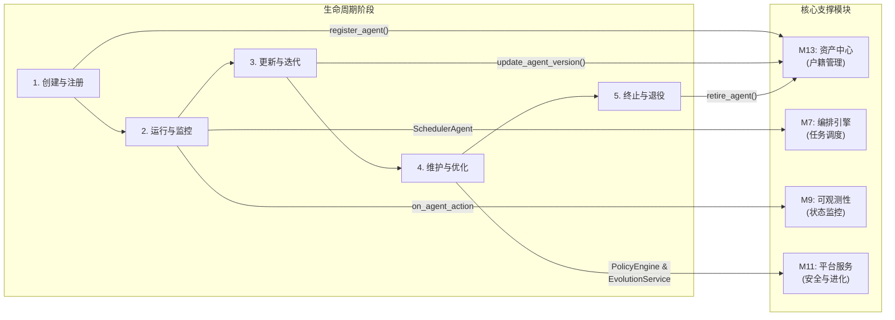

# AgenticX: 一个统一的多智能体框架

## 1. 愿景与目标 (Vision & Goals)

**愿景:** 打造一个统一、可扩展、生产就绪的多智能体应用开发框架，旨在赋予开发者构建从简单自动化助手到复杂协作式智能体系统的全部能力。

**核心目标:**
*   **统一的核心抽象 (Unified Core Abstractions):** 提供清晰、可复用的 `Agent`, `Task`, `Tool` 等核心构建块，作为所有应用的基础 (M1-M6)。
*   **灵活的编排引擎 (Flexible Orchestration Engine):** 内置强大的图式编排引擎，原生支持单智能体应用、顺序工作流、以及动态的多智能体协作，满足不同复杂度的需求 (M7)。
*   **企业级安全基座 (Enterprise-Ready Foundation):** 将多租户数据隔离、权限控制(RBAC)和安全护栏(Guardrails)作为框架的内置特性，确保开箱即用的安全合规 (M11)。
*   **可插拔的组件生态 (Pluggable Component Ecosystem):** 所有关键组件，包括 LLM、记忆系统、工具、甚至企业数据源（通过连接器），都可轻松替换和扩展，避免厂商锁定 (M2, M3, M4, M8, M12)。
*   **卓越的开发者体验 (Superior Developer Experience):** 提供一流的可观测性、简洁的 SDK/CLI，以及方便资产复用的中心库(Hub)，大幅提升开发和维护效率 (M9, M10, M13)。

## 2. 技术架构 (Technical Architecture)

```mermaid
graph TD
    subgraph "M10: 用户接口层 (User Interfaces)"
        SDK[Python SDK]
        CLI[CLI]
        UI[Web UI (未来)]
    end

    subgraph "核心框架层 (Core Framework)"
        subgraph "M7: 编排与路由引擎"
            Orchestrator["Orchestrator & Router"]
        end
        subgraph "M5, M6: 执行器"
            AgentExecutor["Agent Executor"]
            TaskExecutor["Task Executor"]
        end
        subgraph "M1-M4: 核心抽象与组件"
            direction LR
            Agent["Agent"]
            Task["Task"]
            Tool["Tool"]
            Memory["Memory"]
            LLM["LLM Provider"]
        end
    end

    subgraph "平台服务层 (Platform Services)"
        subgraph "M13: 资产中心"
            Hub["Agent/Workflow/Tool Hub"]
        end
        subgraph "M12: 知识层"
            Knowledge["Connectors &<br>Unified Search"]
        end
        subgraph "M11: 安全与租户"
            Security["RBAC & Guardrails"]
        end
        subgraph "M9: 可观测性"
            Callbacks["Callback Manager &<br>Monitoring System"]
        end
        subgraph "M8: 通信协议"
            Protocols["Protocol Handlers"]
        end
    end

    %% Connections
    SDK & CLI & UI -- "构建/运行" --> Orchestrator

    Orchestrator -- "调度" --> TaskExecutor
    TaskExecutor -- "调用" --> AgentExecutor
    AgentExecutor -- "使用" --> Agent & Task & Tool & Memory & LLM

    %% Core Framework Dependencies on Platform Services
    AgentExecutor -- "触发" --> Callbacks
    AgentExecutor -- "发送/接收" --> Protocols
    AgentExecutor -- "检查" --> Security
    Agent & Tool & Workflow -- "注册/发现" --> Hub
    Tool -- "访问" --> Knowledge
```

## 3. 功能模块拆解 (Functional Modules Breakdown)

基于该架构，我们可以定义以下功能模块:

*   **M1: 核心抽象层 (`agenticx.core`)**: 定义框架的基础数据结构。
*   **M2: LLM 服务提供层 (`agenticx.llms`)**: 对接不同的大语言模型。
*   **M3: 工具系统 (`agenticx.tools`)**: 定义和管理 Agent 可用的工具。
*   **M4: 记忆系统 (`agenticx.memory`)**: 为 Agent 提供短期和长期记忆。
*   **M5: 智能体核心 (`agenticx.agent`)**: 定义 Agent 的生命周期和执行逻辑。
*   **M6: 任务管理 (`agenticx.task`)**: 定义、分配和追踪任务。
*   **M7: 编排与路由引擎 (`agenticx.orchestrator`)**: 负责驱动整个协作流程。
*   **M8: 通信协议层 (`agenticx.protocols`)**: 负责 Agent 间和跨平台的通信。
*   **M9: 可观测性 (`agenticx.callbacks`)**: 日志、追踪和可视化。
*   **M10: 用户接口 (`agenticx.interfaces`)**: CLI、SDK 和未来的 Web UI。
*   **M11: 平台服务层 (`agenticx.platform`)**: 覆盖多租户、安全与治理。
*   **M12: 知识与数据层 (`agenticx.knowledge`)**: 统一的数据连接、处理和权限化访问。
*   **M13: 资产中心 (`agenticx.hub`)**: 管理和复用 Agents, Workflows, 和 Models。

## 4. 智能体全生命周期管理 (Agent Lifecycle Management)

AgenticX 框架的设计贯穿了对智能体（Agent）从诞生到消亡的全生命周期管理。这并非一个独立的模块，而是将管理理念融入到平台服务、可观测性和资产中心等多个模块中的一套组合能力，确保了 Agent 的可控性、可维护性和可持续进化。


- **1. 创建阶段 (Creation)**: 新的 Agent 定义被提交到 `M13: AgentHub` 进行注册，获得唯一的身份和版本号。平台在部署时可利用 `M11` 的安全服务进行代码扫描和依赖校验。
- **2. 运行阶段 (Running)**: `M7: SchedulerAgent` 基于 `M9` 提供的实时监控数据（负载、性能）和 `M13` 中的静态元数据（技能、成本）进行智能调度。所有行为都被 `M9` 的回调函数捕获，并可在 `M11` 提供的沙箱环境中安全执行。
- **3. 更新阶段 (Updating)**: 开发者向 `M13: AgentHub` 提交新版本的 Agent。`M11` 的 RBAC 服务确保只有授权用户可以执行更新。`M7` 的调度器会逐渐将流量切换到新版本。
- **4. 维护与优化阶段 (Maintenance & Optimization)**: `M11` 的 `PolicyEngine` 持续对 Agent 行为进行合规性检查。未来的 `EvolutionService` 将分析 `M9` 收集的历史数据，对 Agent 的 Prompt 或策略进行自动优化建议。
- **5. 终止阶段 (Termination & Destruction)**: 当一个 Agent 或其特定版本不再需要时，可以通过 `M13: AgentHub` 将其标记为“已退役”，系统将不再向其调度任务，并最终清理相关资源。

## 5. 开发路线图 (Development Roadmap / To-Do List)

**总体进度概览**:
- ✅ **M1: 核心抽象层** - 已完成
- ✅ **M2: LLM 服务提供层** - 已完成  
- ✅ **M3: 工具系统** - 已完成
- ✅ **M4: 记忆系统** - 已完成
- ✅ **M5: 智能体核心** - 已完成
- ✅ **M6: 任务契约与成果验证** - 已完成
- ✅ **M7: 编排与路由引擎** - 已完成
- ✅ **M8: 智能体通信协议** - 已完成
- ✅ **M9: 可观测性与分析** - 已完成
- ⏳ **M10: 开发者体验** - 规划中
- ⏳ **M11: 企业安全与治理** - 规划中
- ⏳ **M12: 智能体进化平台** - 长期愿景
- ⏳ **M13: 企业知识中台** - 规划中

**当前状态**: 框架核心功能及可观测性已完成 (M1-M9)，具备完整的多智能体应用开发和监控能力。后续模块 (M10-M13) 专注于企业级功能和开发者体验优化。

### M1: 核心抽象层 (`agenticx.core`) ✅
- [x] `Agent(BaseModel)`: 定义 Agent 的静态属性，如 `id`, `name`, `version`, `role`, `goal`, `backstory`, `llm_config_name` (指向M13), `memory_config`, `tool_names` (指向M13), `organization_id`。
- [x] `Task(BaseModel)`: 定义任务的静态属性，如 `id`, `description`, `agent_id`, `expected_output`, `context`, `dependencies` (依赖的其他 Task ID), `output_schema`。
- [x] `BaseTool(ABC)`: 工具的抽象基类，定义 `name`, `description`, `args_schema` (Pydantic Model), 以及 `execute(**kwargs)` 和 `aexecute(**kwargs)` 方法。
- [x] `Workflow(BaseModel)`: 定义工作流的静态结构，包含 `id`, `name`, `version`, `nodes`, `edges`, `organization_id`。
- [x] `Message(BaseModel)`: 定义 Agent 之间通信的消息格式，包含 `id`, `sender_id`, `recipient_id`, `content`, `metadata`。
- [x] `User(BaseModel)` & `Organization(BaseModel)`: 定义用户和租户的基本数据结构，用于平台服务层。

**实现状态**: ✅ **已完成** - 所有核心抽象类已完全实现，包含完整的字段定义、类型注解、多租户支持和版本管理。已通过全面测试验证。

### M2: LLM 服务提供层 (`agenticx.llms`) ✅
- [x] `BaseLLMProvider(ABC)`: 定义统一的 LLM Provider 接口，包含 `invoke(prompt)`, `ainvoke(prompt)`, `stream(prompt)` 等方法。
- [x] `LLMResponse(BaseModel)`: 定义标准的 LLM 返回对象，包含 `content`, `token_usage`, `cost`, `model_name`。
- [x] `OpenAIProvider(BaseLLMProvider)`: 实现 OpenAI 系列模型的服务对接。
- [x] `AnthropicProvider(BaseLLMProvider)`: 实现 Anthropic Claude 系列模型的服务对接。
- [x] `OllamaProvider(BaseLLMProvider)`: 实现对本地 Ollama 服务的对接。
- [x] `TokenUsageTracker`: 一个工具类或 Callback，用于聚合和计算整个工作流的 Token 使用量和成本。

**实现状态**: ✅ **已完成** - 已基于 `litellm` 库构建了统一的LLM服务层。通过 `LiteLLMProvider`，框架现在可以无缝支持 OpenAI, Anthropic, Ollama, Gemini 等上百种模型。提供了 `invoke`, `ainvoke`, `stream`, `astream` 等核心方法，并实现了标准化的 `LLMResponse` 对象，内置了 token 使用量和成本计算。通过便利类（如 `OpenAIProvider`, `AnthropicProvider`）简化了特定模型的调用。

### M3: 工具系统 (`agenticx.tools`) ✅
> 启发来源: 融合了 CAMEL `FunctionTool` 的易用性和 CrewAI `BaseTool` 的结构化设计。

- [x] `BaseTool(ABC)`: 所有工具的抽象基类，定义工具的核心契约。
    - `name: str`, `description: str`, `args_schema: Type[BaseModel]`: 核心元数据。
    - `run(**kwargs)` / `arun(**kwargs)`: 统一的同步/异步执行入口，内置超时、回调、错误处理逻辑。
    - `to_openai_schema() -> Dict`: 原生支持将工具转换为 OpenAI 函数调用格式。
    - `add_callback(callback)`: 支持强大的回调机制，用于与 M9 可观测性模块集成。
    - `ToolError`, `ToolTimeoutError`, `ToolValidationError`: 定义了精细的错误类型。

- [x] `FunctionTool(BaseTool)`: 将普通 Python 函数（同步/异步）包装成工具的具体实现。
    - `__init__(func: Callable)`: 构造函数，自动从函数签名和 docstring 推断 `name`, `description`, 和 `args_schema`。

- [x] `@tool` 装饰器: 一个便捷的工厂装饰器，用于将任何 Python 函数快速转换为 `FunctionTool` 实例。
    - `@tool\ndef my_func(...)`

- [x] `ToolExecutor`: 工具执行引擎。
    - `execute(tool, **kwargs) -> ExecutionResult`: 安全地调用工具，封装执行结果。
    - `SandboxEnvironment`: 为 `CodeInterpreterTool` 提供安全的沙箱环境。
    - 内置错误处理、重试 (`max_retries`) 和超时 (`retry_delay`) 逻辑。

- [x] `RemoteTool(BaseTool)`: 用于连接 MCP (Model Context Protocol) 服务的通用远程工具。
    - `__init__(server_config, tool_name, ...)`: 初始化一个远程工具客户端，支持完整的 MCP 协议握手。
    - `_run` 和 `_arun` 方法通过标准 MCP 协议（JSON-RPC 2.0）调用远程服务。
    - 支持自动参数验证、错误处理、超时控制和资源管理。

- [x] `MCPClient`: 通用 MCP 客户端，提供自动发现和工具创建能力。
    - `discover_tools() -> List[MCPToolInfo]`: 自动发现 MCP 服务器提供的所有工具及其 schema。
    - `create_tool(tool_name: str) -> RemoteTool`: 为指定工具创建 RemoteTool 实例，自动解析参数 schema。
    - `create_all_tools() -> List[RemoteTool]`: 批量创建服务器提供的所有工具实例。
    - 支持动态 Pydantic 模型生成，无需手动编写参数类。

- [x] `MCPServerConfig`: MCP 服务器配置模型，支持命令、参数、环境变量和超时设置。

- [x] `load_mcp_config(config_path)`: 从配置文件加载 MCP 服务器配置。

- [x] `create_mcp_client(server_name, config_path) -> MCPClient`: 便捷函数，从配置文件创建 MCP 客户端。

**设计优势:**
- **零适配代码**: 接入任何 MCP 服务器无需编写专门的适配代码。
- **自动发现**: 运行时自动发现服务器提供的工具和参数 schema。
- **动态类型**: 自动从 JSON Schema 生成 Pydantic 模型，提供完整的类型安全。
- **标准协议**: 完整实现 MCP 协议规范，兼容所有标准 MCP 服务器。
- **易于扩展**: 支持批量创建、多服务器集成和动态工具管理。

- [x] `CredentialStore`: 一个安全的凭据管理器 (与 M11 紧密集成)。
    - `get_credential(organization_id: str, tool_name: str) -> Dict`: 安全地获取凭据。
    - `set_credential(...)`: 使用 M11 的 `EncryptionService` 加密存储凭据。

- [x] `BuiltInTools`: 提供一组开箱即用的基础工具集。
    - `WebSearchTool`: 封装搜索引擎 API。
    - `FileTool`: 提供安全的本地文件读写能力。
    - `CodeInterpreterTool`: 在沙箱环境中执行 Python 代码。
    - `HttpRequestTool`: 提供发送 HTTP 请求的能力。
    - `JsonTool`: 提供对 JSON 数据的查询和操作能力。
- [x] `@human_in_the_loop` 装饰器: (规划中) 一个用于高风险工具的安全装饰器。在工具执行前，它会检查 `M11: PolicyEngine`，如果策略要求，它会暂停工作流并请求人工批准。

**实现状态**: ✅ **已完成** - 已完整实现 M3 工具系统。包含统一的 `BaseTool` 抽象基类，支持同步/异步执行、参数验证、错误处理和回调机制。`FunctionTool` 和 `@tool` 装饰器提供便捷的函数到工具转换，自动解析类型注解和文档字符串生成 Pydantic 模式。`ToolExecutor` 提供安全的执行环境，支持重试、超时和批量执行。`CredentialStore` 实现加密的多租户凭据管理。内置工具集包含文件操作、网络搜索、代码执行、HTTP 请求和 JSON 处理等常用功能。全面支持 OpenAI 函数调用格式。

### M4: 记忆系统 (`agenticx.memory`) ✅

`agenticx` 的记忆系统旨在提供一个强大、灵活、可插拔的长期记忆解决方案。其核心设计哲学是**深度集成与模块化**，通过将业界领先的记忆库 (`mem0`) 源码直接整合到框架中，实现了前所未有的定制能力，特别是允许用户无缝替换底层使用的大语言模型（LLM）。

- [x] `BaseMemory(ABC)`: 记忆接口，定义 `add`, `get`, `clear` 等核心方法，所有记忆组件都必须继承此接口。

- [x] `ShortTermMemory(BaseMemory)`: 实现基于会话的简单易失性记忆（如消息历史）。

- [x] **`Mem0(BaseMemory)` (核心实现)**:
    -   **定位**: 框架的默认高级长期记忆解决方案，基于 `mem0` 的源码进行深度集成。
    -   **实现**:
        1.  **源码集成**: `mem0` 的核心代码被完整地复制到 `agenticx/integrations/mem0/` 目录下，成为框架的一部分，而非外部依赖。
        2.  **LLM 适配器**: 创建了 `agenticx.integrations.mem0.llms.agenticx_llm.AgenticXLLM` 适配器，它继承自 `mem0` 的 `LLMBase` 接口。
        3.  **工厂注入**: 修改了 `mem0` 内部的 `LlmFactory`，使其能够识别并实例化 `AgenticXLLM` 适配器。
        4.  **无缝桥接**: `Mem0` 类在初始化时接收一个 `AgenticX` 的 `BaseLLM` 实例，并将其通过配置注入到 `mem0` 的核心 `Memory` 类中。
    -   **优势**:
        -   **完全的 LLM 控制**: 用户可以指定**任何** `AgenticX` 支持的 LLM（包括本地部署的模型、专有模型等）来驱动记忆的提取、更新和检索，解除了对特定 LLM（如 OpenAI）的依赖。
        -   **高性能**: 所有操作都在同一进程内完成，避免了网络调用的延迟。
        -   **深度可定制**: 未来可以进一步修改 `mem0` 的其他组件，如向量数据库、嵌入模型等。

- [ ] `MCPMemory(BaseMemory)`: (保留作为备选方案) 对接外部标准 `MCP` 记忆服务的客户端。当用户希望使用独立的、外部托管的记忆服务时，此方案依然有效。

**实现状态**: ✅ **已完成** - 已完整实现 M4 记忆系统的核心部分。`BaseMemory` 定义了标准接口。`Mem0` 类通过对 `mem0` 库的源码级集成和自定义 LLM 适配器，成功实现了将任意 `AgenticX` 的 LLM 实例注入 `mem0` 的能力，提供了完全的灵活性和控制力。

### M5: 智能体核心 (`agenticx.agent`) ✅
> 启发来源: 深度融合 `12-Factor Agents` 方法论，强调对控制流、上下文和错误的精细掌控。

- [x] `AgentExecutor`: Agent 的执行器，是 Agent 的"大脑中枢"。
    - **核心理念**: 实现 `12-Factor` 中的"自主控制流"原则。它不是一个黑箱，而是一个由开发者明确编写的、基于意图的 `think-act` 循环。
    - `run(task: Task)`: 接收任务，加载由 `PromptManager` 精心构建的上下文，然后进入主循环：
        1.  调用 LLM 获取下一步的意图（即结构化的 `ToolCall`）。
        2.  将意图记录到事件日志中。
        3.  根据意图 (`ToolCall.name`)，在 `switch` 或 `if/elif` 结构中调用对应的工具执行器。
        4.  将工具执行结果（或错误）记录到事件日志。
        5.  循环，直到 LLM 输出 `finish_task` 意图。
- [x] `PromptManager`: 上下文工程的核心组件。
    - **核心理念**: 实现 `12-Factor` 中的"掌控提示词"和"掌控上下文窗口"。
    - `build_context(event_log: List[Event]) -> str`: 不再是被动地堆砌聊天记录，而是根据业务逻辑，将结构化的事件日志（`event_log`）"渲染"成信息密度极高的、LLM友好的格式。开发者可以自定义渲染模板，使用XML标签等方式突出重点、隐藏噪音。
    - `get_prompt_template(agent_role: str)`: 提供基础的Prompt模板，但鼓励用户继承和修改。
- [x] `ErrorHandler`: 替代简单的 `AgentRetryHandler`。
    - **核心理念**: 实现 `12-Factor` 中的"精简错误信息"原则。
    - `handle(error: Exception) -> Event`: 捕获工具执行的异常，将其转换为简洁、清晰的自然语言错误信息，并作为一个`error`事件添加到日志中，让 Agent "看到"并有机会自我修复。
    - 内置"断路器"机制：当连续错误次数过多时，自动转为"求助人类"意图 (`request_human_help`)，而不是无限重试。
- [x] `CommunicationInterface`: 实现 Agent 的通信能力。
    - `send(message: Message)`: 调用 M8 的协议层发送消息。
    - `receive() -> Message`: 从 M8 的协议层接收消息。
- [x] `Event` 系统: 完整的事件驱动架构，包含 `TaskStartEvent`, `ToolCallEvent`, `ErrorEvent` 等12种事件类型。
- [x] `ToolRegistry`: 工具注册表，支持动态工具发现和调用。
- [x] `ActionParser`: 智能动作解析器，解析 LLM 输出的 JSON 格式动作指令。

**实现状态**: ✅ **已完成** - 已完整实现 M5 智能体核心模块的所有组件。`AgentExecutor` 实现了完整的 think-act 循环，支持工具调用、错误处理和事件记录。`PromptManager` 提供高密度上下文渲染，使用 XML 标签优化 LLM 理解。`ErrorHandler` 实现智能错误分类和断路器机制。`CommunicationInterface` 支持智能体间通信。事件系统提供完整的执行溯源能力。已通过 20 个测试用例验证，并有完整的演示应用。

### M6: 任务契约与成果验证 (Task Contract & Outcome Validation) ✅
> 启发来源: 主要来自 `metagpt.md` 的"标准化产出"和 `crewai.md` 的 `expected_output` 理念，强调对任务最终成果的严格把控。

- **核心职责**: 将"执行过程"与"成果验收"分离。M6 负责充当工作流中每个任务节点的"质量守-门员"，确保任务产出符合预定义的契约 (`task.output_schema`)。

- [x] `TaskOutputParser`: 任务输出解析器。
    - [x] `parse(agent_final_response: str, output_schema: Type[BaseModel]) -> BaseModel`: 负责从 Agent 的最终响应文本中，依据任务预定义的 Pydantic `output_schema`，解析并实例化出结构化的数据对象。
    - [x] 支持直接JSON解析、模糊解析、结构化文本解析
    - [x] 支持从Markdown代码块提取JSON
    - [x] 可配置的JSON提取模式

- [x] `TaskResultValidator`: 任务结果校验器。
    - [x] `validate(parsed_output: BaseModel)`: 对 `TaskOutputParser` 生成的结构化对象进行更深层次的业务规则校验（如数值范围、内容合规性等）。
    - [x] 内置验证器：范围、长度、模式、枚举、必填、类型
    - [x] 支持自定义验证器
    - [x] 区分错误和警告

- [x] `OutputRepairLoop`: 输出自愈循环。
    - **核心理念**: 当解析或校验失败时，不立即报错，而是启动一个自我修复循环。
    - **流程**:
        1. 捕获 `Parser` 或 `Validator` 的错误信息。
        2. 尝试简单修复（引号、括号、逗号、Markdown提取）。
        3. 支持LLM指导修复（框架预留，可扩展）。
        4. 限制重试次数，避免无限循环。
    - [x] 多种修复策略：NONE, SIMPLE, LLM_GUIDED, INTERACTIVE

**实现状态**: ✅ **已完成** - 已完整实现 M6 任务契约验证模块。`TaskOutputParser` 支持多种解析策略和模糊匹配，能够从各种格式的响应中提取结构化数据。`TaskResultValidator` 提供丰富的验证规则和自定义验证器支持。`OutputRepairLoop` 实现智能修复机制，显著提升任务输出的成功率。已通过30+测试用例验证，包含完整的集成测试。

### M7: 编排与路由引擎 (Orchestration & Routing Engine) ✅
> 启发来源: 融合 `MAS智能调度思考` 的管理哲学与 `AgenticSupernet` 的动态架构思想。

- [x] `TriggerService`: 事件触发器服务。
    - [x] `ScheduledTrigger`: 定时触发器，支持多种调度表达式（every_5s, daily, hourly等）
    - [x] `EventDrivenTrigger`: 事件驱动触发器，监听特定主题的事件

- [x] `WorkflowEngine`: 编排引擎主入口。
    - **核心理念**: 基于 `12-Factor Agents` 的事件溯源思想，实现健壮、可恢复的工作流执行。
    - **状态管理**: 工作流的**唯一状态源**是其**事件日志 (Event Log)**，整个执行过程是一个 `reduce` 函数：`new_state = f(current_state, event)`。
    - **核心优势**: **暂停与恢复** - 实现长时间运行、异步等待（如等待人工审批）和定时任务变得极其简单。只需持久化事件日志，在需要时加载并从最后一步继续即可。
    - [x] `run(workflow: Workflow, initial_event: Event)`: 执行一个工作流
    - [x] 支持暂停、恢复、取消执行
    - [x] 并发节点执行控制
    - [x] 变量解析和上下文管理

- [x] `WorkflowGraph`: 工作流的静态或动态定义。
    - [x] `add_node(name: str, component: Union[AgentExecutor, BaseTool, Callable])`: 添加执行节点
    - [x] `add_node(name: str, type: 'human_approval', config: dict)`: (新增) 添加一个人工审批节点。当工作流执行到此节点时，会触发 `HumanRequestEvent` 并暂停，直到收到外部恢复信号。
    - [x] `add_edge(start_node: str, end_node: str, condition: Callable = None)`: 添加条件路由边
    - [x] 支持条件路由和并行执行
    - [x] 工作流图验证和环路检测
    - [x] 支持Agent、Tool、Function多种组件类型

- [x] **智能调度能力**:
    - [x] 条件路由：基于执行结果的动态路径选择
    - [x] 并行执行：支持多节点并发处理
    - [x] 错误处理：优雅的错误恢复和状态管理
    - [x] 资源管理：可配置的并发限制和超时控制

**实现状态**: ✅ **已完成** - 已完整实现 M7 编排与路由引擎的核心功能。`WorkflowEngine` 基于事件溯源实现可恢复的工作流执行。`WorkflowGraph` 支持复杂的图结构定义和条件路由。`TriggerService` 提供定时和事件驱动的触发机制。支持Agent、Tool、自定义函数等多种组件类型。已通过25+测试用例验证，包含完整的并发执行和错误处理测试。

#### 扩展功能（规划中）
- [ ] **`SchedulerAgent` (原 `MasterRouterAgent`)**: 系统的"AI CEO"，负责任务的智能分派与调度。
    - **核心理念**: 基于 `MAS智能调度思考`，将调度从简单的技能匹配升级为综合的管理决策。
    - **决策依据**:
        - **技能匹配**: 从 `AgentHub` (M13) 检索候选 Agent。
        - **实时负载**: 从 `PlatformService` (M11) 获取候选 Agent 的实时状态（任务队列、资源占用）。
        - **历史表现**: 参考 Agent 的历史成功率、成本、响应时间等指标。
    - **决策逻辑 (通过 Prompt 实现)**:
        - **负载均衡**: 避免"明星Agent"过载，严禁将单个Agent推向性能极限。
        - **成长机会**: 将探索性或非核心任务分配给新Agent或低负载Agent，促进系统整体能力的进化。
        - **成本控制**: 在满足任务要求的前提下，优先选择成本更低的Agent（如使用更小的模型）。
    - **输出**: 决策结果，包括选定的 `agent_id` 和调度的理由。

- [ ] **长期愿景: `Agentic Supernet`**
    - **概念**: 受 `MaAS` 项目启发，从"选择"一个 Agent 演进为"生成"一个最优的 `WorkflowGraph`。
    - **实现**: 训练一个 `Controller` 模型，该模型接收任务描述，然后从一个包含所有可用 Agent 和 Tool 的"超网"中，动态采样或生成一个为该任务定制的、最高效的子图（即一个临时工作流）。
    - **价值**: 实现真正的任务自适应架构，将系统性能和资源效率提升到新的高度。这是 M7 模块的终极演进方向。

- **实施策略与挑战分析**:
    - **`SchedulerAgent` (工程难题)**:
        - **定位**: 这是一个**工程挑战**，核心在于构建强大的**数据基础设施** (`M11: PlatformService`) 和设计精密的**决策 Prompt**。虽然挑战巨大，但路径清晰，可以分阶段实现。
        - **实现路径 (分阶段)**:
            1.  **V1 (基础调度)**: 实现基于 `M13: AgentHub` 的技能匹配调度。
            2.  **V2 (资源感知调度)**: 集成 `M11: PlatformService` 的实时监控数据，引入负载均衡和成本控制逻辑。
            3.  **V3 (综合决策调度)**: 引入历史表现、成功率等更复杂的决策因子，实现真正的智能管理。
    - **`Agentic Supernet` (科研难题)**:
        - **定位**: 这是一个**科研挑战**，代表了框架的终极演进方向。它不是简单的"选择"一个 Agent，而是动态"生成"一个最优的临时工作流，是真正意义上的“软件2.0”在 Agent 领域的体现。
        - **核心挑战**:
            - **模型能力**: 需要训练或微调一个能理解任务并输出复杂图结构（`WorkflowGraph`）的 `Controller` 模型，这超出了传统 Prompt 工程的范畴。
            - **数据瓶颈**: 最大的障碍是缺乏大规模的 `(任务描述, 最优工作流图)` 标注数据，这可能需要引入强化学习等前沿方法进行探索，是业界共同面临的难题。

### M8: 智能体通信协议 (`agenticx.protocols`) ✅
> 启发来源: 深度融合 Google A2A 协议的任务协作模式与 MCP 协议的微服务思想，并遵循【原则三：类级粒度】进行详细设计。

- **战略定位**:
    - **智能体-资源 (A-R) 通信**: 采用 **MCP (Model Context Protocol)** 作为标准。此部分已在 **M3: 工具系统** 中通过 `RemoteTool` 和 `MCPClient` 深度集成。M8 不再重复定义，仅确认此战略。
    - **智能体-智能体 (A-A) 通信**: 借鉴 **Google A2A 协议** 的核心理念，构建一个面向任务的、结构化的协作框架。

#### 1. 核心接口与抽象 (Interfaces & Abstractions)
- [x] `BaseTaskStore(ABC)`: 定义A2A协作任务持久化的标准接口，确保任务在分布式系统中的可靠追踪。
    - [x] `get_task(task_id: UUID) -> CollaborationTask`: 根据ID获取任务详情。
    - [x] `create_task(task: CollaborationTask) -> None`: 创建一个新任务。
    - [x] `update_task(task: CollaborationTask) -> None`: 更新任务的状态或其他属性。
    - [x] `list_tasks(filters: Dict[str, Any] = None) -> List[CollaborationTask]`: 列出任务，支持过滤。
    - [x] `delete_task(task_id: UUID) -> None`: 删除任务。
- [x] `TaskError`, `TaskNotFoundError`, `TaskAlreadyExistsError`: 完整的异常类型系统。

#### 2. 核心数据模型 (Data Models)
- [x] `AgentCard(BaseModel)`: Agent的"数字名片"，通过 `/.well-known/agent.json` 端点发布。
    - `agent_id: str`, `name: str`, `description: str`, `endpoint: HttpUrl`, `skills: List[Skill]`, `version: str`
- [x] `Skill(BaseModel)`: Agent可执行能力的标准化描述。
    - `name: str`, `description: str`, `parameters_schema: Dict[str, Any]`
- [x] `CollaborationTask(BaseModel)`: 智能体间协作的基本单元，取代 M1 中过于通用的 `Message`。
    - `task_id: UUID`, `issuer_agent_id: str`, `target_agent_id: str`, `skill_name: str`, `parameters: Dict[str, Any]`, `status: Literal['pending', 'in_progress', 'completed', 'failed']`, `result: Optional[Any]`, `error: Optional[str]`, `created_at: datetime`, `updated_at: datetime`
- [x] `TaskCreationRequest(BaseModel)`: 任务创建请求模型。
- [x] `TaskStatusResponse(BaseModel)`: 任务状态响应模型。

#### 3. 服务端实现 (Server Implementation)
- [x] `A2AWebServiceWrapper`: 将一个 `agenticx.agent.AgentExecutor` 包装成符合A2A协议的、可独立部署的FastAPI应用。
    - [x] `__init__(self, agent_executor: AgentExecutor, task_store: BaseTaskStore, agent_id: str, agent_name: str, agent_description: str, base_url: str)`: 构造函数，注入执行器和任务存储。
    - [x] `@app.get("/.well-known/agent.json") async def get_agent_card(self) -> AgentCard`: 发布AgentCard，实现服务发现。
    - [x] `@app.post("/tasks", status_code=202) async def create_task(self, task_request: TaskCreationRequest) -> TaskStatusResponse`: 接收任务创建请求，存入`task_store`并异步触发执行。
    - [x] `@app.get("/tasks/{task_id}") async def get_task_status(self, task_id: UUID) -> TaskStatusResponse`: 查询任务状态和结果。
    - [x] `@app.get("/health") async def health_check(self) -> Dict[str, str]`: 健康检查端点。
    - [x] `async def start_server(self, host: str = "0.0.0.0", port: int = 8000)`: 启动服务器。
- [x] `InMemoryTaskStore(BaseTaskStore)`: 任务存储的默认内存实现，支持完整的CRUD操作和异步锁。

#### 4. 客户端实现与集成 (Client Implementation & Integration)
- [x] `A2AClient`: 与远程 `A2AWebServiceWrapper` 交互的底层客户端。
    - [x] `__init__(self, target_agent_card: AgentCard, timeout: float = 30.0, max_retries: int = 3, retry_delay: float = 1.0)`: 使用目标Agent的AgentCard进行初始化。
    - [x] `@classmethod async def from_endpoint(cls, endpoint: str) -> 'A2AClient'`: 从端点自动发现并创建客户端。
    - [x] `async def create_task(self, issuer_agent_id: str, skill_name: str, parameters: Dict[str, Any]) -> CollaborationTask`: 发起远程任务。
    - [x] `async def get_task(self, task_id: UUID) -> CollaborationTask`: 查询远程任务状态。
    - [x] `async def wait_for_completion(self, task_id: UUID, polling_interval: float = 1.0, max_wait_time: float = 300.0) -> CollaborationTask`: 等待任务完成。
    - [x] `async def health_check(self) -> Dict[str, Any]`: 健康检查。
    - [x] 内置重试机制和指数退避策略。
- [x] **`A2ASkillTool(BaseTool)`**: (关键集成点) 将远程Agent的Skill无缝包装为本地可调用的工具。
    - **`name`**: (动态生成) 格式为 `"{agent_name}/{skill_name}"`，例如 `"Calculator Agent/calculate_add"`。
    - **`description`**: (动态获取) 直接来自 `Skill.description`。
    - **`args_schema`**: (动态创建) 从 `Skill.parameters_schema` 自动生成 Pydantic 模型。
    - [x] `__init__(self, client: A2AClient, skill: Skill, issuer_agent_id: str)`: 构造函数，注入客户端和要包装的技能。
    - [x] `async def _arun(self, **kwargs) -> str`: 核心执行逻辑。内部调用 `self.client.create_task()`，然后进入轮询循环，通过 `self.client.get_task()` 检查任务状态，直到任务完成或失败。
    - [x] `def _run(self, **kwargs) -> str`: 同步执行入口。
- [x] `A2ASkillToolFactory`: 工厂类，提供便捷的工具创建方法。
    - [x] `@staticmethod async def create_tools_from_agent(agent_endpoint: str, issuer_agent_id: str) -> Dict[str, A2ASkillTool]`: 从Agent端点自动创建所有技能工具。
    - [x] `@staticmethod def create_tool_from_skill(client: A2AClient, skill: Skill, issuer_agent_id: str) -> A2ASkillTool`: 从技能创建单个工具。

**实现状态**: ✅ **已完成** - 已完整实现 M8 智能体通信协议模块的核心功能。实现了完整的 A2A 协议，包括服务发现、任务创建、状态查询和结果获取。`A2AWebServiceWrapper` 提供标准的 FastAPI 服务端，`A2AClient` 提供健壮的客户端，`A2ASkillTool` 实现了"A2A Skill as a Tool"设计模式。支持异步操作、重试机制、错误处理和完整的测试覆盖。已通过端到端演示验证，可支持分布式多代理系统中的代理间协作。MCP 协议集成已在 M3 工具系统中实现。

### M9: 可观测性与分析 (`agenticx.observability`) ✅
> 启发来源: 融合 `AgentScope` 的透明化设计、`Magentic UI` 的评估框架、以及 `traeagent` 的轨迹分析理念。

**战略定位**: M9 不仅是日志记录，更是智能体系统的"神经中枢"，负责捕获、分析和可视化所有执行轨迹，为系统优化和决策提供数据支撑。

#### 1. 核心回调系统 (Core Callback System) ✅
- [x] `BaseCallbackHandler(ABC)`: 定义 Callback 系统的接口，包含完整的生命周期和执行事件钩子。
    - **执行事件**: `on_workflow_start`, `on_workflow_end`, `on_agent_action`, `on_tool_start`, `on_tool_end`, `on_llm_response`
    - **生命周期事件**: `on_task_start`, `on_task_end`, `on_error`, `on_human_request`, `on_human_response`
- [x] `CallbackManager`: 管理所有注册的回调处理器，支持异步事件分发和过滤。
- [x] `LoggingCallbackHandler(BaseCallbackHandler)`: 结构化日志输出，支持多种格式（JSON、XML、Plain Text）。
- [x] `CallbackRegistry`: 回调注册表，管理处理器的注册、注销和查找。

#### 2. 实时监控与可视化 (Real-time Monitoring & Visualization) ✅
- [x] `WebSocketCallbackHandler(BaseCallbackHandler)`: 实时事件流推送，支持前端可视化监控。
- [x] `MonitoringCallbackHandler(BaseCallbackHandler)`: 系统指标收集器。
    - [x] `collect_metrics(event: Event) -> Dict[str, float]`: 提取性能指标（响应时间、Token消耗、成本等）。
    - [x] `get_prometheus_metrics() -> str`: 导出 Prometheus 格式指标。
- [x] `MetricsCollector`: 指标收集器，支持计数器、仪表盘、系统指标收集。
    - [x] `collect_system_metrics() -> SystemMetrics`: 收集CPU、内存、磁盘等系统指标。
    - [x] `increment_counter()`, `set_gauge()`, `add_metric()`: 多种指标收集方法。
- [x] `PrometheusExporter`: Prometheus 指标导出器。

#### 3. 轨迹分析与优化 (Trajectory Analysis & Optimization) ✅
- [x] `TrajectoryCollector(BaseCallbackHandler)`: 执行轨迹收集器。
    - [x] `collect_trajectory(workflow_id: str) -> ExecutionTrajectory`: 收集完整的执行轨迹。
    - [x] `store_trajectory(trajectory: ExecutionTrajectory)`: 持久化轨迹数据。
- [x] `ExecutionTrajectory`: 完整的轨迹数据结构，包含步骤、元数据和资源使用。
- [x] `TrajectorySummarizer`: 智能轨迹摘要生成器。
    - [x] `summarize(trajectory: ExecutionTrajectory) -> TrajectorySummary`: 生成人类可读的执行摘要。
    - [x] `identify_bottlenecks(trajectory: ExecutionTrajectory) -> List[Bottleneck]`: 识别性能瓶颈。
- [x] `FailureAnalyzer`: 失败案例分析器。
    - [x] `analyze_failure(failed_trajectory: ExecutionTrajectory) -> FailureReport`: 分析失败原因。
    - [x] `suggest_improvements(failure_report: FailureReport) -> List[Improvement]`: 提出改进建议。

#### 4. 数据分析与导出 (Data Analysis & Export) ✅
- [x] `MetricsCalculator`: 指标计算器。
    - [x] `calculate_success_rate(results: List[TaskResult]) -> float`: 计算成功率。
    - [x] `calculate_efficiency(trajectory: ExecutionTrajectory) -> EfficiencyMetrics`: 计算效率指标。
    - [x] `calculate_all_metrics(trajectories: List[ExecutionTrajectory]) -> MetricsResult`: 计算所有指标。
- [x] `TimeSeriesData`: 时间序列数据管理器。
    - [x] `add_metric_point()`, `calculate_metric_statistics()`, `resample()`: 时间序列分析功能。
- [x] `StatisticsCalculator`: 统计分析器。
    - [x] `calculate_descriptive_stats()`, `calculate_percentiles()`, `detect_outliers()`: 统计分析功能。
- [x] `DataExporter`: 数据导出器，支持多种格式（JSON、CSV、Prometheus）。
    - [x] `export_trajectory_to_json()`, `export_trajectories_to_csv()`, `export_time_series_to_csv()`: 多种导出方法。

**实现状态**: ✅ **已完成** - 已完整实现 M9 可观测性与分析模块的所有核心功能。包含完整的回调系统、实时监控、轨迹收集分析、失败分析、性能指标计算、时间序列分析、统计分析和数据导出功能。提供了完整的演示应用（`m9_observability_demo.py`）展示所有功能。支持 Prometheus 集成、WebSocket 实时推送、多种数据格式导出。已通过全面测试验证，具备企业级监控能力。

### M10: 开发者体验 (`agenticx.devex`)
> 启发来源: `smolagents` 的 Hub 集成、`AgentScope` 的透明化设计、以及 `Magentic UI` 的全栈开发体验。

**战略定位**: 将 AgenticX 从代码库提升为开发平台，提供从本地开发到生产部署的完整工具链。

#### 1. 统一 SDK 与客户端 (Unified SDK & Client) **[必要功能]**
- [ ] `AgenticXClient`: 高级 Python SDK，封装所有核心功能。
    - [ ] `create_agent(definition: AgentDefinition) -> Agent`: 创建 Agent 实例。
    - [ ] `run_workflow(workflow: Workflow, inputs: Dict) -> WorkflowResult`: 执行工作流。
    - [ ] `monitor_execution(execution_id: str) -> ExecutionStatus`: 监控执行状态。
- [ ] `AsyncAgenticXClient`: 异步版本的 SDK，支持并发操作。
- [ ] `AgenticXJS`: JavaScript/TypeScript SDK，支持前端集成。

#### 2. 命令行工具 (CLI Tools) **[必要功能]**
- [ ] `agenticx.cli`: 基于 `Typer` 的命令行工具套件。
    - [ ] `agx run <workflow_file.py>`: 执行工作流文件。
    - [ ] `agx validate <config.yaml>`: 验证配置文件。
    - [ ] `agx deploy <agent_dir>`: 部署 Agent 到生产环境。
    - [ ] `agx monitor`: 启动监控面板。
    - [ ] `agx test <test_suite>`: 运行测试套件。
- [ ] `ProjectScaffolder`: 项目脚手架生成器。
    - [ ] `create_project(template: str, name: str)`: 创建项目模板。
    - [ ] `add_agent(agent_type: str)`: 添加 Agent 模板。

#### 3. 开发工具与集成 (Development Tools & Integrations) **[加分功能]**
- [ ] `DebugServer`: 调试服务器。
    - [ ] `start_debug_session(agent: Agent) -> DebugSession`: 启动调试会话。
    - [ ] `set_breakpoint(location: str)`: 设置断点。
    - [ ] `step_execution()`: 单步执行。
- [ ] `VSCodeExtension`: VS Code 扩展支持。
- [ ] `JupyterKernel`: Jupyter Notebook 内核，支持交互式开发。
- [ ] `DocGenerator`: 自动文档生成器。
    - [ ] `generate_agent_docs(agent: Agent) -> Documentation`: 生成 Agent 文档。
    - [ ] `generate_api_docs(module: Module) -> APIDocumentation`: 生成 API 文档。

#### 4. 云原生部署 (Cloud-Native Deployment) **[加分功能]**
- [ ] `KubernetesOperator`: Kubernetes 操作器，支持声明式部署。
- [ ] `DockerComposer`: Docker Compose 配置生成器。
- [ ] `CloudFormationTemplate`: AWS CloudFormation 模板生成器。
- [ ] `HelmChartGenerator`: Helm Chart 生成器。

### M11: 企业安全与治理 (`agenticx.governance`) 
> 启发来源: `Glean` 的安全架构、`humanintheloop` 的审批机制、以及企业级 AI 的合规需求。

**战略定位**: 将安全、合规和治理作为框架的核心能力，而非后加的补丁，确保企业级应用的安全可控。

#### 1. 身份认证与访问控制 (Authentication & Access Control) **[必要功能]**
- [ ] `AuthenticationService`: 统一身份认证服务。
    - [ ] `authenticate(credentials: Credentials) -> AuthResult`: 用户认证。
    - [ ] `refresh_token(refresh_token: str) -> TokenPair`: 刷新访问令牌。
- [ ] `AuthorizationService`: 授权服务。
    - [ ] `check_permission(user: User, resource: Resource, action: str) -> bool`: 权限检查。
    - [ ] `get_user_permissions(user: User) -> List[Permission]`: 获取用户权限列表。
- [ ] `RBACManager`: 基于角色的访问控制管理器。
    - [ ] `assign_role(user: User, role: Role)`: 分配角色。
    - [ ] `@require_role(role: str)`: 角色检查装饰器。
- [ ] `MultiTenantContext`: 多租户上下文管理器。
    - [ ] `get_current_organization() -> Organization`: 获取当前组织。
    - [ ] `isolate_data(organization_id: str)`: 数据隔离。

#### 2. 安全沙箱与隔离 (Security Sandbox & Isolation) **[必要功能]**
- [ ] `SandboxService`: 安全沙箱服务。
    - [ ] `create_sandbox(config: SandboxConfig) -> Sandbox`: 创建沙箱环境。
    - [ ] `execute_in_sandbox(sandbox: Sandbox, code: str) -> ExecutionResult`: 在沙箱中执行代码。
    - [ ] `destroy_sandbox(sandbox: Sandbox)`: 销毁沙箱。
- [ ] `NetworkIsolationService`: 网络隔离服务。
    - [ ] `create_network_policy(rules: List[NetworkRule]) -> NetworkPolicy`: 创建网络策略。
    - [ ] `apply_policy(policy: NetworkPolicy, target: str)`: 应用网络策略。
- [ ] `ResourceLimitService`: 资源限制服务。
    - [ ] `set_limits(resource_type: str, limits: ResourceLimits)`: 设置资源限制。
    - [ ] `monitor_usage(resource_type: str) -> ResourceUsage`: 监控资源使用。

#### 3. 内容安全与合规 (Content Security & Compliance) **[必要功能]**
- [ ] `ContentScanner`: 内容安全扫描器。
    - [ ] `scan_text(text: str) -> ScanResult`: 扫描文本内容。
    - [ ] `scan_file(file_path: str) -> ScanResult`: 扫描文件内容。
    - [ ] `detect_pii(content: str) -> PIIDetectionResult`: 检测个人信息。
- [ ] `PolicyEngine`: 策略引擎。
    - [ ] `load_policies(organization_id: str) -> List[Policy]`: 加载策略规则。
    - [ ] `evaluate_policy(action: Action, context: Context) -> PolicyResult`: 评估策略。
- [ ] `ComplianceManager`: 合规管理器。
    - [ ] `check_compliance(action: Action) -> ComplianceResult`: 合规检查。
    - [ ] `generate_compliance_report(period: TimePeriod) -> ComplianceReport`: 生成合规报告。

#### 4. 人工审批与干预 (Human Approval & Intervention) **[加分功能]**
- [ ] `ApprovalWorkflow`: 审批工作流。
    - [ ] `create_approval_request(request: ApprovalRequest) -> str`: 创建审批请求。
    - [ ] `process_approval(request_id: str, decision: ApprovalDecision)`: 处理审批决策。
- [ ] `HumanInTheLoopService`: 人机协作服务。
    - [ ] `request_human_intervention(context: InterventionContext) -> InterventionResult`: 请求人工干预。
    - [ ] `escalate_to_human(escalation: Escalation)`: 升级到人工处理。
- [ ] `AuditLogger`: 审计日志记录器。
    - [ ] `log_action(action: Action, user: User, result: ActionResult)`: 记录操作日志。
    - [ ] `generate_audit_trail(entity: str, period: TimePeriod) -> AuditTrail`: 生成审计轨迹。

### M12: 智能体进化平台 (`agenticx.evolution`) **[加分功能 - 长期愿景]**
> 启发来源: `agenticsupernet` 的架构搜索、`camelai` 的经验池、以及 `AutoAgent` 的自适应能力。

**战略定位**: 这是 AgenticX 的"大脑升级"模块，通过机器学习和强化学习技术，实现智能体的自我进化和系统级优化。

#### 1. 智能体架构搜索 (Agent Architecture Search)
- [ ] `AgenticSupernet`: 智能体超网络。
    - [ ] `sample_architecture(task_context: TaskContext) -> AgentArchitecture`: 根据任务采样最优架构。
    - [ ] `update_distribution(performance_feedback: PerformanceFeedback)`: 基于反馈更新架构分布。
- [ ] `ArchitectureOptimizer`: 架构优化器。
    - [ ] `search_optimal_architecture(task_suite: TaskSuite) -> AgentArchitecture`: 搜索最优架构。
    - [ ] `evaluate_architecture(architecture: AgentArchitecture, benchmark: Benchmark) -> ArchitectureScore`: 评估架构性能。

#### 2. 经验学习与知识蒸馏 (Experience Learning & Knowledge Distillation)
- [ ] `ExperiencePool`: 经验池。
    - [ ] `store_experience(experience: Experience)`: 存储执行经验。
    - [ ] `retrieve_similar_experiences(context: TaskContext) -> List[Experience]`: 检索相似经验。
- [ ] `KnowledgeDistiller`: 知识蒸馏器。
    - [ ] `distill_from_expert(expert_agent: Agent, student_agent: Agent) -> DistillationResult`: 从专家智能体蒸馏知识。
    - [ ] `compress_model(model: Model, compression_ratio: float) -> CompressedModel`: 模型压缩。

#### 3. 自适应优化 (Adaptive Optimization)
- [ ] `ReinforcementLearner`: 强化学习器。
    - [ ] `train_policy(environment: Environment, reward_function: RewardFunction) -> Policy`: 训练策略。
    - [ ] `update_policy(policy: Policy, feedback: Feedback) -> Policy`: 更新策略。
- [ ] `MetaLearner`: 元学习器。
    - [ ] `learn_to_learn(task_distribution: TaskDistribution) -> MetaPolicy`: 学习如何学习。
    - [ ] `adapt_to_new_task(meta_policy: MetaPolicy, new_task: Task) -> AdaptedAgent`: 快速适应新任务。

### M13: 企业知识中台 (`agenticx.knowledge`) 
> 启发来源: `Glean` 的统一搜索架构、企业级 RAG 需求、以及多模态知识管理。

**战略定位**: 构建企业级的统一知识访问层，让智能体能够安全、高效地访问企业的全域知识。

#### 1. 统一数据连接 (Unified Data Connection) **[必要功能]**
- [ ] `ConnectorFramework`: 连接器框架。
    - [ ] `BaseConnector(ABC)`: 连接器抽象基类，定义标准接口。
    - [ ] `register_connector(connector_type: str, connector_class: Type[BaseConnector])`: 注册连接器。
- [ ] `EnterpriseConnectors`: 企业级连接器集合。
    - [ ] `JiraConnector(BaseConnector)`: Jira 项目管理系统连接器。
    - [ ] `SlackConnector(BaseConnector)`: Slack 通信平台连接器。
    - [ ] `SharePointConnector(BaseConnector)`: SharePoint 文档系统连接器。
    - [ ] `SalesforceConnector(BaseConnector)`: Salesforce CRM 系统连接器。
- [ ] `DataSyncService`: 数据同步服务。
    - [ ] `sync_data_source(connector: BaseConnector) -> SyncResult`: 同步数据源。
    - [ ] `schedule_sync(connector: BaseConnector, schedule: Schedule)`: 调度同步任务。

#### 2. 智能搜索引擎 (Intelligent Search Engine) **[必要功能]**
- [ ] `HybridSearchEngine`: 混合搜索引擎。
    - [ ] `search(query: str, context: SearchContext) -> SearchResults`: 统一搜索接口。
    - [ ] `vector_search(embedding: Embedding, filters: Dict) -> VectorResults`: 向量搜索。
    - [ ] `keyword_search(keywords: List[str], filters: Dict) -> KeywordResults`: 关键词搜索。
- [ ] `SemanticIndexer`: 语义索引器。
    - [ ] `index_document(document: Document) -> IndexResult`: 索引文档。
    - [ ] `update_embeddings(documents: List[Document])`: 更新嵌入向量。
- [ ] `QueryUnderstanding`: 查询理解器。
    - [ ] `parse_query(query: str) -> ParsedQuery`: 解析查询意图。
    - [ ] `expand_query(query: str) -> ExpandedQuery`: 查询扩展。

#### 3. 权限与安全 (Permissions & Security) **[必要功能]**
- [ ] `PermissionManager`: 权限管理器。
    - [ ] `sync_permissions(data_source: str) -> PermissionSyncResult`: 同步权限信息。
    - [ ] `check_access(user: User, resource: Resource) -> AccessResult`: 检查访问权限。
- [ ] `DataGovernanceService`: 数据治理服务。
    - [ ] `classify_data(data: Data) -> DataClassification`: 数据分类。
    - [ ] `apply_retention_policy(data: Data, policy: RetentionPolicy)`: 应用保留策略。

#### 4. 知识图谱 (Knowledge Graph) **[加分功能]**
- [ ] `KnowledgeGraphBuilder`: 知识图谱构建器。
    - [ ] `extract_entities(text: str) -> List[Entity]`: 实体抽取。
    - [ ] `extract_relations(text: str, entities: List[Entity]) -> List[Relation]`: 关系抽取。
    - [ ] `build_graph(documents: List[Document]) -> KnowledgeGraph`: 构建知识图谱。
- [ ] `GraphQueryEngine`: 图查询引擎。
    - [ ] `query_graph(cypher_query: str) -> GraphResult`: 图查询。
    - [ ] `find_path(start_entity: Entity, end_entity: Entity) -> Path`: 路径查找。
