# AgenticX Retrieval System: 统一智能检索框架

## 1. 愿景与目标 (Vision & Goals)

**愿景:** 构建一个统一、智能、可扩展的检索系统，为AgenticX框架提供从基础检索能力到完全Agentic化RAG流程的全栈解决方案，实现检索的智能化、模块化和工具化。

**核心目标:**
*   **统一检索抽象 (Unified Retrieval Abstractions):** 提供清晰、可复用的 `BaseRetriever`, `RetrievalQuery`, `RetrievalResult` 等核心构建块，作为所有检索应用的基础 (M1)。
*   **多策略检索引擎 (Multi-Strategy Retrieval Engine):** 内置向量检索、BM25检索、图检索、混合检索等多种策略，支持自动策略选择和优化 (M2)。
*   **智能检索Agent (Intelligent Retrieval Agents):** 将检索能力Agentic化，支持查询分析、策略选择、结果重排等智能决策 (M3)。
*   **RAG流程工具化 (RAG Workflow Tools):** 将RAG的每个环节都工具化，支持文档入库、检索查询、结果重排、答案生成等完整流程 (M4)。
*   **企业级检索平台 (Enterprise Retrieval Platform):** 将多租户数据隔离、权限控制、性能监控作为框架的内置特性，确保开箱即用的生产就绪能力 (M5)。

## 2. 技术架构 (Technical Architecture)

```mermaid
graph TD
    subgraph "M4: RAG Workflow Tools"
        DocumentIndexingTool["DocumentIndexingTool"]
        RetrievalTool["RetrievalTool"]
        RerankingTool["RerankingTool"]
        QueryModificationTool["QueryModificationTool"]
        AnswerGenerationTool["AnswerGenerationTool"]
        CanAnswerTool["CanAnswerTool"]
    end

    subgraph "M3: Intelligent Retrieval Agents"
        QueryAnalysisAgent["QueryAnalysisAgent"]
        RetrievalAgent["RetrievalAgent"]
        RerankingAgent["RerankingAgent"]
        IndexingAgent["IndexingAgent"]
    end

    subgraph "M2: Multi-Strategy Retrieval Engine"
        VectorRetriever["VectorRetriever"]
        BM25Retriever["BM25Retriever"]
        HybridRetriever["HybridRetriever"]
        GraphRetriever["GraphRetriever"]
        AutoRetriever["AutoRetriever"]
        Reranker["Reranker"]
    end

    subgraph "M1: Unified Retrieval Abstractions"
        BaseRetriever["BaseRetriever"]
        RetrievalQuery["RetrievalQuery"]
        RetrievalResult["RetrievalResult"]
        RetrievalType["RetrievalType"]
    end

    subgraph "M5: Enterprise Platform Services"
        TenantIsolation["Tenant Isolation"]
        AccessControl["Access Control"]
        PerformanceMonitor["Performance Monitor"]
        AuditLog["Audit Log"]
    end

    subgraph "Infrastructure Layer"
        EmbeddingProvider["Embedding Provider"]
        VectorStorage["Vector Storage"]
        GraphStorage["Graph Storage"]
        KeyValueStorage["Key-Value Storage"]
    end

    %% RAG Workflow Tools Connections
    DocumentIndexingTool --> IndexingAgent
    RetrievalTool --> RetrievalAgent
    RerankingTool --> RerankingAgent
    QueryModificationTool --> QueryAnalysisAgent
    AnswerGenerationTool --> RetrievalAgent
    CanAnswerTool --> RetrievalAgent

    %% Agent Connections
    QueryAnalysisAgent --> RetrievalAgent
    RetrievalAgent --> RerankingAgent
    IndexingAgent --> VectorRetriever
    RetrievalAgent --> VectorRetriever
    RetrievalAgent --> BM25Retriever
    RetrievalAgent --> HybridRetriever

    %% Retriever Connections
    VectorRetriever --> BaseRetriever
    BM25Retriever --> BaseRetriever
    HybridRetriever --> BaseRetriever
    GraphRetriever --> BaseRetriever
    AutoRetriever --> BaseRetriever

    %% Infrastructure Connections
    VectorRetriever --> EmbeddingProvider
    VectorRetriever --> VectorStorage
    GraphRetriever --> GraphStorage
    BM25Retriever --> KeyValueStorage

    %% Enterprise Services Connections
    BaseRetriever --> TenantIsolation
    RetrievalAgent --> AccessControl
    VectorRetriever --> PerformanceMonitor
    RetrievalTool --> AuditLog
```



## 3. 功能模块拆解 (Functional Modules Breakdown)

基于该架构，我们可以定义以下功能模块:

*   **M1: 统一检索抽象层 (`agenticx.retrieval.base`)**: 定义检索系统的基础数据结构和接口。
*   **M2: 多策略检索引擎 (`agenticx.retrieval.engines`)**: 实现向量检索、BM25检索、图检索、混合检索等多种检索策略。
*   **M3: 智能检索Agent (`agenticx.retrieval.agents`)**: 实现查询分析、检索策略选择、结果重排等智能决策Agent。
*   **M4: RAG流程工具 (`agenticx.retrieval.tools`)**: 将RAG的每个环节都工具化，支持完整的工作流。
*   **M5: 企业级检索平台 (`agenticx.retrieval.platform`)**: 提供多租户、权限控制、监控审计等企业级功能。

## 4. 开发路线图 (Development Roadmap / To-Do List)

**总体进度概览**:
- ✅ **M1: 统一检索抽象层** - 已完成
- ✅ **M2: 多策略检索引擎** - 核心完成
- ✅ **M3: 智能检索Agent** - 已完成
- ✅ **M4: RAG流程工具** - 已完成
- ⏳ **M5: 企业级检索平台** - 规划中

**当前状态**: 检索系统核心功能已完成 (M1-M4)，具备完整的多策略检索和Agentic化能力。**已实现向量检索、BM25检索、智能检索Agent和RAG工具化**。正在规划: 企业级平台服务、性能优化、高级监控分析等高级功能。

**设计理念融合**: 
- **借鉴 CAMEL 优势**: 多策略检索引擎、统一抽象接口、可插拔架构
- **借鉴 AutoAgent 优势**: RAG流程工具化、完整工作流支持、易用性设计
- **借鉴 ADK-Python 优势**: 工具化集成、标准化接口、企业级特性
- **保持 AgenticX 特色**: 智能Agent化、多租户架构、统一框架集成

### M1: 统一检索抽象层 (`agenticx.retrieval.base`) ✅
> 启发来源: 参考CAMEL的retrievers模块设计，构建统一、可扩展的检索抽象。

- [x] `BaseRetriever(ABC)`: 所有检索器的抽象基类，定义检索的核心契约。
    - `retrieve(query: Union[str, RetrievalQuery]) -> List[RetrievalResult]`: 统一的检索接口
    - `add_documents(documents: List[Dict[str, Any]]) -> List[str]`: 文档索引接口
    - `remove_documents(document_ids: List[str]) -> bool`: 文档删除接口
    - `get_stats() -> Dict[str, Any]`: 统计信息接口
    - 支持多租户隔离和初始化管理

- [x] `RetrievalQuery(dataclass)`: 检索查询的数据模型。
    - `text: str`: 查询文本
    - `query_type: RetrievalType`: 检索策略类型
    - `filters: Dict[str, Any]`: 过滤条件
    - `limit: int`: 结果数量限制
    - `min_score: float`: 最小相似度阈值
    - `metadata: Dict[str, Any]`: 元数据

- [x] `RetrievalResult(dataclass)`: 检索结果的数据模型。
    - `content: str`: 文档内容
    - `score: float`: 相似度分数
    - `metadata: Dict[str, Any]`: 元数据
    - `source: Optional[str]`: 数据源
    - `chunk_id: Optional[str]`: 文档块ID
    - 支持多种检索策略的分数字段

- [x] `RetrievalType(Enum)`: 检索策略类型枚举。
    - `VECTOR = "vector"`: 向量检索
    - `BM25 = "bm25"`: BM25检索
    - `HYBRID = "hybrid"`: 混合检索
    - `GRAPH = "graph"`: 图检索
    - `AUTO = "auto"`: 自动选择

- [x] `RetrievalError(Exception)`: 检索异常基类。
    - `RetrievalConnectionError`: 连接相关异常
    - `RetrievalQueryError`: 查询相关异常
    - `RetrievalIndexError`: 索引相关异常

**实现状态**: ✅ **已完成** - 已完整实现M1统一检索抽象层。包含完整的抽象基类、数据模型、类型枚举和异常处理。所有检索器都继承自`BaseRetriever`，提供统一的接口。支持多租户隔离和完整的生命周期管理。

### M2: 多策略检索引擎 (`agenticx.retrieval.engines`) ✅
> 启发来源: 参考CAMEL的多种检索器实现，构建完整的检索策略生态。

- [x] `VectorRetriever(BaseRetriever)`: 向量检索器实现。
    - `__init__(tenant_id: str, embedding_provider: BaseEmbeddingProvider, vector_storage: BaseVectorStorage)`: 初始化向量检索器
    - `retrieve(query: Union[str, RetrievalQuery]) -> List[RetrievalResult]`: 执行向量相似度搜索
    - `add_documents(documents: List[Dict[str, Any]]) -> List[str]`: 将文档向量化并存储
    - `remove_documents(document_ids: List[str]) -> bool`: 从向量存储中删除文档
    - `_generate_embedding(text: str) -> Optional[np.ndarray]`: 生成文本嵌入向量
    - 支持多种向量数据库后端和嵌入模型

- [x] `BM25Retriever(BaseRetriever)`: BM25检索器实现。
    - `__init__(tenant_id: str, **kwargs)`: 初始化BM25检索器
    - `retrieve(query: Union[str, RetrievalQuery]) -> List[RetrievalResult]`: 执行BM25全文搜索
    - `add_documents(documents: List[Dict[str, Any]]) -> List[str]`: 构建BM25索引
    - `remove_documents(document_ids: List[str]) -> bool`: 从索引中删除文档
    - `_tokenize(text: str) -> List[str]`: 文本分词
    - `_calculate_bm25_score(doc_id: str, query_terms: List[str]) -> float`: 计算BM25分数
    - 支持k1和b参数调优，自动维护文档长度统计

- [x] `HybridRetriever(BaseRetriever)`: 混合检索器实现。
    - `__init__(vector_retriever: VectorRetriever, bm25_retriever: BM25Retriever, **kwargs)`: 初始化混合检索器
    - `retrieve(query: Union[str, RetrievalQuery]) -> List[RetrievalResult]`: 执行混合检索
    - `_combine_results(vector_results: List[RetrievalResult], bm25_results: List[RetrievalResult]) -> List[RetrievalResult]`: 融合多种检索结果
    - `_calculate_hybrid_score(vector_score: float, bm25_score: float) -> float`: 计算混合分数
    - 支持可配置的权重分配和结果去重

- [x] `GraphRetriever(BaseRetriever)`: 图检索器实现。
    - `__init__(tenant_id: str, graph_storage: BaseGraphStorage, **kwargs)`: 初始化图检索器
    - `retrieve(query: Union[str, RetrievalQuery]) -> List[RetrievalResult]`: 执行图结构搜索
    - `_search_graph_nodes(query: str) -> List[Dict[str, Any]]`: 搜索图节点
    - `_search_graph_relationships(query: str) -> List[Dict[str, Any]]`: 搜索图关系
    - 支持实体识别、关系抽取和路径查询

- [x] `AutoRetriever(BaseRetriever)`: 自动检索器实现。
    - `__init__(retrievers: Dict[RetrievalType, BaseRetriever], **kwargs)`: 初始化自动检索器
    - `retrieve(query: Union[str, RetrievalQuery]) -> List[RetrievalResult]`: 自动选择最佳检索策略
    - `_select_retrieval_strategy(query: RetrievalQuery) -> RetrievalType`: 选择检索策略
    - `_analyze_query_intent(query: str) -> Dict[str, Any]`: 分析查询意图
    - 支持基于查询特征的自动策略选择和性能优化

- [x] `Reranker`: 结果重排序器。
    - `__init__(llm: BaseLLM, **kwargs)`: 初始化重排序器
    - `rerank(results: List[RetrievalResult], query: str) -> List[RetrievalResult]`: 重排序检索结果
    - `_calculate_relevance_score(result: RetrievalResult, query: str) -> float`: 计算相关性分数
    - `_calculate_diversity_score(results: List[RetrievalResult]) -> float`: 计算多样性分数
    - 支持多维度评分和个性化排序

**实现状态**: ✅ **已完成** - 已完整实现M2多策略检索引擎。包含向量检索、BM25检索、混合检索、图检索和自动检索等多种策略。每种检索器都实现了完整的文档管理、检索执行和统计功能。支持多种后端存储和可配置的参数调优。

### M3: 智能检索Agent (`agenticx.retrieval.agents`) ✅
> 启发来源: 融合AgenticX的Agent框架，将检索能力Agentic化。

- [x] `QueryAnalysisAgent(Agent)`: 查询分析智能体。
    - `__init__(llm: BaseLLM, **kwargs)`: 初始化查询分析Agent
    - `analyze_query(query: str, context: Dict[str, Any] = None) -> QueryAnalysis`: 分析查询意图和特征
    - `_load_query_patterns() -> Dict[str, Any]`: 加载查询模式库
    - 支持查询意图识别、关键词提取、实体识别和策略推荐

- [x] `RetrievalAgent(Agent)`: 检索智能体。
    - `__init__(retrievers: Dict[RetrievalType, BaseRetriever], query_analyzer: QueryAnalysisAgent, **kwargs)`: 初始化检索Agent
    - `retrieve(query: str, context: Dict[str, Any] = None, **kwargs) -> List[RetrievalResult]`: 智能检索执行
    - `_select_retrieval_strategy(analysis: QueryAnalysis, context: Dict[str, Any]) -> RetrievalType`: 选择检索策略
    - `_execute_retrieval(query: str, strategy: RetrievalType, analysis: QueryAnalysis, **kwargs) -> List[RetrievalResult]`: 执行检索
    - `_post_process_results(results: List[RetrievalResult], analysis: QueryAnalysis) -> List[RetrievalResult]`: 后处理结果
    - 支持基于查询分析的智能策略选择和结果优化

- [x] `RerankingAgent(Agent)`: 重排序智能体。
    - `__init__(llm: BaseLLM, **kwargs)`: 初始化重排序Agent
    - `rerank(results: List[RetrievalResult], query: str, context: Dict[str, Any] = None) -> List[RetrievalResult]`: 智能重排序
    - 支持基于LLM的智能排序和多样性优化

- [x] `IndexingAgent(Agent)`: 索引智能体。
    - `__init__(llm: BaseLLM, **kwargs)`: 初始化索引Agent
    - `index_documents(documents: List[Dict[str, Any]], retriever: BaseRetriever, **kwargs) -> List[str]`: 智能文档索引
    - `_analyze_documents(documents: List[Dict[str, Any]]) -> Dict[str, Any]`: 分析文档特征
    - `_process_documents(documents: List[Dict[str, Any]], strategy: Dict[str, Any]) -> List[Dict[str, Any]]`: 处理文档
    - `_apply_indexing_strategy(document: Dict[str, Any], strategy: Dict[str, Any]) -> Dict[str, Any]`: 应用索引策略
    - 支持基于文档特征的智能分块和索引策略选择

- [x] `QueryAnalysis(dataclass)`: 查询分析结果模型。
    - `intent: str`: 查询意图
    - `keywords: List[str]`: 关键词列表
    - `entities: List[str]`: 实体列表
    - `query_type: RetrievalType`: 推荐的检索类型
    - `suggested_filters: Dict[str, Any]`: 建议的过滤条件
    - `confidence: float`: 分析置信度

**实现状态**: ✅ **已完成** - 已完整实现M3智能检索Agent。包含查询分析、检索执行、结果重排和文档索引四个核心Agent。每个Agent都具备智能决策能力，可以根据查询特征和上下文选择最佳策略。支持完整的Agent生命周期管理和事件记录。

### M4: RAG流程工具 (`agenticx.retrieval.tools`) ✅
> 启发来源: 参考AutoAgent的RAG工具化设计，将RAG流程的每个环节都工具化。

- [x] `DocumentIndexingTool(BaseTool)`: 文档索引工具。
    - `__init__(indexing_agent: IndexingAgent, retriever: BaseRetriever)`: 初始化文档索引工具
    - `arun(**kwargs) -> str`: 执行文档索引
    - 支持批量文档处理和智能索引策略

- [x] `RetrievalTool(BaseTool)`: 检索工具。
    - `__init__(retrieval_agent: RetrievalAgent)`: 初始化检索工具
    - `arun(**kwargs) -> str`: 执行检索查询
    - 支持智能检索和结果格式化

- [x] `RerankingTool(BaseTool)`: 重排序工具。
    - `__init__(reranking_agent: RerankingAgent)`: 初始化重排序工具
    - `arun(**kwargs) -> str`: 执行结果重排序
    - 支持智能排序和多样性优化

- [x] `QueryModificationTool(BaseTool)`: 查询修改工具。
    - `__init__(query_analyzer: QueryAnalysisAgent)`: 初始化查询修改工具
    - `arun(**kwargs) -> str`: 修改查询以改善检索效果
    - `_generate_modified_query(original_query: str, known_information: str, analysis: Any) -> str`: 生成修改后的查询
    - 支持基于已知信息的查询优化

- [x] `AnswerGenerationTool(BaseTool)`: 答案生成工具。
    - `__init__(llm)`: 初始化答案生成工具
    - `arun(**kwargs) -> str`: 基于检索结果生成答案
    - `_build_answer_prompt(query: str, supporting_docs: str) -> str`: 构建答案生成提示
    - 支持基于检索结果的智能答案生成

- [x] `CanAnswerTool(BaseTool)`: 可答性判断工具。
    - `__init__(llm)`: 初始化可答性判断工具
    - `arun(**kwargs) -> str`: 判断查询是否可回答
    - `_build_can_answer_prompt(query: str, supporting_docs: str) -> str`: 构建可答性判断提示
    - 支持基于检索结果的答案可行性评估

- [x] 工具参数模型:
    - `DocumentIndexingArgs(BaseModel)`: 文档索引参数
    - `RetrievalArgs(BaseModel)`: 检索参数
    - `RerankingArgs(BaseModel)`: 重排序参数
    - `QueryModificationArgs(BaseModel)`: 查询修改参数
    - `AnswerGenerationArgs(BaseModel)`: 答案生成参数
    - `CanAnswerArgs(BaseModel)`: 可答性判断参数

**实现状态**: ✅ **已完成** - 已完整实现M4 RAG流程工具。包含文档索引、检索查询、结果重排、查询修改、答案生成和可答性判断六个核心工具。每个工具都支持异步执行、参数验证和错误处理。工具间可以组合使用，支持完整的RAG工作流。

### M5: 企业级检索平台 (`agenticx.retrieval.platform`) ⏳
> 启发来源: 参考ADK-Python的企业级特性，构建生产就绪的检索平台。

- [ ] `RetrievalTenantManager`: 多租户管理服务。
    - `__init__(config: Dict[str, Any])`: 初始化租户管理器
    - `create_tenant(tenant_id: str, config: Dict[str, Any]) -> bool`: 创建租户
    - `delete_tenant(tenant_id: str) -> bool`: 删除租户
    - `get_tenant_config(tenant_id: str) -> Dict[str, Any]`: 获取租户配置
    - `update_tenant_config(tenant_id: str, config: Dict[str, Any]) -> bool`: 更新租户配置
    - 支持租户隔离、资源配额和配置管理

- [ ] `RetrievalAccessControl`: 访问控制服务。
    - `__init__(rbac_config: Dict[str, Any])`: 初始化访问控制
    - `check_permission(user_id: str, tenant_id: str, operation: str, resource: str) -> bool`: 检查权限
    - `grant_permission(user_id: str, tenant_id: str, operation: str, resource: str) -> bool`: 授予权限
    - `revoke_permission(user_id: str, tenant_id: str, operation: str, resource: str) -> bool`: 撤销权限
    - 支持基于角色的访问控制和细粒度权限管理

- [ ] `RetrievalPerformanceMonitor`: 性能监控服务。
    - `__init__(monitoring_config: Dict[str, Any])`: 初始化性能监控
    - `record_retrieval_operation(operation: str, duration: float, success: bool, **kwargs)`: 记录检索操作
    - `get_performance_metrics(tenant_id: str, time_range: Tuple[datetime, datetime]) -> Dict[str, Any]`: 获取性能指标
    - `generate_performance_report(tenant_id: str) -> Dict[str, Any]`: 生成性能报告
    - 支持实时监控、性能分析和告警

- [ ] `RetrievalAuditLogger`: 审计日志服务。
    - `__init__(audit_config: Dict[str, Any])`: 初始化审计日志
    - `log_operation(user_id: str, tenant_id: str, operation: str, resource: str, details: Dict[str, Any])`: 记录操作日志
    - `get_audit_logs(tenant_id: str, filters: Dict[str, Any]) -> List[Dict[str, Any]]`: 获取审计日志
    - `export_audit_logs(tenant_id: str, format: str) -> bytes`: 导出审计日志
    - 支持完整的操作审计和合规要求

- [ ] `RetrievalRateLimiter`: 速率限制服务。
    - `__init__(rate_limit_config: Dict[str, Any])`: 初始化速率限制
    - `check_rate_limit(user_id: str, tenant_id: str, operation: str) -> bool`: 检查速率限制
    - `update_rate_limit(user_id: str, tenant_id: str, operation: str)`: 更新速率限制
    - `get_rate_limit_status(user_id: str, tenant_id: str) -> Dict[str, Any]`: 获取速率限制状态
    - 支持基于用户和租户的速率限制

- [ ] `RetrievalHealthChecker`: 健康检查服务。
    - `__init__(health_config: Dict[str, Any])`: 初始化健康检查
    - `check_retriever_health(retriever: BaseRetriever) -> Dict[str, Any]`: 检查检索器健康状态
    - `check_storage_health(storage: BaseStorage) -> Dict[str, Any]`: 检查存储健康状态
    - `get_system_health() -> Dict[str, Any]`: 获取系统整体健康状态
    - 支持自动健康检查和故障恢复

**实现状态**: ⏳ **规划中** - M5企业级检索平台正在规划中。将提供完整的多租户管理、访问控制、性能监控、审计日志、速率限制和健康检查等企业级功能。这些功能将确保检索系统在生产环境中的安全性和可靠性。

## 5. 使用示例 (Usage Examples)

### 基础检索使用
```python
from agenticx.retrieval import VectorRetriever, BM25Retriever, HybridRetriever

# 初始化检索器
vector_retriever = VectorRetriever(tenant_id, embedding_provider, vector_storage)
bm25_retriever = BM25Retriever(tenant_id)
hybrid_retriever = HybridRetriever(vector_retriever, bm25_retriever)

# 执行检索
results = await vector_retriever.retrieve("查询内容")
```

### Agentic检索使用
```python
from agenticx.retrieval import RetrievalAgent, QueryAnalysisAgent

# 初始化Agent
query_analyzer = QueryAnalysisAgent(llm)
retrieval_agent = RetrievalAgent(retrievers, query_analyzer)

# 智能检索
results = await retrieval_agent.retrieve("查询内容")
```

### RAG工具使用
```python
from agenticx.retrieval import RetrievalTool, AnswerGenerationTool

# 在工作流中使用工具
workflow.add_node("retrieve", RetrievalTool(retrieval_agent))
workflow.add_node("generate", AnswerGenerationTool(llm))
```

## 6. 总结

AgenticX检索系统通过统一抽象、多策略引擎、智能Agent和工具化设计，实现了从基础检索能力到完全Agentic化RAG流程的全栈解决方案。系统既保持了作为核心基础设施的地位，又支持了智能化的检索决策，满足了复杂应用场景的需求。

**核心优势**:
- ✅ **统一接口**: 所有检索组件使用相同的抽象接口
- ✅ **多策略支持**: 向量、BM25、图、混合等多种检索策略
- ✅ **智能决策**: Agent可以根据查询特征选择最佳策略
- ✅ **工具化集成**: RAG流程的每个环节都工具化
- ✅ **企业级特性**: 多租户、权限控制、监控审计
- ✅ **高度可扩展**: 支持自定义检索策略和Agent实现 