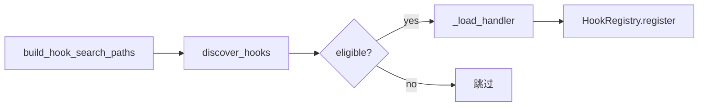
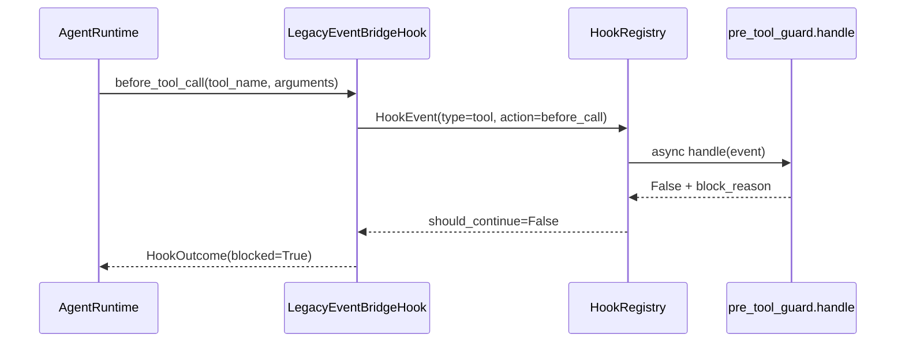

# agenticx.hooks 模块结论

>  Maintainer-facing summary for `agenticx/hooks` (~26 tracked files).

## Responsibility

`agenticx.hooks` 是 AgenticX 的**全局 Hook 基础设施**：统一事件模型、异步注册表、目录化 Python Hook 的发现/加载，以及 JSON/YAML **声明式 Hook** 的解析与执行。它把 LLM/Tool 调用前后的拦截、Agent 生命周期、命令事件等，收敛到同一套 `HookEvent` 总线上，供运行时桥接、预置安全策略与外部工具链（Cursor/Claude plugins）导入的 Hook 共用。

**本模块负责：**

- 全局 `HookRegistry` 与 `HookEvent` 语义（含 `type` / `type:action` 双键派发）。
- 基于 `HOOK.yaml` + `handler.py` 的 bundled / managed / workspace Hook 扫描与动态加载。
- 声明式 Hook（`command` / `http` / `prompt` / `agent`）的配置模型、执行器，以及 Cursor `hooks.json`、Claude `scripts/hooks/*.js` 的兼容解析。
- LLM / Tool 专用 Hook API（`register_*_hook`、`execute_*_hooks`），内部桥接到全局注册表。
- Studio 侧 Hook 列表与设置的数据面（`build_hooks_list_payload`、`get_hook_settings_from_config`）。

**本模块不负责：**

- `agenticx.runtime.hooks` 内的 **AgentHook 生命周期**（`before_model` / `on_agent_end` 等）——那是运行时局部注册表；二者通过 `LegacyEventBridgeHook`（位于 `runtime/hooks/`）单向桥接到本模块总线。
- Desktop UI 渲染与 Hook 开关交互（消费方在 `studio/server.py` 的 `/api/hooks*`）。
- Skills、MCP、Guardrails 等与 Hook 无关的能力扩展。

## Entry points and public interfaces

| 入口 | 用途 |
|------|------|
| `agenticx.hooks` 包导出 | 对外稳定 API：`register_hook` / `trigger_hook_event(_sync)`、`load_discovered_hooks`、`discover_*`、`DeclarativeHook*`、LLM/Tool Hook 注册与执行 |
| `load_discovered_hooks(workspace_dir?)` | Studio 冷启动/对话前加载 eligible 目录 Hook 到全局注册表 |
| `GET /api/hooks` | 经 `build_hooks_list_payload()` 返回 `curated_hooks` + 去重后的 `imported_hooks` |
| `GET/PUT /api/hooks/settings` | 读写 `~/.agenticx/config.yaml` 的 `hooks.*` 节 |
| `dispatch_hook_event_sync(...)` | `agenticx.longrun` 任务工作区生命周期事件同步派发 |
| `LegacyEventBridgeHook`（runtime 侧） | 将 `agent:start/stop`、`tool:before_call/after_call` 转为 `HookEvent` 并调用 `trigger_hook_event` |

## Core execution path

**1. 目录化 Python Hook（bundled / managed / workspace）**

- `build_hook_search_paths` 固定扫描 `agenticx/hooks/bundled`、`~/.agenticx/hooks`、`<workspace>/hooks`，并可启用 `~/.cursor/plugins`、`~/.claude/plugins` 及 `hooks.custom_paths`。
- `discover_hooks` 解析 `HOOK.yaml`（`parse_hook_metadata`），用 `check_requirements` + `is_hook_enabled` 判定 eligibility。
- `load_hooks` 动态 import `handler.py` 的 `export` 函数（默认 `handle`），按 `metadata.events` 注册到全局 `HookRegistry`；`_LOADED_HOOK_KEYS` 去重。

**2. 运行时工具拦截（Studio Meta-Agent 主路径）**

- `agent_runtime.py` 在构造时注册 `LegacyEventBridgeHook(priority=100)`。
- `bash_exec` 时 bridge 额外注入 `context["command"]`，供 `pre_tool_guard` 做 shell 模式匹配。
- 任一 handler 返回 `False` 则整条链路阻断；`block_reason` 经 `event.context` 回传用户可读文案。

**3. 声明式 Hook**

- `discover_declarative_hooks` 聚合 `hooks.json`、inline `hooks.declarative`、plugin 脚本扫描结果 → `DeclarativeHookConfig` 列表。
- `DeclarativeHookExecutor.execute` 按 canonical event + `matcher` 过滤，分派到 bash / httpx POST / LLM 判定四类执行器；`block_on_failure` 时可阻断。
- `create_declarative_agent_hook` 将 executor 适配为 runtime `AgentHook.before_tool_call` / `on_agent_end`，与目录 Hook 并行存在。

**4. LLM/Tool 遗留 Hook API**

- `register_before_llm_call_hook` 等将 sync 回调包装为 async `HookHandler`，注册键分别为 `llm:before_call`、`llm:after_call`、`tool:before_call`、`tool:after_call`。
- `execute_before_*_hooks` 构造带 `llm_context` / `tool_context` 的 `HookEvent` 并 `trigger_sync`。

## Important classes and functions

| 符号 | 角色 |
|------|------|
| `HookRegistry` | 按 event key 维护 handler 列表；`trigger` 合并 generic + scoped handlers；`trigger_sync` 在已有 event loop 时用独立线程 + 8s 超时 |
| `HookEvent` | 统一事件载荷：`type`、`action`、`agent_id`、`session_key`、`task_id`、`context`、`timestamp` |
| `HookEntry` / `discover_hooks` / `load_hooks` | 目录 Hook 发现与加载管线 |
| `DeclarativeHookConfig` / `DeclarativeHookExecutor` | 声明式 Hook 模型与多类型执行 |
| `deduplicate_hooks` / `classify_hook` | 导入 Hook 按 `(normalized_command, event)` 去重；标注 `native` / `needs_env` / `unknown` |
| `LLMCallHookContext` / `ToolCallHookContext` | LLM/Tool Hook 上下文；支持原地修改 messages / tool_input，或返回 False / 替换 response |
| `build_hooks_list_payload` | `/api/hooks` 响应构建（20s TTL 缓存） |
| bundled `pre_tool_guard.handle` | 危险 shell 正则拦截 + visible TUI 期间禁止 cc-bridge 日志 tail |

**预置 bundled Hook（`agenticx/hooks/bundled/`）**

| name | events | 概要 |
|------|--------|------|
| `pre-tool-guard` | `tool:before_call` | 危险命令闸门 |
| `session-checkpoint` | `agent:start`, `agent:stop` | 会话状态快照 |
| `session-memory` | `command:new`, `command:reset` | workspace `memory/` 写入快照 |
| `session-evaluator` | `agent:stop` | 会话结束轻量分析 |
| `compact-advisor` | `tool:after_call` | 上下文压缩建议 |
| `command-logger` | `command` | JSONL 审计 |
| `agent-metrics` | `agent:*`, `llm:after_call`, `tool:after_call` | 简易指标 |

## Data and configuration

| 配置源 | 键 / 文件 | 含义 |
|--------|-----------|------|
| `~/.agenticx/config.yaml` | `hooks.preset_paths` | 是否扫描 Cursor/Claude plugin 目录 |
| 同上 | `hooks.custom_paths` | 额外扫描路径 |
| 同上 | `hooks.declarative` | 内联声明式 Hook 条目 |
| 同上 | `hooks.disabled` | 按 hook name 禁用（curated + imported 列表 UI） |
| `~/.agenticx/hooks/config.yaml` | `internal.enabled` / `internal.entries.<name>.enabled` | 目录 Hook 运行时开关（`load_hook_runtime_config`） |
| 每个 Hook 目录 | `HOOK.yaml` | `name`、`events`、`export`、`requires`（bins/env/os） |
| 声明式 | `hooks.json` / plugin 内嵌 | Cursor/Claude 兼容格式 |

事件键约定示例：`tool:before_call`、`agent:start`、`command:new`、`llm:after_call`；handler 可同时订阅 `command` 与 `command:new`。

## Dependencies

- ** inward：** `agenticx.cli.config_manager.ConfigManager`（settings 读写）、`pydantic`（声明式模型）、可选 `httpx`（http hook / pre_tool_guard cc-bridge 探测）、`yaml`。
- **consumers：** `agenticx.studio.server`（加载 + REST）、`agenticx.runtime.agent_runtime` + `legacy_event_bridge_hook`、`agenticx.longrun.task_hooks`（`dispatch_hook_event_sync`）、测试套件 `test_smoke_openharness_features.py` / `test_smoke_security_hardening.py` 等。
- **注意：** 全局 `HookRegistry`（本模块）与 runtime `HookRegistry`（`AgentHook` 列表）是**两个独立注册表**，勿混称。

## Tests and operations

| 测试 / 操作 | 覆盖点 |
|-----------|--------|
| `tests/test_smoke_openharness_features.py` | 声明式解析/执行、search paths、dedup、`LegacyEventBridgeHook` block_reason |
| `tests/test_smoke_openclaw_hooks_system.py` | LLM/Tool execute 链路 |
| `tests/test_smoke_security_hardening.py` | `pre_tool_guard` 危险模式与误伤边界 |
| `tests/test_smoke_longrun_primitives.py` | `dispatch_hook_event_sync` payload 路由 |
| `tests/test_smoke_eigent_*_hooks.py` | LLM/Tool hook 注册与 agent_hooks 参数（历史兼容） |
| 运维 | 修改 bundled handler 后需重启 `agx serve`；`/api/hooks/settings` PUT 会 `invalidate_hooks_list_cache` |

本地验证 Hook 列表：`GET /api/hooks` 应返回 `curated_hooks`（7 个 bundled）与 `scan_summary`；禁用项写入 `hooks.disabled` 后 `enabled: false`。
