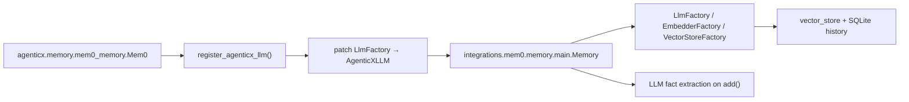
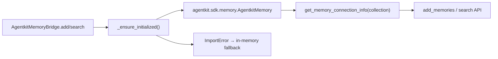

# agenticx.integrations 模块结论

> 结论生成时间：2026-08-08（首次创建，覆盖当前代码）

## Responsibility

`agenticx/integrations` 是 AgenticX 的**第三方平台适配层**，把外部托管服务或开源记忆框架接入框架内部抽象，而不承担核心业务逻辑。

**负责：**

- **Volcengine AgentKit**：Memory / Knowledge / MCP Gateway / Runtime / A2A / MCP App 部署适配，以及 veadk 互操作与云端凭据探测。
- **mem0（source-integrated）**：在仓库内 vendored 的 mem0ai 实现，供 `agenticx.memory.Mem0` 使用；核心扩展为 `AgenticXLLM`，让 mem0 内部推理走 AgenticX `BaseLLMProvider`。

**不负责：**

- 记忆/知识/工具的**领域抽象与生命周期**（分别在 `agenticx.memory`、`agenticx.knowledge`、`agenticx.tools`）。
- AgentKit **部署编排与 YAML 生成**（`agenticx.deploy.components.volcengine` 消费本模块 adapter，但不属于 integrations 本体）。
- Studio/Desktop 运行时接线、会话持久化、MCP Hub 等主链路（仅被 examples / deploy 间接引用）。

包内无顶层 `__init__.py`；公开 API 按子域从 `agenticx.integrations.agentkit` 或 `agenticx.integrations.mem0.*` 导入。

---

## Entry points and public interfaces

### AgentKit（`agenticx/integrations/agentkit/`）

统一入口：`agenticx.integrations.agentkit`（`__init__.py` 的 `__all__`）。

| 符号 | 角色 |
|------|------|
| `AgentkitMemoryBridge` | 实现 `BaseMemory`，对接 AgentKit 托管 Memory（控制面 SDK + 数据面 HTTP/mem0 协议） |
| `AgentkitKnowledgeBridge` | 实现 `BaseKnowledge`，对接 VikingDB 知识库 |
| `AgentkitMCPGateway` | MCP Gateway 客户端：注册/语义搜索工具 |
| `AgentkitRuntimeClient` | Runtime 实例创建、状态查询、销毁 |
| `AgenticXMCPAppAdapter` | 将 AgenticX 工具/Agent 暴露为 AgentkitMCPApp；生成 `wrapper.py` |
| `AgenticXA2AAppAdapter` | 将 AgenticX Agent 包装为 AgentkitA2aApp；生成 A2A wrapper |
| `CredentialDetector` | 检测 AgentKit 云端 Runtime 环境变量并提取模型/火山凭据 |
| `VeADKBridge` | AgenticX Agent ↔ veadk `Agent`/`Runner` 双向转换 |

典型消费方：`examples/agenticx-for-agentkit/`、`agenticx.deploy.components.volcengine.component`（`app_mode=mcp|a2a` 时调用 adapter 生成 wrapper）。

### mem0（`agenticx/integrations/mem0/`）

AgenticX 主路径**不**依赖 `mem0` PyPI 包的公开 re-export，而是直接引用 vendored 路径：

| 路径 | 用途 |
|------|------|
| `agenticx.integrations.mem0.memory.main.Memory` | 同步记忆引擎（add/search/reset 等） |
| `agenticx.integrations.mem0.llms.agenticx_llm.AgenticXLLM` | mem0 LLM 插槽，桥接 `BaseLLMProvider` |
| `agenticx.integrations.mem0.utils.factory.{LlmFactory,EmbedderFactory,VectorStoreFactory}` | provider 名 → 本地实现类 |
| `agenticx.integrations.mem0.configs.base.MemoryConfig` | Pydantic 记忆总配置 |
| `agenticx.integrations.mem0.client.main.MemoryClient` | 远端 Mem0 SaaS HTTP 客户端 |
| `agenticx.integrations.mem0.proxy.main.Mem0` | LiteLLM 风格 proxy（本地 Memory 或 MemoryClient） |

上层封装：`agenticx.memory.mem0_memory.Mem0`（async `BaseMemory`）、`agenticx.memory.mem0_wrapper.Mem0`（同步包装）。

---

## Core execution path

### 路径 A：AgenticX 记忆 → vendored mem0

1. `Mem0.__init__` 注册 LLM 到 `_agenticx_llm_registry`，并将 `LlmFactory.provider_to_class["openai"]` 指向 `AgenticXLLM`（借用 openai 插槽注入自定义 provider）。
2. `Memory.__init__` 按 `MemoryConfig` 实例化 embedder、vector store、LLM、可选 graph store、`SQLiteManager`。
3. `Memory.add(messages, user_id|agent_id|run_id, infer=True)`：经 `_build_filters_and_metadata` 构造作用域 → LLM 抽取/更新事实 → 写入向量库与 history DB；启用 graph 时同步 `MemoryGraph`。
4. `Mem0.search` 要求 metadata 含 `user_id` 或 `agent_id`，调用 `Memory.search` 并映射为 `SearchResult`。

### 路径 B：AgentKit Memory Bridge

SDK 未安装或初始化失败时，bridge 降级为进程内 `_records` 字典，保证 examples 可离线跑通。

### 路径 C：AgentKit 部署 wrapper 生成

`VolcengineComponent` 按 `app_mode` 分支：

- `mcp` → `AgenticXMCPAppAdapter.generate_mcp_wrapper(agent_module, agent_var, tool_vars)`
- `a2a` → `AgenticXA2AAppAdapter.generate_a2a_wrapper(agent_module, agent_var)`

输出 standalone Python 供 AgentKit Runtime 加载；凭据由 `CredentialDetector.detect()` 从 `MODEL_AGENT_*` / `VOLCENGINE_*` 环境变量读取。

### 路径 D：mem0 远端 / Proxy

- `MemoryClient`：httpx 调用 Mem0 云 API（`api_key` + `host`）。
- `proxy.main.Mem0`：有 `api_key` 用 `MemoryClient`，否则 `Memory.from_config`；`Chat.completions.create` 在对话前检索记忆并注入 prompt（依赖 `litellm`）。

---

## Important classes and functions

### AgentKit 子域

- **`AgentkitMemoryBridge`**：lazy init；`add`/`search`/`clear` 对齐 `BaseMemory`；tenant 写入 metadata。
- **`AgentkitKnowledgeBridge`**：lazy init `AgentkitKnowledge`；`collection_name` 默认读 `DATABASE_VIKING_COLLECTION`；无 SDK 时用本地 `_documents` fallback。
- **`AgentkitMCPGateway`**：`register_tool` / `search_tools` / `invoke_tool` 封装 SDK。
- **`AgentkitRuntimeClient`**：`create_runtime` / `get_runtime_status` / `list_runtimes` / `destroy_runtime`。
- **`AgenticXMCPAppAdapter`**：`register_tool` 提取 `args_schema`；`register_agent_as_tool`；`generate_mcp_wrapper` 用 `string.Template` 生成部署代码。
- **`AgenticXA2AAppAdapter`**：skills 列表 + `generate_a2a_wrapper`。
- **`CredentialDetector`**：`CLOUD_MODE_INDICATORS`（`AGENTKIT_RUNTIME_ID` 等）；`detect()` 缓存 `(is_cloud, credentials)`；`apply_to_env()` 写回 os.environ。
- **`VeADKBridge`**：`to_veadk_agent` 从 role/goal/backstory 拼 instruction；`from_veadk_agent` 反向构造 AgenticX Agent 属性。

### mem0 子域

- **`Memory`**（`memory/main.py`）：核心同步引擎；`from_config`；`add` / `search` / `get_all` / `delete` / `reset`；可选 `MemoryGraph`（Neo4j / Neptune / Memgraph）。
- **`_build_filters_and_metadata`**：统一 `user_id` / `agent_id` / `run_id` / `actor_id` 过滤语义。
- **`AgenticXLLM`** + **`register_agenticx_llm`**：全局 registry；`generate_response` 调 `llm_instance.invoke(messages)`。
- **`LlmFactory` / `EmbedderFactory` / `VectorStoreFactory`**：`provider_to_class` 映射到 `agenticx.integrations.mem0.llms.*` / `embeddings.*` / `vector_stores.*`；`agenticx` provider 需 `config.params["llm_instance"]`。
- **`MemoryGraph`**（`memory/graph_memory.py`）：实体/关系抽取、BM25 + 图检索；依赖 `langchain_neo4j`、`rank_bm25`。
- **`SQLiteManager`**（`memory/storage.py`）：变更历史与迁移元数据。
- **`MemoryClient`**：SaaS REST；带 `api_error_handler` 装饰器。

---

## Data and configuration

### AgentKit

- **Bridge 构造参数**：`collection_name`、`tenant_id`、`api_config`（透传 SDK）。
- **凭据环境变量**（`CredentialDetector`）：`MODEL_AGENT_NAME`、`MODEL_AGENT_API_KEY`、`VOLCENGINE_ACCESS_KEY`、`VOLCENGINE_SECRET_KEY`；云端标识 `AGENTKIT_RUNTIME_ID` / `AGENTKIT_ENVIRONMENT` / `VOLCENGINE_RUNTIME_ID`。
- **Knowledge**：`DATABASE_VIKING_COLLECTION` 默认 collection；`embedding_model` 默认 `doubao-embedding`。

### mem0

- **`MemoryConfig`**（`configs/base.py`）：`vector_store`、`llm`、`embedder`、`history_db_path`（默认 `~/.mem0/history.db`）、`graph_store`、`version`（默认 `v1.1`）、自定义 fact/update prompt。
- **数据目录**：`MEM0_DIR` 或 `~/.mem0`；FAISS/Qdrant 迁移路径 `migrations_{provider}`。
- **会话作用域**：`add`/`search` 至少其一 — `user_id`、`agent_id`、`run_id`；AgenticX `Mem0` 包装层强制 metadata 含 `user_id` 或 `agent_id`，并注入 `tenant_id`。
- **Vector store providers**（factory）：chroma、qdrant、pgvector、milvus、pinecone、redis、elasticsearch、faiss、supabase、weaviate、mongodb、opensearch、azure_ai_search、vertex_ai_vector_search、upstash_vector、langchain、baidu 等。
- **LLM providers**（factory）：openai、ollama、anthropic、litellm、azure_openai、gemini、deepseek、groq、together、aws_bedrock、langchain、agenticx 等。

---

## Dependencies

| 依赖 | 作用域 |
|------|--------|
| `agentkit-sdk-python`（extra `volcengine`） | AgentKit 全部 bridge / gateway / runtime；缺失时 warning + fallback |
| `veadk`（可选） | `VeADKBridge` |
| `mem0ai`（core dep） | 类型与部分 `mem0.*` import 路径；运行时 factory 指向 vendored 实现 |
| `agenticx.memory` / `agenticx.knowledge` / `agenticx.llms` | Bridge 实现的基类与 LLM |
| `agenticx.deploy.components.volcengine` | 反向依赖 adapter 生成 wrapper |
| mem0 子系统可选：`litellm`（proxy）、`langchain_neo4j` + `rank_bm25`（graph）、各 vector DB 客户端（按 provider 懒加载） |

---

## Tests and operations

**测试边界（integrations 相关，非完整列表）：**

- `tests/test_mem0_memory.py`：mock `integrations.mem0.memory.main.Memory`，验证 `Mem0` 初始化、add/search/clear 参数与 `user_id` 校验。
- `tests/test_smoke_agentkit_volcengine_component.py`、`test_smoke_agentkit_config_generator.py`、`test_smoke_agentkit_dockerfile_generator.py`：经 deploy 组件间接覆盖 MCP/A2A wrapper 与 `agentkit.yaml` 生成。
- `tests/test_smoke_ark_provider.py`：`ArkLLMProvider.from_agentkit_env()` 与 AgentKit 环境变量对齐。

**运维注意：**

- AgentKit SDK 未安装时 bridge 静默降级；生产需显式 `pip install agenticx[volcengine]` 并配置凭据。
- mem0 本地默认写 `~/.mem0`；换 embedder/vector store 通常需 `Memory.reset()` 或重建索引。
- `mem0_memory.Mem0` 通过篡改 `LlmFactory.provider_to_class["openai"]` 注入 LLM，多 tenant 并发初始化存在全局 factory 竞态风险。
- Graph memory 启用时需额外图数据库与 Python 依赖，失败在 import 阶段即抛错。

---

## Unverified or ambiguous

- `agenticx/integrations/mem0/__init__.py` 仍从 PyPI 包 `mem0.*` re-export，与主路径 `agenticx.integrations.mem0.memory.main` 并存；直接 `from mem0 import Memory` 可能非 vendored 副本。
- `memory/main.py` 内部部分 import 使用 `mem0.*` 前缀（如 graph 懒加载），与 `agenticx.integrations.mem0.*` 混用，需以实际 editable 安装后的 import 解析为准。
- `tests/test_mem0_memory.py` 断言 `llm.provider == "agenticx"`，而 `mem0_memory._create_mem0_config` 当前写 `provider="openai"` 并 patch factory；测试与实现可能不同步。
