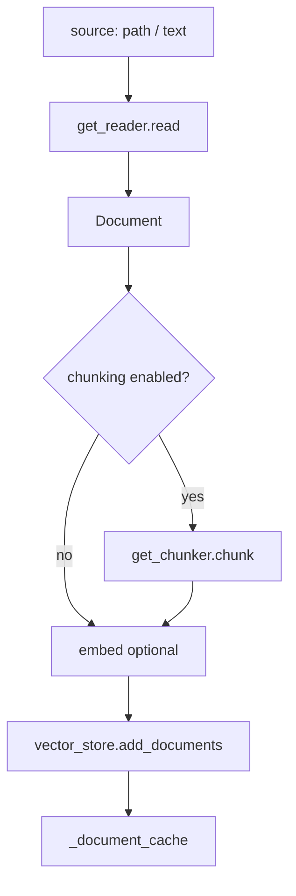
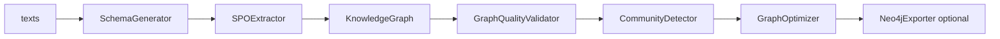

# agenticx.knowledge 模块结论

> Maintainer-facing summary for `agenticx/knowledge` (~35 tracked files).

## Responsibility

`agenticx.knowledge` 是 AgenticX 框架层的**通用知识处理库**：定义 `Document` 领域模型、多格式 Reader、可插拔 Chunker、多后端文档处理管线、LLM 驱动的知识图谱构建（GraphRAG 向），以及带「强制 / 意图」模式的检索编排。它面向可复用的「读文档 → 切分 → 向量化入库 / 建图 → 检索」流水线，供示例、GraphRAG 集成与部分 Studio 入库逻辑复用。

**本模块负责：**

- 文档抽象与读写：`Document` / `DocumentMetadata`、`readers.*`、`get_reader` 扩展点。
- 分块框架：`ChunkingFramework`、多种 Chunker（recursive / semantic / agentic 等）及 `get_chunker` 注册表。
- 文档处理与结构抽取：`DocumentProcessor` 多 backend 选型；`ContentExtractor` 结构元素模型。
- 知识图谱：`KnowledgeGraphBuilder` + SPO 抽取、质量校验、社区发现、Neo4j 导出（可选）。
- 向量知识库门面：`Knowledge` 类封装 `BaseVectorStorage` + `BaseEmbeddingProvider` 的 CRUD/search。
- 检索意图编排：`KnowledgeSearchOrchestrator`（`FORCE` vs `INTENT`）。

**本模块不负责（边界务必区分）：**

| 模块 | 分工 |
|------|------|
| `agenticx/studio/kb/` | **Stage-1 本地知识库产品运行时**：Chroma/Milvus 入库 Job、hybrid BM25+向量、`knowledge_search` 工具、Desktop 设置面板；仅**调用**本模块的 `ChunkingConfig` / `get_chunker` 做分块，向量检索与文档登记在 kb 层 |
| `agenticx/brain/` | **多脑挂载与隔离**：每脑一套 `KBRuntime` 或 `CodeIndexManager`；对话侧 `knowledge_search` 走 brain → kb，不直接实例化本模块 `Knowledge` |
| `agenticx/code_index/` | **代码语义索引**（Semble/BM25 hybrid）；与文档 Reader/Chunker 无关 |
| `agenticx/retrieval/` | 独立 Retriever 抽象（Vector/BM25/Hybrid/Graph/Auto）；与本模块 `Knowledge.search` 并行，非同一实现 |

## Entry points and public interfaces

| 入口 | 用途 |
|------|------|
| `from agenticx.knowledge import Knowledge, Document, DocumentProcessor, KnowledgeGraphBuilder, KnowledgeSearchOrchestrator, ...` | 包级公开导出（见 `knowledge/__init__.py` `__all__`） |
| `Knowledge(vector_store, embedding_model, ...)` | 异步文档 CRUD + `search(query)` |
| `Knowledge.add_from_path` / `add_text` | 路径批量导入：reader → chunker → vector store |
| `get_reader(source)` / `get_chunker(strategy)` | 按扩展名或策略名解析实现 |
| `DocumentProcessor.process_document` | 按复杂度自动或指定 backend 解析单文件 |
| `KnowledgeGraphBuilder.build_from_texts` | 文本列表 → Entity/Relationship 图 |
| `KnowledgeSearchOrchestrator.search` | 强制检索或 LLM 意图门控后再检索 |
| `agenticx.studio.kb.runtime._chunk_with_agenticx` | Studio 入库分块适配层（失败回落 naive split） |
| `agenticx.tools.document_text` | 工具层通过 `get_reader` 读文档 |
| `agenticx.llms.llm_factory` | 读取 `knowledge.graphers.config.LLMConfig` 构造 LLM |

## Core execution path

**路径 A — 向量知识库（`Knowledge`）**

- `search`：可选 `embedding_model.embed_text(query)` → `vector_store.search`。
- 更新/删除同步 vector store 与内存 cache。

**路径 B — Studio KB 分块（消费方，非本模块持久化）**

- `studio/kb/runtime.py` 调用 `ChunkingConfig` + `get_chunker`；`semantic`/`agentic` 等需 LLM 的策略在 Stage-1 可能失败并回落 `_naive_split`；`contextual` 策略在 recursive 结果上前缀文档标题。

**路径 C — 文档处理（`DocumentProcessor`）**

- `_detect_complexity` + `select_backend` 在 `SIMPLE_TEXT` / `STRUCTURED` / `VLM_LAYOUT` 间选择；产出 `ProcessingResult.documents`。
- `ContentExtractor` 提供 MIME 探测、Markdown/HTML 结构元素树，供高精度解析场景使用。

**路径 D — 知识图谱（`graphers/`）**

- `KnowledgeGraphBuilder` 经 `LlmFactory.create_llm(LLMConfig)` 获取 LLM；默认 `extraction_method='spo'`（传统分离抽取已移除）。
- `networkx` 为可选依赖（`agenticx[graph]`）；Neo4j 导出在 import 失败时 `NEO4J_AVAILABLE=False`。

**路径 E — 检索编排（`KnowledgeSearchOrchestrator`）**

- `FORCE`：始终 `knowledge.search(user_message)`。
- `INTENT`：LLM 输出 `<need_search>true|false</need_search>`；无 LLM 或解析失败时**回落为强制检索**（与 Cherry Studio 式「智能/始终/仅手动」三态中「智能」语义对齐，配置入口在 Studio/Desktop 而非本模块）。

## Important classes and functions

| 符号 | 角色 |
|------|------|
| `Document` / `DocumentMetadata` / `ChunkMetadata` | 统一文档与分块元数据；支持 `to_dict` / parent chunk 关系 |
| `BaseKnowledge` / `BaseReader` / `BaseChunker` | 抽象基类与 `ChunkingConfig` |
| `Knowledge` | 向量库门面：add/search/update/delete/clear/get_stats |
| `ChunkingFramework` / `ChunkingOptimizer` | 高级分块注册与质量评估 |
| `SemanticChunker` / `AgenticChunker` / `RecursiveChunker` 等 | 策略实现；registry 别名 `fixed`/`llm`/`csv` |
| `DocumentProcessor` / `ProcessingBackend` | 多 backend 文档解析与 metrics |
| `ContentExtractor` / `StructuralElement` | 结构化解构 |
| `ConfigurationManager` | YAML/JSON/env 加载 `ProcessingConfiguration`（含 `GrapherConfig`） |
| `KnowledgeGraphBuilder` | GraphRAG 主编排器 |
| `Entity` / `Relationship` / `KnowledgeGraph` | 图领域模型 |
| `SPOExtractor` / `SchemaGenerator` | LLM 模式/schema + 三元组抽取 |
| `GraphQualityValidator` / `CommunityDetector` / `GraphOptimizer` | 图质量、社区、优化 |
| `Neo4jExporter` | 可选图导出 |
| `KnowledgeSearchOrchestrator` | `KnowledgeRecognitionMode.FORCE` / `INTENT` |

## Data and configuration

| 配置 | 位置 | 说明 |
|------|------|------|
| `ChunkingConfig` | 代码 / 调用方传入 | `chunk_size`、`chunk_overlap`、`strategy`、`enabled` |
| `ProcessingConfiguration` | `ConfigurationManager` | 处理 backend、OCR/layout 等 feature flags |
| `GraphRagConfig` / `LLMConfig` | `graphers/config.py` | 图谱抽取、社区检测、强模型等；也被 `LlmFactory` 复用 |
| `agenticx/configs/knowledge_graphers_config.yml` | 仓库 configs | GraphRAG 示例/默认配置源 |
| 向量/嵌入 | 调用方注入 | `Knowledge` 不内置存储；由 `agenticx.storage` / `agenticx.embeddings` 提供 |

持久化路径**不在**本模块内定义；Studio KB 与 Brain 各自管理 `~/.agenticx/` 下的 chroma/registry 目录。

## Dependencies

- **inward：** `agenticx.embeddings.base.BaseEmbeddingProvider`、`agenticx.storage.base.BaseVectorStorage`、`agenticx.retrieval.base.BaseRetriever`（`BaseKnowledge` 可选 retriever 字段）、`agenticx.llms.LlmFactory`（graphers）。
- **optional：** `networkx`（图算法）、Neo4j 驱动（导出）、各 Reader 的三方库（PDF/Word/PPT 等，按 reader 懒加载）。
- **outward consumers：** `studio/kb/runtime`（chunker）、`tools/document_text`（reader）、`storage/graph_storages/neo4j.py`（图模型）、`integrations/agentkit/knowledge_bridge.py`、`examples/agenticx-for-graphrag/*`。

## Tests and operations

| 测试 | 覆盖点 |
|------|--------|
| `tests/test_smoke_cherry_studio_rag_intent.py` | `KnowledgeSearchOrchestrator` FORCE/INTENT/LLM 失败回落 |
| `tests/test_smoke_ark_provider.py` | `graphers.config.LLMConfig` 序列化 |
| `examples/chunking_strategies_demo.py` | Chunker 策略演示 |
| `examples/neo4j_export_demo.py` / GraphRAG 示例 | 图谱构建与导出 |

**运维提示：**

- 选用 `SemanticChunker` / `AgenticChunker` 需可用的 LLM 句柄；生产入库若仅要稳定分块，优先 `recursive`（与 Studio Stage-1 默认一致）。
- 图谱构建依赖工作目录下可选的 `prompts/`、`schema.json` 与外部 `PromptManager`；缺失时 builder 会 warning 并降级。
- 本模块 `Knowledge` 类与 Studio `KBRuntime` **不是同一入口**；排查 Desktop 知识库问题应先看 `brain/` + `studio/kb/`，再下钻到本模块 chunker/reader。

## Unverified or ambiguous

- `BaseKnowledge` 抽象 API（sync `add_content` / `search`）与具体实现 `Knowledge`（全 async）在接口形态上不完全一致，调用方需以 `Knowledge` 为准。
- `DocumentProcessor` 的 `VLMLayoutBackend` 能力取决于 feature flag 与外部模型/API，仓库内未见端到端生产化接线至 Studio KB 主路径。
- `KnowledgeGraphBuilder` 对 repo 根目录 `PromptManager` 的动态 import 在标准包安装布局下可能不可用，GraphRAG 更多见于 `examples/` 而非 Near 默认功能。
