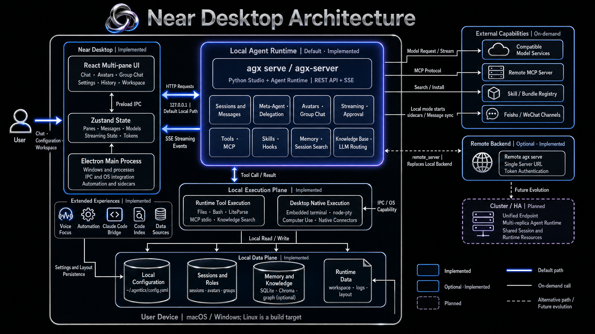

# Near Desktop — macOS Alpha Preview

**Language / 语言**: [English](README.md) | [中文](README_ZN.md)

> **Note: This is an Alpha preview. macOS signing / notarization is not wired up yet. First launch requires a manual Gatekeeper bypass (see below).**

## Architecture

<div align="center">

</div>

Near is a local-first multi-agent desktop workspace. The default path combines the Electron shell with a local `agx serve / agx-server`. An optional remote single-server backend is implemented; Cluster / HA remains planned.

> Architecture drawing prompts: [Near Desktop (English)](../assets/prompt-for-pics/desktop_en.md)

```text
Electron Main
  ├─ Start / stop agx serve
  ├─ IPC: get-api-base / save-config / native-say
  └─ Tray + Native Menu

Renderer (React + Zustand)
  ├─ ChatView (meta-agent chat, SSE token stream)
  ├─ SubAgentPanel (Agent Team progress and events)
  ├─ ConfirmDialog (routed by agent_id)
  └─ SettingsPanel (provider / model / apiKey)
```

## Install (end users)

> **Optional remote mode**: Configure and enable `remote_server` in `~/.agenticx/config.yaml` to connect to a remote `agx serve` without installing Python / `agx` locally. See `.cursor/plans/2026-03-24-desktop-remote-backend.plan.md` in the repo.

### Step 1 — Download the correct package

| Machine | Download |
|------|---------|
| Apple M1 / M2 / M3 / M4 (ARM) | `Near-x.x.x-arm64.dmg` |
| Intel Mac (pre-2020) | `Near-x.x.x-x64.dmg` |

**How do I know which chip I have?**  
Apple menu → About This Mac → Chip.

### Step 2 — Local backend (pick one)

**Option A — Official self-contained DMG (recommended)**

DMGs built with `packaging/build_dmg.sh` embed `agx-server` (PyInstaller). You do **not** need Python or the `agx` CLI. If you run `npm run build:mac:*` from source without placing `bundled-backend/<arch>/agx-server` first, use Option B.

**Option B — Install the `agx` CLI yourself**

If you are not using a self-contained DMG, Near needs the `agx` CLI for the local AI service. In a terminal:

```bash
curl -sSL https://raw.githubusercontent.com/agenticx/agenticx/main/install.sh | bash
```

Or via pip:

```bash
pip install agenticx
```

Verify:

```bash
agx --version
```

### Step 3 — Bypass macOS Gatekeeper (unsigned Alpha)

The current build is not Apple-notarized, so macOS may block open. Two ways to allow it:

**Option A (recommended, GUI):**

1. Double-click the `.dmg` and drag Near.app into Applications
2. In Finder, find Near.app → **right-click → Open**
3. Confirm **Open** in the dialog (first time only)

**Option B (terminal):**

```bash
xattr -cr /Applications/Near.app
```

### Step 4 — Launch Near

Double-click Near.app and wait about 5–15 seconds for initialization.

---

## Requirements (developers)

- Node.js 20+
- Python 3.10+
- `agx` CLI installed (`agx --version` works)
- macOS 13+ (Windows / Linux have basic compatibility only; not fully verified)

## Quick start (development)

```bash
cd desktop
npm install
npm run dev
```

The Electron main process starts `agx serve --host 127.0.0.1 --port <random>` automatically. The renderer gets the API base via IPC — you do not need a second terminal.

## Packaging

### Icon sync (dev vs DMG)

Export `icon.png` (Dock / dev) and `icon.icns` (DMG / App) from the same master art so visual size stays consistent:

```bash
cd desktop
npm run icons:sync
# or specify a master image
bash ./scripts/sync-icons.sh assets/icon-master.png
```

Prefer a `1024x1024` square PNG with consistent subject padding (about 80%–85% of the canvas).

### Self-contained DMG (embedded Python backend; users need no `agx`)

From the repo root (Python ≥3.10, Node 20; creates `packaging/.venv-packaging` on first run):

```bash
# Apple Silicon
./packaging/build_dmg.sh arm64

# Intel Mac (build x64 backend on an x64 runner or under Rosetta)
./packaging/build_dmg.sh x64

# Universal: build arm64 + x64 backends, then lipo
./packaging/build_dmg.sh universal
```

Skip rebuilding Python and reuse an existing `packaging/dist/<arch>/agx-server`:

```bash
SKIP_BACKEND=1 ./packaging/build_dmg.sh arm64
```

Artifacts land under `desktop/release/` as `.dmg` / `.zip`.

**Optional: signing and notarization** (recommended for distribution)  
Set `APPLE_ID`, `APPLE_ID_PASSWORD` (app-specific password), `APPLE_TEAM_ID`, and `CSC_LINK` / `CSC_KEY_PASSWORD` (Developer ID cert). Without them, `electron-builder.yml` builds unsigned. With `CSC_LINK`, CI switches to `electron-builder.signing.yml` and attempts notarization (`desktop/scripts/mac/notarize.js` skips when `APPLE_*` is missing).

**GitHub Actions Secrets** (configure under **Repository secrets**, not only Environments unless the workflow binds `environment:`):

Path: **Repo → Settings → Secrets and variables → Actions → Repository secrets → New repository secret**

| Secret | Value |
|--------|-----|
| `CSC_LINK` | Full output of `base64 -i ~/Documents/AppleCerts/DeveloperID.p12` |
| `CSC_KEY_PASSWORD` | `.p12` export password |
| `APPLE_ID` | Apple ID email |
| `APPLE_ID_PASSWORD` | [App-specific password](https://appleid.apple.com) (`xxxx-xxxx-xxxx-xxxx`); CI also injects it as `APPLE_APP_SPECIFIC_PASSWORD` (electron-builder 25) |
| `APPLE_TEAM_ID` | Your Team ID |

Trigger: push tag `desktop-v*` / `v*`, or **Run workflow** (`workflow_dispatch`) on the Actions page. Artifacts: `near-arm64` / `near-x64`.

**Common CI errors**

| Log | Cause | Fix |
|------|------|------|
| `CSC_KEY_PASSWORD is not defined` | `CSC_LINK` set without password | Add Secret `CSC_KEY_PASSWORD` |
| `desktop not a file` / base64 decode failed | Invalid `CSC_LINK` base64 | Re-run `base64 -i …p12` and paste the **entire** string |
| `Cannot open .p12` | Wrong password | Check `CSC_KEY_PASSWORD` or re-export `.p12` |
| `code has no resources…` / `Signature=adhoc` | `identity: null` skipped signing | Remove `identity: null`; let `CSC_LINK` match Developer ID |
| `APPLE_APP_SPECIFIC_PASSWORD env var needs to be set` | electron-builder 25 name differs from `APPLE_ID_PASSWORD` | Ensure workflow injects `APPLE_APP_SPECIFIC_PASSWORD` (same value is fine) |

All five secrets must exist together: `CSC_LINK`, `CSC_KEY_PASSWORD`, `APPLE_ID`, `APPLE_ID_PASSWORD`, `APPLE_TEAM_ID`.

### Windows self-contained NSIS (embedded `agx-server.exe` + WeChat sidecar)

| Item | macOS | Windows (this path) |
|------|--------|-------------------|
| One-shot script | `packaging/build_dmg.sh` | `packaging/build_windows_installer.ps1` |
| Bundled dir | `desktop/bundled-backend/<arch>/` | `desktop/bundled-backend/win-amd64/` |
| Artifact | `.dmg` | `Near-<version>-win-x64.exe` (NSIS) |
| Host requirements | bash, Python, Node, Go | **Windows**, PowerShell 7+ (`pwsh`), Python ≥3.10, Node 20, Go 1.22+; `curl.exe` for smoke |

From the **repo root** in PowerShell:

```powershell
./packaging/build_windows_installer.ps1
```

Or from `desktop`:

```powershell
cd desktop
npm run build:win:bundled
```

Reuse an existing `packaging\dist\win-amd64\agx-server.exe` and skip PyInstaller (still smokes, rebuilds sidecar + installer):

```powershell
$env:SKIP_BACKEND = '1'
./packaging/build_windows_installer.ps1
```

**Note**: `electron-builder` `win.extraResources` points at `bundled-backend/win-amd64`. Running `npm run build:win` without that directory fails — same idea as missing `bundled-backend/<arch>` on macOS.

**CI**: Push a `v*` tag or manually `workflow_dispatch` with `windows-amd64` to run the same script and upload `Near-*-win-x64.exe`. Windows code signing is not wired (same as unsigned mac builds).

### Electron shell only (no embedded backend)

Per-arch packages (requires local `agx`):

```bash
cd desktop
npm run build:mac:arm64   # Apple Silicon → Near-x.x.x-arm64.dmg
npm run build:mac:x64     # Intel → Near-x.x.x-x64.dmg
```

Or both:

```bash
npm run build:mac:all
```

Artifacts are under `desktop/release/`.  
For Windows / Linux (**without** embedded backend; local `agx` required):

```bash
npm run build:win
npm run build:linux
```

For Windows with an embedded backend, use `build:win:bundled` or `packaging/build_windows_installer.ps1` above.

## Meta-Agent + Agent Team

Desktop already supports a “meta-agent + sub-agent team” collaboration model:

- The main chat shows only `meta` messages so the user can keep talking without being blocked by sub-tasks.
- The right-hand `SubAgentPanel` lists sub-agents, status (`running` / `completed` / `failed` / `cancelled`), and recent events.
- SSE events carry `agent_id`; the UI routes them to the main thread or the matching sub-agent card.
- Sub-agent cards support cancel via `POST /api/subagent/cancel`.
- Confirm dialogs show the source agent and send `agent_id` with `/api/confirm`.

## Known limitations

- macOS signing / notarization not yet integrated (dev builds run; release builds should add this later)
- STT prefers Whisper WASM and falls back to the Web Speech API
- `native say` is macOS-only; other platforms fall back to browser TTS
- Playwright Electron E2E covers basic smoke only, not the full voice path
