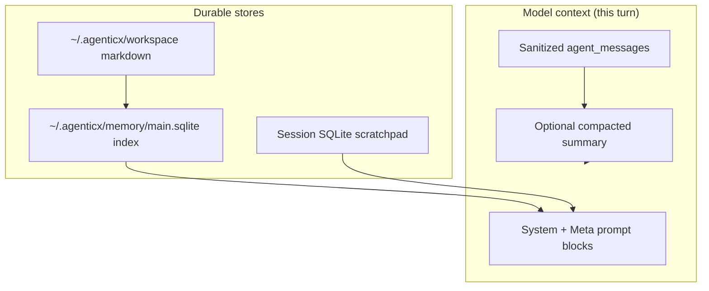

# Memory in AgenticX

## Overview

Agents need stable identity, recall of past work, and a bounded context window. AgenticX combines **file-backed workspace memory**, a **session scratchpad**, **automatic fact extraction** after each turn, **workspace retrieval** into the Meta-Agent system prompt, and **LLM-assisted context compaction** on long threads.

These are concrete runtime surfaces rather than a separate cognitive-layer framework. Each surface has an explicit persistence location and injection point.



## Connected memory surfaces

| Surface | Role | Persistence / injection |
|---------|------|-------------------------|
| **Workspace markdown** | Stable profile and curated notes | `IDENTITY.md`, `SOUL.md`, `USER.md`, and `MEMORY.md`, indexed by `WorkspaceMemoryStore` |
| **Daily facts** | Deterministic facts extracted from recent turns | `memory/<YYYY-MM-DD>.md`, appended by `MemoryHook` |
| **Session scratchpad** | Task-local notes and sub-agent results | SQLite-backed `StudioSession.scratchpad`, exposed through scratchpad tools |
| **Live context** | Recent messages plus an optional compacted prefix | Built by `AgentRuntime` for each model request |
| **Document knowledge** | User-managed reference documents | Mounted document brains queried through `knowledge_search` |

!!! note "Indexing vs raw files"
    Hybrid search (`WorkspaceMemoryStore`) indexes `MEMORY.md`, `IDENTITY.md`, `USER.md`, `SOUL.md`, and all `memory/*.md` under the workspace directory. Keeping these files concise improves recall quality.

## MemoryHook

`MemoryHook` is an `AgentHook` registered on `AgentRuntime` with **`priority=-10`**, so it runs **after** hooks with higher numeric priority when `run_on_agent_end` walks the registry (entries are sorted descending by priority).

### When it runs

- **`on_agent_end`** is invoked after a turn completes.
- It reads `session.chat_history`. If `len(chat_history) < MIN_CHAT_TURNS * 2` it returns immediately. Defaults: `MIN_CHAT_TURNS = 3` → **at least six chat records** required.
- Workspace directory: `session.workspace_dir`, else `AGX_WORKSPACE_ROOT`, else the user home directory.

### Extraction and limits

- **Heuristic only** (no extra LLM call): scans the **last 20** messages for Chinese user-request cues and assistant completion cues, emits bullet lines such as `- 用户请求:` / `- 完成事项:`.
- Caps output at **`MAX_FACTS_PER_SESSION` (8)** facts.

### Persistence

- Appends a dated block to **`memory/<today>.md`** under the workspace. Skips append if existing daily file plus new block would exceed **8000** characters.
- If **`MEMORY.md`** exists and is under **4000** characters, appends an `## Auto-extracted` section with up to **four** of the facts.

### Scratchpad

- Merges facts into `session.scratchpad["session_facts"]` (concatenated with newlines).

### `_maybe_compact_daily`

- If today’s `memory/<YYYY-MM-DD>.md` exceeds **2000** characters, rewrites it: keeps headings, drops duplicate bullet lines keyed by the **first 80 characters** (case-folded), preserving first occurrence. This is **deterministic deduplication**, not an LLM summarizer.

```python
# Reference constants (agenticx/runtime/hooks/memory_hook.py)
MIN_CHAT_TURNS = 3          # requires len(chat_history) >= MIN_CHAT_TURNS * 2
MAX_FACTS_PER_SESSION = 8
```

!!! warning "LANGUAGE HEURISTICS"
    Fact patterns target **Chinese** request keywords and Chinese/English completion markers. Conversations in other languages may yield fewer or no extracted lines until heuristics are extended.

## Workspace memory

### Directory layout (`~/.agenticx/workspace/`)

Typical markdown files (names are conventions used by indexing and prompts):

| Path | Purpose |
|------|---------|
| `IDENTITY.md` | Who the agent is; stable persona |
| `USER.md` | User profile, preferences |
| `SOUL.md` | Deeper style / values / tone |
| `MEMORY.md` | Long-form durable notes; receives optional auto-extracted sections |
| `memory/<YYYY-MM-DD>.md` | Daily session-fact log from `MemoryHook` |

Additional session artifacts (avatars, groups) may live alongside; the **search index** explicitly pulls the four root markdown files plus `memory/*.md`.

### Automatic recall: `_build_memory_recall_context`

Defined in `agenticx/runtime/prompts/meta_agent.py`. When building the Meta-Agent system prompt it:

1. Collects text from the **last five** user messages (up to **200** characters each).
2. Builds a query string (max **500** characters).
3. Calls `WorkspaceMemoryStore.search_sync(..., limit=5, mode="hybrid")`.
4. Injects a `## 相关历史记忆（自动召回）` section with snippets capped around **500** characters total.

If there are no user messages or no hits, the section is omitted.

!!! tip "Recall quality"
    Run or schedule `WorkspaceMemoryStore.index_workspace_sync(workspace_dir)` after large edits to markdown so FTS and hybrid ranking see fresh content.

## Session scratchpad

Each `StudioSession` carries a **`scratchpad`** dictionary persisted via SQLite (`agenticx/memory/session_store.py`). Besides user/agent keys from `scratchpad_write`, the runtime uses reserved patterns:

| Key pattern | Purpose |
|-------------|---------|
| `subagent_result::<id>` | Summary text after a subagent / delegation completes |
| `delegation_result::<id>` | Same pipeline writes delegation outcomes for Meta-Agent follow-up |
| `session_facts` | Incremental lines from `MemoryHook` |
| `__pending_subagent_summaries__` | Queue of pending subagent reports (internal) |
| `__taskspace_hint__` / `__taskspace_label_hint__` | Taskspace path hints from tools |

Meta-Agent context building reads `subagent_result::*` entries for “historical subagent results” when registry rows are missing.

## Context compaction (`ContextCompactor`)

Before each turn, `AgentRuntime` runs `ContextCompactor.maybe_compact` on **sanitized** `agent_messages` (see `agenticx/runtime/compactor.py`).

| Parameter | Default | Behavior |
|-----------|---------|----------|
| `threshold_messages` | `20` | Compact if message count **exceeds** this |
| `threshold_chars` | `48000` | Or if sum of `content` string lengths exceeds this |
| `retain_recent_messages` | `8` | Oldest portion is summarized; these tail messages stay verbatim |

Process:

1. Split into **prefix** (to compact) and **suffix** (retained).
2. Call the runtime LLM with a Chinese compaction instruction (temperature `0`, `max_tokens` `400`).
3. Replace the prefix with a single **system** message prefixed with `[compacted]` and the summary.
4. On failure, fall back to concatenated short snippets.

Minimum enforced floors: `threshold_messages >= 8`, `threshold_chars >= 4000`, `retain_recent_messages >= 4`.

!!! note "Configuration surface"
    Defaults are fixed in `AgentRuntime.__init__` (`ContextCompactor(llm)` with no YAML overrides). Custom deployments can construct `AgentRuntime` with a preconfigured `ContextCompactor` if needed.

## Memory-related configuration

| Item | Where | Description |
|------|-------|-------------|
| `memory.backend` | `~/.agenticx/config.yaml` | Declared in docs for pluggable memory backends (`sqlite`, `redis`, `postgresql`, etc.) |
| `memory.path` | `~/.agenticx/config.yaml` | Workspace root for memory features (see [Configuration](../getting-started/configuration.md)) |
| `AGX_WORKSPACE_ROOT` | Environment | Fallback workspace directory for `MemoryHook` when `session.workspace_dir` is unset |
| `MIN_CHAT_TURNS` | Code constant | `MemoryHook` gate: needs `len(chat_history) >= MIN_CHAT_TURNS * 2` |
| `MAX_FACTS_PER_SESSION` | Code constant | Cap on heuristic facts per `on_agent_end` |
| `WorkspaceMemoryStore` DB | Default path | `~/.agenticx/memory/main.sqlite` (`DEFAULT_WORKSPACE_MEMORY_DB`) |
| `ContextCompactor` thresholds | Code defaults | `20` messages / `48000` chars trigger; retain `8` messages |

```yaml
# ~/.agenticx/config.yaml (illustrative memory block)
memory:
  backend: sqlite
  path: ~/.agenticx/workspace
```

## See also

- [Configuration](../getting-started/configuration.md) — global `config.yaml` and environment variables
- [Architecture](architecture.md) — high-level runtime overview
