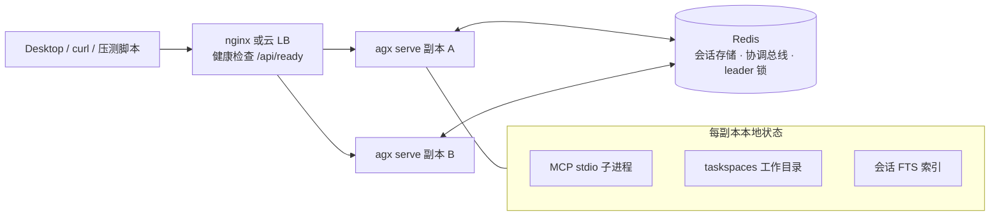

# AgenticX 高可用（HA）部署指南

> 适用版本：HA 路线图（Plan A–D）落地后的 `agx serve`。默认单机行为不变；HA 能力全部由环境变量/配置键开启。

## 1. 架构



- **共享层（Redis）**：会话消息/状态（Plan A）、会话锁 + cancel 广播 + SSE 事件 replay log（Plan C）、定时任务 leader 锁（Plan D）。
- **每副本本地**：MCP stdio 子进程、taskspaces 工作目录、FTS 索引、日志。这些**不**跨副本共享。
- **崩溃恢复**：运行中 turn 的 checkpoint 每轮落盘（Plan B）；持锁副本崩溃 → 锁租约过期 → 任一副本可接管续跑。

## 2. 配置项清单

| 环境变量 | 配置键（config.yaml） | 默认 | HA 取值 | 说明 |
|---|---|---|---|---|
| `AGX_HA_MODE` | — | 空 | `redis` | 一键打开 HA 默认（storage/coordination/scheduler/resume 联动） |
| `AGX_STORAGE_BACKEND` | `runtime.storage_backend` | `local` | `redis` | 会话/状态存储后端 |
| `AGX_COORDINATION_BACKEND` | `runtime.coordination_backend` | 跟随 storage/HA | `redis` | 协调总线后端 |
| `AGX_REDIS_URL` | `runtime.redis_url` | `AGENTICX_REDIS_URL`/`REDIS_URL` | `redis://host:6379/0` | Redis 连接串 |
| `AGX_AUTOMATION_SCHEDULER` | `runtime.automation.scheduler` | `electron`（HA 下 `server`） | `server` | 定时任务调度器位置 |
| `AGX_RESUME_INTERRUPTED` | `runtime.resume_interrupted` | 关（HA 下开） | `1` | 崩溃会话自动恢复 |
| `AGX_SESSION_FTS` | — | `1` | `0` | 多副本建议关，避免每副本各自 backfill |
| `AGX_DRAIN_TIMEOUT_SEC` | — | `15` | 按需 | 优雅停机等待在途 turn 的秒数 |

## 3. 本地 compose 快速验收

```bash
docker compose -f deploy/ha-docker-compose/docker-compose.yml up --build

curl -s localhost:8080/api/health   # {"status":"ok"}
curl -s localhost:8080/api/ready    # {"status":"ready"}
```

故障注入：

```bash
docker compose -f deploy/ha-docker-compose/docker-compose.yml stop agx-a
# 用同一 session_id 继续对话 / SSE 重连 → 另一副本接管
docker compose -f deploy/ha-docker-compose/docker-compose.yml start agx-a
```

## 4. 云部署测试清单

阿里云 / 移动云 / 自建 VM 通用，逐项可勾选。

### 4.1 资源

- [ ] 2× 同 VPC 算力（ECS / 弹性云主机 / 自建 VM），各跑一个 `agx serve`（容器或 systemd）
- [ ] 托管 Redis（或独立第三台自建）——**禁止**与 serve 同机，否则 kill 错节点会连 Redis 一起没
- [ ] LB（SLB / ALB / 云 LB）

### 4.2 网络

- [ ] 安全组仅放行 LB→serve、serve→Redis；Redis 不公网暴露
- [ ] 出网/代理已配（`HTTP(S)_PROXY`、模型 API 白名单）

### 4.3 LB

- [ ] 健康检查路径 = `/api/ready`（不是只打 `/api/health`）
- [ ] SSE idle timeout ≥ 5–10 分钟（否则长流式被 LB 掐断）
- [ ] 会话亲和策略已记录（`hash $arg_session_id` 或源地址）；「打错副本返回 `session_busy_elsewhere` 需重试」的兜底语义已知悉

### 4.4 部署

- [ ] 两副本 env 一致（`AGX_HA_MODE=redis` 等，见 §2）
- [ ] `AGX_SESSION_FTS=0`
- [ ] 镜像/版本一致

### 4.5 验收用例

1. [ ] 两副本 `/api/ready` 均 200
2. [ ] 经 LB 发起多轮工具调用会话，记录 `session_id`
3. [ ] `kill`/停掉当前持有该会话的副本，LB 健康检查摘流
4. [ ] 同 `session_id` 继续对话 / SSE 带 cursor 重连 → 另一副本接管续跑、事件补发无缺口
5. [ ] 定时任务在 leader 单副本仅 fire 一次（停 leader 后 35s 内另一副本接管且不重复 fire 同分钟任务）
6. [ ] 滚动重启：先停一副本（draining → 摘流 → 恢复）再停另一副本，全程会话不丢

### 4.6 观测

- [ ] 各副本日志中 lock/leader/resume 关键事件可查
- [ ] Redis key 可核对：`agenticx:sess:*`、`agenticx:lock:sess:*`、`agenticx:ev:sess:*`、`agenticx:automation:tasks`

## 5. 滚动重启操作步骤

1. 对副本 A：`SIGTERM`（或 `docker stop`）→ 进程进入 draining：`/api/chat` 新请求返回 `server_draining`，在途 turn 继续直至完成或 `AGX_DRAIN_TIMEOUT_SEC` 超时。
2. 确认 LB 已摘流 A（`/api/ready` 不再被打）。
3. 启动 A，待 `/api/ready` 200 后恢复流量。
4. 对副本 B 重复。

## 6. 故障接管验证步骤

1. 副本 A 上发起一个多轮工具调用会话（确保至少 3 轮工具调用），记录 `session_id`。
2. 会话进行中 `kill -9` 副本 A 进程。
3. 经 LB 用同一 `session_id` 发送追问：
   - 预期：副本 B 接管（锁租约 ≤30s 过期），若开启 `AGX_RESUME_INTERRUPTED=1`，B 重启/接管时从 checkpoint 的断点轮次续跑；
   - SSE 重连（`GET /api/sessions/{id}/stream?since=<cursor>` 或 `GET /api/sessions/{id}/events?since=<cursor>`）可补发断线期间事件。
4. 会话最终完成，`execution_state` 回到 `idle`。

## 7. 已知限制

- **MCP stdio 每副本独立**：每个副本各自拉起 MCP 子进程，状态不共享；远程/HTTP 类 MCP 天然可共享。
- **taskspaces 不共享**：工作目录在每副本本地盘；跨副本接管后，文件类工具看到的是接管副本的文件系统。
- **FTS 每副本各自 backfill**：建议 `AGX_SESSION_FTS=0` 或接受重复索引 IO。
- **nginx 无法按请求体 session_id 路由**：`/api/chat` 的 session_id 在 POST body 中；打错副本会收到 `session_busy_elsewhere`，客户端应重试另一副本或由 LB 重试。
- **SQLite 摘要/索引仍为本机**：会话列表元数据（`sessions.sqlite`）每副本各自维护；会话消息真相源在 Redis。
