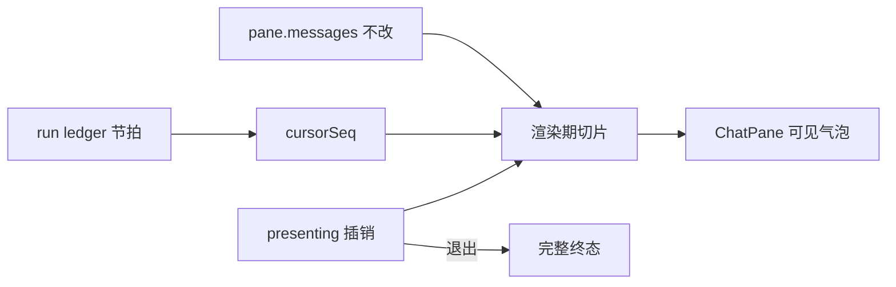

# 执行回放：聊天区演示播放

Planned-with: cursor-grok-4.6

Status: design

Depends-On: 已落地的 Desktop 执行回放（`desktop/src/components/replay/`，`2026-09-10-long-run-replay-02-desktop-replay`）

## Goal

售前可以把一次已经跑完的长任务，在**现有聊天窗格**里加速演示：左边气泡和工具卡按进度揭开，看起来就是产品自己在跑，而不必对着几十分钟的真跑去录屏。

回放仍然只读：不重跑模型、工具、MCP 或外部 API。调试用的时间轴、因果链、点选与进度针解耦保持不变。

## Why current playback is not enough

现在的「播放」只推动右侧 `cursorSeq`。左边 `ChatPane` 始终渲染完整 `pane.messages`，客户一进来就看到终态表格和结论。打开回放、点某一步看因果链也不该把对话藏起来，所以演示必须是显式模式，不能和调试回放绑死。

## Product contract

- **表面：** 演示时用现有聊天区（同一套气泡、工具卡、表格），不另做一套演示 UI。
- **插销：** 只有进入「演示」才切左边；平时打开执行回放、点步骤、看因果链，左边一条不少。
- **前情：** 这次 run 之前的对话整段保留。
- **节拍：** 演示播放按「会改聊天区的事件」停顿，不按原始墙钟，也不按每一条账本事件。
- **终态：** 播完暂停在完整结果上，不自动退出。退出演示或关掉回放面板后，左边恢复进演示前的完整聊天。
- **进行中：** 未结束的 run 不能进入演示。
- **整段会话：** 同一 session 里至少两次已结束 run 时，下拉可选「整段会话」，按时间拼接账本后一次演示揭完；进行中的 run 不进入拼接。

## Architecture

演示状态放在现有 `useReplayStore` 的窗格状态上，例如 `presenting: boolean`。进入演示时把游标seek到这次 run 的第一条事件并开始播放；不改写 `pane.messages`。`ChatPane` 只在 `presenting === true` 且 session/run 对得上时，用纯函数把消息滤成「前情 + 当前游标已揭示」。退出后过滤器关掉，列表自然回到终态。

## 进入与退出

进入（须同时满足）：

- 当前选中 run 状态为 `completed` / `failed` / `cancelled` / `interrupted`；
- 至少能把一条用户句或助手句对齐到这次 run 的账本事件。

否则按钮禁用，并用一句话说明原因（进行中 / 没有账本 / 对不上聊天记录）。账本 `completeness=partial` 或存在 `ledger_gap` 仍可进入，顶条提示「记录不完整，可能跳步」。

退出（任一即解除插销，左边恢复完整聊天）：

- 「退出演示」；
- 关掉该窗格的执行回放面板；
- 切换会话或关掉窗格；
- 在回放下拉框换成另一次 run。

暂停、拖进度、单步**不**退出。点时间轴某一步仍只改选中态，不移动进度针（已有行为）。

## 左边露出什么

还是现有渲染：用户/助手气泡、`ToolCallCard`、检索引用、确认卡的历史结果。不新增演示专用气泡组件。

- 这次 run **之前**的消息：始终可见。
- 这次 run 内已对齐的消息：按揭示序号 `revealSeq` 露出（`revealSeq <= cursorSeq`）。
- `round_started`、`context_stats` 等本来没有气泡的事件：不造气泡。
- 输入区锁定；顶条「正在演示 · 退出」。可滚动、可复制。发送、附件、重试、删除、新建对话、改模型禁用。历史确认卡只展示结果，不再触发真确认。

## 气泡如何对齐账本

目标是「看起来像产品」，所以内容来自 `pane.messages`，时机来自 ledger。

| 聊天对象 | 对齐键 | 揭示时机 |
|---|---|---|
| 用户句 | 这次 run 内按出现顺序对齐 `user_message` | 该事件的 `seq` |
| 助手正文 | 这次 run 内按出现顺序对齐 `assistant_output_*` | 开始写：`assistant_output_started`；`assistant_output_completed` 当拍按正文比例揭开（时长=该拍停顿） |
| 工具卡 | `toolCallId` ↔ `tool_call` / `tool_result` | 卡出现：`tool_call`；完成态：`tool_result` |
| 确认 / 澄清 | 同 agent、成对 required/response | 对应事件 `seq` |
| 子智能体簇 | 已有 cluster / `toolCallId` | `subagent_started` / `subagent_completed` |
| 错误卡 | 若聊天里已有对应行 | `error` / `stall` / `subagent_error` |

对不上、又落在这次 run 时间窗里的消息：先藏，游标到这次 run 最后一条事件时一次性露出。不对齐键做模糊猜测，不造假气泡。若进入前对不上任何用户句或助手句，拒绝进入演示。

助手正文在 `assistant_output_completed` 当拍按字符揭开：1× 约 36ms/字、2× 约 18ms/字、即时约 8ms/字，下限仍是该拍停顿，上限 24s/16s/6s。游标等打完再往下走，避免 600ms 内灌完数百字再整段补全。账本没有逐 token，只切已落盘的 `content`。暂停停在当前揭开进度；点选步进落到该拍且尚未开钟时直接显示全文。

## 演示节拍

仅在 `presenting === true` 时替换播放调度。未进入演示时，右侧播放仍用现有时间间隔（`delta / speed`，夹在 80–1500ms；`即时` 每帧最多 100 条）。

**停顿节拍**（会改左边，或需要让人看清）：

- `user_message`
- `assistant_output_started` / `assistant_output_completed`
- `tool_call` / `tool_result`
- `confirm_required` / `confirm_response`
- `clarification_required` / `clarification_response`
- `error` / `stall` / `subagent_error`
- `artifact`
- `subagent_started` / `subagent_completed`
- `run_completed`

默认停顿：用户句 300ms，工具起止 400ms，助手正文 1200ms，错误 1500ms，其余节拍 400ms。

**不占时间、一次跳过：** `tool_progress`、`context_stats`、`round_started`、`compaction`、`subagent_progress`、`subagent_checkpoint`。游标跳到下一节拍，右侧时间轴仍能看到中间事件被带过去。

速度档在演示中是停顿倍率：`1× / 2× / 即时`。进入演示保留当前倍速，不强行改成 `2×`；回放里的 `0.5×` 不在演示档，进入时回落到 `1×`。`即时` 为下一节拍约 80ms，**不是**一次跳 100 条账本事件。

播到这次 run 最后一条事件后暂停，保持 `presenting`，左边停在完整结果上。

## Desktop 落点（设计级，实施 plan 再钉行号）

- `desktop/src/components/replay/replay-store.ts`：窗格增加 `presenting`；进入/退出；演示态下的节拍调度。
- `desktop/src/components/replay/replay-presentation.ts`（新）：节拍判定、消息揭示序号、切片纯函数。不发网络、不改消息库。
- `desktop/src/components/replay/ReplayControls.tsx` + 文案：`演示` / `退出演示`，进行中禁用。
- `desktop/src/components/ChatPane.tsx`：仅在渲染列表与输入锁上读取 `presenting` + 切片结果。禁止为演示改写 `pane.messages`。
- 测试：`replay-presentation.test.ts`（纯函数）+ 现有 replay store/DOM 测试补插销与「未演示时左边不变」。

不改 ledger 写入、`server.py`、分叉、评测重跑。

## 边界

- 进行中的 run：不能进入演示。
- 换 run：退出演示，左边回终态。
- 多窗格：`presenting` 按 `paneId` 隔离。
- 演示中收到的新消息：不写入切片；退出后按正常聊天出现。
- 群聊 / 分身：仍用该窗格已有消息和 `agentId`，不另做群演示编排。
- Focus / 语音、Enterprise 前台、导出视频：不做。

## Out of scope

- 把调试回放事件混进日常聊天气泡（未进演示时左边不变）。
- 重跑历史轨迹或「逐 token 真流式」。
- 自动生成演示脚本、配音、字幕、独立全屏演示台。
- 跨多次 run 自动连播（需要时再开后续设计）。
- 修改因果链算法、点选与进度针解耦。

## Acceptance

- 未进演示：点时间轴任意一步，左边消息条数与正文与进回放前一致。
- 进入演示：左边 = 前情 + 当前节拍以前已揭示的气泡；输入区锁定。
- 跳过 `tool_progress` / `context_stats` 时，左边不为此多停一拍。
- `2×` 下助手正文停顿约为默认 1200ms 的一半；`即时` 按节拍步进，不一次吞 100 条事件。
- 播完停在终态且仍为演示中；退出后消息条数、顺序、正文与进入前一致。
- 进行中 run、无账本、对不上用户/助手句：无法进入，并有原因。
- 打开回放、播放、拖动、演示全程不触发 LLM 或工具执行。

## No-scope-creep

- 只加演示插销、节拍调度、聊天区渲染切片与输入锁。
- 不重构 `ChatPane` 消息存储，不顺手改气泡样式。
- 不改 replay ledger / Studio API。
- 不把「打开回放」当成进入演示。
