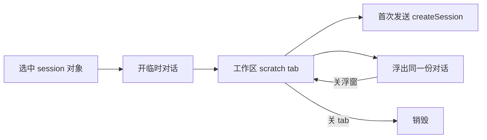

# 工作区临时对话（可悬浮）

Planned-with: Cursor Grok 4.6

Status: design

Suggested-Impl-Model: 实施计划宜拆两档。数据模型、入口接线、session 延迟创建用 Composer 2.5 档；浮层卡片视觉与 WorkPanel tab 交互用需要前端品味的中高档。最终 `Impl-Model` 以实际使用为准。

## Goal

在 Near 桌面端，选中当前 session 里的任意对象，都能在右侧工作区新开一张临时对话。这张对话可以浮出成可拖卡片；关掉浮窗只收回工作区 tab，不销毁。临时对话不进侧栏历史。

## Why not reuse「引用至新对话」

现有「引用至新对话」会 `addPane` 再开一格完整 `ChatPane`，窄屏会挤成 Tab，也占侧栏会话。用户要的是：主会话不动，对象在工作区继续聊，需要时再浮起来。

## Product contract

- **入口：** session 内能选中的对象都提供「开临时对话」，与「引用到当前输入」并存，不替换「引用至新对话」。
- **落点：** 打开当前窗格的工作区（若关着），新增一张 scratch tab。
- **上下文：** 选中内容作为引用或 `context_files` 注入，输入区空着，不自动代问。
- **身份：** 跟当前窗格（Machi / 分身 / 群）和当前模型走。
- **生命周期：** 第一次发送才 `createSession`。没发过的空卡关 tab 即丢。
- **历史：** 不出现在 `SessionHistoryPanel` / 侧栏会话列表。只活在工作区。
- **悬浮：** 同一份数据的第二种视图。关浮窗或「收回」都回到工作区 tab。同时只浮一张。
- **销毁：** 关 scratch tab（有消息则二次确认），或关主窗格。
- **去重：** 同一对象再开一次，复用已有 tab。
- **提升：** 需要长期聊时，提供「提到主窗格」（实施可后置，设计预留）。

## Selectable objects

| 来源 | 注入方式 | 标题示例 |
|---|---|---|
| 气泡 / 划词 | `quoted_content` | 关于这段回复 |
| 工具结果 | `quoted_content` | 关于工具结果 |
| 产物 / 改动 / 参考路径 | `context_files`（`sourcePath`） | 关于 `report.md` |
| 工作区文件预览选区 | 划词走引用；整文件走 `context_files` | 关于 `src/a.ts` |
| 终端 / 页内选区 | `quoted_content` | 关于终端选区 |
| 待办 | `quoted_content` | 关于待办 |

开卡时把快照写进 scratch 记录。之后源对象删了，上下文仍在。

## Architecture



状态挂在当前 `ChatPane` 上，不另开窗格。建议字段（名称实施时可微调）：

```ts
type ScratchChatSourceKind =
  | "message"
  | "selection"
  | "tool_result"
  | "artifact"
  | "change"
  | "reference"
  | "todo"
  | "file"
  | "terminal"
  | "browser";

type ScratchChat = {
  id: string;
  title: string;
  sourceKind: ScratchChatSourceKind;
  sourceKey: string;          // 去重：messageId / path / 选区哈希等
  quotedContent?: string;
  contextFiles?: Array<{ path: string; sourcePath?: string }>;
  sessionId: string;          // 空 = 尚未物化
  messages: Message[];
  floating: boolean;
};
```

`ChatPane` 增加 `scratchChats: ScratchChat[]`。`WorkPanelFocus` 增加 `{ kind: "scratch"; chatId: string }`。

发送复用现有 `/api/chat` + SSE，按 scratch 的 `sessionId` 隔离，禁止写回主窗格 `pane.messages`。未物化前走与「新话题」相同的 lazy `createSession`（`avatar_id` 继承当前窗格）。

工作区 tab 条与预览 / 终端 / 浏览器并列。浮出后该 tab 显示「已浮出」，内容区不双开同一会话。

## Entry points

- `ImBubble` 右键、划词浮条：在现有引用项旁加「开临时对话」。
- 工作区预览、终端、页内选区：现有「引用」旁再加一项。
- 摘要列表（产物、改动、参考、待办）：行右键或行尾动作。

点下去：`openSidePanel` 保证工作区打开，upsert scratch，`setWorkPanelFocus({ kind: "scratch", chatId })`。

## Float chrome

浮窗是应用内 overlay，不是新的 Electron 窗口。可拖标题栏。卡片含：标题、来源摘要、消息区、底部输入。关按钮 = 收回工作区。再浮另一张时，前一张先收回。

视觉对齐现有 dark / dim / light token，主体不透明，避免设置弹层那种过透明。滚动：用户在底部才跟随流式；上翻后保持位置。

## Persistence and history filter

- 重启：恢复当时还开着的 scratch tab；已物化的带 `sessionId` 与消息，未发送的可丢。
- `listSessions` / `SessionHistoryPanel` 必须按窗格 `avatar_id` **以及** scratch session id 集合二次过滤，scratch 不得混入主历史。
- 主窗格「新话题」不带走 scratch 列表；scratch 仍挂在该窗格上，直到用户关 tab。

## Error handling

- `createSession` 或发送失败：卡片内展示错误，composer 内容保留。
- 源文件已删：仍用开卡时的快照；发送时路径不可读则在卡片内报错。
- 主窗格生成中：scratch 可并行发送（独立 session），互不打断。
- 关有消息的 tab：确认后再清本地状态；已物化 session 不进历史，也不在主 UI 提供恢复（工作区外不可见即产品定义）。

## Out of scope

- Electron 独立子窗口。
- 自动把选中内容当用户问题发出。
- 改主窗格拆分或替换「引用至新对话」。
- 侧栏历史、全局搜索命中 scratch。
- 第一期必须做「提到主窗格」（只预留动作位）。

## Acceptance sketch

1. 对一条助手消息开临时对话：工作区出现 scratch tab，主会话消息不变，输入区空，引用可见。
2. 同一消息再开一次：仍是那一张 tab。
3. 浮出后主聊天仍可用；关浮窗后工作区 tab 还在，内容还在。
4. 空卡关 tab：无残留。有消息关 tab：先确认。
5. 侧栏历史在开过 scratch、发送过后仍看不到该 session。
6. 对工作区文件 / 终端选区开卡：上下文分别是文件路径与引用文本。
