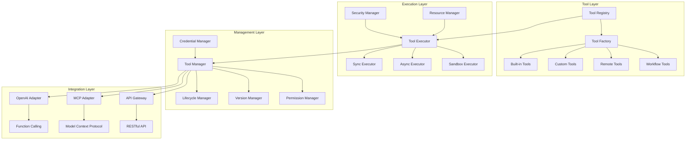

# AgenticX 工具系统升级改造规划

## 1. 愿景与目标 (Vision & Goals)

### 愿景
构建一个标准化、可扩展、企业级的工具生态系统，为AI Agent提供统一、安全、高效的能力扩展机制，使其成为AgenticX框架的核心竞争力。

### 核心目标
1. **标准化**: 建立统一的工具定义、执行、管理标准，兼容OpenAI Function Calling和MCP协议
2. **可扩展性**: 支持代码优先和配置优先两种开发模式，降低工具开发门槛
3. **企业级**: 提供完整的认证、授权、审计、监控能力，满足企业安全合规要求
4. **高性能**: 支持异步执行、并发控制、资源隔离，确保系统稳定性
5. **生态化**: 建立工具市场、共享机制，促进社区协作

## 2. 技术架构 (Technical Architecture)

## 3. 功能模块拆解 (Functional Modules Breakdown)

*   **M1: 工具核心抽象 (`agenticx.core.tool`)**: 定义工具系统的核心接口和基类
*   **M2: 工具注册与发现 (`agenticx.tools.registry`)**: 管理工具的注册、发现和元数据
*   **M3: 工具执行引擎 (`agenticx.tools.executor`)**: 提供安全、高效的工具执行环境
*   **M4: 工具类型扩展 (`agenticx.tools.types`)**: 支持多种工具类型的实现
*   **M5: 安全管理 (`agenticx.tools.security`)**: 提供认证、授权、沙箱等安全能力
*   **M6: 凭据管理 (`agenticx.tools.credentials`)**: 统一管理系统凭据和密钥
*   **M7: 协议适配 (`agenticx.tools.adapters`)**: 适配OpenAI、MCP等外部协议
*   **M8: 工具市场 (`agenticx.tools.marketplace`)**: 提供工具共享和分发能力

## 4. 开发路线图 (Development Roadmap / To-Do List)

### M1: 工具核心抽象 (`agenticx.core.tool`)
> 启发来源: Dify的标准化工具定义、OpenAI Function Calling规范

**类定义:**
- `BaseTool(ABC)`: 工具系统核心抽象基类，定义统一的工具接口规范，支持同步/异步执行模式转换
- `ToolMetadata(BaseModel)`: 工具元数据模型，包含name、description、parameters、tags、version等字段，支持OpenAI Function Calling格式
- `ToolParameter(BaseModel)`: 工具参数定义模型，支持type、description、required、default、enum等属性，集成Pydantic验证
- `ToolResult(BaseModel)`: 工具执行结果封装，包含data、error、metadata、execution_time等字段，支持结构化错误处理

**接口定义:**
- `ToolExecutor(Protocol)`: 工具执行器协议，定义execute()和aexecute()方法签名，支持多种执行策略
- `ToolValidator(Protocol)`: 工具验证器协议，定义validate_input()和validate_output()方法，确保数据一致性

**装饰器:**
- `@tool(name: str, description: str, tags: List[str])`: 工具定义装饰器，自动生成参数模式和文档字符串，支持类型推断

**关键方法:**
- `BaseTool.execute(params: Dict[str, Any]) -> ToolResult`: 同步执行工具逻辑，包含错误处理和超时控制
- `BaseTool.aexecute(params: Dict[str, Any]) -> ToolResult`: 异步执行工具逻辑，支持并发和资源限制
- `BaseTool.to_openai_schema() -> Dict[str, Any]`: 转换为OpenAI Function Calling格式，确保协议兼容性
- `BaseTool.validate_params(params: Dict[str, Any]) -> bool`: 参数验证方法，基于Pydantic模型进行类型检查

### M2: 工具注册与发现 (`agenticx.tools.registry`)
> 启发来源: Dify的工具分类管理、插件化架构

**类定义:**
- `ToolRegistry(Singleton)`: 全局工具注册表，维护工具名称到类映射，支持热加载和版本管理
- `ToolFactory(BaseFactory)`: 工具工厂类，根据工具类型和配置动态创建工具实例，支持依赖注入
- `ToolCategory(Enum)`: 工具分类枚举，定义BUILTIN、CUSTOM、REMOTE、WORKFLOW、MCP等类型
- `ToolDiscoveryService`: 工具发现服务，提供搜索、过滤、推荐功能，支持标签和元数据查询

**组件定义:**
- `ToolMetadataParser(Component)`: 元数据解析器，支持Python类、OpenAPI、YAML、JSON格式的工具定义解析
- `ToolValidator(Component)`: 工具验证器，检查工具定义的完整性和安全性，防止恶意代码注入
- `ToolIndexer(Component)`: 工具索引器，构建倒排索引支持快速搜索，缓存热门工具元数据

**关键方法:**
- `ToolRegistry.register(tool_class: Type[BaseTool], category: ToolCategory) -> bool`: 注册工具类到全局注册表
- `ToolRegistry.get(tool_name: str) -> Optional[BaseTool]`: 根据名称获取工具实例，支持版本选择
- `ToolRegistry.list(category: Optional[ToolCategory] = None) -> List[ToolMetadata]`: 列出指定类别的工具
- `ToolFactory.create(config: Dict[str, Any]) -> BaseTool`: 根据配置创建工具实例，支持自定义参数
- `ToolDiscoveryService.search(query: str, filters: Dict[str, Any]) -> List[ToolMetadata]`: 智能搜索工具

### M3: 工具执行引擎 (`agenticx.tools.executor`)
> 启发来源: Dify的工作流执行引擎、安全沙箱机制

**类定义:**
- `BaseToolExecutor(ABC)`: 工具执行器基类，定义执行生命周期管理接口，支持前置/后置处理
- `SyncToolExecutor(BaseToolExecutor)`: 同步执行器，单线程执行工具逻辑，支持超时中断和异常捕获
- `AsyncToolExecutor(BaseToolExecutor)`: 异步执行器，基于asyncio实现并发执行，支持任务队列和限流
- `SandboxExecutor(BaseToolExecutor)`: 沙箱执行器，在隔离环境中执行代码，防止系统资源滥用
- `ExecutionContext(BaseModel)`: 执行上下文模型，包含environment、resource_limits、user_context等信息

**接口定义:**
- `ResourceLimiter(Protocol)`: 资源限制器协议，定义CPU、内存、网络等资源的使用上限
- `ExecutionHook(Protocol)`: 执行钩子协议，支持执行前后插入自定义逻辑，如日志记录、性能监控

**组件定义:**
- `ResourceManager(Component)`: 资源管理器，监控和限制工具执行资源使用，防止DoS攻击
- `ExecutionMonitor(Component)`: 执行监控器，收集性能指标和错误统计，支持实时告警
- `TimeoutController(Component)`: 超时控制器，实现细粒度的超时控制，支持优雅降级

**关键方法:**
- `BaseToolExecutor.execute(tool: BaseTool, params: Dict[str, Any]) -> ToolResult`: 执行工具逻辑
- `AsyncToolExecutor.execute_batch(tools: List[BaseTool], params_list: List[Dict]) -> List[ToolResult]`: 批量执行
- `SandboxExecutor.create_isolated_env(context: ExecutionContext) -> Dict[str, Any]`: 创建隔离执行环境
- `ResourceManager.check_limits(tool_name: str, resource_usage: Dict[str, float]) -> bool`: 检查资源限制

### M4: 工具类型扩展 (`agenticx.tools.types`)
> 启发来源: Dify的多种工具类型支持、MCP协议

**类定义:**
- `BuiltInTool(BaseTool)`: 内置工具基类，提供文件操作、网络请求、数据处理等常用功能
- `CustomTool(BaseTool)`: 自定义工具基类，支持用户继承扩展，提供开发模板和最佳实践
- `RemoteTool(BaseTool)`: 远程工具基类，封装HTTP/HTTPS API调用，支持认证和重试机制
- `WorkflowTool(BaseTool)`: 工作流工具基类，组合多个工具实现复杂业务流程，支持条件分支
- `MCPTool(BaseTool)`: MCP协议工具，兼容Model Context Protocol，支持工具发现和调用
- `ToolTypeRegistry(Singleton)`: 工具类型注册器，管理不同类型工具的创建和配置

**组件定义:**
- `HTTPClient(Component)`: HTTP客户端组件，封装requests库，支持连接池、重试、超时
- `DataTransformer(Component)`: 数据转换器组件，支持JSON、XML、CSV等格式的相互转换
- `AuthHandler(Component)`: 认证处理器组件，支持API Key、OAuth、JWT等多种认证方式

**关键方法:**
- `RemoteTool.build_request(params: Dict[str, Any]) -> Request`: 构建HTTP请求对象
- `RemoteTool.parse_response(response: Response) -> Any`: 解析API响应数据
- `WorkflowTool.validate_workflow(definition: Dict[str, Any]) -> bool`: 验证工作流定义的有效性
- `MCPTool.to_mcp_schema() -> Dict[str, Any]`: 生成MCP协议兼容的工具模式

### M5: 安全管理 (`agenticx.tools.security`)
> 启发来源: Dify的认证授权机制、企业安全要求

**类定义:**
- `SecurityManager(Singleton)`: 安全管理器，统一处理认证授权，支持RBAC和ABAC模型
- `PermissionChecker(ABC)`: 权限检查器抽象类，定义权限验证接口，支持自定义权限策略
- `RateLimiter(BaseRateLimiter)`: 速率限制器，基于令牌桶算法，防止工具被恶意调用
- `SecurityPolicy(BaseModel)`: 安全策略模型，定义访问控制规则、数据脱敏规则、审计要求
- `AuditLog(BaseModel)`: 审计日志模型，记录工具使用情况，支持合规报告生成

**接口定义:**
- `AuthenticationProvider(Protocol)`: 认证提供者协议，支持LDAP、OAuth、SAML等认证方式
- `AuthorizationEngine(Protocol)`: 授权引擎协议，支持基于角色、属性、规则的授权

**组件定义:**
- `InputSanitizer(Component)`: 输入清洗器，防止SQL注入、XSS、命令注入等攻击
- `OutputFilter(Component)`: 输出过滤器，根据安全策略过滤敏感信息，支持数据脱敏
- `SecurityScanner(Component)`: 安全扫描器，静态分析工具代码，检测潜在安全风险

**关键方法:**
- `SecurityManager.authenticate(credentials: Dict[str, Any]) -> AuthResult`: 用户身份认证
- `SecurityManager.authorize(user: User, resource: str, action: str) -> bool`: 权限授权检查
- `RateLimiter.check_rate(tool_name: str, user_id: str) -> bool`: 检查速率限制
- `InputSanitizer.sanitize_input(input_data: Any) -> Any`: 清洗输入数据
- `AuditLog.log_execution(tool_name: str, user_id: str, result: ToolResult) -> None`: 记录执行日志

### M6: 凭据管理 (`agenticx.tools.credentials`)
> 启发来源: Dify的API密钥管理、企业凭据系统

**类定义:**
- `CredentialManager(Singleton)`: 凭据管理器，安全存储和管理API密钥、证书等敏感信息
- `CredentialProvider(ABC)`: 凭据提供者抽象类，支持多种后端存储（数据库、KMS、Vault）
- `EncryptionService`: 加密服务，使用AES-256加密敏感数据，支持密钥轮换
- `AccessToken(BaseModel)`: 访问令牌模型，包含token、expires_at、scopes等字段
- `CredentialPolicy(BaseModel)`: 凭据策略模型，定义过期时间、权限范围、轮换策略

**接口定义:**
- `SecretStorage(Protocol)`: 密钥存储协议，支持HSM、KMS、数据库等不同后端
- `TokenRefresher(Protocol)`: 令牌刷新器协议，支持OAuth2.0等协议的自动刷新

**组件定义:**
- `KeyRotationManager(Component)`: 密钥轮换管理器，定期更新加密密钥，支持零停机轮换
- `CredentialValidator(Component)`: 凭据验证器，检查凭据格式和有效性，防止弱密钥
- `AuditTrail(Component)`: 审计跟踪组件，记录凭据访问和修改历史，支持合规审计

**关键方法:**
- `CredentialManager.store(key: str, value: str, policy: CredentialPolicy) -> bool`: 安全存储凭据
- `CredentialManager.retrieve(key: str) -> Optional[str]`: 检索解密的凭据信息
- `EncryptionService.encrypt(plain_text: str) -> str`: 加密敏感数据
- `EncryptionService.decrypt(cipher_text: str) -> str`: 解密数据
- `AccessToken.is_expired() -> bool`: 检查访问令牌是否过期
- `KeyRotationManager.rotate_keys() -> bool`: 执行密钥轮换操作

### M7: 协议适配 (`agenticx.tools.adapters`)
> 启发来源: Dify的API扩展、OpenAI Function Calling

**类定义:**
- `OpenAIAdapter(BaseAdapter)`: OpenAI函数调用适配器，将工具转换为Function Calling格式
- `MCPAdapter(BaseAdapter)`: Model Context Protocol适配器，支持MCP协议的工具发现
- `RESTfulAdapter(BaseAdapter)`: RESTful API适配器，将工具封装为HTTP API端点
- `GraphQLAdapter(BaseAdapter)`: GraphQL适配器，支持GraphQL查询和变更操作
- `ProtocolConverter`: 协议转换器，实现不同协议间的数据格式转换
- `SchemaGenerator`: 模式生成器，自动生成OpenAPI、JSON Schema等规范文档

**接口定义:**
- `ProtocolAdapter(Protocol)`: 协议适配器协议，定义适配器必须实现的方法
- `SchemaProvider(Protocol)`: 模式提供者协议，支持动态生成和更新API模式

**组件定义:**
- `HTTPRequestBuilder(Component)`: HTTP请求构建器，根据工具参数构建标准HTTP请求
- `ResponseParser(Component)`: 响应解析器，将HTTP响应解析为工具结果格式
- `SchemaValidator(Component)`: 模式验证器，验证请求和响应数据符合API规范

**关键方法:**
- `OpenAIAdapter.convert_tool(tool: BaseTool) -> Dict[str, Any]`: 转换为OpenAI格式
- `MCPAdapter.discover_tools() -> List[Dict[str, Any]]`: 发现可用工具列表
- `RESTfulAdapter.create_endpoint(tool: BaseTool) -> str`: 创建RESTful API端点
- `ProtocolConverter.convert_schema(source_format: str, target_format: str) -> Dict`: 转换模式格式
- `SchemaGenerator.generate_openapi(tools: List[BaseTool]) -> Dict[str, Any]`: 生成OpenAPI文档

### M8: 工具市场 (`agenticx.tools.marketplace`)
> 启发来源: Dify的工具生态系统、开源社区模式

**类定义:**
- `MarketplaceClient`: 工具市场客户端，提供浏览、搜索、下载工具的功能
- `PackageManager`: 包管理器，支持工具的安装、更新、卸载和依赖管理
- `ToolPublisher`: 工具发布器，帮助开发者打包和发布工具到市场
- `ToolPackage(BaseModel)`: 工具包模型，包含工具代码、元数据、依赖和文档
- `CommunityManager`: 社区管理器，处理用户反馈、审核发布、促进协作

**接口定义:**
- `RepositoryProvider(Protocol)`: 仓库提供者协议，支持Git、Docker Registry等不同仓库
- `VerificationService(Protocol)`: 验证服务协议，确保工具质量和安全性

**组件定义:**
- `DependencyResolver(Component)`: 依赖解析器，自动解析和安装工具依赖
- `VersionComparator(Component)`: 版本比较器，支持语义化版本比较和兼容性检查
- `RatingCalculator(Component)`: 评分计算器，基于用户反馈计算工具质量和信誉度

**关键方法:**
- `MarketplaceClient.search_tools(query: str, category: str) -> List[ToolMetadata]`: 搜索工具
- `PackageManager.install_tool(tool_id: str, version: str) -> bool`: 安装指定版本的工具
- `ToolPublisher.publish_tool(tool_package: ToolPackage) -> str`: 发布工具到市场
- `CommunityManager.submit_review(tool_id: str, rating: int, comment: str) -> bool`: 提交工具评价
- `DependencyResolver.resolve_dependencies(tool_package: ToolPackage) -> List[str]`: 解析依赖关系

## 5. 实施计划 (Implementation Plan)

### 第一阶段：核心重构 (2-3周)
1. 重构 `BaseTool` 基类，统一接口设计
2. 实现 `ToolRegistry` 和 `ToolFactory`
3. 更新现有工具实现，适配新接口

### 第二阶段：安全增强 (2周)
1. 实现 `SecurityManager` 和权限控制
2. 开发 `SandboxExecutor` 和输入验证
3. 集成审计日志和监控

### 第三阶段：协议适配 (2周)
1. 实现 `OpenAIAdapter` 和 `MCPAdapter`
2. 开发 `SchemaGenerator` 和协议转换
3. 测试与外部系统的兼容性

### 第四阶段：生态建设 (3-4周)
1. 开发工具市场和管理界面
2. 实现包管理和发布机制
3. 建立社区协作流程

### 第五阶段：企业级功能 (2-3周)
1. 完善凭据管理和轮换机制
2. 增强监控告警和性能优化
3. 文档完善和示例开发

## 6. 风险与应对 (Risks & Mitigation)

### 技术风险
- **兼容性风险**: 新旧接口兼容问题 → 提供迁移指南和兼容性层
- **性能风险**: 安全检查影响性能 → 异步处理和缓存优化
- **安全风险**: 沙箱逃逸可能性 → 多层防护和定期安全审计

### 项目风险
- **进度风险**: 功能复杂度超预期 → 分阶段交付，优先核心功能
- **资源风险**: 开发人力不足 → 社区协作和外部贡献
- **维护风险**: 长期维护成本高 → 模块化设计和自动化测试

## 7. 成功指标 (Success Metrics)

- **功能性**: 支持10+种内置工具，兼容OpenAI和MCP协议
- **安全性**: 通过第三方安全审计，零高危漏洞
- **性能**: 工具执行延迟<100ms，支持1000+并发
- **易用性**: 工具开发时间减少50%，文档覆盖率100%
- **生态**: 社区贡献工具50+，月活跃用户1000+