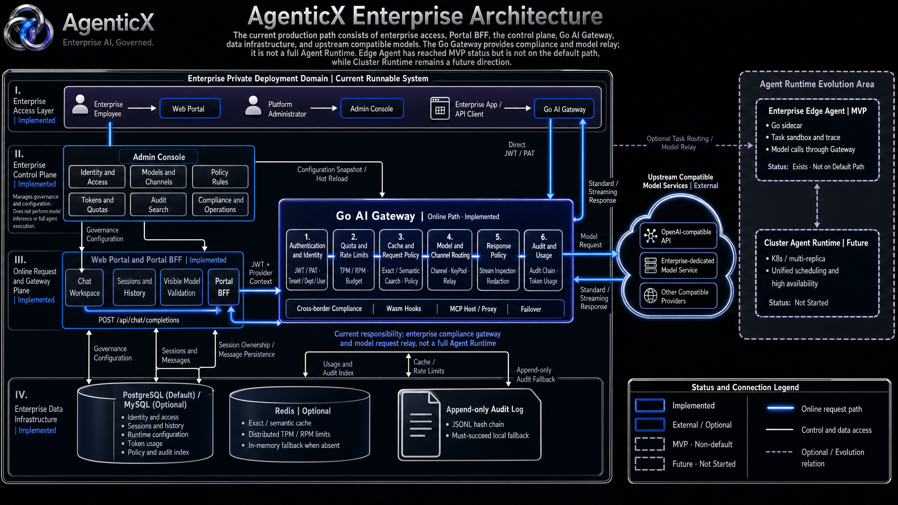

# AgenticX Enterprise

**Language / 语言**: [English](README.md) | [中文](README_ZN.md)

> Integrated enterprise LLM application platform — Web Portal · Admin Console · AI Gateway

## Architecture

<div align="center">

</div>

The current production path consists of the enterprise access layer, Portal BFF, control plane, Go AI Gateway, data infrastructure, and upstream compatible models. The Go Gateway provides compliance and model relay; it is **not a full Agent Runtime**. Edge Agent has reached MVP but is not on the default path; Cluster Runtime remains a future direction.

### Repository layout

```
enterprise/
├── apps/                      Deployable apps
│   ├── web-portal/            #  Employee portal (Next.js)
│   ├── admin-console/         #  Admin console (Next.js)
│   └── gateway/               #  AI Gateway (Go)
│
├── features/                  Business domains (primary reuse units for customer projects)
│   ├── iam/                   Identity · tenant · dept · roles
│   ├── chat/                  Chat workspace
│   ├── model-service/         Model service management
│   ├── knowledge-base/        Knowledge base
│   ├── tools-mcp/             Tools · MCP
│   ├── agents/                Agents · avatars
│   ├── metering/              Metering · multi-dimension query
│   ├── audit/                 Audit logs
│   ├── policy/                Policy / sensitive-rule config
│   └── settings/              Settings panels
│
├── packages/                  Shared packages
│   ├── ui/                    shadcn components + theme
│   ├── branding/              White-label components
│   ├── auth/                  Auth abstractions (Supabase / LDAP / SSO / password)
│   ├── db-schema/             Drizzle schema (multi-tenant)
│   ├── core-api/              Type contracts
│   ├── policy-engine/         JS-side policy engine
│   ├── sdk-ts/                TypeScript client SDK
│   ├── sdk-py/                Python SDK
│   ├── config/                Config loader
│   └── telemetry/             Telemetry · audit reporting
│
├── plugins/                   Runtime plugins
│   ├── moderation-pii-baseline/
│   ├── moderation-finance/
│   ├── moderation-medical/
│   ├── tool-watermark/
│   ├── tool-doc-review/
│   └── theme-default/
│
├── assets/                    Architecture diagrams and shared media
│
├── deploy/
│   ├── docker-compose/
│   └── helm/
│
└── docs/
```

## Internationalization (i18n)

admin-console and web-portal support **Chinese / English** switching (`NEXT_LOCALE` cookie, default `zh`). Copy lives in each app’s `messages/{zh,en}.json`. See [docs/architecture/i18n.md](./docs/architecture/i18n.md).

```bash
# Dual-locale × dual-theme visual captures (start-dev.sh first)
pnpm -C enterprise visual-capture:i18n
```

## Quick start

### Daily workflow (three commands)

```bash
cd enterprise
bash scripts/bootstrap.sh     # First time / when env or secrets change (PostgreSQL by default)
bash scripts/start-dev.sh     # Daily start
```

MySQL 8.0 stack:

```bash
bash scripts/bootstrap.sh --db=mysql
# or
bash scripts/start-dev-with-infra.sh --db=mysql
bash scripts/start-dev.sh
```

Dialect notes and cutover: [docs/runbooks/mysql-deployment.md](./docs/runbooks/mysql-deployment.md), [docs/database/cutover-runbook.md](./docs/database/cutover-runbook.md).

Once up:

- Portal: <http://localhost:3000>
- Admin: <http://localhost:3001>
- Gateway health: <http://localhost:8088/healthz>

Login accounts (passwords set interactively by `bootstrap.sh`, stored in `.env.local`):

- Admin: `owner@agenticx.local` + `ADMIN_CONSOLE_LOGIN_PASSWORD`
- Portal: `owner@agenticx.local` + `AUTH_DEV_OWNER_PASSWORD`
  - `staff@agenticx.local` returns `Invalid credentials` by default — that user is not in the seed; create it in admin or via signup first

> Default `owner` already has `workspace:chat`. Older seed environments may auto-heal this on HMR; no manual DB edit is usually required.

### Enable OIDC SSO

OIDC SSO is supported for portal + admin. See:

- `docs/runbooks/sso-oidc-setup.md`
- `docs/runbooks/sso-acceptance-checklist.md`

### Real model chat (recommended · admin GUI)

Admin → Platform config → **Model services**:

1. “+ Add provider” — pick a template (OpenAI / DeepSeek / Moonshot / Bailian / Zhipu / MiniMax / Qianfan / Volcengine / Ollama, etc.) or add any OpenAI-compatible upstream
2. Enter the API key, click **Test**, then save
3. Enable models in the model list
4. Admin → IAM → **Users**: open a user, assign visible models (auto-save)
5. Sign in to the portal as that user — the model picker shows only assigned models; sends hit the real upstream
6. The top token chip shows cumulative ↑input ↓output Σtotal

> **Runtime config** (model services / visible models / token quotas) uses the business DB as the single source of truth (`enterprise_runtime_*`; PostgreSQL or MySQL via `DATABASE_DIALECT`).
> If local `enterprise/.runtime/admin/{providers,user-models,quotas}.json` still exists, `bootstrap.sh` / `start-dev.sh` and `pnpm migrate:legacy-runtime` import them **idempotently**; afterward admin / portal read only the DB.
> The Gateway rereads provider config every 5 seconds — admin changes take effect within seconds without restart.

### Real model chat (fallback · environment variables)

Providers without an admin-configured key fall back to env vars (`<PROVIDER>_API_KEY`):

```bash
# Append to enterprise/.env.local (not needed if admin GUI already has keys)
DEEPSEEK_API_KEY=sk-...
LLM_API_KEY=sk-...   # generic fallback
```

Key resolution and production notes: `apps/gateway/README.md`.

### `start-dev.sh` flags

| Command | Behavior |
|---|---|
| `bash scripts/start-dev.sh` | Default: web-portal + admin-console only |
| `bash scripts/start-dev.sh --all` | Also start `customers/*` (e.g. `:3100/:3101`) |
| `bash scripts/start-dev.sh --ui=stream` | Disable Turbo TUI; plain logs (single Ctrl+C exits) |
| `bash scripts/start-dev.sh --help` | Help |

> Turbo TUI tip: in default `tui` mode use `↑/↓` to switch tasks, `/` to search, `q` to quit. If Ctrl+C feels stuck, press `Esc` then `q`, or use `--ui=stream`.

### Non-interactive server bootstrap

```bash
export DATABASE_URL='postgresql://...'
export AUTH_JWT_PRIVATE_KEY="$(cat /secure/path/auth_private.pem)"
export AUTH_JWT_PUBLIC_KEY="$(cat /secure/path/auth_public.pem)"
export ADMIN_CONSOLE_LOGIN_PASSWORD='...'
export ADMIN_CONSOLE_SESSION_SECRET='...'
bash scripts/bootstrap.sh --mode=server
```

What `bootstrap.sh` does:

1. Preflight: node / pnpm / go / docker / openssl
2. Write `enterprise/.env.local` (chmod 600, gitignored)
3. Prompt for missing passwords (strength-checked); `--mode=server` fails instead of prompting
4. `pnpm install`
5. Start postgres + redis (local); skip in server mode
6. `db:migrate` + `db:seed`
7. `migrate:legacy-runtime` (idempotent import of `.runtime/admin/*.json`)
8. Generate RSA-2048 JWT keypair under `enterprise/.local-secrets/` (local)

Common options:

- `--reset-db`: `docker compose down -v` then recreate (dev only)
- `--skip-docker`: use an existing local Postgres, skip compose
- `--mode=server`: non-interactive; all secrets must come from the environment

### Direct pnpm (when you know what you are doing)

```bash
# From enterprise/, inject env yourself
set -a; source .env.local; set +a
# .env.local stores *_FILE paths — expand PEM contents manually
export AUTH_JWT_PRIVATE_KEY="$(cat "$AUTH_JWT_PRIVATE_KEY_FILE")"
export AUTH_JWT_PUBLIC_KEY="$(cat "$AUTH_JWT_PUBLIC_KEY_FILE")"
pnpm install
pnpm exec turbo run dev \
  --filter=@agenticx/app-web-portal \
  --filter=@agenticx/app-admin-console
```

## Product positioning

- **Moat**: Desktop (Near) + admin console + AI Gateway working together
- **Differentiation**: Hybrid “centralized cloud control + on-device security loop”
- **Business model**: Open-source trunk + customer-specific customization in private `customers/*` repos

## Reusing enterprise modules in customer projects

See `docs/guides/2026-04-21-enterprise-customers-collaboration.md`

## Related docs

Full index: **[docs/README.md](./docs/README.md)**

| Topic | Path |
|---|---|
| Architecture overview | [docs/architecture/overview.md](./docs/architecture/overview.md) |
| Data flow | [docs/architecture/data-flow.md](./docs/architecture/data-flow.md) |
| API contracts | [docs/api/README.md](./docs/api/README.md) |
| Database schema | [docs/database/schema.md](./docs/database/schema.md) |
| RBAC scopes | [docs/rbac/scopes.md](./docs/rbac/scopes.md) |
| Gateway | [docs/gateway/overview.md](./docs/gateway/overview.md) |
| Plugin protocol | [docs/plugin-protocol/README.md](./docs/plugin-protocol/README.md) |
| Features / Packages / Apps | [docs/features/](./docs/features/) · [docs/packages/](./docs/packages/) · [docs/apps/](./docs/apps/) |
| Local dev / troubleshooting | [docs/development/local-dev.md](./docs/development/local-dev.md) · [docs/development/troubleshooting.md](./docs/development/troubleshooting.md) |
| Testing | [docs/testing/README.md](./docs/testing/README.md) |
| Deployment | [docs/deployment/README.md](./docs/deployment/README.md) |
| Customer collaboration | [docs/guides/enterprise-customers-collaboration.md](./docs/guides/enterprise-customers-collaboration.md) |
| Product architecture (main repo) | [../docs/plans/2026-04-21-agenticx-enterprise-architecture.md](../docs/plans/2026-04-21-agenticx-enterprise-architecture.md) |

## License

Apache 2.0 (same as the AgenticX main repository)
