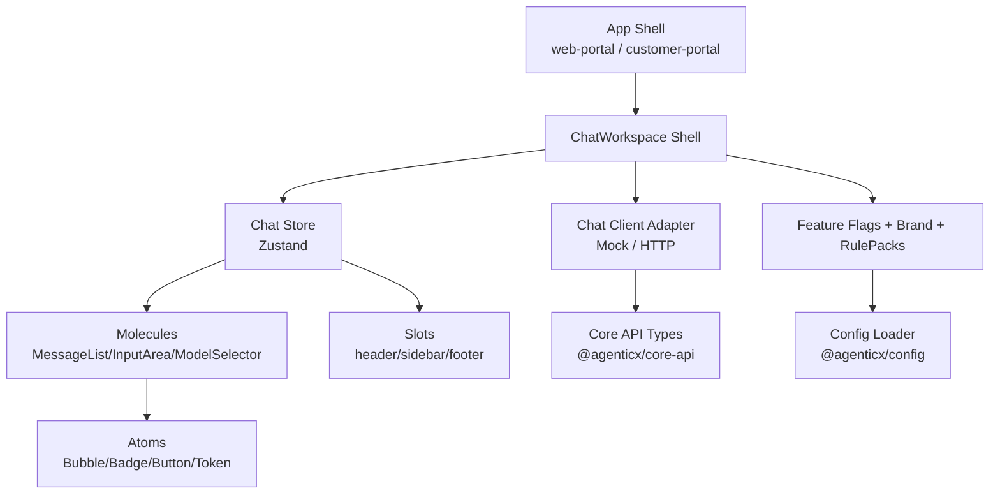
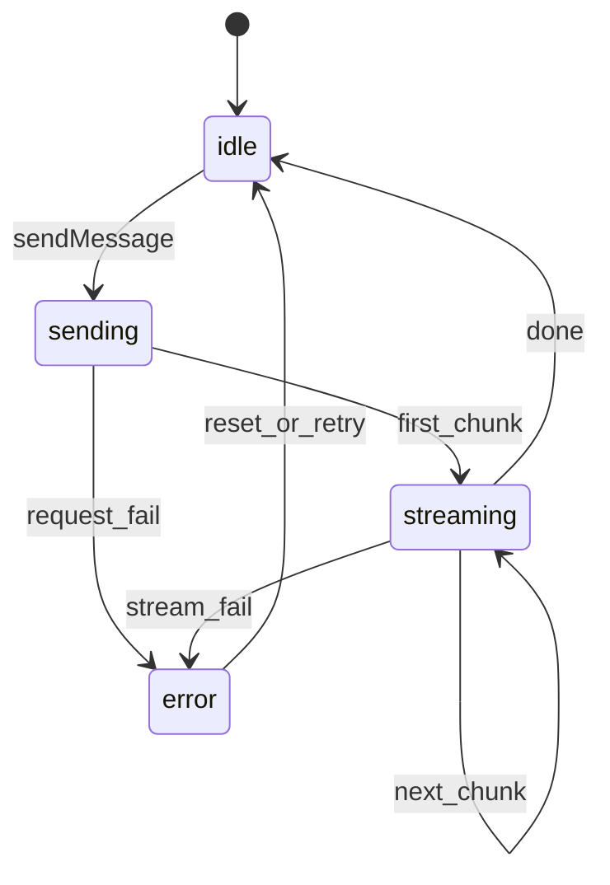

# AgenticX Enterprise Chat 设计说明（W1-T01）

> 文档目标：完成 `AgenticX-Website` 既有对话前台能力盘点，并定义 `@agenticx/feature-chat` 的新架构。
> 约束：只借鉴思路，不复制实现代码；本文件作为 W1-W4 的契约基线。
> 范围：`enterprise/features/chat`，不包含客户专属实现。

---

## 1. 输入材料与盘点范围

本次盘点基于以下文件：

1. `AgenticX-Website/src/components/agents/ChatWorkspace.tsx`
2. `AgenticX-Website/src/components/agents/ModelServicePanel.tsx`
3. `AgenticX-Website/src/components/agents/FeedbackDialog.tsx`
4. `AgenticX-Website/src/components/agents/settings/SettingsPanel.tsx`
5. `AgenticX-Website/src/components/agents/settings/tabs/ChatSettingsTab.tsx`
6. `AgenticX-Website/src/components/agents/settings/tabs/WebSearchTab.tsx`
7. `AgenticX-Website/src/components/agents/settings/tabs/DefaultModelsTab.tsx`
8. `AgenticX-Website/src/components/agents/settings/tabs/DocumentParserTab.tsx`
9. `AgenticX-Website/src/components/agents/settings/tabs/ModelProviderTab.tsx`
10. `AgenticX-Website/src/components/agents/settings/tabs/GeneralSettingsTab.tsx`

---

## 2. 现状职责拆解（Website）

### 2.1 ChatWorkspace

主要职责：

- 对话输入主区域渲染（logo、标题、输入框、模型下拉、发送按钮）。
- 输入态处理（草稿、自动增高、长文本转附件、粘贴提示）。
- 轻量功能开关（WebSearch、DeepResearch chip）。
- 局部状态管理（全量 `useState` + `useEffect`）。
- 语言文案通过 `useAgentsLocale` 注入。

可见耦合点：

- UI 与状态管理耦合：组件体积较大，交互状态和视图混合。
- 模型元信息内嵌：`MODEL_IDS` 与 `MODEL_ICONS` 写死在组件。
- 输入规则内嵌：字节阈值、通知时长、附件命名策略固定在视图层。
- 发送链路未解耦：`onClick` 中没有客户端抽象（后续需接 SDK）。

### 2.2 ModelServicePanel

主要职责：

- 供应商模型列表展示与搜索。
- 启用开关状态维护。
- API Keys 折叠区占位。

可见耦合点：

- 模型列表为静态数组，缺少外部数据源接口。
- 启用状态仅在本地状态中存在，无持久化契约。
- 功能与“设置页模型配置”存在潜在重复语义。

### 2.3 FeedbackDialog

主要职责：

- 收集用户反馈文本。
- 支持图片上传与粘贴图片预览。
- 提交后 toast 提示并重置状态。

可见耦合点：

- 对话反馈通道未抽象（仅 UI 成功提示，未接 API）。
- 预览 URL 生命周期管理位于组件内部。
- 反馈文本校验规则较轻（仅非空）。

### 2.4 SettingsPanel + Tabs

主要职责：

- 左侧导航切换不同设置 tab。
- 各 tab 内进行模型、搜索、解析、聊天、通用参数配置。
- 通过 locale context 提供中英文标签。

可见耦合点：

- 各 tab 大量本地状态，尚未统一沉淀到配置层。
- 有效配置项与纯视觉占位项混合，难以识别“真正可生效参数”。
- 与未来企业版 IAM/租户配置关系未建立（目前单用户视角）。

---

## 3. 现状状态管理与数据流结论

### 3.1 Zustand / Context / SWR 使用结论

基于本次盘点文件，结论如下：

- Zustand：**未在盘点文件中直接使用**。
- Context：**已使用**（`useAgentsLocale`、主题 hook 等）。
- SWR/React Query：**未在盘点文件中直接使用**。
- 核心状态来源：`useState` 为主，组件内状态占主导。

这意味着：

- 当前 Website 对话前台是“局部交互优先”的实现风格。
- 缺少“可跨页面/跨壳复用”的统一 store 与 API 客户端协议层。
- 正好适合本期在 `feature-chat` 做一次架构升维（分层 + 契约化）。

---

## 4. 现状问题与风险清单

1. **视图与行为耦合高**：一个组件处理输入、上传、模型选择、通知等多职责。
2. **业务契约不稳定**：消息结构、会话结构、错误结构尚未冻结。
3. **品牌不可插拔**：颜色/文案/图标存在局部硬编码。
4. **客户端不可替换**：没有 `ChatClient` 抽象，W3 网关接入风险高。
5. **扩展插槽不足**：缺少 `slots` 契约，不利于客户层按需插入 UI。
6. **配置项生效路径不清**：设置页状态与运行时行为未严格绑定。
7. **测试边界模糊**：当前交互细节较多，但缺少可验证的状态机建模。

---

## 5. 新架构目标（enterprise/features/chat）

目标定义：

- 与 Website 在“体验方向”保持一致，但实现完全自研。
- 以“壳层组装 + 领域状态 + 纯展示组件 + 客户端适配器”分层。
- 通过 props 显式注入品牌、能力开关、规则包、客户端和插槽。
- W1 冻结核心契约，W2-W4 只做向后兼容扩展。

非目标：

- 本期不引入客户专属字符串或业务常量。
- 本期不把 IAM、审计、计量逻辑直接耦入聊天视图层。
- 本期不复刻 Website 的具体视觉稿实现细节。

---

## 6. 新架构分层设计



分层说明：

- Shell 层：只负责拼装、依赖注入、布局和路由语义。
- Store 层：统一状态与动作，屏蔽视图细节。
- Molecules 层：封装中粒度交互，不直接访问基础设施。
- Atoms 层：纯渲染单元，可被多 feature 复用。
- Client Adapter 层：隔离网关协议差异，支持 mock 与真实实现切换。

---

## 7. 组件边界与职责

### 7.1 ChatWorkspace（Shell）

职责：

- 注入 `brand/features/rulePacks/client/slots`。
- 挂载 `ChatStoreProvider`（或直接使用 scoped store）。
- 组织三栏布局与可选区域。
- 监听路由级事件（如登录态变化）并触发 store 初始化。

不做：

- 不直接拼接 SSE 协议。
- 不包含具体正则拦截逻辑（由网关/策略层负责）。
- 不持有 API 请求细节。

### 7.2 Store（领域状态）

最小状态：

- `sessions`
- `activeSessionId`
- `messages`
- `status`（idle/sending/streaming/error）
- `activeModel`
- `interceptNotice`（可选）

核心动作：

- `sendMessage`
- `cancel`
- `switchModel`
- `appendStreamChunk`
- `setInterceptNotice`
- `resetSession`

### 7.3 Molecules

- `MessageList`：只消费序列化 message 列表，支持虚拟滚动。
- `InputArea`：处理键盘行为（Enter / Shift+Enter）与发送触发。
- `ModelSelector`：模型切换与能力 badge 展示。
- `ReasoningBlock`：推理块折叠/展开占位。
- `ToolCallCard`：工具调用占位（默认折叠）。

### 7.4 Atoms

- `UserBubble`
- `AssistantBubble`
- `StatusBadge`
- `InlineNotice`
- `IconTextTag`

---

## 8. Props 契约（W1 冻结）

| Props | 类型 | 必填 | 来源 | 作用 |
|---|---|---|---|---|
| `brand` | `BrandConfig` | 是 | `@agenticx/config` | 品牌色、logo、文案偏好 |
| `features` | `FeatureFlags` | 是 | `@agenticx/config` | 能力开关（如 web_search） |
| `rulePacks` | `RulePackMeta[]` | 否 | 网关/配置 | 用于合规提示展示 |
| `client` | `ChatClient` | 是 | `@agenticx/sdk-ts` | 消息发送/流式接收/取消 |
| `slots.header` | `ReactNode` | 否 | App Shell | 自定义顶部区 |
| `slots.sidebar` | `ReactNode` | 否 | App Shell | 自定义侧栏 |
| `slots.footer` | `ReactNode` | 否 | App Shell | 自定义底部区 |
| `onError` | `(err)=>void` | 否 | App Shell | 全局异常上报 |
| `onEvent` | `(event)=>void` | 否 | App Shell | 行为埋点或调试 |

契约规则：

- `brand`、`features`、`client` 为最小运行集。
- `slots` 仅注入视图，不反向写 store。
- 任何客户特有字段不得进入通用 props。

---

## 9. 状态模型（State Machine）



状态约束：

- 任一时刻仅允许一个活跃发送任务绑定 `activeSessionId`。
- `cancel` 只能在 `sending/streaming` 执行。
- `error` 状态必须携带可读 message 与错误码（若有）。

---

## 10. 可扩展点设计

1. **Client 可替换**
   - W1：`MockChatClient`
   - W3：`HttpChatClient`（接 gateway）

2. **Slots 可扩展**
   - 支持 portal 注入公告、合规跳转、快捷工具入口。

3. **规则提示可扩展**
   - `rulePacks` 可用于“命中规则说明”映射，不把规则引擎放前端。

4. **消息渲染可扩展**
   - `MessageRendererRegistry` 预留：未来可挂多模态消息卡片。

5. **主题可扩展**
   - 品牌色通过 token 注入，避免组件硬编码客户色。

---

## 11. 与 W2-W4 的接口对齐

### 11.1 与 W2（Auth/IAM）

- Chat shell 通过上层注入 `auth context`，不内置登录逻辑。
- 消息发送时可透传用户与租户标识（由 client 层完成）。

### 11.2 与 W3（Gateway/Policy）

- `ChatClient` 统一接收 `9xxxx` 拦截错误并映射到 `interceptNotice`。
- 视图仅负责展示“被拦截原因”，不自行判定是否违规。

### 11.3 与 W4（Audit/Metering）

- 前端只消费可展示的审计摘要，不持有原始敏感内容。
- 消耗统计展示由 admin 侧 feature 完成，不反向耦合聊天核心。

---

## 12. 目录规划（feature-chat）

```text
enterprise/features/chat/
├── docs/
│   └── design.md
├── src/
│   ├── ChatWorkspace.tsx
│   ├── store.ts
│   ├── components/
│   │   ├── molecules/
│   │   │   ├── MessageList.tsx
│   │   │   ├── InputArea.tsx
│   │   │   └── ModelSelector.tsx
│   │   └── atoms/
│   │       ├── UserBubble.tsx
│   │       ├── AssistantBubble.tsx
│   │       ├── ReasoningBlock.tsx
│   │       └── ToolCallCard.tsx
│   ├── types.ts
│   └── index.ts
└── README.md
```

---

## 13. 测试策略（W1 先行）

最小测试集合：

- store 行为测试：
  - `sendMessage` 状态切换（idle -> sending -> streaming -> idle）
  - `cancel` 行为中断
  - `switchModel` 持久化逻辑
- InputArea 交互测试：
  - Enter 发送
  - Shift+Enter 换行
- ModelSelector 测试：
  - 切换模型后触发 action

测试原则：

- 先测行为，再补 UI 快照。
- 不测试实现细节（如内部 hook 调用次数）。

---

## 14. 零代码复制声明（强约束）

本方案借鉴了 Website 的以下“思路”：

1. 对话输入区 + 模型选择 + 发送按钮的交互组合方式。
2. 设置页分 tab 的信息架构组织方式。
3. 反馈弹窗支持文本与图片附件的产品方向。
4. 通过 locale context 管理中英文文案的模式。

本方案明确不复制：

1. Website 任意现有组件的源码、样式类名组合、事件实现。
2. Website 的常量定义、状态变量命名、局部函数实现。
3. Website 的具体视觉稿细节与资源文件。

执行措施：

- 组件全部在 `enterprise/features/chat` 与 `enterprise/packages/ui` 重建。
- 核心交互先写测试，再写最小实现。
- 代码 review 中以“语义相似但实现独立”为准绳。

---

## 15. 完成定义（DoD）

`W1-T01` 认为完成的标准：

- 已形成可读、可执行的架构设计文档。
- 文档覆盖现状职责、耦合点、新架构、props、状态机、扩展点。
- 文档明确“借鉴边界”和“零代码复制”声明。
- 文档可直接作为 `W1-T02` 到 `W1-T11` 的开发依据。

---

## 16. 后续任务映射

- `W1-T02`：根据本文分层，先补 atoms 依赖的 UI 子集。
- `W1-T03`：实现 `brand/features` 的加载与校验。
- `W1-T04`：把 `client` 抽象落到 `sdk-ts`。
- `W1-T05`：冻结 `core-api` 聊天契约。
- `W1-T06~T08`：按本设计落地 store + molecules + 主题联动。
- `W1-T09~T11`：由 app 壳注入 brand/features/client，完成双 portal 联调。

---

## 17. 备注

- 本文是 W1 第一阶段设计基线，若出现需求变更，需记录 ADR 或 design addendum。
- 若后续发现与安全基线冲突（例如敏感信息展示），以 `enterprise/SECURITY.md` 为更高优先级。

