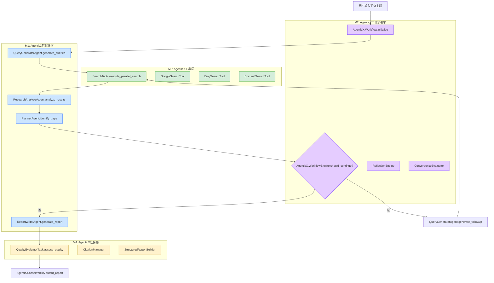

# AgenticX-for-DeepSearch: 基于AgenticX框架的多轮反思研究智能体

## 1. 愿景与目标 (Vision & Goals)

**项目定位:**
本项目是一个基于 **AgenticX 统一多智能体框架** 构建的**高级示例应用 (Advanced Example Application)**，严格遵循 AgenticX 的核心抽象、工具系统、工作流引擎和多智能体协作模式。

**项目愿景:**
构建一个智能化的深度研究系统，通过多轮反思和迭代搜索，模拟人类专家的研究思维过程。系统基于 **AgenticX M8.5 多智能体协作框架** 的反思模式，能够自主识别知识空白、生成针对性查询、整合多源信息，并最终输出高质量的结构化研究报告。

**核心目标:**
*   **G1: 基于AgenticX的智能体协作 (M1):** 基于 `agenticx.core.Agent` 和 `agenticx.collaboration` 实现专业化智能体团队，包括查询生成、研究分析、报告撰写和规划决策智能体。
*   **G2: 基于AgenticX的工作流编排 (M2):** 基于 `agenticx.core.Workflow` 和 `agenticx.core.workflow_engine` 构建多轮反思循环工作流，支持知识空白识别、搜索策略调整和收敛条件判断。
*   **G3: 基于AgenticX的工具集成 (M3):** 基于 `agenticx.tools.BaseTool` 集成多种搜索工具（Google、Bing、博查AI），提供统一的信息获取接口和结果标准化处理。
*   **G4: 基于AgenticX的报告生成 (M4):** 基于 `agenticx.core.Task` 和 LLM 服务实现报告生成系统，支持引用管理、结构化输出和质量评估。
*   **G5: 基于AgenticX的交互体验 (M5):** 基于 `agenticx.observability` 提供用户友好的交互界面，支持研究过程可视化、实时反馈和人工干预。

## 2. 技术架构 (Technical Architecture)

### 2.1 基于AgenticX框架的整体架构设计

```
┌─────────────────────────────────────────────────────────────┐
│           AgenticX-for-DeepSearch (基于AgenticX框架)        │
├─────────────────────────────────────────────────────────────┤
│  M5: 基于agenticx.observability的交互体验层                 │
│  ┌─────────────────┐  ┌─────────────────┐  ┌─────────────┐ │
│  │  CLI Interface  │  │  Web Interface  │  │  API Server │ │
│  │ (AgenticX CLI)  │  │(AgenticX WebUI) │  │(AgenticX API│ │
│  └─────────────────┘  └─────────────────┘  └─────────────┘ │
├─────────────────────────────────────────────────────────────┤
│  M2: 基于agenticx.core.Workflow的多轮反思工作流             │
│  ┌─────────────────┐  ┌─────────────────┐  ┌─────────────┐ │
│  │DeepSearchWorkflow│  │ReflectionEngine │  │ Convergence │ │
│  │(Workflow)       │  │(WorkflowEngine) │  │  Evaluator  │ │
│  └─────────────────┘  └─────────────────┘  └─────────────┘ │
├─────────────────────────────────────────────────────────────┤
│  M1: 基于agenticx.core.Agent的智能体协作层                  │
│  ┌─────────────────┐  ┌─────────────────┐  ┌─────────────┐ │
│  │QueryGeneratorAgt│  │ResearchAnalyzer │  │ReportWriter │ │
│  │   (Agent)       │  │     Agent       │  │   Agent     │ │
│  └─────────────────┘  └─────────────────┘  └─────────────┘ │
├─────────────────────────────────────────────────────────────┤
│  M3: 基于agenticx.tools.BaseTool的工具集成层                │
│  ┌─────────────────┐  ┌─────────────────┐  ┌─────────────┐ │
│  │GoogleSearchTool │  │  BingSearchTool │  │BochaAISearch│ │
│  │   (BaseTool)    │  │   (BaseTool)    │  │Tool(BaseTool│ │
│  └─────────────────┘  └─────────────────┘  └─────────────┘ │
├─────────────────────────────────────────────────────────────┤
│  M4: 基于agenticx.core.Task的报告生成层                     │
│  ┌─────────────────┐  ┌─────────────────┐  ┌─────────────┐ │
│  │CitationManager  │  │StructureBuilder │  │QualityEval  │ │
│  │    (Task)       │  │     (Task)      │  │   (Task)    │ │
│  └─────────────────┘  └─────────────────┘  └─────────────┘ │
├─────────────────────────────────────────────────────────────┤
│              AgenticX核心基础设施层                         │
│  ┌─────────────────┐  ┌─────────────────┐  ┌─────────────┐ │
│  │agenticx.llm     │  │agenticx.config  │  │agenticx.log │ │
│  │   Service       │  │    Manager      │  │   Manager   │ │
│  └─────────────────┘  └─────────────────┘  └─────────────┘ │
└─────────────────────────────────────────────────────────────┘
```

### 2.2 基于AgenticX的工作流程图



## 3. 基于AgenticX的功能模块拆解 (Functional Modules Breakdown)

### 3.1 基于AgenticX的模块依赖关系

*   **M1 (基于agenticx.core.Agent的智能体层)** ← 依赖 → **M3 (基于agenticx.tools.BaseTool的工具层)**
*   **M2 (基于agenticx.core.Workflow的工作流层)** ← 依赖 → **M1 (智能体层)**
*   **M4 (基于agenticx.core.Task的任务层)** ← 依赖 → **M1 (智能体层)**
*   **M5 (基于agenticx.observability的交互层)** ← 依赖 → **M2 (工作流层)**

### 3.2 基于AgenticX的模块详细说明

*   **M1: 基于agenticx.core.Agent的智能体协作层 (`agenticx.examples.deepsearch.agents`)**: 基于AgenticX Agent抽象实现专业化智能体，负责查询生成、研究分析、报告撰写和规划决策。 □
*   **M2: 基于agenticx.core.Workflow的多轮反思工作流 (`agenticx.examples.deepsearch.workflows`)**: 基于AgenticX Workflow引擎实现研究循环逻辑，支持迭代搜索和知识空白识别。 □
*   **M3: 基于agenticx.tools.BaseTool的工具集成层 (`agenticx.examples.deepsearch.tools`)**: 基于AgenticX工具抽象集成多种搜索API，提供统一的信息获取接口。 □
*   **M4: 基于agenticx.core.Task的报告生成层 (`agenticx.examples.deepsearch.report`)**: 基于AgenticX Task抽象实现报告生成、引用管理和质量评估功能。 □
*   **M5: 基于agenticx.observability的交互体验层 (`agenticx.examples.deepsearch.interactive`)**: 基于AgenticX可观测性框架提供用户交互界面，支持研究过程可视化和实时反馈。 □

### 3.3 基于AgenticX的核心组件说明

#### 3.3.1 M1: 基于agenticx.core.Agent的智能体协作层
- **QueryGeneratorAgent(Agent)**: 继承`agenticx.core.Agent`，负责根据研究上下文生成高质量搜索查询 □
- **ResearchAnalyzerAgent(Agent)**: 继承`agenticx.core.Agent`，负责分析搜索结果，提取关键信息和洞察 □
- **ReportWriterAgent(Agent)**: 继承`agenticx.core.Agent`，负责撰写结构化研究报告，管理引用和格式 □
- **PlannerAgent(Agent)**: 继承`agenticx.core.Agent`，负责制定研究策略，识别知识空白，决定迭代方向 □

#### 3.3.2 M2: 基于agenticx.core.Workflow的多轮反思工作流
- **DeepSearchWorkflow(Workflow)**: 继承`agenticx.core.Workflow`，制定整体研究计划和策略 □
- **ReflectionEngine(WorkflowEngine)**: 基于`agenticx.core.workflow_engine`，执行单轮研究迭代，协调各智能体工作 □
- **ConvergenceEvaluator**: 基于AgenticX条件判断机制，评估研究完整性，决定是否继续迭代 □

#### 3.3.3 M3: 基于agenticx.tools.BaseTool的工具集成层
- **GoogleSearchTool(BaseTool)**: 继承`agenticx.tools.BaseTool`，Google搜索API集成 □
- **BingSearchTool(BaseTool)**: 继承`agenticx.tools.BaseTool`，Bing搜索API集成 □
- **BochaaISearchTool(BaseTool)**: 继承`agenticx.tools.BaseTool`，博查AI搜索API集成 □
- **WebScrapingTool(BaseTool)**: 继承`agenticx.tools.BaseTool`，网页内容抓取和解析 □

#### 3.3.4 M4: 基于agenticx.core.Task的报告生成层
- **CitationManagerTask(Task)**: 继承`agenticx.core.Task`，管理引用格式和来源追踪 □
- **StructuredReportBuilderTask(Task)**: 继承`agenticx.core.Task`，构建结构化报告格式 □
- **QualityAssessmentTask(Task)**: 继承`agenticx.core.Task`，评估报告质量和完整性 □

#### 3.3.5 M5: 基于agenticx.observability的交互体验层
- **CLIInterface**: 基于`agenticx.observability`，命令行交互界面 □
- **WebInterface**: 基于`agenticx.observability`，Web用户界面 □
- **APIServer**: 基于`agenticx.observability`，RESTful API服务 □

## 4. 基于AgenticX的开发路线图 (Development Roadmap / To-Do List)

### Phase 1: 基于AgenticX的基础架构搭建 (Foundation Setup)
- [ ] **P1.1**: 基于AgenticX框架的项目结构初始化和依赖管理 □
- [ ] **P1.2**: 基于`agenticx.config`的配置管理系统实现 (支持多LLM Provider) □
- [ ] **P1.3**: 基于`agenticx.observability`的日志系统和错误处理机制 □
- [ ] **P1.4**: 基于AgenticX数据模型的基础数据结构定义 (SearchResult, ResearchContext等) □

### Phase 2: M3 基于agenticx.tools.BaseTool的工具集成层开发
- [ ] **P2.1**: GoogleSearchTool(BaseTool)实现 □
- [ ] **P2.2**: BingSearchTool(BaseTool)实现 □
- [ ] **P2.3**: BochaaISearchTool(BaseTool)实现 □
- [ ] **P2.4**: WebScrapingTool(BaseTool)实现 □
- [ ] **P2.5**: 基于AgenticX工具抽象的搜索结果标准化和去重机制 □

### Phase 3: M1 基于agenticx.core.Agent的智能体协作层开发
- [ ] **P3.1**: QueryGeneratorAgent(Agent)实现 □
- [ ] **P3.2**: ResearchAnalyzerAgent(Agent)实现 □
- [ ] **P3.3**: ReportWriterAgent(Agent)实现 □
- [ ] **P3.4**: PlannerAgent(Agent)实现 □
- [ ] **P3.5**: 基于`agenticx.collaboration`的智能体间通信协议和数据传递机制 □

### Phase 4: M2 基于agenticx.core.Workflow的多轮反思工作流开发
- [ ] **P4.1**: DeepSearchWorkflow(Workflow)实现 □
- [ ] **P4.2**: 基于`agenticx.core.workflow_engine`的ReflectionEngine实现 □
- [ ] **P4.3**: 基于AgenticX条件判断的ConvergenceEvaluator实现 □
- [ ] **P4.4**: 基于AgenticX智能体协作的知识空白识别算法 □
- [ ] **P4.5**: 基于AgenticX工作流的动态查询生成策略 □

### Phase 5: M4 基于agenticx.core.Task的报告生成层开发
- [ ] **P5.1**: CitationManagerTask(Task)实现 □
- [ ] **P5.2**: StructuredReportBuilderTask(Task)实现 □
- [ ] **P5.3**: QualityAssessmentTask(Task)实现 □
- [ ] **P5.4**: 基于AgenticX任务系统的多格式报告导出 (Markdown, PDF, HTML) □
- [ ] **P5.5**: 基于AgenticX模板系统的报告模板管理 □

### Phase 6: M5 基于agenticx.observability的交互体验层开发
- [ ] **P6.1**: 基于`agenticx.observability`的CLI界面实现 □
- [ ] **P6.2**: 基于`agenticx.observability`的Web界面实现 (可选) □
- [ ] **P6.3**: 基于`agenticx.observability`的API服务实现 (可选) □
- [ ] **P6.4**: 基于AgenticX可观测性的研究过程可视化 □
- [ ] **P6.5**: 基于AgenticX事件系统的实时反馈和进度显示 □

### Phase 7: 基于AgenticX的集成测试与优化
- [ ] **P7.1**: 基于AgenticX测试框架的端到端集成测试 □
- [ ] **P7.2**: 基于AgenticX并发机制的性能优化和并发处理 □
- [ ] **P7.3**: 基于AgenticX错误处理的错误恢复和容错机制 □
- [ ] **P7.4**: 基于AgenticX用户体验框架的优化 □
- [ ] **P7.5**: 基于AgenticX文档系统的文档完善和示例补充 □

### Phase 8: 基于AgenticX的高级功能扩展
- [ ] **P8.1**: 基于AgenticX国际化支持的多语言功能 □
- [ ] **P8.2**: 基于AgenticX模板系统的自定义研究模板 □
- [ ] **P8.3**: 基于`agenticx.collaboration`的协作研究功能 □
- [ ] **P8.4**: 基于AgenticX存储抽象的研究历史管理 □
- [ ] **P8.5**: 基于AgenticX推荐引擎的智能推荐系统 □

---

**注**: 本PRD严格基于AgenticX框架设计，所有组件都将继承和使用AgenticX的核心抽象。文档将根据开发进展和用户反馈持续更新和完善。每个功能点后的 □ 标记用于跟踪实施完成状态。
