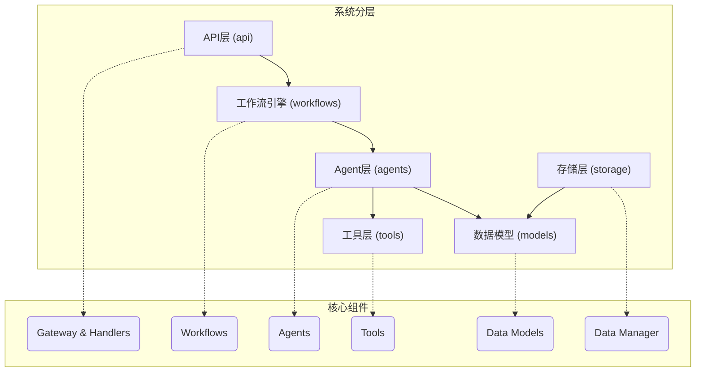
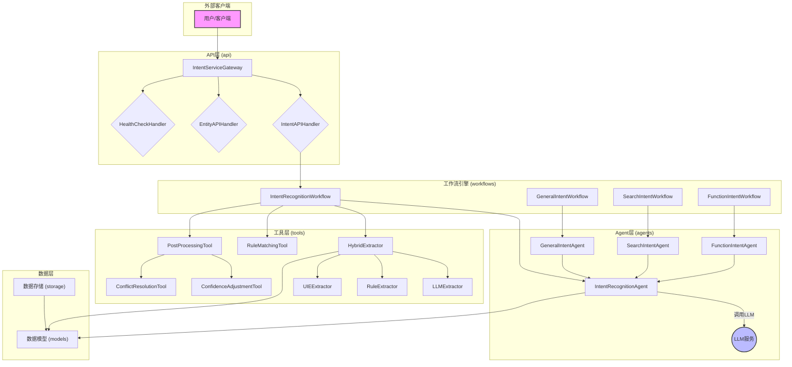
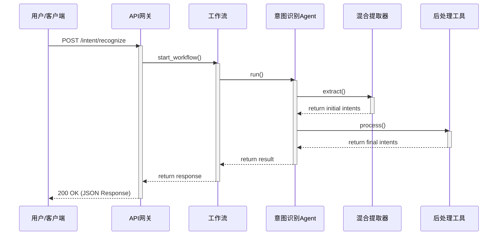

# 系统架构：意图识别服务

本文档概述了意图识别服务的分层技术架构，这是一个旨在理解和处理自然语言用户输入的综合系统。整个服务被视为一个核心功能模块，其内部通过分层设计实现高度的模块化和可扩展性。

## 1. 分层架构

系统采用现代化的异步Python技术栈构建，通过明确的层次划分，将复杂的意图识别任务分解为一系列专注、可独立维护的组件。

### 1.1. API层 (`api` 模块)

-   **职责**: 作为所有外部客户端的统一入口点。它负责处理传入的HTTP请求，执行初始验证，管理请求/响应周期，并将流量路由到适当的后端服务。
-   **主要特性**:
    -   支持单次和批量处理意图请求。
    -   提供意图识别、实体提取和服务健康检查的端点。
    -   实施速率限制和并发控制以确保服务稳定性。
    -   收集并公开性能指标以供监控。

### 1.2. 工作流引擎 (`workflows` 模块)

-   **职责**: 通过定义和执行结构化的工作流来编排整个意图识别过程。它作为中央协调器，确保流程的每一步都按正确的顺序执行。
-   **主要特性**:
    -   **主工作流 (`IntentRecognitionWorkflow`)**: 一个序列化核心任务的流水线：文本预处理、意图分类、实体提取、规则匹配和后处理。
    -   **专用工作流**: 为不同的高级意图类别（`GeneralIntentWorkflow`, `SearchIntentWorkflow`, `FunctionIntentWorkflow`）定义了单独的工作流，允许进行定制化的处理逻辑。

### 1.3. Agent层 (`agents` 模块)

-   **职责**: 这是系统的智能核心，包含执行实际分析和决策的专用“代理”（Agent）。
-   **关键组件**:
    -   **`IntentRecognitionAgent`**: 与大型语言模型（LLM）通信以获取用户意图的广泛分类的主要代理。
    -   **专家代理** (`GeneralIntentAgent`, `SearchIntentAgent`, `FunctionIntentAgent`): 这些代理接收初始分类，并使用针对其领域（例如，分析搜索查询与解析函数调用命令）的启发式、关键字匹配和正则表达式的组合，执行更深入、更精细的分析。

### 1.4. 工具层 (`tools` 模块)

-   **职责**: 提供一个丰富的专业化、可重用组件工具箱，供代理和工作流用于执行特定的、细粒度的任务。
-   **关键工具**:
    -   **实体提取器**: 一个`HybridExtractor`，它智能地结合了来自通用信息提取模型（`UIEExtractor`）、基于LLM的提取器（`LLMExtractor`）和规则提取器（`RuleExtractor`）的结果。
    -   **匹配工具**: `RegexMatchTool` 和 `FullMatchTool`，用于基于模式和精确文本的匹配。
    -   **后处理套件**: 一系列用于优化最终结果的工具，包括`ConfidenceAdjustmentTool`、`ConflictResolutionTool`、`EntityOptimizationTool`和`IntentRefinementTool`。
    -   **数据管理**: `DataLoaderTool` 和 `DataValidationTool`，用于处理训练数据集。

### 1.5. 数据与存储层 (`models` & `storage` 模块)

-   **职责**: 定义数据契约并管理数据的持久化。
-   **关键组件**:
    -   **数据模型 (`models`)**: 使用`Pydantic`定义了标准化的、经过验证的数据结构，确保了系统内部数据流的一致性和类型安全。
    -   **存储管理 (`storage`)**: 通过`DataManager`抽象了数据的CRUD操作，后端使用`SQLite`进行持久化，主要用于模型训练、评估和改进。

## 2. 系统动态与交互

以下图表展示了系统内部组件的详细交互和数据流动过程。

### 2.1. 组件交互图

### 2.2. 交互时序图

## 3. 架构原则

-   **模块化与关注点分离**: 代码库严格划分为上述层次。这使得系统易于理解、测试和维护。它还允许不同组件的独立开发和扩展。
-   **可扩展性**: 该架构设计为易于扩展。例如，支持一种新的意图类型（如“日程安排”）将涉及创建一个新的`SchedulingAgent`和`SchedulingWorkflow`，而对系统其余部分的影响最小。添加新的实体提取方法只需要创建一个新的提取器工具并将其集成到`HybridExtractor`中。
-   **混合AI方法**: 系统不依赖于单一的AI技术。它战略性地将LLM的生成能力（用于广泛理解）与基于规则的系统（正则表达式、关键字匹配）的精确性和控制力（用于细粒度分析和实体提取）相结合。这种混合方法带来了更准确、更可靠的系统。
-   **基于Agent的设计**: 使用专门的代理将复杂的逻辑封装到专注的专家组件中。这使得推理过程更加透明和易于管理。