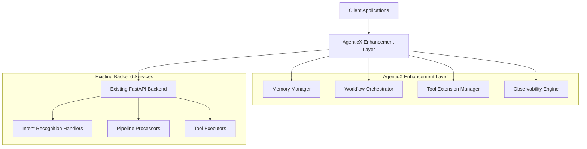
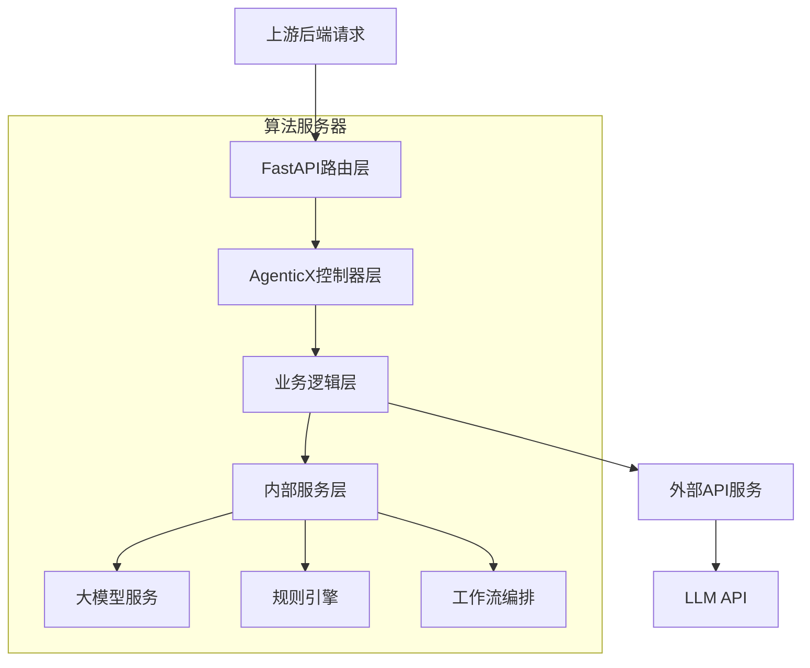
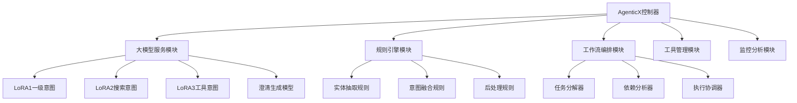
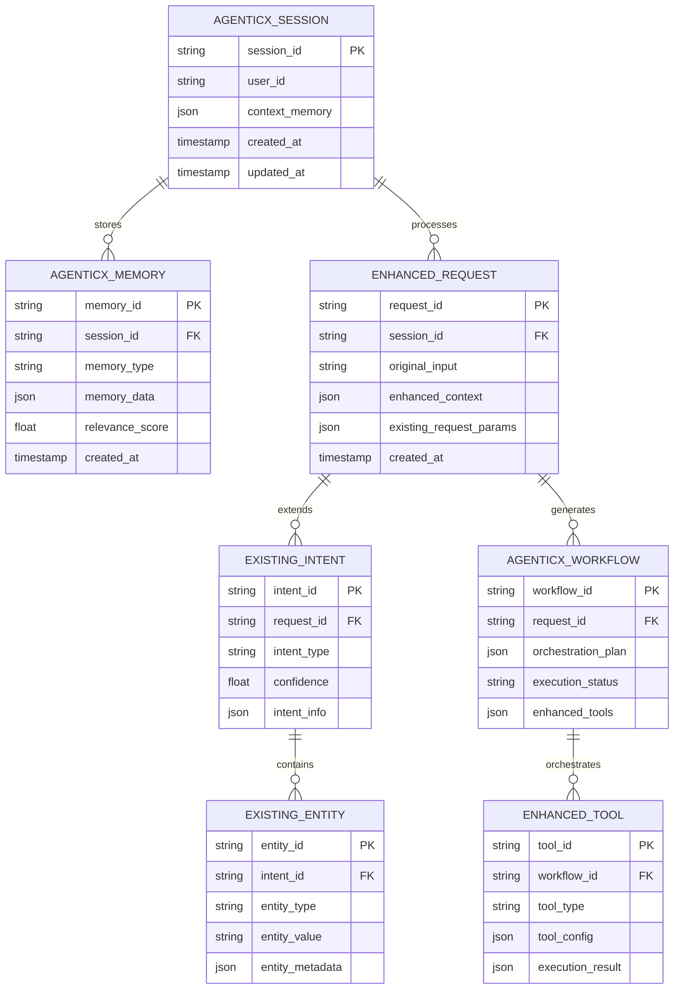

# AgenticX意图理解与规划智能体技术架构文档

## 1.Architecture design



## 2. 技术描述

* Enhancement Layer: AgenticX Framework + Python\@3.9+

* Existing Backend: FastAPI + asyncio + HandlerFactory Pattern

* Integration: Direct API integration with existing intent recognition services

* Memory: AgenticX Memory System + existing session management

* Tools: AgenticX Tool System + existing toolObject extensions

* Observability: AgenticX Observability + existing logging infrastructure

* 算法服务: FastAPI\@0.104 + AgenticX\@latest

* 外部服务: OpenAI API / 其他LLM API

* 部署: Docker容器化，支持多实例负载均衡

## 3. 路由定义

| 路由                  | 用途                              |
| ------------------- | ------------------------------- |
| /agenticx/enhance   | AgenticX增强入口，接收用户输入并调用现有意图识别API |
| /agenticx/clarify   | 澄清机制接口，处理模糊意图和实体缺失的澄清生成         |
| /agenticx/memory    | 记忆管理接口，处理上下文存储和检索               |
| /agenticx/workflow  | 工作流编排接口，基于意图识别结果生成智能执行计划        |
| /agenticx/tools     | 工具扩展接口，管理和执行增强工具                |
| /agenticx/observe   | 观察性接口，提供系统监控和性能指标               |
| /agenticx/integrate | 集成接口，与现有FastAPI后端服务进行数据交换       |
| /internal/llm       | 内部大模型服务接口                       |
| /internal/rules     | 内部规则引擎接口                        |

## 4. API定义

### 4.1 核心API

AgenticX增强接口

```
POST /agenticx/enhance
```

请求:

| 参数名称        | 参数类型   | 是否必需  | 描述      |
| ----------- | ------ | ----- | ------- |
| input       | string | true  | 用户输入文本  |
| context     | object | false | 对话上下文信息 |
| user\_id    | string | true  | 用户唯一标识  |
| session\_id | string | false | 会话标识    |

响应:

| 参数名称              | 参数类型    | 描述                 |
| ----------------- | ------- | ------------------ |
| enhanced\_result  | object  | AgenticX增强后的意图识别结果 |
| workflow\_plan    | object  | 智能编排的工作流计划         |
| memory\_updated   | boolean | 记忆系统是否已更新          |
| is\_need\_clarify | boolean | 是否需要澄清             |
| clarify\_query    | string  | 澄清问题内容（当需要澄清时）     |
| status            | boolean | 请求处理状态             |

示例:

```json
{
  "input": "帮我找一下昨天拍的照片，然后用AI美化一下",
  "context": {
    "previous_intents": [],
    "user_preferences": {}
  },
  "user_id": "user123",
  "session_id": "session456"
}
```

规划生成接口

```
POST /intent/plan
```

请求:

| 参数名称          | 参数类型   | 是否必需  | 描述      |
| ------------- | ------ | ----- | ------- |
| intentions    | array  | true  | 意图分析结果  |
| user\_context | object | false | 用户上下文信息 |
| constraints   | object | false | 执行约束条件  |

响应:

| 参数名称            | 参数类型    | 描述        |
| --------------- | ------- | --------- |
| plan\_id        | string  | 规划唯一标识    |
| tasks           | array   | 任务列表      |
| dependencies    | array   | 任务依赖关系    |
| estimated\_time | integer | 预计执行时间（秒） |

澄清生成接口

```
POST /agenticx/clarify
```

请求:

| 参数名称           | 参数类型   | 是否必需  | 描述                  |
| -------------- | ------ | ----- | ------------------- |
| intent\_result | object | true  | 意图识别结果              |
| user\_context  | object | false | 用户上下文信息             |
| clarify\_type  | string | false | 澄清类型（intent/entity） |

响应:

| 参数名称              | 参数类型    | 描述       |
| ----------------- | ------- | -------- |
| is\_need\_clarify | boolean | 是否需要澄清   |
| clarify\_query    | string  | 澄清问题内容   |
| clarify\_reason   | string  | 澄清原因说明   |
| suggestions       | array   | 澄清建议选项列表 |

内部大模型服务

```
POST /internal/llm/generate
```

请求:

| 参数名称        | 参数类型   | 是否必需  | 描述                              |
| ----------- | ------ | ----- | ------------------------------- |
| model\_type | string | true  | 模型类型(lora1/lora2/lora3/clarify) |
| input\_text | string | true  | 输入文本                            |
| parameters  | object | false | 模型参数                            |

响应:

| 参数名称       | 参数类型          | 描述   |
| ---------- | ------------- | ---- |
| result     | string/object | 生成结果 |
| confidence | float         | 置信度  |

示例

```json
{
  "model_type": "clarify",
  "input_text": "用户意图模糊",
  "parameters": {"temperature": 0.7}
}
```

任务执行接口

```
POST /intent/execute
```

请求:

| 参数名称            | 参数类型   | 是否必需  | 描述               |
| --------------- | ------ | ----- | ---------------- |
| plan\_id        | string | true  | 执行计划标识           |
| execution\_mode | string | false | 执行模式（sync/async） |
| callback\_url   | string | false | 异步回调地址           |

响应:

| 参数名称          | 参数类型   | 描述     |
| ------------- | ------ | ------ |
| execution\_id | string | 执行实例标识 |
| status        | string | 执行状态   |
| results       | array  | 执行结果列表 |

## 5. 服务架构图



## 6. 内部服务架构

### 6.1 服务模块定义



### 6.2 配置定义

服务配置 (config.yaml)

```yaml
# 大模型服务配置
llm_service:
  models:
    lora1:
      path: "./models/lora1"
      max_tokens: 512
      temperature: 0.3
    lora2:
      path: "./models/lora2"
      max_tokens: 256
      temperature: 0.5
    lora3:
      path: "./models/lora3"
      max_tokens: 256
      temperature: 0.5
    clarify:
      api_endpoint: "https://api.openai.com/v1/chat/completions"
      model: "gpt-3.5-turbo"
      max_tokens: 200
      temperature: 0.7

# 规则引擎配置
rules_engine:
  confidence_threshold: 0.7
  entity_extraction:
    enabled: true
    patterns_file: "./rules/entity_patterns.json"
  intent_fusion:
    enabled: true
    fusion_rules: "./rules/fusion_rules.json"

# 工作流编排配置
workflow_orchestration:
  max_parallel_tasks: 5
  timeout_seconds: 30
  retry_attempts: 3

# 监控配置
monitoring:
  metrics_enabled: true
  log_level: "INFO"
  performance_tracking: true
```

内部接口定义 (internal\_interfaces.py)

```python
from typing import Dict, List, Any, Optional
from pydantic import BaseModel

class LLMRequest(BaseModel):
    model_type: str
    input_text: str
    parameters: Optional[Dict[str, Any]] = {}

class LLMResponse(BaseModel):
    result: Any
    confidence: float
    processing_time: float

class RuleEngineRequest(BaseModel):
    rule_type: str  # entity_extraction, intent_fusion, postprocessing
    input_data: Dict[str, Any]
    context: Optional[Dict[str, Any]] = {}

class RuleEngineResponse(BaseModel):
    result: Dict[str, Any]
    applied_rules: List[str]
    confidence: float

class WorkflowRequest(BaseModel):
    intent_result: Dict[str, Any]
    available_tools: List[str]
    constraints: Optional[Dict[str, Any]] = {}

class WorkflowResponse(BaseModel):
    workflow_plan: List[Dict[str, Any]]
    estimated_duration: float
    dependencies: Dict[str, List[str]]
```

## 7. 数据模型

### 7.1 数据模型定义



### 6.2 数据定义语言

AgenticX会话表 (agenticx\_sessions)

```sql
-- 创建表
CREATE TABLE agenticx_sessions (
    session_id UUID PRIMARY KEY DEFAULT gen_random_uuid(),
    user_id VARCHAR(255) NOT NULL,
    context_memory JSONB DEFAULT '{}',
    created_at TIMESTAMP WITH TIME ZONE DEFAULT NOW(),
    updated_at TIMESTAMP WITH TIME ZONE DEFAULT NOW()
);

-- 创建索引
CREATE INDEX idx_agenticx_sessions_user_id ON agenticx_sessions(user_id);
CREATE INDEX idx_agenticx_sessions_updated_at ON agenticx_sessions(updated_at DESC);

-- 初始化数据
INSERT INTO agenticx_sessions (user_id, context_memory) VALUES
('user123', '{"preferences": {"language": "zh-CN"}, "history_summary": "用户经常查询技术文档"}'),
('user456', '{"preferences": {"language": "en-US"}, "history_summary": "用户偏好搜索学术论文"}');
```

AgenticX记忆表 (agenticx\_memory)

```sql
-- 创建表
CREATE TABLE agenticx_memory (
    memory_id UUID PRIMARY KEY DEFAULT gen_random_uuid(),
    session_id UUID NOT NULL REFERENCES agenticx_sessions(session_id),
    memory_type VARCHAR(50) NOT NULL,
    memory_data JSONB NOT NULL,
    relevance_score FLOAT DEFAULT 1.0,
    created_at TIMESTAMP WITH TIME ZONE DEFAULT NOW()
);

-- 创建索引
CREATE INDEX idx_agenticx_memory_session_id ON agenticx_memory(session_id);
CREATE INDEX idx_agenticx_memory_type ON agenticx_memory(memory_type);
CREATE INDEX idx_agenticx_memory_relevance ON agenticx_memory(relevance_score DESC);

-- 初始化数据
INSERT INTO agenticx_memory (session_id, memory_type, memory_data, relevance_score)
SELECT 
    session_id,
    'user_preference',
    '{"preferred_search_domains": ["machine_learning", "ai"], "response_style": "detailed"}',
    0.9
FROM agenticx_sessions LIMIT 1;
```

增强请求表 (enhanced\_requests)

```sql
-- 创建表
CREATE TABLE enhanced_requests (
    request_id UUID PRIMARY KEY DEFAULT gen_random_uuid(),
    session_id UUID NOT NULL REFERENCES agenticx_sessions(session_id),
    original_input TEXT NOT NULL,
    enhanced_context JSONB DEFAULT '{}',
    existing_request_params JSONB DEFAULT '{}',
    created_at TIMESTAMP WITH TIME ZONE DEFAULT NOW()
);

-- 创建索引
CREATE INDEX idx_enhanced_requests_session_id ON enhanced_requests(session_id);
CREATE INDEX idx_enhanced_requests_created_at ON enhanced_requests(created_at DESC);

-- 初始化数据
INSERT INTO enhanced_requests (session_id, original_input, enhanced_context, existing_request_params)
SELECT 
    session_id,
    '帮我搜索机器学习相关的文档',
    '{"context_enrichment": "基于用户历史，推荐深度学习和神经网络相关内容"}',
    '{"input": "帮我搜索机器学习相关的文档", "user_id": "user123"}'
FROM agenticx_sessions LIMIT 1;
```

用户表 (users)

```sql
-- 创建用户表
CREATE TABLE users (
    user_id VARCHAR(64) PRIMARY KEY,
    name VARCHAR(100) NOT NULL,
    preferences JSONB DEFAULT '{}',
    created_at TIMESTAMP WITH TIME ZONE DEFAULT NOW(),
    updated_at TIMESTAMP WITH TIME ZONE DEFAULT NOW()
);

-- 创建索引
CREATE INDEX idx_users_created_at ON users(created_at DESC);
```

意图会话表 (intent\_sessions)

```sql
-- 创建意图会话表
CREATE TABLE intent_sessions (
    session_id VARCHAR(64) PRIMARY KEY,
    user_id VARCHAR(64) NOT NULL REFERENCES users(user_id),
    context JSONB DEFAULT '{}',
    status VARCHAR(20) DEFAULT 'active' CHECK (status IN ('active', 'completed', 'expired')),
    started_at TIMESTAMP WITH TIME ZONE DEFAULT NOW(),
    ended_at TIMESTAMP WITH TIME ZONE
);

-- 创建索引
CREATE INDEX idx_intent_sessions_user_id ON intent_sessions(user_id);
CREATE INDEX idx_intent_sessions_status ON intent_sessions(status);
CREATE INDEX idx_intent_sessions_started_at ON intent_sessions(started_at DESC);
```

意图分析表 (intent\_analyses)

```sql
-- 创建意图分析表
CREATE TABLE intent_analyses (
    analysis_id VARCHAR(64) PRIMARY KEY,
    session_id VARCHAR(64) NOT NULL REFERENCES intent_sessions(session_id),
    input_text TEXT NOT NULL,
    intentions JSONB NOT NULL,
    entities JSONB DEFAULT '{}',
    confidence FLOAT CHECK (confidence >= 0 AND confidence <= 1),
    workflow_type VARCHAR(20) CHECK (workflow_type IN ('single', 'multi', 'sequential')),
    analyzed_at TIMESTAMP WITH TIME ZONE DEFAULT NOW()
);

-- 创建索引
CREATE INDEX idx_intent_analyses_session_id ON intent_analyses(session_id);
CREATE INDEX idx_intent_analyses_confidence ON intent_analyses(confidence DESC);
CREATE INDEX idx_intent_analyses_workflow_type ON intent_analyses(workflow_type);
CREATE INDEX idx_intent_analyses_analyzed_at ON intent_analyses(analyzed_at DESC);
```

执行计划表 (execution\_plans)

```sql
-- 创建执行计划表
CREATE TABLE execution_plans (
    plan_id VARCHAR(64) PRIMARY KEY,
    analysis_id VARCHAR(64) NOT NULL REFERENCES intent_analyses(analysis_id),
    tasks JSONB NOT NULL,
    dependencies JSONB DEFAULT '[]',
    estimated_time INTEGER DEFAULT 0,
    status VARCHAR(20) DEFAULT 'pending' CHECK (status IN ('pending', 'running', 'completed', 'failed')),
    created_at TIMESTAMP WITH TIME ZONE DEFAULT NOW()
);

-- 创建索引
CREATE INDEX idx_execution_plans_analysis_id ON execution_plans(analysis_id);
CREATE INDEX idx_execution_plans_status ON execution_plans(status);
CREATE INDEX idx_execution_plans_created_at ON execution_plans(created_at DESC);
```

任务执行表 (task\_executions)

```sql
-- 创建任务执行表
CREATE TABLE task_executions (
    execution_id VARCHAR(64) PRIMARY KEY,
    plan_id VARCHAR(64) NOT NULL REFERENCES execution_plans(plan_id),
    task_type VARCHAR(50) NOT NULL,
    parameters JSONB DEFAULT '{}',
    status VARCHAR(20) DEFAULT 'pending' CHECK (status IN ('pending', 'running', 'completed', 'failed')),
    results JSONB DEFAULT '{}',
    started_at TIMESTAMP WITH TIME ZONE,
    completed_at TIMESTAMP WITH TIME ZONE
);

-- 创建索引
CREATE INDEX idx_task_executions_plan_id ON task_executions(plan_id);
CREATE INDEX idx_task_executions_status ON task_executions(status);
CREATE INDEX idx_task_executions_task_type ON task_executions(task_type);
CREATE INDEX idx_task_executions_started_at ON task_executions(started_at DESC);
```

工具调用表 (tool\_calls)

```sql
-- 创建工具调用表
CREATE TABLE tool_calls (
    call_id VARCHAR(64) PRIMARY KEY,
    execution_id VARCHAR(64) NOT NULL REFERENCES task_executions(execution_id),
    tool_name VARCHAR(100) NOT NULL,
    input_params JSONB DEFAULT '{}',
    output_results JSONB DEFAULT '{}',
    duration_ms INTEGER DEFAULT 0,
    called_at TIMESTAMP WITH TIME ZONE DEFAULT NOW()
);

-- 创建索引
CREATE INDEX idx_tool_calls_execution_id ON tool_calls(execution_id);
CREATE INDEX idx_tool_calls_tool_name ON tool_calls(tool_name);
CREATE INDEX idx_tool_calls_duration_ms ON tool_calls(duration_ms DESC);
CREATE INDEX idx_tool_calls_called_at ON tool_calls(called_at DESC);
```

\-- 初始化数据

```sql
INSERT INTO users (user_id, name, preferences) VALUES 
('demo_user', '演示用户', '{"language": "zh-CN", "theme": "light"}'),
('test_user', '测试用户', '{"language": "zh-CN", "theme": "dark"}');
```

