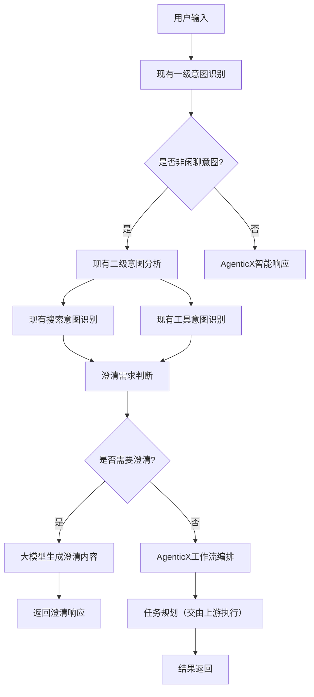

# AgenticX意图理解与规划智能体产品需求文档

## 1. 产品概览

基于AgenticX框架构建的智能意图理解增强代理，作为现有意图识别后端服务的智能化增强层。该产品直接集成现有的三层意图识别架构（一级意图、搜索意图、工具意图），通过AgenticX的智能体能力提供记忆管理、工具扩展和工作流编排等增强功能。

在保持现有FastAPI后端服务稳定性的基础上，增强意图识别的智能化程度，提供上下文记忆、动态工具调用和复杂任务编排能力。目标是将现有的意图识别服务升级为具备学习能力和自适应能力的智能化意图理解系统。

## 2. 核心功能

### 2.1 功能模块

我们的意图理解算法服务包含以下核心模块：

1. **意图识别增强模块**：集成现有HandlerFactory和三层意图识别，增加智能决策和学习能力
2. **智能澄清模块**：当意图模糊或实体缺失时，通过大模型生成澄清回复内容
3. **智能体编排模块**：基于现有Pipeline架构，增加AgenticX工作流编排和任务规划
4. **工具扩展模块**：扩展现有toolObject能力，支持动态工具注册和智能调用
5. **观察性增强模块**：在现有日志基础上增加智能体行为分析和性能优化

### 2.2 模块详情

| 模块名称     | 子模块名称        | 功能描述                                                          |
| -------- | ------------ | ------------------------------------------------------------- |
| 意图识别增强模块 | 现有Handler集成  | 无缝集成现有IntentHandler、SearchIntentHandler、FunctionIntentHandler |
| 意图识别增强模块 | 智能决策增强       | 为现有意图识别增加智能决策和上下文理解能力                                         |
| 智能澄清模块   | 模糊意图检测       | 基于置信度和实体完整性判断是否需要澄清                                           |
| 智能澄清模块   | 澄清内容生成       | 通过大模型基于意图判断结果生成个性化澄清回复                                        |
| 智能澄清模块   | 响应结构增强       | 在ResponseData中增加isNeedClarify和clarifyQuery字段                  |
| 智能体编排模块  | Pipeline增强   | 扩展现有PostprocessorHandler，增加智能决策和动态路由                          |
| 智能体编排模块  | 工作流规划        | 基于意图识别结果生成复杂任务的执行工作流（由上游后端执行）                                 |
| 工具扩展模块   | toolObject增强 | 扩展现有工具对象，支持动态参数生成和智能调用策略                                      |
| 工具扩展模块   | 工具注册管理       | 动态注册新工具，与现有HandlerFactory无缝集成                                 |
| 观察性增强模块  | 性能监控增强       | 在现有日志基础上增加智能体行为分析和性能优化建议                                      |

## 3. 核心流程

基于现有FastAPI后端的三层意图识别架构，AgenticX算法服务作为增强层提供智能编排和工具扩展能力。系统保持现有的异步处理优势，在原有Pipeline基础上增加智能决策和上下文理解。

### 算法服务处理流程

用户输入 → 现有意图识别API调用 → 澄清判断 → 澄清内容生成（如需要）→ AgenticX智能编排 → 增强工具执行（由上游后端执行）→ 智能响应生成

### 系统处理流程

接收用户输入 → 一级意图分类（LoRA1）→ 判断是否需要二级分类 → 并行调用搜索意图LoRA2和工具意图LoRA3 → 实体抽取和后处理 → 意图融合和冲突解决 → 澄清需求判断 → 澄清内容生成（如需要）→ 工作流规划 → 任务分解和调度（交由上游后端执行）→ 执行监控和反馈

## 4. 算法服务接口设计

### 4.1 内部基础能力接口

算法服务内部构建多个基础能力接口，支持模块化调用和组合：

* **大模型服务接口**: 提供LoRA模型推理、澄清内容生成、智能决策等能力

* **规则引擎接口**: 提供实体抽取、意图融合、后处理规则等能力

* **工作流编排接口**: 提供任务规划、依赖分析、执行协调等能力

* **工具管理接口**: 提供工具注册、参数生成、调用策略等能力

* **监控分析接口**: 提供性能监控、行为分析、优化建议等能力

### 4.2 服务能力组合

通过内部接口组合实现复杂的算法能力：

| 能力组合  | 涉及接口         | 功能描述                |
| ----- | ------------ | ------------------- |
| 意图理解  | 大模型服务 + 规则引擎 | 三层意图识别 + 实体抽取 + 后处理 |
| 智能澄清  | 大模型服务 + 规则引擎 | 澄清判断 + 内容生成 + 响应构建  |
| 工作流规划 | 工作流编排 + 工具管理 | 任务分解 + 依赖分析 + 执行计划  |
| 性能优化  | 监控分析 + 规则引擎  | 行为分析 + 规则优化 + 性能调优  |

### 4.3 接口调用模式

支持同步和异步两种调用模式，满足不同场景需求：

* **同步模式**: 适用于实时意图识别、澄清判断等低延迟场景

* **异步模式**: 适用于复杂工作流规划、批量分析等高计算量场景

* **流式模式**: 适用于大模型生成、实时监控等需要流式输出的场景

