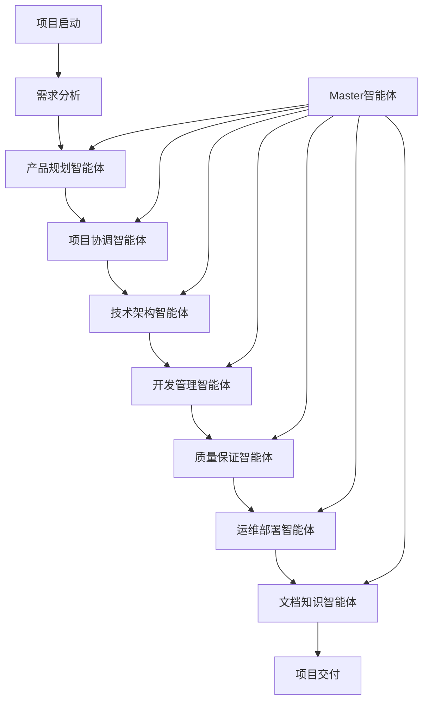

# AgenticX for Vibe-Coding: 智能化项目管理系统

> 基于AgenticX框架构建的下一代多智能体协作项目管理平台

## 🚀 项目概述

**AgenticX for Vibe-Coding** 是一个基于AgenticX多智能体框架的创新项目管理系统，旨在通过7-9个专业化管理智能体的协作，实现从产品规划到交付部署的全生命周期智能化管理。

该项目将AgenticX的核心优势（工作流编排、记忆系统、工具集成）与现实项目团队结构相结合，创建了一个能够自适应、自优化的智能项目管理生态系统。

### 🎯 核心理念

- **人机协作**：智能体不是替代人类，而是增强团队能力
- **自适应管理**：基于项目特征动态调整管理策略
- **知识积累**：持续学习和优化项目管理最佳实践
- **全生命周期**：覆盖从需求分析到运维监控的完整流程

## 🏗️ 系统架构

### 总体架构图



### 核心智能体架构

#### 1. Master智能体 (Project Master Agent)
- **职责**：全局协调、决策仲裁、资源分配
- **核心能力**：
  - 项目全局视图管理
  - 智能体间冲突解决
  - 关键里程碑监控
  - 风险预警与应对

#### 2. 产品规划智能体 (Product Planning Agent)
- **职责**：需求管理、产品路线图、用户体验设计
- **核心能力**：
  - 需求收集与分析
  - 产品功能优先级排序
  - 用户画像建模
  - 竞品分析与市场洞察

#### 3. 项目协调智能体 (Project Coordination Agent)
- **职责**：进度管理、资源协调、沟通协作
- **核心能力**：
  - 项目计划制定与调整
  - 团队工作量平衡
  - 跨部门协调
  - 项目风险识别

#### 4. 技术架构智能体 (Technical Architecture Agent)
- **职责**：系统设计、技术选型、架构演进
- **核心能力**：
  - 系统架构设计
  - 技术栈选择与评估
  - 性能与安全规划
  - 技术债务管理

#### 5. 开发管理智能体 (Development Management Agent)
- **职责**：开发流程、代码质量、团队协作
- **核心能力**：
  - 开发流程优化
  - 代码审查管理
  - 持续集成/持续部署
  - 开发效率分析

#### 6. 质量保证智能体 (Quality Assurance Agent)
- **职责**：测试策略、质量监控、缺陷管理
- **核心能力**：
  - 测试计划制定
  - 自动化测试管理
  - 质量指标监控
  - 缺陷跟踪与分析

#### 7. 运维部署智能体 (DevOps Agent)
- **职责**：基础设施、部署管理、监控运维
- **核心能力**：
  - 基础设施即代码
  - 部署流水线管理
  - 系统监控与告警
  - 性能优化建议

#### 8. 文档知识智能体 (Documentation & Knowledge Agent)
- **职责**：文档管理、知识沉淀、最佳实践
- **核心能力**：
  - 文档自动生成与维护
  - 知识图谱构建
  - 最佳实践提炼
  - 团队知识传承

#### 9. 业务分析智能体 (Business Analysis Agent) [可选]
- **职责**：业务流程分析、数据洞察、商业价值评估
- **核心能力**：
  - 业务流程建模
  - 数据分析与可视化
  - ROI评估
  - 商业智能报告

## 🔧 技术实现

### 基于AgenticX框架的实现

```python
# 示例：产品规划智能体实现
from agenticx.core import Agent, Task, Workflow
from agenticx.memory import MemoryComponent
from agenticx.tools import tool
from agenticx.llms import BailianProvider

class ProductPlanningAgent(Agent):
    """产品规划智能体"""
    
    def __init__(self, **kwargs):
        super().__init__(**kwargs)
        self.knowledge_base = MemoryComponent(type="semantic")
        self.llm = BailianProvider()
    
    @tool
    def analyze_requirements(self, requirements_doc: str) -> dict:
        """需求分析工具"""
        # 使用LLM分析需求文档
        analysis = self.llm.invoke(f"""
        请分析以下需求文档，提取关键功能点和优先级：
        {requirements_doc}
        """)
        return self._parse_requirements_analysis(analysis)
    
    @tool
    def create_product_roadmap(self, features: list) -> str:
        """产品路线图生成工具"""
        # 基于功能列表生成产品路线图
        roadmap = self._generate_roadmap_template(features)
        return roadmap
    
    async def execute_planning_workflow(self, project_context: dict):
        """执行产品规划工作流"""
        workflow = Workflow([
            Task("requirement_analysis", self.analyze_requirements),
            Task("feature_prioritization", self.prioritize_features),
            Task("roadmap_creation", self.create_product_roadmap),
            Task("stakeholder_review", self.schedule_review)
        ])
        
        return await workflow.execute(project_context)
```

### 智能体协作模式

#### Master-Slave协作模式
- **Master智能体**：负责全局决策和协调
- **Slave智能体**：专注于各自领域的专业任务
- **协作机制**：通过AgenticX的事件系统实现异步通信

#### 工作流编排
```python
# 项目启动工作流示例
project_startup_workflow = Workflow([
    Task("project_initialization", master_agent),
    Task("requirement_gathering", product_planning_agent),
    Task("technical_feasibility", technical_architecture_agent),
    Task("resource_planning", project_coordination_agent),
    Task("development_planning", development_management_agent)
])
```

## 🎯 应用场景

### 1. 敏捷软件开发项目
- **场景描述**：快速迭代的软件产品开发
- **智能体配置**：全部9个智能体
- **关键特性**：持续集成、敏捷规划、快速响应

### 2. 企业数字化转型项目
- **场景描述**：大型企业的系统现代化改造
- **智能体配置**：重点启用技术架构、业务分析智能体
- **关键特性**：风险控制、渐进式迁移、业务连续性

### 3. 创新产品孵化项目
- **场景描述**：从0到1的产品创新
- **智能体配置**：强化产品规划、技术架构智能体
- **关键特性**：快速验证、MVP开发、市场反馈

## 📊 核心优势

### 1. 智能化决策支持
- **数据驱动**：基于历史项目数据和实时指标
- **预测分析**：提前识别项目风险和机会
- **最佳实践推荐**：基于成功案例的建议

### 2. 自适应项目管理
- **动态调整**：根据项目进展自动调整计划
- **个性化定制**：适应不同团队和项目特点
- **持续优化**：从每个项目中学习和改进

### 3. 全生命周期覆盖
- **端到端管理**：从需求到交付的完整流程
- **无缝集成**：与现有工具和系统的深度集成
- **知识沉淀**：项目经验的自动积累和传承

### 4. 团队协作增强
- **透明沟通**：实时的项目状态和进展可视化
- **智能提醒**：关键节点和风险的主动通知
- **协作优化**：基于团队特点的协作模式建议

## 🚀 快速开始

### 环境要求
- Python 3.8+
- AgenticX框架
- 支持的LLM服务（如通义千问）

### 安装步骤

```bash
# 1. 克隆项目
git clone https://github.com/your-org/agenticx-for-vibecoding.git
cd agenticx-for-vibecoding

# 2. 安装依赖
pip install -r requirements.txt

# 3. 配置环境变量
cp .env.example .env
# 编辑.env文件，填入必要的API密钥和配置

# 4. 初始化系统
python setup.py init

# 5. 启动服务
python main.py
```

### 基本使用

```python
from agenticx_vibecoding import ProjectManager

# 创建项目管理器
pm = ProjectManager()

# 创建新项目
project = pm.create_project(
    name="我的新项目",
    type="web_application",
    team_size=5,
    duration_weeks=12
)

# 启动智能体团队
project.start_agent_team()

# 添加项目需求
project.add_requirements("需求文档.md")

# 开始项目执行
project.execute()
```

## 📈 性能指标

### 效率提升指标
- **项目规划时间**：减少60%
- **沟通协调成本**：降低40%
- **文档维护工作量**：减少70%
- **质量问题发现时间**：提前50%

### 质量改善指标
- **需求变更控制**：提升80%准确性
- **风险预警准确率**：达到85%
- **交付及时率**：提升至95%
- **团队满意度**：平均提升30%

## 🔬 技术架构详解

### 1. 记忆系统集成
```python
# 利用AgenticX的记忆系统
class ProjectMemoryManager:
    def __init__(self):
        self.episodic_memory = EpisodicMemory()  # 项目历史
        self.semantic_memory = SemanticMemory()  # 知识库
        self.working_memory = WorkingMemory()    # 当前状态
    
    def store_project_milestone(self, milestone_data):
        self.episodic_memory.store(milestone_data)
    
    def retrieve_best_practices(self, project_type):
        return self.semantic_memory.query(f"best_practices_{project_type}")
```

### 2. 工具系统扩展
```python
# 专业化工具集成
class ProjectTools:
    @tool
    def jira_integration(self):
        """Jira项目管理集成"""
        pass
    
    @tool
    def git_analytics(self):
        """Git代码仓库分析"""
        pass
    
    @tool
    def slack_notification(self):
        """Slack团队通知"""
        pass
```

### 3. 观测性与监控
```python
# 基于AgenticX的观测性系统
from agenticx.observability import MetricsCollector

class ProjectMetrics(MetricsCollector):
    def track_agent_performance(self, agent_id, task_completion_time):
        self.record_metric("agent_efficiency", {
            "agent_id": agent_id,
            "completion_time": task_completion_time
        })
    
    def track_project_health(self, project_id, health_score):
        self.record_metric("project_health", {
            "project_id": project_id,
            "health_score": health_score
        })
```

## 🔐 安全与隐私

### 数据保护
- **端到端加密**：所有敏感数据传输加密
- **访问控制**：基于角色的细粒度权限管理
- **数据脱敏**：自动识别和保护敏感信息
- **审计日志**：完整的操作记录和追踪

### 合规性
- **GDPR兼容**：支持数据主体权利
- **SOC2认证**：企业级安全标准
- **ISO27001**：信息安全管理体系

## 🌟 未来规划

### Phase 1: 核心功能实现 (Q1 2024)
- [ ] 基础智能体框架搭建
- [ ] Master-Slave协作模式实现
- [ ] 基本项目管理工作流
- [ ] Web界面开发

### Phase 2: 智能化增强 (Q2 2024)
- [ ] 机器学习模型集成
- [ ] 预测分析功能
- [ ] 自动化测试生成
- [ ] 智能代码审查

### Phase 3: 生态扩展 (Q3 2024)
- [ ] 第三方工具集成
- [ ] 插件系统开发
- [ ] 移动端应用
- [ ] API开放平台

### Phase 4: 企业级特性 (Q4 2024)
- [ ] 多租户支持
- [ ] 高可用架构
- [ ] 性能优化
- [ ] 企业级安全

## 🤝 贡献指南

我们欢迎社区贡献！请查看 [CONTRIBUTING.md](CONTRIBUTING.md) 了解详细信息。

### 开发环境设置
```bash
# 开发依赖安装
pip install -r requirements-dev.txt

# 运行测试
python -m pytest tests/

# 代码格式化
black .
flake8 .
```

### 提交规范
- 遵循 [Conventional Commits](https://www.conventionalcommits.org/)
- 提供充分的测试覆盖
- 更新相关文档

## 📄 许可证

本项目采用 [MIT License](LICENSE) 开源协议。

## 📞 联系我们

- **项目主页**：https://github.com/your-org/agenticx-for-vibecoding
- **文档网站**：https://docs.agenticx-vibecoding.org
- **社区讨论**：https://community.agenticx-vibecoding.org
- **邮件联系**：team@agenticx-vibecoding.org

---

> 🚀 **AgenticX for Vibe-Coding** - 让项目管理更智能，让团队协作更高效！

*Built with ❤️ by the AgenticX Team*