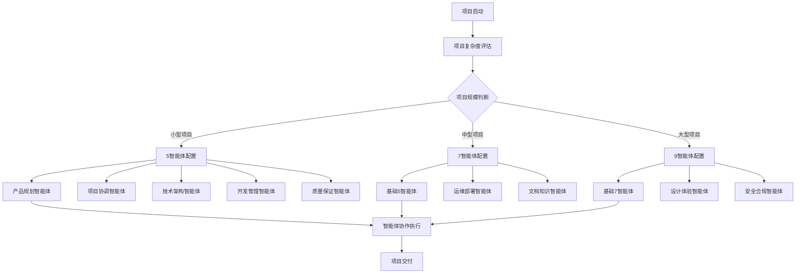
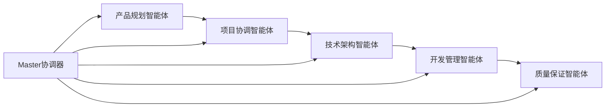
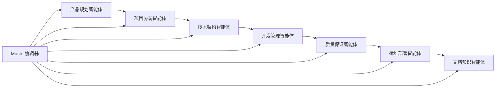
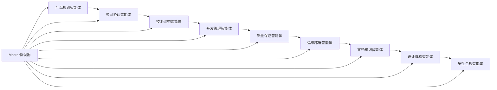
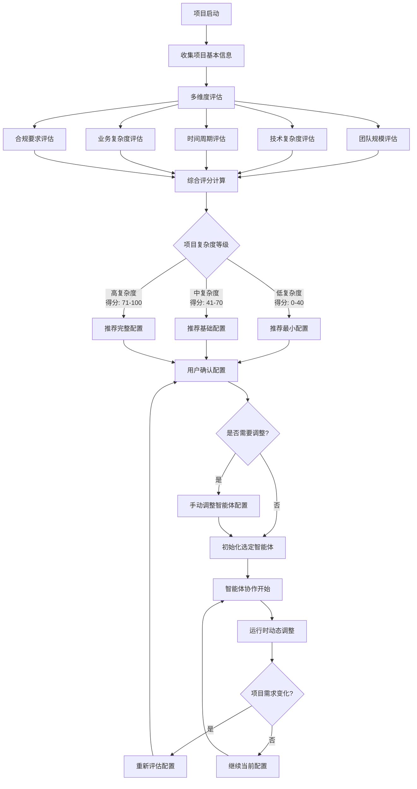
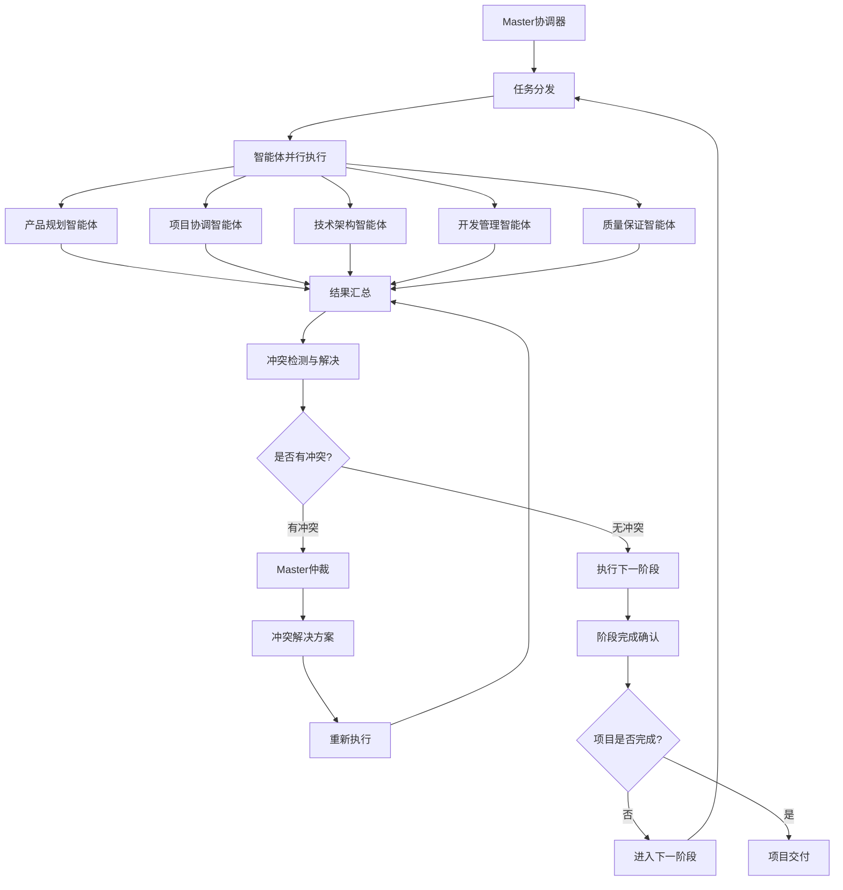
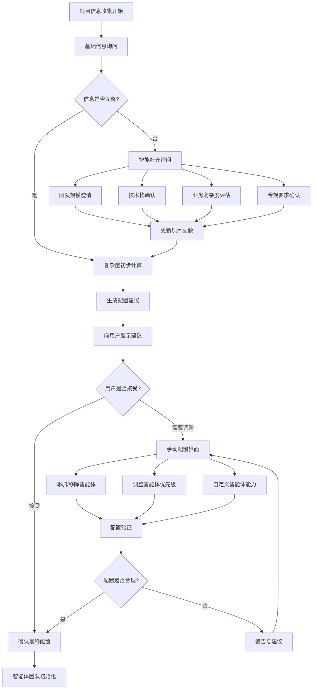

# AgenticX for Vibe-Coding: 智能化项目管理系统

> 基于AgenticX框架构建的下一代多智能体协作项目管理平台

## 🚀 项目概述

**AgenticX for Vibe-Coding** 是一个基于AgenticX多智能体框架的创新项目管理系统，旨在通过7-9个专业化管理智能体的协作，实现从产品规划到交付部署的全生命周期智能化管理。

该项目将AgenticX的核心优势（工作流编排、记忆系统、工具集成）与现实项目团队结构相结合，创建了一个能够自适应、自优化的智能项目管理生态系统。

### 🎯 核心理念

- **人机协作**：智能体不是替代人类，而是增强团队能力
- **自适应管理**：基于项目特征动态调整管理策略
- **知识积累**：持续学习和优化项目管理最佳实践
- **全生命周期**：覆盖从需求分析到运维监控的完整流程

## 🏗️ 系统架构

### 智能体动态配置决策系统

系统首先通过项目复杂度评估来动态决定需要启用的智能体数量和类型，确保资源的最优配置。



### 项目复杂度评估维度

| 评估维度 | 小型项目 | 中型项目 | 大型项目 |
|---------|----------|----------|----------|
| **团队规模** | 1-5人 | 6-15人 | 16+人 |
| **项目周期** | 1-8周 | 2-6个月 | 6个月+ |
| **技术复杂度** | 单体应用 | 微服务架构 | 分布式系统 |
| **用户规模** | <1000 | 1K-10K | 10K+ |
| **合规要求** | 基础 | 行业标准 | 严格合规 |
| **集成复杂度** | 简单API | 多系统集成 | 企业级集成 |
| **数据敏感度** | 一般 | 敏感 | 高度机密 |

### 智能体配置策略

#### 最小配置 (5个智能体) - 适用于小型项目


**核心能力覆盖**：
- 产品规划：需求分析、功能设计
- 项目协调：进度管理、资源分配
- 技术架构：系统设计、技术选型
- 开发管理：代码管理、开发流程
- 质量保证：测试策略、质量控制

#### 基础配置 (7个智能体) - 适用于中型项目


**增强能力**：
- 运维部署：CI/CD、监控、基础设施管理
- 文档知识：文档自动化、知识管理、最佳实践沉淀

#### 完整配置 (9个智能体) - 适用于大型企业项目


**企业级能力**：
- 设计体验：UI/UX设计、用户体验优化、设计系统管理
- 安全合规：安全审计、合规检查、风险评估、数据保护

### 动态澄清决策流程



### 🔄 完整核心逻辑流程 - 智能体协作全生命周期

以下是 AgenticX for Vibe-Coding 系统的完整核心逻辑流程，展示了从项目发起到最终交付的智能体协作全过程：

```mermaid
graph TD
    %% 项目启动与配置决策
    A[项目发起] --> B[动态澄清信息收集]
    B --> C[项目复杂度多维评估]
    C --> D[智能体配置决策]
    D --> E[用户确认与调整]
    E --> F[智能体团队初始化]
    
    %% 需求分析阶段
    F --> G[产品规划智能体启动]
    G --> G1[需求收集与分析]
    G1 --> G2[用户故事编写]
    G2 --> G3[产品路线图制定]
    G3 --> G4[功能优先级排序]
    
    %% 技术设计阶段
    G4 --> H[技术架构智能体启动]
    H --> H1[技术可行性分析]
    H1 --> H2[系统架构设计]
    H2 --> H3[技术栈选型与评估]
    H3 --> H4[架构文档生成]
    
    %% 项目计划阶段
    H4 --> I[项目协调智能体启动]
    I --> I1[项目计划制定]
    I1 --> I2[资源分配规划]
    I2 --> I3[风险识别与评估]
    I3 --> I4[时间表制定]
    
    %% 开发执行阶段
    I4 --> J[开发管理智能体启动]
    J --> J1[开发任务分解与分配]
    J1 --> J2[代码开发监控]
    J2 --> J3[代码审查管理]
    J3 --> J4[进度跟踪报告]
    
    %% 质量保证阶段
    J4 --> K[质量保证智能体启动]
    K --> K1[测试策略制定]
    K1 --> K2[测试用例生成]
    K2 --> K3[自动化测试执行]
    K3 --> K4[质量报告生成]
    
    %% 运维部署阶段（中型/大型项目）
    K4 --> L{是否需要运维智能体?}
    L -->|是 - 中型/大型项目| M[运维部署智能体启动]
    L -->|否 - 小型项目| R
    
    M --> M1[CI/CD流水线设置]
    M1 --> M2[部署环境准备]
    M2 --> M3[监控告警配置]
    M3 --> M4[性能优化建议]
    
    %% 文档知识管理（中型/大型项目）
    M4 --> N{是否需要文档智能体?}
    N -->|是| O[文档知识智能体启动]
    N -->|否| R
    
    O --> O1[文档自动生成]
    O1 --> O2[知识库更新]
    O2 --> O3[最佳实践提炼]
    O3 --> O4[团队知识分享]
    
    %% 设计体验管理（大型项目）
    O4 --> P{是否需要设计智能体?}
    P -->|是 - 大型项目| Q[设计体验智能体启动]
    P -->|否| U
    
    Q --> Q1[UI/UX设计审查]
    Q1 --> Q2[用户体验优化]
    Q2 --> Q3[设计规范维护]
    Q3 --> Q4[可用性测试]
    
    %% 安全合规管理（大型企业项目）
    Q4 --> R{是否需要安全智能体?}
    R -->|是 - 企业级| S[安全合规智能体启动]
    R -->|否| U
    
    S --> S1[安全风险评估]
    S1 --> S2[合规性检查]
    S2 --> S3[安全测试执行]
    S3 --> S4[合规报告生成]
    
    %% 项目交付与总结
    S4 --> U[项目交付准备]
    U --> U1[交付物验收]
    U1 --> U2[项目总结报告]
    U2 --> U3[经验沉淀入库]
    U3 --> V[项目正式交付]
    
    %% 持续监控与迭代
    V --> W[项目后续监控]
    W --> X{是否需要迭代?}
    X -->|是| Y[新迭代规划]
    X -->|否| Z[项目维护模式]
    
    Y --> G  %% 回到需求分析阶段
    Z --> AA[项目归档]
    
    %% Master协调器全程监控（虚线表示监控关系）
    BB[Master协调器] -.-> G
    BB -.-> H
    BB -.-> I
    BB -.-> J
    BB -.-> K
    BB -.-> M
    BB -.-> O
    BB -.-> Q
    BB -.-> S
    BB -.-> U
    
    %% 实时状态监控与动态调整
    CC[实时状态监控] -.-> DD[动态调整决策]
    DD -.-> EE[智能体配置更新]
    EE -.-> BB
```

#### 🎯 核心流程特点

##### 1. **智能化启动决策**
- 动态澄清：基于项目特征自动生成针对性问题
- 多维评估：7个核心维度加权评分，精准衡量项目复杂度
- 智能配置：自动推荐最优智能体组合

##### 2. **阶段式协作执行**
- 逐步激活：根据项目复杂度分步启动智能体
- 串行协作：前阶段输出作为后阶段输入
- 并行处理：同阶段内部任务可并行执行

##### 3. **动态适应机制**
- 实时监控：Master协调器全程监控所有智能体状态
- 风险预警：提前识别和应对项目风险
- 配置调整：根据实际情况动态增减智能体

##### 4. **质量保证机制**
- 质量门禁：每个阶段都有明确的质量标准
- 自动检查：系统自动执行质量检查和验证
- 问题反馈：发现问题自动回滚到对应阶段修复

### 智能体协作机制



### 核心智能体架构

#### 1. Master智能体 (Project Master Agent)
- **职责**：全局协调、决策仲裁、资源分配
- **核心能力**：
  - 项目全局视图管理
  - 智能体间冲突解决
  - 关键里程碑监控
  - 风险预警与应对

#### 2. 产品规划智能体 (Product Planning Agent)
- **职责**：需求管理、产品路线图、用户体验设计
- **核心能力**：
  - 需求收集与分析
  - 产品功能优先级排序
  - 用户画像建模
  - 竞品分析与市场洞察

#### 3. 项目协调智能体 (Project Coordination Agent)
- **职责**：进度管理、资源协调、沟通协作
- **核心能力**：
  - 项目计划制定与调整
  - 团队工作量平衡
  - 跨部门协调
  - 项目风险识别

#### 4. 技术架构智能体 (Technical Architecture Agent)
- **职责**：系统设计、技术选型、架构演进
- **核心能力**：
  - 系统架构设计
  - 技术栈选择与评估
  - 性能与安全规划
  - 技术债务管理

#### 5. 开发管理智能体 (Development Management Agent)
- **职责**：开发流程、代码质量、团队协作
- **核心能力**：
  - 开发流程优化
  - 代码审查管理
  - 持续集成/持续部署
  - 开发效率分析

#### 6. 质量保证智能体 (Quality Assurance Agent)
- **职责**：测试策略、质量监控、缺陷管理
- **核心能力**：
  - 测试计划制定
  - 自动化测试管理
  - 质量指标监控
  - 缺陷跟踪与分析

#### 7. 运维部署智能体 (DevOps Agent)
- **职责**：基础设施、部署管理、监控运维
- **核心能力**：
  - 基础设施即代码
  - 部署流水线管理
  - 系统监控与告警
  - 性能优化建议

#### 8. 文档知识智能体 (Documentation & Knowledge Agent)
- **职责**：文档管理、知识沉淀、最佳实践
- **核心能力**：
  - 文档自动生成与维护
  - 知识图谱构建
  - 最佳实践提炼
  - 团队知识传承

#### 9. 业务分析智能体 (Business Analysis Agent) [可选]
- **职责**：业务流程分析、数据洞察、商业价值评估
- **核心能力**：
  - 业务流程建模
  - 数据分析与可视化
  - ROI评估
  - 商业智能报告

## 🔧 技术实现

### 基于AgenticX框架的实现

```python
# 示例：产品规划智能体实现
from agenticx.core import Agent, Task, Workflow
from agenticx.memory import MemoryComponent
from agenticx.tools import tool
from agenticx.llms import BailianProvider

class ProductPlanningAgent(Agent):
    """产品规划智能体"""
    
    def __init__(self, **kwargs):
        super().__init__(**kwargs)
        self.knowledge_base = MemoryComponent(type="semantic")
        self.llm = BailianProvider()
    
    @tool
    def analyze_requirements(self, requirements_doc: str) -> dict:
        """需求分析工具"""
        # 使用LLM分析需求文档
        analysis = self.llm.invoke(f"""
        请分析以下需求文档，提取关键功能点和优先级：
        {requirements_doc}
        """)
        return self._parse_requirements_analysis(analysis)
    
    @tool
    def create_product_roadmap(self, features: list) -> str:
        """产品路线图生成工具"""
        # 基于功能列表生成产品路线图
        roadmap = self._generate_roadmap_template(features)
        return roadmap
    
    async def execute_planning_workflow(self, project_context: dict):
        """执行产品规划工作流"""
        workflow = Workflow([
            Task("requirement_analysis", self.analyze_requirements),
            Task("feature_prioritization", self.prioritize_features),
            Task("roadmap_creation", self.create_product_roadmap),
            Task("stakeholder_review", self.schedule_review)
        ])
        
        return await workflow.execute(project_context)
```

### 智能体协作模式

#### Master-Slave协作模式
- **Master智能体**：负责全局决策和协调
- **Slave智能体**：专注于各自领域的专业任务
- **协作机制**：通过AgenticX的事件系统实现异步通信

#### 工作流编排
```python
# 项目启动工作流示例
project_startup_workflow = Workflow([
    Task("project_initialization", master_agent),
    Task("requirement_gathering", product_planning_agent),
    Task("technical_feasibility", technical_architecture_agent),
    Task("resource_planning", project_coordination_agent),
    Task("development_planning", development_management_agent)
])
```

## 🎯 应用场景

### 1. 敏捷软件开发项目
- **场景描述**：快速迭代的软件产品开发
- **智能体配置**：全部9个智能体
- **关键特性**：持续集成、敏捷规划、快速响应

### 2. 企业数字化转型项目
- **场景描述**：大型企业的系统现代化改造
- **智能体配置**：重点启用技术架构、业务分析智能体
- **关键特性**：风险控制、渐进式迁移、业务连续性

### 3. 创新产品孵化项目
- **场景描述**：从0到1的产品创新
- **智能体配置**：强化产品规划、技术架构智能体
- **关键特性**：快速验证、MVP开发、市场反馈

## 📊 核心优势

### 1. 智能化决策支持
- **数据驱动**：基于历史项目数据和实时指标
- **预测分析**：提前识别项目风险和机会
- **最佳实践推荐**：基于成功案例的建议

### 2. 自适应项目管理
- **动态调整**：根据项目进展自动调整计划
- **个性化定制**：适应不同团队和项目特点
- **持续优化**：从每个项目中学习和改进

### 3. 全生命周期覆盖
- **端到端管理**：从需求到交付的完整流程
- **无缝集成**：与现有工具和系统的深度集成
- **知识沉淀**：项目经验的自动积累和传承

### 4. 团队协作增强
- **透明沟通**：实时的项目状态和进展可视化
- **智能提醒**：关键节点和风险的主动通知
- **协作优化**：基于团队特点的协作模式建议

## 🔍 动态澄清与智能配置系统

### 智能体动态配置核心算法

系统基于项目特征动态确定智能体配置，确保资源的最优分配和项目的高效执行。

#### 项目复杂度多维评估模型

采用7个核心维度的加权评估模型，每个维度都有明确的评分标准和业务逻辑：

```python
# 评估维度与权重配置 (总权重=1.0)
COMPLEXITY_WEIGHTS = {
    'team_size': 0.20,        # 团队规模权重 - 影响协调复杂度
    'duration': 0.15,         # 项目周期权重 - 影响风险和管理需求
    'tech_complexity': 0.25,  # 技术复杂度权重 - 核心技术风险
    'user_scale': 0.15,       # 用户规模权重 - 影响性能和运维需求
    'compliance': 0.10,       # 合规要求权重 - 影响流程和文档要求
    'integration': 0.10,      # 集成复杂度权重 - 影响系统架构复杂度
    'data_sensitivity': 0.05  # 数据敏感度权重 - 影响安全要求
}

# 详细评分标准与业务逻辑
SCORING_RULES = {
    'team_size': {
        (1, 5): 20,       # 小团队：简单协调，最小配置
        (6, 15): 60,      # 中等团队：需要专业分工
        (16, 50): 85,     # 大团队：复杂协调需求
        (51, float('inf')): 100  # 超大团队：企业级管理需求
    },
    'duration': {
        (1, 8): 15,       # 短期项目：快速交付模式
        (9, 24): 50,      # 中期项目：标准管理流程
        (25, 52): 80,     # 长期项目：严格里程碑管理
        (53, float('inf')): 100  # 超长期项目：全面管理体系
    },
    'tech_complexity': {
        'simple': 15,          # 简单技术栈：单体应用，传统架构
        'moderate': 45,        # 中等复杂：微服务，现代框架
        'complex': 75,         # 高复杂：分布式系统，多技术栈
        'cutting_edge': 100    # 前沿技术：AI/区块链/量子计算等
    },
    'user_scale': {
        (1, 1000): 10,         # 小规模用户
        (1001, 10000): 40,     # 中规模用户
        (10001, 100000): 70,   # 大规模用户
        (100001, float('inf')): 100  # 海量用户
    },
    'compliance': {
        'basic': 10,           # 基础合规：一般企业标准
        'industry': 50,        # 行业标准：金融、医疗等
        'strict': 80,          # 严格合规：政府、军工等
        'international': 100   # 国际标准：跨国企业、全球服务
    },
    'integration': {
        (1, 3): 15,           # 少量集成：1-3个外部系统
        (4, 10): 50,          # 中等集成：4-10个系统
        (11, 20): 80,         # 复杂集成：11-20个系统
        (21, float('inf')): 100  # 企业级集成：20+系统
    },
    'data_sensitivity': {
        'public': 5,          # 公开数据
        'internal': 25,       # 内部数据
        'confidential': 60,   # 机密数据
        'top_secret': 100     # 绝密数据
    }
}

# 智能体配置阈值
AGENT_CONFIGURATION_THRESHOLDS = {
    'minimal': (0, 40),       # 最小配置：5个智能体
    'standard': (41, 70),     # 标准配置：7个智能体
    'enterprise': (71, 100)   # 企业配置：9个智能体
}
```

#### 智能决策引擎实现

```python
class ProjectComplexityAnalyzer:
    """项目复杂度分析器"""
    
    def __init__(self):
        self.weights = COMPLEXITY_WEIGHTS
        self.scoring_rules = SCORING_RULES
        self.config_thresholds = AGENT_CONFIGURATION_THRESHOLDS
    
    def analyze_project_complexity(self, project_info: dict) -> ComplexityAnalysis:
        """综合分析项目复杂度"""
        
        # 1. 计算各维度得分
        dimension_scores = {}
        for dimension, weight in self.weights.items():
            raw_score = self._calculate_dimension_score(
                dimension, project_info.get(dimension)
            )
            weighted_score = raw_score * weight
            dimension_scores[dimension] = {
                'raw_score': raw_score,
                'weighted_score': weighted_score,
                'weight': weight
            }
        
        # 2. 计算总复杂度得分
        total_score = sum(
            scores['weighted_score'] 
            for scores in dimension_scores.values()
        )
        
        # 3. 确定复杂度等级
        complexity_level = self._determine_complexity_level(total_score)
        
        # 4. 生成智能体配置建议
        agent_recommendation = self._recommend_agent_configuration(
            total_score, dimension_scores, project_info
        )
        
        # 5. 生成详细分析报告
        analysis_report = self._generate_analysis_report(
            dimension_scores, total_score, complexity_level, 
            agent_recommendation
        )
        
        return ComplexityAnalysis(
            total_score=total_score,
            complexity_level=complexity_level,
            dimension_scores=dimension_scores,
            agent_recommendation=agent_recommendation,
            analysis_report=analysis_report,
            confidence_score=self._calculate_confidence(dimension_scores)
        )
    
    def _calculate_dimension_score(self, dimension: str, value: any) -> float:
        """计算单个维度得分"""
        
        scoring_rule = self.scoring_rules[dimension]
        
        if isinstance(scoring_rule, dict):
            if isinstance(list(scoring_rule.keys())[0], tuple):
                # 数值范围型评分
                for (min_val, max_val), score in scoring_rule.items():
                    if min_val <= value < max_val:
                        return score
            else:
                # 分类型评分
                return scoring_rule.get(value, 0)
        
        return 0
    
    def _determine_complexity_level(self, total_score: float) -> str:
        """确定项目复杂度等级"""
        
        for level, (min_score, max_score) in self.config_thresholds.items():
            if min_score <= total_score <= max_score:
                return level
        
        return 'minimal'  # 默认最小配置
    
    def _recommend_agent_configuration(
        self, total_score: float, dimension_scores: dict, project_info: dict
    ) -> AgentConfiguration:
        """基于复杂度推荐智能体配置"""
        
        complexity_level = self._determine_complexity_level(total_score)
        
        # 基础配置
        base_agents = [
            'product_planning',    # 产品规划智能体
            'project_coordination', # 项目协调智能体  
            'technical_architecture', # 技术架构智能体
            'development_management', # 开发管理智能体
            'quality_assurance'     # 质量保证智能体
        ]
        
        # 根据复杂度等级添加额外智能体
        additional_agents = []
        
        if complexity_level in ['standard', 'enterprise']:
            additional_agents.extend([
                'devops_deployment',    # 运维部署智能体
                'documentation_knowledge' # 文档知识智能体
            ])
        
        if complexity_level == 'enterprise':
            additional_agents.extend([
                'design_experience',    # 设计体验智能体
                'security_compliance'   # 安全合规智能体
            ])
        
        # 基于特定维度的智能优化
        optimized_agents = self._optimize_agent_selection(
            base_agents + additional_agents, dimension_scores, project_info
        )
        
        return AgentConfiguration(
            level=complexity_level,
            agent_list=optimized_agents,
            total_agents=len(optimized_agents),
            optimization_reasons=self._generate_optimization_reasons(
                dimension_scores, optimized_agents
            )
        )
    
    def _optimize_agent_selection(
        self, base_agents: List[str], dimension_scores: dict, project_info: dict
    ) -> List[AgentConfig]:
        """智能优化智能体选择"""
        
        optimized_agents = []
        
        for agent_type in base_agents:
            agent_config = self._create_agent_config(
                agent_type, dimension_scores, project_info
            )
            optimized_agents.append(agent_config)
        
        # 基于特殊需求添加专门智能体
        if dimension_scores['data_sensitivity']['raw_score'] >= 60:
            # 高敏感数据项目需要专门的数据安全智能体
            optimized_agents.append(
                self._create_agent_config(
                    'data_security', dimension_scores, project_info
                )
            )
        
        if dimension_scores['user_scale']['raw_score'] >= 70:
            # 大规模用户项目需要专门的性能优化智能体
            optimized_agents.append(
                self._create_agent_config(
                    'performance_optimization', dimension_scores, project_info
                )
            )
        
        return optimized_agents
```

### 智能配置决策引擎

```python
class AgentConfigurationEngine:
    """智能体配置决策引擎"""
    
    def __init__(self):
        self.complexity_calculator = ComplexityCalculator()
        self.agent_recommender = AgentRecommender()
        self.clarification_agent = ProjectClarificationAgent()
    
    async def analyze_and_configure(self, initial_info: dict) -> ConfigurationResult:
        """分析项目并生成智能体配置"""
        
        # 1. 动态澄清项目信息
        project_profile = await self.clarification_agent.clarify_project_info(
            initial_info
        )
        
        # 2. 计算项目复杂度
        complexity_analysis = self.complexity_calculator.analyze(
            project_profile.project_info
        )
        
        # 3. 生成智能体配置建议
        agent_config = self.agent_recommender.recommend(
            complexity_analysis, project_profile
        )
        
        # 4. 用户确认和调整
        final_config = await self._user_confirmation_flow(
            agent_config, complexity_analysis
        )
        
        return ConfigurationResult(
            project_profile=project_profile,
            complexity_analysis=complexity_analysis,
            agent_configuration=final_config,
            confidence_score=project_profile.confidence_score
        )

class ProjectClarificationAgent:
    """项目澄清智能体"""
    
    def __init__(self):
        self.question_engine = AdaptiveQuestionEngine()
        self.info_validator = InfoValidator()
    
    async def clarify_project_info(self, initial_info: dict) -> ProjectProfile:
        """动态澄清项目信息"""
        
        clarified_info = initial_info.copy()
        
        # 基础信息收集
        basic_questions = self.question_engine.generate_basic_questions()
        for question in basic_questions:
            response = await self._ask_question(question, clarified_info)
            clarified_info.update(response)
        
        # 智能补充问答循环
        for _ in range(5):  # 最多5轮补充
            completeness = self.info_validator.assess_completeness(clarified_info)
            if completeness >= 0.85:
                break
                
            adaptive_questions = self.question_engine.generate_adaptive_questions(
                clarified_info, completeness
            )
            
            for question in adaptive_questions:
                response = await self._ask_question(question, clarified_info)
                clarified_info.update(response)
        
        return ProjectProfile(
            project_info=clarified_info,
            confidence_score=self._calculate_confidence(clarified_info)
        )
```

### 动态澄清问答流程

系统通过智能问答来收集必要的项目信息：



### 智能问答示例

```python
class ProjectClarificationAgent:
    """项目澄清智能体"""
    
    def __init__(self):
        self.question_engine = QuestionEngine()
        self.info_validator = InfoValidator()
    
    async def clarify_project_info(self, initial_info: dict) -> dict:
        """动态澄清项目信息"""
        
        clarified_info = initial_info.copy()
        
        # 智能问答流程
        questions = self.question_engine.generate_questions(
            clarified_info
        )
        
        for question in questions:
            # 向用户提问
            answer = await self._ask_user(question)
            
            # 更新项目信息
            clarified_info = self._update_info(
                clarified_info, question.field, answer
            )
            
            # 验证信息完整性
            if self.info_validator.is_sufficient(clarified_info):
                break
        
        return clarified_info
    
    async def _ask_user(self, question: Question) -> str:
        """向用户提问并获取答案"""
        prompt = f"""
        {question.text}
        
        {question.help_text}
        
        可选答案：{question.options}
        """
        
        # 通过UI或CLI收集用户输入
        answer = await self.user_interface.ask(prompt)
        
        # 验证答案有效性
        if not question.validator.validate(answer):
            return await self._ask_user(question)  # 重新询问
            
        return answer

# 问题模板示例
QUESTION_TEMPLATES = {
    'team_size': Question(
        field='team_size',
        text='您的团队规模是多少人？',
        help_text='包括开发、测试、产品等所有项目相关人员',
        options=['1-5人(小团队)', '6-15人(中等团队)', '16+人(大团队)'],
        validator=TeamSizeValidator()
    ),
    'tech_complexity': Question(
        field='tech_complexity', 
        text='项目的技术架构复杂度如何？',
        help_text='考虑微服务数量、数据库类型、第三方集成等因素',
        options=[
            '简单架构(单体应用，1-2个数据库)',
            '中等复杂(微服务架构，多个数据库)', 
            '高度复杂(分布式系统，复杂集成)'
        ],
        validator=TechComplexityValidator()
    )
    # ... 更多问题模板
}
```

### 配置建议展示

```python
class ConfigurationPresenter:
    """配置建议展示器"""
    
    def present_recommendation(self, analysis: ProjectAnalysis) -> str:
        """展示配置建议"""
        
        recommendation = f"""
🎯 项目复杂度分析结果
━━━━━━━━━━━━━━━━━━━━━━━━━━━━━━━━━━━━━━

📊 综合评分：{analysis.complexity_score}/100
📋 复杂度等级：{analysis.complexity_level}

🤖 推荐智能体配置：{analysis.recommended_config}

{self._format_agent_list(analysis.recommended_agents)}

💡 选择理由：
{analysis.explanation}

🔧 替代方案：
{self._format_alternatives(analysis.alternatives)}

❓ 需要调整配置吗？
[1] 接受推荐配置
[2] 手动调整配置  
[3] 重新评估项目
        """
        
        return recommendation
    
    def _format_agent_list(self, agents: List[AgentConfig]) -> str:
        """格式化智能体列表"""
        formatted = []
        
        for i, agent in enumerate(agents, 1):
            formatted.append(f"""
{i}. {agent.name}
   🎯 职责：{agent.responsibility}
   ⚡ 核心能力：{', '.join(agent.core_capabilities)}
   🔗 协作对象：{', '.join(agent.collaboration_targets)}
            """)
        
        return '\n'.join(formatted)
```

### 运行时动态调整

```python
class RuntimeConfigAdjuster:
    """运行时配置调整器"""
    
    def __init__(self):
        self.performance_monitor = PerformanceMonitor()
        self.bottleneck_detector = BottleneckDetector()
    
    async def monitor_and_adjust(self, project_context: ProjectContext):
        """监控并动态调整智能体配置"""
        
        while project_context.is_active:
            # 收集性能指标
            metrics = await self.performance_monitor.collect_metrics()
            
            # 检测瓶颈
            bottlenecks = self.bottleneck_detector.detect(metrics)
            
            if bottlenecks:
                # 生成调整建议
                adjustments = self._generate_adjustments(bottlenecks)
                
                # 向项目经理发送建议
                await self._notify_project_manager(adjustments)
                
                # 等待确认后执行调整
                if await self._wait_for_approval(adjustments):
                    await self._apply_adjustments(adjustments)
            
            await asyncio.sleep(3600)  # 每小时检查一次
    
    def _generate_adjustments(self, bottlenecks: List[Bottleneck]) -> List[Adjustment]:
        """根据瓶颈生成调整建议"""
        adjustments = []
        
        for bottleneck in bottlenecks:
            if bottleneck.type == 'agent_overload':
                # 智能体过载，建议增加协助智能体
                adjustments.append(
                    Adjustment(
                        type='add_agent',
                        target=bottleneck.agent_id,
                        description=f'为{bottleneck.agent_id}增加协助智能体'
                    )
                )
            elif bottleneck.type == 'communication_delay':
                # 通信延迟，建议优化协作模式
                adjustments.append(
                    Adjustment(
                        type='optimize_collaboration',
                        target=bottleneck.affected_agents,
                        description='优化智能体间协作模式'
                    )
                )
        
        return adjustments
```

## 🚀 快速开始

### 环境要求
- Python 3.8+
- AgenticX框架
- 支持的LLM服务（如通义千问）

### 安装步骤

```bash
# 1. 克隆项目
git clone https://github.com/your-org/agenticx-for-vibecoding.git
cd agenticx-for-vibecoding

# 2. 安装依赖
pip install -r requirements.txt

# 3. 配置环境变量
cp .env.example .env
# 编辑.env文件，填入必要的API密钥和配置

# 4. 初始化系统
python setup.py init

# 5. 启动服务
python main.py
```

### 基本使用

```python
from agenticx_vibecoding import ProjectManager

# 创建项目管理器
pm = ProjectManager()

# 创建新项目
project = pm.create_project(
    name="我的新项目",
    type="web_application",
    team_size=5,
    duration_weeks=12
)

# 启动智能体团队
project.start_agent_team()

# 添加项目需求
project.add_requirements("需求文档.md")

# 开始项目执行
project.execute()
```

## 📈 性能指标

### 效率提升指标
- **项目规划时间**：减少60%
- **沟通协调成本**：降低40%
- **文档维护工作量**：减少70%
- **质量问题发现时间**：提前50%

### 质量改善指标
- **需求变更控制**：提升80%准确性
- **风险预警准确率**：达到85%
- **交付及时率**：提升至95%
- **团队满意度**：平均提升30%

## 🔬 技术架构详解

### 1. 记忆系统集成
```python
# 利用AgenticX的记忆系统
class ProjectMemoryManager:
    def __init__(self):
        self.episodic_memory = EpisodicMemory()  # 项目历史
        self.semantic_memory = SemanticMemory()  # 知识库
        self.working_memory = WorkingMemory()    # 当前状态
    
    def store_project_milestone(self, milestone_data):
        self.episodic_memory.store(milestone_data)
    
    def retrieve_best_practices(self, project_type):
        return self.semantic_memory.query(f"best_practices_{project_type}")
```

### 2. 工具系统扩展
```python
# 专业化工具集成
class ProjectTools:
    @tool
    def jira_integration(self):
        """Jira项目管理集成"""
        pass
    
    @tool
    def git_analytics(self):
        """Git代码仓库分析"""
        pass
    
    @tool
    def slack_notification(self):
        """Slack团队通知"""
        pass
```

### 3. 观测性与监控
```python
# 基于AgenticX的观测性系统
from agenticx.observability import MetricsCollector

class ProjectMetrics(MetricsCollector):
    def track_agent_performance(self, agent_id, task_completion_time):
        self.record_metric("agent_efficiency", {
            "agent_id": agent_id,
            "completion_time": task_completion_time
        })
    
    def track_project_health(self, project_id, health_score):
        self.record_metric("project_health", {
            "project_id": project_id,
            "health_score": health_score
        })
```

## 🔐 安全与隐私

### 数据保护
- **端到端加密**：所有敏感数据传输加密
- **访问控制**：基于角色的细粒度权限管理
- **数据脱敏**：自动识别和保护敏感信息
- **审计日志**：完整的操作记录和追踪

### 合规性
- **GDPR兼容**：支持数据主体权利
- **SOC2认证**：企业级安全标准
- **ISO27001**：信息安全管理体系

## 🌟 未来规划

### Phase 1: 核心功能实现 (Q1 2024)
- [ ] 基础智能体框架搭建
- [ ] Master-Slave协作模式实现
- [ ] 基本项目管理工作流
- [ ] Web界面开发

### Phase 2: 智能化增强 (Q2 2024)
- [ ] 机器学习模型集成
- [ ] 预测分析功能
- [ ] 自动化测试生成
- [ ] 智能代码审查

### Phase 3: 生态扩展 (Q3 2024)
- [ ] 第三方工具集成
- [ ] 插件系统开发
- [ ] 移动端应用
- [ ] API开放平台

### Phase 4: 企业级特性 (Q4 2024)
- [ ] 多租户支持
- [ ] 高可用架构
- [ ] 性能优化
- [ ] 企业级安全

## 🤝 贡献指南

我们欢迎社区贡献！请查看 [CONTRIBUTING.md](CONTRIBUTING.md) 了解详细信息。

### 开发环境设置
```bash
# 开发依赖安装
pip install -r requirements-dev.txt

# 运行测试
python -m pytest tests/

# 代码格式化
black .
flake8 .
```

### 提交规范
- 遵循 [Conventional Commits](https://www.conventionalcommits.org/)
- 提供充分的测试覆盖
- 更新相关文档

## 📄 许可证

本项目采用 [MIT License](LICENSE) 开源协议。

## 📞 联系我们

- **项目主页**：https://github.com/your-org/agenticx-for-vibecoding
- **文档网站**：https://docs.agenticx-vibecoding.org
- **社区讨论**：https://community.agenticx-vibecoding.org
- **邮件联系**：team@agenticx-vibecoding.org

---

> 🚀 **AgenticX for Vibe-Coding** - 让项目管理更智能，让团队协作更高效！

*Built with ❤️ by the AgenticX Team*