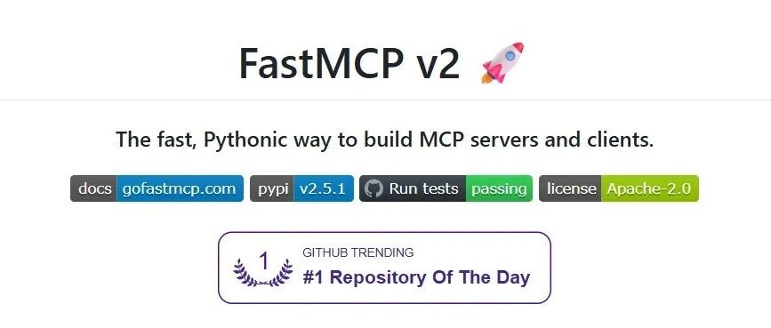

# FastMCP，构建 MCP 的 python 框架，比官方 SDK 更好用！

原文链接: https://mp.weixin.qq.com/s/Sn_81RKOF-ileXfXd19f6g





前文我们基于官方的 python SDK，介绍服务端、客户端的编码实现，以及基于 MCP 的数学运算智能问答应用（[MCP：编程实战，手把手教你服务端的开发与功能验证](https://mp.weixin.qq.com/s?__biz=Mzk0Mjc0OTY1OA==&mid=2247484718&idx=1&sn=70832a64ced461ccc73292812a90addf&scene=21#wechat_redirect)；[MCP：编程实战，基于 SSE 传输方式的客户端编码实现](https://mp.weixin.qq.com/s?__biz=Mzk0Mjc0OTY1OA==&mid=2247484770&idx=1&sn=e8af04cbc7063bfbfe549c17954ee501&scene=21#wechat_redirect)；[MCP：编程实战，手把手教你实现数学运算智能问答应用](https://mp.weixin.qq.com/s?__biz=Mzk0Mjc0OTY1OA==&mid=2247484801&idx=1&sn=63dcf4a64b6f841d49dfcc64a1449f81&scene=21#wechat_redirect)）。本文介绍 FastMCP，一个比官方 SDK 更好用的 python 框架。

**相比官方 SDK，FastMCP的 API 设计更加简洁、开发效率更高，且具备更强的可扩展性，支持多种客户端/服务端传输模式（Stdio、SSE、内存）、资源模板机制，极大地降低了 MCP 服务器与客户端的开发门槛**。

笔者在使用 FastMCP 进行开发，最大的感悟是：**与官方 SDK 相比，FastMCP 极大地降低了客户端的开发成本（一句代码，即可创建 MCP 客户端）。**

本文是 MCP 系列文章的第六篇。本文的主要内容：

1. FastMCP 介绍
2. 开发示例：基于 FastMCP 的数学运算智能问答应用实现


### FastMCP

* 项目地址：https://github.com/jlowin/fastmcp
* 项目文档地址：https://gofastmcp.com/getting-started/welcome

#### FastMCP 与官方 SDK 的关系

FastMCP 是构建 MCP 服务器和客户端的标准框架。FastMCP 1.0 已被纳入官方 MCP Python SDK。

当前 FastMCP 已更新至 2.0 版本，2.0 版本通过引入完整的客户端支持、服务器组合、OpenAPI/FastAPI 集成、远程服务器代理、内置测试工具等功能，显著扩展了 1.0 版本的基础服务器构建能力。

#### 为什么选择FastMCP？

MCP 协议功能强大，但其实现涉及大量重复性工作——包括服务器设置、协议处理器、内容类型处理和错误管理等。FastMCP处理了所有复杂的协议细节和服务器管理，让开发者能专注于构建优质工具。其设计特点包括：

* 🪄 **高级抽象**：通常只需通过装饰器（Decorator）即可定义功能；
* 🌱 **延续性创新**：FastMCP 1.0的核心概念已被贡献给官方 MCP SDK，而FastMCP 2.0（当前项目）作为活跃开发的版本，新增了多项增强功能，包括：强大的客户端库、服务器代理与组合模式、OpenAPI/FastAPI集成、其他扩展能力。

#### FastMCP的设计目标

* 🚀 **快速**：高级接口减少代码量，加速开发进程
* 🍀 **简洁**：以最小化样板代码构建MCP服务器
* 🐍 **符合Python习惯**：让Python开发者自然上手
* 🔍 **完整**：全面支持MCP核心规范的服务器和客户端实现

### 开发示例

#### 安装

运行以下命令，安装 FastMCP：

```
uv pip install fastmcp  

```
#### 服务端实现

```
from fastmcp import FastMCP  
  
mcp = FastMCP(name="MyAssistantServer")  
  
  
@mcp.tool()  
def add(a: float, b: float) -> float:  
    """加法运算  
  
    参数:  
    a: 第一个数字  
    b: 第二个数字  
  
    返回:  
    两数之和  
    """  
    return a + b  
  
  
@mcp.tool()  
def subtract(a: float, b: float) -> float:  
    """减法运算  
  
    参数:  
    a: 第一个数字  
    b: 第二个数字  
  
    返回:  
    两数之差 (a - b)  
    """  
    return a - b  
  
  
@mcp.tool()  
def multiply(a: float, b: float) -> float:  
    """乘法运算  
  
    参数:  
    a: 第一个数字  
    b: 第二个数字  
  
    返回:  
    两数之积  
    """  
    return a * b  
  
  
@mcp.tool()  
def divide(a: float, b: float) -> float:  
    """除法运算  
  
    参数:  
    a: 被除数  
    b: 除数  
  
    返回:  
    两数之商 (a / b)  
  
    异常:  
    ValueError: 当除数为零时  
    """  
    if b == 0:  
        raise ValueError("除数不能为零")  
    return a / b  
  
  
if __name__ == "__main__":  
    mcp.run(transport='sse', host="127.0.0.1", port=8001)  

```
#### 客户端实现

只需一行代码（指定连接到服务端的方式），即可创建 MCP 客户端：

```
async def main():  
    # 测试 mcp 客户端的功能  
    async with Client("http://127.0.0.1:8001/sse") as mcp_client:  
        tools = await mcp_client.list_tools()  
        print(f"Available tools: {tools}")  
        result = await mcp_client.call_tool("add", {"a": 5, "b": 3})  
        print(f"Result: {result[0].text}")  

```
#### 数学运算智能问答应用

基于 FastMCP 实现的数学运算智能问答应用实现如下（详细设计思路，可阅读前文：[MCP：编程实战，手把手教你实现数学运算智能问答应用](https://mp.weixin.qq.com/s?__biz=Mzk0Mjc0OTY1OA==&mid=2247484801&idx=1&sn=63dcf4a64b6f841d49dfcc64a1449f81&scene=21#wechat_redirect)）

```
class LLMClient:  
    """LLM客户端，负责与大语言模型API通信"""  
  
    def __init__(self, model_name: str, url: str, api_key: str) -> None:  
        self.model_name: str = model_name  
        self.url: str = url  
        self.client = OpenAI(api_key=api_key, base_url=url)  
  
    def get_response(self, messages: list[dict[str, str]]) -> str:  
        """发送消息给LLM并获取响应"""  
        response = self.client.chat.completions.create(  
            model=self.model_name,  
            messages=messages,  
            stream=False  
        )  
        return response.choices[0].message.content  
  
  
class ChatSession:  
    """聊天会话，处理用户输入和LLM响应，并与MCP工具交互"""  
  
    def __init__(self, llm_client: LLMClient, mcp_client: Client, ) -> None:  
        self.mcp_client: Client = mcp_client  
        self.llm_client: LLMClient = llm_client  
  
    asyncdef process_llm_response(self, llm_response: str) -> str:  
        """处理LLM响应，解析工具调用并执行"""  
        try:  
            # 尝试移除可能的markdown格式  
            if llm_response.startswith('```json'):  
                llm_response = llm_response.strip('```json').strip('```').strip()  
            tool_call = json.loads(llm_response)  
            if"tool"in tool_call and"arguments"in tool_call:  
                # 检查工具是否可用  
                tools = await self.mcp_client.list_tools()  
                if any(tool.name == tool_call["tool"] for tool in tools):  
                    try:  
                        # 执行工具调用  
                        result = await self.mcp_client.call_tool(  
                            tool_call["tool"], tool_call["arguments"]  
                        )  
  
                        returnf"Tool execution result: {result}"  
                    except Exception as e:  
                        error_msg = f"Error executing tool: {str(e)}"  
                        logging.error(error_msg)  
                        return error_msg  
                returnf"No server found with tool: {tool_call['tool']}"  
            return llm_response  
        except json.JSONDecodeError:  
            # 如果不是JSON格式，直接返回原始响应  
            return llm_response  
  
    asyncdef start(self, system_message) -> None:  
        """启动聊天会话的主循环"""  
        messages = [{"role": "system", "content": system_message}]  
        whileTrue:  
            try:  
                # 获取用户输入  
                user_input = input("用户: ").strip().lower()  
                if user_input in ["quit", "exit", "退出"]:  
                    print('AI助手退出')  
                    break  
                messages.append({"role": "user", "content": user_input})  
  
                # 获取LLM的初始响应  
                llm_response = self.llm_client.get_response(messages)  
                print("助手: ", llm_response)  
  
                # 处理可能的工具调用  
                result = await self.process_llm_response(llm_response)  
  
                # 如果处理结果与原始响应不同，说明执行了工具调用，需要进一步处理  
                while result != llm_response:  
                    messages.append({"role": "assistant", "content": llm_response})  
                    messages.append({"role": "system", "content": result})  
  
                    # 将工具执行结果发送回LLM获取新响应  
                    llm_response = self.llm_client.get_response(messages)  
                    result = await self.process_llm_response(llm_response)  
                    print("助手: ", llm_response)  
  
                messages.append({"role": "assistant", "content": llm_response})  
  
            except KeyboardInterrupt:  
                print('AI助手退出')  
                break  
  
  
asyncdef main():  
    asyncwith Client("http://127.0.0.1:8001/sse") as mcp_client:  
        # 初始化LLM客户端，使用通义千问模型  
        llm_client = LLMClient(model_name='qwen-plus-latest', api_key=os.getenv('DASHSCOPE_API_KEY'),  
                               url='https://dashscope.aliyuncs.com/compatible-mode/v1')  
  
        # 获取可用工具列表并格式化为系统提示的一部分  
        tools = await mcp_client.list_tools()  
        dict_list = [tool.__dict__ for tool in tools]  
        tools_description = json.dumps(dict_list, ensure_ascii=False)  
  
        # 系统提示，指导LLM如何使用工具和返回响应  
        system_message = f'''  
                你是一个智能助手，严格遵循以下协议返回响应：  
  
                可用工具：{tools_description}  
  
                响应规则：  
                1、当需要计算时，返回严格符合以下格式的纯净JSON：  
                {{  
                    "tool": "tool-name",  
                    "arguments": {{  
                        "argument-name": "value"  
                    }}  
                }}  
                2、禁止包含以下内容：  
                 - Markdown标记（如```json）  
                 - 自然语言解释（如"结果："）  
                 - 格式化数值（必须保持原始精度）  
                 - 单位符号（如元、kg）  
  
                校验流程：  
                ✓ 参数数量与工具定义一致  
                ✓ 数值类型为number  
                ✓ JSON格式有效性检查  
  
                正确示例：  
                用户：单价88.5买235个多少钱？  
                响应：{{"tool":"multiply","arguments":{{"a":88.5,"b":235}}}}  
  
                错误示例：  
                用户：总金额是多少？  
                错误响应：总价500元 → 含自然语言  
                错误响应：```json{{...}}``` → 含Markdown  
  
                3、在收到工具的响应后：  
                 - 将原始数据转化为自然、对话式的回应  
                 - 保持回复简洁但信息丰富  
                 - 聚焦于最相关的信息  
                 - 使用用户问题中的适当上下文  
                 - 避免简单重复使用原始数据  
                '''  
        # 启动聊天会话  
        chat_session = ChatSession(llm_client=llm_client, mcp_client=mcp_client)  
        await chat_session.start(system_message=system_message)  
  
if __name__ == "__main__":  
    asyncio.run(main())  

```
#### 运行验证

1. 运行服务端：python fast\_mcp\_server.py


1. 运行数学运算智能问答应用

```
D:\python_project\mcp_learning\.venv\Scripts\python.exe D:\python_project\mcp_learning\fast_mcp\fast_mcp_client.py   
用户: 现在要购买一批货，单价是 1034.32423，数量是 235326。商家后来又说，可以在这个基础上，打95折，折后总价是多少？  
助手:  {  
  "tool": "multiply",  
  "arguments": {  
    "a": 1034.32423,  
    "b": 235326  
  }  
}  
助手:  {  
  "tool": "multiply",  
  "arguments": {  
    "a": 243403383.74898,  
    "b": 0.95  
  }  
}  
助手:  折后总价是231233214.56。  
用户: 我和商家关系比较好，商家说，可以在上面的基础上，再返回两个点，最后总价是多少？  
助手:  {  
  "tool": "multiply",  
  "arguments": {  
    "a": 231233214.56153098,  
    "b": 0.98  
  }  
}  
助手:  最终总价是226608550.27。  
用户: quit  
AI助手退出  
  
Process finished with exit code 0  

```
