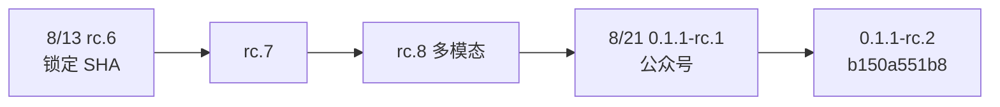
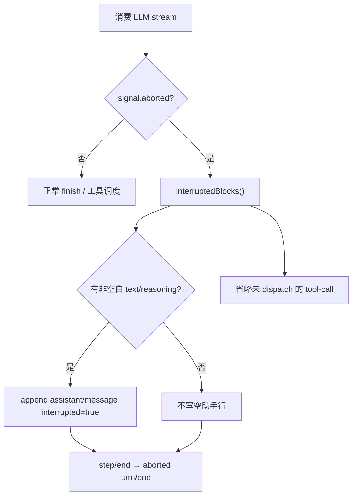

# deepseek-harness Incremental Note（2026-08-24）

这不是第二轮 S0–S8。原调研锁定 SHA 不变；本文只核对 **锁定日之后** 的增量，判断有没有超出 G-001～G-004 的新机制值得内化。

**不改** AgenticX 生产代码。不创建实施 plan。

## 对照基线

| 项 | 值 |
|---|---|
| 原调研锁定 | `47f943859bef60e4160492346772ded9b24f765a` · 2026-08-13 19:38 CST · `feat/npm-public`（v0.1.0-rc.6） |
| 本地 `upstream/` | **仍停在锁定 SHA**（未 `reset` / 未重锁） |
| 增量对照 | `b150a551b8` · 2026-08-21 · **0.1.1-rc.2**（GitHub compare `ahead_by=854`） |
| 中间发版 | rc.7 → rc.8（约 8/19–20）→ 0.1.1-rc.1 / rc.2（8/21） |
| 触发 | 微信推文 [mp.weixin.qq.com/s/dfZ8atf11PcOy_GwGiANMQ](https://mp.weixin.qq.com/s/dfZ8atf11PcOy_GwGiANMQ)；原文过验证墙，转载对齐 [新京报 8/21「增加多模态能力」](https://www.bjnews.com.cn/detail/1787316597129087.html) |
| 证据来源 | GitHub compare + `gh` commit 列表 + raw `b150a551b8` 源码；DeepWiki 仅作加速，不以 wiki 代替行号 |
| 运行时验证 | static_only（未重跑 `pnpm dsh`） |

原结论 **SELECTIVE_ADOPT（G-001～G-004）仍然成立**。推文是预览版产品迭代通告，不是新的 harness 理论。

## 推文对应什么

公众号列的是 rc.7 / rc.8 / 0.1.1 产品面：

- DeepSeek 适配器可开原生图片；`/goal` `/plan` 带图；`@` 引用文件和会话
- MCP/ACP 图片附件持久化；PTC 转发嵌套图
- Claude Code / Codex 改成按需 Profile Bundle
- Windows 持久 PowerShell

这些不推翻长程四条，也不构成换微内核的理由（维持 G-008）。

---

## D-001 取消流把已展示前缀写成模型可见助手消息（本次主缺口）

- User problem: 工作区已知「SSE 中止后 UI 与 `messages.json` 不一致」；用户取消或断连后追问「展开第二点」时，模型看不到用户已经读过的前缀。G-001 管的是未完成 `tool_calls` 的 closer，**不管已流出正文**。
- Upstream evidence: D-U1, D-U2, D-U3
- AgenticX current state: Studio 层会把 meta `TOKEN` 拼进 `chat_history`（`interrupted-partial`），但下一轮 LLM 读的是 `agent_messages`；运行时在用户停流时直接 `return`，不把前缀写入 `agent_messages`。
- Actual gap: **用户看见的前缀没有进入模型上下文。** 磁盘/UI 有残句，模型没有。
- Value: high
- Cost: low–medium
- Regression risk: medium（必须继续保证 tool pairing；半截 tool_call 不得落成未配对调用）
- Decision: **P1（增量）**
- Minimal adoption: 用户取消 / 客户端停流时，把**已对用户可见的正文（及可选 reasoning）**写入 `agent_messages` + `chat_history`，标记 `interrupted: true`（或现有 `source=interrupted-partial` 但必须进入 sanitizer 保留集）；半截 tool_call **整段丢弃**。再走现有 persist。
- Scope boundary: 不迁 SessionEvent / `deriveMessages()` / Cordis；不把 `[interrupted by user]` 当新协议；provider 失败流仍丢前缀（与上游不对称一致）；不改 G-001 closer。
- Acceptance evidence: 单测对照 `cancel.spec.ts`「mid-stream finalize」：① 流到一半取消 → 历史有前缀且 `interrupted`；② 下一轮 mock LLM 请求的 assistant 含该前缀；③ 半截 tool_call 不出现；④ 无可见内容则不写空助手行。

### 上游机制（`b150a551b8`）

`ReactLoopAgent.step()` 在消费模型流时若 `signal.aborted`，用 `BlockAssembler.interruptedBlocks()` 取出已关闭/仍打开的非空白 `text` 与 `reasoning`，写成该 step 的 `assistant/message`（`interrupted: true`，`surfaceOp: 'append'`），再抛错结束 step/turn。工具块故意省略：中断发生在 dispatch 前，没有真实 tool result。

锁定日的本地 `upstream/` **没有** 这篇 note（`2026-08-10-cancelled-stream-prefix-finalize.md` 是锁定后才进 master 的）。

| ID | 证据 |
|----|------|
| D-U1 | `packages/core/agent-loop/src/agent.ts` `ReactLoopAgent.step` L332–371：`catch` 里 `assembler.interruptedBlocks()` → `session.append('assistant/message', { interrupted: true, ... })` |
| D-U2 | `packages/core/agent-loop/tests/cancel.spec.ts` L482–514：取消后下一请求 `adapter.requests[1].messages` 含 `'partial'` |
| D-U3 | 同文件 L539–563：已完成正文保留，半截 tool-call 整段丢弃，无 `tool/call` 事件 |
| D-U4 | `.agents/notes/implemented/architecture/2026-08-10-cancelled-stream-prefix-finalize.md`：明确拒绝「永远丢前缀」和「投影时再拼」；provider `error`/`aborted` **不**提交失败请求的流前缀 |

### AgenticX 现状（已核对）

| 能力 | 路径 | 行为 |
|------|------|------|
| SSE 收尾写残句 | `agenticx/studio/server.py` `_finalize_partial_assistant_if_needed` L470–489 | `saw_final` 为假且可见正文非空时，往 **`chat_history`** 追加 `metadata.source=interrupted-partial` |
| 只攒 meta TOKEN | 同文件 `_accumulate_meta_partial_text` L460–467 | `agent_id != "meta"` 或非 `TOKEN` 直接忽略；分身/群成员/纯 reasoning 不进残句 |
| 下一轮模型上下文 | `agenticx/runtime/agent_runtime.py` `run_turn` L3241 | `history = _sanitize_context_messages(session.agent_messages)`，**不读** `chat_history` 残句 |
| 用户停流 | 同文件 `_StreamWatchdogUserStop` L4180–4186、L5188–5194 | 只 `yield ERROR` + `return`，不把 `response_text` / `followup_emitter.raw` 写入 `agent_messages` |
| 中断卡过滤 | `_sanitize_context_messages` L1567–1574 | `kind=turn_interrupted` 对模型不可见（正确：那是 UI 通知，不是前缀） |
| 完成态判定 | `agenticx/studio/session_manager.py` L79–82、L966–984 | `interrupted-partial` 不算「本轮已完成答复」（应保留） |

因此：Studio 已经在 **给用户看的历史** 里补残句；缺口在 **给模型看的 `agent_messages`**。这与上游「`deriveMessages()` 必须含用户仍可见的助手内容」是同一原则，落点不同。

### 建议内化（原则，不是搬代码）

1. 在 `_StreamWatchdogUserStop` / `should_stop` 导致 `return` **之前**，若已有可见前缀：写入 `agent_messages`（provider 安全：纯 text，无半截 `tool_calls`）并同步 `chat_history`（可复用 `interrupted-partial` + `interrupted: true`）。
2. `_sanitize_context_messages` **保留** 这类 assistant 行（与过滤 `turn_interrupted` 通知相反）。
3. 空前缀不写。半截 tool_call 不写；已发出且未返回的调用仍走 G-001 closer。
4. provider 确认失败（非用户取消）默认仍丢该次失败流的前缀，避免把错误请求的半截字当成事实。

---

## 观察项（本次不升级为 P1）

### D-002 同轮重试耗尽后终态错误仍要可见

- 上游：`fix(ui-conversation): render the terminal turn error after same-turn retries exhaust`（约 2026-08-20）。
- 关系：G-003 overflow 同轮 retry 落地时的验收补丁，不是独立课题。
- Decision: **挂在 G-003 AC 上**，不单独立项。

### D-003 单图准入 + 会话历史图载荷预算

- 上游：rc.8 / 0.1.1 统一 Files 管线、canonical 编码、过大图 / 多轮历史图撑爆。
- 关系：Desktop 已有附图；长会话真出故障再做。
- Decision: **P2 / 观察**。禁止搬 Files/WebP/region 管线。

### D-004 Agent Teams（experimental）

- 上游：`3546f595b9` `feat(team): add durable Agent Teams runtime`（2026-08-14）；后标 experimental。Lead session 日志里的花名册、queued→delivered mailbox、带 revision 的 task board。
- 关系：与群聊 / `team_manager` / 委派同域，但是另一套事件日志内核。
- Decision: **不迁运行时**。原则可记：队友状态跟 Lead 会话一起落盘。现有路由够用则不做。

### D-005 `reportDelivery: wakeup`

- 上游在 **锁定日前** 已存在（默认唤醒停驻父级，不 steering 进行中的轮次）。推文是在复述。
- 关系：Meta 已有完成/失败汇报，更多靠轮询或下次用户开口。
- Decision: **NO-GAP（相对锁定调研）**。若委派后 Meta 经常「做完却不说话」，再对照，不单独立项。

### 明确继续不做

- Cordis / 四种运行模式 / PTC / 创造模式（G-008）
- 把 CC/Codex Profile Bundle 当默认编排（已有 `cc_bridge`）
- 重写 `messages.json` 为 SessionEvent JSONL
- 跟随他们的 SQLite 物理压缩（官方提示 **数据结构不兼容**）
- 把聊天条 cache-hit UI 当本次范围（仓库已有独立 cache-hit plan）

## 优先级 → 增量 verdict

| ID | Decision |
|----|----------|
| D-001 | P1（增量，互补 G-001） |
| D-002 | 并入 G-003 AC |
| D-003 | P2 |
| D-004 | 观察 / 不迁 |
| D-005 | NO-GAP |

无新 P0。G-001～G-004 **不重开**。仅 D-001 值得在现有长程加固之外单独记一笔。

若进入实施：只动 `agent_runtime.py` 停流 `return` 前的落盘 + sanitizer 保留规则；`server.py` 已有 `interrupted-partial` 可复用，**禁止整段替换 import**。实施前单独写 plan，本文不是 plan。
