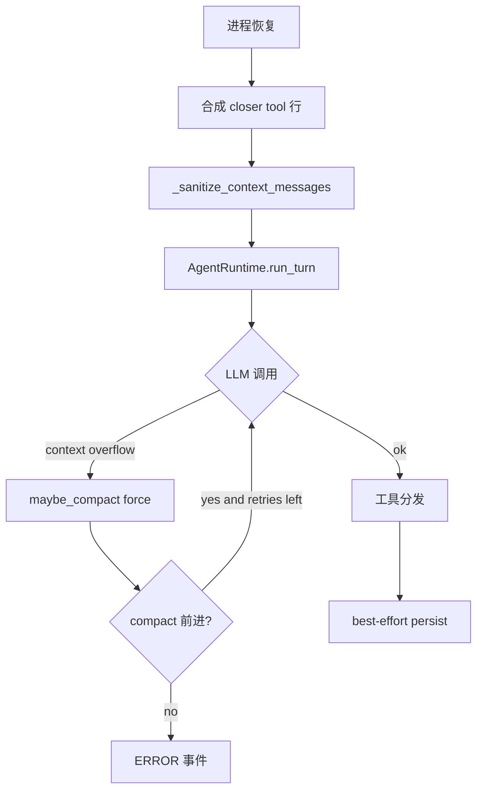

# deepseek-harness AgenticX Proposal

## Decision
- Verdict: SELECTIVE_ADOPT
- Why:
  - G-001 / E-007：崩溃续跑应合成「未开始 / 结果未知」tool 结果，而不是剥离 tool_calls（Studio 热路径现状）。
  - G-003 / E-012：provider 确认 context overflow 后应在 **同一 round** compact+retry；`is_context_window_exceeded_error` 目前无调用点。
  - G-002 / E-009 与 G-004 / E-016：fail-closed 副作用屏障与「新鲜子智能体 + 有界 handoff」是可内化原则，但不是换掉整个 harness。
- Now: 1–2 周内仅在 `AgentRuntime` 热路径落地 G-003 + G-001（overflow 同轮 retry + 中断 closer 语义）。**本调研不创建 `.cursor/plans/`，需用户单独要求实施。**
- Later: G-002 fail-closed flush；G-004 中性名 fresh-round 工具（默认关闭）。
- Explicitly not doing:
  - 迁入 Cordis / Web UI / Landlock / Typert / dsh Python SDK 产品面（G-008）
  - 把 `messages.json` 重写成 dsh SessionEvent JSONL/zstd
  - 移植 `goal-round-driver` 或 workflow worker-thread（G-005, E-019）
  - 替换 `LoopDetector` 为 advisory-only reminder（G-007）
  - 在 git/PR 中使用第三方品牌或「对齐 X」表述

## 1. Background and boundaries

DeepSeek Harness（MIT，developer preview，SHA `47f943859bef60e4160492346772ded9b24f765a`）用插件瀑布把长程可靠性做成 **loop 旁路能力**：事件日志、崩溃 closer、副作用前 flush、overflow 同轮 retry、Ralph 上下文复位。

AgenticX Studio/Desktop 热路径是 `AgentRuntime`，已有压缩、循环检测、best-effort persist、longrun、project_state。缺口是 **语义质量**（closer / fail-closed / overflow retry）和 **可选的上下文复位循环**，不是缺少整个编排器。

In scope：上述四条机制的原则内化到 Python runtime。  
Out of scope：dsh 产品壳、插件微内核、沙箱 native、Web。

## 2. Verified upstream mechanisms

见 `deepseek-harness_source_notes.md` E-001–E-022。实施只引用：

| 机制 | Gap | 故意排除的上游模块 |
|------|-----|-------------------|
| `interruptedTurnClosers` | G-001 | JSONL coordinator 全量 |
| `session-checkpoint-policy` | G-002 | Cordis `llm/stream` waterfall |
| `BasicCompactionEngine` overflow retry | G-003 | compaction lock 事件类型、surface replaceGeneration 整套 |
| `tool-ralph` 固定脚本 | G-004 | `workflow-worker-thread`、Ralph 品牌工具名 |

## 3. Minimal transferable principles and invariants

1. **崩溃修复保 pairing，且告诉模型「能否安全重试」**（E-007）。
2. **模型/工具副作用之前，前缀必须已持久化；失败则不做副作用**（E-009）。
3. **provider 确认的 overflow 与「主动压力压缩」分流：前者强制减面并重试当前请求**（E-012）。
4. **超长程用上下文复位 + workspace SoT + 有界 handoff，而不是无限拉长同一 transcript**（E-016）。模型不能改循环结构。
5. **新行为挂在现有 hook/运行时边界，不改 loop 主干控制流除非文档化**（dsh 自己的规则；AgenticX 对应 `no-scope-creep`）。

## 4. AgenticX design

### API/SDK contract

- G-001：resume 路径对 `chat_history`/`agent_messages` 在 sanitizer **之前**插入合成 `role=tool` 行；文案中英由产品定，语义对齐 NOT_STARTED / OUTCOME_UNKNOWN。
- G-003：`AgentRuntime` 捕获 context-window 类错误 → `maybe_compact(force=True)` → 同一 round 重试；配置 `runtime.max_overflow_retries`（默认 2）。
- G-002（Later）：`persist_or_abort()` 替代 swallow。
- G-004（Later）：一个 opt-in 工具，参数 `{objective, max_rounds?}`，返回 `{status, rounds_started, report}`。

### Modules and data flow

G-002 落地后将 `G` 改为 LLM/工具前的 fail-closed flush。

### Algorithms/policies

- Overflow retry 计数 per-turn，成功 LLM 响应后清零（对齐 E-012 idle/assistant-message 清零）。
- Closer：只在加载/resume 补一次，不在 live 生成中伪造 turn/end。
- Ralph-like：`inheritsParentContext=false`；handoff JSON 字段固定 `status/summary/evidence/nextSteps/blocker`；超长拒绝而非截断（E-016）。

### Errors and observability

- persist 失败：结构化 ERROR，含 session_id，不静默。
- overflow retry：现有 COMPACTION 事件 + retry 计数。
- closer：metadata.kind 可区分 `interrupted_tool_not_started` / `interrupted_tool_outcome_unknown`（内部字段，UI 可折叠）。

## 5. Integration phases: PoC → MVP → stabilization

PoC（Now，对应 G-003 + G-001）：

- 接线 `is_context_window_exceeded_error` + compact retry。
- resume 合成 closer。
- 单测不依赖真实 LLM。

MVP（Later，G-002）：

- LLM/工具前 flush 失败则跳过副作用。

Stabilization（Later，G-004）：

- opt-in fresh-round 工具 + 文档；默认关闭。

## 6. Evaluation: tasks, metrics, regression gates

| 任务 | 度量 | 回归门 |
|------|------|--------|
| overflow retry | 第一次 overflow、第二次成功的 mock | `tests/test_smoke_*` 新用例：retry≤max；compact 被调用 |
| closer | 构造 dangling tool_calls 历史 | sanitizer 后 pairing 合法；文案含「未开始」或「结果未知」 |
| persist fail-closed（MVP） | persist 抛错 | LLM/tool mock call count = 0 |
| fresh-round（stabilization） | 两轮 fake child | 第二轮无父 transcript；handoff 超长失败 |
| 既有 | LoopDetector、compactor、longrun 单测 | 全绿；不改无关路径（no-scope-creep） |

不发明线上基准。dsh `BENCHMARK.md` 未提供可引用数字。

## 7. Risks and rollback

- compact retry 死循环：硬上限 + 「消息数/token 必须下降」才 retry。
- closer 文案导致模型盲目重试写操作：OUTCOME_UNKNOWN 必须保留「先核验外部状态」。
- fail-closed 放大存储抖动：可先 warn+metric 一版，再切硬失败（若用户要求更稳再硬切）。
- Rollback：各 Gap 独立 feature flag（`runtime.overflow_retry` / `runtime.interrupted_closers`），默认新行为可先 off。

## 8. 下一步规划调整

1. **本调研归档，不自动开实施分支。** 若要落地，请单独下令写 plan（`.cursor/plans/pending/`），Suggested-Impl-Model：G-001/G-003 用代码专精中档即可；G-004 工具契约再用强推理档收口。
2. 实施顺序：G-003 → G-001 → G-002 → G-004。不要并行铺 Cordis 式插件树。
3. 规划调整：**不要**把 dsh 当新的默认 Desktop 运行时；**不要**用 Ralph/goal 替换 `longrun`/`project_state`。它们解决的是「同会话窗口」与「跨任务编排」，互补而非替代。
4. 重新评估触发：dsh 发布稳定 tag 且 `SESSION_FORMAT_VERSION > 0`；或 Studio 上 overflow/崩溃续跑仍在生产复现且 PoC flag 数据不足。
