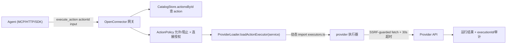

# open-connector Source Notes

Locked SHA: `eb4cb13921cfa489cea2efdbd9df56a84eebe4c1` (main, shallow clone)

## Problem and boundaries

### Solves
- 连接器供给：一个网关收纳 1,579 个 provider / 11,464 个 Action（E-001），以「账号连接」为单位管理 OAuth2/API key/自定义凭据，凭据留在网关运行时内，不交给 Agent 进程（E-003/E-007）。
- 对 Agent 的暴露面：HTTP `/v1/actions/*`、OpenAPI `/openapi.json`、MCP `POST /mcp`、SDK、CLI 五种通道（E-002）；MCP 端点只暴露 5 个固定工具（list_apps / list_connections / search_actions / get_action_guide / execute_action），用「搜索-发现-执行」收纳上万 Action 而非平铺工具表（E-003）。
- 治理面：runtime token / admin token / JWT、action allow/block 策略、运行审计与脱敏日志、凭据加密存储（E-004）。
- 部署面：Docker/GHCR、单文件二进制、Cloudflare Workers、Fly.io、Helm、以及可嵌入的 headless npm 包 `@oomol-lab/open-connector`（E-004）。

### Does not solve
- 不是 MCP server 目录/市场：它的 1,579 个 provider 不是 1,579 个 MCP server，离了网关运行时无法单独安装（E-006）。
- OAuth 托管要靠 OOMOL 商业服务；自托管时 OAuth client 需自行向各 provider 注册（README Quick Start NOTE，E-012 同文件）。
- 进程内嵌入要求 Node 22.18+ / Bun 1.4+；AgenticX 桌面 Electron 34.5.8 内置 Node 20.19.1，不满足（E-005 vs A-4）。

## Runtime validation
- Command: 未执行运行时（无 Docker/独立 Node 22 环境，且研究阶段不引入依赖）。
- If not run, reason: static_only —— 全部结论来自锁定 SHA 的本地源码静态审读。

## Core abstractions
| Name | Responsibility | Exact source location |
|---|---|---|
| ProviderDefinition | provider 元数据唯一事实源：service/displayName/categories/authTypes/auth(oauth2 授权项+api_key)/homepageUrl/actions/triggers | `src/core/types.ts` + `src/providers/github/definition.ts:24-92` (E-007) |
| defineProviderAction | action 声明：id=`service.name`、operationType(read/write/destructive)、input/outputSchema、requiredScopes | `src/core/provider-definition.ts:7-44` (E-008) |
| CatalogStore | 生成目录的内存视图：providers/actionsById/可执行集合；schema 剥离的列表投影 + ETag 缓存 | `src/catalog-store.ts:43-80` (E-006) |
| ProviderLoader | 懒加载：registry 映射 service→`() => Promise<ExecutorModule>`，仅执行时 import | `src/providers/provider-loader.ts:8-77` (E-009) |
| McpServer (createMcpServer/handleMcpRequest) | 无状态 Streamable HTTP MCP，5 工具固定面 | `src/mcp.ts:145-189` (E-003) |
| createConnectorRuntime | headless 嵌入入口：dataDir/publicOrigin/encryptionKey/adminToken/runtimeToken/jwt/postgres/actionPolicy | `docs/headless.md:26-92` (E-004) |
| provider-runtime 共享设施 | 错误工厂(400/502)、30s 默认超时、SSRF 守护 fetch、executors/proxy 定义器 | `src/providers/provider-runtime.ts:316,324,657,1005,1036,1374` (E-010) |
| MarketplaceService | 网关自身可接 OOMOL 托管 SaaS 动作市场（discovery URL + API key + 兼容动作集） | `src/marketplace/marketplace-service.ts:19-88` (E-011) |

## Main execution path

## Failure and fallback behavior
| Failure | Handling | Evidence ID |
|---|---|---|
| 未知 action | `unknown_action` 错误码，MCP isError 标记 | E-003 (`src/mcp.ts:289-291,326-329`) |
| 连接缺失/被策略拒绝 | `connection_not_found` / 策略 decision code，execute 前置校验 | E-003 (`src/mcp.ts:300-315,337-347`) |
| provider 请求失败 | providerInputError(400)/providerResponseError(502)/ProviderRequestError；abort/timeout→504 | E-010 |
| SSRF/重定向 | assertPublicHttpUrl 校验请求与每个重定向 Location，DNS 解析地址默认校验 | E-010 (AGENTS.md 规则 + guarded-fetch.ts) |
| 远端 MCP provider 工具异常 | 列表限流 10k 工具/16MB/60s，重复工具名→502 | E-013 (`src/providers/mcp-tools.ts:22-25,103-117`) |

## Extension points
| Extension | Contract | Evidence ID |
|---|---|---|
| 新增 provider | `src/providers/<service>/{definition,actions,executors}.ts` + `npm run generate:catalog`；`.codex/skills/add-provider/SKILL.md` 为标准工作流 | E-014 |
| 选定 provider 构建 | `getConnectorBuildOptions({providers:[...]})`，运行时 API 不变 | E-015 (`docs/headless.md:137-162`) |
| 策略扩展 | actionPolicy 按 `service.*`/`*` 允许/阻止；连接级 evaluateConnection | E-004 |

## Evidence
| Evidence ID | Claim | Source type | Exact location | SHA/number | Confidence |
|---|---|---|---|---|---|
| E-001 | 1,579 个 provider 目录、1,578 个含 executors.ts、11,464 处 defineProviderAction | local-source | `src/providers/` 统计（git ls-files / find / grep） | eb4cb13 | high |
| E-002 | 路由面：`/v1/providers|actions|apps|proxy`、`/api/*` 管理面、`POST /mcp`、`GET /mcp/tools`、`/openapi.json` | local-source | `src/server/connect-server.ts:204-416` | eb4cb13 | high |
| E-003 | MCP 固定 5 工具、无状态 Streamable HTTP、策略/连接前置校验、错误码体系 | local-source | `src/mcp.ts:39-189,284-376` | eb4cb13 | high |
| E-004 | headless 嵌入运行时 createConnectorRuntime 及其选项（加密/token/策略/PG） | local-source | `docs/headless.md:26-92` | eb4cb13 | high |
| E-005 | 嵌入要求 Node 22.18+ / Bun 1.4+ | local-source | `docs/headless.md:7` | eb4cb13 | high |
| E-006 | 目录格式：definition.ts 为源，generate:catalog 生成 catalog/apps/*.json；运行时附加 locallyExecutable/catalogOnly/needsCredential/noAuthRunnable | local-source | `docs/catalog-format.md:1-31`、`src/catalog-store.ts:43-80` | eb4cb13 | high |
| E-007 | provider 三件套结构与 OAuth 授权项模型（scope 分级 risk） | local-source | `src/providers/github/definition.ts:24-92`、`executors.ts:24-88` | eb4cb13 | high |
| E-008 | action 声明模型与 id 规则 | local-source | `src/core/provider-definition.ts:7-44` | eb4cb13 | high |
| E-009 | 懒加载执行器注册表 | local-source | `src/providers/provider-loader.ts:8-77` | eb4cb13 | high |
| E-010 | 共享运行时设施：错误工厂/超时/SSRF 守护 fetch/定义器 | local-source | `src/providers/provider-runtime.ts:316,324,657,1005,1036,1374` | eb4cb13 | high |
| E-011 | 网关内置 OOMOL SaaS 动作市场客户端 | local-source | `src/marketplace/marketplace-service.ts:19-88` | eb4cb13 | high |
| E-012 | Apache-2.0 + 第三方商标/品牌资产明确不授权 | local-source | `LICENSE.txt`、`README.md:277-293` | eb4cb13 | high |
| E-013 | 网关自身可作为 MCP 客户端接入远端 provider，带列表限额 | local-source | `src/providers/mcp-tools.ts:22-25,80-140` | eb4cb13 | high |
| E-014 | provider 贡献工作流（add-provider skill） | local-source | `.codex/skills/add-provider/SKILL.md:1-25` | eb4cb13 | high |
| E-015 | 选定 provider 的构建裁剪 | local-source | `docs/headless.md:137-162` | eb4cb13 | high |
| E-016 | 测试：MCP 工具摘要/指令断言、provider 守护测试、市场服务测试 | local-source | `src/mcp.test.ts:115-134`、`src/providers/provider-source-guards.*.test.ts`、`src/marketplace/marketplace-service.test.ts` | eb4cb13 | high |

## Cross-check
| Claim | Evidence | Result (yes/no/partial) | Corrected wording |
|---|---|---|---|
| README「1,000+ providers / 10,000+ Actions」 | E-001 | yes | 实测 1,579 provider 目录 / 11,464 action 声明（含 catalogOnly 部分） |
| 「MCP-ready」= 每个动作一个 MCP 工具 | E-003 | no | 恰好相反：固定 5 个发现型工具，动作按需搜索执行 |
| 目录 JSON 可直接搬进第三方市场当安装源 | E-006 | no | provider 不是 MCP server，无网关运行时不可安装 |
| 可嵌入任意 Node 应用 | E-005 + A-4 | partial | 要求 Node 22.18+；AgenticX Electron 34.5.8 内置 Node 20.19.1，不能进程内嵌，需 sidecar/二进制/Docker |
| OAuth 全托管 | README + E-011 | partial | 托管 OAuth 属 OOMOL 商业服务；自托管需自建各 provider OAuth app |
| 凭据不进 Agent 进程 | E-003/E-007 | yes | 连接与凭据在网关侧，Agent 只拿账号标签与结果 |
| local-only; no external claims | — | yes | DeepWiki/ZRead/GitHub Issue 均不可用，全部主张来自锁定本地源码 |
