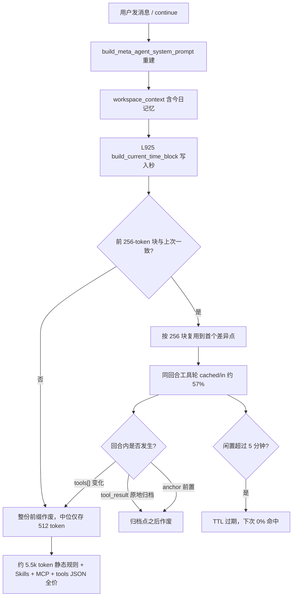
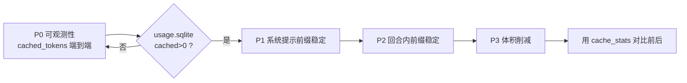

# Kimi 前缀缓存可观测性与 Token 成本优化

> **Archived 2026-08-27.** 从 `.cursor/plans/pending/` 挪出，不再作为实施 backlog。Wave B 已按根目录修订稿落地（`cached_tokens`、`session-context`、日期级时间块）。本文保留计费基线与证据链，供对照命中率 / 成本，不要按本文 FR-1.2 再改 system prompt。
>
> 实施稿：`.cursor/plans/2026-08-21-kimi-prompt-cache-and-token-cost.plan.md`

Planned-with: claude-opus-5
Suggested-Impl-Model: 见「子任务 → 推荐模型」表（P0 用 `gpt-5.6-sol-medium`，P1/P2 用 `kimi-k3-max`，P3 用 `composer-2.5-fast`）

## 背景与根因（不依赖对话上下文，实施者可自行复核）

用户反馈：Near Desktop 在开启知识库（KB）时「响应很快但 Moonshot 账单掉得很快」，怀疑没吃到 Kimi 的 KV cache。

### 证据来源

Moonshot 控制台导出的计费日志（本地路径 `~/Downloads/request_log_part_0001.csv`，4,511 条，2026-08-01 → 2026-08-15，列为 `请求 ID / 模型 / 时间 / 项目名称 / 项目ID / API Key名称 / API Key ID / 输入 Tokens / 输出 Tokens / Cached Tokens`）。

剔除 860 条退化探测请求（`Cached Tokens ∈ {8, 86}` 或输入 < 500，主要是 `kimi-k2.7-code` 的 8-token ping）后，剩 3,128 条真实 agent 请求：

| 指标 | 值 |
| --- | --- |
| 输入 / 缓存命中 / 输出 | 34,492,331 / 15,229,339 / 3,092,903 |
| cached / input | **44.2%** |
| 请求级命中率 | 64.3% |
| 未命中残差（input − cached）中位数 | 2,949 |
| 按 K2.6 官价估算（未命中 ¥6.5、命中 ¥1.1、输出 ¥27 / 1M） | **¥225.5 / 15 天** |

### 证据 1：缓存块粒度是 256 token

真实请求中命中不为 0 的 2,011 条里，**2,001 条的 `Cached Tokens` 是 256 的整数倍**。

结论：Moonshot 按 256-token 块做隐式前缀缓存。可复用长度 = `floor(首个差异位置 / 256) * 256`。**前 256 token 内任何一个字节变化，整份缓存归零。**

### 证据 2：同回合缓存的中位数只有 512 token

按「距上一次请求的间隔」分桶（真实请求，input ≥ 2000）：

| 间隔 | n | 请求命中率 | cached/input | 中位 cached | 中位残差 |
| --- | ---: | ---: | ---: | ---: | ---: |
| < 20s | 2718 | 64% | 43% | **512** | 2,842 |
| 20–60s | 243 | 74% | 56% | 512 | 4,012 |
| 1–5min | 91 | 79% | 49% | 10,240 | 3,324 |
| 5–30min | 34 | **29%** | **6%** | 0 | 16,215 |
| > 30min | 41 | **15%** | **0%** | 0 | 5,011 |

大请求（input ≥ 15k）更极端：< 20s 命中 81% / cached-in 57%；> 30min **16 条命中率 0%**。

两个结论：

1. **中位 cached = 512（2 个块）**说明典型请求的前缀在极浅处就发散了。这与 `base_prompt` 的排布吻合：开头是 `workspace_context`（含「今日记忆」，日内会变），紧接着第 925 行就是带秒的时间块。只有最前面约 512 token 活了下来。
2. **1–5min 桶仍有 79% 命中**，说明发散点不是「每个 HTTP 请求」——同一次 `/api/chat` 内系统提示只构建一次，长回合的多轮工具调用能复用深层前缀（中位 cached 10,240）。**损失集中在回合边界和长时间闲置**。
3. **5min 之后命中率断崖**，是缓存 TTL 过期，不是提示词不稳。仓库里没有任何缓存保活逻辑。

### 证据 3：本地账本对缓存完全失明（这是问题长期没被发现的原因）

`~/.agenticx/usage.sqlite` 的 `usage_events` 表有 6,251 行，其中 `kimi-k2.6` 累计输入 5,348 万 token，但**所有行的 `cached_tokens` 都是 0**——与 Moonshot 侧的 1,523 万缓存完全对不上。

失明链路（三处，缺一不可）：

- `agenticx/llms/response.py:4-10` — `TokenUsage` 只有 `prompt_tokens / completion_tokens / total_tokens`，**没有 `cached_tokens` 字段**。
- `agenticx/llms/litellm_provider.py:588-592`、`agenticx/llms/kimi_provider.py:476-480` — `_parse_response` 构造 `TokenUsage` 时直接丢弃 `usage.prompt_tokens_details.cached_tokens`。
- `agenticx/runtime/usage_metadata.py:57-81` — `usage_metadata_from_llm_response` **优先**读 `response.token_usage`（有 `prompt_tokens` 属性即命中该分支），于是永远走到已被裁剪的 `TokenUsage` 上，`_extract_cached_reasoning_from_usage` 找不到 `prompt_tokens_details` 返回 0，**永远不会回落**到 `response.usage`。

`usage_store` 的表结构（`agenticx/runtime/usage_store.py:21-39`）本身有 `cached_tokens` 列，`compute_cost_usd`（`agenticx/runtime/model_pricing.py:120-131`）也有 `cached_input` 单价——**只有取数这一段是断的**。

### 证据 4：`runtime.prompt_cache` 对 Kimi 是空转

`agenticx/runtime/prompt_cache_policy.py:29-33` 的 `allows_provider` 在 `provider_allowlist` 为空时只放行 `anthropic`，且 `enabled` 默认 `False`（L50）。`agent_runtime.py:3626` 调用后对 Kimi 返回 `cache_mode="unsupported_provider"`、`cache_breakpoints=0`。这是 Anthropic 的显式 `cache_control` 机制，**Moonshot 用的是隐式前缀缓存，不需要打点，只要求前缀字节一致**。当前这段代码对 Kimi 唯一的作用是产生误导性遥测。

### 证据 5：回合内还有三处会打断前缀

对长回合（token 主要消耗地）影响更大：

1. `agenticx/runtime/tool_result_budget.py:248-254` — `apply_tool_result_budget` 对 `age > keep_rounds` 的大工具结果**原地改写**成 `[tool-result-archived]` 摘要。因为每一轮都会有新消息跨过阈值，于是**几乎每轮都在改写历史中段**，该位置之后全部失效。
2. `agenticx/runtime/agent_runtime.py:3092-3120` — `_project_active_tools()` 每轮重建 `ts_ctx`（刷新 MCP 快照）并调 `project_tools_for_round`（`agenticx/runtime/tool_search.py:461`）。`tools[]` 属于被缓存的前缀，回合中途 `tool_search` 加载新工具或 MCP 连接状态变化 → **整份前缀（含系统提示）作废**。
3. `agenticx/runtime/agent_runtime.py:3601-3619` — goal anchor 正常追加在末尾（安全），但 `tool_result_tokens_session >= 12000`（`AGX_ANCHOR_RESTRENGTHEN_THRESHOLD`）时改为**前置插入到系统消息之后**，且内容含 `round N` / `tools_used_so_far=N` 每轮都变——恰好在历史最大、最该缓存的时候切断。

### 证据 6：KB 是放大器不是根因

本地 `knowledge_search` 走 Chroma，不消耗 Kimi token，所以「快」。贵在它带来的 LLM 回合：

- `agent_runtime.py:3554-3573`：`always` 模式在第 1 轮 LLM **之前**强制跑一次 `knowledge_search`，hits JSON 直接进上下文。
- `meta_agent.py:649`：提示词禁止复用上一轮检索结果标 `[N]`，追问必须重新检索 → 多一个工具轮 → 多付一次未命中的系统提示。
- `cli/agent_tools.py:5784-5795`：`hits` 以完整 JSON 回写历史，默认 `top_k=5`、chunk ≈ 800 字，且**永久留在历史里**，之后每轮重复计费。

### 证据 7：输出 token 是成本硬底

真实请求输出 3,092,903 × ¥27/1M = **¥83.5**，占 ¥225.5 的 37%。若缓存命中率提到 80%，总成本约 ¥158.7，此时输出占比升到 53%。

**所以单靠提升缓存命中率，天花板约 30%。剩下一半必须靠减小提示词体积。**

### 成本敏感性（真实请求部分，输出成本固定）

| 缓存命中率 | 估算成本 | 相对当前节省 |
| ---: | ---: | ---: |
| 44.2%（现状） | ¥225.5 | — |
| 60% | ¥196.0 | 13% |
| 70% | ¥177.3 | 21% |
| 80% | ¥158.7 | **30%** |
| 90% | ¥140.1 | 38% |

### 缓存生命周期



## 目标

1. 让缓存命中率**可在本地测量**（当前不可测，是所有优化的前置）。
2. 把典型请求的可复用前缀从中位 **512 token** 提升到系统提示整体（目标 ≥ 8k）。
3. 减小每轮必发的静态提示词体积。
4. 目标：真实请求 `cached/input` 从 44% 提到 ≥ 70%，账单降低 ≥ 20%。

## In scope

- `agenticx/llms/response.py`、`litellm_provider.py`、`kimi_provider.py`、`bailian_provider.py`、`ark_provider.py` 的 usage 解析。
- `agenticx/runtime/usage_metadata.py`、`usage_store.py`。
- `agenticx/runtime/prompts/current_time.py`、`prompts/meta_agent.py`。
- `agenticx/runtime/tool_result_budget.py`、`tool_search.py`、`agent_runtime.py` 的前缀稳定性。
- `agenticx/studio/kb/contracts.py` 的 KB 默认检索模式。
- 对应 `tests/` 冒烟测试。

## Out of scope（严禁顺手改）

- **不改** `enterprise/` 下任何代码，包括 `enterprise/apps/web-portal/src/lib/current-time.ts`（它是本文件的镜像，属独立交付线，本 plan 不动）。
- **不改** Desktop 前端（`desktop/`）。本 plan 全部在 Python 后端。
- **不动** `agenticx/studio/server.py` 的 import 区块（历史事故：整段替换误删 `GroupChatRegistry` 导入导致 `agx serve` 启动即崩）。本 plan 若需改 `server.py`，只允许精确改目标行。
- **不删除** 时间块里的任何行为规则（禁止 `web_search` 查日期等），只改时间精度。
- **不改** `get_current_time_facts()` 的返回结构与 `get_current_datetime` 工具语义。
- 不引入新的第三方依赖。

---

## P0：缓存可观测性（必须最先做，否则后续无法验收）

> 推荐模型：`gpt-5.6-sol-medium`（跨 provider 的 usage 解析收口，序列/兼容性敏感）

### FR-0.1 `TokenUsage` 增加 `cached_tokens` / `reasoning_tokens`

**文件**：`agenticx/llms/response.py:4-10`

before：

```python
class TokenUsage(BaseModel):
    prompt_tokens: int = 0
    completion_tokens: int = 0
    total_tokens: int = 0
```

after（**只新增字段，默认 0，不改已有字段名**，保证所有既有构造点仍可用）：

```python
class TokenUsage(BaseModel):
    prompt_tokens: int = 0
    completion_tokens: int = 0
    total_tokens: int = 0
    cached_tokens: int = 0
    reasoning_tokens: int = 0
```

### FR-0.2 各 provider 的 `_parse_response` 透传 cached

**落点**：

- `agenticx/llms/litellm_provider.py:588-592`（`TokenUsage(...)` 构造处）
- `agenticx/llms/kimi_provider.py:476-480`
- `agenticx/llms/bailian_provider.py:665`
- `agenticx/llms/ark_provider.py:247`

做法：在各 `_parse_response` 中复用 `agenticx.runtime.usage_metadata._extract_cached_reasoning_from_usage(usage)`（对原始 `usage` 对象/字典调用，**不是**对已裁剪的 `TokenUsage`），把结果填进新字段。

> 注意：`_extract_cached_reasoning_from_usage` 目前是私有名。本 FR 允许在 `usage_metadata.py` 中新增一个公开别名 `extract_cached_reasoning(usage)` 并让私有名转调它，避免各 provider 直接依赖下划线私有 API。**不要删除**私有名（`usage_metadata` 内部与测试仍在用）。

litellm 侧还需覆盖 `_hidden_params` 回落路径（L563-583）：当主 usage 全 0 而 `raw_usage` 有值时，cached 也要从 `raw_usage` 取。

### FR-0.3 `usage_metadata_from_llm_response` 补齐 cached 回落

**文件**：`agenticx/runtime/usage_metadata.py:57-81`

问题：`token_usage` 分支一旦命中就 `return`，永远不看 `response.usage`。

after 行为：在 `token_usage` 分支里，若算出的 `cached == 0`，**再尝试** `getattr(response, "usage", None)` 与 `response.metadata` 里的原始 usage，取到非 0 就用。`reasoning` 同理。不得改变 `input_tokens/output_tokens/total_tokens` 的既有取值优先级。

### FR-0.4 SSE `token_usage` 与本地账本落库 cached

`agent_runtime.py:4202-4212` 已经在传 `cached_tokens=usage_snapshot.get("cached_tokens")`，FR-0.1~0.3 修好后自动生效，**本 FR 不改这段代码**，只需在 AC 中验证落库非 0。

### FR-0.5 新增 `cache_stats` 只读查询

**文件**：`agenticx/runtime/usage_store.py`（在既有查询方法旁新增，不改 schema）

新增方法 `cache_stats(*, since_ms: int | None = None, provider: str | None = None) -> dict`，返回：

```json
{"requests": 0, "input_tokens": 0, "cached_tokens": 0, "cache_ratio": 0.0, "zero_cache_requests": 0}
```

用于后续所有 AC 的验收口径，也让用户不必再从厂商控制台导 CSV。

### AC-0（可执行）

新建 `tests/test_smoke_prompt_cache_observability.py`：

- **AC-0.1**：`TokenUsage(cached_tokens=123).cached_tokens == 123`；不传时为 `0`；`TokenUsage(prompt_tokens=1, completion_tokens=2, total_tokens=3)` 仍可构造（向后兼容）。
- **AC-0.2**：构造一个假 response，`usage` 为 `{"prompt_tokens": 1000, "completion_tokens": 10, "total_tokens": 1010, "prompt_tokens_details": {"cached_tokens": 768}}`，断言 `usage_metadata_from_llm_response(resp)["cached_tokens"] == 768`。
- **AC-0.3**：模拟当前 bug 场景——response 同时有被裁剪的 `token_usage`（cached 缺失）**和**完整的 `usage`（含 `prompt_tokens_details.cached_tokens=512`），断言结果为 `512`（回落生效）。
- **AC-0.4**：`UsageStore.record_sync(cached_tokens=768, ...)` 后 `cache_stats()` 返回 `cached_tokens == 768`、`cache_ratio` 正确、`zero_cache_requests == 0`。
- **AC-0.5**：`litellm_provider._parse_response` 对带 `prompt_tokens_details.cached_tokens` 的 mock response，返回的 `LLMResponse.token_usage.cached_tokens` 非 0。

**人工验收**：改完后在 Desktop 用 Kimi 跑一轮多工具对话，执行

```bash
sqlite3 ~/.agenticx/usage.sqlite \
  "select model, count(*), sum(input_tokens), sum(cached_tokens) from usage_events where ts_ms > (strftime('%s','now')-3600)*1000 group by 1"
```

`sum(cached_tokens)` 必须 > 0。这是 P1/P2 全部效果的度量基线，**P0 不过不许进 P1**。

---

## P1：系统提示前缀稳定化

> 推荐模型：`kimi-k3-max`（提示词重排会影响模型行为，属高回归风险收口）

### FR-1.1 时间块只注入日期，精确时刻交给工具

**文件**：`agenticx/runtime/prompts/current_time.py:32-47`

`get_current_time_facts()`（L14-29）**保持不变**——`local_iso` 仍返回到秒，供 `get_current_datetime` 工具（`agenticx/cli/agent_tools.py:5871`）使用。

只改 `build_current_time_block()` 的第一条 bullet：

before：

```python
f"- 本地时间：{facts['local_iso']}（{facts['weekday_cn']}，"
f"时区 {facts['tz_name']} UTC{facts['utc_offset']}）\n"
f"- 今天日期：{facts['date']}\n"
```

after（去掉 `%H:%M:%S`，保留星期与时区；**同一自然日内该块字节完全一致**）：

```python
f"- 今天日期：{facts['date']}（{facts['weekday_cn']}，"
f"时区 {facts['tz_name']} UTC{facts['utc_offset']}）\n"
```

并把最后一条 bullet 的措辞改为强制：

```python
"- 需要精确到时/分/秒（如「现在几点」「距离 X 还有几小时」）时，**必须**调用 "
"`get_current_datetime` 工具获取；本块只提供日期，不提供时刻。\n\n"
```

其余 4 条规则行（禁止 `web_search` 查日期、农历需先锚定公历等）**逐字保留**。

> 兼容性：`tests/test_smoke_current_time_grounding.py:30-36` 断言 `today in block`、`"get_current_datetime" in block`、`"禁止" in block`——date-only 后三条全部仍成立，该测试不需改。`test_ac3_prompt_entrypoints_inject_current_time_block`（L46-60）统计各文件 `build_current_time_block` 出现次数，本 FR 不增删调用点，也不受影响。

### FR-1.2 `base_prompt` 重排：稳定前缀在前，易变块沉底

**文件**：`agenticx/runtime/prompts/meta_agent.py:919-1105`

当前顺序的问题：L920 的 `workspace_context` 含「今日记忆」（`_build_workspace_context_block` L183/L189，日内会变），L925 是时间块，两者都在**最前面**，后面约 5,521 字符（≈5.5k token）的静态规则全部被牵连。

目标顺序（**只移动 f-string 片段，不修改任何一段文案内容**）：

1. **稳定前缀**：`identity_line` → `mode_line` → 全部静态规则段（执行纪律、调度策略、输出要求、MCP 管理、配置安全红线、记忆管理、`kb_retrieval_block`、`_build_web_search_capability_block()`、`_build_url_vision_capability_block()`、`_build_widget_capability_block()`、`_build_data_source_discipline()`、`_build_followup_questions_block()`、`build_skill_authoring_prompt_block()`、`_build_computer_use_capabilities_block()`、`_build_lsp_context()`）
2. **半稳定**：`skills_context` → `native_connectors_context` → `avatars_context` → `provider catalog`
3. **日级易变**：`build_current_time_block()`（现在只到日期）→ `workspace_context`
4. **会话易变尾部**：`avatar_block` → `group_block` → `provider_fault_block` → `mcp_context` → `todo_context` → `active_subagents` → `memory_recall` → `session_summary` → `taskspaces_context` → `build_code_dev_prompt_blocks(session)` → 「当前会话上下文」→ `_build_context_files_block(session)` → `_build_user_profile_block(...)`

⚠️ **语义保护要求**（实施时必须遵守，否则属行为回归）：

- `avatar_block` / `group_block` 里有「优先于全局身份」「本群成员是唯一可信集合」等**覆盖性指令**。移到尾部后，必须在稳定前缀的 `identity_line` 之后补一行**固定文案**（不含任何动态值，因此不破坏缓存）：
  `"## 身份优先级\n- 若本提示词尾部存在「当前会话分身身份」或「群聊模式」章节，其身份与成员约束**优先于**本节的通用身份描述。\n\n"`
- `MetaSkillInjector().inject(base_prompt, skill_summaries)`（L1106）会追加内容，保持不变。
- 不允许因为重排而删除、合并或改写任何一段现有文案。

### FR-1.3 `workspace_context` 拆分冷热

**文件**：`agenticx/runtime/prompts/meta_agent.py:146-190` `_build_workspace_context_block`

「今日记忆」（L183 / L189 的 `daily_memory`）是日内高频变化项，与「身份定义」「行为准则」「长期记忆锚点」混在同一块。

改法：函数新增关键字参数 `include_daily: bool = True`，返回值不变；新增 `_build_daily_memory_block(...)` 只输出今日记忆段。`base_prompt` 中稳定区用 `include_daily=False`，尾部易变区单独拼 daily 块。`MAX_WORKSPACE_TOTAL_CHARS`（L35）的预算计算需覆盖两者之和，不得因拆分导致总量翻倍。

### AC-1（可执行）

新建 `tests/test_smoke_prompt_prefix_stability.py`：

- **AC-1.1**：`build_current_time_block()` 中**不含**匹配 `\d{2}:\d{2}:\d{2}` 的字符串；仍包含 `datetime.now().strftime("%Y-%m-%d")`、`get_current_datetime`、`禁止`。
- **AC-1.2**：连续调用 `build_current_time_block()` 两次（中间 `time.sleep(1.1)`），两次返回值 `==`。**这是本 plan 的核心断言。**
- **AC-1.3**：用一个 mock `StudioSession` 调 `build_meta_agent_system_prompt` 两次，第二次前修改 `session.todo_manager` 与 `session.context_files`；断言两次输出的**公共前缀长度 ≥ 6000 字符**（重排前该值会远低于此）。
- **AC-1.4**：断言重排后的 prompt 仍包含全部关键锚点字符串（逐个 `assert x in prompt`）：`"## 当前时间"`、`"## 知识库检索"`、`"## 联网搜索"`、`"## 身份优先级"`、`"## 当前会话上下文"`、`"context_files"`、`"## 记忆管理"`、`"## 执行纪律"`。
- **AC-1.5**：群聊场景（传 `group_chat={"avatar_ids": [...], "name": "X"}`）时 prompt 仍包含 `"## 群聊模式（必须遵守）"` 与 `"### 本群成员"`。
- **AC-1.6**：`python -m pytest tests/test_smoke_current_time_grounding.py -q` 全绿（回归门禁）。

---

## P2：回合内前缀稳定化

> 推荐模型：`kimi-k3-max`（tool_calls 序列与历史改写属一致性敏感区）

### FR-2.1 工具结果归档改为批量触发，减少历史改写频率

**文件**：`agenticx/runtime/tool_result_budget.py:209-259`

现状：L248-249 `age = current_round - meta.round_idx`，`age > cfg.keep_rounds` 即归档 → 每轮都有新消息跨阈值 → 每轮都改写历史中段。

改法：在 `apply_tool_result_budget` 内先做一次**预扫描**，统计本轮「可归档但尚未归档」的内容总 token（用已有的 `approx_tokens`）。仅当该总量 ≥ 新增配置 `archive_batch_tokens`（默认 `8000`）时才执行归档；否则本轮全部原样返回。已归档的（含 `[tool-result-archived]`）保持归档，**绝不回滚**。

`ToolResultBudgetConfig`（同文件 L54-61，现有字段为 `enabled / keep_rounds=8 / large_threshold_tokens=4000 / archive_subdir`）新增 `archive_batch_tokens: int = 8000`，并在 `load_config()` 中从 `runtime.tool_result_budget.archive_batch_tokens` 读取，缺省 8000。

效果：归档从「每轮一次」降到「每 ~8k token 一次」，回合内前缀改写次数下降一个数量级。

### FR-2.2 `tools[]` 投影稳定性与变更遥测

**文件**：`agenticx/runtime/agent_runtime.py:3092-3120`、`agenticx/runtime/tool_search.py:461-520`

⚠️ **不要**冻结 `tool_search` 的中途加载能力（那是它的核心价值）。本 FR 只做两件事：

1. **确定性**：`project_tools_for_round` 中 L495 `for name, tool in pool.items()` 依赖 dict 插入序。补一条断言性保障——在 `_pool_by_name` 构造后对非 CORE、非 defer 的名字**按 `sorted()` 输出**，使同一工具集合在任意进程/任意轮次产生**字节一致**的 `tools[]`。
2. **遥测**：`_project_active_tools()` 中对投影结果算一个稳定指纹（`hashlib.sha256(json.dumps(tools, sort_keys=True, ensure_ascii=False).encode()).hexdigest()[:12]`），与上一轮比较；变化时 `logger.info("tools_prefix_changed round=%d old=%s new=%s added=%s removed=%s", ...)`。这让「本轮缓存为什么归零」可归因。

### FR-2.3 goal anchor 不再前置

**文件**：`agenticx/runtime/agent_runtime.py:3601-3621` 与 `_build_user_goal_anchor`（L280-357）

现状：`force_prepend = tool_result_tokens_session >= restrengthen_threshold`（L301-311），触发后把含 `round N` / `tools_used_so_far=N` 的 anchor 插到系统消息之后，切断其后全部历史缓存——且恰好发生在历史最大时。

改法：把 `AGX_ANCHOR_RESTRENGTHEN_THRESHOLD` 的默认值从 `12000` 提到 `40000`，并新增环境开关 `AGX_ANCHOR_PREPEND_DISABLE=1` 用于完全关闭前置（默认不关，保持现有行为可回退）。**不改 anchor 文案内容**，只改触发时机。

> 说明：anchor 前置是为了防跑偏，有其价值。本 FR 是「把代价推后」，不是取消。

### FR-2.4 `prompt_cache` 遥测不再对隐式缓存 provider 撒谎

**文件**：`agenticx/runtime/prompt_cache_policy.py:79-132`

当 provider 不在 allowlist 时，`cache_mode` 返回 `"unsupported_provider"`。对 Moonshot/Kimi 这类**隐式前缀缓存**厂商，这个词有误导性。

改法：新增模块级常量 `IMPLICIT_PREFIX_CACHE_PROVIDERS = frozenset({"kimi", "moonshot", "deepseek", "qwen", "bailian", "zhipu"})`，当 `provider_name` 命中时 `cache_mode` 返回 `"implicit_prefix"`，并保持不打任何 `cache_control` 标记（行为不变，只改标签）。

### AC-2（可执行）

新建 `tests/test_smoke_turn_prefix_stability.py`：

- **AC-2.1**：构造 12 轮历史、每轮一条 2k token 的 large tool 结果，逐轮调用 `apply_tool_result_budget`；断言归档发生的轮次数 ≤ 3（旧实现会 ≥ 8）。
- **AC-2.2**：已含 `[tool-result-archived]` 的消息在后续轮次调用后内容不变（不回滚、不二次改写）。
- **AC-2.3**：对同一 `full_openai_tools` 列表打乱输入顺序两次调用 `project_tools_for_round`，断言 `json.dumps(result, sort_keys=False)` 两次完全相同（顺序确定性）。
- **AC-2.4**：`_build_user_goal_anchor` 在 `tool_result_tokens_session=20000`、未设环境变量时，`session._goal_anchor_prepend is False`（新默认阈值 40000 未触发）。
- **AC-2.5**：`apply_prompt_cache_breakpoints(msgs, provider_name="kimi", cfg=PromptCacheConfig(enabled=True))` 返回 `cache_mode == "implicit_prefix"` 且 `cache_breakpoints == 0`，且返回的 messages 中**没有任何** `cache_control` 键。
- **AC-2.6**：`python -m pytest tests/test_prompt_cache_policy.py -q` 全绿。

---

## P3：提示词与 KB 体积削减

> 推荐模型：`composer-2.5-fast`（配置默认值与文案裁剪，边界由 AC 锁死）

### FR-3.1 KB 默认检索模式确认为 `auto`

**文件**：`agenticx/studio/kb/contracts.py:131`

已核实 `RetrievalSpec.mode` 默认即为 `Literal["auto", "always"] = "auto"`，**本 FR 不改代码**，仅需在验收时确认用户本机 `~/.agenticx/config.yaml` 的 `knowledge_base.retrieval.mode` 没有被改成 `always`，以及 Desktop 聊天窗格的三态开关没有停在「始终检索」。`always` 会在每轮触发 `agent_runtime.py:3554-3573` 的强制前置检索。

### FR-3.2 `knowledge_search` 结果瘦身

**文件**：`agenticx/cli/agent_tools.py:5749-5795` `_tool_knowledge_search`

现状：`search_docs_brains` 的完整 payload（含 `by_brain` 全量重复 hits）直接 `json.dumps` 回写历史。注意 `agenticx/brain/search.py:71-77` 的返回同时包含 `hits`（扁平 top_k）**和** `by_brain`（每个 brain 的完整 hits）——**同一批文本被序列化了两次**。

改法：在 `_tool_knowledge_search` 返回前裁剪：

- 丢弃 `by_brain` 中的 `hits` 明细，只保留 `{brain_id, brain_name, hit_count}`（`error` 字段若存在则保留）。
- `hits[].text` 截断到 `1200` 字符，超出时追加 `"…(truncated)"`。
- 保留 `ok / hits / used_top_k / source / brains / hint` 字段名与结构，避免破坏 `agenticx/studio/references.py:117-136` 的 `build_kb_references`（它读 `hits[].source.uri/title/chunk_index`）。

### FR-3.3 静态规则体积基线与度量

`meta_agent.py` 的 `base_prompt` 静态字面量共 12,032 字符（≈6k token），每轮必发。本 FR **只做度量不做删减**（删减需产品判断，另开 plan）：

在 `agenticx/studio/context_usage.py` 的 `estimate_session_context_usage` 返回值 `categories` 中新增一项 `"static_rules"`，用 `base_system_chars` 拆出静态部分（可用 `len(build_meta_agent_system_prompt(...))` 减去各动态块长度得到，逻辑与 L89-97 现有做法一致）。

### AC-3（可执行）

新建 `tests/test_smoke_kb_payload_slimming.py`：

- **AC-3.1**：mock `search_docs_brains` 返回含 2 个 brain、每个 5 条 hits（`text` 各 3000 字符）；断言 `_tool_knowledge_search` 返回的 JSON 字符串长度比裁剪前减少 ≥ 50%。
- **AC-3.2**：返回 payload 中 `by_brain[i]` 不含 `hits` 键但含 `hit_count`；`hits[0]["text"]` 长度 ≤ 1220。
- **AC-3.3**：裁剪后的 payload 仍能被 `build_kb_references` 正确解析出 `len(refs) == len(hits)`，且每条含 `kb_source_path` 或 `title`。
- **AC-3.4**：`KBConfig()` 默认 `retrieval.mode == "auto"`。

---

## 实施顺序与门禁



**硬门禁**：P0 未验证通过（`~/.agenticx/usage.sqlite` 中 Kimi 请求的 `cached_tokens` 出现非 0）之前，不得开始 P1。否则 P1/P2 的效果无法证明，会重蹈「靠厂商 CSV 才发现问题」的覆辙。

### 每阶段结束必须执行

```bash
python -m pytest tests/test_smoke_prompt_cache_observability.py \
                 tests/test_smoke_prompt_prefix_stability.py \
                 tests/test_smoke_turn_prefix_stability.py \
                 tests/test_smoke_kb_payload_slimming.py \
                 tests/test_smoke_current_time_grounding.py \
                 tests/test_prompt_cache_policy.py -q
```

若本轮改动触及 `agenticx/studio/server.py`，额外强制：

```bash
agx serve --host 127.0.0.1 --port 8899
# 另开终端验证三个核心接口返回 200
curl --noproxy '*' -s -o /dev/null -w '%{http_code}\n' http://127.0.0.1:8899/api/avatars
curl --noproxy '*' -s -o /dev/null -w '%{http_code}\n' http://127.0.0.1:8899/api/sessions
```

## 最终验收（改完全部阶段后，用真实使用数据）

连续正常使用 Near Desktop（Kimi + KB）3 天后执行：

```bash
sqlite3 ~/.agenticx/usage.sqlite "
select model,
       count(*) as reqs,
       sum(input_tokens) as inp,
       sum(cached_tokens) as cached,
       round(1.0*sum(cached_tokens)/sum(input_tokens), 3) as ratio,
       sum(case when cached_tokens=0 then 1 else 0 end) as zero_hits
from usage_events
where model like 'kimi%' and input_tokens >= 2000
group by 1"
```

| 指标 | 改造前基线（厂商 CSV） | 目标 |
| --- | --- | --- |
| `cached / input` | 44.2% | **≥ 70%** |
| `cached_tokens = 0` 的请求占比 | 35.7% | **≤ 15%** |
| 同回合中位 cached | 512 | **≥ 4096** |
| 估算成本（等量 token） | ¥225.5 / 15 天 | **≤ ¥180**（降 ≥ 20%） |

## 已知限制（必须如实告知，不得在验收时粉饰）

1. **TTL 无法通过本 plan 解决**。日志显示闲置 > 30min 后命中率为 0%（16 条大请求全 miss）。这是 Moonshot 服务端缓存驱逐，客户端只能靠减小提示词体积降低这部分损失，不能靠稳定前缀消除。
2. **输出 token 是硬底**。真实请求输出成本 ¥83.5 占 37%；缓存打到 90% 时输出占比升至 60%。**本 plan 对输出成本零帮助**，降输出需另做「减少无效工具轮 / 收敛思考长度」的独立 plan。
3. **P1 的提示词重排存在行为回归风险**。分身身份与群聊成员约束从头部移到尾部，尽管补了「身份优先级」固定文案，仍需人工验证：单聊分身自我介绍、群聊「有谁在」两个场景。若发现身份错答，**优先回退 FR-1.2 保留 FR-1.1**——FR-1.1 单独就能拿到大部分收益且零行为风险。
4. **CSV 样本存在采样偏差**。2026-08-06 单日 1,202 条几乎全是 2–4k 短请求且仅 9 条有缓存，形态与 Desktop 长上下文不同，可能来自批量脚本；基线数字已剔除 860 条退化探测请求，但未剔除该日。

## 子任务 → 推荐模型

| 子任务 | 推荐模型 | 理由 |
| --- | --- | --- |
| P0 usage 解析跨 provider 收口 | `gpt-5.6-sol-medium` | 涉及 5 个 provider 的字段回落优先级，兼容性敏感，需强推理 |
| P1 时间块 date-only（FR-1.1） | `composer-2.5-fast` | 单文件单函数改动，AC 明确，样板活 |
| P1 base_prompt 重排（FR-1.2/1.3） | `kimi-k3-max` | 提示词顺序影响模型行为，高回归风险 |
| P2 归档批量化 + tools 确定性 + anchor 阈值 | `kimi-k3-max` | 历史改写与 tool_calls 序列一致性敏感 |
| P3 KB payload 瘦身 + 度量 | `composer-2.5-fast` | 纯序列化裁剪，边界由 AC 锁死 |

## 提交约定

按阶段分 commit，每个 commit 带：

```
Plan-Id: 2026-08-21-kimi-prompt-cache-and-token-cost
Plan-File: .cursor/plans/2026-08-21-kimi-prompt-cache-and-token-cost.plan.md
Plan-Model: <规划模型>
Impl-Model: <实施模型>
Made-with: Damon Li
```

开始实施前，把本文件从 `.cursor/plans/pending/` 移回 `.cursor/plans/` 根目录，使 `Plan-File` 路径与实际一致。
