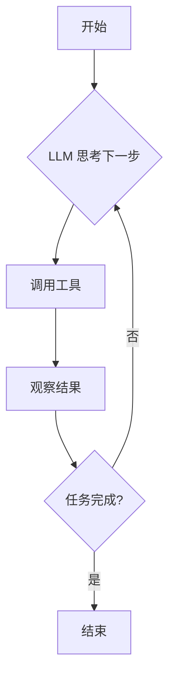

# 揭秘构建可靠 AI Agents 的 12 要素：从小白到专家的晋升之路

你好，未来的 AI 构建者！

你是否对 AI Agent 的强大能力感到兴奋，梦想着构建一个能自主解决复杂问题的智能助手？但与此同时，你是否也因其不可预测、时常犯错而感到困惑和沮丧？

别担心，你不是一个人。在这篇文章中，我们将一起探索一个名为 **"12-Factor Agents"** 的强大方法论。它将像一座灯塔，指引我们穿越迷雾，构建出更健壮、更可靠、更可控的 AI Agents。无论你是刚刚入门的新手，还是有一定经验的开发者，相信这篇文章都能给你带来启发。

准备好了吗？让我们开始这场精彩的探险吧！

## Agent 的梦想与现实：为何我们需要新的方法论？

AI Agent 的概念听起来就像科幻小说：给它一个目标（比如"帮我规划一场去东京的旅行"），给它一套工具（比如搜索、预订酒店、查询天气），然后它就能像一位任劳任怨的助理一样，自主思考、规划、执行，直到任务完成。

这个美好的愿景可以用一个简单的循环来表示：



这个模式被称为 **"ReAct" (Reason + Act)**，是许多 Agent 框架的核心。然而，在现实世界中，这个简单的循环很快就会遇到麻烦。当任务稍微复杂一点，经过几轮对话后，Agent 就像一个记忆力超载的人，开始忘记最初的目标，重复犯同样的错误，甚至陷入无限循环。我们称之为 **"长上下文问题" (Long-context Problem)**。

想象一下，你的APP有10%的几率会崩溃，你敢把它交给用户吗？显然不行。这正是当前许多 Agent 应用面临的窘境。

**那么，出路在哪里？**

答案是：**化整为零，分而治之**。我们不应该构建一个试图解决所有问题的"万能Agent"，而是应该构建多个小而精的 **"微型Agent" (Micro-agents)**，每个 Agent 只负责一个定义明确、范围有限的任务。然后，我们用更稳定、更可预测的传统代码（就像一个工作流引擎）来"编排"这些微型Agent，让它们协同工作。


*图片来源：humanlayer/12-factor-agents*

这种方法结合了 LLM 的灵活性和传统代码的稳定性。而"12-Factor Agents"方法论，正是指导我们如何设计和构建这些高质量"微型Agent"的最佳实践。

## 12要素详解：构建高质量 Agent 的秘诀

"12-Factor Agents" 借鉴了软件工程领域著名的 "12-Factor App" 思想，为构建 Agent 提供了12条黄金法则。接下来，让我们逐一揭晓。

### 要素一：将自然语言转化为工具调用 (Natural Language to Tool Calls)

这是 Agent 最核心、最强大的能力，也是我们应该首要关注和利用的。它的理念非常简单：**让 LLM 负责"听懂"，让代码负责"执行"**。

想象一下你对智能音箱说："帮我创建一个750美元的付款链接，收款人是Terri，用途是赞助二月份的AI爱好者聚会。"

LLM 在这里扮演的角色，就像一个超级翻译官。它的任务不是去真的创建链接，而是将你这段模糊的人类语言，精准地翻译成一段计算机可以理解的、结构化的指令（通常是JSON格式），也就是所谓的 **"工具调用" (Tool Call)**。


*图片来源：humanlayer/12-factor-agents*

上面的那句话，可能会被翻译成这样：
```json
{
  "function": {
    "name": "create_payment_link",
    "parameters": {
      "amount": 750,
      "customer": "cust_128934ddasf9",
      "memo": "为二月份AI爱好者聚会创建赞助付款链接"
    }
  }
}
```
看到重点了吗？LLM 的工作到此就结束了。它输出这个结构化的 JSON 对象后，我们的确定性代码（工作流引擎）就会接手，验证这个指令，然后调用真正的 `create_payment_link` 函数去执行操作。

> **核心原则**：将 LLM 的使用原子化。在这一步，只让它做一件事：翻译。这使得 Agent 的行为变得极其稳定和可预测。

### 要素二：掌控你自己的提示词 (Own Your Prompts)

如果说"工具调用"是 Agent 的"四肢"，那么 **"提示词" (Prompt) 就是 Agent 的"大脑和灵魂"**。它是你与 LLM 沟通的唯一渠道，是你指导 Agent 如何思考、如何行动的"源代码"。

很多 Agent 框架为了简化开发，会提供这样的"黑箱"式接口：
```python
# 黑箱操作：你看不到最终的Prompt长什么样
agent = Agent(
  role="你是一个销售助理",
  goal="帮用户完成订单",
  tools=[...],
  personality="热情活泼" 
)
```
这对于快速搭建原型很方便，但当你的 Agent 表现不佳时，问题就来了。你不知道框架在背后到底生成了怎样一个冗长复杂的 Prompt，自然也无从下手去优化和调试。这就像一个厨师不知道他的秘制酱料配方一样，无法真正控制菜品的最终味道。

**正确的做法是，将 Prompt 视作你应用中的一等公民，像管理源代码一样管理它。**


*图片来源：humanlayer/12-factor-agents*

你应该在代码中明确地、完整地定义你的 Prompt 模板，让它和你的业务逻辑代码一样，清晰可见、可被版本控制、可被测试。

> **核心原则**：不要将你的核心竞争力——Prompt Engineering——外包给任何框架。完全的控制权意味着你可以进行精细的优化、快速的迭代和有效的调试，这是构建生产级 Agent 的不二法门。

### 要素三：掌控你的上下文窗口 (Own Your Context Window)

这是 "12-Factor Agents" 中最核心、最具变革性的思想之一。它告诉我们：**不要再被动地、一条条地向 LLM 塞入标准格式的聊天记录，而应该主动地、像工程师一样去"设计"和"构建"每一次提供给 LLM 的完整上下文。**

我们将这个过程称为 **"上下文工程" (Context Engineering)**。

想象一下你要向一位日理万机的CEO汇报项目进展。你是会把所有原始的邮件、聊天记录、会议纪要直接丢给他，还是会精心准备一份摘要报告，用清晰的标题（如`<项目背景>`, `<关键决策>`, `<风险提示>`）来突出重点？

毫无疑问，是后者。因为这样效率最高，最不容易产生误解。

我们与 LLM 的沟通也是一样。LLM 就是那位非常聪明但非常忙碌的"CEO"。标准的聊天记录格式，就像是那些未经处理的原始邮件，充满了冗余信息，既浪费Token（钱！），又容易让LLM在长篇大论中"迷失"。


*信息密度对比：同样的信息，自定义格式（右）比标准格式（左）消耗的Token更少。图片来源：humanlayer/12-factor-agents*

**正确的做法是，我们自己定义一套最适合我们业务的、信息密度极高的上下文格式。** 比如，我们可以用类似XML的标签来封装每一轮的交互：

一个"部署应用"的交互历史，用标准格式可能很长，但用我们的自定义格式可能长这样：
```xml
<slack_message>
    From: @alex
    Text: Can you deploy the latest backend to production?
</slack_message>

<tool_call intent="list_git_tags" />

<tool_result name="list_git_tags">
    - tag: "v1.2.3"
    - tag: "v1.2.2"
</tool_result>

<tool_call intent="deploy_backend" tag="v1.2.3" />

<tool_result name="deploy_backend">
    status: "success"
</tool_result>
```
这种方式让我们拥有了完全的控制权：
*   **压缩信息**：只保留关键信息，大大节省Token。
*   **突出重点**：可以用特殊的标签或格式来强调重要内容。
*   **隐藏噪音**：对于已经解决的错误或不重要的中间步骤，可以直接从上下文中省略，避免干扰LLM。
*   **保证安全**：可以过滤掉不想让LLM看到的敏感数据。

> **核心原则**：停止将上下文看作是一个只能被动追加的"聊天记录列表"。把它当作一个你可以完全控制和设计的"信息简报"。精心构建的上下文，是获得高质量输出的关键。

### 要素四：工具即结构化输出 (Tools Are Structured Outputs)

"工具调用" (Tool Calling) 是不是听起来很高级、很神秘？其实，我们应该为它祛魅。这一条原则告诉我们一个返璞归真的事实：**所谓"调用工具"，本质上只是让 LLM 输出一个符合预设格式的、结构化的数据对象（比如JSON）而已。**

让我们用一个餐厅点餐的例子来理解：
你（用户）对服务员（LLM）说："我要一个芝士汉堡，但不要加洋葱。"

服务员的工作，不是立刻冲进厨房去做汉堡。他的核心职责是准确地在点餐机上输入一个结构化的订单：
```json
{
  "intent": "create_order",
  "item": "Cheeseburger",
  "modifications": ["remove_onions"]
}
```
这张"订单"（结构化输出），就是 LLM "调用工具"的全部产物。


*图片来源：humanlayer/12-factor-agents*

订单随后被传送到后厨（我们的确定性代码）。后厨会根据自己的一套标准化流程来完成汉堡的制作：检查库存、煎肉饼、组装、质检……服务员无需关心这些复杂的执行细节。

这个模式的美妙之处在于 "意图"与"执行"的解耦。
*   **LLM 负责决策**：它根据对话，决定"应该做什么"（生成"创建工单"的意图）。
*   **代码负责执行**：我们的代码接收到这个意图后，决定"应该怎么做"（比如，先验证数据，再调用JIRA的API，然后发一条Slack通知）。

> **核心原则**：不要把"工具"看作是 LLM 可以直接"运行"的函数。要把"工具"看作是一个个等待 LLM 来"填写"的、定义清晰的"数据表单"。这种思想上的转变，能让你的 Agent 架构瞬间变得清晰、灵活和强大。

### 要素五：统一执行状态与业务状态 (Unify Execution State and Business State)

在传统软件开发中，我们习惯将"执行状态"和"业务状态"分开管理。
*   **执行状态**：指流程进行到哪一步了，比如 `current_step: 3`, `status: 'waiting_for_approval'`, `retry_count: 2`。
*   **业务状态**：指流程中发生了什么事，比如"用户A创建了订单"、"系统调用了支付API"、"API返回了成功结果"。

这种分离导致了巨大的复杂性，你需要费心去同步这两者，一不小心就会出现数据不一致的bug。

而"12要素"告诉我们一个更简单、更优雅的方案：**放弃独立的执行状态机，让所有的状态都从那份唯一的、不可变的业务事件日志（即我们精心设计的上下文）中推断出来。**

最好的比喻是 **Git 的提交历史**。在 Git 中，仓库的当前状态就是由从第一次提交到 `HEAD` 的完整历史决定的。你不需要一个额外的数据库来记录"当前分支是main"。你想知道状态，看 `HEAD` 就行了。

[](https://github.com/user-attachments/assets/e5a851db-f58f-43d8-8b0c-1926c99fc68d)
*状态就是事件日志的集合。图片来源：humanlayer/12-factor-agents*

同样，Agent 的状态就是它的事件日志。我们通过查看日志的最后一条事件，就能推断出当前应该做什么：
*   如果最后一条是 `<tool_call intent="request_human_approval">`，那么我们知道流程正"暂停并等待人工批准"。
*   如果最后一条是 `<error message="...">`，那么我们知道流程"出错了"。
*   如果最后一条是 `<tool_call intent="finish_task">`，那么我们知道流程"已完成"。

这种方式的好处是巨大的：
1.  **极度简化**：只有一个数据源，消除了状态同步的烦恼。
2.  **易于调试**：所有发生过的事情都记录在一个地方，一目了然。
3.  **轻松实现暂停/恢复**：想暂停？什么都不用做。想恢复？只需加载事件日志，然后从最后一步继续即可。

> **核心原则**：像对待 Git 历史一样对待你的 Agent 状态。那份完整的、有序的事件日志 **就是** 状态本身。

### 要素六：通过简单的API实现启动、暂停与恢复 (Launch, Pause, Resume)

这条原则是要素五"统一状态"带来的一个超级红利。当我们接受了"状态即日志"的思想后，实现复杂的暂停/恢复功能就变得异常简单。

现实世界的 Agent 工作流，往往不是一秒钟就能完成的。它可能需要：
*   调用一个需要30分钟才能返回结果的外部API。
*   向用户发送一封邮件，等待他点击其中的批准链接。
*   在每天早上9点定时触发。

这意味着，Agent 必须能够优雅地暂停，并在未来某个时间点（可能是几分钟，也可能是几天后）从它离开的地方被精确地唤醒。

[](https://github.com/user-attachments/assets/feb1a425-cb96-4009-a133-8bd29480f21f)
*暂停和恢复变得很简单。图片来源：humanlayer/12-factor-agents*

让我们用看在线视频的体验来做个比喻。当你在看一部电影时按下暂停，视频网站会记住你离开时的时间戳。当你下次回来时，它可以无缝地从那个时间点继续播放。

我们的 Agent 也是如此。那份事件日志，就是 Agent 的"播放时间线"。
*   **启动 (Launch)**：通过一个简单的 API 调用，我们创建一个新的事件日志，并写入第一条事件（比如用户的请求），然后开始"播放"。
*   **暂停 (Pause)**：当流程需要等待时（比如，日志中追加了一条 `<等待人工批准>` 的事件），我们的处理循环就直接停止。由于日志是持久化的，所以"暂停"这个动作本身不需要做任何额外操作。
*   **恢复 (Resume)**：当外部条件满足时（比如用户点击了批准按钮，触发了一个Webhook），一个简单的恢复 API 被调用。它加载对应的事件日志，在末尾追加一条新的事件（比如 `<人工已批准>`），然后再次启动"播放"。

> **核心原则**：因为状态就是那份可被持久化的事件日志，所以启动、暂停和恢复，都变成了对这份日志进行"读"和"追加"的简单操作。你的 Agent 因此获得了跨越时间和进程的、强大的韧性。

### 要素七：使用工具来与人类交互 (Contact Humans with Tools)

在很多 Agent 框架中，LLM 在每一步的最后，都要做一个艰难的二选一：
1.  我是应该调用一个工具 (Tool Call)，输出一个JSON？
2.  还是应该直接回复用户，输出一段自然语言文本？

这个决策非常微妙，且极易出错。而第七要素提供了一个颠覆性的思路：**废除这个二选一，让 LLM 永远只做第一件事——调用工具。**

那如果 Agent 需要和人说话怎么办？很简单，**把"和人说话"本身，也封装成一个工具！**


*两条路（工具调用 vs 文本回复）合并为一条路（永远是工具调用）。图片来源：humanlayer/12-factor-agents*

让我们用一个正式的公司流程来打比方。当一个项目需要主管审批时，你不会只是在聊天软件里随便发一句"老板，那个事儿你同意不？"。你会填写一张标准的、结构化的《审批申请单》，上面有"事由"、"风险评估"、"待选操作（批准/驳回）"等字段。

我们的 Agent 也应该如此。当它需要用户输入时，它不应该直接"说话"，而是应该"调用"一个名为 `request_human_input` 的工具，输出类似这样的结构化数据：
```json
{
  "intent": "request_human_input",
  "question": "即将执行生产环境部署，风险较高，是否确认继续？",
  "context": "本次部署将更新核心用户数据库。",
  "options": {
    "format": "yes_no",
    "urgency": "high"
  }
}
```
我们的代码在收到这个"工具调用"后，可以将它渲染成一条带按钮的Slack消息、一封需要回复的邮件、或者一个APP内的弹窗，然后暂停等待。当用户做出回应后，再将回应作为新事件，恢复工作流。

> **核心原则**：把与人交互也看作是一种标准的、结构化的工具调用。这彻底统一了 Agent 的行为模式，使其逻辑更清晰、行为更可预测，并且能够完美地融入我们已经建立的"暂停-恢复"体系中。

### 要素八：掌控你自己的控制流 (Own your control flow)

这是前面所有原则的集大成者。它告诉我们，那个驱动整个 Agent 运作的、最核心的 **"主循环" (Control Flow)**，必须由我们自己来编写和掌控。

让我们用开车的例子来比喻。使用一个大而全的 Agent 框架，就像开一辆"自动挡"汽车，它替你决定了何时升降档，虽然省心，但你失去了很多控制权。而自己掌控控制流，则像是开一辆"手动挡"汽车，你可以根据路况（业务需求）自由地决定是拉高转速获得爆发力，还是平顺升档节省油耗。


*控制流就是你代码的"大脑中枢"。图片来源：humanlayer/12-factor-agents*

这个由我们自己编写的"主循环"，其核心就是一个巨大的 `switch` 语句（或者 `if/elif/else` 结构）。它在每次从 LLM 那里获得一个"工具调用"（意图）后，来决定下一步到底该做什么。

```python
# 伪代码：自己掌控的主循环
while True:
  # 1. 调用LLM，获取它选择的下一步"意图"
  next_step = llm.determine_next_step(context)

  # 2. 将意图加入事件日志
  events.append(next_step)

  # 3. 核心！由我们自己的代码来解释和执行这个意图
  if next_step.intent == 'fetch_weather':
    # 这是一个简单的同步操作
    result = api.get_weather(next_step.city)
    events.append(result)
    continue # 立刻进入下一次循环，问LLM拿到天气后干嘛
  
  elif next_step.intent == 'request_human_approval':
    # 这是一个需要暂停的异步操作
    send_approval_request_to_human(next_step)
    save_events_to_db(events)
    break # 跳出循环，等待外部触发器来恢复
  
  elif next_step.intent == 'finish_task':
    # 任务完成
    break
```

只有自己掌控了控制流，我们才能实现那些对于生产级应用至关重要的功能：
*   **审批流**：在"工具被选中"和"工具被执行"之间插入一个"等待人工批准"的暂停步骤。
*   **自定义逻辑**：在工具调用前后，轻松地加入日志、监控、缓存、限流等任何我们想要的功能。
*   **高级错误处理**：当一个工具调用失败时，由我们来决定是重试、是换个工具、还是去求助人类。

> **核心原则**：Agent 的"主循环"是你应用中最核心的业务逻辑所在。不要把它外包给框架。亲自编写和掌控它，你才能构建出真正满足你需求的、独一无二的 Agent。

### 要素九：将错误信息精简后纳入上下文 (Compact Errors)

Agent 的一个巨大魅力在于它具备一定的"自我修复"能力。当它调用一个工具失败时，一个聪明的 Agent 应该能从错误信息中学习，并尝试在下一步中纠正自己的行为。第九要素就告诉我们如何去实现这一点。

原则很简单：**当工具执行出错时，不要让程序崩溃。而是应该捕获这个错误，把它当作一条新的信息，加入到事件日志中，让 LLM "看到"它。**

让我们用 GPS 导航来打比方。当它规划的路线前方因为修路而无法通行时，GPS 不会直接死机。它会提示"正在重新计算路线…"，它将"道路封闭"这个"错误信息"吸收，然后规划出一条新的路线。

[](https://github.com/user-attachments/assets/cd7ed814-8309-4baf-81a5-9502f91d4043)
*将错误纳入循环。图片来源：humanlayer/12-factor-agents*

在我们的主循环（要素八）中，这意味着用一个 `try...except` 语句块来包裹工具的执行：
```python
# 伪代码：带错误处理的主循环
try:
  # 尝试执行工具
  result = execute_tool(next_step)
  events.append(result) # 成功，记录结果
  consecutive_errors = 0 # 重置错误计数器
except Exception as e:
  consecutive_errors += 1
  if consecutive_errors >= 3:
    # 错误太多，转交人工处理
    events.append(create_human_request("我卡住了，帮帮我！"))
    break
  else:
    # 记录精简后的错误，让LLM看到
    error_message = f"工具 {next_step.intent} 调用失败，原因: {e}"
    events.append({"type": "error", "data": error_message})
    continue # 继续循环，让LLM尝试修复
```

**关键点**：我们不应该把长长的、充满技术细节的"错误堆栈"直接丢给 LLM。这既浪费 Token 又难以理解。我们应该将错误**精简**成一条清晰、简洁的自然语言消息。

> **核心原则**：错误不是系统的终点，而是 Agent 学习回路的一部分。通过捕获、精简并反馈错误，我们赋予 Agent 自我疗愈的能力。但务必结合我们自己代码中的"断路器"（如重试次数限制），来防止它陷入无限的错误循环。

### 要素十：构建小而专注的 Agent (Small, Focused Agents)

这一条原则，让我们回到了整个方法论的起点和核心哲学：**放弃构建一个无所不能的"上帝Agent"，转而构建多个小而专注的"微型Agent"**。

这就像是软件工程中的"单一职责原则"。你要盖一栋房子，不会只雇佣一个什么都会一点的"全才"，而是会雇佣一个专业的建筑师、一个水管工、一个电工。他们各自是自己领域的专家，在一个项目经理（我们的主控制流）的协调下协同工作。


*多个小Agent，而不是一个大Agent。图片来源：humanlayer/12-factor-agents*

为什么要这样做？因为这能完美地规避 LLM 的根本弱点——"长上下文遗忘症"。
*   一个大而全的 Agent，必然带着一个巨大的、无所不包的 Prompt 和一长串工具列表。
*   它完成任务所需的步骤也必然更多、更曲折。
*   这两点都会导致上下文窗口迅速膨胀，最终让 LLM "迷失在对话历史中"，性能和可靠性急剧下降。

而小 Agent 的优势是显而易见的：
*   **上下文可控**：更短的 Prompt，更少的工具，更短的事件日志，意味着更高的成功率。
*   **职责清晰**：每个 Agent 的目标都非常明确。
*   **易于测试和调试**：小即是美，小意味着简单。

这种架构也是面向未来的。随着未来 LLM 的能力越来越强，我们可以平滑地扩大每个"专家Agent"的职责范围，让它负责更大块的任务，而无需对整个系统进行伤筋动骨的重构。

[](https://github.com/user-attachments/assets/0cd3f52c-046e-4d5e-bab4-57657157c82f)
*Agent的职责范围可以随着模型能力而成长。图片来源：humanlayer/12-factor-agents*

> **核心原则**：不要造一把瑞士军刀，而是要打造一个装满各种精密、专业工具的工具箱。构建小而专注的 Agent，然后用你自己的代码来编排它们，这是通往复杂、健壮 AI 系统的最可靠路径。

### 要素十一：随处触发，无处不在 (Trigger from Anywhere)

一个真正有用的 Agent，不应该只生活在一个孤零零的聊天窗口里。它应该像一个真正的数字同事一样，无缝地融入到我们已有的工作流中。这意味着，我们应该能够**从任何地方触发它，并能在任何地方接收到它的回应**。


*让Agent融入你已有的工作流。图片来源：humanlayer/12-factor-agents*

这其实是前面几个原则水到渠成的结果：
*   因为我们有简单的启动/恢复API（要素六），所以我们可以很轻易地为不同的触发源创建入口。比如，创建一个 `/api/v1/webhook/email` 接口来接收邮件，创建一个 `/api/v1/webhook/slack` 接口来响应Slack命令。这些接口所做的，只是解析输入，然后调用标准的 `launch` 或 `resume` API 即可。
*   因为我们用工具来与人交互（要素七），我们的代码就可以灵活地决定将 Agent 的请求（比如请求批准）发送到哪里。Agent 本身只生成了一个中立的 `request_human_input` 工具调用，而我们的主循环代码可以根据业务逻辑，决定"哦，这个请求需要发给法务部门的 leader，应该通过邮件发送"。

遵循这一原则，还能让我们构建出强大的 **"外循环Agent" (Outer Loop Agents)**。即，那些并非由人类实时发起的 Agent。例如：
*   一个**定时任务**，每天早上9点自动触发 Agent，去检查所有新收到的客服邮件并进行分类和初步回复。
*   一个**监控警报**，在服务器宕机时自动触发 Agent，去尝试重启服务、检查日志，并只在无法解决时才通知工程师。

> **核心原则**：将 Agent 的核心逻辑与具体的输入/输出渠道解耦。把 Agent 构建成一个灵活的、可被随处调用的服务。这样你才能构建出真正融入工作、有实用价值的"数字员工"。

### 要素十二：将你的Agent视为无状态的Reducer (Stateless Reducer)

这是最后一个要素，也是对前面所有原则最优雅、最深刻的总结。它告诉我们，整个 Agent 的运行过程，可以被看作是一个来自函数式编程的、优美的概念——**Reducer** (或者叫 `fold` 操作)。

如果你不熟悉 `reduce`，它的作用是：接收一个列表（比如 `[1, 2, 3, 4]`），一个初始值（比如 `0`），和一个累积函数（比如 `(a, b) => a + b`），然后将列表中的所有元素累积成一个最终值。`reduce([1, 2, 3, 4], 0, (a, b) => a + b)` 的结果就是 `10`。

现在，让我们把这个模型套在我们的 Agent 上：
*   **那个列表**：就是我们不可变的、只增不减的**事件日志**。
*   **那个初始值**：就是一个**空的事件日志**。
*   **那个累积函数**：就是我们自己编写的、包含了`switch`语句的**主控制流**。


*Agent 的运行，就是对事件日志做 fold/reduce 操作。图片来源：humanlayer/12-factor-agents*

整个 Agent 的生命周期，就可以被描述为：
`当前状态 = reduce(所有历史事件, 初始空状态, 我们的主控制流函数)`

这个模型的关键在于，我们的"主控制流函数"本身是 **"无状态的" (Stateless)**。它在处理下一个事件时，不需要依赖任何自身存储的状态，它需要的所有信息，都来自于已经累积的"当前状态"（即事件日志本身）。

这使得整个系统具有极高的可预测性和可测试性。只要给定一份相同的事件日志，你总能100%地复现出当时的最终状态，就像时间旅行一样。

> **核心原则**：将你的 Agent 看作是一个作用于事件流上的、纯粹的、无状态的 Reducer。这是对我们构建的这套健壮、可靠、可控的 Agent 架构的终极心智模型。

## 结语：从"魔法"到"工程"的转变

恭喜你完成了这次探险！我们一起探索了构建可靠 AI Agents 的12个核心要素。让我们用一个表格来快速回顾一下：

| 要素 | 核心思想 | 解决的问题 |
| :--- | :--- | :--- |
| **1. 自然语言到工具调用** | 让LLM只做"翻译"，输出结构化指令 | 明确LLM的职责边界，提高稳定性 |
| **2. 掌控你的提示词** | 像写代码一样，自己编写和管理Prompt | 摆脱框架黑箱，实现完全控制和优化 |
| **3. 掌控你的上下文** | 精心"设计"而非被动"堆砌"上下文 | 解决长上下文遗忘症，节省Token |
| **4. 工具即结构化输出** | 工具是"数据表单"，而非LLM"运行"的函数 | 解耦意图和执行，架构更灵活 |
| **5. 统一执行与业务状态** | 事件日志是唯一的状态源 | 消除状态同步的复杂性和bug |
| **6. 简单的启动/暂停/恢复** | 基于事件日志，轻松实现工作流的持久化 | 让Agent能处理长时间运行和异步任务 |
| **7. 用工具与人交互** | 把"和人说话"也封装成一个标准工具 | 统一Agent行为模式，逻辑更清晰 |
| **8. 掌控你的控制流** | 自己编写"主循环"，注入业务逻辑 | 实现审批流、高级错误处理等复杂功能 |
| **9. 精简错误信息** | 将错误视为事件，让Agent有机会自我修复 | 提升Agent的韧性和自主性 |
| **10. 小而专注的Agent** | 构建"专家团队"，而非"全才" | 规避长上下文问题，提高可靠性 |
| **11. 随处触发** | 将Agent作为服务，融入现有工作流 | 提升Agent的实用性和集成性 |
| **12. 无状态Reducer** | 用函数式思想，统一整个Agent架构 | 获得一个极其优雅和健壮的心智模型 |

这12个要素的核心，是引领我们完成一次思维上的转变：从将 Agent 视为一种不可捉摸的"魔法"，转变为将其看作是一项可以遵循最佳实践的、严肃的"软件工程"。

构建卓越的 Agent，关键不在于找到那个最神秘的 Prompt 或是最强大的框架，而在于应用这些久经考验的工程原则：**模块化、清晰的接口、明确的职责、以及对核心逻辑的自主掌控**。

希望这些原则能为你点亮前行的道路。现在就去试试吧，哪怕只在你的下一个项目中应用一两条，相信你也会立刻感受到它带来的改变！

AI Agent 的未来，正由我们这些构建者一砖一瓦地创造。祝你编码愉快！
