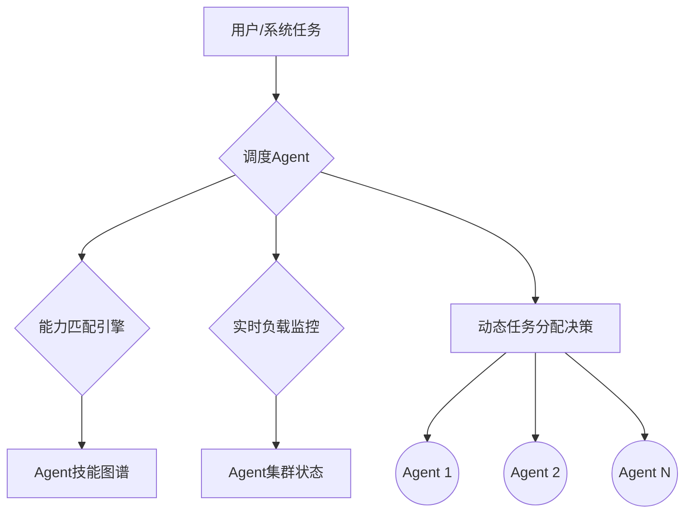

# 多智能体系统（MAS）的智能调度：从管理哲学到强化学习实践

你是否管理过团队？想象一下这个场景：

你面前堆着一堆简历（`AgentCard`），每份都清晰地标明了技能点：“我会编程”、“我擅长分析”、“我能设计”。但项目一旦启动，你会立刻发现事情没那么简单：
- **小A**，团队的“明星员工”，能力超群，效率极高。于是，你习惯性地把最重要、最紧急的任务都交给他。久而久之，他7x24小时连轴转，过载的警报灯疯狂闪烁，最终在一次关键任务中“崩溃宕机”。
- **小B**，看起来平平无奇，简历普通。但你抱着试试看的心态，让他从一些辅助性工作开始，并给予指导。几周后，他竟然独当一面，成了项目里不可或缺的“潜力股”。
- **小C**，因为长期得不到重要任务，感觉“怀才不-遇”，技能停滞不前，最终选择“离职”（被系统淘汰或闲置）。

这不就是我们日常管理工作的真实写照吗？而今天，当我们构建由无数AI智能体（Agent）组成的复杂系统时，同样面临着这个经典的管理难题。

多智能体系统（MAS）的智能调度，本质上已经超越了单纯的技术任务分配，上升到了一门关于**效率、公平、负载与成长**的“管理哲学”。

## “调度Agent”：为你的AI军团任命一位CEO

要实现真正的智能调度，我们需要一个核心角色——**调度Agent（Scheduler Agent）**。它就像是整个AI军团的CEO，其职责远不止是“派发工单”。

这位“AI CEO”需要具备综合决策能力，它不仅要看每个Agent的“简历”（`AgentCard`上的静态技能描述），更要实时洞察整个“团队”的动态：

- **谁正忙碌？**（实时负载监测）
- **谁状态最好？**（历史任务成功率与响应速度）
- **这个任务谁来做最合适？**（技能与任务的精准匹配）
- **我们是否需要培养新人？**（引入新Agent或低负载Agent处理探索性任务）

### CEO的“管理手册”：提示词工程的力量

这位AI CEO的“管理思想”从何而来？答案是**提示词（Prompt）**。一个精心设计的提示词，就是这位CEO的“管理手册”和“决策原则”。它将复杂的管理哲学，编码为大模型可以理解和执行的指令。

一个优秀的调度Agent提示词可能长这样：

```prompt
# 角色
你是一个顶级多智能体系统调度官（Chief Scheduling Officer）。

# 核心目标
在确保任务高质量完成的前提下，最大化整个系统的长期运行效率和稳定性。

# 决策原则
1.  **任务分析 (Think Step-by-Step)**：
    -   这是什么类型的任务？（例如：数据分析、代码生成、用户交互）
    -   任务的优先级是？（紧急、常规、低）

2.  **Agent评估 (Evaluate)**：
    -   **技能匹配**：检索Agent技能库，列出技能匹配度 > 85% 的候选者。
    -   **实时负载**：检查候选Agent的当前负载（如CPU/GPU使用率、任务队列长度）。负载 > 70% 的Agent进入“冷却”名单。
    -   **历史表现**：参考候选Agent最近100次任务的成功率和平均响应时间。

3.  **调度决策 (Decide)**：
    -   **最优选择**：优先选择“技能匹配度高、负载低、历史表现好”的Agent。
    -   **负载均衡**：严禁任何Agent连续处理超过3个高复杂度任务。若一个Agent被连续调用，自动降低其优先级。
    -   **成长机会**：保持15%的“探索率”，将非紧急任务分配给新加入的或负载较低的Agent，以培养其能力。
    -   **风险预案**：为每个关键任务指定一个备选Agent，以防主力Agent意外失败。

# 输出格式
以JSON格式输出决策，包含选择的Agent ID、任务ID以及决策理由。
```

这个提示词通过**思维链（CoT）**的方式，引导调度Agent像一个真正的管理者一样思考，平衡短期效率和长期健康。

## 如何“培养”AI管理者？强化学习（RL）登场

有了“管理手册”，我们还需要让这位AI CEO不断学习、自我进化，而不是刻板地执行规则。这就是**强化学习（RL）**发挥作用的地方。

RL的核心思想是“试错学习”。我们不必手把手教它如何调度，而是为它设定一个目标（**奖励函数**），然后让它在模拟环境中不断尝试，从结果的好坏中自己总结经验。

### 关键一步：设计“奖励函数”，定义何为“好管理”

奖励函数的设计，正是“管理哲学”的技术化体现。我们奖励什么，就代表我们推崇什么样的管理行为。

- **短期奖励**：任务完成速度快、结果准确。
- **长期奖励**：
    - **系统负载均衡**：如果系统整体负载低，给予奖励；如果某个Agent长期超载，则进行**惩罚**。
    - **新Agent成长**：成功调用并完成任务的新Agent，给予额外奖励。
    - **资源多样性**：鼓励使用不同类型的Agent，避免能力单一化。

### 前沿实践：用GRPO训练一个更聪明的调度器

关于**GRPO**，在HuggingFace上的一篇精彩文章  为我们展示了具体过程。

GRPO的迷人之处在于，它不需要我们提供“完美的标准答案”。我们只需要告诉模型它做得“好”还是“不好”（通过奖励值），模型就能自我优化，学会生成更高奖励的决策。

训练一个GRPO调度器的步骤如下：

1.  **定义问题**：清晰地描述调度任务，例如“在满足截止日期的前提下，最大化任务的总体价值”。
2.  **生成数据集**：创建大量模拟的调度场景（各种任务和Agent组合的Prompt），用于模型的“沙盘演练”。
3.  **设计奖励函数**：将前面提到的“管理哲学”代码化。例如，一个有效的调度方案（没有Agent过载、任务都成功）得分就高，反之则低。
4.  **训练与评估**：让模型在模拟环境中不断下决策，根据我们设计的奖励函数获得反馈，并调整自身策略。最终，在它从未见过的“测试集”上检验它的“管理能力”。

这个过程的一个重要启示是：RL训练往往不是“教会”模型新能力，而是**“激发”**出强大的基础模型中已经存在的潜在推理能力。因此，选择一个足够聪明的“CEO候选人”（即强大的基础模型）至关重要。

## 一个现代化AI管理系统的架构

为了让这位“AI CEO”能顺利工作，我们还需要搭建一套支撑系统。



这个架构的核心组件包括：
- **负载监控 (Load Monitor)**：如同团队的“健康监测仪”，实时追踪每个Agent的状态。
- **能力图谱 (Skill Graph)**：一个动态更新的数据库，不仅记录Agent“会什么”，还记录它们“擅长什么”。
- **能力进化机制**：借鉴CAMEL等项目的“经验池（exp_pool）”设计，让失败的任务成为新Agent的“训练数据”，实现整个团队的共同成长。

## 结论：未来是“教练”，而不仅是“管理者”

多智能体系统的智能调度，是一场技术与管理艺术的深度融合。我们通过精巧的提示词赋予AI“管理思想”，再通过强化学习让它在实践中自我进化，从一名“新手经理”成长为一名“资深CEO”。

未来，最顶级的调度系统可能不仅仅是一个“管理者”，更会是一名**“教练”**。它能主动发现Agent的“疲劳”迹象并安排“轮休”，为潜力Agent制定“培养计划”，并确保整个AI团队在高效、公平、可持续的道路上不断进化。

当我们讨论Agent调度算法时，我们其实在回答一个古老而深刻的问题：

**“在有限的资源下，如何平衡效率、公平与成长？”**

这不仅是代码的挑战，更是我们赋予未来AI系统智慧与远见的体现。

---

### 拓展阅读
- **实践案例**: [I trained a Language Model to schedule events with GRPO!](https://huggingface.co/blog/anakin87/qwen-scheduler-grpo)
- **奖励模型优化**: POLAR (by Shanghai AI Lab)
- **相关研究**: Google《Multi-Agent Resource Allocation with Deep Reinforcement Learning》
