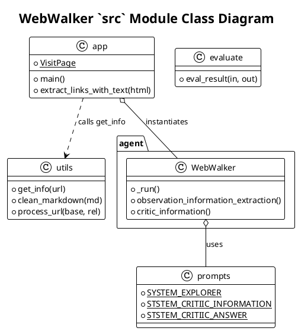

# WebAgent (WebWalker) 项目解读报告 - 总览

## 0. 项目概览

- **项目名称与简介**: WebWalker 是一个旨在评测大语言模型（LLM）在真实网页遍历任务中表现的基准测试和代理系统。它包含一个名为 `WebWalkerQA` 的挑战性问答数据集，以及一个名为 `WebWalker` 的多智能体框架，用于解决网页导航中的长上下文挑战。
- **核心理念与设计哲学**: 项目的核心在于模拟人类如何在网页间跳转、阅读和整合信息以回答复杂问题。其设计哲学是通过一个"探索者-提取者-评判者"的链式调用模型，将复杂的网页导航任务分解为更小、更易于管理的部分，从而提升LLM在信息检索任务中的表现。
- **技术栈与主要依赖**:
  - **核心框架**: `qwen_agent` (通义千问Agent框架), Streamlit (Web UI)
  - **网页抓取**: `crawl4ai` (异步抓取网页HTML、Markdown和截图)
  - **评估**: `LangChain` (使用其`cot_qa`评估器进行基于LLM的语义评估)
  - **LLM支持**: OpenAI, Dashscope (Qwen), Gemini, Moonshot, Baidu
  - **其他**: `BeautifulSoup` (HTML解析)
- **目录结构概览**:
  ```
  thirdparty/WebAgent/WebWalker/
  ├── README.md           # 项目主说明文档
  ├── requirements.txt    # 项目依赖
  ├── assets/             # 存放图片和GIF资源
  └── src/                # 核心源代码目录
      ├── README.md       # src目录下的说明，侧重运行细节
      ├── agent.py        # WebWalker Agent核心实现
      ├── app.py          # Streamlit Web应用入口
      ├── evaluate.py     # 评测脚本
      ├── prompts.py      # 所有LLM提示模板
      ├── rag_system.py   # 用于对比的RAG系统实现
      └── utils.py        # 工具函数，如网页抓取
  ```

## 1. 项目架构设计

### 1.1. 系统整体架构

WebWalker采用了一种分层的智能体架构，可以概括为"三位一体"的协作模型：

1.  **探索层 (Explorer Agent - `WebWalker` in `agent.py`)**:
    - 这是核心的导航智能体，采用ReAct (Reasoning and Acting) 范式。
    - 它接收用户查询，并根据当前页面的内容（Markdown格式）和可点击的按钮列表，生成`Thought`（思考），然后决定`Action`（行动），即点击哪个按钮 (`visit_page` tool)。
    - 它的主要职责是导航和探索，而不是直接生成最终答案。

2.  **提取层 (Information Extractor - `observation_information_extraction` in `agent.py`)**:
    - 探索者每访问一个新页面（`Observation`），这个虚拟的"提取者"就会被唤醒。
    - 它通过一次独立的LLM调用（使用`STSTEM_CRITIIC_INFORMATION`提示），判断新页面的内容是否与原始用户查询相关。
    - 如果相关，它会提取出关键信息并存入一个临时的`memory`列表中。

3.  **评判层 (Answer Critic - `critic_information` in `agent.py`)**:
    - 每当提取层向`memory`中添加了新信息，这个虚拟的"评判者"就会被唤醒。
    - 它通过另一次独立的LLM调用（使用`STSTEM_CRITIIC_ANSWER`提示），审视当前`memory`中积累的所有信息，并判断这些信息是否足以回答用户的原始查询。
    - 如果足够，它将合成最终答案并终止整个探索过程。如果不够，探索者将继续在下一轮进行导航。

这种架构将导航、信息提取和答案生成三个认知任务解耦，使每个环节都可以由专门的、高度集中的LLM调用来处理，从而提高了整体的准确性和效率。

### 1.2. 整体架构PlantUML类图

```plantuml
@startuml
!theme plain
title WebWalker System Architecture

package "UI Layer (app.py)" {
  [Streamlit UI] as UI
  [VisitPage Tool] as VisitPage
  UI -> VisitPage : User clicks button
  UI -> WebWalker : Starts agent run
}

package "Agent Layer (agent.py)" {
  class WebWalker {
    - momery: List[str]
    + _run()
    + _call_tool()
    + observation_information_extraction()
    + critic_information()
  }

  class "LLM (Explorer)" as ExplorerLLM
  class "LLM (Extractor)" as ExtractorLLM
  class "LLM (Critic)" as CriticLLM

  WebWalker -> ExplorerLLM : Generates Thought/Action
  WebWalker -> VisitPage : Executes action
  WebWalker -> ExtractorLLM : Extracts info from observation
  WebWalker -> CriticLLM : Judges if answer is ready
}

package "Tool & Utility Layer" {
  [utils.py]
  [prompts.py]
  [crawl4ai Library] as Crawler
}

package "Data Layer" {
  [WebWalkerQA Dataset]
  [Evaluation Results]
}

[evaluate.py]

WebWalker --|> qwen_agent.FnCallAgent
VisitPage --|> qwen_agent.tools.BaseTool

WebWalker o-- prompts.py : Uses prompts
WebWalker ..> utils.py : Uses helper functions

VisitPage ..> utils.py : Calls get_info()
utils.py ..> Crawler : Fetches web content

UI ..> WebWalker
WebWalker ..> VisitPage

evaluate.py ..> "LLM (cot_qa)"
evaluate.py ..> WebWalkerQA Dataset
evaluate.py ..> "Evaluation Results"

@enduml
```

### 1.3. 模块划分与职责

- **`app.py`**: **应用主入口和UI层**。
  - 使用Streamlit构建交互式Web界面。
  - 管理用户输入（网址、查询）和UI状态。
  - 实例化并启动`WebWalker` agent。
  - 定义`visit_page`工具，这是agent与网页交互的唯一接口。它负责调用`utils.py`中的`get_info`函数，并处理页面链接的提取和状态管理（通过`BUTTON_URL_ADIC.json`）。

- **`agent.py`**: **Agent核心逻辑层**。
  - 实现`WebWalker`类，继承自`qwen_agent.FnCallAgent`。
  - 编排"探索-提取-评判"的核心循环。
  - 管理agent的内部记忆(`self.momery`)。
  - 调用LLM执行ReAct推理、信息提取和答案评判。

- **`prompts.py`**: **提示工程层**。
  - 集中管理所有与LLM交互的提示模板。
  - `SYSTEM_EXPLORER`: 指导探索agent如何进行ReAct思考和行动。
  - `STSTEM_CRITIIC_INFORMATION`: 指导提取agent如何从网页内容中抽取信息。
  - `STSTEM_CRITIIC_ANSWER`: 指导评判agent如何根据已有信息生成最终答案。

- **`utils.py`**: **底层工具层**。
  - 封装了`crawl4ai`库，提供`get_info`函数用于异步获取网页的HTML、Markdown和截图。
  - 包含URL处理和文本清理等辅助函数。

- **`evaluate.py`**: **评测层**。
  - 负责对agent的性能进行自动化评估。
  - 加载`WebWalkerQA`标准数据集。
  - 使用`LangChain`的LLM-based评估器（`cot_qa`）来判断预测答案的准确性。
  - 生成详细的、多维度的评估报告。

- **`rag_system.py`**: **基线对比系统**。
  - 提供了一个基于RAG（检索增强生成）的简单问答系统，作为与`WebWalker` agent进行性能比较的基线。

## 2. 核心模块详细分析

### `src` 模块

#### 1. 模块概述

- **模块路径**: `/thirdparty/WebAgent/WebWalker/src`
- **核心职责**: 包含了WebWalker系统的全部核心逻辑，从用户界面、Agent智能到网页交互和评估，是一个功能内聚的完整应用。
- **主要组件**: `WebWalker` (agent), `VisitPage` (tool), `get_info` (utility), `streamlit app` (UI).

#### 2. 文件结构与实现分析

- **关键文件列表与功能**:
  - `app.py`: 如上所述，是应用的门面和控制器。
  - `agent.py`: Agent的大脑，定义了其独特的记忆和决策机制。
  - `prompts.py`: Agent的"说明书"，决定了其与LLM沟通的质量。
  - `utils.py`: Agent的"手脚"，负责与外部世界（Web）的实际交互。
  - `evaluate.py`: 项目的"裁判"，客观衡量agent的能力。

- **核心算法与数据流**:
  1.  **启动**: 用户在UI (`app.py`)中输入URL和Query，点击提交。
  2.  **初始化**: `app.py`实例化`WebWalker` agent，并调用`utils.get_info`获取起始页面的内容。
  3.  **构建初次提示**: `app.py`将Query、页面Markdown和可点击按钮列表格式化后，作为初始消息传递给`agent.run()`。
  4.  **ReAct循环 (`agent.py`)**:
      a. **思考与行动**: `WebWalker`调用LLM（`SYSTEM_EXPLORER` prompt）生成`Thought`和`Action` (e.g., `visit_page` on a specific button).
      b. **执行工具**: `WebWalker`调用在`app.py`中实现的`visit_page`工具。
      c. **获取新页面**: `visit_page`工具通过`utils.get_info`抓取新页面内容。
      d. **获取观察结果**: `visit_page`返回新页面的Markdown和新的按钮列表作为`Observation`。
  5.  **记忆与评判循环 (`agent.py`)**:
      a. **提取**: `WebWalker`调用LLM（`STSTEM_CRITIIC_INFORMATION` prompt）从`Observation`中提取相关信息。
      b. **存储**: 如果提取到信息，则存入`self.momery`。
      c. **评判**: `WebWalker`调用LLM（`STSTEM_CRITIIC_ANSWER` prompt）判断`self.momery`是否足以回答Query。
  6.  **循环或终止**:
      - 如果评判结果为"是"，则生成`Final Answer`，循环结束。
      - 如果为"否"，则将`Observation`加入上下文，返回步骤4a，开始新一轮的ReAct循环。
  7.  **展示**: 所有`Thought`、`Action`、`Memory Update`和`Final Answer`都会流式地在UI上展示给用户。

- **与其他模块的交互**:
  - 内部交互紧密，如上文数据流所示。
  - 外部依赖`qwen_agent`、`streamlit`、`crawl4ai`和`langchain`等库。
  - 通过环境变量与外部LLM服务（OpenAI, Dashscope等）交互。

#### 3. 模块PlantUML类图


## 3. 设计模式与亮点分析

- **设计模式**:
  - **责任链模式 (Chain of Responsibility)**: "探索者-提取者-评判者"的流程可以看作一种责任链。每个角色处理自己职责范围内的工作，并将结果传递给下一个角色，直到请求被完全处理（即找到答案）。
  - **策略模式 (Strategy)**: 通过不同的提示（`prompts.py`），为LLM定义了不同的行为策略（探索、提取、评判），使得可以在运行时根据任务需要切换LLM的角色。
  - **模板方法模式 (Template Method)**: `agent.WebWalker`继承自`qwen_agent.FnCallAgent`并重写`_run`方法，这是典型的模板方法模式，在父类定义的算法骨架中自定义关键步骤。

- **项目亮点**:
  - **创新的记忆管理机制**: 项目没有采用简单的将所有历史记录塞入上下文的暴力方法，而是设计了一套"提取-评判"的精细化记忆管理流程。这有效地解决了长程网页导航任务中的上下文窗口限制问题，并减少了无关信息的干扰。
  - **任务解耦清晰**: 将一个宏大的"网页问答"任务清晰地分解为导航、提取、整合三个子任务，每个子任务由专门的LLM调用负责，职责单一，易于调试和优化。
  - **强大的可复现性**: 项目不仅提供了完整的代码和在线Demo，还开源了`WebWalkerQA`数据集和`evaluate.py`评估脚本，并搭建了排行榜。这构成了一个完整的、可复现的科研和工程基准，极大地推动了该领域的发展。
  - **优秀的工程实践**: 代码结构清晰，模块化程度高。使用`Streamlit`快速构建可交互的Demo，使用`crawl4ai`等优秀第三方库简化开发，并提供了详尽的`README`文档，这些都体现了良好的工程素养。

## 4. 总结与建议

- **潜在改进建议**:
  - **状态管理**: 当前`visit_page`工具使用`BUTTON_URL_ADIC.json`文件在磁盘上管理URL映射，这在多人使用或多会话场景下可能会导致冲突。可以考虑将会话状态（如URL映射）隔离在Streamlit的`session_state`中。
  - **错误处理**: Agent在遇到无效按钮或页面加载失败时，返回的是简单的文本提示。可以设计更鲁棒的错误恢复机制，例如，让Agent能够理解错误信息并尝试返回上一页或选择其他链接。
  - **提示词中的拼写错误**: `prompts.py`中的`STSTEM_CRITIIC_INFORMATION`和`STSTEM_CRITIIC_ANSWER`存在拼写错误（应为`SYSTEM_CRITIC_*`），修正这些拼写错误可以提升代码的可读性和专业性。

- **二次开发指南**:
  - **探索新策略**: 想要改进Agent性能的开发者，核心的入手点是`agent.py`和`prompts.py`。可以尝试修改`observation_information_extraction`和`critic_information`的逻辑，或者设计全新的提示词来引导Agent的行为。
  - **扩展工具集**: 目前Agent只有一个`visit_page`工具。可以为其增加新工具，例如`fill_form`（填写表单）、`search_on_page`（页内搜索）等，以处理更复杂的网页交互任务。需要在`app.py`中定义新工具类，并在`agent.py`中将其提供给Agent。
  - **接入新模型**: 要测试不同的LLM，主要修改`app.py`开头的`llm_cfg`配置部分，按照现有格式添加新模型的API Key和endpoint即可。
